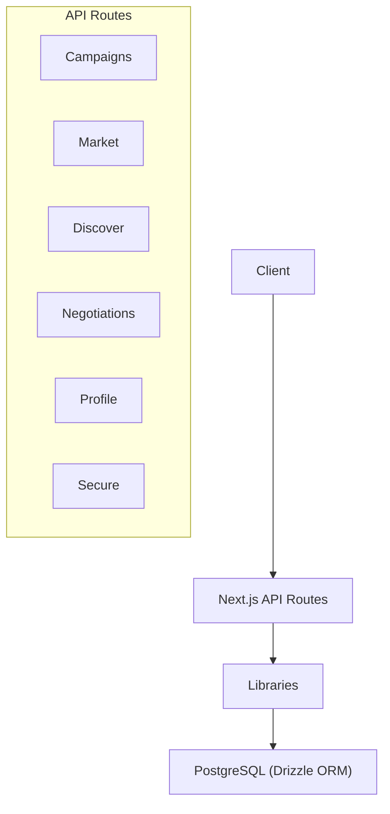
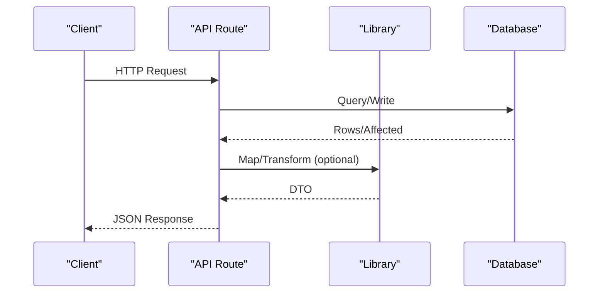
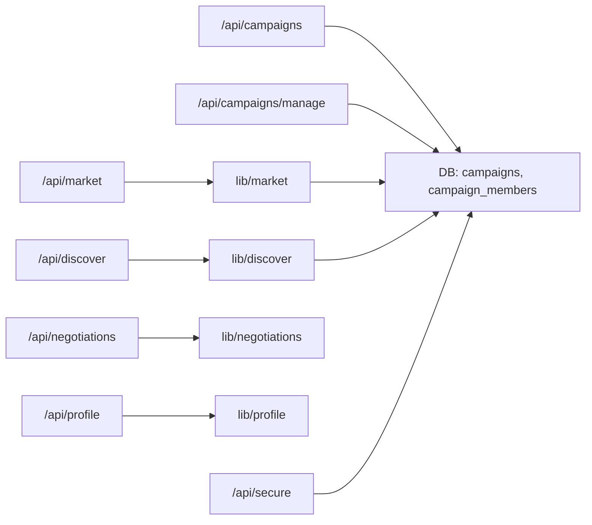

# API Reference

<cite>
**Referenced Files in This Document**
- [route.ts](file://src/app/api/campaigns/route.ts)
- [route.ts](file://src/app/api/campaigns/manage/route.ts)
- [route.ts](file://src/app/api/market/route.ts)
- [route.ts](file://src/app/api/negotiations/route.ts)
- [route.ts](file://src/app/api/profile/route.ts)
- [route.ts](file://src/app/api/discover/route.ts)
- [route.ts](file://src/app/api/secure/route.ts)
- [schema.ts](file://src/db/schema.ts)
- [market.ts](file://src/lib/market.ts)
- [discover.ts](file://src/lib/discover.ts)
- [negotiations.ts](file://src/lib/negotiations.ts)
- [profile.ts](file://src/lib/profile.ts)
- [package.json](file://package.json)
</cite>

## Table of Contents
1. [Introduction](#introduction)
2. [Project Structure](#project-structure)
3. [Core Components](#core-components)
4. [Architecture Overview](#architecture-overview)
5. [Detailed Component Analysis](#detailed-component-analysis)
6. [Dependency Analysis](#dependency-analysis)
7. [Performance Considerations](#performance-considerations)
8. [Troubleshooting Guide](#troubleshooting-guide)
9. [Conclusion](#conclusion)
10. [Appendices](#appendices)

## Introduction
This document provides a comprehensive API reference for PortVille Market’s RESTful endpoints. It covers campaigns management, marketplace operations, negotiations, profile management, discovery engine, and secure endpoints. For each endpoint, you will find HTTP methods, URL patterns, request/response schemas, authentication requirements, error handling, and practical examples. It also includes guidance on authentication mechanisms, rate limiting considerations, security best practices, client integration patterns, and versioning strategy.

## Project Structure
The API is implemented as Next.js App Router server routes under src/app/api. Each route file exposes GET and/or POST handlers that interact with the database via Drizzle ORM and return JSON responses. Business logic is split into reusable libraries (e.g., market, discover, negotiations, profile).

**Diagram sources**
- [route.ts:1-142](file://src/app/api/campaigns/route.ts#L1-L142)
- [route.ts:1-262](file://src/app/api/market/route.ts#L1-L262)
- [route.ts:1-77](file://src/app/api/discover/route.ts#L1-L77)
- [route.ts:1-13](file://src/app/api/negotiations/route.ts#L1-L13)
- [route.ts:1-13](file://src/app/api/profile/route.ts#L1-L13)
- [route.ts:1-535](file://src/app/api/secure/route.ts#L1-L535)
- [market.ts:1-50](file://src/lib/market.ts#L1-L50)
- [discover.ts:1-70](file://src/lib/discover.ts#L1-L70)
- [negotiations.ts:1-63](file://src/lib/negotiations.ts#L1-L63)
- [profile.ts:1-32](file://src/lib/profile.ts#L1-L32)

**Section sources**
- [package.json:1-45](file://package.json#L1-L45)

## Core Components
- Campaigns: List and create campaigns; manage campaign lifecycle (create/update/pause/resume/delete).
- Marketplace: List listings; create listings with social profile verification and metrics extraction.
- Discovery: List jobs/vacancies; create vacancies.
- Negotiations: Retrieve negotiation data (orders/offers).
- Profile: Retrieve profile summary.
- Secure: Unified write/read endpoint for cross-domain actions (campaigns, market, vacancies), engagement events, and approvals.

Authentication:
- Identity is passed via header x-user-id or body fields (userId, createdBy, actorId). Some endpoints default to demo or anonymous when missing.
- Role can be provided via header x-user-role or body fields (role).

Error handling:
- Validation errors return 400 with an error message.
- Not found returns 404.
- Unauthorized/missing identity returns 401 where enforced.
- Server errors return 500 with generic messages.

Rate limiting:
- No built-in rate limiting is present in these routes. Apply at reverse proxy or platform level if needed.

Versioning:
- No explicit version prefix is used. If versioning is required, introduce a path prefix (e.g., /api/v1/...) and deprecate older versions gradually.

Backwards compatibility:
- Many endpoints accept multiple field names (camelCase and snake_case) to support evolving clients.

**Section sources**
- [route.ts:1-142](file://src/app/api/campaigns/route.ts#L1-L142)
- [route.ts:1-179](file://src/app/api/campaigns/manage/route.ts#L1-L179)
- [route.ts:1-262](file://src/app/api/market/route.ts#L1-L262)
- [route.ts:1-77](file://src/app/api/discover/route.ts#L1-L77)
- [route.ts:1-13](file://src/app/api/negotiations/route.ts#L1-L13)
- [route.ts:1-13](file://src/app/api/profile/route.ts#L1-L13)
- [route.ts:1-535](file://src/app/api/secure/route.ts#L1-L535)

## Architecture Overview
The API follows a layered approach:
- Route handlers parse requests, validate inputs, and delegate to domain libraries or direct DB calls.
- Libraries encapsulate business logic (e.g., mapping rows, computing derived metrics).
- Database schema defines entities: campaigns, campaign_members, vacancies, market_listings, engagement_events.

**Diagram sources**
- [route.ts:1-142](file://src/app/api/campaigns/route.ts#L1-L142)
- [route.ts:1-262](file://src/app/api/market/route.ts#L1-L262)
- [route.ts:1-77](file://src/app/api/discover/route.ts#L1-L77)
- [route.ts:1-535](file://src/app/api/secure/route.ts#L1-L535)
- [market.ts:1-50](file://src/lib/market.ts#L1-L50)
- [discover.ts:1-70](file://src/lib/discover.ts#L1-L70)

## Detailed Component Analysis

### Campaigns API
Endpoints:
- GET /api/campaigns
  - Purpose: List campaigns with optional filtering by user context.
  - Auth: Optional x-user-id or query userId to compute membership flags.
  - Query params:
    - filter: created | joined | (default active)
  - Success response: Array of campaign objects.
  - Errors: 500 on DB failure.

- POST /api/campaigns
  - Purpose: Create a new campaign.
  - Auth: Optional x-user-id or body.userId/body.createdBy.
  - Body fields (examples): title, description, category, nicheHashtag, totalBudget, timeRemainingDays, communitySize, publisherRating.
  - Success response: { ok: true, item: Campaign }
  - Errors: 400 validation, 500 server error.

- POST /api/campaigns/manage
  - Purpose: Manage campaign lifecycle.
  - Auth: Optional x-user-id or body.userId/body.createdBy.
  - Body fields: action (create|update|pause|resume|delete), campaignId/id, plus fields per action.
  - Success responses vary by action; delete/update/pause/resume return confirmation or updated entity.
  - Errors: 400 validation, 403 unauthorized (non-creator), 404 not found, 500 server error.

Request/Response Schema Notes:
- Campaign object includes id, projectName/title, description, category, status, budget fields, metrics, requiredPlatforms array, dates, and creator info.
- Management supports both camelCase and snake_case fields for flexibility.

Example Calls:
- GET /api/campaigns?filter=joined&x-user-id=user123
- POST /api/campaigns with { title, description, category, nicheHashtag, totalBudget, timeRemainingDays }
- POST /api/campaigns/manage with { action: "create", title, description, ... }

**Section sources**
- [route.ts:1-142](file://src/app/api/campaigns/route.ts#L1-L142)
- [route.ts:1-179](file://src/app/api/campaigns/manage/route.ts#L1-L179)
- [schema.ts:3-35](file://src/db/schema.ts#L3-L35)

### Marketplace API
Endpoints:
- GET /api/market
  - Purpose: List marketplace listings.
  - Success response: Array of market cards.
  - Errors: 500 on failure.

- POST /api/market
  - Purpose: Create a marketplace listing with social profile verification.
  - Auth: Optional createdBy/userId/x-user-id; defaults to anonymous.
  - Body fields: profileUrl, description, niche, price.
  - Behavior: Validates and verifies social profile URL; extracts metrics; persists listing; computes views from metrics.
  - Success response: { ok: true, item: Listing }
  - Errors: 400 validation or verification failures; 500 server error.

Example Calls:
- GET /api/market
- POST /api/market with { profileUrl: "https://instagram.com/@handle", description: "...", niche: "Growth", price: 100 }

**Section sources**
- [route.ts:1-262](file://src/app/api/market/route.ts#L1-L262)
- [market.ts:1-50](file://src/lib/market.ts#L1-L50)
- [schema.ts:58-73](file://src/db/schema.ts#L58-L73)

### Discovery Engine API
Endpoints:
- GET /api/discover
  - Purpose: List job vacancies for discovery.
  - Success response: Array of job offers.
  - Errors: 500 on failure.

- POST /api/discover
  - Purpose: Create a vacancy.
  - Auth: Optional createdBy/userId/x-user-id; defaults to anonymous.
  - Body fields: title, description, category/niche, employerName/employer_name, daysRemaining/days_remaining, requiredPeople/required_people/vacant, minSalary/min_salary, maxSalary/max_salary, skills/requirements (array or comma-separated string).
  - Success response: { ok: true, item: Vacancy }
  - Errors: 400 validation, 500 server error.

Example Calls:
- GET /api/discover
- POST /api/discover with { title, description, category, employerName, daysRemaining, requiredPeople, minSalary, maxSalary, skills: ["React","Node"] }

**Section sources**
- [route.ts:1-77](file://src/app/api/discover/route.ts#L1-L77)
- [discover.ts:1-70](file://src/lib/discover.ts#L1-L70)
- [schema.ts:37-56](file://src/db/schema.ts#L37-L56)

### Negotiations API
Endpoints:
- GET /api/negotiations
  - Purpose: Retrieve negotiation data (orders and offers).
  - Success response: { orders: [], offers: [] }
  - Errors: 500 on failure.

Example Calls:
- GET /api/negotiations

**Section sources**
- [route.ts:1-13](file://src/app/api/negotiations/route.ts#L1-L13)
- [negotiations.ts:1-63](file://src/lib/negotiations.ts#L1-L63)

### Profile API
Endpoints:
- GET /api/profile
  - Purpose: Retrieve profile summary.
  - Success response: ProfileSummary object.
  - Errors: 500 on failure.

Example Calls:
- GET /api/profile

**Section sources**
- [route.ts:1-13](file://src/app/api/profile/route.ts#L1-L13)
- [profile.ts:1-32](file://src/lib/profile.ts#L1-L32)

### Secure API
Endpoints:
- GET /api/secure
  - Purpose: Aggregate read access to recent vacancies, campaigns, user’s market listings, and activity/events.
  - Auth: Optional x-user-id; defaults to demo-user.
  - Success response: { vacancies, campaigns, marketListings, activity, joinedCampaigns }
  - Errors: 500 on failure.

- POST /api/secure
  - Purpose: Unified write endpoint supporting multiple modes:
    - create_discover: Create a vacancy.
    - create_campaign: Create a campaign and log event.
    - create_market: Create a market listing and log event.
    - pause_vacancy: Toggle vacancy status.
    - delete_vacancy: Delete vacancy and related events.
    - pause_campaign: Toggle campaign status.
    - delete_campaign: Delete campaign and log deletion event.
    - pause_listing: Toggle market listing status.
    - update_listing: Update listing price and log event.
    - delete_listing: Delete listing and related events.
    - interact: Log engagement event.
    - update_campaign: Update campaign fields (payouts, start date) and log event.
    - update_campaign_status: Set campaign status and log event.
    - approve_campaign_submission: Approve or mark pending and log event.
  - Auth: Requires userId via x-user-id or body fields; role via x-user-role or body.role.
  - Success responses vary by mode; often include affected entity or confirmation.
  - Errors: 400 validation, 401 missing identity, 404 not found, 500 server error.

Example Calls:
- GET /api/secure?x-user-id=user123
- POST /api/secure with { mode: "create_campaign", title, description, category, totalBudget, timeRemainingDays, startDate, minPayout, maxPayout, publishFee, requiredPlatforms }
- POST /api/secure with { mode: "interact", entityType: "campaign", entityId: 123, actionType: "join", message: "Joined campaign" }

**Section sources**
- [route.ts:1-535](file://src/app/api/secure/route.ts#L1-L535)
- [schema.ts:3-84](file://src/db/schema.ts#L3-L84)

## Dependency Analysis
High-level dependencies between routes and libraries:

**Diagram sources**
- [route.ts:1-142](file://src/app/api/campaigns/route.ts#L1-L142)
- [route.ts:1-179](file://src/app/api/campaigns/manage/route.ts#L1-L179)
- [route.ts:1-262](file://src/app/api/market/route.ts#L1-L262)
- [route.ts:1-77](file://src/app/api/discover/route.ts#L1-L77)
- [route.ts:1-13](file://src/app/api/negotiations/route.ts#L1-L13)
- [route.ts:1-13](file://src/app/api/profile/route.ts#L1-L13)
- [route.ts:1-535](file://src/app/api/secure/route.ts#L1-L535)
- [market.ts:1-50](file://src/lib/market.ts#L1-L50)
- [discover.ts:1-70](file://src/lib/discover.ts#L1-L70)
- [negotiations.ts:1-63](file://src/lib/negotiations.ts#L1-L63)
- [profile.ts:1-32](file://src/lib/profile.ts#L1-L32)
- [schema.ts:1-84](file://src/db/schema.ts#L1-L84)

**Section sources**
- [schema.ts:1-84](file://src/db/schema.ts#L1-L84)

## Performance Considerations
- Use pagination or limit parameters where applicable to avoid large payloads.
- Cache read-heavy endpoints (e.g., /api/market, /api/discover) at CDN or application layer if traffic increases.
- Avoid synchronous heavy work in request handlers; external fetches (social verification) should be optimized or offloaded.
- Batch writes where possible; the secure endpoint logs engagement events alongside mutations.

[No sources needed since this section provides general guidance]

## Troubleshooting Guide
Common issues and resolutions:
- Missing identity: Provide x-user-id or userId in body for authenticated endpoints.
- Validation errors: Ensure required fields are present; check exact field names and types.
- Social profile verification fails: Verify URL format and supported platforms; ensure public profiles accessible.
- Not found: Confirm entity IDs exist before updates/deletes.
- Server errors: Check logs for DB connectivity or unexpected exceptions.

Error response pattern:
- 400: { error: "..." }
- 401: { error: "A user identity is required" }
- 404: { error: "Entity not found" }
- 500: { error: "Unable to process request" }

**Section sources**
- [route.ts:1-142](file://src/app/api/campaigns/route.ts#L1-L142)
- [route.ts:1-262](file://src/app/api/market/route.ts#L1-L262)
- [route.ts:1-77](file://src/app/api/discover/route.ts#L1-L77)
- [route.ts:1-535](file://src/app/api/secure/route.ts#L1-L535)

## Conclusion
PortVille Market’s API provides robust endpoints for campaigns, marketplace, discovery, negotiations, profile, and secure multi-entity operations. The design emphasizes flexible input parsing, clear error signaling, and separation of concerns via libraries. Adopt recommended authentication headers, implement client-side retries and error handling, and consider adding rate limiting and versioning as your usage scales.

[No sources needed since this section summarizes without analyzing specific files]

## Appendices

### Authentication and Security Notes
- Identity: Prefer x-user-id header; fallback to body fields when necessary.
- Role: Pass x-user-role or body.role for role-based flows.
- External calls: Social verification uses outbound HTTP; ensure environment allows such requests and handle timeouts/retries gracefully.
- Data validation: All endpoints perform basic validation; enforce stricter rules at the client side as well.

[No sources needed since this section provides general guidance]

### Client Implementation Guidelines
- Always set Content-Type: application/json for POST requests.
- Include x-user-id for authenticated actions.
- Handle error responses uniformly; retry transient 5xx errors with backoff.
- Normalize field names; many endpoints accept both camelCase and snake_case variants.

[No sources needed since this section provides general guidance]

### Versioning Strategy and Backwards Compatibility
- Current state: No version prefix.
- Recommended approach: Introduce /api/v1/... and maintain v1 until all clients migrate; then deprecate and remove.
- Maintain backwards compatibility by accepting multiple field names and providing stable response shapes.

[No sources needed since this section provides general guidance]