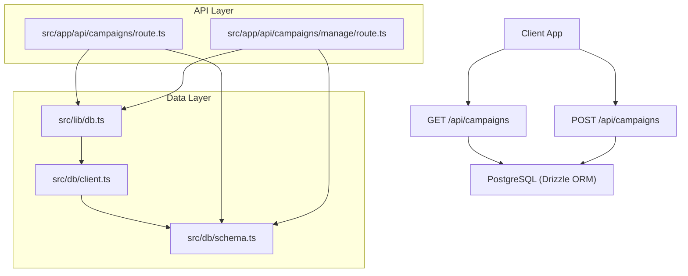
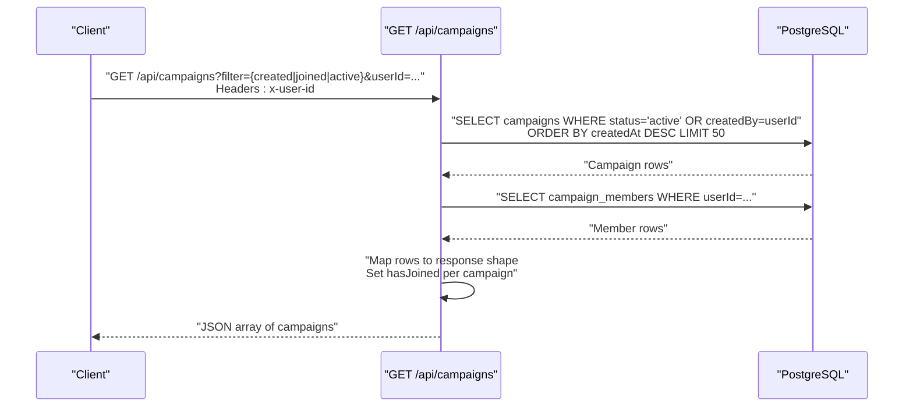
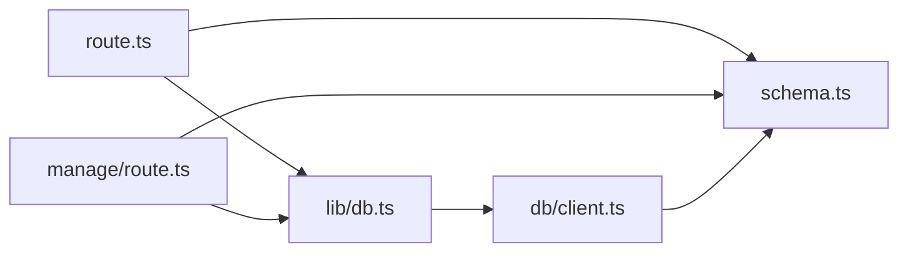
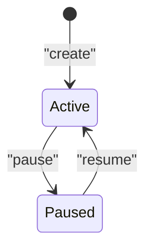
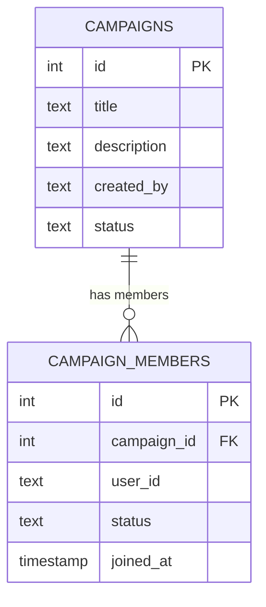

# Campaigns API

<cite>
**Referenced Files in This Document**
- [route.ts](file://src/app/api/campaigns/route.ts)
- [manage/route.ts](file://src/app/api/campaigns/manage/route.ts)
- [schema.ts](file://src/db/schema.ts)
- [client.ts](file://src/db/client.ts)
- [db.ts](file://src/lib/db.ts)
- [campaign.ts](file://src/types/campaign.ts)
</cite>

## Table of Contents
1. [Introduction](#introduction)
2. [Project Structure](#project-structure)
3. [Core Components](#core-components)
4. [Architecture Overview](#architecture-overview)
5. [Detailed Component Analysis](#detailed-component-analysis)
6. [Dependency Analysis](#dependency-analysis)
7. [Performance Considerations](#performance-considerations)
8. [Troubleshooting Guide](#troubleshooting-guide)
9. [Conclusion](#conclusion)

## Introduction
This document provides comprehensive API documentation for the Campaigns management endpoints, focusing on:
- GET /api/campaigns: Retrieve campaigns with filtering by created, joined, or active context using user identity via x-user-id header or userId query parameter.
- POST /api/campaigns: Create new campaigns with required and optional fields, validation rules, and response schema.

It also explains campaign status lifecycle, member relationships, budget tracking mechanisms, authentication requirements, error handling patterns, and integration guidelines.

## Project Structure
The Campaigns API is implemented as Next.js Route Handlers under src/app/api/campaigns. The core logic resides in route handlers that interact with a PostgreSQL database via Drizzle ORM. Data models are defined in the schema module, and database initialization is handled by the client module.

**Diagram sources**
- [route.ts:1-142](file://src/app/api/campaigns/route.ts#L1-L142)
- [manage/route.ts:1-179](file://src/app/api/campaigns/manage/route.ts#L1-L179)
- [schema.ts:1-84](file://src/db/schema.ts#L1-L84)
- [client.ts:61-145](file://src/db/client.ts#L61-L145)
- [db.ts:1-5](file://src/lib/db.ts#L1-L5)

**Section sources**
- [route.ts:1-142](file://src/app/api/campaigns/route.ts#L1-L142)
- [manage/route.ts:1-179](file://src/app/api/campaigns/manage/route.ts#L1-L179)
- [schema.ts:1-84](file://src/db/schema.ts#L1-L84)
- [client.ts:61-145](file://src/db/client.ts#L61-L145)
- [db.ts:1-5](file://src/lib/db.ts#L1-L5)

## Core Components
- GET /api/campaigns: Retrieves campaigns with filtering options based on user context. Supports filters: created, joined, and default active view. User identity is resolved from x-user-id header or userId query parameter; defaults to demo-user if not provided.
- POST /api/campaigns: Creates a new campaign with required fields title and description, and optional fields including category, nicheHashtag, totalBudget, timeRemainingDays, communitySize, publisherRating. Returns the created campaign object.

Key behaviors:
- Authentication: Lightweight identity resolution via x-user-id header or userId query parameter. No token verification is performed at this layer.
- Filtering: 
  - created: returns campaigns where createdBy equals the current userId.
  - joined: returns campaigns where the user has an active membership.
  - default: returns active campaigns only.
- Response mapping: Each campaign row is mapped to a consistent shape including metrics like viewsGenerated, likesGenerated, totalBudget, budgetUsed, highestMcp, requiredPlatforms, startDate, minPayout, maxPayout, and hasJoined flag indicating membership.

**Section sources**
- [route.ts:46-98](file://src/app/api/campaigns/route.ts#L46-L98)
- [route.ts:100-142](file://src/app/api/campaigns/route.ts#L100-L142)
- [schema.ts:3-27](file://src/db/schema.ts#L3-L27)

## Architecture Overview
The API follows a simple request-to-database flow:
- Request arrives at Next.js route handler.
- Handler resolves user identity and parses parameters/body.
- Handler executes queries against PostgreSQL via Drizzle ORM.
- Results are mapped to a stable JSON structure and returned.

**Diagram sources**
- [route.ts:46-98](file://src/app/api/campaigns/route.ts#L46-L98)
- [schema.ts:3-35](file://src/db/schema.ts#L3-L35)

## Detailed Component Analysis

### GET /api/campaigns
Purpose:
- List campaigns with filtering by user context.
- Provide membership status via hasJoined field.

Request:
- Method: GET
- Path: /api/campaigns
- Headers:
  - x-user-id: string (optional; overrides userId query param)
- Query Parameters:
  - filter: string (optional; values: created, joined, or omitted for active)
  - userId: string (optional; fallback when x-user-id is absent)

Filtering behavior:
- created: returns campaigns created by the specified user.
- joined: returns campaigns where the user has an active membership.
- default: returns all active campaigns.

Response:
- Status codes:
  - 200: Success with JSON array of campaign objects.
  - 500: Internal server error returns empty array.
- Body: Array of campaign objects with fields:
  - id: string
  - projectName: string (mapped from title)
  - publisherUsername: string (mapped from createdBy)
  - publisherProfileIcon: string
  - publisherRating: number
  - timeRemainingDays: number
  - nicheHashtag: string
  - description: string
  - category: string
  - status: string
  - communitySize: number
  - viewsGenerated: number
  - likesGenerated: number
  - totalBudget: number
  - budgetUsed: number
  - highestMcp: number
  - requiredPlatforms: string[]
  - hasJoined: boolean
  - startDate: string (ISO timestamp or empty)
  - minPayout: number (nullable)
  - maxPayout: number (nullable)
  - createdAt: string (timestamp)

Error handling:
- Validation errors: Not applicable for GET; missing identity defaults to demo-user.
- Database errors: Caught and return 500 with empty array.

Integration notes:
- Use x-user-id header for identity; alternatively provide userId query parameter.
- For joined campaigns, ensure the user has an active membership record in campaign_members.

**Section sources**
- [route.ts:46-98](file://src/app/api/campaigns/route.ts#L46-L98)
- [schema.ts:3-35](file://src/db/schema.ts#L3-L35)

### POST /api/campaigns
Purpose:
- Create a new campaign with required and optional fields.

Request:
- Method: POST
- Path: /api/campaigns
- Headers:
  - x-user-id: string (optional; used to set createdBy)
- Body (JSON):
  - Required:
    - title: string
    - description: string
  - Optional:
    - category: string (default: Technology)
    - nicheHashtag: string (default: growth)
    - totalBudget: number (default: 1000)
    - timeRemainingDays: number (default: 14)
    - communitySize: number (default: 12000)
    - publisherRating: number (default: 4.8)
    - userId: string (fallback for identity)
    - createdBy: string (fallback for identity)

Validation rules:
- title and description must be present and non-empty; otherwise returns 400 with error message.
- Numeric fields are coerced to numbers with safe fallbacks.

Response:
- Status codes:
  - 200: Success with { ok: true, item: campaignObject }
  - 400: Validation error with { error: "Title and description are required" }
  - 500: Server error with { error: "Unable to create campaign" }
- Body:
  - campaignObject includes all mapped fields similar to GET response, plus createdAt timestamp.

Error handling:
- Parsing errors: Body parsed safely; invalid JSON results in empty object.
- Database errors: Caught and return 500 with error message.

Integration notes:
- Ensure x-user-id is set to attribute the campaign to a user.
- Defaults are applied for optional fields; adjust as needed for your use case.

**Section sources**
- [route.ts:100-142](file://src/app/api/campaigns/route.ts#L100-L142)
- [schema.ts:3-27](file://src/db/schema.ts#L3-L27)

### Campaign Management Endpoint (Reference)
While not part of the primary objective, the manage endpoint supports additional operations such as update, pause/resume, and delete. It enforces creator-only permissions and uses action-based routing.

- POST /api/campaigns/manage
- Actions: create, update, pause, resume, delete
- Permissions: Only the campaign creator can modify or delete.

**Section sources**
- [manage/route.ts:55-179](file://src/app/api/campaigns/manage/route.ts#L55-L179)

## Dependency Analysis
The Campaigns API depends on:
- Drizzle ORM for type-safe queries.
- PostgreSQL schema definitions for campaigns and campaign_members.
- Database client for connection pooling and schema initialization.

**Diagram sources**
- [route.ts:1-142](file://src/app/api/campaigns/route.ts#L1-L142)
- [manage/route.ts:1-179](file://src/app/api/campaigns/manage/route.ts#L1-L179)
- [schema.ts:1-84](file://src/db/schema.ts#L1-L84)
- [client.ts:1-152](file://src/db/client.ts#L1-L152)
- [db.ts:1-5](file://src/lib/db.ts#L1-L5)

**Section sources**
- [route.ts:1-142](file://src/app/api/campaigns/route.ts#L1-L142)
- [manage/route.ts:1-179](file://src/app/api/campaigns/manage/route.ts#L1-L179)
- [schema.ts:1-84](file://src/db/schema.ts#L1-L84)
- [client.ts:1-152](file://src/db/client.ts#L1-L152)
- [db.ts:1-5](file://src/lib/db.ts#L1-L5)

## Performance Considerations
- Query limits: GET /api/campaigns applies a limit of 50 rows to prevent large payloads.
- Indexing: Ensure indexes on campaigns.createdBy, campaigns.status, and campaign_members.userId for efficient filtering and membership checks.
- Pagination: Consider adding pagination parameters (page, limit) for large datasets.
- Caching: Introduce client-side caching or server-side caching for repeated reads to reduce database load.
- Connection pooling: Database pool size is configured; monitor usage under high concurrency.

[No sources needed since this section provides general guidance]

## Troubleshooting Guide
Common issues and resolutions:
- Missing identity: If x-user-id and userId are not provided, the system defaults to demo-user. Set appropriate headers or query params.
- Validation failures: Ensure title and description are present for POST requests. Check error responses for 400 status.
- Permission errors: For management actions, only the campaign creator can update/pause/resume/delete. Verify createdBy matches the authenticated user.
- Database errors: Errors during read/write operations return 500 status. Inspect server logs for details.

Error response patterns:
- 400: Validation errors with descriptive messages.
- 403: Authorization errors when unauthorized users attempt modifications.
- 404: Resource not found for certain management actions.
- 500: Internal server errors with generic messages.

**Section sources**
- [route.ts:94-98](file://src/app/api/campaigns/route.ts#L94-L98)
- [route.ts:113-115](file://src/app/api/campaigns/route.ts#L113-L115)
- [manage/route.ts:63-65](file://src/app/api/campaigns/manage/route.ts#L63-L65)
- [manage/route.ts:110-117](file://src/app/api/campaigns/manage/route.ts#L110-L117)
- [manage/route.ts:120-122](file://src/app/api/campaigns/manage/route.ts#L120-L122)
- [manage/route.ts:150-152](file://src/app/api/campaigns/manage/route.ts#L150-L152)
- [manage/route.ts:165-167](file://src/app/api/campaigns/manage/route.ts#L165-L167)

## Conclusion
The Campaigns API provides straightforward endpoints for retrieving and creating campaigns with robust filtering and identity resolution. The design emphasizes simplicity and safety through defaults, validation, and permission checks. For production use, consider enhancing authentication, adding pagination, and optimizing database queries with proper indexing.

[No sources needed since this section summarizes without analyzing specific files]

## Appendices

### Campaign Status Lifecycle
- Default status: active upon creation.
- Manageable statuses: active, paused.
- Creator-only actions: update, pause, resume, delete.

**Diagram sources**
- [manage/route.ts:149-162](file://src/app/api/campaigns/manage/route.ts#L149-L162)

### Member Relationships
- Users join campaigns via campaign_members table with active status.
- Membership influences filtering for joined campaigns and sets hasJoined flag in responses.

**Diagram sources**
- [schema.ts:3-35](file://src/db/schema.ts#L3-L35)

### Budget Tracking Mechanisms
- Fields:
  - totalBudget: maximum budget allocated to the campaign.
  - budgetUsed: amount spent so far.
- Updates:
  - Managed via update actions in the manage endpoint; ensure consistency with business logic.

**Section sources**
- [schema.ts:16-17](file://src/db/schema.ts#L16-L17)
- [manage/route.ts:124-136](file://src/app/api/campaigns/manage/route.ts#L124-L136)