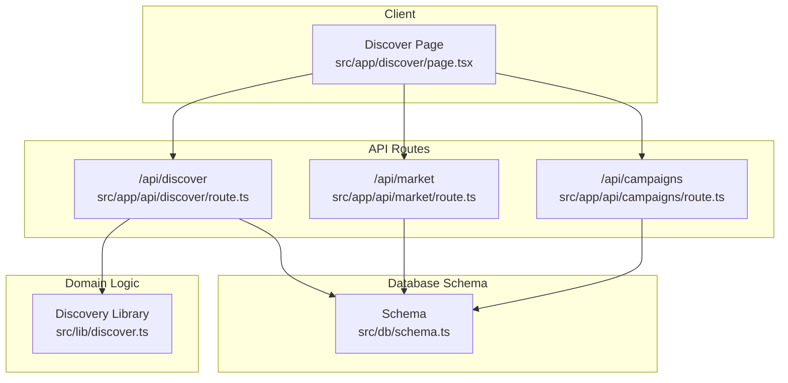
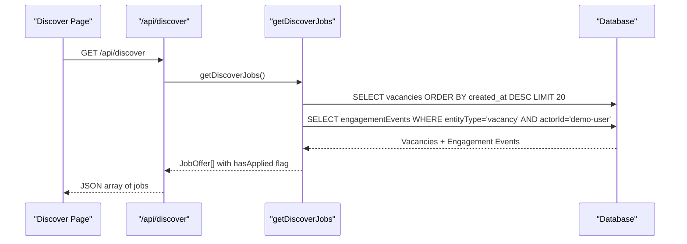
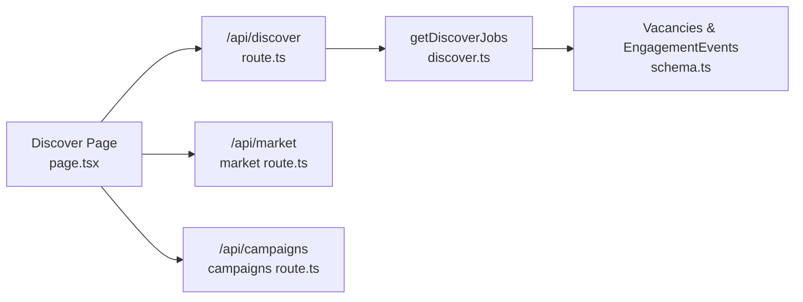

# Discovery Engine API

<cite>
**Referenced Files in This Document**
- [route.ts](file://src/app/api/discover/route.ts)
- [discover.ts](file://src/lib/discover.ts)
- [schema.ts](file://src/db/schema.ts)
- [data.ts](file://src/components/job-card/data.ts)
- [page.tsx](file://src/app/discover/page.tsx)
- [market route.ts](file://src/app/api/market/route.ts)
- [campaigns route.ts](file://src/app/api/campaigns/route.ts)
</cite>

## Table of Contents
1. [Introduction](#introduction)
2. [Project Structure](#project-structure)
3. [Core Components](#core-components)
4. [Architecture Overview](#architecture-overview)
5. [Detailed Component Analysis](#detailed-component-analysis)
6. [Dependency Analysis](#dependency-analysis)
7. [Performance Considerations](#performance-considerations)
8. [Troubleshooting Guide](#troubleshooting-guide)
9. [Conclusion](#conclusion)

## Introduction
This document provides comprehensive API documentation for the Discovery and recommendation engine endpoints that power content discovery, personalized recommendations, trending items, and search functionality within the application. It covers request parameters for filtering, sorting, and pagination; response schemas for discovered jobs, market listings, and campaigns; personalization factors and relevance scoring mechanisms; example queries; and performance considerations including caching strategies and integration patterns.

## Project Structure
The discovery feature spans server-side API routes, a domain library for data retrieval and mapping, database schema definitions, and client-side pages that implement search, filters, and sorting.

**Diagram sources**
- [page.tsx:39-53](file://src/app/discover/page.tsx#L39-L53)
- [route.ts:15-23](file://src/app/api/discover/route.ts#L15-L23)
- [discover.ts:47-69](file://src/lib/discover.ts#L47-L69)
- [schema.ts:37-83](file://src/db/schema.ts#L37-L83)

**Section sources**
- [page.tsx:1-335](file://src/app/discover/page.tsx#L1-L335)
- [route.ts:1-77](file://src/app/api/discover/route.ts#L1-L77)
- [discover.ts:1-70](file://src/lib/discover.ts#L1-L70)
- [schema.ts:1-84](file://src/db/schema.ts#L1-L84)

## Core Components
- Discovery API (/api/discover): GET returns recent vacancies with personalization flags; POST creates new vacancy listings.
- Market API (/api/market): GET lists marketplace items; POST verifies social profiles and creates listings with derived metrics.
- Campaigns API (/api/campaigns): GET retrieves campaigns with optional user-based filters; POST creates campaigns.
- Discovery Library (lib/discover.ts): Fetches vacancies and engagement events to compute personalization signals such as “has applied”.
- Client Discover Page: Implements live search, filters, and sorting over returned job data.

Key responsibilities:
- Data retrieval and mapping from database tables to typed models.
- Personalization by analyzing user engagement history.
- Search and sort logic on the client side for responsiveness.
- Validation and error handling in API routes.

**Section sources**
- [route.ts:15-76](file://src/app/api/discover/route.ts#L15-L76)
- [discover.ts:4-69](file://src/lib/discover.ts#L4-L69)
- [market route.ts:164-261](file://src/app/api/market/route.ts#L164-L261)
- [campaigns route.ts:46-141](file://src/app/api/campaigns/route.ts#L46-L141)
- [page.tsx:22-104](file://src/app/discover/page.tsx#L22-L104)

## Architecture Overview
The discovery flow begins at the client page, which fetches data from /api/discover. The route calls the discovery library to query vacancies and engagement events, then maps results into a unified model used by the UI. Personalization is computed by checking the latest user action per vacancy.

**Diagram sources**
- [page.tsx:39-53](file://src/app/discover/page.tsx#L39-L53)
- [route.ts:15-23](file://src/app/api/discover/route.ts#L15-L23)
- [discover.ts:47-69](file://src/lib/discover.ts#L47-L69)
- [schema.ts:37-83](file://src/db/schema.ts#L37-L83)

## Detailed Component Analysis

### Discovery API: GET /api/discover
Purpose:
- Return a curated list of recent vacancies with personalization indicators.

Request:
- Method: GET
- Headers: None required
- Query Parameters: Not implemented in this route

Response:
- Array of JobOffer objects with fields including id, employerName, handle, rating, title, niche, daysRemaining, requiredPeople, applicants, accepted, requirements, minSalary, maxSalary, description, status, statusUpdatedAt, increaseCount, hasApplied.

Personalization:
- hasApplied is true if the latest engagement event for the vacancy by the demo user was an apply action.

Error Handling:
- On failure, returns an empty array with HTTP 500.

Example Request:
- GET /api/discover

Example Response:
- JSON array of JobOffer objects.

**Section sources**
- [route.ts:15-23](file://src/app/api/discover/route.ts#L15-L23)
- [discover.ts:47-69](file://src/lib/discover.ts#L47-L69)
- [data.ts:1-22](file://src/components/job-card/data.ts#L1-L22)

### Discovery API: POST /api/discover
Purpose:
- Create a new vacancy listing with validation and defaults.

Request Body Fields:
- title (string, required)
- description (string, required)
- category or niche (string, default 'general')
- createdBy, userId, or x-user-id header (string, default 'anonymous')
- employerName or employer_name (string, default 'Employer')
- daysRemaining or days_remaining (number, default 14)
- requiredPeople, required_people, or vacant (number, default 1)
- minSalary or min_salary (number, default 0)
- maxSalary or max_salary (number, default 0)
- skills or requirements (string or string[], comma-separated if string)

Validation:
- Returns 400 if title or description are missing.

Response:
- { ok: true, item: created vacancy }

Error Handling:
- Returns 500 with error message on failure.

Example Request:
- POST /api/discover
- Body: { title: "Frontend Developer", description: "Build UI components", skills: ["React","TypeScript"], minSalary: 500000, maxSalary: 1200000 }

Example Response:
- { ok: true, item: { ... vacancy fields ... } }

**Section sources**
- [route.ts:25-76](file://src/app/api/discover/route.ts#L25-L76)
- [schema.ts:37-56](file://src/db/schema.ts#L37-L56)

### Discovery Library: getDiscoverJobs
Responsibilities:
- Fetch recent vacancies ordered by creation date with a limit.
- Fetch engagement events for vacancies filtered by entity type and actor.
- Compute latest action per vacancy to set hasApplied.
- Map database rows to JobOffer model.

Complexity:
- O(N) for vacancy rows and O(M) for engagement events; final mapping is O(N).

Optimization Opportunities:
- Add indexes on engagementEvents.entityType, engagementEvents.actorId, engagementEvents.action.
- Consider batching or windowed queries for large datasets.

**Section sources**
- [discover.ts:4-69](file://src/lib/discover.ts#L4-L69)
- [schema.ts:75-83](file://src/db/schema.ts#L75-L83)

### Client Discover Page: Search, Filters, Sorting
Features:
- Live search across employer name, job title, requirements, and required people count.
- Sorting options: newest, applicants, payment (by max salary), vacants (spots left).
- Empty states and result counts based on search matches.

Sorting Rules:
- Newest: by ID descending.
- Applicants: ascending applicant count.
- Payment: descending max salary.
- Vacants: descending spots remaining (requiredPeople - accepted).

Integration:
- Fetches data from /api/discover and renders cards via JobCard component.

**Section sources**
- [page.tsx:22-104](file://src/app/discover/page.tsx#L22-L104)
- [page.tsx:271-302](file://src/app/discover/page.tsx#L271-L302)

### Market API: GET /api/market
Purpose:
- Retrieve marketplace listings.

Response:
- Array of market card objects.

Error Handling:
- Returns empty array with HTTP 500 on failure.

**Section sources**
- [market route.ts:164-172](file://src/app/api/market/route.ts#L164-L172)

### Market API: POST /api/market
Purpose:
- Create a marketplace listing by verifying a social media profile URL and deriving metrics.

Request Body Fields:
- profileUrl (string, required)
- description (string, required)
- price (number, optional)
- niche (string, optional)
- createdBy or userId or x-user-id header (string)

Validation:
- Returns 400 if profileUrl or description are missing.
- Verifies supported platforms and extracts metrics; throws errors if invalid.

Response:
- { ok: true, item: { id, title, description, price, profileUrl, platform, handle, followers, likes, views, engagementRate, niche, createdBy, status, createdAt } }

Metrics Derivation:
- Views calculated from followers, likes, and engagement rate.

**Section sources**
- [market route.ts:174-261](file://src/app/api/market/route.ts#L174-L261)

### Campaigns API: GET /api/campaigns
Purpose:
- Retrieve campaigns with optional user-based filtering.

Query Parameters:
- filter: 'created', 'joined', or omitted (defaults to active campaigns)
- userId: from header or query param (default 'demo-user')

Response:
- Array of campaign objects mapped from database rows, including membership flags.

Error Handling:
- Returns empty array with HTTP 500 on failure.

**Section sources**
- [campaigns route.ts:46-98](file://src/app/api/campaigns/route.ts#L46-L98)

### Campaigns API: POST /api/campaigns
Purpose:
- Create a new campaign with validation and defaults.

Request Body Fields:
- title (string, required)
- description (string, required)
- category (string, default 'Technology')
- nicheHashtag or niche (string, default 'growth')
- totalBudget or budget (number, default 1000)
- timeRemainingDays or daysRemaining (number, default 14)
- communitySize (number, default 12000)
- publisherRating (number, default 4.8)

Validation:
- Returns 400 if title or description are missing.

Response:
- { ok: true, item: mapped campaign object }

Error Handling:
- Returns 500 with error message on failure.

**Section sources**
- [campaigns route.ts:100-141](file://src/app/api/campaigns/route.ts#L100-L141)

## Dependency Analysis
The discovery system depends on:
- Database schema for vacancies and engagement events.
- Discovery library for querying and mapping data.
- Client page for search and sorting logic.
- Market and Campaign APIs for related discovery surfaces.

**Diagram sources**
- [page.tsx:39-53](file://src/app/discover/page.tsx#L39-L53)
- [route.ts:15-23](file://src/app/api/discover/route.ts#L15-L23)
- [discover.ts:47-69](file://src/lib/discover.ts#L47-L69)
- [schema.ts:37-83](file://src/db/schema.ts#L37-L83)
- [market route.ts:164-261](file://src/app/api/market/route.ts#L164-L261)
- [campaigns route.ts:46-141](file://src/app/api/campaigns/route.ts#L46-L141)

**Section sources**
- [discover.ts:47-69](file://src/lib/discover.ts#L47-L69)
- [schema.ts:37-83](file://src/db/schema.ts#L37-L83)
- [page.tsx:39-53](file://src/app/discover/page.tsx#L39-L53)

## Performance Considerations
- Limiting Results: Discovery queries use a fixed limit to reduce payload size and improve load times.
- Indexing: Ensure indexes on frequently queried columns like engagementEvents.entityType, actorId, and action to speed up personalization lookups.
- Client-Side Filtering and Sorting: Implemented in the discover page for instant feedback without additional server requests.
- Error Resilience: APIs return safe defaults (empty arrays) on failures to avoid breaking UI flows.
- External Calls: Market API performs external verification for social profiles; consider caching verified profiles and metrics to reduce latency and network overhead.

[No sources needed since this section provides general guidance]

## Troubleshooting Guide
Common Issues:
- Missing Required Fields: POST endpoints validate required fields and return 400 errors with descriptive messages.
- Database Unavailable: Market API gracefully falls back to local payloads when the database is unavailable.
- No Results: Discover page shows appropriate empty states when no vacancies exist or search yields no matches.

Debugging Steps:
- Check API responses for error messages.
- Verify input fields match expected types and formats.
- Inspect client console logs for fetch errors.
- Validate database schema and ensure migrations have run.

**Section sources**
- [route.ts:34-36](file://src/app/api/discover/route.ts#L34-L36)
- [market route.ts:185-191](file://src/app/api/market/route.ts#L185-L191)
- [campaigns route.ts:113-115](file://src/app/api/campaigns/route.ts#L113-L115)
- [page.tsx:271-302](file://src/app/discover/page.tsx#L271-L302)

## Conclusion
The Discovery Engine integrates API routes, domain logic, and client-side features to deliver personalized content discovery, search, and sorting. The system emphasizes simplicity, resilience, and performance through limited queries, client-side interactivity, and robust error handling. Extending personalization and adding advanced ranking algorithms can further enhance relevance and user experience.

[No sources needed since this section summarizes without analyzing specific files]