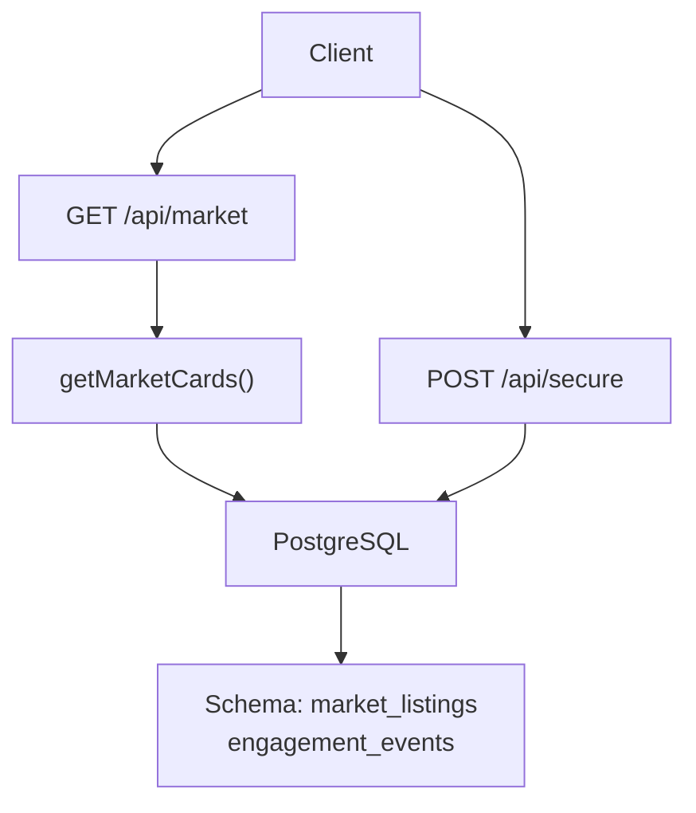
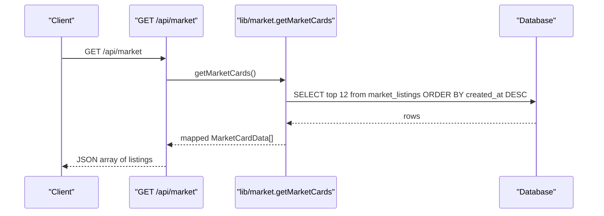
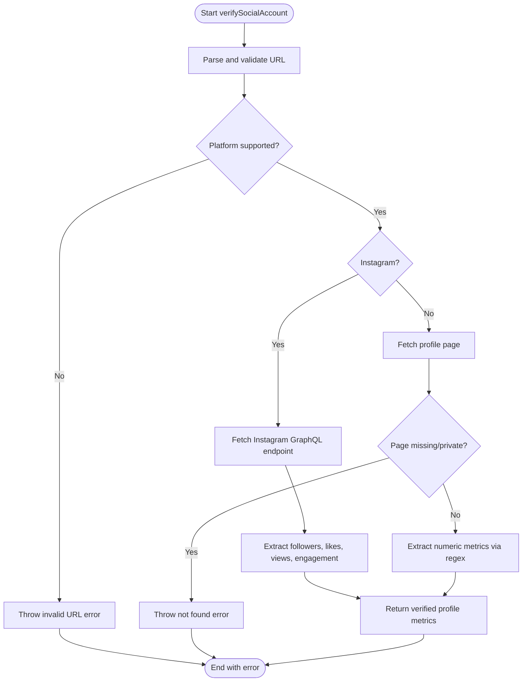
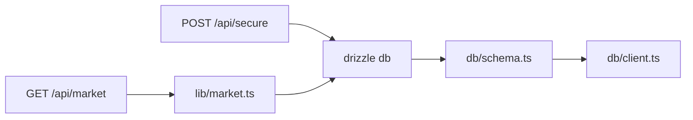

# Marketplace API

<cite>
**Referenced Files in This Document**
- [route.ts](file://src/app/api/market/route.ts)
- [market.ts](file://src/lib/market.ts)
- [schema.ts](file://src/db/schema.ts)
- [client.ts](file://src/db/client.ts)
- [db.ts](file://src/lib/db.ts)
- [route.ts](file://src/app/api/secure/route.ts)
- [types.ts](file://src/types.ts)
- [market.ts](file://src/types/market.ts)
</cite>

## Table of Contents
1. [Introduction](#introduction)
2. [Project Structure](#project-structure)
3. [Core Components](#core-components)
4. [Architecture Overview](#architecture-overview)
5. [Detailed Component Analysis](#detailed-component-analysis)
6. [Dependency Analysis](#dependency-analysis)
7. [Performance Considerations](#performance-considerations)
8. [Troubleshooting Guide](#troubleshooting-guide)
9. [Conclusion](#conclusion)
10. [Appendices](#appendices)

## Introduction
This document provides detailed API documentation for the Marketplace endpoints exposed by the application. It covers listing management, product catalog operations, search and filtering capabilities, category/niche management, authentication requirements, data validation rules, request/response schemas, error handling patterns, rate limiting considerations, and integration best practices. Practical examples are included to demonstrate common marketplace operations such as creating listings, updating prices, managing inventory (status), and processing transactions via related flows.

## Project Structure
The Marketplace functionality is implemented using Next.js Route Handlers under src/app/api with supporting libraries and database schema definitions:

- Public marketplace listing endpoint: GET /api/market
- Secure administrative and user actions: POST /api/secure (includes create/update/pause/delete market listings)
- Data access layer: Drizzle ORM with PostgreSQL schema
- Types: Shared TypeScript interfaces for marketplace entities

**Diagram sources**
- [route.ts:164-172](file://src/app/api/market/route.ts#L164-L172)
- [market.ts:43-49](file://src/lib/market.ts#L43-L49)
- [schema.ts:58-73](file://src/db/schema.ts#L58-L73)
- [route.ts:111-152](file://src/app/api/secure/route.ts#L111-L152)

**Section sources**
- [route.ts:164-172](file://src/app/api/market/route.ts#L164-L172)
- [market.ts:43-49](file://src/lib/market.ts#L43-L49)
- [schema.ts:58-73](file://src/db/schema.ts#L58-L73)
- [route.ts:111-152](file://src/app/api/secure/route.ts#L111-L152)

## Core Components
- GET /api/market: Returns a curated list of marketplace items (social accounts/listings).
- POST /api/secure: Unified action endpoint that supports creating, updating, pausing, and deleting marketplace listings, plus other features like campaigns and vacancies.
- Database schema: Defines the market_listings table and engagement events for auditability.
- Type models: Define response shapes for marketplace cards and orders/offers.

Key responsibilities:
- Input validation and normalization
- Social profile verification and metric extraction
- Database persistence and querying
- Response mapping to consistent client-facing types

**Section sources**
- [route.ts:164-261](file://src/app/api/market/route.ts#L164-L261)
- [route.ts:256-437](file://src/app/api/secure/route.ts#L256-L437)
- [schema.ts:58-73](file://src/db/schema.ts#L58-L73)
- [types.ts:75-86](file://src/types.ts#L75-L86)

## Architecture Overview
The marketplace API follows a simple serverless route handler pattern backed by a relational database. The public endpoint returns a limited set of listings optimized for browsing. The secure endpoint handles authenticated write operations and exposes multiple modes for marketplace management.

**Diagram sources**
- [route.ts:164-172](file://src/app/api/market/route.ts#L164-L172)
- [market.ts:43-49](file://src/lib/market.ts#L43-L49)
- [schema.ts:58-73](file://src/db/schema.ts#L58-L73)

## Detailed Component Analysis

### Endpoint: GET /api/market
Purpose: Retrieve a paginated-like list of marketplace listings for discovery.

- Method: GET
- Path: /api/market
- Authentication: None required
- Query parameters: None defined
- Request body: N/A
- Response: Array of marketplace card objects

Response fields (selected):
- id: string
- sellerName: string
- sellerUsername: string
- description: string
- handle: string
- followers: number
- likes: number
- views: number
- erCurrentRatio: number
- vlCurrentRatio: number
- sentimentRate: number
- productPriceRaw: number
- valueRaw: number
- createdAt: string
- offersCount: number

Notes:
- The endpoint fetches up to 12 recent listings ordered by creation time.
- Views are computed from followers, likes, and engagement rate.

Error handling:
- On failure, returns an empty array with HTTP 500.

**Section sources**
- [route.ts:164-172](file://src/app/api/market/route.ts#L164-L172)
- [market.ts:43-49](file://src/lib/market.ts#L43-L49)
- [types.ts:75-86](file://src/types.ts#L75-L86)

### Endpoint: POST /api/market
Purpose: Create a new marketplace listing based on a social media profile URL. Performs social account verification and stores metrics.

- Method: POST
- Path: /api/market
- Authentication: Optional identity via header x-user-id or body createdBy/userId; defaults to anonymous
- Request body fields:
  - profileUrl: string (required)
  - description: string (required)
  - title: string (optional; derived if missing)
  - niche: string (optional; default "General")
  - price: number (optional; default 0)
  - createdBy/userId: string (optional; used for createdBy)
- Response: { ok: true, item: ListingObject }

Listing object fields (selected):
- id: string
- title: string
- description: string
- price: number
- profileUrl: string
- platform: string
- handle: string
- followers: number
- likes: number
- views: number
- engagementRate: number
- niche: string
- createdBy: string
- status: "open"
- createdAt: string

Validation rules:
- profileUrl must be present and valid; supported hosts include Instagram, TikTok, Twitter/X, YouTube, Facebook, LinkedIn, Threads.
- description must be present.
- Social profile verification extracts follower counts, likes, views, and engagement rate; if verification fails, a 400 error is returned.

Error handling:
- Missing fields return 400 with descriptive errors.
- Verification failures return 400 with error messages.
- Database fallback behavior returns a local ID and timestamp when DB is unavailable.

**Section sources**
- [route.ts:174-261](file://src/app/api/market/route.ts#L174-L261)
- [schema.ts:58-73](file://src/db/schema.ts#L58-L73)

### Endpoint: POST /api/secure (Marketplace Operations)
Purpose: Unified secure endpoint for marketplace management operations including create, update, pause, delete, and interaction logging.

- Method: POST
- Path: /api/secure
- Authentication: Requires user identity via header x-user-id or body fields; role via header x-user-role or body role; defaults to member
- Request body fields vary by mode:
  - mode: string (required)
  - entityId: number (for update/pause/delete)
  - For create_market: title, description, price, profileUrl, niche
  - For update_listing: price/newPrice/amount
  - For interact: entityType, actionType/action, message

Supported marketplace modes:
- create_market: Creates a new listing; logs engagement event
- pause_listing: Toggles status between open and paused
- update_listing: Updates price with validation (non-negative)
- delete_listing: Deletes listing and associated engagement events

Response:
- Success: { ok: true, item?: ListingObject }
- Errors: { error: string } with appropriate HTTP status codes

Error handling:
- Missing required fields return 400
- Not found returns 404
- Invalid price returns 400
- Unsupported mode returns 400
- Server errors return 500

**Section sources**
- [route.ts:154-534](file://src/app/api/secure/route.ts#L154-L534)

### Data Models and Schemas

#### Database Schema: market_listings
Fields:
- id: serial primary key
- title: text not null
- description: text not null
- price: double precision not null default 0
- profile_url: text
- platform: text
- handle: text
- followers: integer not null default 0
- likes: integer not null default 0
- engagement_rate: double precision not null default 0
- niche: text
- created_by: text not null
- status: text not null default "open"
- created_at: timestamp not null default now()

Auditability:
- engagement_events records actions like create, update_price, delete with actor_id and message.

**Section sources**
- [schema.ts:58-73](file://src/db/schema.ts#L58-L73)
- [schema.ts:75-83](file://src/db/schema.ts#L75-L83)

#### Client Types: MarketCardData
Used to represent marketplace items returned to clients. Includes metrics for engagement and pricing, plus metadata like seller info and timestamps.

**Section sources**
- [types.ts:75-86](file://src/types.ts#L75-L86)
- [market.ts:1-25](file://src/types/market.ts#L1-L25)

### Processing Logic and Algorithms

#### Social Profile Verification Flow
The marketplace creation flow verifies social profiles and extracts metrics:

**Diagram sources**
- [route.ts:37-162](file://src/app/api/market/route.ts#L37-L162)

**Section sources**
- [route.ts:37-162](file://src/app/api/market/route.ts#L37-L162)

#### Views Computation
Views are computed to reflect listing popularity based on social metrics:
- Formula uses followers, likes, and engagement rate with minimum threshold.

**Section sources**
- [market.ts:7-9](file://src/lib/market.ts#L7-L9)
- [route.ts:213-214](file://src/app/api/market/route.ts#L213-L214)

### Integration Points and Best Practices
- Use GET /api/market for browsing listings; expect up to 12 items sorted by newest first.
- Use POST /api/secure with mode=create_market to create listings; ensure profileUrl and description are provided.
- Use POST /api/secure with mode=update_listing to change prices; validate non-negative values.
- Use POST /api/secure with mode=pause_listing to toggle visibility; treat status as inventory control.
- Use POST /api/secure with mode=delete_listing to remove listings; this also removes associated engagement events.
- Include x-user-id header for identity tracking; include x-user-role for role-based behaviors if needed.
- Handle errors consistently by checking for { error: string } in responses and appropriate HTTP status codes.

[No sources needed since this section provides general guidance]

## Dependency Analysis
The marketplace endpoints depend on:
- Drizzle ORM for type-safe queries
- PostgreSQL via pg pool configured in db client
- Schema definitions for tables and constraints
- Type definitions for consistent client payloads

**Diagram sources**
- [route.ts:164-172](file://src/app/api/market/route.ts#L164-L172)
- [market.ts:43-49](file://src/lib/market.ts#L43-L49)
- [schema.ts:58-73](file://src/db/schema.ts#L58-L73)
- [client.ts:61-145](file://src/db/client.ts#L61-L145)

**Section sources**
- [route.ts:164-172](file://src/app/api/market/route.ts#L164-L172)
- [market.ts:43-49](file://src/lib/market.ts#L43-L49)
- [schema.ts:58-73](file://src/db/schema.ts#L58-L73)
- [client.ts:61-145](file://src/db/client.ts#L61-L145)

## Performance Considerations
- Pagination: The public endpoint limits results to 12 items; consider implementing query parameters for pagination and filtering in future iterations.
- External calls: Social profile verification performs network requests; cache results where appropriate to reduce latency and external dependencies.
- Database queries: Queries are simple selects with ordering and limits; ensure indexes on frequently filtered columns (e.g., created_at, status) if scaling.
- Fallback behavior: When database is unavailable, the marketplace creation endpoint falls back to local IDs and timestamps; design clients to handle this gracefully.

[No sources needed since this section provides general guidance]

## Troubleshooting Guide
Common issues and resolutions:
- Missing profileUrl or description on POST /api/market: Ensure both fields are provided; the endpoint validates presence and returns 400 with error messages.
- Social profile verification failures: Verify that the URL points to a supported platform and is publicly accessible; private or missing pages will cause errors.
- Price validation errors on update_listing: Provide a valid non-negative price; otherwise, a 400 error is returned.
- Not found errors: Ensure entity IDs exist before attempting updates or deletions; 404 indicates the resource was not found.
- Database connectivity: If the database is unavailable, creation may fall back to local storage; check environment configuration and DATABASE_URL.

**Section sources**
- [route.ts:174-261](file://src/app/api/market/route.ts#L174-L261)
- [route.ts:256-437](file://src/app/api/secure/route.ts#L256-L437)
- [client.ts:34-38](file://src/db/client.ts#L34-L38)

## Conclusion
The Marketplace API provides essential endpoints for listing discovery and management. The public endpoint serves a curated list for browsing, while the secure endpoint enables full lifecycle management of marketplace listings with robust validation and audit logging. Integrators should follow the documented request/response schemas, handle errors appropriately, and consider performance optimizations such as caching and indexing as usage scales.

[No sources needed since this section summarizes without analyzing specific files]

## Appendices

### A. Request/Response Schemas

#### GET /api/market Response
- Type: Array of MarketCardData
- Fields: id, sellerName, sellerUsername, description, handle, followers, likes, views, erCurrentRatio, vlCurrentRatio, sentimentRate, productPriceRaw, valueRaw, createdAt, offersCount

**Section sources**
- [types.ts:75-86](file://src/types.ts#L75-L86)
- [market.ts:11-41](file://src/lib/market.ts#L11-L41)

#### POST /api/market Request
- Required: profileUrl, description
- Optional: title, niche, price, createdBy/userId
- Validation: profileUrl must be supported and verifiable; description must be present

**Section sources**
- [route.ts:174-261](file://src/app/api/market/route.ts#L174-L261)

#### POST /api/secure Modes for Marketplace
- create_market: title, description, price, profileUrl, niche
- update_listing: entityId, price/newPrice/amount
- pause_listing: entityId
- delete_listing: entityId

**Section sources**
- [route.ts:256-437](file://src/app/api/secure/route.ts#L256-L437)

### B. Authentication and Authorization
- Identity: Provided via x-user-id header or body fields; defaults to anonymous/demo identifiers when absent.
- Role: Provided via x-user-role header or body role; defaults to member.
- Security note: Current implementation does not enforce strict authentication; integrate proper auth middleware for production use.

**Section sources**
- [route.ts:174-179](file://src/app/api/market/route.ts#L174-L179)
- [route.ts:154-162](file://src/app/api/secure/route.ts#L154-L162)

### C. Error Handling Patterns
- 400 Bad Request: Validation failures, unsupported modes, missing required fields
- 404 Not Found: Entity not found during updates/deletes
- 500 Internal Server Error: Unexpected failures; public GET returns empty array on error

**Section sources**
- [route.ts:164-172](file://src/app/api/market/route.ts#L164-L172)
- [route.ts:256-437](file://src/app/api/secure/route.ts#L256-L437)

### D. Rate Limiting Considerations
- No explicit rate limiting is implemented in the current codebase.
- Recommendations:
  - Implement rate limiting at the gateway or middleware level to protect endpoints from abuse.
  - Cache social profile verification results to reduce external API load.
  - Monitor and log request rates to detect anomalies.

[No sources needed since this section provides general guidance]

### E. Practical Examples

- Create a listing:
  - POST /api/market with profileUrl and description; optional price and niche; returns created listing with computed views and metrics.
  - Alternatively, POST /api/secure with mode=create_market and required fields.

- Update price:
  - POST /api/secure with mode=update_listing, entityId, and price; validates non-negative value.

- Manage inventory (status):
  - POST /api/secure with mode=pause_listing and entityId; toggles between open and paused.

- Delete listing:
  - POST /api/secure with mode=delete_listing and entityId; removes listing and engagement events.

- Browse listings:
  - GET /api/market; returns up to 12 recent listings.

[No sources needed since this section provides general guidance]