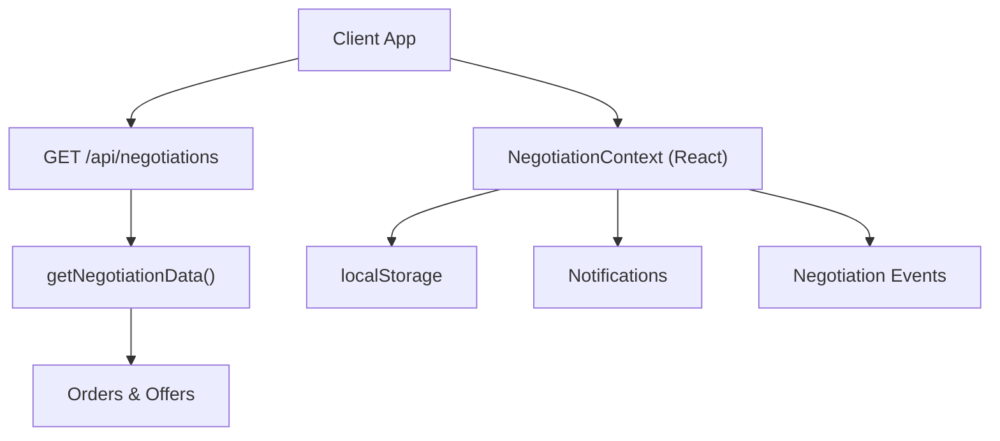
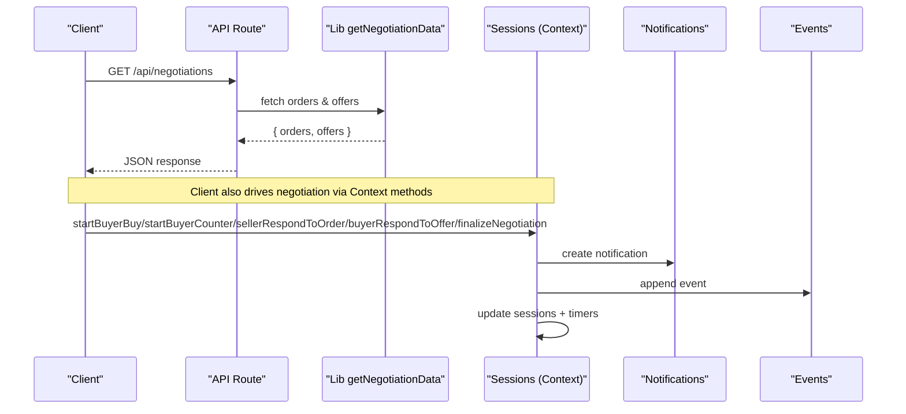
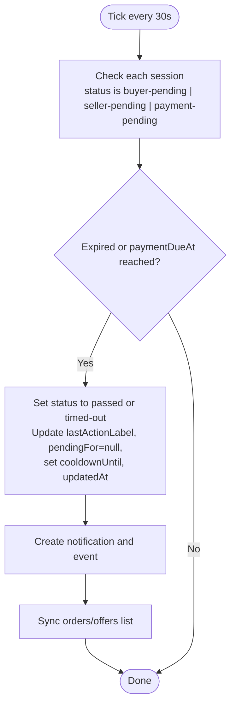
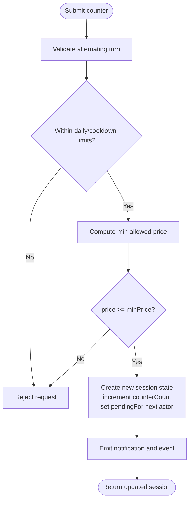
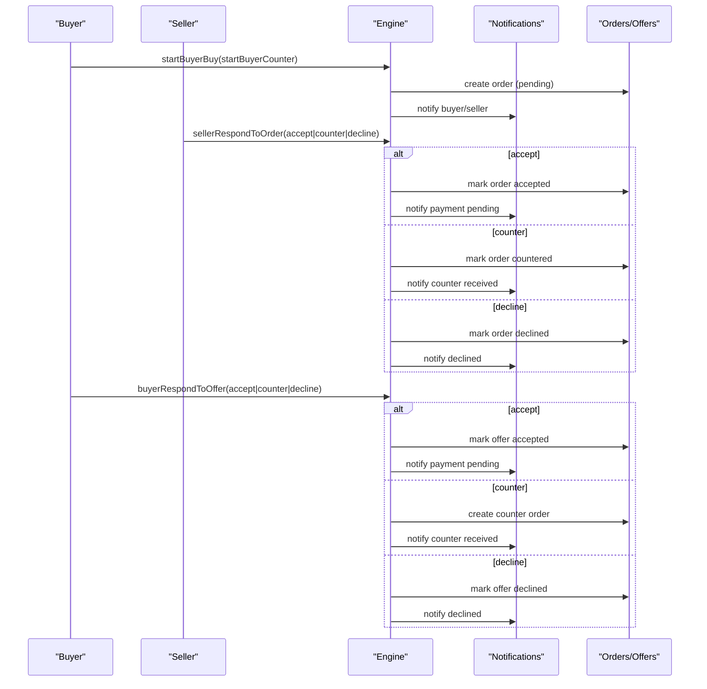
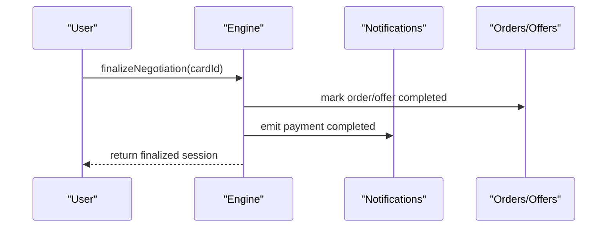
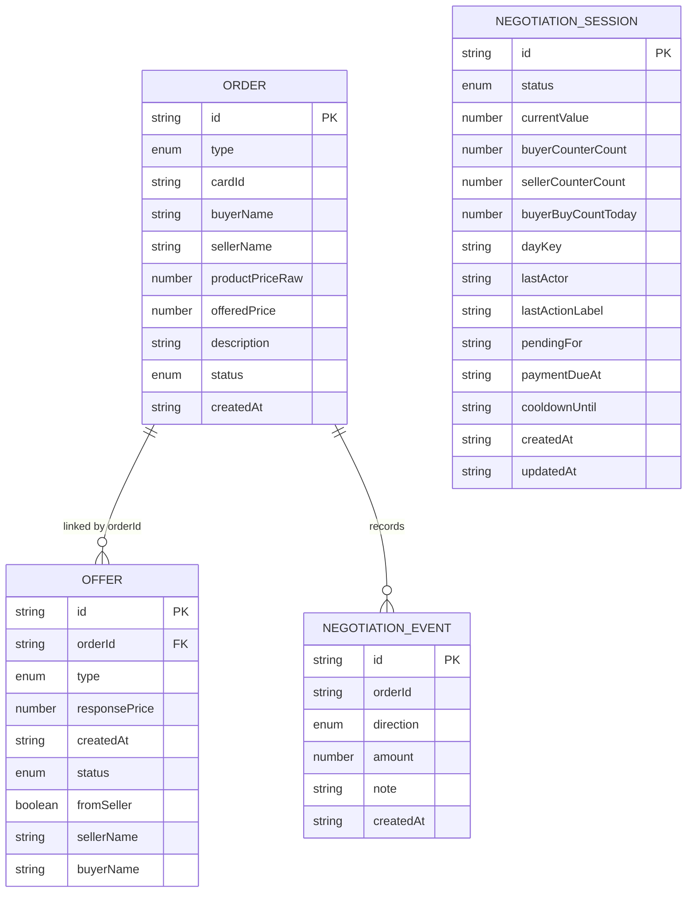
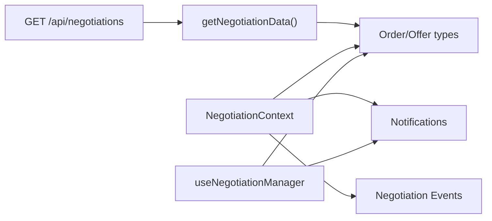

# Negotiations API

<cite>
**Referenced Files in This Document**
- [route.ts](file://src/app/api/negotiations/route.ts)
- [negotiations.ts](file://src/lib/negotiations.ts)
- [negotiation.ts](file://src/lib/negotiation.ts)
- [NegotiationContext.tsx](file://src/context/NegotiationContext.tsx)
- [useNegotiationManager.ts](file://src/hooks/useNegotiationManager.ts)
- [notifications.ts](file://src/lib/notifications.ts)
- [types.ts](file://src/types.ts)
</cite>

## Table of Contents
1. [Introduction](#introduction)
2. [Project Structure](#project-structure)
3. [Core Components](#core-components)
4. [Architecture Overview](#architecture-overview)
5. [Detailed Component Analysis](#detailed-component-analysis)
6. [Dependency Analysis](#dependency-analysis)
7. [Performance Considerations](#performance-considerations)
8. [Troubleshooting Guide](#troubleshooting-guide)
9. [Conclusion](#conclusion)

## Introduction
This document provides comprehensive API documentation for the Negotiation engine endpoints and the real-time negotiation workflow implemented in the application. It covers:
- HTTP endpoint(s) for retrieving negotiation data
- Real-time negotiation session lifecycle (creation, counter-offers, timeouts, state synchronization)
- Request/response schemas for negotiation entities
- State machine transitions and event-driven updates
- Authentication requirements and session management
- Error handling patterns and client implementation guidance

The system uses a Next.js API route to serve negotiation data and a React context-based engine that manages sessions, notifications, and events with local storage persistence and periodic polling for timeout handling.

## Project Structure
The negotiation feature spans several layers:
- API layer: A single GET endpoint returns negotiation data (orders and offers).
- Domain logic: Types and utilities define negotiation sessions, events, and summaries.
- Client-side engine: A React context orchestrates session creation, counters, acceptances, declines, finalization, and timeout handling.
- Notification integration: Notifications are created and persisted alongside negotiation events.



**Diagram sources**
- [route.ts:4-12](file://src/app/api/negotiations/route.ts#L4-L12)
- [negotiations.ts:57-62](file://src/lib/negotiations.ts#L57-L62)
- [NegotiationContext.tsx:140-173](file://src/context/NegotiationContext.tsx#L140-L173)
- [notifications.ts:17-28](file://src/lib/notifications.ts#L17-L28)

**Section sources**
- [route.ts:1-12](file://src/app/api/negotiations/route.ts#L1-L12)
- [negotiations.ts:1-63](file://src/lib/negotiations.ts#L1-L63)
- [NegotiationContext.tsx:140-173](file://src/context/NegotiationContext.tsx#L140-L173)

## Core Components
- API Endpoint: GET /api/negotiations returns orders and offers.
- Session Engine: Manages negotiation sessions, counters, accept/decline flows, payment pending, and finalization.
- Eventing: Tracks negotiation events with direction, amount, and notes.
- Notifications: Creates and persists notifications for negotiation actions.
- Persistence: Uses localStorage to keep sessions, notifications, and events across reloads.

Key responsibilities:
- Start buyer buy or counter offer
- Seller respond to order (accept, counter, decline)
- Buyer respond to offer (accept, counter, decline)
- Finalize negotiation after payment
- Timeout handling via periodic tick

**Section sources**
- [route.ts:4-12](file://src/app/api/negotiations/route.ts#L4-L12)
- [NegotiationContext.tsx:267-378](file://src/context/NegotiationContext.tsx#L267-L378)
- [NegotiationContext.tsx:380-512](file://src/context/NegotiationContext.tsx#L380-L512)
- [NegotiationContext.tsx:514-624](file://src/context/NegotiationContext.tsx#L514-L624)
- [NegotiationContext.tsx:626-669](file://src/context/NegotiationContext.tsx#L626-L669)
- [negotiation.ts:1-50](file://src/lib/negotiation.ts#L1-L50)
- [notifications.ts:1-43](file://src/lib/notifications.ts#L1-L43)

## Architecture Overview
The negotiation architecture combines a minimal REST endpoint with a rich client-side state machine. The API serves current negotiation snapshots (orders and offers), while the client maintains an authoritative session graph with rules for counters, cooldowns, and timeouts.



**Diagram sources**
- [route.ts:4-12](file://src/app/api/negotiations/route.ts#L4-L12)
- [negotiations.ts:57-62](file://src/lib/negotiations.ts#L57-L62)
- [NegotiationContext.tsx:175-179](file://src/context/NegotiationContext.tsx#L175-L179)
- [NegotiationContext.tsx:181-252](file://src/context/NegotiationContext.tsx#L181-L252)

## Detailed Component Analysis

### API Endpoint: GET /api/negotiations
- Method: GET
- Path: /api/negotiations
- Purpose: Retrieve current negotiation data (orders and offers)
- Response schema:
  - orders: array of Order objects
  - offers: array of Offer objects
- Error handling: On failure, returns a JSON object with empty arrays and status 500

Request
- No body required
- No authentication headers defined in this route

Response
- 200 OK: { orders: Order[], offers: Offer[] }
- 500 Internal Server Error: { orders: [], offers: [] }

Notes
- The endpoint delegates data retrieval to a library function that currently returns empty arrays; integrate with your data source as needed.

**Section sources**
- [route.ts:4-12](file://src/app/api/negotiations/route.ts#L4-L12)
- [negotiations.ts:57-62](file://src/lib/negotiations.ts#L57-L62)

### Negotiation Session Model and State Machine
Session states and transitions:
- idle -> buyer-pending (buyer initiates buy)
- buyer-pending -> seller-pending (seller counters)
- buyer-pending -> payment-pending (seller accepts)
- buyer-pending -> declined (seller declines)
- seller-pending -> buyer-pending (buyer counters)
- seller-pending -> payment-pending (buyer accepts)
- seller-pending -> declined (buyer declines)
- payment-pending -> finalized (payment completed)
- Any pending state -> passed/timed-out (timeout due to inactivity or payment deadline)

```mermaid
stateDiagram-v2
[*] --> idle
idle --> buyer-pending : "startBuyerBuy"
buyer-pending --> seller-pending : "sellerRespondToOrder(counter)"
buyer-pending --> payment-pending : "sellerRespondToOrder(accept)"
buyer-pending --> declined : "sellerRespondToOrder(decline)"
seller-pending --> buyer-pending : "buyerRespondToOffer(counter)"
seller-pending --> payment-pending : "buyerRespondToOffer(accept)"
seller-pending --> declined : "buyerRespondToOffer(decline)"
payment-pending --> finalized : "finalizeNegotiation"
buyer-pending --> passed : "timeout (no response)"
seller-pending --> passed : "timeout (no response)"
payment-pending --> timed-out : "timeout (payment due)"
```

**Diagram sources**
- [NegotiationContext.tsx:267-378](file://src/context/NegotiationContext.tsx#L267-L378)
- [NegotiationContext.tsx:380-512](file://src/context/NegotiationContext.tsx#L380-L512)
- [NegotiationContext.tsx:514-624](file://src/context/NegotiationContext.tsx#L514-L624)
- [NegotiationContext.tsx:626-669](file://src/context/NegotiationContext.tsx#L626-L669)
- [NegotiationContext.tsx:181-252](file://src/context/NegotiationContext.tsx#L181-L252)

### Real-Time Updates and Polling
- Periodic tick runs every 30 seconds to check for expired negotiations and enforce cooldowns.
- When a pending negotiation exceeds its time limit or payment deadline, it transitions to passed or timed-out accordingly.
- Notifications and events are emitted on state changes.
- Orders and offers lists are synchronized with session state changes.



**Diagram sources**
- [NegotiationContext.tsx:181-252](file://src/context/NegotiationContext.tsx#L181-L252)

**Section sources**
- [NegotiationContext.tsx:181-252](file://src/context/NegotiationContext.tsx#L181-L252)

### Counter-Offer Generation and Validation
- Buyers can submit counter offers with constraints:
  - Alternating turns (cannot counter twice in a row)
  - Maximum discount based on counter count
  - Daily action limits and cooldown periods
- Sellers can counter with similar constraints.
- Minimum price thresholds are enforced per side.



**Diagram sources**
- [NegotiationContext.tsx:319-378](file://src/context/NegotiationContext.tsx#L319-L378)
- [NegotiationContext.tsx:380-512](file://src/context/NegotiationContext.tsx#L380-L512)
- [NegotiationContext.tsx:514-624](file://src/context/NegotiationContext.tsx#L514-L624)

**Section sources**
- [NegotiationContext.tsx:319-378](file://src/context/NegotiationContext.tsx#L319-L378)
- [NegotiationContext.tsx:380-512](file://src/context/NegotiationContext.tsx#L380-L512)
- [NegotiationContext.tsx:514-624](file://src/context/NegotiationContext.tsx#L514-L624)

### Accept/Reject Flows
- Seller responds to order:
  - Accept: moves to payment-pending, sets paymentDueAt, notifies buyer
  - Decline: ends negotiation, notifies both parties
  - Counter: creates a counter offer and switches pending role
- Buyer responds to offer:
  - Accept: moves to payment-pending, sets paymentDueAt, notifies seller
  - Decline: ends negotiation, notifies both parties
  - Counter: creates a counter order back to seller



**Diagram sources**
- [NegotiationContext.tsx:267-378](file://src/context/NegotiationContext.tsx#L267-L378)
- [NegotiationContext.tsx:380-512](file://src/context/NegotiationContext.tsx#L380-L512)
- [NegotiationContext.tsx:514-624](file://src/context/NegotiationContext.tsx#L514-L624)

**Section sources**
- [NegotiationContext.tsx:267-378](file://src/context/NegotiationContext.tsx#L267-L378)
- [NegotiationContext.tsx:380-512](file://src/context/NegotiationContext.tsx#L380-L512)
- [NegotiationContext.tsx:514-624](file://src/context/NegotiationContext.tsx#L514-L624)

### Payment and Finalization
- After acceptance by either party, the negotiation enters payment-pending with a one-day deadline.
- Finalization marks the negotiation as completed, updates related orders/offers, and emits a completion notification/event.



**Diagram sources**
- [NegotiationContext.tsx:626-669](file://src/context/NegotiationContext.tsx#L626-L669)

**Section sources**
- [NegotiationContext.tsx:626-669](file://src/context/NegotiationContext.tsx#L626-L669)

### Data Models and Schemas
- Order: Represents a buy or counter request with fields like id, type, cardId, buyer/seller names, prices, description, status, timestamps, and optional metrics.
- Offer: Represents an accept or counter from seller with fields like id, orderId, type, responsePrice, status, sender/receiver names, and optional metrics.
- NegotiationSession: Captures session-level state including status, current value, counters, timing, and actors.
- NegotiationEvent: Records directional actions with amounts and notes.



**Diagram sources**
- [types.ts:1-48](file://src/types.ts#L1-L48)
- [NegotiationContext.tsx:20-38](file://src/context/NegotiationContext.tsx#L20-L38)
- [negotiation.ts:1-27](file://src/lib/negotiation.ts#L1-L27)

**Section sources**
- [types.ts:1-48](file://src/types.ts#L1-L48)
- [NegotiationContext.tsx:20-38](file://src/context/NegotiationContext.tsx#L20-L38)
- [negotiation.ts:1-27](file://src/lib/negotiation.ts#L1-L27)

### Authentication and Session Management
- The negotiation API route does not define authentication checks; integrate middleware or token validation at the framework level if required.
- Sessions are managed client-side using React context and persisted in localStorage.
- Cooldowns and daily limits prevent abuse and ensure fair play.

Recommendations
- Add authentication middleware to protect negotiation endpoints if exposing server-side mutation APIs.
- Use secure cookies or tokens for cross-session identity when persisting beyond localStorage.

**Section sources**
- [route.ts:4-12](file://src/app/api/negotiations/route.ts#L4-L12)
- [NegotiationContext.tsx:146-173](file://src/context/NegotiationContext.tsx#L146-L173)

### Error Handling
- API errors: Returns a structured JSON payload with empty arrays and status 500.
- Client-side validation: Counter offers validate minimum prices, turn alternation, and limits; invalid requests return null or no-op.
- Timeouts: Pending states transition to passed/timed-out with notifications and events.

Best practices
- Always handle 5xx responses gracefully and retry with backoff.
- Surface user-friendly messages for rejected counters due to limits or invalid prices.
- Ensure UI reflects latest session status from both API and local state.

**Section sources**
- [route.ts:8-11](file://src/app/api/negotiations/route.ts#L8-L11)
- [NegotiationContext.tsx:319-378](file://src/context/NegotiationContext.tsx#L319-L378)
- [NegotiationContext.tsx:380-512](file://src/context/NegotiationContext.tsx#L380-L512)
- [NegotiationContext.tsx:514-624](file://src/context/NegotiationContext.tsx#L514-L624)
- [NegotiationContext.tsx:181-252](file://src/context/NegotiationContext.tsx#L181-L252)

### Client Implementation Patterns
- Use the provided hooks and context to manage negotiations:
  - Start buyer actions: startBuyerBuy, startBuyerCounter
  - Respond to orders: sellerRespondToOrder
  - Respond to offers: buyerRespondToOffer
  - Finalize payments: finalizeNegotiation
- Monitor progress:
  - Read sessions and statuses from context
  - Subscribe to notifications and events for real-time updates
  - Poll GET /api/negotiations periodically to sync server-side state

Example usage references
- Hook-based manager for orders/offers manipulation
- Context provider for full session lifecycle

**Section sources**
- [useNegotiationManager.ts:6-201](file://src/hooks/useNegotiationManager.ts#L6-L201)
- [NegotiationContext.tsx:675-697](file://src/context/NegotiationContext.tsx#L675-L697)

## Dependency Analysis


**Diagram sources**
- [route.ts:4-12](file://src/app/api/negotiations/route.ts#L4-L12)
- [negotiations.ts:57-62](file://src/lib/negotiations.ts#L57-L62)
- [types.ts:1-48](file://src/types.ts#L1-L48)
- [NegotiationContext.tsx:175-179](file://src/context/NegotiationContext.tsx#L175-L179)
- [useNegotiationManager.ts:6-201](file://src/hooks/useNegotiationManager.ts#L6-L201)

**Section sources**
- [route.ts:4-12](file://src/app/api/negotiations/route.ts#L4-L12)
- [negotiations.ts:57-62](file://src/lib/negotiations.ts#L57-L62)
- [types.ts:1-48](file://src/types.ts#L1-L48)
- [NegotiationContext.tsx:175-179](file://src/context/NegotiationContext.tsx#L175-L179)
- [useNegotiationManager.ts:6-201](file://src/hooks/useNegotiationManager.ts#L6-L201)

## Performance Considerations
- LocalStorage writes occur on every change to sessions, notifications, and events; batch updates where possible to reduce I/O overhead.
- The 30-second polling interval balances responsiveness with performance; adjust based on expected negotiation volume.
- Avoid excessive re-renders by memoizing derived values and minimizing state mutations.

[No sources needed since this section provides general guidance]

## Troubleshooting Guide
Common issues and resolutions:
- Empty negotiation data from API:
  - Verify getNegotiationData implementation returns actual orders/offers.
  - Check network logs for 500 responses and inspect error logs.
- Counters rejected:
  - Ensure price meets minimum threshold based on counter count.
  - Confirm alternating turns and daily/cooldown limits are respected.
- Timed-out negotiations:
  - Review updatedAt timestamps and paymentDueAt deadlines.
  - Confirm tick interval is running and not blocked by browser restrictions.
- Notifications not appearing:
  - Verify pushNotification calls are triggered on state changes.
  - Check localStorage quotas and parsing errors.

**Section sources**
- [route.ts:8-11](file://src/app/api/negotiations/route.ts#L8-L11)
- [NegotiationContext.tsx:181-252](file://src/context/NegotiationContext.tsx#L181-L252)
- [NegotiationContext.tsx:319-378](file://src/context/NegotiationContext.tsx#L319-L378)
- [NegotiationContext.tsx:380-512](file://src/context/NegotiationContext.tsx#L380-L512)
- [NegotiationContext.tsx:514-624](file://src/context/NegotiationContext.tsx#L514-L624)

## Conclusion
The Negotiation engine provides a robust client-side state machine with clear session lifecycle, counter-offer mechanics, and timeout handling, complemented by a minimal API endpoint for data retrieval. Integrate authentication and backend persistence as needed to support multi-user scenarios and durable state. Use the provided hooks and context to implement real-time negotiation features efficiently and consistently.

[No sources needed since this section summarizes without analyzing specific files]