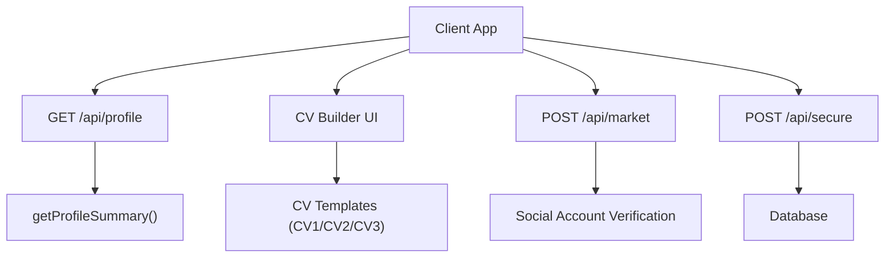
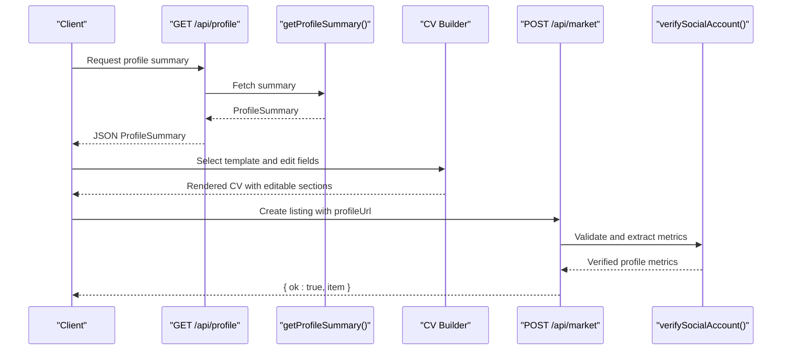
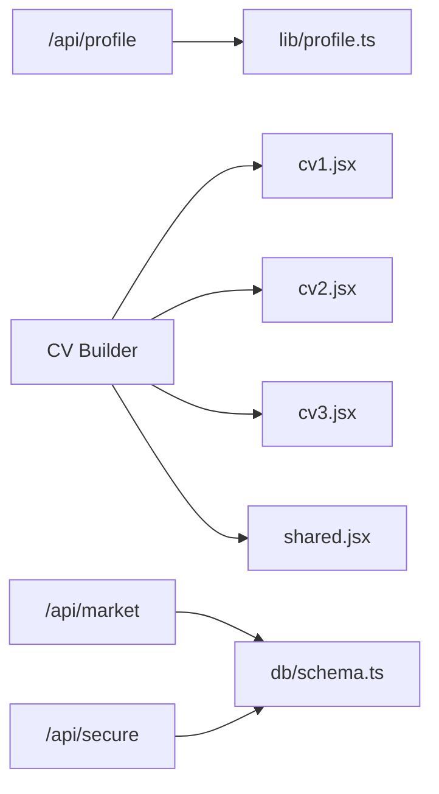

# Profile Management API

<cite>
**Referenced Files in This Document**
- [route.ts](file://src/app/api/profile/route.ts)
- [profile.ts](file://src/lib/profile.ts)
- [page.tsx](file://src/app/profile/page.tsx)
- [cv/index.tsx](file://src/components/profile/cv/index.tsx)
- [cv1.jsx](file://src/components/profile/cv-temps/cv1.jsx)
- [cv2.jsx](file://src/components/profile/cv-temps/cv2.jsx)
- [cv3.jsx](file://src/components/profile/cv-temps/cv3.jsx)
- [shared.jsx](file://src/components/profile/cv-temps/shared.jsx)
- [schema.ts](file://src/db/schema.ts)
- [secure/route.ts](file://src/app/api/secure/route.ts)
- [market/route.ts](file://src/app/api/market/route.ts)
</cite>

## Table of Contents
1. [Introduction](#introduction)
2. [Project Structure](#project-structure)
3. [Core Components](#core-components)
4. [Architecture Overview](#architecture-overview)
5. [Detailed Component Analysis](#detailed-component-analysis)
6. [Dependency Analysis](#dependency-analysis)
7. [Performance Considerations](#performance-considerations)
8. [Troubleshooting Guide](#troubleshooting-guide)
9. [Conclusion](#conclusion)
10. [Appendices](#appendices)

## Introduction
This document provides detailed API documentation for profile management endpoints and related features in the repository. It covers:
- Profile summary retrieval
- CV template selection and rendering
- Social media integration via market listing creation
- Authentication patterns used across secure endpoints
- File upload handling for profile images within CV templates
- Profile visibility controls (as implemented in the UI)

Where applicable, request/response schemas are defined based on actual code structures. Practical examples illustrate how to call endpoints and use features.

## Project Structure
The profile-related functionality spans a small set of files:
- A Next.js API route that returns a profile summary
- A library module defining the profile summary type and data provider
- A client page that fetches and displays the profile
- A CV builder component with multiple templates and editable fields
- A social media integration endpoint that validates and creates listings from profile URLs
- Secure endpoints demonstrating authentication patterns

**Diagram sources**
- [route.ts:4-12](file://src/app/api/profile/route.ts#L4-L12)
- [profile.ts:16-31](file://src/lib/profile.ts#L16-L31)
- [cv/index.tsx:8-53](file://src/components/profile/cv/index.tsx#L8-L53)
- [cv1.jsx:4-73](file://src/components/profile/cv-temps/cv1.jsx#L4-L73)
- [cv2.jsx:4-15](file://src/components/profile/cv-temps/cv2.jsx#L4-L15)
- [cv3.jsx:5-69](file://src/components/profile/cv-temps/cv3.jsx#L5-L69)
- [market/route.ts:174-261](file://src/app/api/market/route.ts#L174-L261)
- [secure/route.ts:111-152](file://src/app/api/secure/route.ts#L111-L152)

**Section sources**
- [route.ts:4-12](file://src/app/api/profile/route.ts#L4-L12)
- [profile.ts:1-31](file://src/lib/profile.ts#L1-L31)
- [page.tsx:15-32](file://src/app/profile/page.tsx#L15-L32)
- [cv/index.tsx:8-53](file://src/components/profile/cv/index.tsx#L8-L53)
- [market/route.ts:174-261](file://src/app/api/market/route.ts#L174-L261)
- [secure/route.ts:111-152](file://src/app/api/secure/route.ts#L111-L152)

## Core Components
- Profile Summary API: Returns a structured profile object including name, handle, role, location, bio, and discover metrics.
- CV Builder: Client-side component enabling template selection and inline editing of profile data for CV generation.
- Social Media Integration: Validates public social profile URLs and creates listings with derived metrics.
- Secure API Patterns: Demonstrates identity extraction from headers/body and action-based processing.

Key responsibilities:
- Profile retrieval is serverless-friendly and returns JSON.
- CV templates render editable fields and optional image placeholders.
- Social verification parses supported platforms and extracts metrics.
- Secure endpoints enforce user identity and perform database operations.

**Section sources**
- [profile.ts:1-31](file://src/lib/profile.ts#L1-L31)
- [cv/index.tsx:8-53](file://src/components/profile/cv/index.tsx#L8-L53)
- [market/route.ts:37-162](file://src/app/api/market/route.ts#L37-L162)
- [secure/route.ts:154-163](file://src/app/api/secure/route.ts#L154-L163)

## Architecture Overview
The profile system integrates three main flows:
- Profile summary retrieval via GET /api/profile
- CV template selection and editing on the client
- Social media account verification and listing creation via POST /api/market

Authentication is demonstrated in secure endpoints using header-based identity injection.

**Diagram sources**
- [route.ts:4-12](file://src/app/api/profile/route.ts#L4-L12)
- [profile.ts:16-31](file://src/lib/profile.ts#L16-L31)
- [cv/index.tsx:8-53](file://src/components/profile/cv/index.tsx#L8-L53)
- [market/route.ts:174-261](file://src/app/api/market/route.ts#L174-L261)

## Detailed Component Analysis

### Profile Summary Endpoint
- Method: GET
- Path: /api/profile
- Purpose: Retrieve a profile summary for display in the profile page.
- Response schema:
  - ownerName: string
  - handle: string
  - role: string
  - location: string
  - bio: string
  - discover: object
    - created: number
    - applied: number
    - hired: number
    - pending: number
    - rejected: number
- Error handling: On failure, returns status 500 with null body.

Practical example:
- Call GET /api/profile to obtain the current profile summary.
- Use the returned fields to populate the profile overview UI.

Notes:
- The endpoint currently returns static data; it can be extended to read from a database or external service.

**Section sources**
- [route.ts:4-12](file://src/app/api/profile/route.ts#L4-L12)
- [profile.ts:1-31](file://src/lib/profile.ts#L1-L31)

### CV Template Management
- Client-side CV builder supports selecting among multiple templates (CV1, CV2, CV3).
- Each template renders editable fields for contact info, name/title, and dynamic sections.
- Image upload placeholder is provided; templates accept an ImageUploadTrigger prop to integrate file uploads.

Template capabilities:
- Inline editing of text fields
- Optional photo rendering with fallback to upload trigger
- Dynamic section rendering via props

Practical example:
- Open the CV builder UI and select a template.
- Edit fields directly; changes update local state for preview.
- Integrate file upload by passing an ImageUploadTrigger component to templates.

Validation rules:
- Templates guard against missing data by returning null when data is absent.

**Section sources**
- [cv/index.tsx:8-53](file://src/components/profile/cv/index.tsx#L8-L53)
- [cv1.jsx:4-73](file://src/components/profile/cv-temps/cv1.jsx#L4-L73)
- [cv2.jsx:4-15](file://src/components/profile/cv-temps/cv2.jsx#L4-L15)
- [cv3.jsx:5-69](file://src/components/profile/cv-temps/cv3.jsx#L5-L69)
- [shared.jsx:1-14](file://src/components/profile/cv-temps/shared.jsx#L1-L14)

### Social Media Integration
- Endpoint: POST /api/market
- Purpose: Validate a social media profile URL and create a listing with derived metrics.
- Supported platforms: instagram.com, tiktok.com, twitter.com, x.com, youtube.com, facebook.com, linkedin.com, threads.net
- Input validation:
  - profileUrl must be a valid URL with a supported host and a handle in the path
  - description is required
- Processing:
  - For Instagram, uses a specific API endpoint to extract followers, likes, views, and engagement rate
  - For other platforms, fetches the page and extracts numeric metrics via regex
  - Creates a market listing record if database is available
- Response:
  - { ok: true, item } where item includes platform, handle, followers, likes, views, engagementRate, profileUrl, niche, createdBy, status, createdAt

Error handling:
- Returns 400 with descriptive error messages for invalid inputs or verification failures

Practical example:
- Send POST /api/market with { profileUrl, description, niche?, price? }
- Receive verified metrics and a created listing item

**Section sources**
- [market/route.ts:37-162](file://src/app/api/market/route.ts#L37-L162)
- [market/route.ts:174-261](file://src/app/api/market/route.ts#L174-L261)

### Authentication Requirements
- Secure endpoints demonstrate identity extraction from headers or request body:
  - x-user-id header or userId field in body
  - x-user-role header or role field in body
- If no identity is provided, requests return 401 with an error message.

Usage pattern:
- Include x-user-id and optionally x-user-role in headers for authenticated actions
- Alternatively, include userId and role in the request body

Note:
- The profile summary endpoint does not enforce authentication in its current implementation.

**Section sources**
- [secure/route.ts:111-163](file://src/app/api/secure/route.ts#L111-L163)

### File Upload Handling for Profile Images
- CV templates support image upload through a placeholder mechanism:
  - Templates check for data.photoUrl; if absent, they render an ImageUploadTrigger
- To enable uploads:
  - Implement a file input component and pass it as ImageUploadTrigger
  - Update data.photoUrl after successful upload to reflect the new image

Constraints:
- No server-side upload endpoint is present in the analyzed files; uploads should be handled by your storage service and then reflected in the profile data.

**Section sources**
- [cv1.jsx:38-43](file://src/components/profile/cv-temps/cv1.jsx#L38-L43)
- [cv3.jsx:38-49](file://src/components/profile/cv-temps/cv3.jsx#L38-L49)

### Profile Visibility Controls
- The profile page displays a “Visibility” toggle in the UI, allowing users to control whether their profile is visible.
- Current implementation toggles a local state variable; persistence to backend is not shown in the analyzed files.

Recommendation:
- Extend the profile API to accept visibility updates and persist them to the database or user preferences store.

**Section sources**
- [page.tsx:15-32](file://src/app/profile/page.tsx#L15-L32)

## Dependency Analysis
- Profile API depends on the profile library for data shaping.
- CV builder depends on template components and shared editable text utilities.
- Market API depends on schema definitions and optional database client.
- Secure API demonstrates cross-cutting concerns like identity parsing and database interactions.

**Diagram sources**
- [route.ts:4-12](file://src/app/api/profile/route.ts#L4-L12)
- [profile.ts:16-31](file://src/lib/profile.ts#L16-L31)
- [cv/index.tsx:8-53](file://src/components/profile/cv/index.tsx#L8-L53)
- [cv1.jsx:4-73](file://src/components/profile/cv-temps/cv1.jsx#L4-L73)
- [cv2.jsx:4-15](file://src/components/profile/cv-temps/cv2.jsx#L4-L15)
- [cv3.jsx:5-69](file://src/components/profile/cv-temps/cv3.jsx#L5-L69)
- [shared.jsx:1-14](file://src/components/profile/cv-temps/shared.jsx#L1-L14)
- [schema.ts:1-84](file://src/db/schema.ts#L1-L84)
- [secure/route.ts:111-152](file://src/app/api/secure/route.ts#L111-L152)

**Section sources**
- [schema.ts:1-84](file://src/db/schema.ts#L1-L84)
- [secure/route.ts:111-152](file://src/app/api/secure/route.ts#L111-L152)

## Performance Considerations
- Profile summary retrieval is lightweight and synchronous in the current implementation; consider caching if expanded to database queries.
- Social verification performs network requests per profile URL; implement rate limiting and caching to avoid repeated verifications.
- CV template rendering is client-side; ensure efficient re-renders by minimizing unnecessary state updates.

[No sources needed since this section provides general guidance]

## Troubleshooting Guide
Common issues and resolutions:
- Profile summary fails to load:
  - Check network response and console errors; the endpoint returns 500 on failure.
- Social profile verification fails:
  - Ensure the URL is supported and contains a valid handle; verify the platform is accessible.
  - Review error messages indicating private profiles or missing metrics.
- CV template shows blank:
  - Confirm that profileData.data exists; templates return null when data is missing.
- Authentication errors on secure endpoints:
  - Provide x-user-id header or userId in body; missing identity results in 401.

**Section sources**
- [route.ts:8-11](file://src/app/api/profile/route.ts#L8-L11)
- [market/route.ts:158-161](file://src/app/api/market/route.ts#L158-L161)
- [cv1.jsx:14-14](file://src/components/profile/cv-temps/cv1.jsx#L14-L14)
- [secure/route.ts:154-163](file://src/app/api/secure/route.ts#L154-L163)

## Conclusion
The profile management system provides a foundation for retrieving profile summaries, building CVs with interactive templates, and integrating social media accounts via verification and listing creation. Authentication patterns are demonstrated in secure endpoints and can be adopted for future profile mutation APIs. Extending the profile API with CRUD operations, persistent visibility controls, and file upload handling will complete the feature set.

[No sources needed since this section summarizes without analyzing specific files]

## Appendices

### API Definitions

#### GET /api/profile
- Description: Retrieves the current profile summary.
- Response schema:
  - ownerName: string
  - handle: string
  - role: string
  - location: string
  - bio: string
  - discover: object
    - created: number
    - applied: number
    - hired: number
    - pending: number
    - rejected: number
- Errors:
  - 500: Internal server error

**Section sources**
- [route.ts:4-12](file://src/app/api/profile/route.ts#L4-L12)
- [profile.ts:1-31](file://src/lib/profile.ts#L1-L31)

#### POST /api/market
- Description: Validates a social media profile URL and creates a listing with derived metrics.
- Request body:
  - profileUrl: string (required)
  - description: string (required)
  - niche?: string
  - price?: number
  - createdBy?: string
  - userId?: string
- Response schema:
  - ok: boolean
  - item: object
    - id: string
    - title: string
    - description: string
    - price: number
    - profileUrl: string
    - platform: string
    - handle: string
    - followers: number
    - likes: number
    - views: number
    - engagementRate: number
    - niche: string
    - createdBy: string
    - status: string
    - createdAt: string
- Errors:
  - 400: Validation or verification failure

**Section sources**
- [market/route.ts:174-261](file://src/app/api/market/route.ts#L174-L261)

### Data Models

#### ProfileSummary
- Fields:
  - ownerName: string
  - handle: string
  - role: string
  - location: string
  - bio: string
  - discover: object
    - created: number
    - applied: number
    - hired: number
    - pending: number
    - rejected: number

**Section sources**
- [profile.ts:1-14](file://src/lib/profile.ts#L1-L14)

#### Database Schemas (Relevant Entities)
- campaigns: campaign metadata and status
- campaign_members: membership relationships
- vacancies: job listings
- market_listings: social account listings
- engagement_events: activity tracking

**Section sources**
- [schema.ts:3-84](file://src/db/schema.ts#L3-L84)