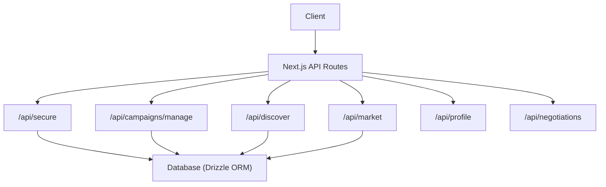
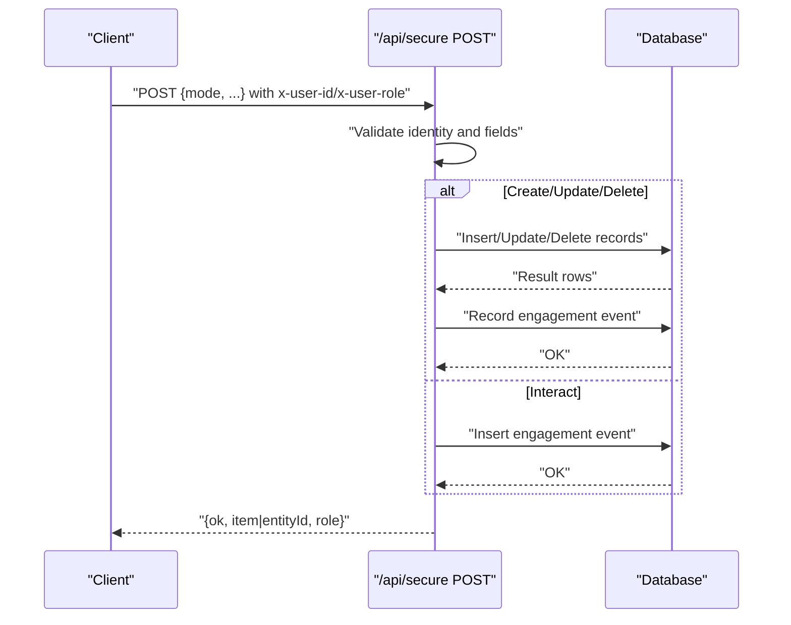
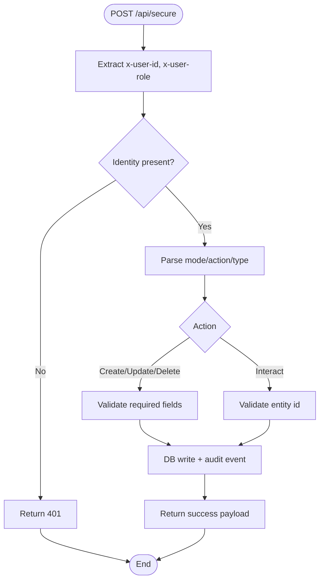
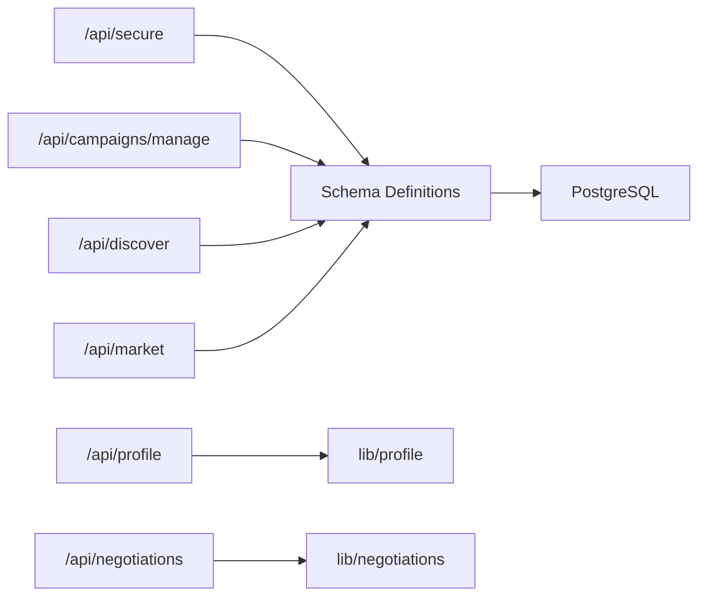
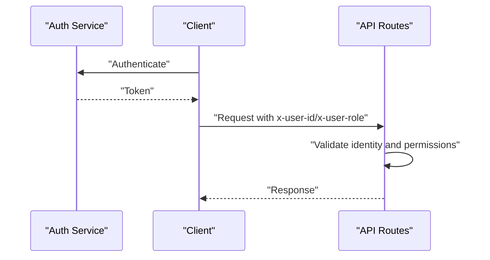

# Secure Endpoints

<cite>
**Referenced Files in This Document**
- [secure/route.ts](file://src/app/api/secure/route.ts)
- [campaigns/manage/route.ts](file://src/app/api/campaigns/manage/route.ts)
- [discover/route.ts](file://src/app/api/discover/route.ts)
- [market/route.ts](file://src/app/api/market/route.ts)
- [profile/route.ts](file://src/app/api/profile/route.ts)
- [negotiations/route.ts](file://src/app/api/negotiations/route.ts)
- [schema.ts](file://src/db/schema.ts)
- [db.ts](file://src/lib/db.ts)
- [next.config.ts](file://next.config.ts)
</cite>

## Table of Contents
1. [Introduction](#introduction)
2. [Project Structure](#project-structure)
3. [Core Components](#core-components)
4. [Architecture Overview](#architecture-overview)
5. [Detailed Component Analysis](#detailed-component-analysis)
6. [Dependency Analysis](#dependency-analysis)
7. [Performance Considerations](#performance-considerations)
8. [Troubleshooting Guide](#troubleshooting-guide)
9. [Conclusion](#conclusion)
10. [Appendices](#appendices)

## Introduction
This document provides API security documentation for the secure endpoints exposed by the application. It focuses on authentication and authorization mechanisms, security headers, token validation, session management, access control, CORS configuration, input sanitization, protection against common vulnerabilities, error responses, and integration examples. The goal is to help clients integrate securely and reliably with the API while following best practices.

## Project Structure
The secure API surface is implemented as Next.js Route Handlers under src/app/api. Key routes include:
- /api/secure: Multi-action endpoint for creating and managing campaigns, vacancies, market listings, and engagement events.
- /api/campaigns/manage: Campaign lifecycle management with ownership checks.
- /api/discover: Public discovery listing creation (with minimal auth).
- /api/market: Market listing creation with social profile verification.
- /api/profile: Profile summary retrieval.
- /api/negotiations: Negotiation data retrieval.

**Diagram sources**
- [secure/route.ts:111-152](file://src/app/api/secure/route.ts#L111-L152)
- [campaigns/manage/route.ts:55-178](file://src/app/api/campaigns/manage/route.ts#L55-L178)
- [discover/route.ts:15-77](file://src/app/api/discover/route.ts#L15-L77)
- [market/route.ts:164-262](file://src/app/api/market/route.ts#L164-L262)
- [profile/route.ts:4-12](file://src/app/api/profile/route.ts#L4-L12)
- [negotiations/route.ts:4-12](file://src/app/api/negotiations/route.ts#L4-L12)

**Section sources**
- [secure/route.ts:111-152](file://src/app/api/secure/route.ts#L111-L152)
- [campaigns/manage/route.ts:55-178](file://src/app/api/campaigns/manage/route.ts#L55-L178)
- [discover/route.ts:15-77](file://src/app/api/discover/route.ts#L15-L77)
- [market/route.ts:164-262](file://src/app/api/market/route.ts#L164-L262)
- [profile/route.ts:4-12](file://src/app/api/profile/route.ts#L4-L12)
- [negotiations/route.ts:4-12](file://src/app/api/negotiations/route.ts#L4-L12)

## Core Components
- Authentication model: Identity is conveyed via custom headers x-user-id and x-user-role. Some endpoints also accept userId/role in the request body as fallbacks.
- Authorization model: Ownership-based checks are enforced where applicable (e.g., campaign updates/pause/delete require matching createdBy).
- Input validation and sanitization: Centralized helpers normalize inputs; numeric coercion and string trimming are applied consistently.
- Audit logging: Engagement events are recorded for key actions (create, update, delete, status changes, approvals).
- Database layer: Drizzle ORM queries operate over typed schema definitions.

Security-relevant behaviors observed:
- Identity extraction from headers or body with safe defaults.
- Role propagation in responses for client-side decisions.
- Strict field validation before writes.
- Error handling returns structured JSON with HTTP status codes.

**Section sources**
- [secure/route.ts:154-162](file://src/app/api/secure/route.ts#L154-L162)
- [campaigns/manage/route.ts:119-167](file://src/app/api/campaigns/manage/route.ts#L119-L167)
- [schema.ts:3-84](file://src/db/schema.ts#L3-L84)

## Architecture Overview
The secure API follows a route-handler pattern with per-route responsibilities:
- /api/secure handles multiple modes (create/update/delete/interact) based on a mode/action/type field.
- /api/campaigns/manage enforces ownership checks for write operations.
- /api/discover and /api/market provide domain-specific creation flows with validation and external verification (for market listings).
- /api/profile and /api/negotiations expose read-only endpoints.

**Diagram sources**
- [secure/route.ts:154-534](file://src/app/api/secure/route.ts#L154-L534)
- [schema.ts:75-84](file://src/db/schema.ts#L75-L84)

## Detailed Component Analysis

### /api/secure
Responsibilities:
- Unified multi-action endpoint supporting create and manage operations for campaigns, vacancies, market listings, and engagement events.
- Identity extraction from headers or body; role propagation in responses.
- Validation and sanitization of inputs using helper functions.
- Auditing via engagement events for mutations.

Authentication and Authorization:
- Identity required via x-user-id header or body fields; missing identity yields 401.
- Role propagated via x-user-role header or body; used in responses.

Input Sanitization:
- Numeric coercion with safe fallbacks.
- String normalization and trimming.
- Array parsing for comma-separated or array inputs.

Error Handling:
- Structured JSON errors with appropriate HTTP status codes (400, 401, 404, 500).
- Catch blocks log errors and return user-friendly messages.

Key Actions:
- create_discover, create_campaign, create_market
- pause_vacancy, delete_vacancy
- pause_campaign, delete_campaign
- pause_listing, update_listing, delete_listing
- interact
- update_campaign, update_campaign_status, approve_campaign_submission

**Diagram sources**
- [secure/route.ts:154-534](file://src/app/api/secure/route.ts#L154-L534)

**Section sources**
- [secure/route.ts:111-152](file://src/app/api/secure/route.ts#L111-L152)
- [secure/route.ts:154-534](file://src/app/api/secure/route.ts#L154-L534)

### /api/campaigns/manage
Responsibilities:
- Campaign CRUD with strict ownership enforcement for updates, pause/resume, and delete.
- Ensures database schema exists before operations.

Authorization:
- Only the creator (createdBy) can modify or delete a campaign; otherwise returns 403.

Input Validation:
- Required fields validated; optional fields safely coerced.

Error Handling:
- Returns 400 for invalid requests, 404 if campaign not found, 403 for unauthorized modifications, 500 for server errors.

**Section sources**
- [campaigns/manage/route.ts:55-178](file://src/app/api/campaigns/manage/route.ts#L55-L178)

### /api/discover
Responsibilities:
- GET: Retrieve discover jobs.
- POST: Create a vacancy entry with basic validation.

Authentication:
- Accepts createdBy/userId from headers or body; defaults to anonymous when absent.

Validation:
- Title and description required; other fields have sensible defaults.

Error Handling:
- Returns 400 for missing required fields; 500 on failure.

**Section sources**
- [discover/route.ts:15-77](file://src/app/api/discover/route.ts#L15-L77)

### /api/market
Responsibilities:
- GET: Retrieve market cards.
- POST: Create a market listing with social profile verification.

External Verification:
- Validates social media profile URLs and extracts metrics; supports specific platforms.

Authentication:
- Accepts createdBy/userId from headers or body; defaults to anonymous.

Validation:
- Requires profileUrl and description; validates URL format and supported hosts.

Error Handling:
- Returns 400 for invalid inputs or verification failures; 500 on unexpected errors.

**Section sources**
- [market/route.ts:164-262](file://src/app/api/market/route.ts#L164-L262)

### /api/profile
Responsibilities:
- GET: Return profile summary.

Error Handling:
- Returns 500 with null payload on failure.

**Section sources**
- [profile/route.ts:4-12](file://src/app/api/profile/route.ts#L4-L12)

### /api/negotiations
Responsibilities:
- GET: Retrieve negotiation data.

Error Handling:
- Returns 500 with empty arrays on failure.

**Section sources**
- [negotiations/route.ts:4-12](file://src/app/api/negotiations/route.ts#L4-L12)

## Dependency Analysis
- All routes depend on Drizzle ORM for database interactions.
- Schema definitions enforce constraints and types at the database level.
- Some routes dynamically ensure schema existence before writes.

**Diagram sources**
- [schema.ts:3-84](file://src/db/schema.ts#L3-L84)
- [db.ts:1-5](file://src/lib/db.ts#L1-L5)

**Section sources**
- [schema.ts:3-84](file://src/db/schema.ts#L3-L84)
- [db.ts:1-5](file://src/lib/db.ts#L1-L5)

## Performance Considerations
- Use efficient queries with limits and ordering to avoid large result sets.
- Batch operations where possible (e.g., parallel reads in /api/secure GET).
- Avoid unnecessary external calls in hot paths; consider caching verified profiles if needed.
- Ensure indexes on frequently queried columns (e.g., created_by, status) to optimize lookups.

[No sources needed since this section provides general guidance]

## Troubleshooting Guide
Common issues and resolutions:
- Missing identity: Ensure x-user-id header is set; otherwise expect 401.
- Unauthorized modification: For campaign updates/deletes, verify that the requester matches createdBy; otherwise expect 403.
- Invalid inputs: Provide required fields (title, description, etc.); otherwise expect 400.
- External verification failures: For market listings, ensure profileUrl is valid and supported; otherwise expect 400 with descriptive message.
- Server errors: Check logs for stack traces; endpoints return 500 with generic messages to avoid leaking internals.

**Section sources**
- [secure/route.ts:154-162](file://src/app/api/secure/route.ts#L154-L162)
- [campaigns/manage/route.ts:119-167](file://src/app/api/campaigns/manage/route.ts#L119-L167)
- [market/route.ts:174-262](file://src/app/api/market/route.ts#L174-L262)

## Conclusion
The secure endpoints implement a consistent approach to identity extraction, input validation, and auditing. Authorization is primarily ownership-based for sensitive operations. While there is no centralized JWT or session middleware, clients should treat x-user-id and x-user-role as trusted identifiers issued by an upstream authenticator. To strengthen security further, consider implementing centralized middleware for token validation, rate limiting, and comprehensive CORS policies.

[No sources needed since this section summarizes without analyzing specific files]

## Appendices

### Security Headers and Token Validation
- Identity headers:
  - x-user-id: Required for authenticated mutations; accepted from headers or body fallbacks.
  - x-user-role: Optional; propagated in responses for client-side decisions.
- Token validation:
  - Not implemented in these routes. Clients must ensure tokens are validated upstream and inject x-user-id accordingly.

**Section sources**
- [secure/route.ts:154-162](file://src/app/api/secure/route.ts#L154-L162)
- [campaigns/manage/route.ts:55-67](file://src/app/api/campaigns/manage/route.ts#L55-L67)

### Session Management
- No server-side sessions are managed by these routes.
- Client applications may maintain local state for UI purposes; persistence is not enforced by the API.

[No sources needed since this section provides general guidance]

### Access Control Mechanisms
- Ownership checks: Enforced for campaign updates, pause/resume, and delete operations.
- Role-based hints: Role is returned in responses but not enforced server-side in these routes.

**Section sources**
- [campaigns/manage/route.ts:119-167](file://src/app/api/campaigns/manage/route.ts#L119-L167)

### Protected Endpoints Summary
- /api/secure: Requires identity; supports multiple actions with validation and auditing.
- /api/campaigns/manage: Requires identity; enforces ownership for write operations.
- /api/discover: Minimal identity; creates vacancies with validation.
- /api/market: Minimal identity; requires valid social profile URL and description.
- /api/profile: Read-only; returns profile summary.
- /api/negotiations: Read-only; returns negotiation data.

**Section sources**
- [secure/route.ts:111-152](file://src/app/api/secure/route.ts#L111-L152)
- [campaigns/manage/route.ts:55-178](file://src/app/api/campaigns/manage/route.ts#L55-L178)
- [discover/route.ts:15-77](file://src/app/api/discover/route.ts#L15-L77)
- [market/route.ts:164-262](file://src/app/api/market/route.ts#L164-L262)
- [profile/route.ts:4-12](file://src/app/api/profile/route.ts#L4-L12)
- [negotiations/route.ts:4-12](file://src/app/api/negotiations/route.ts#L4-L12)

### Authentication Flow
- Upstream authenticator issues a token and assigns a user identity and role.
- Client includes x-user-id (and optionally x-user-role) in requests to protected endpoints.
- Server validates presence of identity and proceeds with business logic and audits.

[No sources needed since this diagram shows conceptual workflow, not actual code structure]

### Token Refresh Procedures
- Not implemented in these routes. Implement refresh logic upstream and propagate updated identities via headers.

[No sources needed since this section provides general guidance]

### Permission Levels
- Roles are inferred from x-user-role and included in responses; enforcement is limited to ownership checks in specific routes.

**Section sources**
- [secure/route.ts:154-162](file://src/app/api/secure/route.ts#L154-L162)
- [campaigns/manage/route.ts:119-167](file://src/app/api/campaigns/manage/route.ts#L119-L167)

### CORS Configuration
- Development origins are configured to allow localhost.
- Production CORS should be explicitly configured to restrict allowed origins, methods, and headers.

**Section sources**
- [next.config.ts:3-5](file://next.config.ts#L3-L5)

### Input Sanitization
- Consistent use of helpers to coerce numbers and normalize strings.
- Arrays parsed from comma-separated strings or arrays.
- External URLs validated for supported domains and formats.

**Section sources**
- [secure/route.ts:10-29](file://src/app/api/secure/route.ts#L10-L29)
- [market/route.ts:37-56](file://src/app/api/market/route.ts#L37-L56)

### Protection Against Common Vulnerabilities
- SQL Injection: Mitigated by parameterized queries via Drizzle ORM.
- XSS: Server outputs JSON; frontend should sanitize when rendering.
- CSRF: Not applicable for stateless JSON APIs; ensure same-origin policies and proper headers.
- Rate Limiting: Not implemented; consider adding middleware to prevent abuse.
- Mass Assignment: Controlled by explicit field mapping and validation.

[No sources needed since this section provides general guidance]

### Error Responses
- 400: Bad request (missing required fields, invalid inputs).
- 401: Unauthorized (missing identity).
- 403: Forbidden (insufficient permissions, e.g., not campaign creator).
- 404: Not found (entity does not exist).
- 500: Internal server error (unexpected failures).

**Section sources**
- [secure/route.ts:154-162](file://src/app/api/secure/route.ts#L154-L162)
- [campaigns/manage/route.ts:119-167](file://src/app/api/campaigns/manage/route.ts#L119-L167)
- [market/route.ts:174-262](file://src/app/api/market/route.ts#L174-L262)

### Security Audit Logging
- Engagement events recorded for key actions (create, update, delete, status changes, approvals).
- Events include entity type, entity id, actor id, action, and message.

**Section sources**
- [schema.ts:75-84](file://src/db/schema.ts#L75-L84)
- [secure/route.ts:245-251](file://src/app/api/secure/route.ts#L245-L251)
- [secure/route.ts:295-301](file://src/app/api/secure/route.ts#L295-L301)
- [secure/route.ts:367-373](file://src/app/api/secure/route.ts#L367-L373)
- [secure/route.ts:417-423](file://src/app/api/secure/route.ts#L417-L423)
- [secure/route.ts:481-487](file://src/app/api/secure/route.ts#L481-L487)
- [secure/route.ts:499-505](file://src/app/api/secure/route.ts#L499-L505)
- [secure/route.ts:518-524](file://src/app/api/secure/route.ts#L518-L524)

### Integration Examples

#### Secure API Consumption
- Include x-user-id and optionally x-user-role headers in requests to /api/secure and /api/campaigns/manage.
- Send JSON payloads with mode/action/type and required fields.
- Handle error responses with appropriate status codes and messages.

**Section sources**
- [secure/route.ts:154-162](file://src/app/api/secure/route.ts#L154-L162)
- [campaigns/manage/route.ts:55-67](file://src/app/api/campaigns/manage/route.ts#L55-L67)

#### Token Management
- Obtain tokens from your authentication service.
- Attach x-user-id derived from validated tokens to each request.
- Refresh tokens upstream and update headers accordingly.

[No sources needed since this section provides general guidance]

#### Error Handling Patterns
- Check HTTP status codes and parse JSON error objects.
- Retry on transient 500 errors with backoff.
- Surface user-friendly messages to users based on error types.

**Section sources**
- [secure/route.ts:148-151](file://src/app/api/secure/route.ts#L148-L151)
- [campaigns/manage/route.ts:174-178](file://src/app/api/campaigns/manage/route.ts#L174-L178)
- [market/route.ts:257-260](file://src/app/api/market/route.ts#L257-L260)