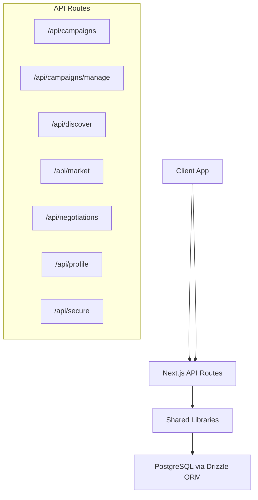
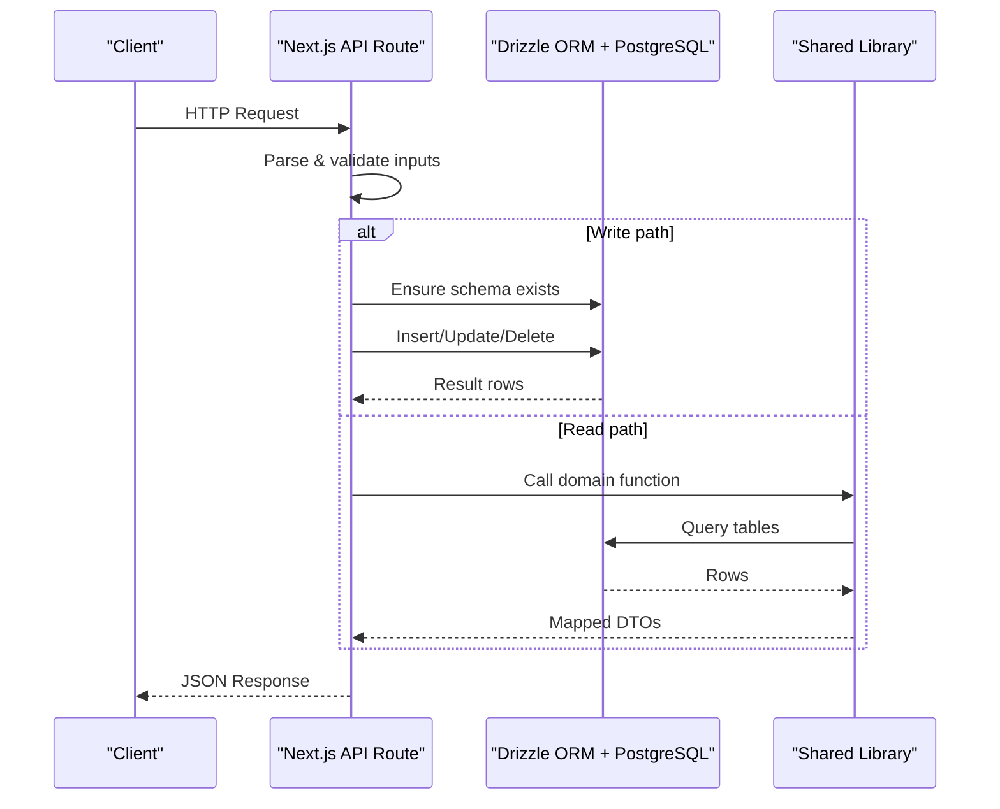
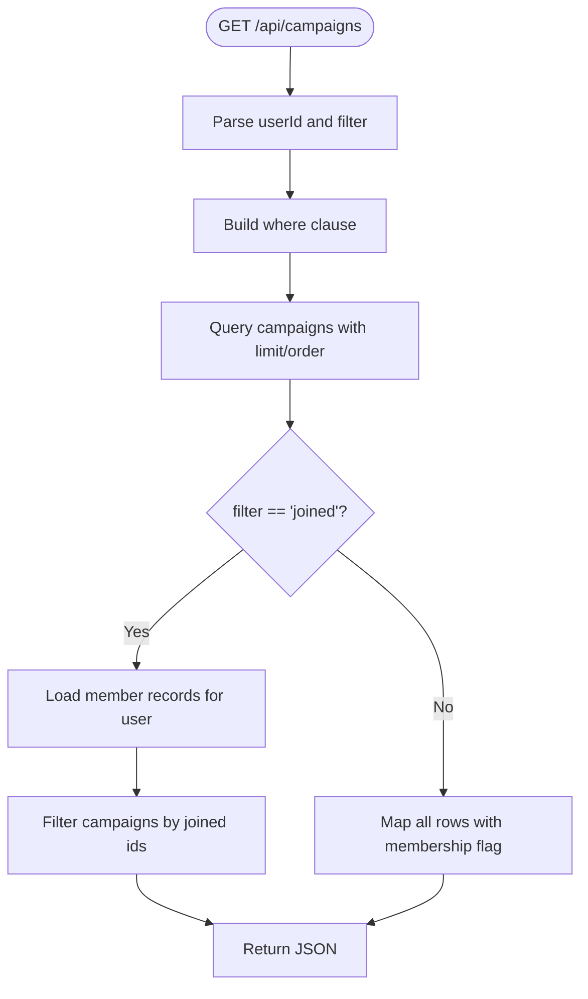
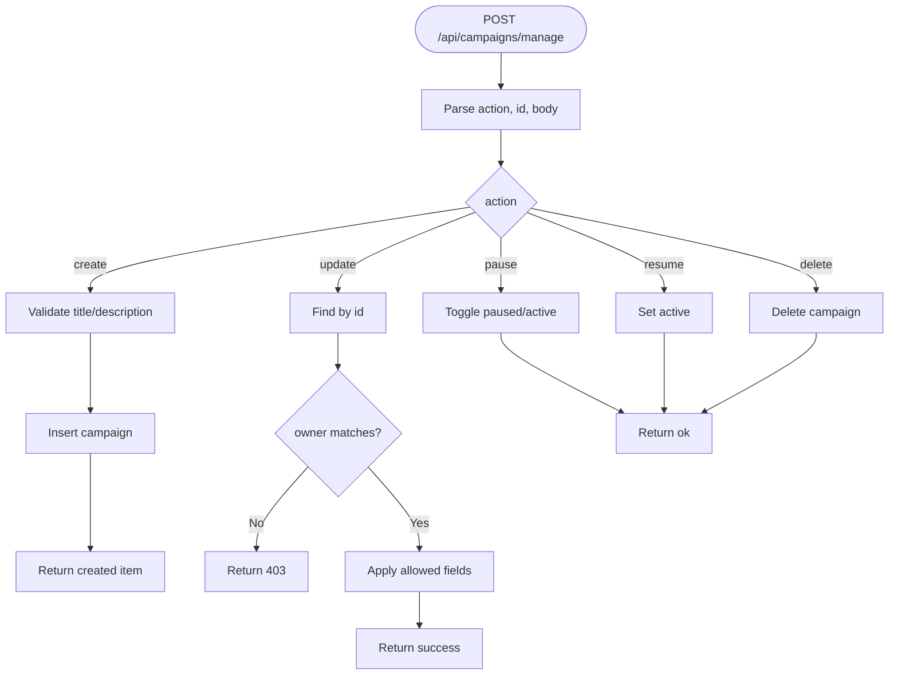
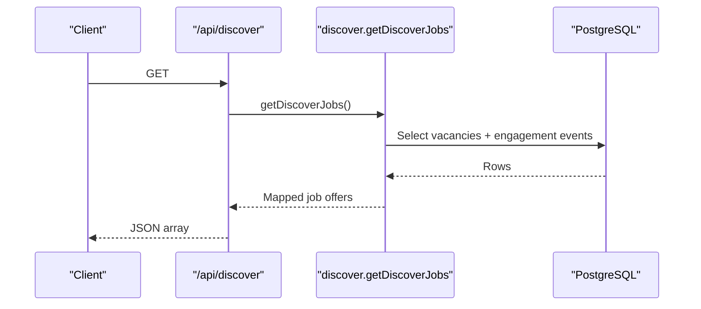
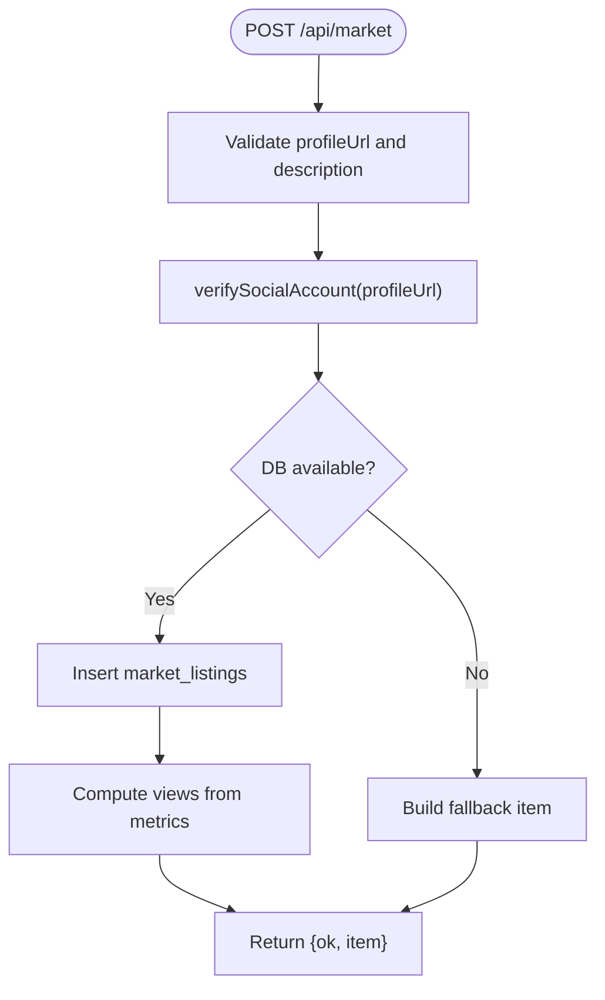
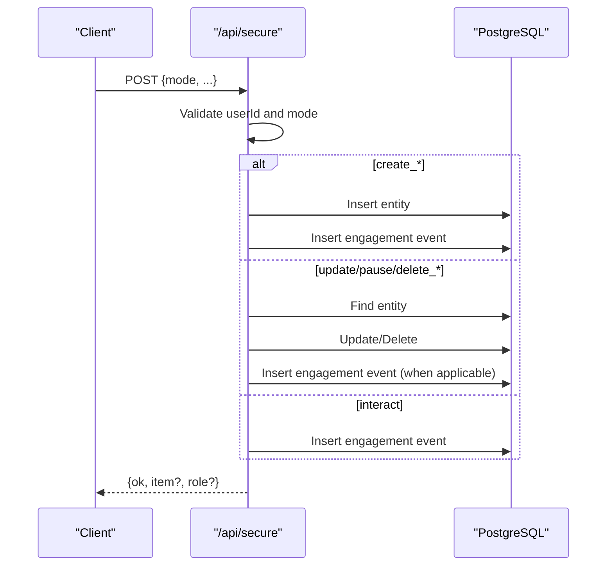
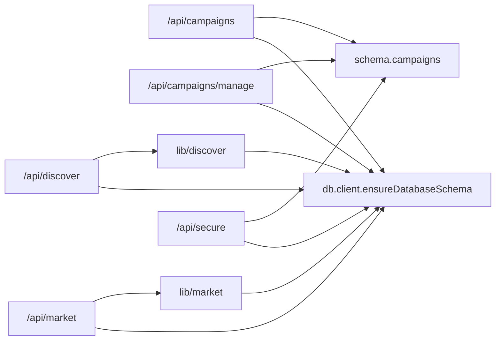

# API Architecture & Routes

<cite>
**Referenced Files in This Document**
- [route.ts](file://src/app/api/campaigns/route.ts)
- [route.ts](file://src/app/api/campaigns/manage/route.ts)
- [route.ts](file://src/app/api/discover/route.ts)
- [route.ts](file://src/app/api/market/route.ts)
- [route.ts](file://src/app/api/negotiations/route.ts)
- [route.ts](file://src/app/api/profile/route.ts)
- [route.ts](file://src/app/api/secure/route.ts)
- [schema.ts](file://src/db/schema.ts)
- [client.ts](file://src/db/client.ts)
- [db.ts](file://src/lib/db.ts)
- [discover.ts](file://src/lib/discover.ts)
- [market.ts](file://src/lib/market.ts)
- [profile.ts](file://src/lib/profile.ts)
- [next.config.ts](file://next.config.ts)
</cite>

## Table of Contents
1. Introduction
2. Project Structure
3. Core Components
4. Architecture Overview
5. Detailed Component Analysis
6. Dependency Analysis
7. Performance Considerations
8. Troubleshooting Guide
9. Conclusion

## Introduction
This document describes the RESTful API architecture for PortVille Market’s backend services built with Next.js API routes. It explains HTTP method usage, URL conventions, request/response handling, input validation, error management, authentication and authorization patterns, middleware considerations, database interaction patterns (including transaction-like behavior), versioning strategy, documentation standards, client integration guidelines, security considerations, input sanitization, and vulnerability prevention measures.

## Project Structure
The API is organized by feature under src/app/api:
- /api/campaigns: List and create campaigns
- /api/campaigns/manage: Create/update/pause/resume/delete campaigns
- /api/discover: List and create job vacancies
- /api/market: List and create market listings with social profile verification
- /api/negotiations: Read negotiation data
- /api/profile: Read profile summary
- /api/secure: Unified secure endpoint for multi-entity operations and activity logging

Database schema and client utilities are centralized under src/db and src/lib.

**Diagram sources**
- [route.ts:1-142](file://src/app/api/campaigns/route.ts#L1-L142)
- [route.ts:1-179](file://src/app/api/campaigns/manage/route.ts#L1-L179)
- [route.ts:1-77](file://src/app/api/discover/route.ts#L1-L77)
- [route.ts:1-262](file://src/app/api/market/route.ts#L1-L262)
- [route.ts:1-13](file://src/app/api/negotiations/route.ts#L1-L13)
- [route.ts:1-13](file://src/app/api/profile/route.ts#L1-L13)
- [route.ts:1-535](file://src/app/api/secure/route.ts#L1-L535)
- [client.ts:1-152](file://src/db/client.ts#L1-L152)

**Section sources**
- [route.ts:1-142](file://src/app/api/campaigns/route.ts#L1-L142)
- [route.ts:1-179](file://src/app/api/campaigns/manage/route.ts#L1-L179)
- [route.ts:1-77](file://src/app/api/discover/route.ts#L1-L77)
- [route.ts:1-262](file://src/app/api/market/route.ts#L1-L262)
- [route.ts:1-13](file://src/app/api/negotiations/route.ts#L1-L13)
- [route.ts:1-13](file://src/app/api/profile/route.ts#L1-L13)
- [route.ts:1-535](file://src/app/api/secure/route.ts#L1-L535)
- [schema.ts:1-84](file://src/db/schema.ts#L1-L84)
- [client.ts:1-152](file://src/db/client.ts#L1-L152)

## Core Components
- Campaigns API: GET lists active or filtered campaigns; POST creates a campaign with basic validation.
- Campaign Management API: POST supports create/update/pause/resume/delete with ownership checks.
- Discover API: GET returns jobs; POST creates a vacancy with requirements parsing.
- Market API: GET returns listings; POST verifies social profiles and persists listings with computed metrics.
- Negotiations API: GET returns negotiation data from library.
- Profile API: GET returns profile summary from library.
- Secure API: GET aggregates multiple entities; POST handles many write actions across entities and logs engagement events.

Key patterns:
- Input normalization helpers toNumber and toString ensure safe parsing.
- Database schema enforced via ensureDatabaseSchema before writes.
- Consistent JSON responses with ok/error fields and appropriate HTTP status codes.

**Section sources**
- [route.ts:10-17](file://src/app/api/campaigns/route.ts#L10-L17)
- [route.ts:46-98](file://src/app/api/campaigns/route.ts#L46-L98)
- [route.ts:100-142](file://src/app/api/campaigns/route.ts#L100-L142)
- [route.ts:10-27](file://src/app/api/campaigns/manage/route.ts#L10-L27)
- [route.ts:55-179](file://src/app/api/campaigns/manage/route.ts#L55-L179)
- [route.ts:15-77](file://src/app/api/discover/route.ts#L15-L77)
- [route.ts:164-262](file://src/app/api/market/route.ts#L164-L262)
- [route.ts:111-152](file://src/app/api/secure/route.ts#L111-L152)
- [route.ts:154-535](file://src/app/api/secure/route.ts#L154-L535)

## Architecture Overview
The API follows a feature-based routing pattern with Next.js server-side handlers. Data access uses Drizzle ORM against PostgreSQL. Some endpoints call shared libraries that encapsulate business logic and queries. The secure endpoint centralizes multi-entity mutations and activity logging.

**Diagram sources**
- [route.ts:46-98](file://src/app/api/campaigns/route.ts#L46-L98)
- [route.ts:100-142](file://src/app/api/campaigns/route.ts#L100-L142)
- [route.ts:15-77](file://src/app/api/discover/route.ts#L15-L77)
- [route.ts:164-262](file://src/app/api/market/route.ts#L164-L262)
- [route.ts:111-152](file://src/app/api/secure/route.ts#L111-L152)
- [route.ts:154-535](file://src/app/api/secure/route.ts#L154-L535)
- [discover.ts:47-70](file://src/lib/discover.ts#L47-L70)
- [market.ts:43-50](file://src/lib/market.ts#L43-L50)
- [client.ts:61-145](file://src/db/client.ts#L61-L145)

## Detailed Component Analysis

### Campaigns API (/api/campaigns)
- GET: Lists campaigns with optional filter (created/joined/all). Uses userId from header or query param. Applies where clauses and ordering. Returns mapped campaign objects with membership flags.
- POST: Creates a campaign with title/description validation. Inserts into campaigns table and returns created item.

**Diagram sources**
- [route.ts:46-98](file://src/app/api/campaigns/route.ts#L46-L98)

**Section sources**
- [route.ts:46-98](file://src/app/api/campaigns/route.ts#L46-L98)
- [route.ts:100-142](file://src/app/api/campaigns/route.ts#L100-L142)

### Campaign Management API (/api/campaigns/manage)
- POST: Supports action-based operations:
  - create: Validates and inserts campaign with optional start date and payout ranges.
  - update: Ownership check (createdBy === userId), partial updates with safe field mapping.
  - pause/resume: Toggles status with ownership check.
  - delete: Ownership check and deletion.
- All actions return consistent JSON responses.

**Diagram sources**
- [route.ts:55-179](file://src/app/api/campaigns/manage/route.ts#L55-L179)

**Section sources**
- [route.ts:55-179](file://src/app/api/campaigns/manage/route.ts#L55-L179)

### Discover API (/api/discover)
- GET: Returns job vacancies via library function that maps DB rows to UI-friendly DTOs.
- POST: Creates a vacancy with flexible field names, parses requirements array, sets defaults, and persists.

**Diagram sources**
- [route.ts:15-23](file://src/app/api/discover/route.ts#L15-L23)
- [discover.ts:47-70](file://src/lib/discover.ts#L47-L70)

**Section sources**
- [route.ts:15-77](file://src/app/api/discover/route.ts#L15-L77)
- [discover.ts:47-70](file://src/lib/discover.ts#L47-L70)

### Market API (/api/market)
- GET: Returns market listings via library mapper.
- POST: Verifies social profile URLs, extracts metrics, computes views and engagement rate, then persists listing. Falls back gracefully if DB unavailable.

**Diagram sources**
- [route.ts:174-262](file://src/app/api/market/route.ts#L174-L262)
- [route.ts:37-162](file://src/app/api/market/route.ts#L37-L162)
- [market.ts:43-50](file://src/lib/market.ts#L43-L50)

**Section sources**
- [route.ts:164-262](file://src/app/api/market/route.ts#L164-L262)
- [market.ts:43-50](file://src/lib/market.ts#L43-L50)

### Negotiations API (/api/negotiations)
- GET: Delegates to library to fetch negotiation data and returns JSON.

**Section sources**
- [route.ts:1-13](file://src/app/api/negotiations/route.ts#L1-L13)

### Profile API (/api/profile)
- GET: Returns profile summary from library.

**Section sources**
- [route.ts:1-13](file://src/app/api/profile/route.ts#L1-L13)
- [profile.ts:16-32](file://src/lib/profile.ts#L16-L32)

### Secure API (/api/secure)
- GET: Aggregates recent vacancies, campaigns, market listings (filtered by userId), and engagement events. Computes joined/participated campaign sets.
- POST: Centralized action handler supporting:
  - create_discover, create_campaign, create_market
  - pause_vacancy, delete_vacancy
  - pause_campaign, delete_campaign
  - pause_listing, update_listing, delete_listing
  - interact (logs engagement events)
  - update_campaign, update_campaign_status, approve_campaign_submission
- Enforces userId presence and returns role when provided. Logs actions to engagement_events.

**Diagram sources**
- [route.ts:111-152](file://src/app/api/secure/route.ts#L111-L152)
- [route.ts:154-535](file://src/app/api/secure/route.ts#L154-L535)

**Section sources**
- [route.ts:111-152](file://src/app/api/secure/route.ts#L111-L152)
- [route.ts:154-535](file://src/app/api/secure/route.ts#L154-L535)

## Dependency Analysis
- API routes depend on:
  - Drizzle ORM client and schema definitions for type-safe queries.
  - Shared libraries for domain-specific reads and mappings.
  - Database initialization helper to ensure schema existence before writes.

**Diagram sources**
- [schema.ts:1-84](file://src/db/schema.ts#L1-L84)
- [client.ts:61-145](file://src/db/client.ts#L61-L145)
- [discover.ts:47-70](file://src/lib/discover.ts#L47-L70)
- [market.ts:43-50](file://src/lib/market.ts#L43-L50)

**Section sources**
- [schema.ts:1-84](file://src/db/schema.ts#L1-L84)
- [client.ts:1-152](file://src/db/client.ts#L1-L152)
- [discover.ts:47-70](file://src/lib/discover.ts#L47-L70)
- [market.ts:43-50](file://src/lib/market.ts#L43-L50)

## Performance Considerations
- Use limits and ordering on list endpoints to avoid large result sets.
- Prefer selective selects and joins only when necessary; current routes use simple selects with limits.
- Batch independent reads using Promise.all in aggregate endpoints (e.g., secure GET).
- Cache frequently accessed read-only data at the edge or application layer if needed.
- Avoid heavy external calls per request; market verification performs network I/O and should be rate-limited and cached where possible.

[No sources needed since this section provides general guidance]

## Troubleshooting Guide
Common issues and resolutions:
- Missing DATABASE_URL: Initialization throws an error; ensure environment configuration.
- Schema not initialized: ensureDatabaseSchema runs on writes; verify it executes successfully.
- Validation failures: Endpoints return 400 with descriptive errors; check required fields like title/description.
- Authorization failures: Ownership checks return 403; confirm userId matches createdBy.
- External verification failures: Market profile verification may fail due to platform changes; handle errors gracefully and provide user feedback.

**Section sources**
- [client.ts:34-39](file://src/db/client.ts#L34-L39)
- [client.ts:61-145](file://src/db/client.ts#L61-L145)
- [route.ts:113-115](file://src/app/api/campaigns/route.ts#L113-L115)
- [route.ts:120-122](file://src/app/api/campaigns/manage/route.ts#L120-L122)
- [route.ts:185-191](file://src/app/api/market/route.ts#L185-L191)
- [route.ts:157-162](file://src/app/api/secure/route.ts#L157-L162)

## Conclusion
PortVille Market’s API leverages Next.js route handlers with clear separation of concerns, robust input validation, and consistent error handling. Database interactions are centralized through Drizzle ORM with schema enforcement. The secure endpoint consolidates complex workflows and activity logging. For production, consider adding explicit authentication middleware, rate limiting, CORS configuration, and API versioning to enhance security, scalability, and maintainability.

[No sources needed since this section summarizes without analyzing specific files]

## Appendices

### RESTful Design Conventions
- Methods:
  - GET: Retrieve resources (list/read)
  - POST: Create resources or perform actions (write/aggregate)
- URL conventions:
  - Resource-oriented paths: /api/campaigns, /api/discover, /api/market
  - Action-oriented subpaths: /api/campaigns/manage?action=create|update|pause|resume|delete
  - Secure multi-action endpoint: /api/secure?mode=create_*|update_*|delete_*|interact
- Headers:
  - x-user-id: Identifies the actor for ownership and personalization
  - x-user-role: Optional role context returned in responses

**Section sources**
- [route.ts:46-98](file://src/app/api/campaigns/route.ts#L46-L98)
- [route.ts:55-179](file://src/app/api/campaigns/manage/route.ts#L55-L179)
- [route.ts:154-535](file://src/app/api/secure/route.ts#L154-L535)

### Authentication and Authorization Patterns
- Identity propagation via x-user-id header or body fields.
- Ownership checks compare userId with createdBy before mutating resources.
- Role context optionally passed and echoed in responses.

**Section sources**
- [route.ts:113-114](file://src/app/api/secure/route.ts#L113-L114)
- [route.ts:157-162](file://src/app/api/secure/route.ts#L157-L162)
- [route.ts:120-122](file://src/app/api/campaigns/manage/route.ts#L120-L122)

### Middleware Patterns (Logging, Rate Limiting, CORS)
- Logging: Console.error used for exceptions; consider structured logging middleware.
- Rate limiting: Not implemented; add at framework level or reverse proxy.
- CORS: next.config allows localhost dev origins; configure production origins explicitly.

**Section sources**
- [next.config.ts:3-5](file://next.config.ts#L3-L5)

### Database Interaction Patterns
- Schema enforcement: ensureDatabaseSchema ensures tables exist before writes.
- Transaction-like behavior: Multiple related writes grouped within a single request handler (e.g., create entity + insert engagement event).
- Query optimization: Limits and ordering applied; selective selects used.

**Section sources**
- [client.ts:61-145](file://src/db/client.ts#L61-L145)
- [route.ts:245-253](file://src/app/api/secure/route.ts#L245-L253)
- [route.ts:417-425](file://src/app/api/secure/route.ts#L417-L425)

### API Versioning Strategy
- Current design uses flat routes without version prefix.
- Recommended approach: Introduce /api/v1/* for future compatibility while maintaining backward compatibility during transitions.

[No sources needed since this section provides general guidance]

### Documentation Standards
- Provide OpenAPI/Swagger specs for each endpoint group.
- Include request/response schemas, error formats, and examples.
- Maintain inline comments describing validation rules and side effects.

[No sources needed since this section provides general guidance]

### Client Integration Guidelines
- Always send x-user-id for identity-aware endpoints.
- Handle 4xx/5xx responses and display user-friendly messages.
- Respect limits and pagination hints if added later.
- Retry failed requests with exponential backoff for transient errors.

[No sources needed since this section provides general guidance]

### Security Considerations
- Input sanitization: Use toNumber/toString helpers to coerce and trim inputs.
- URL validation: Social profile URLs validated via URL constructor and host allowlists.
- External calls: Market verification fetches external pages; sanitize outputs and handle errors safely.
- Vulnerability prevention: Avoid raw SQL injection risks by using Drizzle ORM; enforce schema constraints.

**Section sources**
- [route.ts:10-17](file://src/app/api/campaigns/route.ts#L10-L17)
- [route.ts:37-56](file://src/app/api/market/route.ts#L37-L56)
- [route.ts:174-262](file://src/app/api/market/route.ts#L174-L262)