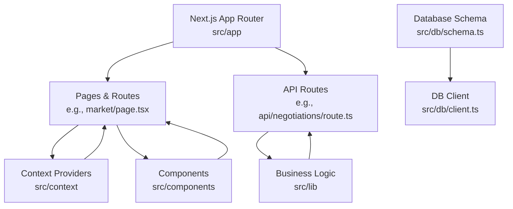
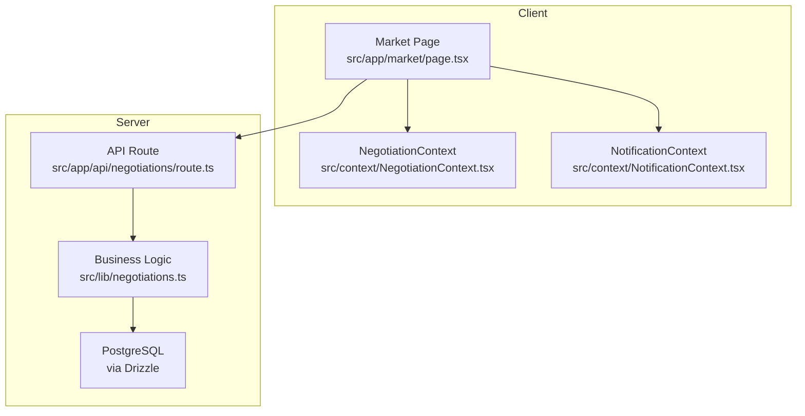
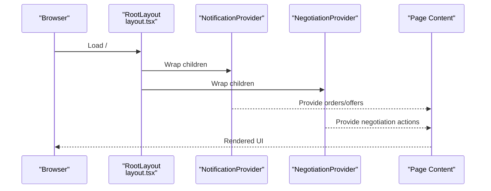
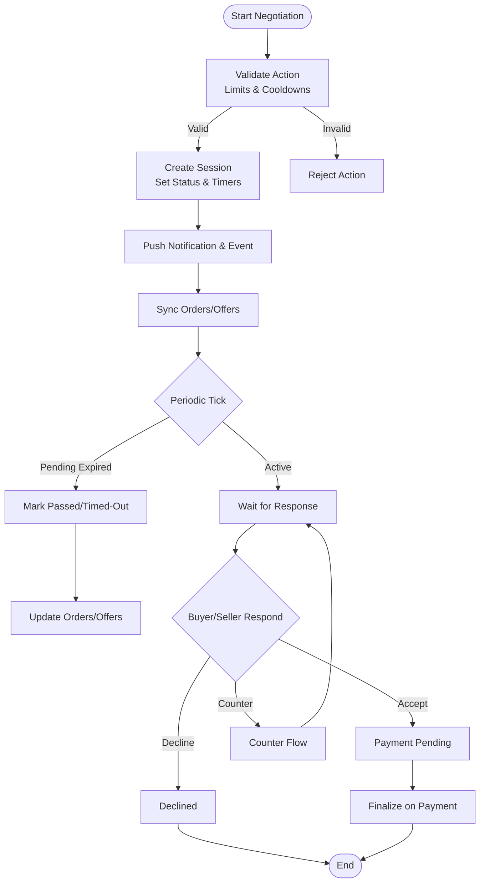
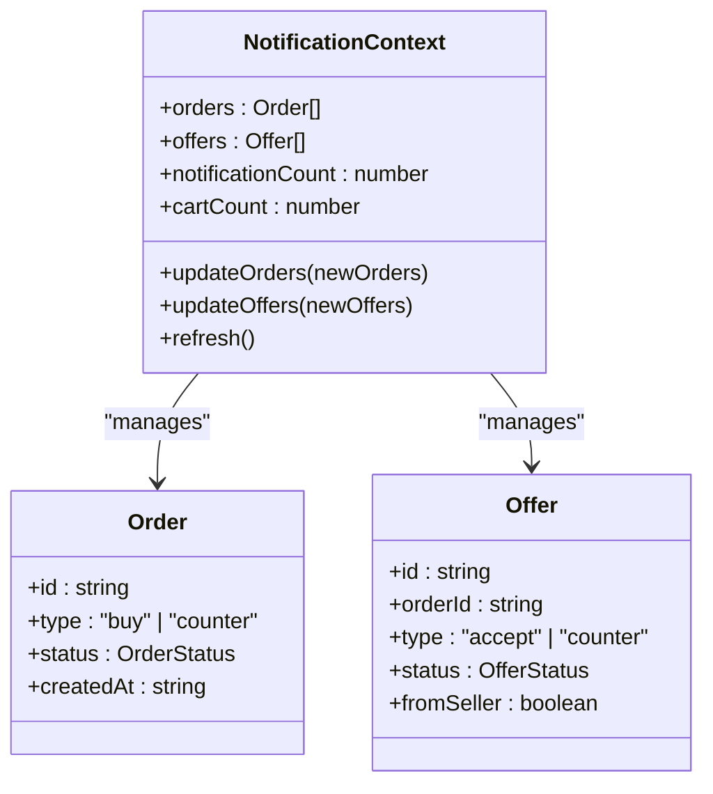
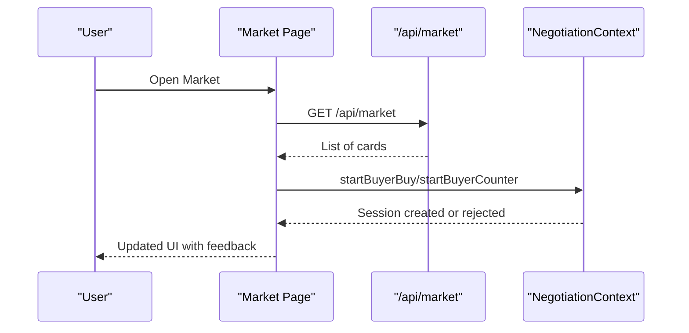
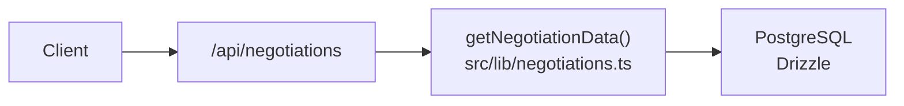
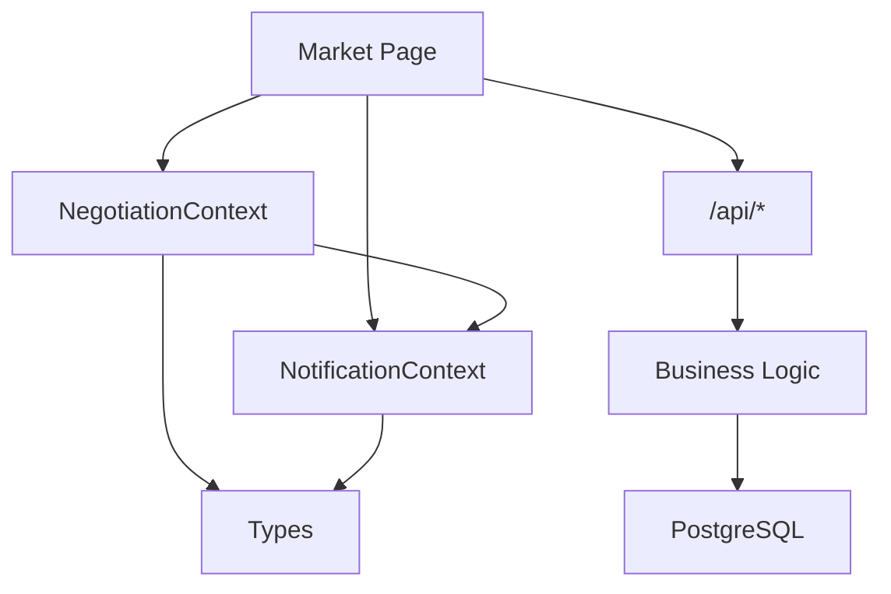

# Architecture & Design

<cite>
**Referenced Files in This Document**
- [layout.tsx](file://src/app/layout.tsx)
- [schema.ts](file://src/db/schema.ts)
- [0000_init.sql](file://drizzle/0000_init.sql)
- [client.ts](file://src/db/client.ts)
- [db.ts](file://src/lib/db.ts)
- [NegotiationContext.tsx](file://src/context/NegotiationContext.tsx)
- [NotificationContext.tsx](file://src/context/NotificationContext.tsx)
- [negotiation.ts](file://src/lib/negotiation.ts)
- [negotiations.ts](file://src/lib/negotiations.ts)
- [route.ts (negotiations)](file://src/app/api/negotiations/route.ts)
- [page.tsx (market)](file://src/app/market/page.tsx)
- [types.ts](file://src/types.ts)
- [package.json](file://package.json)
</cite>

## Table of Contents
1. [Introduction](#introduction)
2. [Project Structure](#project-structure)
3. [Core Components](#core-components)
4. [Architecture Overview](#architecture-overview)
5. [Detailed Component Analysis](#detailed-component-analysis)
6. [Dependency Analysis](#dependency-analysis)
7. [Performance Considerations](#performance-considerations)
8. [Troubleshooting Guide](#troubleshooting-guide)
9. [Conclusion](#conclusion)
10. [Appendices](#appendices)

## Introduction
This document describes the architecture and design of PortVille Market, a Next.js application using the App Router with server-side rendering and client-side interactivity. It explains the component hierarchy, Context-based state management for negotiations and notifications, separation of concerns across pages, components, and business logic, and the database schema and data flow using Drizzle ORM with PostgreSQL. It also details the real-time negotiation system, API route organization, integration patterns, system boundaries, technical decisions, scalability considerations, and deployment topology.

## Project Structure
The project follows a feature-oriented layout within Next.js App Router:
- Pages and routes under src/app define UI surfaces and API endpoints.
- Shared UI components live under src/components.
- Global state is managed via React Context providers in src/context.
- Business logic and utilities are organized under src/lib.
- Data access and schema definitions are under src/db.
- TypeScript types are centralized in src/types.



**Diagram sources**
- [page.tsx (market):1-159](file://src/app/market/page.tsx#L1-L159)
- [route.ts (negotiations):1-13](file://src/app/api/negotiations/route.ts#L1-L13)
- [NegotiationContext.tsx:1-706](file://src/context/NegotiationContext.tsx#L1-L706)
- [NotificationContext.tsx:1-146](file://src/context/NotificationContext.tsx#L1-L146)
- [schema.ts:1-84](file://src/db/schema.ts#L1-L84)
- [client.ts:1-152](file://src/db/client.ts#L1-L152)

**Section sources**
- [layout.tsx:15-43](file://src/app/layout.tsx#L15-L43)
- [page.tsx (market):1-159](file://src/app/market/page.tsx#L1-L159)
- [route.ts (negotiations):1-13](file://src/app/api/negotiations/route.ts#L1-L13)

## Core Components
- Root layout wraps the app with global providers for notifications and negotiations, ensuring consistent UI chrome and shared state.
- NegotiationContext manages negotiation sessions, timers, cooldowns, and synchronization with orders/offers.
- NotificationContext persists and shares orders and offers across the app, computing badge counts and visibility flags.
- API routes expose server endpoints to fetch negotiation-related data and other domain resources.
- Database layer uses Drizzle ORM with a PostgreSQL connection pool and schema initialization.

Key responsibilities:
- Pages orchestrate data fetching and user interactions.
- Components render reusable UI pieces.
- Contexts centralize cross-cutting state.
- Lib modules encapsulate business rules and data mapping.
- DB module provides typed access to PostgreSQL.

**Section sources**
- [layout.tsx:15-43](file://src/app/layout.tsx#L15-L43)
- [NegotiationContext.tsx:140-706](file://src/context/NegotiationContext.tsx#L140-L706)
- [NotificationContext.tsx:22-146](file://src/context/NotificationContext.tsx#L22-L146)
- [client.ts:34-152](file://src/db/client.ts#L34-L152)

## Architecture Overview
PortVille Market uses a hybrid SSR/CSR approach:
- Server renders initial HTML for performance and SEO.
- Client hydrates interactive features and maintains local state via Context and localStorage.
- Real-time-like behavior is achieved through periodic client-side ticks and event-driven updates.



**Diagram sources**
- [page.tsx (market):1-159](file://src/app/market/page.tsx#L1-L159)
- [route.ts (negotiations):1-13](file://src/app/api/negotiations/route.ts#L1-L13)
- [negotiations.ts:1-63](file://src/lib/negotiations.ts#L1-L63)
- [client.ts:1-152](file://src/db/client.ts#L1-L152)

## Detailed Component Analysis

### Root Layout and Providers
- The root layout mounts Navbar/Footer and wraps children with NotificationProvider and NegotiationProvider.
- This ensures all pages have access to negotiation flows and notification/order/offer state.



**Diagram sources**
- [layout.tsx:15-43](file://src/app/layout.tsx#L15-L43)

**Section sources**
- [layout.tsx:15-43](file://src/app/layout.tsx#L15-L43)

### Negotiation System (Client-Side State Machine)
- NegotiationContext implements a state machine for buyer/seller interactions with statuses like idle, buyer-pending, seller-pending, accepted, payment-pending, declined, timed-out, passed, finalized.
- Enforces cooldowns, daily action limits, alternating counter turns, and minimum discount thresholds.
- Persists sessions, notifications, and events to localStorage; syncs with NotificationContext orders/offers.
- Runs a periodic tick to expire pending states and update related lists.



**Diagram sources**
- [NegotiationContext.tsx:140-706](file://src/context/NegotiationContext.tsx#L140-L706)

**Section sources**
- [NegotiationContext.tsx:140-706](file://src/context/NegotiationContext.tsx#L140-L706)

### Notification and Order/Offer Management
- NotificationContext stores orders and offers in memory and persists to localStorage.
- Computes badge counts for unviewed notifications and cart items.
- Provides methods to update orders/offers and refresh from storage.



**Diagram sources**
- [NotificationContext.tsx:1-146](file://src/context/NotificationContext.tsx#L1-L146)
- [types.ts:1-89](file://src/types.ts#L1-L89)

**Section sources**
- [NotificationContext.tsx:22-146](file://src/context/NotificationContext.tsx#L22-L146)
- [types.ts:1-89](file://src/types.ts#L1-L89)

### Market Page Integration
- The Market page loads listings via an API call, renders cards, and triggers negotiation actions through the context.
- Uses dynamic imports for heavy components to optimize loading.



**Diagram sources**
- [page.tsx (market):1-159](file://src/app/market/page.tsx#L1-L159)

**Section sources**
- [page.tsx (market):1-159](file://src/app/market/page.tsx#L1-L159)

### API Route Organization
- API routes are grouped by domain under src/app/api.
- The negotiations route delegates to business logic to return structured data.



**Diagram sources**
- [route.ts (negotiations):1-13](file://src/app/api/negotiations/route.ts#L1-L13)
- [negotiations.ts:1-63](file://src/lib/negotiations.ts#L1-L63)
- [client.ts:1-152](file://src/db/client.ts#L1-L152)

**Section sources**
- [route.ts (negotiations):1-13](file://src/app/api/negotiations/route.ts#L1-L13)

### Database Schema and Data Flow
- Drizzle schema defines entities for campaigns, campaign members, vacancies, market listings, and engagement events.
- The DB client initializes a connection pool, enforces environment configuration, and ensures schema creation at startup.

```mermaid
erDiagram
CAMPAIGNS {
int id PK
text title
text description
text category
text niche_hashtag
text created_by
text status
double precision publisher_rating
integer community_size
integer views_generated
integer likes_generated
integer total_budget
integer budget_used
integer highest_mcp
integer time_remaining_days
text required_platforms
timestamp start_date
integer min_payout
integer max_payout
integer publish_fee
timestamp created_at
timestamp updated_at
}
CAMPAIGN_MEMBERS {
int id PK
int campaign_id FK
text user_id
text status
timestamp joined_at
}
VACANCIES {
int id PK
text title
text description
text category
text created_by
timestamp created_at
text employer_name
text handle
double precision rating
integer days_remaining
integer required_people
integer applicants
integer accepted
text requirements
integer min_salary
integer max_salary
text status
timestamp status_updated_at
}
MARKET_LISTINGS {
int id PK
text title
text description
double precision price
text profile_url
text platform
text handle
integer followers
integer likes
double precision engagement_rate
text niche
text created_by
text status
timestamp created_at
}
ENGAGEMENT_EVENTS {
int id PK
text entity_type
int entity_id
text actor_id
text action
text message
timestamp created_at
}
CAMPAIGNS ||--o{ CAMPAIGN_MEMBERS : "has many"
```

**Diagram sources**
- [schema.ts:1-84](file://src/db/schema.ts#L1-L84)
- [0000_init.sql:1-82](file://drizzle/0000_init.sql#L1-L82)

**Section sources**
- [schema.ts:1-84](file://src/db/schema.ts#L1-L84)
- [client.ts:34-152](file://src/db/client.ts#L34-L152)
- [0000_init.sql:1-82](file://drizzle/0000_init.sql#L1-L82)

## Dependency Analysis
- Pages depend on Context providers for state and on API routes for data.
- API routes depend on business logic modules that may interact with the database.
- Database client depends on environment variables and Drizzle ORM.
- Types unify contracts between contexts, components, and APIs.



**Diagram sources**
- [page.tsx (market):1-159](file://src/app/market/page.tsx#L1-L159)
- [NegotiationContext.tsx:1-706](file://src/context/NegotiationContext.tsx#L1-L706)
- [NotificationContext.tsx:1-146](file://src/context/NotificationContext.tsx#L1-L146)
- [route.ts (negotiations):1-13](file://src/app/api/negotiations/route.ts#L1-L13)
- [types.ts:1-89](file://src/types.ts#L1-L89)

**Section sources**
- [package.json:1-45](file://package.json#L1-L45)

## Performance Considerations
- Use Next.js code splitting and dynamic imports for heavy components to reduce initial bundle size.
- Prefer server-side data fetching where possible to minimize client work.
- Cache API responses appropriately based on data volatility.
- Limit client-side polling intervals and debounce expensive operations.
- Ensure database queries are indexed and efficient; consider read replicas for scale.
- Use connection pooling and connection reuse in the database client.

[No sources needed since this section provides general guidance]

## Troubleshooting Guide
- Missing DATABASE_URL will cause the database client to throw an error during initialization.
- LocalStorage parsing errors in contexts are caught and logged; verify stored JSON integrity.
- Negotiation timeouts occur when pending states exceed configured durations; check timestamps and payment due dates.
- API route errors return structured JSON responses; inspect logs for stack traces.

**Section sources**
- [client.ts:34-39](file://src/db/client.ts#L34-L39)
- [NotificationContext.tsx:30-62](file://src/context/NotificationContext.tsx#L30-L62)
- [NegotiationContext.tsx:181-252](file://src/context/NegotiationContext.tsx#L181-L252)
- [route.ts (negotiations):4-12](file://src/app/api/negotiations/route.ts#L4-L12)

## Conclusion
PortVille Market leverages Next.js App Router for SSR and client interactivity, with a clear separation of concerns across pages, components, and business logic. The negotiation system is implemented as a robust client-side state machine synchronized with order/offer lists and persisted locally. The database layer uses Drizzle ORM with PostgreSQL for strong typing and schema management. The architecture supports iterative scaling through modular APIs, efficient data fetching, and resilient state management.

[No sources needed since this section summarizes without analyzing specific files]

## Appendices

### Deployment Topology
- Development scripts run migrations before starting the dev server, build, and production server.
- Environment configuration can be loaded from a local file for convenience during development.
- Production deployments should provide DATABASE_URL and ensure migrations are applied prior to serving traffic.

**Section sources**
- [package.json:9-13](file://package.json#L9-L13)
- [client.ts:10-32](file://src/db/client.ts#L10-L32)