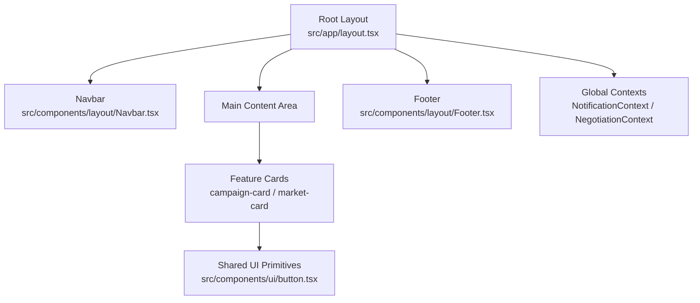
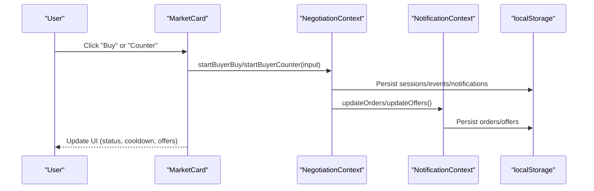
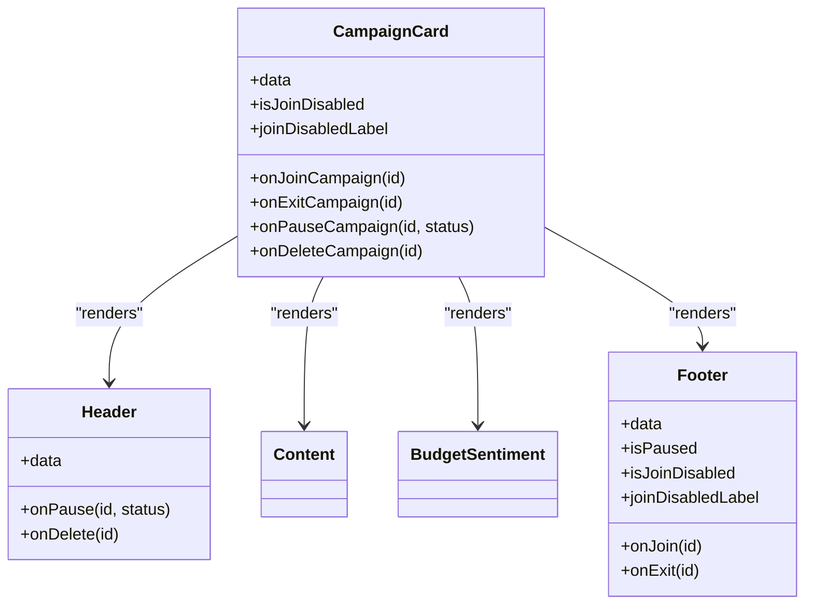
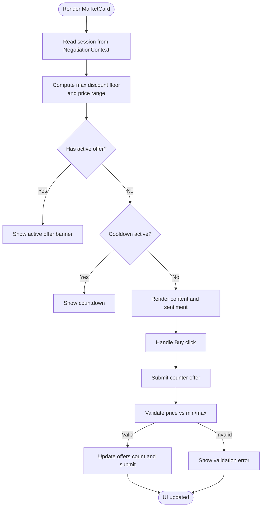
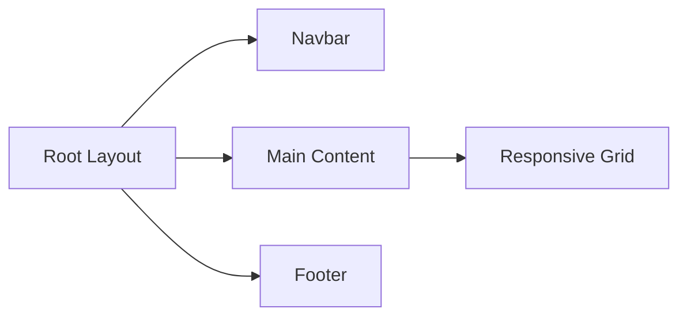
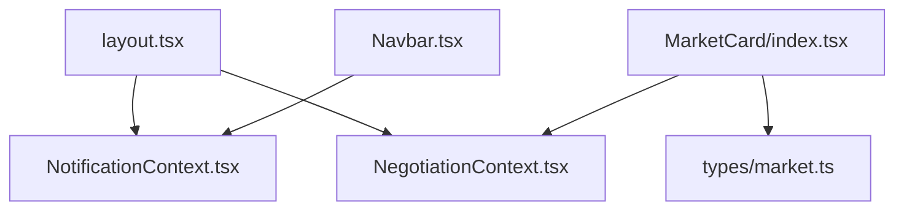

# Component Architecture & Patterns

<cite>
**Referenced Files in This Document**
- [layout.tsx](file://src/app/layout.tsx)
- [globals.css](file://src/app/globals.css)
- [Navbar.tsx](file://src/components/layout/Navbar.tsx)
- [Footer.tsx](file://src/components/layout/Footer.tsx)
- [grid.tsx](file://src/components/layout/grid.tsx)
- [CampaignCard/index.tsx](file://src/components/campaign-card/index.tsx)
- [CampaignCard/header.tsx](file://src/components/campaign-card/header.tsx)
- [MarketCard/index.tsx](file://src/components/market-card/index.tsx)
- [MarketCard/header.tsx](file://src/components/market-card/header.tsx)
- [button.tsx](file://src/components/ui/button.tsx)
- [NotificationContext.tsx](file://src/context/NotificationContext.tsx)
- [NegotiationContext.tsx](file://src/context/NegotiationContext.tsx)
- [market.ts](file://src/types/market.ts)
</cite>

## Table of Contents
1. Introduction
2. Project Structure
3. Core Components
4. Architecture Overview
5. Detailed Component Analysis
6. Dependency Analysis
7. Performance Considerations
8. Troubleshooting Guide
9. Conclusion
10. Appendices

## Introduction
This document explains the component architecture and patterns used across PortVille Market. It covers the modular feature-based structure (campaign-card, market-card), shared UI primitives, layout system (Navbar, Footer, page templates), responsive design, accessibility practices, state management via contexts, styling with Tailwind CSS, and testing strategies for components and integrations.

## Project Structure
PortVille Market follows a Next.js App Router layout with:
- Feature-specific directories under src/components (e.g., campaign-card, market-card) that encapsulate related subcomponents (header, content, footer).
- Shared UI primitives under src/components/ui (Button, Badge, Popover).
- Layout shell under src/components/layout (Navbar, Footer, Grid).
- Global application context providers under src/context (NotificationContext, NegotiationContext).
- Types under src/types to define prop contracts for cards and domain data.
- Root layout at src/app/layout.tsx that composes providers, Navbar, main content area, and Footer.

**Diagram sources**
- [layout.tsx:15-43](file://src/app/layout.tsx#L15-L43)
- [Navbar.tsx:16-170](file://src/components/layout/Navbar.tsx#L16-L170)
- [Footer.tsx:57-160](file://src/components/layout/Footer.tsx#L57-L160)
- [button.tsx:45-69](file://src/components/ui/button.tsx#L45-L69)

**Section sources**
- [layout.tsx:15-43](file://src/app/layout.tsx#L15-L43)
- [globals.css:1-20](file://src/app/globals.css#L1-L20)

## Core Components
- CampaignCard: Composed of header, content, budget-sentiment, and footer subcomponents. Manages local state for join/exit actions and exposes event handlers to parent pages.
- MarketCard: Encapsulates negotiation flow, cooldown timers, offer limits, and sentiment controls. Integrates with NegotiationContext to manage sessions and user interactions.
- Button: CVA-powered primitive supporting variants and sizes, used consistently across the app.
- Layout Shell: Root layout wraps the app with NotificationProvider and NegotiationProvider, renders Navbar and Footer, and provides a flexible main area.

Key responsibilities:
- Feature cards own their internal state and delegate side effects to parent or context.
- Layout components provide navigation and global chrome.
- Contexts centralize cross-cutting concerns like notifications and negotiation sessions.

**Section sources**
- [CampaignCard/index.tsx:10-71](file://src/components/campaign-card/index.tsx#L10-L71)
- [MarketCard/index.tsx:12-158](file://src/components/market-card/index.tsx#L12-L158)
- [button.tsx:8-43](file://src/components/ui/button.tsx#L8-L43)
- [layout.tsx:15-43](file://src/app/layout.tsx#L15-L43)

## Architecture Overview
The application uses a provider-driven architecture:
- Root layout mounts NotificationProvider and NegotiationProvider to share state globally.
- Feature cards consume these contexts to drive behavior (e.g., starting negotiations, updating orders/offers).
- Layout components are presentational and rely on contexts for dynamic data like badge counts.

**Diagram sources**
- [MarketCard/index.tsx:20-81](file://src/components/market-card/index.tsx#L20-L81)
- [NegotiationContext.tsx:140-179](file://src/context/NegotiationContext.tsx#L140-L179)
- [NotificationContext.tsx:22-137](file://src/context/NotificationContext.tsx#L22-L137)

**Section sources**
- [layout.tsx:20-39](file://src/app/layout.tsx#L20-L39)
- [NegotiationContext.tsx:140-179](file://src/context/NegotiationContext.tsx#L140-L179)
- [NotificationContext.tsx:22-137](file://src/context/NotificationContext.tsx#L22-L137)

## Detailed Component Analysis

### CampaignCard
- Prop interface: Accepts card data and callbacks for join/exit/pause/delete; supports disabled states and labels.
- Composition: Delegates rendering to Header, Content, BudgetSentiment, Footer.
- Lifecycle: Maintains local state for joined status and derived paused state; updates UI based on props and events.
- Accessibility: Uses aria-labels on interactive elements within subcomponents where applicable.

**Diagram sources**
- [CampaignCard/index.tsx:10-71](file://src/components/campaign-card/index.tsx#L10-L71)
- [CampaignCard/header.tsx:8-12](file://src/components/campaign-card/header.tsx#L8-L12)

**Section sources**
- [CampaignCard/index.tsx:10-71](file://src/components/campaign-card/index.tsx#L10-L71)
- [CampaignCard/header.tsx:14-123](file://src/components/campaign-card/header.tsx#L14-L123)

### MarketCard
- Prop interface: Accepts cardData, optional flags to hide footer/border, and callbacks for buy and counter submission.
- State and lifecycle: Tracks live offers, price input visibility, costly votes, cooldown timer, active/inactive session states; integrates with NegotiationContext to enforce rules and persist sessions.
- Event handling: Validates inputs against min/max prices and counters; emits events to context and updates UI accordingly.

**Diagram sources**
- [MarketCard/index.tsx:20-81](file://src/components/market-card/index.tsx#L20-L81)
- [MarketCard/header.tsx:20-54](file://src/components/market-card/header.tsx#L20-L54)

**Section sources**
- [MarketCard/index.tsx:12-158](file://src/components/market-card/index.tsx#L12-L158)
- [MarketCard/header.tsx:20-133](file://src/components/market-card/header.tsx#L20-L133)

### Layout System (Navbar, Footer, Grid)
- Navbar: Provides navigation links, notification and cart badges, and mobile menu; consumes NotificationContext for counts and seen states; includes accessible attributes (aria-expanded, aria-label).
- Footer: Static informational footer with responsive grid layout and social/legal links.
- Grid: Responsive multi-column container using Tailwind breakpoints for consistent card layouts.

**Diagram sources**
- [layout.tsx:20-39](file://src/app/layout.tsx#L20-L39)
- [Navbar.tsx:16-170](file://src/components/layout/Navbar.tsx#L16-L170)
- [Footer.tsx:57-160](file://src/components/layout/Footer.tsx#L57-L160)
- [grid.tsx:3-21](file://src/components/layout/grid.tsx#L3-L21)

**Section sources**
- [Navbar.tsx:16-170](file://src/components/layout/Navbar.tsx#L16-L170)
- [Footer.tsx:57-160](file://src/components/layout/Footer.tsx#L57-L160)
- [grid.tsx:3-21](file://src/components/layout/grid.tsx#L3-L21)

### Shared UI Primitives (Button)
- Implements variant and size systems via class-variance-authority.
- Supports asChild pattern for composition with other elements.
- Consistent focus and accessibility attributes for keyboard navigation.

**Section sources**
- [button.tsx:8-43](file://src/components/ui/button.tsx#L8-L43)
- [button.tsx:45-69](file://src/components/ui/button.tsx#L45-L69)

## Dependency Analysis
- Root layout depends on both contexts to wrap children.
- Navbar depends on NotificationContext for badge counts and seen states.
- MarketCard depends on NegotiationContext for session management and validation logic.
- Types define contracts between components and contexts (e.g., MarketCardData).

**Diagram sources**
- [layout.tsx:20-39](file://src/app/layout.tsx#L20-L39)
- [Navbar.tsx:16-170](file://src/components/layout/Navbar.tsx#L16-L170)
- [MarketCard/index.tsx:20-81](file://src/components/market-card/index.tsx#L20-L81)
- [market.ts:1-25](file://src/types/market.ts#L1-L25)

**Section sources**
- [layout.tsx:20-39](file://src/app/layout.tsx#L20-L39)
- [NotificationContext.tsx:22-137](file://src/context/NotificationContext.tsx#L22-L137)
- [NegotiationContext.tsx:140-179](file://src/context/NegotiationContext.tsx#L140-L179)
- [market.ts:1-25](file://src/types/market.ts#L1-L25)

## Performance Considerations
- Use client-only components sparingly; prefer server components for static parts.
- Debounce or throttle frequent state updates (e.g., countdown timers) to reduce re-renders.
- Leverage memoization in contexts for derived values (e.g., unread counts).
- Avoid heavy computations inside render loops; move to useEffect or Web Workers if needed.
- Keep localStorage operations minimal and batched to prevent excessive writes.

[No sources needed since this section provides general guidance]

## Troubleshooting Guide
Common issues and resolutions:
- Missing Provider errors: Ensure components consuming contexts are wrapped by their respective providers in the root layout.
- Stale state after refresh: Verify localStorage persistence keys and parsing logic in contexts; handle parse errors gracefully.
- Cooldown not resetting: Confirm interval cleanup and date calculations for cooldownUntil timestamps.
- Validation failures: Check min/max price bounds and counter attempt limits before submitting offers.

**Section sources**
- [NotificationContext.tsx:22-137](file://src/context/NotificationContext.tsx#L22-L137)
- [NegotiationContext.tsx:140-179](file://src/context/NegotiationContext.tsx#L140-L179)
- [MarketCard/index.tsx:20-81](file://src/components/market-card/index.tsx#L20-L81)

## Conclusion
PortVille Market’s component architecture emphasizes modularity through feature-specific directories, shared UI primitives, and robust context-driven state management. The layout system provides consistent navigation and responsive grids, while Tailwind CSS enables cohesive theming and accessibility. Testing should focus on unit tests for component logic, integration tests for context flows, and end-to-end tests for critical user journeys such as buying and negotiating.

[No sources needed since this section summarizes without analyzing specific files]

## Appendices

### Styling Architecture and Theming
- Global theme variables defined in globals.css set background and foreground colors.
- Tailwind classes compose responsive layouts and dark mode support.
- Button and other primitives use CVA for consistent variants and sizes.

**Section sources**
- [globals.css:1-20](file://src/app/globals.css#L1-L20)
- [button.tsx:8-43](file://src/components/ui/button.tsx#L8-L43)

### Responsive Design Patterns
- Grid uses breakpoint-based columns to adapt from single to multi-column layouts.
- Navbar switches to a mobile menu with overlay and accessible toggles.
- Footer adapts its layout across screen sizes with flex and grid utilities.

**Section sources**
- [grid.tsx:3-21](file://src/components/layout/grid.tsx#L3-L21)
- [Navbar.tsx:117-165](file://src/components/layout/Navbar.tsx#L117-L165)
- [Footer.tsx:60-159](file://src/components/layout/Footer.tsx#L60-L159)

### Accessibility Compliance
- Use aria-labels on icon buttons and toggles.
- Ensure focus-visible styles for keyboard navigation.
- Provide meaningful alt text for images and descriptive labels for controls.

**Section sources**
- [Navbar.tsx:64-124](file://src/components/layout/Navbar.tsx#L64-L124)
- [CampaignCard/header.tsx:93-118](file://src/components/campaign-card/header.tsx#L93-L118)

### Testing Strategies
- Unit tests:
  - Validate MarketCard price input rules and cooldown behavior.
  - Test CampaignCard join/exit state transitions.
  - Assert Button variant and size outputs.
- Integration tests:
  - Wrap components with NotificationProvider and NegotiationContext to test full flows (buy, counter, finalize).
  - Mock localStorage to simulate persistence and recovery.
- End-to-end tests:
  - Simulate user journeys across pages using the layout shell and navigate via Navbar.

[No sources needed since this section provides general guidance]