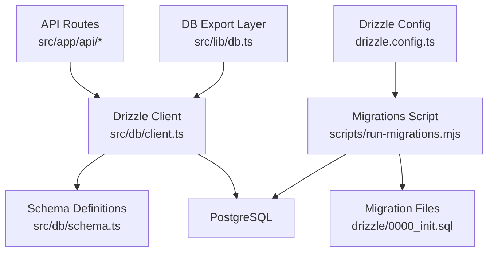
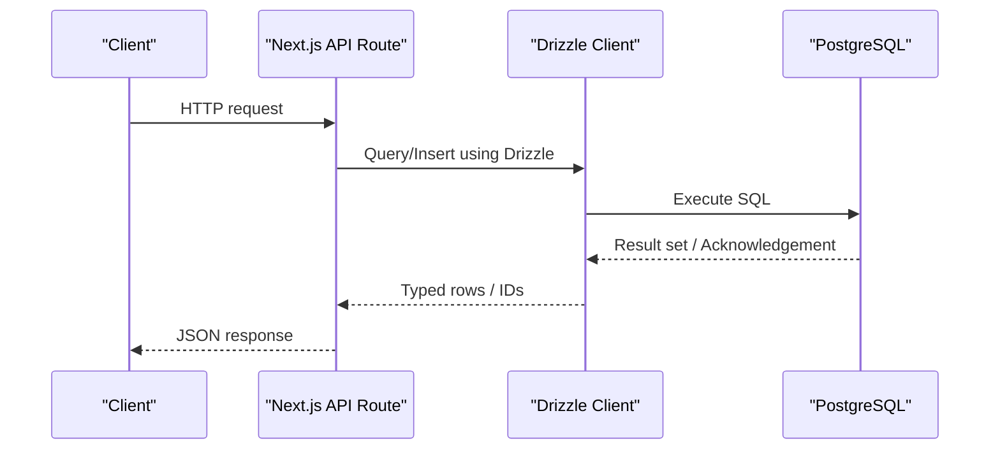
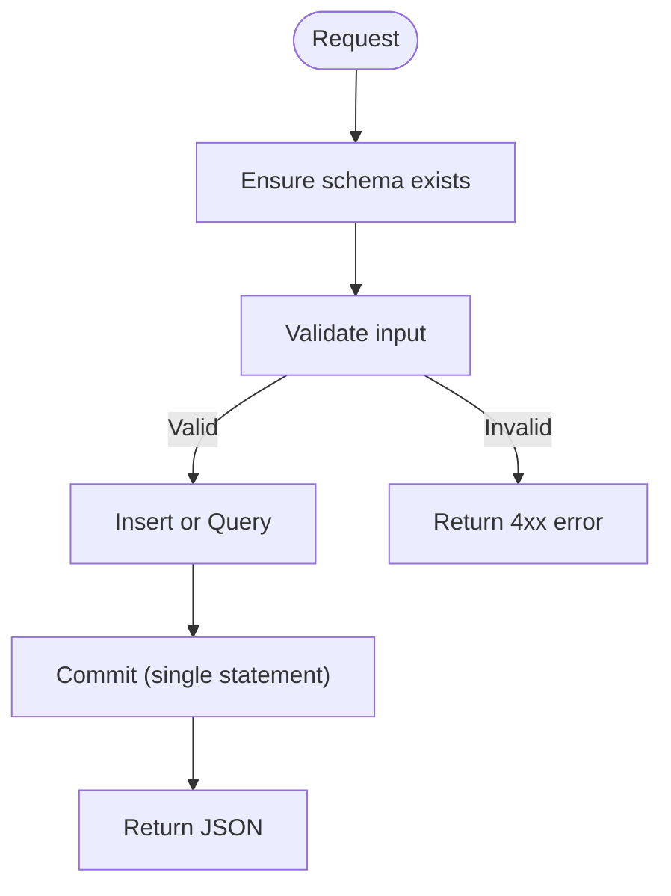
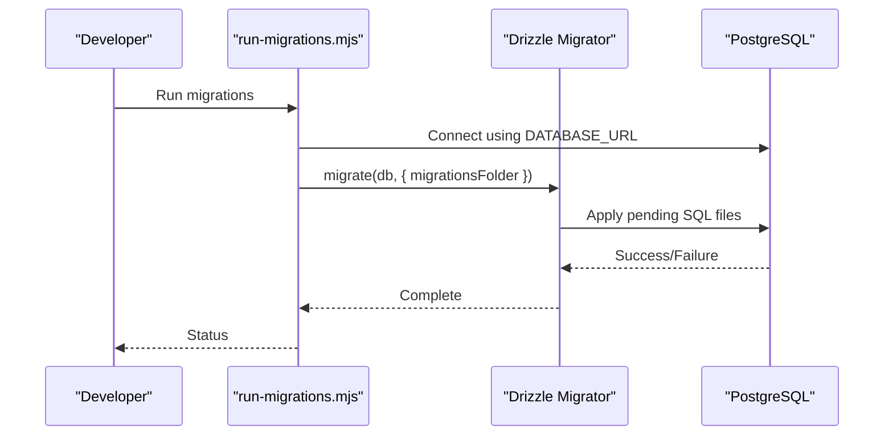
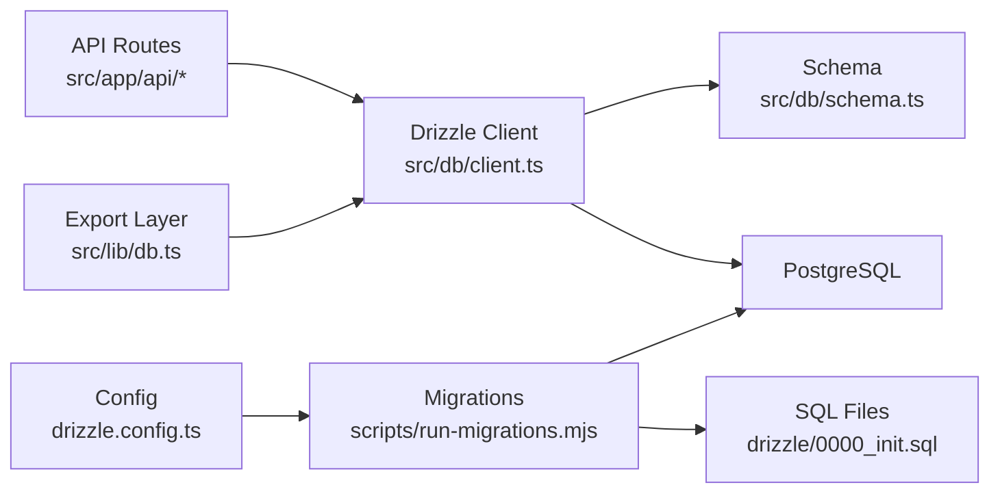

# Database Schema & Data Models

<cite>
**Referenced Files in This Document**
- [schema.ts](file://src/db/schema.ts)
- [0000_init.sql](file://drizzle/0000_init.sql)
- [_journal.json](file://drizzle/meta/_journal.json)
- [drizzle.config.ts](file://drizzle.config.ts)
- [client.ts](file://src/db/client.ts)
- [db.ts](file://src/lib/db.ts)
- [run-migrations.mjs](file://scripts/run-migrations.mjs)
- [route.ts (campaigns)](file://src/app/api/campaigns/route.ts)
- [route.ts (market)](file://src/app/api/market/route.ts)
- [market.ts](file://src/lib/market.ts)
- [negotiations.ts](file://src/lib/negotiations.ts)
</cite>

## Table of Contents
1. [Introduction](#introduction)
2. [Project Structure](#project-structure)
3. [Core Components](#core-components)
4. [Architecture Overview](#architecture-overview)
5. [Detailed Component Analysis](#detailed-component-analysis)
6. [Dependency Analysis](#dependency-analysis)
7. [Performance Considerations](#performance-considerations)
8. [Troubleshooting Guide](#troubleshooting-guide)
9. [Conclusion](#conclusion)
10. [Appendices](#appendices)

## Introduction
This document describes the PortVille Market database schema and data models implemented with Drizzle ORM on PostgreSQL. It covers entity relationships, keys, constraints, validation rules, migration strategy, data access patterns, performance considerations, and operational guidance for lifecycle management, backups, and disaster recovery. The goal is to provide a clear, code-backed reference for developers and operators working with campaigns, market listings, negotiations, user profiles, and engagement events.

## Project Structure
The database layer is defined in a single schema file and enforced via Drizzle migrations. A Node.js client initializes a connection pool and ensures the schema exists at runtime. API routes consume the schema through Drizzle queries. Migrations are managed by a dedicated script that reads environment configuration and applies versioned SQL files.



**Diagram sources**
- [client.ts:1-152](file://src/db/client.ts#L1-L152)
- [schema.ts:1-84](file://src/db/schema.ts#L1-L84)
- [0000_init.sql:1-82](file://drizzle/0000_init.sql#L1-L82)
- [run-migrations.mjs:1-67](file://scripts/run-migrations.mjs#L1-L67)
- [drizzle.config.ts:1-13](file://drizzle.config.ts#L1-L13)
- [db.ts:1-5](file://src/lib/db.ts#L1-L5)

**Section sources**
- [schema.ts:1-84](file://src/db/schema.ts#L1-L84)
- [client.ts:1-152](file://src/db/client.ts#L1-L152)
- [run-migrations.mjs:1-67](file://scripts/run-migrations.mjs#L1-L67)
- [drizzle.config.ts:1-13](file://drizzle.config.ts#L1-L13)

## Core Components
The system defines five core entities:

- Campaigns: Marketing or promotional initiatives with budgeting, status, and metadata.
- Campaign Members: Many-to-many relationship between users and campaigns (implemented as a join table).
- Vacancies: Job-like postings with requirements and salary ranges.
- Market Listings: Social media accounts or assets listed for sale or collaboration.
- Engagement Events: Event log capturing actor interactions with entities.

Key characteristics:
- Primary keys: auto-incrementing integers for all tables.
- Foreign keys: campaign_members.campaign_id references campaigns.id with cascade delete.
- Timestamps: created_at and updated_at where applicable; default timestamps applied.
- Defaults: sensible defaults for numeric and text fields to support offline or fallback behavior.

**Section sources**
- [schema.ts:3-83](file://src/db/schema.ts#L3-L83)
- [0000_init.sql:1-82](file://drizzle/0000_init.sql#L1-L82)

## Architecture Overview
Data flows from API routes into Drizzle queries against the PostgreSQL database. The client manages a global connection pool and ensures schema existence. Migrations are run separately to evolve schema versions.



**Diagram sources**
- [route.ts (campaigns):46-98](file://src/app/api/campaigns/route.ts#L46-L98)
- [route.ts (market):164-172](file://src/app/api/market/route.ts#L164-L172)
- [client.ts:45-59](file://src/db/client.ts#L45-L59)

## Detailed Component Analysis

### Entity Model and Relationships
```mermaid
erDiagram
CAMPAIGNS {
int id PK
text title
text description
text category
text niche_hashtag
text created_by
text status
double precision publisher_rating
text publisher_profile_icon
int community_size
int views_generated
int likes_generated
int total_budget
int budget_used
int highest_mcp
int time_remaining_days
text required_platforms
timestamp start_date
int min_payout
int max_payout
int publish_fee
timestamp created_at
timestamp updated_at
}
CAMPAIGN_MEMBERS {
int id PK
int campaign_id FK
text user_id
text status
timestamp joined_at
}
VACANCIES {
int id PK
text title
text description
text category
text created_by
timestamp created_at
text employer_name
text handle
double precision rating
int days_remaining
int required_people
int applicants
int accepted
text requirements
int min_salary
int max_salary
text status
timestamp status_updated_at
}
MARKET_LISTINGS {
int id PK
text title
text description
double precision price
text profile_url
text platform
text handle
int followers
int likes
double precision engagement_rate
text niche
text created_by
text status
timestamp created_at
}
ENGAGEMENT_EVENTS {
int id PK
text entity_type
int entity_id
text actor_id
text action
text message
timestamp created_at
}
CAMPAIGNS ||--o{ CAMPAIGN_MEMBERS : "id -> campaign_id"
```

**Diagram sources**
- [schema.ts:3-83](file://src/db/schema.ts#L3-L83)
- [0000_init.sql:1-82](file://drizzle/0000_init.sql#L1-L82)

#### Campaigns
- Purpose: Define marketing campaigns with budget tracking, status, and metadata.
- Key fields: id (PK), title, description, category, niche_hashtag, created_by, status, budget fields, timestamps.
- Constraints: Not null on core fields; defaults for category, status, ratings, budgets, and timestamps.
- Usage: Created via POST, filtered via GET with optional filters (created by, joined, active).

**Section sources**
- [schema.ts:3-27](file://src/db/schema.ts#L3-L27)
- [0000_init.sql:1-25](file://drizzle/0000_init.sql#L1-L25)
- [route.ts (campaigns):100-141](file://src/app/api/campaigns/route.ts#L100-L141)

#### Campaign Members
- Purpose: Associate users with campaigns; supports membership status and join date.
- Key fields: id (PK), campaign_id (FK to campaigns.id), user_id, status, joined_at.
- Referential integrity: onDelete cascade ensures member records are removed when a campaign is deleted.

**Section sources**
- [schema.ts:29-35](file://src/db/schema.ts#L29-L35)
- [0000_init.sql:27-33](file://drizzle/0000_init.sql#L27-L33)

#### Vacancies
- Purpose: Postings for roles or tasks with requirements and salary ranges.
- Key fields: id (PK), title, description, category, created_by, timestamps, employer info, metrics, status.
- Notes: No explicit foreign keys; relies on application-level validation for created_by identity.

**Section sources**
- [schema.ts:37-56](file://src/db/schema.ts#L37-L56)
- [0000_init.sql:35-54](file://drizzle/0000_init.sql#L35-L54)

#### Market Listings
- Purpose: Records of social media accounts or assets available for purchase or collaboration.
- Key fields: id (PK), title, description, price, profile_url, platform, handle, followers, likes, engagement_rate, niche, created_by, status, created_at.
- Validation: API validates profile URL and verifies account metrics before insertion.

**Section sources**
- [schema.ts:58-73](file://src/db/schema.ts#L58-L73)
- [0000_init.sql:56-71](file://drizzle/0000_init.sql#L56-L71)
- [route.ts (market):174-261](file://src/app/api/market/route.ts#L174-L261)

#### Engagement Events
- Purpose: Append-only event log capturing actor actions on entities.
- Key fields: id (PK), entity_type, entity_id, actor_id, action, message, created_at.
- Notes: Generic polymorphic association; referential integrity not enforced at DB level.

**Section sources**
- [schema.ts:75-83](file://src/db/schema.ts#L75-L83)
- [0000_init.sql:73-81](file://drizzle/0000_init.sql#L73-L81)

### Data Access Patterns and Transactions
- Client initialization: A global connection pool is created once per process and reused across requests.
- Schema enforcement: On startup, the client runs “CREATE TABLE IF NOT EXISTS” statements to ensure tables exist.
- Queries:
  - Campaigns: SELECT with filtering by status or creator; JOIN-like logic performed in application by fetching members separately.
  - Market Listings: SELECT ordered by creation date; INSERT after external verification of profile URLs.
  - Negotiations: Currently returns empty datasets; ready for future integration.
- Transactions: No explicit transaction blocks are used in current routes; operations are single-statement inserts or selects. For multi-step writes (e.g., creating a campaign and adding a member), wrap in a transaction to maintain consistency.



**Diagram sources**
- [client.ts:61-149](file://src/db/client.ts#L61-L149)
- [route.ts (campaigns):46-98](file://src/app/api/campaigns/route.ts#L46-L98)
- [route.ts (market):174-261](file://src/app/api/market/route.ts#L174-L261)

**Section sources**
- [client.ts:45-149](file://src/db/client.ts#L45-L149)
- [route.ts (campaigns):46-141](file://src/app/api/campaigns/route.ts#L46-L141)
- [route.ts (market):164-261](file://src/app/api/market/route.ts#L164-L261)
- [negotiations.ts:57-62](file://src/lib/negotiations.ts#L57-L62)

### Migration Strategy and Version Management
- Configuration: Drizzle config points to schema file and output directory; uses PostgreSQL dialect and credentials from DATABASE_URL.
- Migration files: Versioned SQL under drizzle/; journal tracks versions and tags.
- Execution: A Node script loads env, creates a pool, and runs migrations; gracefully handles development mode without a database.



**Diagram sources**
- [drizzle.config.ts:1-13](file://drizzle.config.ts#L1-L13)
- [run-migrations.mjs:1-67](file://scripts/run-migrations.mjs#L1-L67)
- [_journal.json:1-1](file://drizzle/meta/_journal.json#L1-L1)

**Section sources**
- [drizzle.config.ts:1-13](file://drizzle.config.ts#L1-L13)
- [run-migrations.mjs:1-67](file://scripts/run-migrations.mjs#L1-L67)
- [_journal.json:1-1](file://drizzle/meta/_journal.json#L1-L1)

### Data Validation Rules and Business Constraints
- Input validation:
  - Campaigns: Title and description required; numeric fields coerced safely; defaults applied for missing values.
  - Market Listings: Profile URL must be a supported social media domain; account verification fetches metrics; description required.
- Business constraints:
  - Campaign membership: Enforced via campaign_members table; deletion cascades to members.
  - Status fields: Default values ensure consistent state (active/open/apply).
  - Numeric safety: Helper functions coerce inputs to numbers with safe fallbacks.
- Referential integrity:
  - Explicit FK only on campaign_members.campaign_id referencing campaigns.id with ON DELETE CASCADE.
  - Other cross-entity links rely on application logic.

**Section sources**
- [route.ts (campaigns):10-17](file://src/app/api/campaigns/route.ts#L10-L17)
- [route.ts (campaigns):100-141](file://src/app/api/campaigns/route.ts#L100-L141)
- [route.ts (market):8-15](file://src/app/api/market/route.ts#L8-L15)
- [route.ts (market):37-56](file://src/app/api/market/route.ts#L37-L56)
- [route.ts (market):174-261](file://src/app/api/market/route.ts#L174-L261)
- [schema.ts:29-35](file://src/db/schema.ts#L29-L35)

### Indexes and Constraints
- Primary keys: All tables define an integer primary key column.
- Foreign keys: campaign_members.campaign_id references campaigns.id with cascade delete.
- Indexes: None explicitly defined beyond primary keys. Consider adding indexes for frequently queried columns such as:
  - campaigns.status, campaigns.created_by
  - campaign_members.user_id, campaign_members.campaign_id
  - market_listings.created_by, market_listings.platform
  - engagement_events.entity_type, engagement_events.entity_id

[No sources needed since this section provides general guidance]

### Performance Considerations
- Connection pooling: Global pool with max connections and idle timeout configured to reduce overhead.
- Query optimization:
  - Use WHERE clauses on indexed columns (status, created_by, user_id).
  - Limit result sets (e.g., limit 50 or 12) to reduce payload size.
  - Avoid N+1 queries by batching or joining where possible; currently, membership checks are done via separate queries.
- Caching approaches:
  - In-memory cache for read-heavy endpoints (e.g., market listings) with TTL-based invalidation.
  - CDN or edge caching for static content; consider server-side caching for campaign lists if appropriate.
- External calls:
  - Social media verification introduces latency; implement retries and timeouts; cache verified results briefly.

[No sources needed since this section provides general guidance]

### Data Lifecycle Management, Backup, and Disaster Recovery
- Lifecycle:
  - Creation: Via API routes with validation and defaults.
  - Updates: Not yet exposed; plan to add update endpoints with audit fields (updated_at).
  - Deletion: Cascade deletes for campaign members; soft deletes recommended for business entities (add deleted_at).
- Backups:
  - Schedule regular logical backups (pg_dump) and periodic full snapshots.
  - Store backups offsite with encryption and retention policies.
- Disaster recovery:
  - Maintain restore procedures and test regularly.
  - Use point-in-time recovery (WAL archiving) for critical environments.
  - Document RTO/RPO targets and escalation paths.

[No sources needed since this section provides general guidance]

## Dependency Analysis
The following diagram shows how components depend on each other for data access and migrations.



**Diagram sources**
- [route.ts (campaigns):1-142](file://src/app/api/campaigns/route.ts#L1-L142)
- [route.ts (market):1-262](file://src/app/api/market/route.ts#L1-L262)
- [client.ts:1-152](file://src/db/client.ts#L1-L152)
- [schema.ts:1-84](file://src/db/schema.ts#L1-L84)
- [run-migrations.mjs:1-67](file://scripts/run-migrations.mjs#L1-L67)
- [0000_init.sql:1-82](file://drizzle/0000_init.sql#L1-L82)
- [drizzle.config.ts:1-13](file://drizzle.config.ts#L1-L13)
- [db.ts:1-5](file://src/lib/db.ts#L1-L5)

**Section sources**
- [route.ts (campaigns):1-142](file://src/app/api/campaigns/route.ts#L1-L142)
- [route.ts (market):1-262](file://src/app/api/market/route.ts#L1-L262)
- [client.ts:1-152](file://src/db/client.ts#L1-L152)
- [schema.ts:1-84](file://src/db/schema.ts#L1-L84)
- [run-migrations.mjs:1-67](file://scripts/run-migrations.mjs#L1-L67)
- [0000_init.sql:1-82](file://drizzle/0000_init.sql#L1-L82)
- [drizzle.config.ts:1-13](file://drizzle.config.ts#L1-L13)
- [db.ts:1-5](file://src/lib/db.ts#L1-L5)

## Performance Considerations
- Optimize queries by adding indexes on high-cardinality and filter columns.
- Batch operations where possible; use transactions for multi-step writes.
- Cache frequent reads (campaigns, market listings) with short TTLs.
- Rate-limit external social media verification calls and cache results.
- Monitor slow queries and adjust limits or pagination.

[No sources needed since this section provides general guidance]

## Troubleshooting Guide
- Missing DATABASE_URL:
  - Client throws an error if DATABASE_URL is not configured; ensure environment variables are set.
- Network errors during migrations:
  - Migration script detects network issues and exits gracefully in development; verify connectivity in production.
- API errors:
  - Campaigns and market APIs return structured error responses on validation failures or unexpected exceptions.
- Schema mismatch:
  - If schema drift occurs, re-run migrations; ensure schema.ts matches desired state.

**Section sources**
- [client.ts:34-38](file://src/db/client.ts#L34-L38)
- [run-migrations.mjs:28-38](file://scripts/run-migrations.mjs#L28-L38)
- [route.ts (campaigns):94-97](file://src/app/api/campaigns/route.ts#L94-L97)
- [route.ts (market):257-260](file://src/app/api/market/route.ts#L257-L260)

## Conclusion
PortVille Market’s database schema centers around campaigns, campaign members, vacancies, market listings, and engagement events. The implementation uses Drizzle ORM for type-safe queries and PostgreSQL for storage. Referential integrity is partially enforced via a cascade delete on campaign membership. Migrations are versioned and executed via a dedicated script. Current data access patterns are straightforward but can be enhanced with indexing, transactions, and caching for improved performance and reliability. Operational practices for backups and disaster recovery should be formalized to ensure resilience.

## Appendices

### API Endpoints Summary
- Campaigns
  - GET /api/campaigns: List campaigns with optional filters (created, joined, active).
  - POST /api/campaigns: Create a new campaign with validation and defaults.
- Market
  - GET /api/market: Retrieve market listings.
  - POST /api/market: Create a listing after verifying social profile metrics.
- Negotiations
  - GET /api/negotiations: Placeholder returning empty datasets; ready for integration.

**Section sources**
- [route.ts (campaigns):46-141](file://src/app/api/campaigns/route.ts#L46-L141)
- [route.ts (market):164-261](file://src/app/api/market/route.ts#L164-L261)
- [negotiations.ts:57-62](file://src/lib/negotiations.ts#L57-L62)