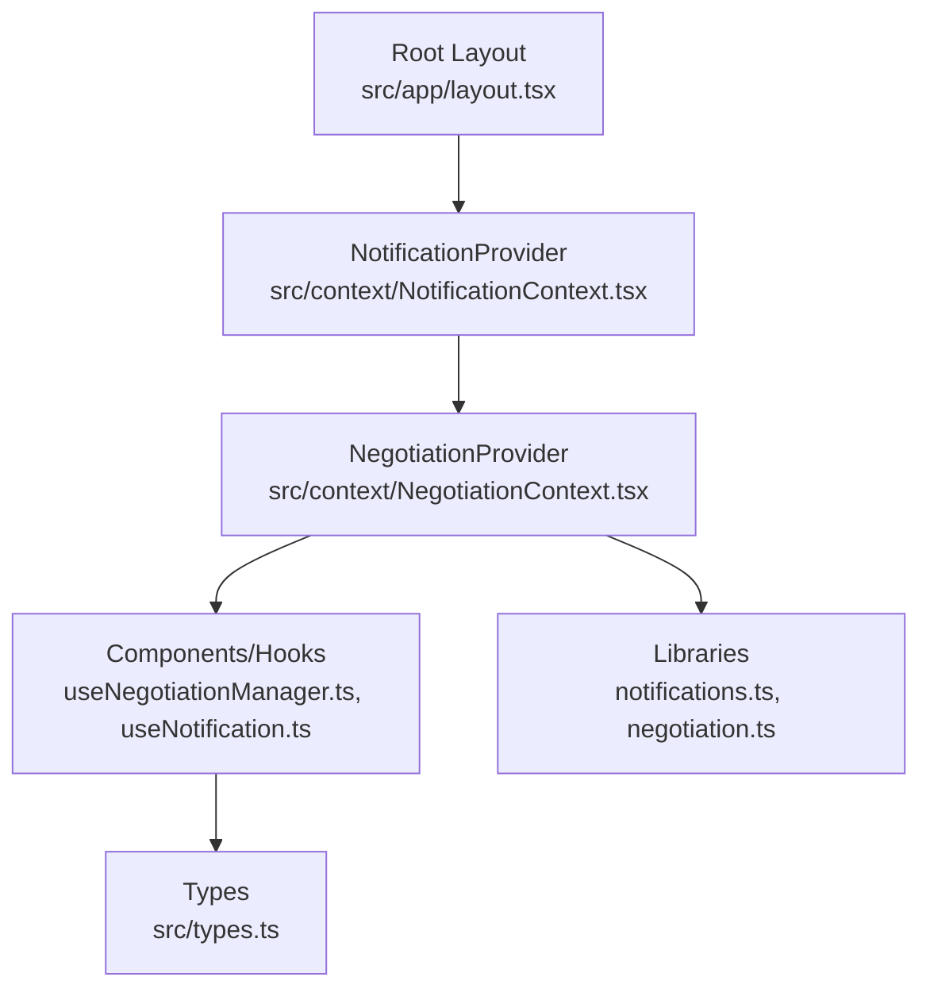
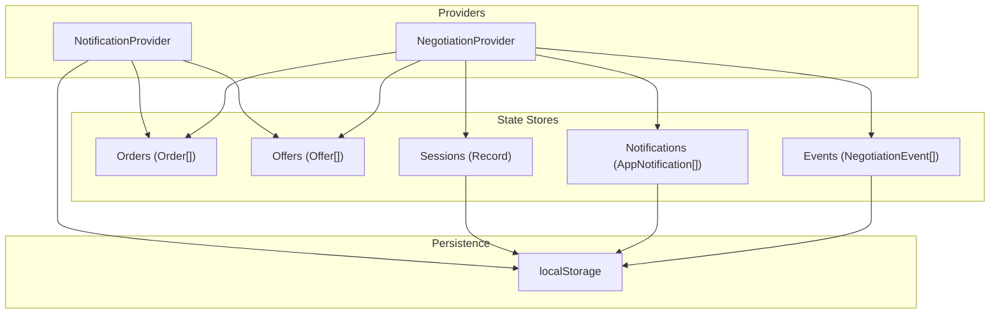
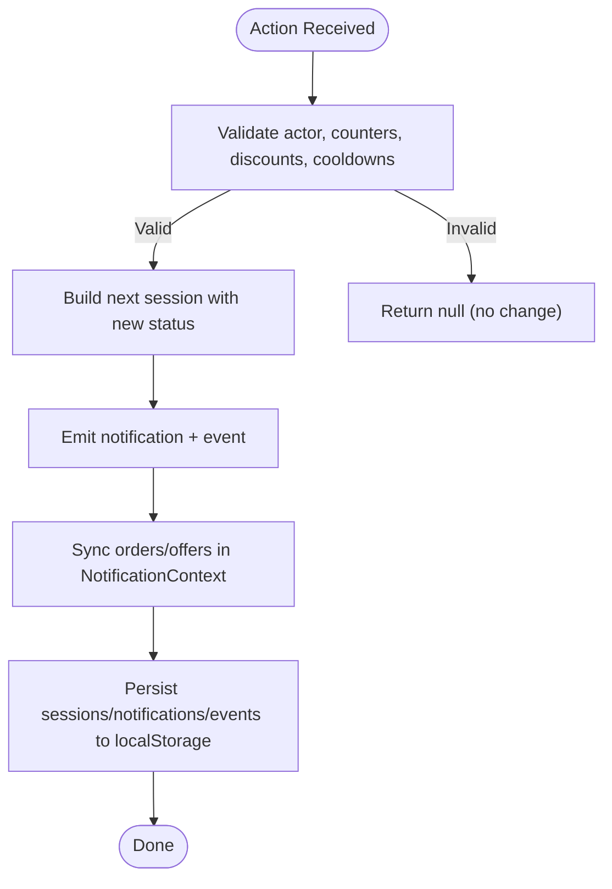
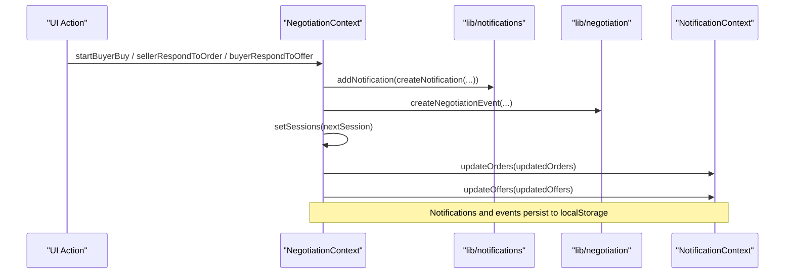
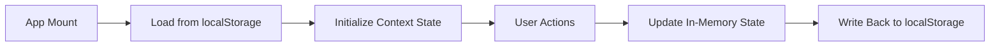
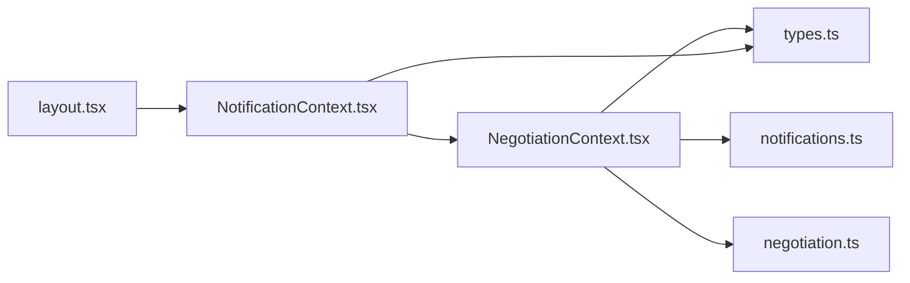

# State Management Architecture

<cite>
**Referenced Files in This Document**
- [layout.tsx](file://src/app/layout.tsx)
- [NegotiationContext.tsx](file://src/context/NegotiationContext.tsx)
- [NotificationContext.tsx](file://src/context/NotificationContext.tsx)
- [useNegotiationManager.ts](file://src/hooks/useNegotiationManager.ts)
- [useNotification.ts](file://src/hooks/useNotification.ts)
- [notifications.ts](file://src/lib/notifications.ts)
- [negotiation.ts](file://src/lib/negotiation.ts)
- [types.ts](file://src/types.ts)
</cite>

## Table of Contents
1. Introduction
2. Project Structure
3. Core Components
4. Architecture Overview
5. Detailed Component Analysis
6. Dependency Analysis
7. Performance Considerations
8. Troubleshooting Guide
9. Conclusion

## Introduction
This document explains the state management architecture for PortVille Market with a focus on:
- Global state via React Context API
- Negotiation state machine (transitions, timeouts, cross-user synchronization)
- Notification system for real-time updates and event broadcasting
- State persistence using localStorage for session continuity
- Custom hooks patterns for reusable logic and side effects
- Client-server synchronization strategy, optimistic updates, and error recovery
- Performance considerations for updates and re-renders

## Project Structure
The application uses a layered approach:
- Providers at the app root wrap the entire tree to share global state
- Contexts encapsulate domain-specific state (negotiations, notifications/orders/offers)
- Hooks expose typed accessors and actions to components
- Libraries provide pure utilities for notifications and negotiation events
- Types define shared contracts across contexts and hooks

**Diagram sources**
- [layout.tsx:20-40](file://src/app/layout.tsx#L20-L40)
- [NotificationContext.tsx:22-136](file://src/context/NotificationContext.tsx#L22-L136)
- [NegotiationContext.tsx:140-697](file://src/context/NegotiationContext.tsx#L140-L697)
- [useNegotiationManager.ts:6-199](file://src/hooks/useNegotiationManager.ts#L6-L199)
- [useNotification.ts:5-7](file://src/hooks/useNotification.ts#L5-L7)
- [notifications.ts:1-43](file://src/lib/notifications.ts#L1-L43)
- [negotiation.ts:1-50](file://src/lib/negotiation.ts#L1-L50)
- [types.ts:1-89](file://src/types.ts#L1-L89)

**Section sources**
- [layout.tsx:20-40](file://src/app/layout.tsx#L20-L40)

## Core Components
- NegotiationContext: Owns negotiation sessions, notifications, and events; implements the negotiation state machine, timeout handling, and cross-context sync with orders/offers. Persists sessions, notifications, and events to localStorage.
- NotificationContext: Owns orders and offers lists; persists them to localStorage; exposes update functions and computed badge counts; resets “seen” flags when new items arrive.
- useNegotiationManager: A hook that composes order/offer mutations and creates corresponding entities in NotificationContext for UI flows.
- useNotification: Thin wrapper around NotificationContext for convenient consumption.
- Libraries: Pure functions for creating notifications and negotiation events, and type definitions for Orders and Offers.

Key responsibilities:
- NegotiationContext manages lifecycle and transitions of negotiations, enforces cooldowns and daily limits, and synchronizes changes back to NotificationContext.
- NotificationContext provides a stable source of truth for orders/offers across the app and persists them locally.

**Section sources**
- [NegotiationContext.tsx:9-68](file://src/context/NegotiationContext.tsx#L9-L68)
- [NotificationContext.tsx:6-18](file://src/context/NotificationContext.tsx#L6-L18)
- [useNegotiationManager.ts:6-199](file://src/hooks/useNegotiationManager.ts#L6-L199)
- [useNotification.ts:5-7](file://src/hooks/useNotification.ts#L5-L7)
- [notifications.ts:1-43](file://src/lib/notifications.ts#L1-L43)
- [negotiation.ts:1-50](file://src/lib/negotiation.ts#L1-L50)
- [types.ts:1-89](file://src/types.ts#L1-L89)

## Architecture Overview
The application uses two cooperating contexts:
- NotificationContext is the base layer holding orders and offers, persisted to localStorage.
- NegotiationContext sits on top, managing negotiation sessions and coordinating with NotificationContext to keep orders/offers in sync.

**Diagram sources**
- [NotificationContext.tsx:22-136](file://src/context/NotificationContext.tsx#L22-L136)
- [NegotiationContext.tsx:140-697](file://src/context/NegotiationContext.tsx#L140-L697)

## Detailed Component Analysis

### Negotiation Context and State Machine
- States: idle, buyer-pending, seller-pending, accepted, payment-pending, declined, timed-out, passed, finalized.
- Transitions:
  - Buyer actions: startBuyerBuy/startBuyerCounter move to buyer-pending with pendingFor=seller and set paymentDueAt + cooldownUntil.
  - Seller responses: accept moves to payment-pending (pendingFor=buyer), decline ends as declined, counter moves to seller-pending (pendingFor=buyer).
  - Buyer responses to offers: accept moves to payment-pending, decline ends as declined, counter moves to buyer-pending.
  - Finalization: finalizeNegotiation sets status to finalized and marks related order/offer completed.
- Timeouts:
  - A background interval checks every 30 seconds if any pending session exceeds 1 day or paymentDueAt has elapsed.
  - If so, transitions to passed (for buyer/seller pending) or timed-out (for payment-pending), clears pendingFor, applies cooldown, and emits notifications/events.
  - Syncs latest order/offer statuses to match passed/timed-out.
- Cross-user synchronization:
  - On each action, NegotiationContext computes updated orders/offers arrays and calls updateOrders/updateOffers from NotificationContext, ensuring both sides see consistent state.
- Persistence:
  - Sessions, notifications, and events are loaded from and saved to localStorage keys specific to negotiation state.

**Diagram sources**
- [NegotiationContext.tsx:260-378](file://src/context/NegotiationContext.tsx#L260-L378)
- [NegotiationContext.tsx:380-512](file://src/context/NegotiationContext.tsx#L380-L512)
- [NegotiationContext.tsx:514-624](file://src/context/NegotiationContext.tsx#L514-L624)
- [NegotiationContext.tsx:626-669](file://src/context/NegotiationContext.tsx#L626-L669)
- [NegotiationContext.tsx:181-252](file://src/context/NegotiationContext.tsx#L181-L252)

**Section sources**
- [NegotiationContext.tsx:9-18](file://src/context/NegotiationContext.tsx#L9-L18)
- [NegotiationContext.tsx:146-173](file://src/context/NegotiationContext.tsx#L146-L173)
- [NegotiationContext.tsx:181-252](file://src/context/NegotiationContext.tsx#L181-L252)
- [NegotiationContext.tsx:260-378](file://src/context/NegotiationContext.tsx#L260-L378)
- [NegotiationContext.tsx:380-512](file://src/context/NegotiationContext.tsx#L380-L512)
- [NegotiationContext.tsx:514-624](file://src/context/NegotiationContext.tsx#L514-L624)
- [NegotiationContext.tsx:626-669](file://src/context/NegotiationContext.tsx#L626-L669)

### Notification System and Event Broadcasting
- AppNotification: typed notifications with category, actor, status, read flag, and timestamps.
- Helpers: createNotification, addNotification (bounded to last 20), markNotificationRead, markAllNotificationsRead, getUnreadNotificationCount.
- Integration:
  - NegotiationContext pushes notifications and events on every meaningful state change.
  - NotificationContext maintains orders/offers and badge counts; resets seen flags when new items appear.
- Real-time-like behavior:
  - The 30-second tick in NegotiationContext triggers state changes and broadcasts via notifications and events, keeping UI responsive without server push.

**Diagram sources**
- [NegotiationContext.tsx:175-179](file://src/context/NegotiationContext.tsx#L175-L179)
- [NegotiationContext.tsx:267-317](file://src/context/NegotiationContext.tsx#L267-L317)
- [NegotiationContext.tsx:380-512](file://src/context/NegotiationContext.tsx#L380-L512)
- [notifications.ts:17-43](file://src/lib/notifications.ts#L17-L43)
- [negotiation.ts:29-38](file://src/lib/negotiation.ts#L29-L38)

**Section sources**
- [notifications.ts:1-43](file://src/lib/notifications.ts#L1-L43)
- [NegotiationContext.tsx:175-179](file://src/context/NegotiationContext.tsx#L175-L179)
- [NotificationContext.tsx:95-116](file://src/context/NotificationContext.tsx#L95-L116)

### State Persistence Strategy (localStorage)
- NegotiationContext persists:
  - Sessions under key 'negotiation-sessions-v1'
  - Notifications under key 'negotiation-notifications-v1'
  - Events under key 'negotiation-events-v1'
- NotificationContext persists:
  - Orders under key 'orders'
  - Offers under key 'offers'
- Load-on-mount and write-on-change ensure session continuity across reloads.

**Diagram sources**
- [NegotiationContext.tsx:146-173](file://src/context/NegotiationContext.tsx#L146-L173)
- [NotificationContext.tsx:29-76](file://src/context/NotificationContext.tsx#L29-L76)

**Section sources**
- [NegotiationContext.tsx:146-173](file://src/context/NegotiationContext.tsx#L146-L173)
- [NotificationContext.tsx:29-76](file://src/context/NotificationContext.tsx#L29-L76)

### Custom Hooks Patterns
- useNegotiationManager:
  - Encapsulates business rules for creating orders and offers from buyer/seller perspectives.
  - Composes updateOrders/updateOffers from NotificationContext to maintain consistency.
- useNotification:
  - Simple accessor to NotificationContext for components that only need orders/offers.

Benefits:
- Reusable logic isolated from UI
- Clear separation between state mutation and presentation
- Easy testing and composition

**Section sources**
- [useNegotiationManager.ts:6-199](file://src/hooks/useNegotiationManager.ts#L6-L199)
- [useNotification.ts:5-7](file://src/hooks/useNotification.ts#L5-L7)

### Client-Server Synchronization, Optimistic Updates, and Error Recovery
- Current pattern:
  - Optimistic local updates: actions immediately mutate local state and persist to localStorage before any network call.
  - Cross-context sync: NegotiationContext updates orders/offers in NotificationContext to reflect negotiated states instantly.
- Server integration points:
  - API routes exist for campaigns, market, negotiations, profile, secure endpoints. These can be used to persist final states or broadcast to other clients.
- Error recovery:
  - Local storage operations are wrapped in try/catch to avoid crashes on parse errors.
  - Timeouts handle stale or unresponded negotiations by transitioning to passed/timed-out and notifying users.
- Recommended enhancements:
  - Add server acknowledgment flow to reconcile conflicts.
  - Implement retry/backoff for failed mutations.
  - Use optimistic IDs and rollback on failure.

[No sources needed since this section provides general guidance]

## Dependency Analysis
- Provider hierarchy:
  - Root layout wraps NotificationProvider then NegotiationProvider, giving NegotiationContext access to NotificationContext’s orders/offers.
- Data flow:
  - NegotiationContext reads/writes orders/offers via NotificationContext to keep UI consistent.
  - Both contexts persist to localStorage independently.
- Type contracts:
  - types.ts defines Order/Offer shapes consumed by both contexts and hooks.

**Diagram sources**
- [layout.tsx:20-40](file://src/app/layout.tsx#L20-L40)
- [NotificationContext.tsx:22-136](file://src/context/NotificationContext.tsx#L22-L136)
- [NegotiationContext.tsx:140-697](file://src/context/NegotiationContext.tsx#L140-L697)
- [types.ts:1-89](file://src/types.ts#L1-L89)
- [notifications.ts:1-43](file://src/lib/notifications.ts#L1-L43)
- [negotiation.ts:1-50](file://src/lib/negotiation.ts#L1-L50)

**Section sources**
- [layout.tsx:20-40](file://src/app/layout.tsx#L20-L40)
- [NotificationContext.tsx:22-136](file://src/context/NotificationContext.tsx#L22-L136)
- [NegotiationContext.tsx:140-697](file://src/context/NegotiationContext.tsx#L140-L697)
- [types.ts:1-89](file://src/types.ts#L1-L89)

## Performance Considerations
- Minimize re-renders:
  - Memoize derived values like notificationCount using useMemo where appropriate.
  - Keep context values stable by splitting large providers into focused ones (already partially done).
- Batch updates:
  - Group multiple state changes within a single effect or transaction to reduce renders.
- Avoid heavy computations in render paths:
  - Compute badges and unread counts in providers and expose results.
- Throttle expensive operations:
  - The 30-second tick avoids frequent polling while still providing timely timeout handling.
- LocalStorage I/O:
  - Writes occur on every state change; consider debouncing writes for high-frequency updates if needed.
- Memory usage:
  - Notifications are capped to last 20 entries to prevent unbounded growth.

[No sources needed since this section provides general guidance]

## Troubleshooting Guide
Common issues and resolutions:
- Stale or corrupted localStorage data:
  - Errors during JSON.parse are caught and logged; clear browser storage to reset state if needed.
- Negotiations not advancing:
  - Verify cooldownUntil and daily buy limits are not blocking actions.
  - Check that pendingFor and lastActor alternation constraints are satisfied.
- Missing notifications:
  - Ensure pushNotification is called after state transitions and that localStorage writes succeed.
- Desync between orders/offers and sessions:
  - Confirm that updateOrders/updateOffers are invoked with consistent arrays after each transition.

**Section sources**
- [NegotiationContext.tsx:146-173](file://src/context/NegotiationContext.tsx#L146-L173)
- [NegotiationContext.tsx:181-252](file://src/context/NegotiationContext.tsx#L181-L252)
- [NotificationContext.tsx:29-76](file://src/context/NotificationContext.tsx#L29-L76)

## Conclusion
PortVille Market’s state management leverages React Context to provide a cohesive, persistent, and reactive global state:
- NegotiationContext implements a robust state machine with timeouts, cooldowns, and cross-context synchronization.
- NotificationContext centralizes orders/offers with local persistence and badge management.
- Custom hooks abstract complex logic and promote reuse.
- The design supports optimistic updates and can be extended with server reconciliation and real-time broadcasting as needed.