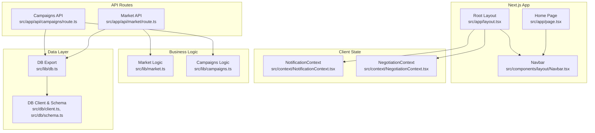
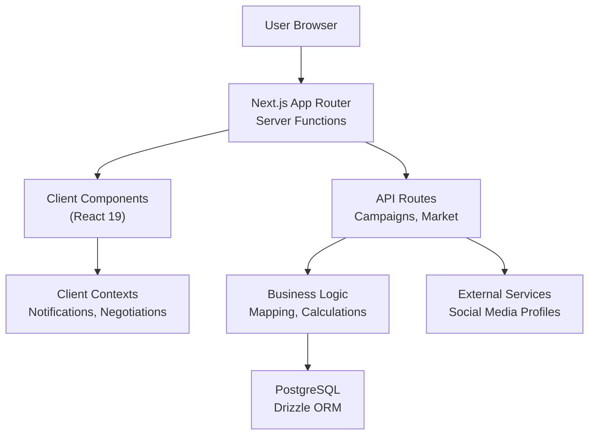
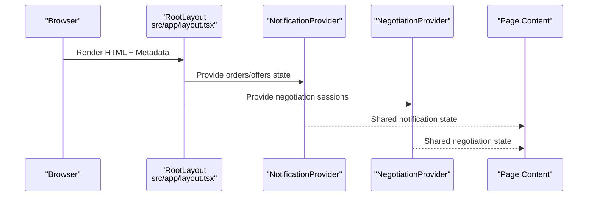
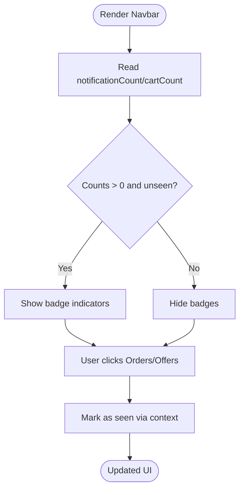
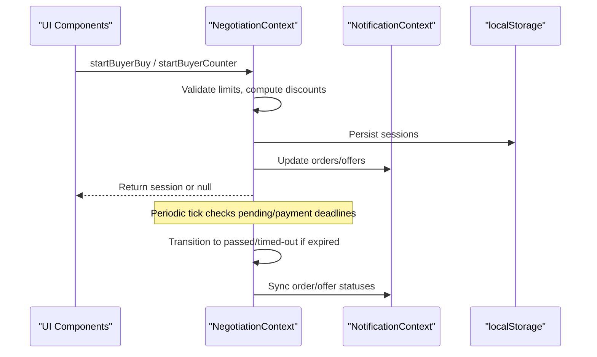
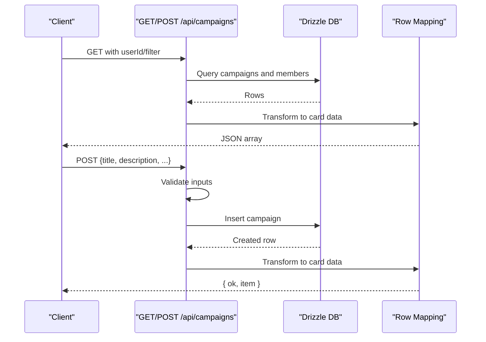
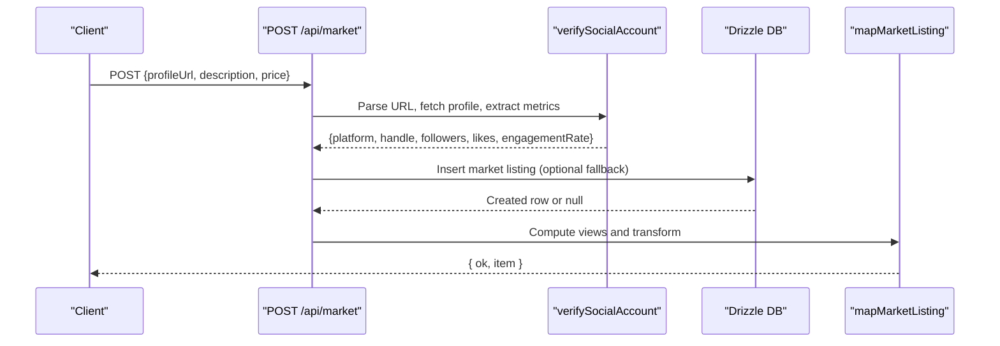
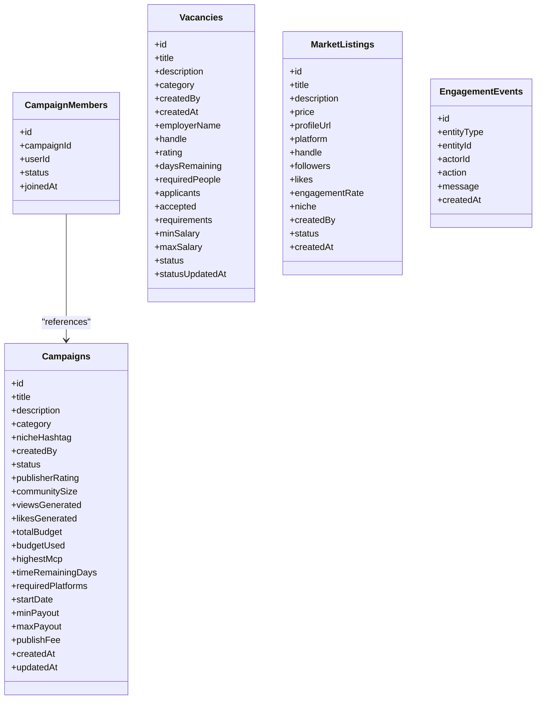
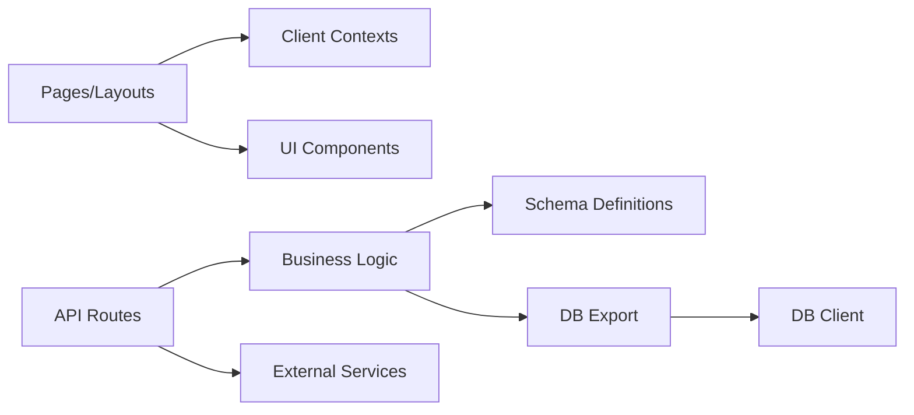

# System Architecture Overview

<cite>
**Referenced Files in This Document**
- [package.json](file://package.json)
- [next.config.ts](file://next.config.ts)
- [drizzle.config.ts](file://drizzle.config.ts)
- [src/app/layout.tsx](file://src/app/layout.tsx)
- [src/app/page.tsx](file://src/app/page.tsx)
- [src/components/layout/Navbar.tsx](file://src/components/layout/Navbar.tsx)
- [src/context/NotificationContext.tsx](file://src/context/NotificationContext.tsx)
- [src/context/NegotiationContext.tsx](file://src/context/NegotiationContext.tsx)
- [src/db/client.ts](file://src/db/client.ts)
- [src/db/schema.ts](file://src/db/schema.ts)
- [src/lib/db.ts](file://src/lib/db.ts)
- [src/lib/market.ts](file://src/lib/market.ts)
- [src/lib/campaigns.ts](file://src/lib/campaigns.ts)
- [src/app/api/campaigns/route.ts](file://src/app/api/campaigns/route.ts)
- [src/app/api/market/route.ts](file://src/app/api/market/route.ts)
- [scripts/run-migrations.mjs](file://scripts/run-migrations.mjs)
- [.nixpacks.toml](file://.nixpacks.toml)
</cite>

## Table of Contents
1. Introduction
2. Project Structure
3. Core Components
4. Architecture Overview
5. Detailed Component Analysis
6. Dependency Analysis
7. Performance Considerations
8. Troubleshooting Guide
9. Conclusion

## Introduction
PortVille Market is a modern trading application built with Next.js App Router, React 19, TypeScript, and PostgreSQL using Drizzle ORM. It combines server-side rendering for fast initial loads with client-side interactivity for dynamic user experiences such as negotiations, notifications, and marketplace interactions. The system separates concerns across pages (routes), reusable UI components, business logic modules, and a data layer backed by PostgreSQL.

## Project Structure
The project follows a feature-oriented layout under src/app for routes and API endpoints, src/components for UI building blocks, src/context for shared client state, src/lib for business logic and data access helpers, and src/db for database schema and connection configuration. Build and runtime scripts manage migrations and environment setup.

**Diagram sources**
- [src/app/layout.tsx:1-43](file://src/app/layout.tsx#L1-L43)
- [src/app/page.tsx:1-14](file://src/app/page.tsx#L1-L14)
- [src/components/layout/Navbar.tsx:1-170](file://src/components/layout/Navbar.tsx#L1-L170)
- [src/context/NotificationContext.tsx:1-146](file://src/context/NotificationContext.tsx#L1-L146)
- [src/context/NegotiationContext.tsx:1-706](file://src/context/NegotiationContext.tsx#L1-L706)
- [src/app/api/campaigns/route.ts:1-142](file://src/app/api/campaigns/route.ts#L1-L142)
- [src/app/api/market/route.ts:1-262](file://src/app/api/market/route.ts#L1-L262)
- [src/lib/market.ts:1-50](file://src/lib/market.ts#L1-L50)
- [src/lib/campaigns.ts:1-47](file://src/lib/campaigns.ts#L1-L47)
- [src/db/client.ts:1-152](file://src/db/client.ts#L1-L152)
- [src/db/schema.ts:1-84](file://src/db/schema.ts#L1-L84)
- [src/lib/db.ts:1-5](file://src/lib/db.ts#L1-L5)

**Section sources**
- [package.json:1-45](file://package.json#L1-L45)
- [next.config.ts:1-7](file://next.config.ts#L1-L7)
- [src/app/layout.tsx:1-43](file://src/app/layout.tsx#L1-L43)

## Core Components
- Root layout and providers: The root layout wraps the app with global providers for notifications and negotiation state, ensuring consistent UI and shared context across pages.
- Navigation: A responsive navbar provides navigation to Discover, Campaign, Market, and Office sections, along with notification and offer badges driven by client contexts.
- Data layer: A Node Postgres pool and Drizzle ORM instance are created with schema definitions; an initialization routine ensures required tables exist at runtime.
- Business logic modules: Dedicated modules map database rows to UI-friendly types and implement domain-specific calculations (e.g., views, engagement).
- API routes: Server functions expose REST-like endpoints for campaigns and market listings, handling input validation, persistence, and error responses.

**Section sources**
- [src/app/layout.tsx:1-43](file://src/app/layout.tsx#L1-L43)
- [src/components/layout/Navbar.tsx:1-170](file://src/components/layout/Navbar.tsx#L1-L170)
- [src/db/client.ts:1-152](file://src/db/client.ts#L1-L152)
- [src/db/schema.ts:1-84](file://src/db/schema.ts#L1-L84)
- [src/lib/market.ts:1-50](file://src/lib/market.ts#L1-L50)
- [src/lib/campaigns.ts:1-47](file://src/lib/campaigns.ts#L1-L47)
- [src/app/api/campaigns/route.ts:1-142](file://src/app/api/campaigns/route.ts#L1-L142)
- [src/app/api/market/route.ts:1-262](file://src/app/api/market/route.ts#L1-L262)

## Architecture Overview
PortVille Market uses Next.js App Router with server functions for data fetching and mutations, while client components manage interactive state via React Context. The data layer uses Drizzle ORM over PostgreSQL, with schema enforcement and optional runtime table creation. External integrations include social media profile verification via HTTP requests during listing creation.

**Diagram sources**
- [src/app/layout.tsx:1-43](file://src/app/layout.tsx#L1-L43)
- [src/context/NotificationContext.tsx:1-146](file://src/context/NotificationContext.tsx#L1-L146)
- [src/context/NegotiationContext.tsx:1-706](file://src/context/NegotiationContext.tsx#L1-L706)
- [src/app/api/campaigns/route.ts:1-142](file://src/app/api/campaigns/route.ts#L1-L142)
- [src/app/api/market/route.ts:1-262](file://src/app/api/market/route.ts#L1-L262)
- [src/lib/market.ts:1-50](file://src/lib/market.ts#L1-L50)
- [src/lib/campaigns.ts:1-47](file://src/lib/campaigns.ts#L1-L47)
- [src/db/client.ts:1-152](file://src/db/client.ts#L1-L152)

## Detailed Component Analysis

### Root Layout and Providers
The root layout sets metadata, applies global styles, and wraps children with NotificationProvider and NegotiationProvider. This establishes shared client state for orders/offers and negotiation sessions across all pages.

**Diagram sources**
- [src/app/layout.tsx:1-43](file://src/app/layout.tsx#L1-L43)
- [src/context/NotificationContext.tsx:1-146](file://src/context/NotificationContext.tsx#L1-L146)
- [src/context/NegotiationContext.tsx:1-706](file://src/context/NegotiationContext.tsx#L1-L706)

**Section sources**
- [src/app/layout.tsx:1-43](file://src/app/layout.tsx#L1-L43)

### Navbar and Client Interactivity
The Navbar renders navigation links and badge counts derived from NotificationContext. It toggles mobile menus and marks notifications/offers as seen on interaction.

**Diagram sources**
- [src/components/layout/Navbar.tsx:1-170](file://src/components/layout/Navbar.tsx#L1-L170)
- [src/context/NotificationContext.tsx:1-146](file://src/context/NotificationContext.tsx#L1-L146)

**Section sources**
- [src/components/layout/Navbar.tsx:1-170](file://src/components/layout/Navbar.tsx#L1-L170)
- [src/context/NotificationContext.tsx:1-146](file://src/context/NotificationContext.tsx#L1-L146)

### Negotiation Flow
NegotiationContext manages session lifecycle, including buyer/seller actions, timeouts, cooldowns, and synchronization with orders/offers. It persists state to localStorage and updates shared lists accordingly.

**Diagram sources**
- [src/context/NegotiationContext.tsx:1-706](file://src/context/NegotiationContext.tsx#L1-L706)
- [src/context/NotificationContext.tsx:1-146](file://src/context/NotificationContext.tsx#L1-L146)

**Section sources**
- [src/context/NegotiationContext.tsx:1-706](file://src/context/NegotiationContext.tsx#L1-L706)
- [src/context/NotificationContext.tsx:1-146](file://src/context/NotificationContext.tsx#L1-L146)

### Campaigns API
The campaigns endpoint supports GET and POST operations. GET filters by status or membership and maps rows to UI-friendly structures. POST validates inputs, creates a campaign, and returns the new item.

**Diagram sources**
- [src/app/api/campaigns/route.ts:1-142](file://src/app/api/campaigns/route.ts#L1-L142)
- [src/lib/campaigns.ts:1-47](file://src/lib/campaigns.ts#L1-L47)
- [src/db/schema.ts:1-84](file://src/db/schema.ts#L1-L84)

**Section sources**
- [src/app/api/campaigns/route.ts:1-142](file://src/app/api/campaigns/route.ts#L1-L142)
- [src/lib/campaigns.ts:1-47](file://src/lib/campaigns.ts#L1-L47)

### Market API and Social Verification
The market endpoint retrieves listings and creates new ones. Creation includes verifying social profiles via HTTP requests, extracting metrics, and persisting results. If the database is unavailable, it falls back to local payloads.

**Diagram sources**
- [src/app/api/market/route.ts:1-262](file://src/app/api/market/route.ts#L1-L262)
- [src/lib/market.ts:1-50](file://src/lib/market.ts#L1-L50)
- [src/db/schema.ts:1-84](file://src/db/schema.ts#L1-L84)

**Section sources**
- [src/app/api/market/route.ts:1-262](file://src/app/api/market/route.ts#L1-L262)
- [src/lib/market.ts:1-50](file://src/lib/market.ts#L1-L50)

### Database Schema and Initialization
The schema defines core entities: campaigns, campaign_members, vacancies, market_listings, and engagement_events. The client initializes a connection pool, enforces schema existence at runtime, and exposes db/pool utilities.

**Diagram sources**
- [src/db/schema.ts:1-84](file://src/db/schema.ts#L1-L84)

**Section sources**
- [src/db/client.ts:1-152](file://src/db/client.ts#L1-L152)
- [src/db/schema.ts:1-84](file://src/db/schema.ts#L1-L84)

## Dependency Analysis
The application layers dependencies clearly:
- Pages and layouts depend on client contexts for shared state.
- API routes depend on business logic modules and the data layer.
- Business logic depends on schema definitions and DB exports.
- The data layer depends on environment configuration and external services (for social verification).

**Diagram sources**
- [src/app/layout.tsx:1-43](file://src/app/layout.tsx#L1-L43)
- [src/context/NotificationContext.tsx:1-146](file://src/context/NotificationContext.tsx#L1-L146)
- [src/context/NegotiationContext.tsx:1-706](file://src/context/NegotiationContext.tsx#L1-L706)
- [src/app/api/campaigns/route.ts:1-142](file://src/app/api/campaigns/route.ts#L1-L142)
- [src/app/api/market/route.ts:1-262](file://src/app/api/market/route.ts#L1-L262)
- [src/lib/market.ts:1-50](file://src/lib/market.ts#L1-L50)
- [src/lib/campaigns.ts:1-47](file://src/lib/campaigns.ts#L1-L47)
- [src/db/client.ts:1-152](file://src/db/client.ts#L1-L152)
- [src/db/schema.ts:1-84](file://src/db/schema.ts#L1-L84)
- [src/lib/db.ts:1-5](file://src/lib/db.ts#L1-L5)

**Section sources**
- [src/lib/db.ts:1-5](file://src/lib/db.ts#L1-L5)
- [src/db/client.ts:1-152](file://src/db/client.ts#L1-L152)

## Performance Considerations
- Use server functions for data-heavy operations to leverage SSR benefits and reduce client payload size.
- Limit query result sizes with appropriate limits and ordering to avoid large datasets.
- Cache frequently accessed data where possible; consider Next.js caching strategies for stable content.
- Avoid unnecessary re-renders by keeping client state minimal and scoped within contexts.
- Profile external service calls (social verification) and implement retries/backoff to mitigate latency spikes.

[No sources needed since this section provides general guidance]

## Troubleshooting Guide
- Database connectivity: Ensure DATABASE_URL is configured; development mode may skip migrations if unreachable.
- Schema initialization: Runtime ensureDatabaseSchema runs on startup; failures are logged but do not block the app.
- API errors: Input validation returns 400 responses; server errors return 500 with empty arrays or error messages.
- Local environment: local.env can be used to load DATABASE_URL when running locally; verify keys and values.

**Section sources**
- [scripts/run-migrations.mjs:1-67](file://scripts/run-migrations.mjs#L1-L67)
- [src/db/client.ts:1-152](file://src/db/client.ts#L1-L152)
- [src/app/api/campaigns/route.ts:1-142](file://src/app/api/campaigns/route.ts#L1-L142)
- [src/app/api/market/route.ts:1-262](file://src/app/api/market/route.ts#L1-L262)

## Conclusion
PortVille Market’s architecture cleanly separates presentation, state management, business logic, and data access. Next.js App Router enables efficient SSR and client interactivity, while Drizzle ORM and PostgreSQL provide robust data modeling and querying. The system integrates external social services for verification and maintains resilience through fallbacks and clear error handling. Scalability considerations include query optimization, caching, and careful management of external dependencies.

[No sources needed since this section summarizes without analyzing specific files]