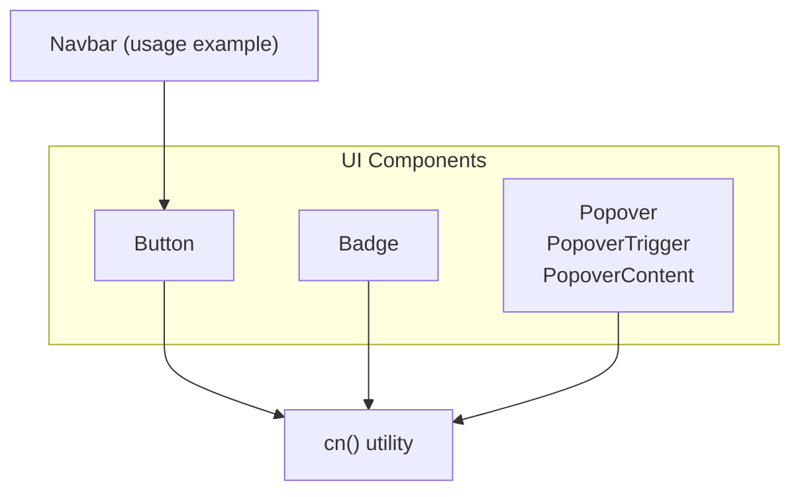
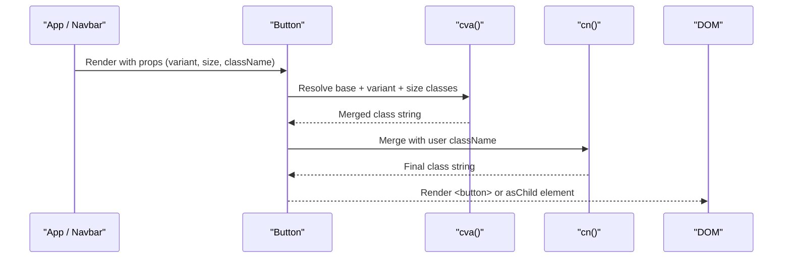
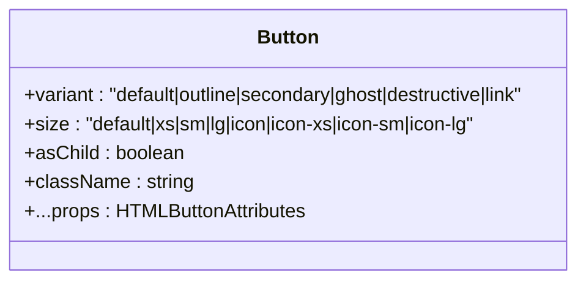
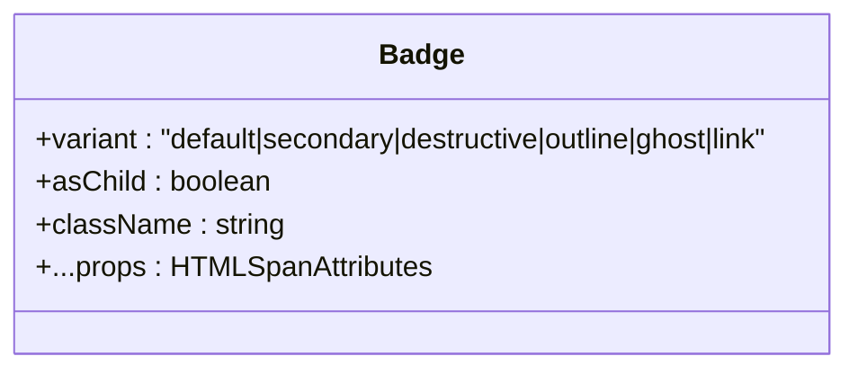
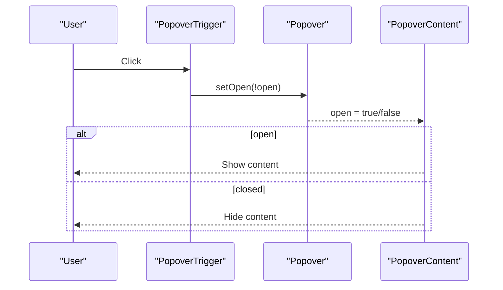
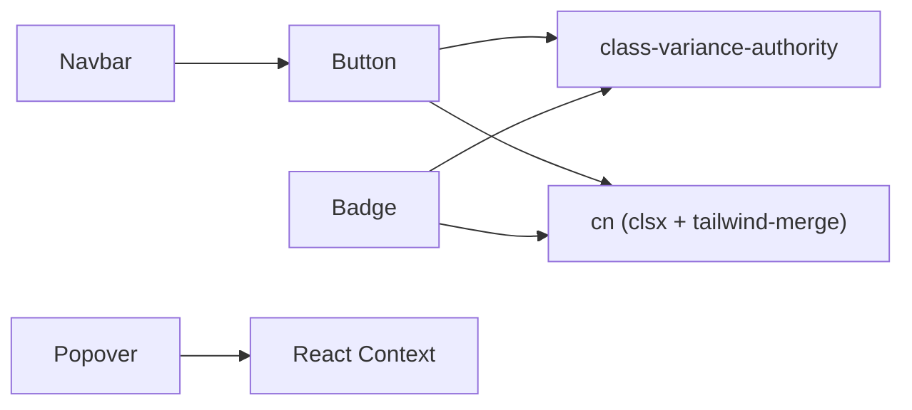

# Base UI Components

<cite>
**Referenced Files in This Document**
- [button.tsx](file://src/components/ui/button.tsx)
- [badge.tsx](file://src/components/ui/badge.tsx)
- [popover.tsx](file://src/components/ui/popover.tsx)
- [utils.ts](file://src/lib/utils.ts)
- [Navbar.tsx](file://src/components/layout/Navbar.tsx)
- [package.json](file://package.json)
</cite>

## Table of Contents
1. Introduction
2. Project Structure
3. Core Components
4. Architecture Overview
5. Detailed Component Analysis
6. Dependency Analysis
7. Performance Considerations
8. Troubleshooting Guide
9. Conclusion

## Introduction
This document describes the foundational UI components for PortVille Market: Button, Badge, and Popover. It covers prop interfaces, variant configurations, size options, styling customization via Tailwind CSS classes, accessibility features, composition patterns, event handling, integration with Radix UI primitives where applicable, responsive design considerations, dark mode support, and performance optimization techniques.

## Project Structure
The base UI components live under src/components/ui and are composed using class-variance-authority (cva) for variants and a shared utility to merge Tailwind classes. A lightweight Popover is implemented with React context to avoid heavy dependencies. The Navbar demonstrates practical usage of Button and shows how badges can be integrated into interactive elements.

**Diagram sources**
- [button.tsx:1-69](file://src/components/ui/button.tsx#L1-L69)
- [badge.tsx:1-51](file://src/components/ui/badge.tsx#L1-L51)
- [popover.tsx:1-39](file://src/components/ui/popover.tsx#L1-L39)
- [utils.ts:1-7](file://src/lib/utils.ts#L1-L7)
- [Navbar.tsx:1-170](file://src/components/layout/Navbar.tsx#L1-L170)

**Section sources**
- [button.tsx:1-69](file://src/components/ui/button.tsx#L1-L69)
- [badge.tsx:1-51](file://src/components/ui/badge.tsx#L1-L51)
- [popover.tsx:1-39](file://src/components/ui/popover.tsx#L1-L39)
- [utils.ts:1-7](file://src/lib/utils.ts#L1-L7)
- [Navbar.tsx:1-170](file://src/components/layout/Navbar.tsx#L1-L170)

## Core Components
- Button: A versatile button supporting multiple variants and sizes, with focus-visible states, disabled states, and icon sizing rules. Supports asChild composition to render as another element while preserving behavior.
- Badge: A compact label component with variants and consistent focus and invalid states. Also supports asChild composition.
- Popover: A lightweight popover built with React context that toggles visibility and renders content conditionally.

Key cross-cutting concerns:
- Styling: Built on Tailwind CSS with class-variance-authority for variants and a shared cn utility for safe class merging.
- Accessibility: Focus-visible rings, aria-invalid states, and semantic attributes are applied across components.
- Composition: asChild enables rendering inside other interactive elements without nested buttons.

**Section sources**
- [button.tsx:8-43](file://src/components/ui/button.tsx#L8-L43)
- [badge.tsx:8-29](file://src/components/ui/badge.tsx#L8-L29)
- [popover.tsx:13-37](file://src/components/ui/popover.tsx#L13-L37)
- [utils.ts:4-6](file://src/lib/utils.ts#L4-L6)

## Architecture Overview
The components follow a consistent pattern:
- Variants defined via cva with default values.
- Class merging via cn to combine base styles, variant-specific styles, and user-provided className.
- Data attributes (data-slot, data-variant, data-size) for consistent testing and styling hooks.
- Lightweight Slot-like behavior via asChild to compose components without extra DOM nodes.

**Diagram sources**
- [button.tsx:8-64](file://src/components/ui/button.tsx#L8-L64)
- [utils.ts:4-6](file://src/lib/utils.ts#L4-L6)

## Detailed Component Analysis

### Button
- Purpose: Primary interactive control with consistent visual language and accessible focus/disabled states.
- Props:
  - variant: default | outline | secondary | ghost | destructive | link
  - size: default | xs | sm | lg | icon | icon-xs | icon-sm | icon-lg
  - asChild?: boolean — renders as child element instead of native button when true
  - className?: string — additional Tailwind classes merged via cn
  - All standard HTML button attributes are supported through rest props
- Behavior:
  - Focus-visible ring and border applied for keyboard navigation
  - Disabled state reduces opacity and prevents pointer events
  - aria-invalid styles for form validation feedback
  - Icon sizing rules ensure consistent icon dimensions within buttons
- Composition:
  - Use asChild to render inside links or other interactive containers without nesting buttons
- Usage example reference:
  - See Navbar usage demonstrating ghost and icon sizes with icons and labels

**Diagram sources**
- [button.tsx:45-66](file://src/components/ui/button.tsx#L45-L66)

**Section sources**
- [button.tsx:8-43](file://src/components/ui/button.tsx#L8-L43)
- [button.tsx:45-66](file://src/components/ui/button.tsx#L45-L66)
- [Navbar.tsx:66-114](file://src/components/layout/Navbar.tsx#L66-L114)

### Badge
- Purpose: Compact status or label indicator with clear variants and focus states.
- Props:
  - variant: default | secondary | destructive | outline | ghost | link
  - asChild?: boolean — renders as child element instead of span when true
  - className?: string — additional Tailwind classes merged via cn
  - All standard HTML span attributes are supported through rest props
- Behavior:
  - Consistent focus-visible ring and border
  - aria-invalid styles for error states
  - Inline-flex layout with truncation and whitespace handling
- Composition:
  - Use asChild to embed inside links or other interactive elements
- Usage example reference:
  - Navbar demonstrates overlaying small numeric indicators near icons

**Diagram sources**
- [badge.tsx:31-47](file://src/components/ui/badge.tsx#L31-L47)

**Section sources**
- [badge.tsx:8-29](file://src/components/ui/badge.tsx#L8-L29)
- [badge.tsx:31-47](file://src/components/ui/badge.tsx#L31-L47)
- [Navbar.tsx:74-98](file://src/components/layout/Navbar.tsx#L74-L98)

### Popover
- Purpose: Lightweight popover with trigger and content, managed via React context.
- Components:
  - Popover: Provider holding open state
  - PopoverTrigger: Toggle button that flips open state
  - PopoverContent: Conditionally rendered container with absolute positioning and z-index
- Props:
  - Popover: children
  - PopoverTrigger: children
  - PopoverContent: children
- Behavior:
  - Toggles visibility based on local state
  - Content renders only when open
  - Uses absolute positioning and backdrop-friendly colors; supports dark mode via Tailwind dark variants
- Integration note:
  - While Radix UI Popover is available in dependencies, this implementation provides a minimal alternative without external positioning logic

**Diagram sources**
- [popover.tsx:13-37](file://src/components/ui/popover.tsx#L13-L37)

**Section sources**
- [popover.tsx:5-16](file://src/components/ui/popover.tsx#L5-L16)
- [popover.tsx:18-26](file://src/components/ui/popover.tsx#L18-L26)
- [popover.tsx:28-37](file://src/components/ui/popover.tsx#L28-L37)

## Dependency Analysis
- Internal utilities:
  - cn from src/lib/utils.ts merges class names safely using clsx and tailwind-merge
- External libraries:
  - class-variance-authority defines variants for Button and Badge
  - Tailwind CSS powers all styling and dark mode
  - Radix UI packages are installed but not used by these specific components; a lightweight custom Popover is provided
- Usage in app:
  - Navbar imports and uses Button to build header actions

**Diagram sources**
- [button.tsx:1-69](file://src/components/ui/button.tsx#L1-L69)
- [badge.tsx:1-51](file://src/components/ui/badge.tsx#L1-L51)
- [popover.tsx:1-39](file://src/components/ui/popover.tsx#L1-L39)
- [utils.ts:1-7](file://src/lib/utils.ts#L1-L7)
- [Navbar.tsx:1-170](file://src/components/layout/Navbar.tsx#L1-L170)
- [package.json:15-33](file://package.json#L15-L33)

**Section sources**
- [package.json:15-33](file://package.json#L15-L33)
- [button.tsx:1-69](file://src/components/ui/button.tsx#L1-L69)
- [badge.tsx:1-51](file://src/components/ui/badge.tsx#L1-L51)
- [popover.tsx:1-39](file://src/components/ui/popover.tsx#L1-L39)
- [utils.ts:1-7](file://src/lib/utils.ts#L1-L7)
- [Navbar.tsx:1-170](file://src/components/layout/Navbar.tsx#L1-L170)

## Performance Considerations
- Prefer asChild to avoid extra wrapper elements when composing with existing interactive components.
- Keep variant and size sets stable to minimize re-renders caused by prop changes.
- Use Tailwind’s dark mode classes for theming without JavaScript overhead.
- Avoid excessive inline styles; rely on Tailwind classes for better caching and tree-shaking.
- For complex popovers requiring precise positioning, consider integrating Radix UI Popover for robust placement and focus management.

[No sources needed since this section provides general guidance]

## Troubleshooting Guide
- Buttons not clickable:
  - Ensure you are not nesting interactive elements; use asChild if embedding inside links or other controls.
- Focus ring missing:
  - Verify focus-visible styles are enabled and not overridden by global styles.
- Invalid state not showing:
  - Apply aria-invalid to the component and ensure parent form wiring is correct.
- Popover not appearing:
  - Confirm Popover wraps both Trigger and Content; check that open state is toggled by Trigger.
- Dark mode issues:
  - Ensure dark variants are present in your theme configuration and that Tailwind’s dark mode strategy is set correctly.

**Section sources**
- [button.tsx:8-43](file://src/components/ui/button.tsx#L8-L43)
- [badge.tsx:8-29](file://src/components/ui/badge.tsx#L8-L29)
- [popover.tsx:13-37](file://src/components/ui/popover.tsx#L13-L37)

## Conclusion
Button, Badge, and Popover provide a cohesive, accessible foundation for PortVille Market’s interface. They leverage Tailwind CSS and class-variance-authority for flexible styling, support composition via asChild, and include sensible defaults for focus, disabled, and invalid states. The lightweight Popover offers simplicity, while Radix UI remains available for advanced scenarios. These components integrate seamlessly into pages like the Navbar and scale well across responsive layouts and dark mode themes.

[No sources needed since this section summarizes without analyzing specific files]