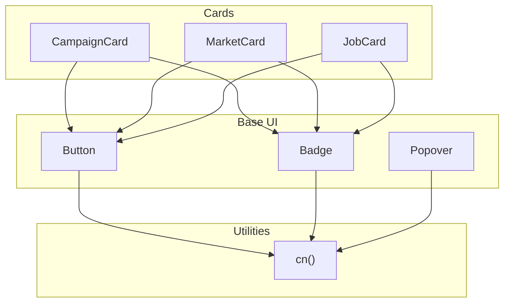
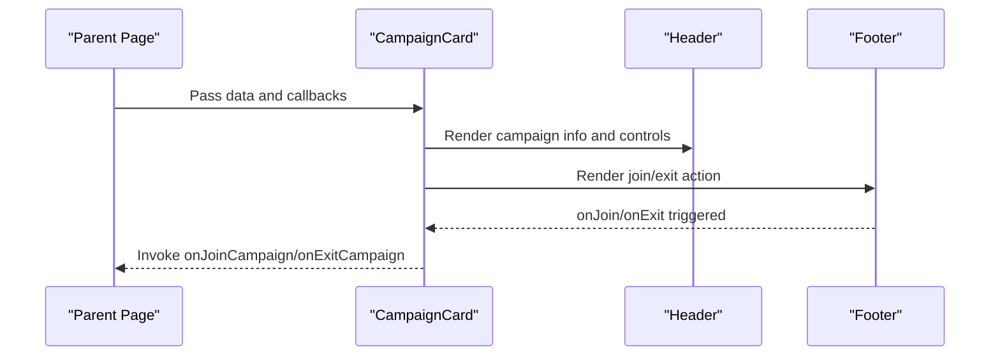
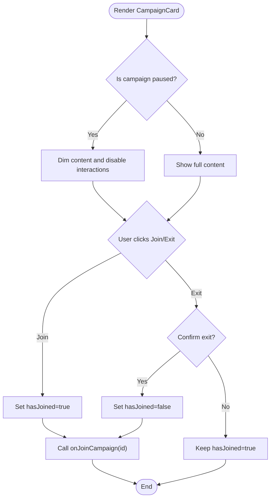
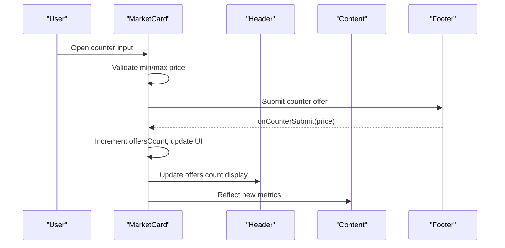
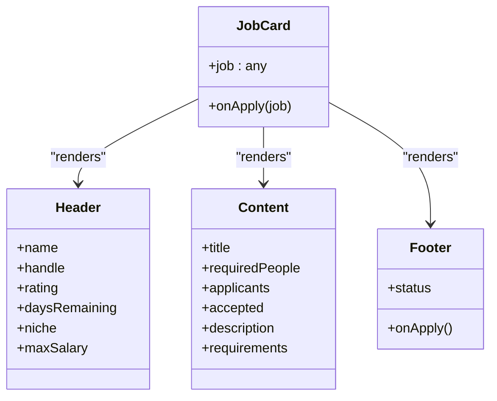
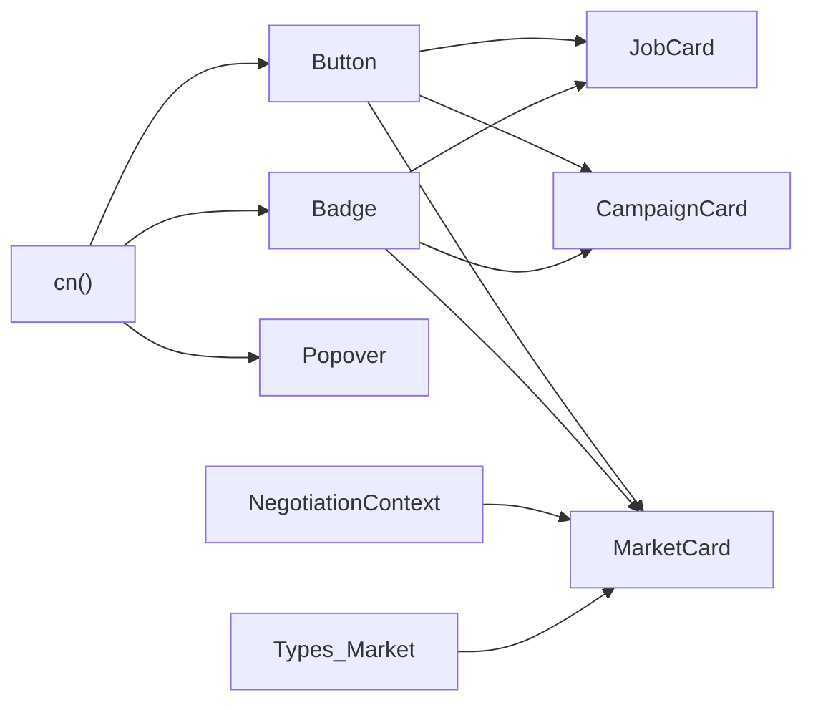

# Component Library

<cite>
**Referenced Files in This Document**
- [button.tsx](file://src/components/ui/button.tsx)
- [badge.tsx](file://src/components/ui/badge.tsx)
- [popover.tsx](file://src/components/ui/popover.tsx)
- [campaign-card/index.tsx](file://src/components/campaign-card/index.tsx)
- [campaign-card/header.tsx](file://src/components/campaign-card/header.tsx)
- [campaign-card/content.tsx](file://src/components/campaign-card/content.tsx)
- [campaign-card/footer.tsx](file://src/components/campaign-card/footer.tsx)
- [market-card/index.tsx](file://src/components/market-card/index.tsx)
- [market-card/header.tsx](file://src/components/market-card/header.tsx)
- [market-card/content.tsx](file://src/components/market-card/content.tsx)
- [job-card/index.tsx](file://src/components/job-card/index.tsx)
- [job-card/header.tsx](file://src/components/job-card/header.tsx)
- [job-card/content.tsx](file://src/components/job-card/content.tsx)
- [job-card/footer.tsx](file://src/components/job-card/footer.tsx)
- [utils.ts](file://src/lib/utils.ts)
- [market.ts](file://src/types/market.ts)
</cite>

## Table of Contents
1. Introduction
2. Project Structure
3. Core Components
4. Architecture Overview
5. Detailed Component Analysis
6. Dependency Analysis
7. Performance Considerations
8. Troubleshooting Guide
9. Conclusion

## Introduction
This document describes PortVille Market’s component library with a focus on reusable UI primitives and feature-specific cards. It covers visual appearance, behavior, props/attributes, events, customization options, styling via Tailwind CSS, responsive design patterns, accessibility compliance, composition guidelines, theming support, integration tips, performance optimization, and cross-browser considerations.

## Project Structure
The component library is organized into:
- Base UI components under src/components/ui (Button, Badge, Popover)
- Feature-specific cards under src/components (campaign-card, market-card, job-card), each split into header, content, footer, and optional submodules
- Shared utilities for class merging and types for data contracts

**Diagram sources**
- [button.tsx:1-69](file://src/components/ui/button.tsx#L1-L69)
- [badge.tsx:1-51](file://src/components/ui/badge.tsx#L1-L51)
- [popover.tsx:1-39](file://src/components/ui/popover.tsx#L1-L39)
- [campaign-card/index.tsx:1-71](file://src/components/campaign-card/index.tsx#L1-L71)
- [market-card/index.tsx:1-158](file://src/components/market-card/index.tsx#L1-L158)
- [job-card/index.tsx:1-31](file://src/components/job-card/index.tsx#L1-L31)
- [utils.ts:1-7](file://src/lib/utils.ts#L1-L7)

**Section sources**
- [button.tsx:1-69](file://src/components/ui/button.tsx#L1-L69)
- [badge.tsx:1-51](file://src/components/ui/badge.tsx#L1-L51)
- [popover.tsx:1-39](file://src/components/ui/popover.tsx#L1-L39)
- [utils.ts:1-7](file://src/lib/utils.ts#L1-L7)

## Core Components
- Button
  - Appearance: Rounded, multiple variants (default, outline, secondary, ghost, destructive, link), sizes (default, xs, sm, lg, icon variants). Focus ring and disabled states included.
  - Behavior: Supports asChild to render as another element; emits all native button events through props.
  - Props: variant, size, className, asChild, plus standard button attributes.
  - Events: onClick, onKeyDown, etc., forwarded to the underlying element.
  - Customization: Use variant and size; extend via class-variance-authority patterns; merge classes with cn().
  - Accessibility: Focus-visible styles, aria-invalid handling, keyboard-friendly.
  - Styling: Tailwind CSS with semantic tokens (primary, background, border, ring).

- Badge
  - Appearance: Compact inline label with rounded edges, multiple variants (default, secondary, destructive, outline, ghost, link).
  - Behavior: Renders as span by default or as child when asChild is true.
  - Props: variant, className, asChild, plus span attributes.
  - Events: None by default; pass through to underlying element.
  - Customization: Variant-based color schemes; compose with icons via data attributes.
  - Accessibility: Focus-visible ring; supports aria-invalid.

- Popover
  - Appearance: Lightweight floating panel with backdrop-like opacity and shadow.
  - Behavior: Context-driven open/close state; Trigger toggles visibility; Content renders conditionally.
  - Props: children for each part; no external positioning library used.
  - Events: Click on trigger toggles open state.
  - Customization: Style the content container; integrate with other UI elements using absolute positioning.
  - Accessibility: Uses a button trigger; ensure proper ARIA roles and focus management if extended.

**Section sources**
- [button.tsx:8-69](file://src/components/ui/button.tsx#L8-L69)
- [badge.tsx:8-51](file://src/components/ui/badge.tsx#L8-L51)
- [popover.tsx:5-39](file://src/components/ui/popover.tsx#L5-L39)
- [utils.ts:1-7](file://src/lib/utils.ts#L1-L7)

## Architecture Overview
Feature cards are composed from base UI components and internal sections (header, content, footer). Data flows from parent props into card sections, which render metrics and actions. State is managed locally within each card where needed (e.g., counters, timers).

**Diagram sources**
- [campaign-card/index.tsx:10-71](file://src/components/campaign-card/index.tsx#L10-L71)
- [campaign-card/header.tsx:8-123](file://src/components/campaign-card/header.tsx#L8-L123)
- [campaign-card/footer.tsx:5-52](file://src/components/campaign-card/footer.tsx#L5-L52)

## Detailed Component Analysis

### CampaignCard
- Visual appearance: Dark-themed card with status badge at top, header with publisher info and countdown, content with description, platforms, hashtags, and metrics, budget-sentiment section, and footer with join/exit action. Paused state dims and disables interactive areas.
- Behavior: Tracks local joined state; updates UI and invokes parent callbacks; shows paused overlay; manager controls appear for specific users.
- Props:
  - data: CampaignCardData object
  - onJoinCampaign(id): callback when joining
  - onExitCampaign(id): callback when leaving
  - onPauseCampaign?(id, status): optional pause/resume
  - onDeleteCampaign?(id): optional delete
  - isJoinDisabled?: boolean
  - joinDisabledLabel?: string
- Events:
  - Join/Exit triggers update local state and call parent handlers
  - Pause/Resume/Delete handled in header if provided
- Customization:
  - Status badge colors adapt to paused vs active
  - Manager controls visible based on user identity and provided handlers
- Styling: Tailwind utility classes; responsive typography and spacing; dark theme tokens
- Accessibility:
  - Buttons include aria-labels for pause/resume and delete
  - Disabled states use appropriate cursor and opacity
- Usage example (conceptual):
  - Provide data and onJoinCampaign/onExitCampaign to control membership
  - Optionally provide onPauseCampaign/onDeleteCampaign for manager actions
  - Disable join with isJoinDisabled and show custom label

**Diagram sources**
- [campaign-card/index.tsx:20-71](file://src/components/campaign-card/index.tsx#L20-L71)
- [campaign-card/footer.tsx:14-52](file://src/components/campaign-card/footer.tsx#L14-L52)

**Section sources**
- [campaign-card/index.tsx:1-71](file://src/components/campaign-card/index.tsx#L1-L71)
- [campaign-card/header.tsx:1-123](file://src/components/campaign-card/header.tsx#L1-L123)
- [campaign-card/content.tsx:1-76](file://src/components/campaign-card/content.tsx#L1-L76)
- [campaign-card/footer.tsx:1-52](file://src/components/campaign-card/footer.tsx#L1-L52)

### MarketCard
- Visual appearance: Seller header with avatar, verification badge, rating, live stock badge, countdown timer, offer count; content with description, handle, followers/views metrics, efficiency ratios; sentiment section; footer with buy/counter actions and costly voting.
- Behavior: Manages counter attempts, cooldown timer, live offers count, price input validation against dynamic min/max limits; integrates with negotiation context to reflect session status and cooldown.
- Props:
  - cardData: MarketCardData object
  - hideFooter?: boolean
  - hideBorder?: boolean
  - onBuyClick?(): optional buy handler
  - onCounterSubmit?(price: number): submit counter offer
- Events:
  - Counter initiate opens price input; confirm submits validated price
  - Costly vote increments up to limit unless maxed/inactive
- Customization:
  - Dynamic discount floor based on counter attempts
  - Visual cues for cooldown, inactive sessions, and active offers
- Styling: Tailwind classes; responsive text sizes; conditional borders and backgrounds
- Accessibility:
  - Inputs have placeholders indicating min price
  - Disabled states prevent invalid submissions
- Usage example (conceptual):
  - Provide cardData and onCounterSubmit to handle negotiations
  - Optionally provide onBuyClick for direct purchase flow
  - Hide footer or border for compact layouts

**Diagram sources**
- [market-card/index.tsx:20-158](file://src/components/market-card/index.tsx#L20-L158)
- [market-card/header.tsx:20-133](file://src/components/market-card/header.tsx#L20-L133)
- [market-card/content.tsx:11-110](file://src/components/market-card/content.tsx#L11-L110)

**Section sources**
- [market-card/index.tsx:1-158](file://src/components/market-card/index.tsx#L1-L158)
- [market-card/header.tsx:1-133](file://src/components/market-card/header.tsx#L1-L133)
- [market-card/content.tsx:1-110](file://src/components/market-card/content.tsx#L1-L110)
- [market.ts:1-25](file://src/types/market.ts#L1-L25)

### JobCard
- Visual appearance: Employer header with initials, handle, rating, countdown timer, salary; content with title, description, requirements tags, and metrics grid (required/applicants/accepted); footer with status-driven action button.
- Behavior: Displays status-specific button states (apply, paused, filled, acquired); formats time and salary; renders requirements as flat tags.
- Props:
  - job: any (employerName, handle, rating, daysRemaining, title, requiredPeople, applicants, accepted, description, requirements, status, maxSalary)
  - onApply?(job): optional apply handler
- Events:
  - Apply button triggers onApply(job)
- Customization:
  - Timer urgency affects colors and pulse animation
  - Requirements rendered as compact tags
- Styling: Tailwind classes; responsive typography; subtle borders and shadows
- Accessibility:
  - Buttons are disabled appropriately per status
  - Clear labels via visible text
- Usage example (conceptual):
  - Provide job data and onApply to handle applications
  - Use status to control button behavior

**Diagram sources**
- [job-card/index.tsx:1-31](file://src/components/job-card/index.tsx#L1-L31)
- [job-card/header.tsx:1-110](file://src/components/job-card/header.tsx#L1-L110)
- [job-card/content.tsx:1-94](file://src/components/job-card/content.tsx#L1-L94)
- [job-card/footer.tsx:1-54](file://src/components/job-card/footer.tsx#L1-L54)

**Section sources**
- [job-card/index.tsx:1-31](file://src/components/job-card/index.tsx#L1-L31)
- [job-card/header.tsx:1-110](file://src/components/job-card/header.tsx#L1-L110)
- [job-card/content.tsx:1-94](file://src/components/job-card/content.tsx#L1-L94)
- [job-card/footer.tsx:1-54](file://src/components/job-card/footer.tsx#L1-L54)

## Dependency Analysis
- Base UI components depend on shared utility cn() for class merging.
- Cards depend on base UI components (Button, Badge) and internal sections.
- MarketCard depends on negotiation context for session state and cooldown.
- Types define data contracts for cards.

**Diagram sources**
- [utils.ts:1-7](file://src/lib/utils.ts#L1-L7)
- [button.tsx:1-69](file://src/components/ui/button.tsx#L1-L69)
- [badge.tsx:1-51](file://src/components/ui/badge.tsx#L1-L51)
- [popover.tsx:1-39](file://src/components/ui/popover.tsx#L1-L39)
- [campaign-card/index.tsx:1-71](file://src/components/campaign-card/index.tsx#L1-L71)
- [market-card/index.tsx:1-158](file://src/components/market-card/index.tsx#L1-L158)
- [job-card/index.tsx:1-31](file://src/components/job-card/index.tsx#L1-L31)
- [market.ts:1-25](file://src/types/market.ts#L1-L25)

**Section sources**
- [utils.ts:1-7](file://src/lib/utils.ts#L1-L7)
- [market.ts:1-25](file://src/types/market.ts#L1-L25)

## Performance Considerations
- Avoid unnecessary re-renders:
  - Memoize expensive computations in headers/content (e.g., ratio calculations, formatting functions).
  - Use React.memo for stable subcomponents like Header/Content/Footer when props change frequently.
- Optimize timers:
  - Campaign and Market headers use intervals; ensure cleanup on unmount to prevent memory leaks.
  - Debounce frequent state updates if rendering heavy content during countdowns.
- Class merging:
  - Leverage cn() to minimize redundant class strings and improve Tailwind processing.
- Image handling:
  - Provide fallbacks for missing avatars/profile images to avoid layout shifts.
- Conditional rendering:
  - Hide non-critical sections when not needed (e.g., hideFooter/hideBorder) to reduce DOM size.
- Cross-browser compatibility:
  - Ensure focus-visible polyfills if targeting older browsers.
  - Test absolute positioning of Popover across viewports and zoom levels.

[No sources needed since this section provides general guidance]

## Troubleshooting Guide
- Popover not appearing:
  - Verify that PopoverTrigger is inside Popover and that open state is toggled correctly.
  - Check z-index and positioning context; ensure parent containers do not clip content.
- Button/Badge styles not applying:
  - Ensure variant and size props match defined values; verify class merging with cn().
  - Confirm Tailwind configuration includes semantic tokens (primary, background, border, ring).
- MarketCard counter submission blocked:
  - Validate min/max price constraints; check cooldown and session status.
  - Inspect negotiation context for active offers or cooldownUntil timestamps.
- CampaignCard paused state:
  - Confirm status comparison logic; ensure UI reflects paused overlay and disabled actions.
  - Verify manager controls only appear for authorized users.

**Section sources**
- [popover.tsx:13-39](file://src/components/ui/popover.tsx#L13-L39)
- [button.tsx:8-69](file://src/components/ui/button.tsx#L8-L69)
- [badge.tsx:8-51](file://src/components/ui/badge.tsx#L8-L51)
- [market-card/index.tsx:47-81](file://src/components/market-card/index.tsx#L47-L81)
- [campaign-card/index.tsx:41-71](file://src/components/campaign-card/index.tsx#L41-L71)

## Conclusion
PortVille Market’s component library provides a cohesive set of base UI primitives and feature-specific cards built with Tailwind CSS and React. The components emphasize clear visual hierarchy, accessible interactions, and flexible customization through variants and composition. By following the guidelines here—props usage, event handling, styling approaches, and performance best practices—you can integrate these components effectively across the application while maintaining consistency and responsiveness.

[No sources needed since this section summarizes without analyzing specific files]