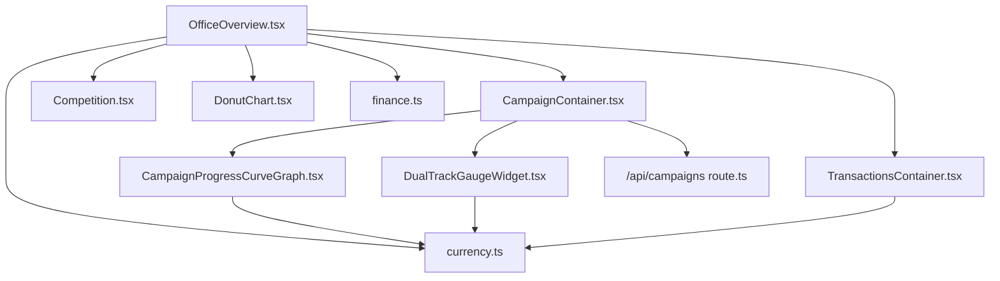
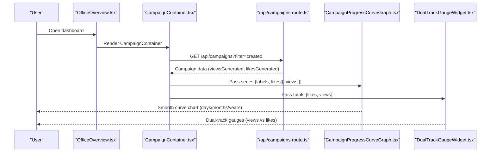
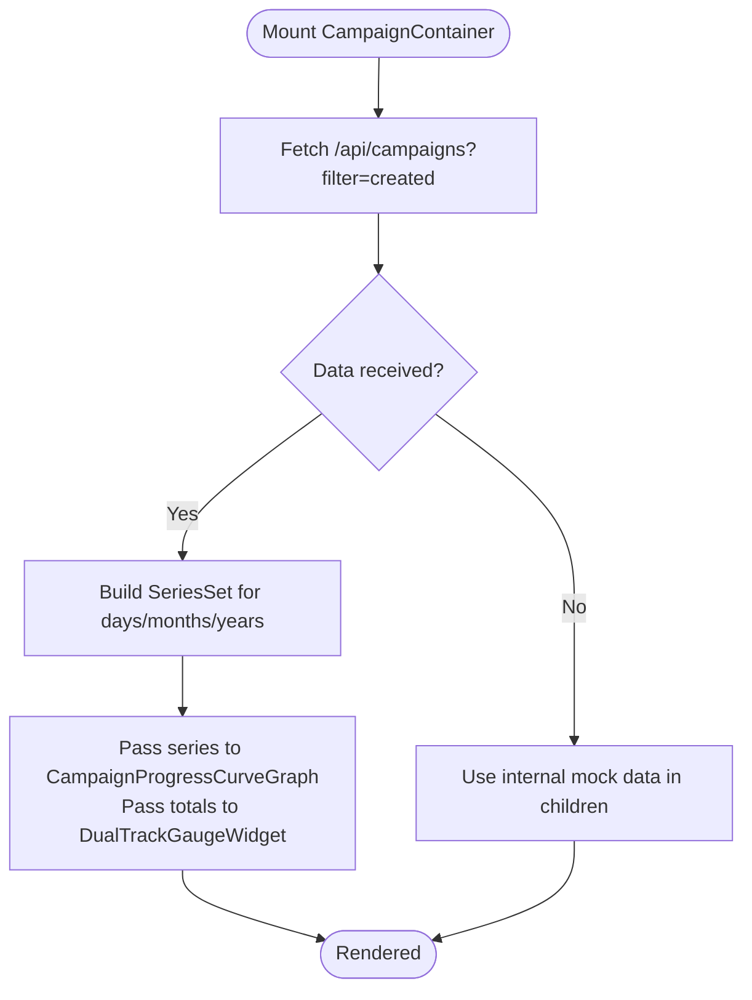
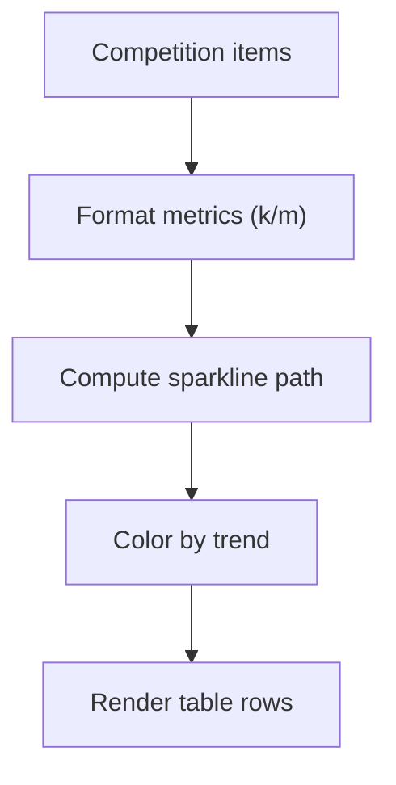
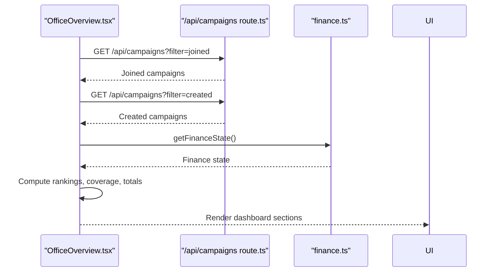
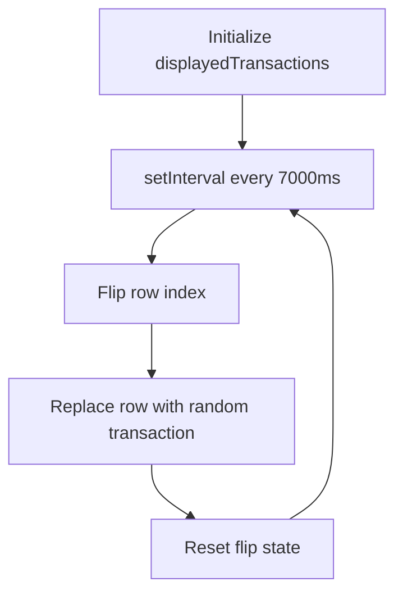
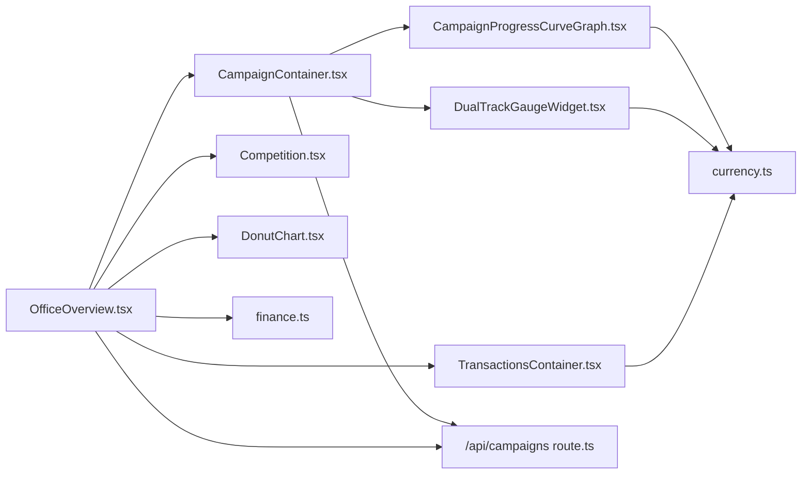

# Dashboard & Analytics Components

<cite>
**Referenced Files in This Document**
- [CampaignContainer.tsx](file://src/components/office/CampaignContainer.tsx)
- [CampaignProgressCurveGraph.tsx](file://src/components/office/CampaignProgressCurveGraph.tsx)
- [Competition.tsx](file://src/components/office/Competition.tsx)
- [DualTrackGaugeWidget.tsx](file://src/components/office/DualTrackGaugeWidget.tsx)
- [OfficeOverview.tsx](file://src/components/office/OfficeOverview.tsx)
- [TransactionsContainer.tsx](file://src/components/office/TransactionsContainer.tsx)
- [DonutChart.tsx](file://src/components/DonutChart.tsx)
- [route.ts](file://src/app/api/campaigns/route.ts)
- [finance.ts](file://src/lib/finance.ts)
- [currency.ts](file://src/lib/currency.ts)
</cite>

## Table of Contents
1. [Introduction](#introduction)
2. [Project Structure](#project-structure)
3. [Core Components](#core-components)
4. [Architecture Overview](#architecture-overview)
5. [Detailed Component Analysis](#detailed-component-analysis)
6. [Dependency Analysis](#dependency-analysis)
7. [Performance Considerations](#performance-considerations)
8. [Troubleshooting Guide](#troubleshooting-guide)
9. [Conclusion](#conclusion)

## Introduction
This document provides detailed documentation for PortVille Market’s dashboard and analytics components focused on the office view. It covers data visualization patterns, chart configuration options, real-time updates, integration with analytics APIs, handling large datasets, performance optimization, responsive behavior, color schemes, accessibility considerations, component composition patterns, and state synchronization across related visualizations.

## Project Structure
The dashboard is composed of several client-side React components under src/components/office, plus a shared DonutChart component. OfficeOverview orchestrates the layout and composes CampaignContainer, Competition, TransactionsContainer, and other widgets. Data flows from Next.js API routes (e.g., /api/campaigns) into these components via fetch calls and local state.



**Diagram sources**
- [OfficeOverview.tsx:1-800](file://src/components/office/OfficeOverview.tsx#L1-L800)
- [CampaignContainer.tsx:1-121](file://src/components/office/CampaignContainer.tsx#L1-L121)
- [CampaignProgressCurveGraph.tsx:1-146](file://src/components/office/CampaignProgressCurveGraph.tsx#L1-L146)
- [DualTrackGaugeWidget.tsx:1-130](file://src/components/office/DualTrackGaugeWidget.tsx#L1-L130)
- [Competition.tsx:1-148](file://src/components/office/Competition.tsx#L1-L148)
- [TransactionsContainer.tsx:1-118](file://src/components/office/TransactionsContainer.tsx#L1-L118)
- [DonutChart.tsx:1-164](file://src/components/DonutChart.tsx#L1-L164)
- [route.ts:1-142](file://src/app/api/campaigns/route.ts#L1-L142)
- [finance.ts:1-50](file://src/lib/finance.ts#L1-L50)
- [currency.ts:1-56](file://src/lib/currency.ts#L1-L56)

**Section sources**
- [OfficeOverview.tsx:1-800](file://src/components/office/OfficeOverview.tsx#L1-L800)
- [CampaignContainer.tsx:1-121](file://src/components/office/CampaignContainer.tsx#L1-L121)
- [CampaignProgressCurveGraph.tsx:1-146](file://src/components/office/CampaignProgressCurveGraph.tsx#L1-L146)
- [DualTrackGaugeWidget.tsx:1-130](file://src/components/office/DualTrackGaugeWidget.tsx#L1-L130)
- [Competition.tsx:1-148](file://src/components/office/Competition.tsx#L1-L148)
- [TransactionsContainer.tsx:1-118](file://src/components/office/TransactionsContainer.tsx#L1-L118)
- [DonutChart.tsx:1-164](file://src/components/DonutChart.tsx#L1-L164)
- [route.ts:1-142](file://src/app/api/campaigns/route.ts#L1-L142)
- [finance.ts:1-50](file://src/lib/finance.ts#L1-L50)
- [currency.ts:1-56](file://src/lib/currency.ts#L1-L56)

## Core Components
- CampaignContainer: Orchestrates campaign flow visualization and audience gauge; loads campaign metrics from /api/campaigns and passes series data to child charts.
- CampaignProgressCurveGraph: Renders a smooth line chart for likes and views over time with selectable time scales (days/months/years).
- Competition: Displays a ranked list of competitors with sparkline trends and filtering controls.
- DualTrackGaugeWidget: Shows two concentric gauges for campaign views vs likes, with platform selection and live totals.
- OfficeOverview: High-level dashboard that composes multiple widgets, manages finance state, and renders campaign league and target sections.
- TransactionsContainer: Animated transaction list with periodic row replacement to simulate real-time updates.
- DonutChart: Reusable SVG donut chart with segments, center value, and legend.

**Section sources**
- [CampaignContainer.tsx:1-121](file://src/components/office/CampaignContainer.tsx#L1-L121)
- [CampaignProgressCurveGraph.tsx:1-146](file://src/components/office/CampaignProgressCurveGraph.tsx#L1-L146)
- [Competition.tsx:1-148](file://src/components/office/Competition.tsx#L1-L148)
- [DualTrackGaugeWidget.tsx:1-130](file://src/components/office/DualTrackGaugeWidget.tsx#L1-L130)
- [OfficeOverview.tsx:1-800](file://src/components/office/OfficeOverview.tsx#L1-L800)
- [TransactionsContainer.tsx:1-118](file://src/components/office/TransactionsContainer.tsx#L1-L118)
- [DonutChart.tsx:1-164](file://src/components/DonutChart.tsx#L1-L164)

## Architecture Overview
The dashboard follows a container/presentational pattern:
- OfficeOverview composes subcomponents and manages global UI state (campaign selections, channel health timeframe, finance state).
- CampaignContainer fetches campaign data and computes series per time scale, passing structured data to CampaignProgressCurveGraph and aggregated totals to DualTrackGaugeWidget.
- API layer (/api/campaigns) returns campaigns filtered by user context and joined status, which components consume via fetch.
- Finance state is persisted in localStorage and synchronized across components using custom events.



**Diagram sources**
- [CampaignContainer.tsx:23-65](file://src/components/office/CampaignContainer.tsx#L23-L65)
- [route.ts:46-98](file://src/app/api/campaigns/route.ts#L46-L98)
- [CampaignProgressCurveGraph.tsx:9-30](file://src/components/office/CampaignProgressCurveGraph.tsx#L9-L30)
- [DualTrackGaugeWidget.tsx:5-41](file://src/components/office/DualTrackGaugeWidget.tsx#L5-L41)

**Section sources**
- [OfficeOverview.tsx:147-262](file://src/components/office/OfficeOverview.tsx#L147-L262)
- [CampaignContainer.tsx:23-65](file://src/components/office/CampaignContainer.tsx#L23-L65)
- [route.ts:46-98](file://src/app/api/campaigns/route.ts#L46-L98)

## Detailed Component Analysis

### CampaignContainer
- Purpose: Loads campaign metrics and composes the progress curve and audience gauge.
- Data flow: Fetches campaigns from /api/campaigns, extracts likesGenerated/viewsGenerated, builds SeriesSet per time scale, and passes to children.
- Real-time updates: Uses a single fetch on mount; can be extended with polling or WebSocket for live updates.
- Responsive behavior: Uses Tailwind grid to adapt layout between mobile and desktop.
- Color scheme: Child components define colors; container remains neutral.
- Accessibility: Container uses semantic section and headings; ensure child charts provide aria labels where applicable.



**Diagram sources**
- [CampaignContainer.tsx:23-65](file://src/components/office/CampaignContainer.tsx#L23-L65)
- [CampaignContainer.tsx:67-118](file://src/components/office/CampaignContainer.tsx#L67-L118)

**Section sources**
- [CampaignContainer.tsx:1-121](file://src/components/office/CampaignContainer.tsx#L1-L121)

### CampaignProgressCurveGraph
- Visualization pattern: SVG-based smooth line chart using cubic bezier curves for both likes and views.
- Chart configuration:
  - Time scale selector toggles dataset (days/months/years).
  - Y-axis ticks computed dynamically based on max views.
  - Formatting function converts raw numbers to compact labels (k/m).
- Real-time updates: Accepts external campaignData prop; if provided, overrides defaults. Can integrate with interval-based refresh or SSE/WebSocket.
- Large datasets: For many points, consider downsampling or virtualization; current implementation draws all points directly.
- Performance: Path generation is O(n); keep n reasonable or use memoization for expensive computations.
- Responsive: SVG viewBox scales fluidly; width set to full container with max height constraint.
- Color scheme: Views in green, likes in amber/gold; consistent with dashboard palette.
- Accessibility: Add aria-label to SVG and role="img"; include title/desc elements for screen readers.

```mermaid
classDiagram
class CampaignProgressCurveGraph {
+timeScale : "days|months|years"
+currentDataset : {labels, likes[], views[]}
+getSmoothPathData(dataPoints) string
+formatMetricValue(val) string
}
```

**Diagram sources**
- [CampaignProgressCurveGraph.tsx:9-30](file://src/components/office/CampaignProgressCurveGraph.tsx#L9-L30)
- [CampaignProgressCurveGraph.tsx:49-80](file://src/components/office/CampaignProgressCurveGraph.tsx#L49-L80)
- [CampaignProgressCurveGraph.tsx:82-143](file://src/components/office/CampaignProgressCurveGraph.tsx#L82-L143)

**Section sources**
- [CampaignProgressCurveGraph.tsx:1-146](file://src/components/office/CampaignProgressCurveGraph.tsx#L1-L146)

### Competition
- Visualization pattern: Ranked table with sparkline mini-charts indicating trend direction.
- Data model: Each item includes rank, username, likes, views, rate, owe, and sparkline array.
- Interactivity: Select campaign and date range buttons filter displayed rows (currently UI-driven; backend integration can be added).
- Sparkline rendering: Computes path from min/max values and maps points to SVG coordinates; color encodes trend (green up, amber flat, orange down).
- Responsive: Horizontal scroll on small screens; grid columns adjust at xl breakpoint.
- Performance: Sparkline paths are lightweight; avoid excessive DOM nodes by limiting visible rows.
- Accessibility: Provide descriptive headers and aria attributes for table and sparklines.



**Diagram sources**
- [Competition.tsx:23-52](file://src/components/office/Competition.tsx#L23-L52)
- [Competition.tsx:54-147](file://src/components/office/Competition.tsx#L54-L147)

**Section sources**
- [Competition.tsx:1-148](file://src/components/office/Competition.tsx#L1-L148)

### DualTrackGaugeWidget
- Visualization pattern: Two concentric circular gauges representing campaign views (outer) and likes (inner), rotated to start at top.
- Configuration: Platform selector changes colors and icons; accepts campaignTotals for live metrics.
- Real-time updates: If campaignTotals change, stroke-dashoffset transitions animate smoothly.
- Performance: Minimal DOM; CSS transitions handle animation efficiently.
- Responsive: Fixed-size SVG scales within container; text sizes adjust with utility classes.
- Color scheme: Per-platform colors for likes and views; neutral background tracks.
- Accessibility: Use aria-valuenow/aria-valuemin/aria-valuemax on circles for screen readers; add labels for platform selection.

```mermaid
classDiagram
class DualTrackGaugeWidget {
+selectedPlatform : string
+campaignTotals : {likes, views}
+render() JSX
}
```

**Diagram sources**
- [DualTrackGaugeWidget.tsx:5-41](file://src/components/office/DualTrackGaugeWidget.tsx#L5-L41)
- [DualTrackGaugeWidget.tsx:43-129](file://src/components/office/DualTrackGaugeWidget.tsx#L43-L129)

**Section sources**
- [DualTrackGaugeWidget.tsx:1-130](file://src/components/office/DualTrackGaugeWidget.tsx#L1-L130)

### OfficeOverview
- Composition: Combines leaderboard, campaign target widgets (DonutChart, CircularCoverageChart), channel health bars, recent income/offers panels, and inserts CampaignContainer and Competition.
- State management: Manages selected campaign IDs, channel health timeframe, created campaigns list, and finance state via localStorage and custom events.
- Real-time updates: Intervals cycle through offer/order statuses to animate rows; finance state listeners update balances across tabs.
- Data integration: Fetches joined and created campaigns from /api/campaigns; derives rankings and coverage metrics.
- Performance: Memoize derived values where possible; limit re-renders by isolating state changes to specific sections.
- Accessibility: Ensure headings hierarchy is logical; add aria attributes to interactive controls.



**Diagram sources**
- [OfficeOverview.tsx:158-262](file://src/components/office/OfficeOverview.tsx#L158-L262)
- [route.ts:46-98](file://src/app/api/campaigns/route.ts#L46-L98)
- [finance.ts:19-43](file://src/lib/finance.ts#L19-L43)

**Section sources**
- [OfficeOverview.tsx:1-800](file://src/components/office/OfficeOverview.tsx#L1-L800)

### TransactionsContainer
- Visualization pattern: Tabular list with animated row flips to simulate real-time updates.
- Real-time updates: Interval triggers staggered replacements of rows with random transactions; flip animation indicates transition.
- Performance: Keeps only a fixed number of rows; avoids heavy reflows by using CSS transforms.
- Accessibility: Use semantic table structure or ARIA roles for lists; ensure screen readers announce updates.



**Diagram sources**
- [TransactionsContainer.tsx:48-84](file://src/components/office/TransactionsContainer.tsx#L48-L84)
- [TransactionsContainer.tsx:86-115](file://src/components/office/TransactionsContainer.tsx#L86-L115)

**Section sources**
- [TransactionsContainer.tsx:1-118](file://src/components/office/TransactionsContainer.tsx#L1-L118)

### DonutChart
- Visualization pattern: SVG donut with segments calculated via stroke-dasharray and stroke-dashoffset; center displays total value.
- Configuration: Segments array with label/value/color/textColor; optional centerValue and centerLabel; adjustable size and strokeWidth.
- Performance: Efficient SVG rendering; compute paths once per render; avoid unnecessary re-renders by memoizing segment calculations when data is stable.
- Accessibility: Include aria-label for chart and legend entries; ensure contrast ratios meet WCAG guidelines.

```mermaid
classDiagram
class DonutChart {
+segments : [{label, value, color, textColor}]
+centerValue : number
+centerLabel : string
+title : string
+size : number
+strokeWidth : number
}
```

**Diagram sources**
- [DonutChart.tsx:6-29](file://src/components/DonutChart.tsx#L6-L29)
- [DonutChart.tsx:30-163](file://src/components/DonutChart.tsx#L30-L163)

**Section sources**
- [DonutChart.tsx:1-164](file://src/components/DonutChart.tsx#L1-L164)

## Dependency Analysis
- OfficeOverview depends on CampaignContainer, Competition, TransactionsContainer, and DonutChart variants.
- CampaignContainer depends on CampaignProgressCurveGraph and DualTrackGaugeWidget.
- All chart components rely on currency formatting utilities for consistent number display.
- API integration is centralized in CampaignContainer and OfficeOverview via /api/campaigns.



**Diagram sources**
- [OfficeOverview.tsx:1-800](file://src/components/office/OfficeOverview.tsx#L1-L800)
- [CampaignContainer.tsx:1-121](file://src/components/office/CampaignContainer.tsx#L1-L121)
- [CampaignProgressCurveGraph.tsx:1-146](file://src/components/office/CampaignProgressCurveGraph.tsx#L1-L146)
- [DualTrackGaugeWidget.tsx:1-130](file://src/components/office/DualTrackGaugeWidget.tsx#L1-L130)
- [Competition.tsx:1-148](file://src/components/office/Competition.tsx#L1-L148)
- [TransactionsContainer.tsx:1-118](file://src/components/office/TransactionsContainer.tsx#L1-L118)
- [DonutChart.tsx:1-164](file://src/components/DonutChart.tsx#L1-L164)
- [route.ts:1-142](file://src/app/api/campaigns/route.ts#L1-L142)
- [finance.ts:1-50](file://src/lib/finance.ts#L1-L50)
- [currency.ts:1-56](file://src/lib/currency.ts#L1-L56)

**Section sources**
- [OfficeOverview.tsx:1-800](file://src/components/office/OfficeOverview.tsx#L1-L800)
- [CampaignContainer.tsx:1-121](file://src/components/office/CampaignContainer.tsx#L1-L121)
- [route.ts:1-142](file://src/app/api/campaigns/route.ts#L1-L142)
- [finance.ts:1-50](file://src/lib/finance.ts#L1-L50)
- [currency.ts:1-56](file://src/lib/currency.ts#L1-L56)

## Performance Considerations
- Chart rendering:
  - CampaignProgressCurveGraph computes SVG paths per dataset; for large point sets, consider downsampling or requestAnimationFrame batching.
  - DualTrackGaugeWidget uses CSS transitions; ensure minimal state churn to avoid frequent reflows.
  - DonutChart calculates dash arrays per segment; memoize segment computations if segments remain stable across renders.
- Data fetching:
  - Debounce or throttle repeated fetches; cache results in component state or context to prevent redundant network calls.
  - Use error boundaries and fallback UI for failed API responses.
- Animations:
  - TransactionsContainer uses CSS transforms; keep row count low to maintain smooth animations.
  - Avoid layout thrashing by separating measurement and mutation phases.
- Memory:
  - Clean up intervals and event listeners in useEffect cleanup functions (already implemented in relevant components).
- Responsiveness:
  - Leverage Tailwind breakpoints to adjust layouts; ensure SVGs scale via viewBox and percentage widths.

[No sources needed since this section provides general guidance]

## Troubleshooting Guide
- API errors:
  - CampaignContainer ignores errors and falls back to child mock data; verify network requests and server responses.
  - OfficeOverview logs errors when loading joined campaign rankings; check console for details.
- State synchronization:
  - Finance state relies on localStorage and custom events; ensure storage permissions and event listeners are active.
- Rendering issues:
  - If charts appear blank, confirm data arrays are non-empty and valid numbers.
  - For sparklines, ensure min/max differences are handled to avoid division by zero.
- Accessibility:
  - Add aria attributes to interactive controls and charts; test with screen readers.
- Performance regressions:
  - Monitor re-renders using React DevTools; memoize expensive computations where appropriate.

**Section sources**
- [CampaignContainer.tsx:56-58](file://src/components/office/CampaignContainer.tsx#L56-L58)
- [OfficeOverview.tsx:256-258](file://src/components/office/OfficeOverview.tsx#L256-L258)
- [finance.ts:19-43](file://src/lib/finance.ts#L19-L43)

## Conclusion
PortVille Market’s dashboard integrates multiple visualization components to present campaign metrics, competition rankings, and financial activity. The architecture emphasizes clear separation of concerns, with OfficeOverview composing specialized widgets that consume data from a centralized API and shared utilities. Real-time updates are simulated via intervals and CSS animations, while data fetching is encapsulated in containers. To enhance scalability, consider implementing caching, debounced updates, and robust error handling. Accessibility and performance should be prioritized when extending or modifying chart components.

[No sources needed since this section summarizes without analyzing specific files]