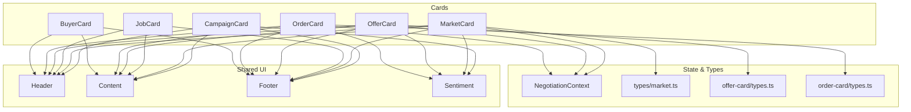
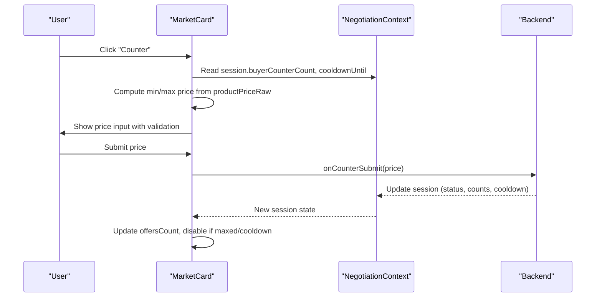
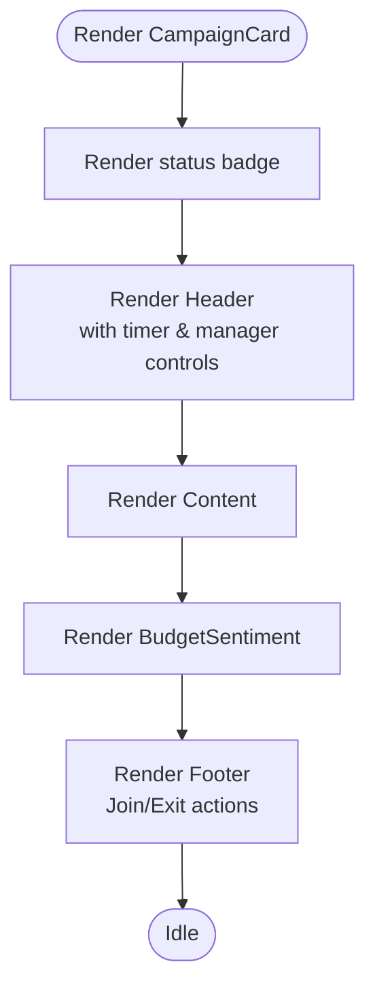
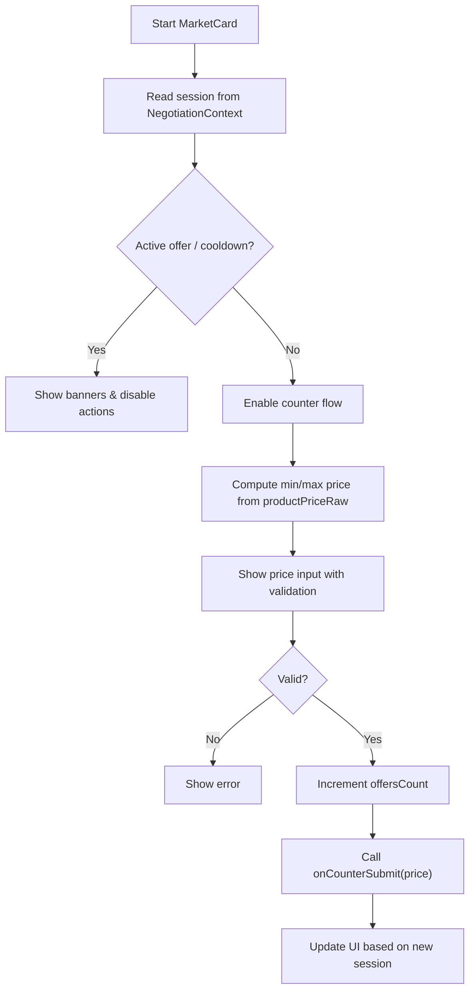
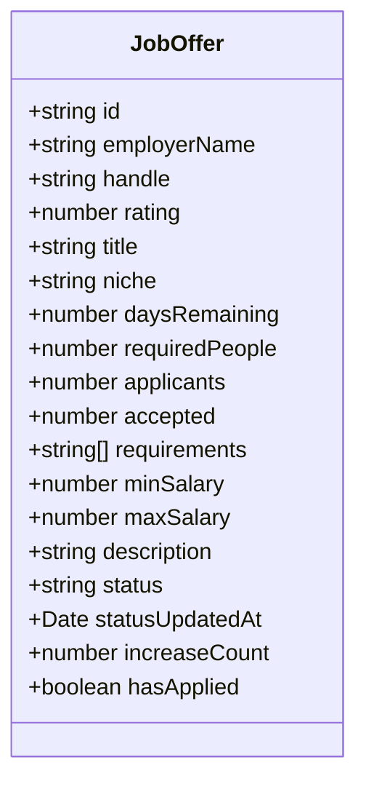
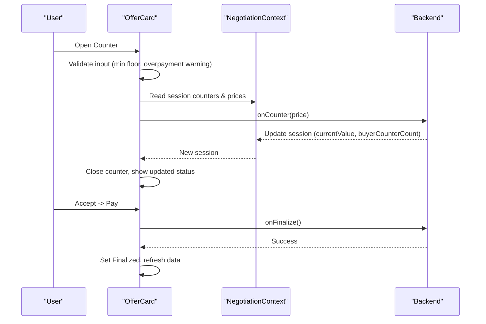
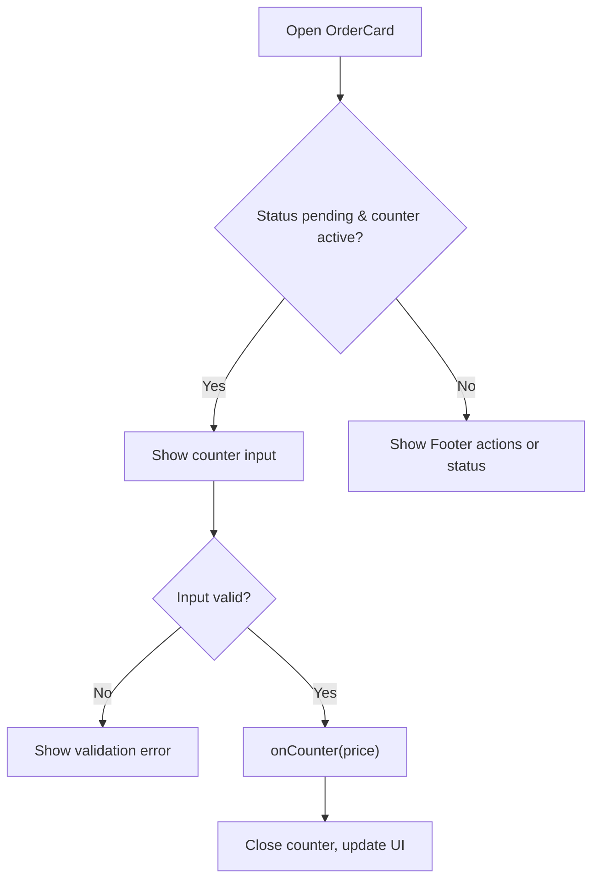
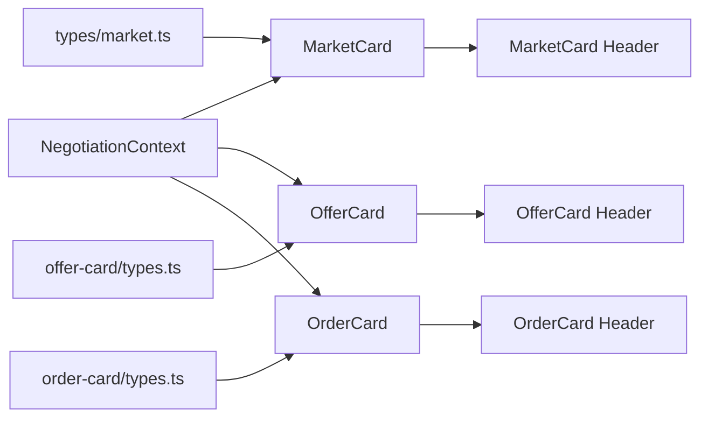

# Feature Card Components

<cite>
**Referenced Files in This Document**
- [src/components/campaign-card/index.tsx](file://src/components/campaign-card/index.tsx)
- [src/components/campaign-card/header.tsx](file://src/components/campaign-card/header.tsx)
- [src/components/market-card/index.tsx](file://src/components/market-card/index.tsx)
- [src/components/market-card/header.tsx](file://src/components/market-card/header.tsx)
- [src/components/job-card/index.tsx](file://src/components/job-card/index.tsx)
- [src/components/job-card/header.tsx](file://src/components/job-card/header.tsx)
- [src/components/job-card/data.ts](file://src/components/job-card/data.ts)
- [src/components/offer-card/index.tsx](file://src/components/offer-card/index.tsx)
- [src/components/offer-card/types.ts](file://src/components/offer-card/types.ts)
- [src/components/order-card/index.tsx](file://src/components/order-card/index.tsx)
- [src/components/order-card/types.ts](file://src/components/order-card/types.ts)
- [src/components/buyer-card/index.tsx](file://src/components/buyer-card/index.tsx)
- [src/types/market.ts](file://src/types/market.ts)
- [src/context/NegotiationContext.tsx](file://src/context/NegotiationContext.tsx)
</cite>

## Table of Contents
1. [Introduction](#introduction)
2. [Project Structure](#project-structure)
3. [Core Components](#core-components)
4. [Architecture Overview](#architecture-overview)
5. [Detailed Component Analysis](#detailed-component-analysis)
6. [Dependency Analysis](#dependency-analysis)
7. [Performance Considerations](#performance-considerations)
8. [Troubleshooting Guide](#troubleshooting-guide)
9. [Conclusion](#conclusion)

## Introduction
This document explains PortVille Market’s feature-specific card components: campaign, market, job, offer, order, and buyer cards. Each card displays domain-specific information using a consistent layout pattern with header, content, sentiment, and footer sections. The guide covers data structures, prop interfaces, visual presentation patterns, integration with business logic and state management (including negotiation sessions), user interactions, shared architecture patterns, sentiment indicators, responsive behavior, composition strategies, and customization options.

## Project Structure
The card components are organized by feature under src/components, each typically split into index.tsx plus subcomponents for header, content, footer, and sometimes sentiment or types. Shared types live in src/types and context/state is consumed via src/context.

**Diagram sources**
- [src/components/campaign-card/index.tsx](file://src/components/campaign-card/index.tsx)
- [src/components/market-card/index.tsx](file://src/components/market-card/index.tsx)
- [src/components/job-card/index.tsx](file://src/components/job-card/index.tsx)
- [src/components/offer-card/index.tsx](file://src/components/offer-card/index.tsx)
- [src/components/order-card/index.tsx](file://src/components/order-card/index.tsx)
- [src/components/buyer-card/index.tsx](file://src/components/buyer-card/index.tsx)
- [src/types/market.ts](file://src/types/market.ts)
- [src/components/offer-card/types.ts](file://src/components/offer-card/types.ts)
- [src/components/order-card/types.ts](file://src/components/order-card/types.ts)
- [src/context/NegotiationContext.tsx](file://src/context/NegotiationContext.tsx)

**Section sources**
- [src/components/campaign-card/index.tsx](file://src/components/campaign-card/index.tsx)
- [src/components/market-card/index.tsx](file://src/components/market-card/index.tsx)
- [src/components/job-card/index.tsx](file://src/components/job-card/index.tsx)
- [src/components/offer-card/index.tsx](file://src/components/offer-card/index.tsx)
- [src/components/order-card/index.tsx](file://src/components/order-card/index.tsx)
- [src/components/buyer-card/index.tsx](file://src/components/buyer-card/index.tsx)
- [src/types/market.ts](file://src/types/market.ts)
- [src/components/offer-card/types.ts](file://src/components/offer-card/types.ts)
- [src/components/order-card/types.ts](file://src/components/order-card/types.ts)
- [src/context/NegotiationContext.tsx](file://src/context/NegotiationContext.tsx)

## Core Components
- CampaignCard: Displays campaign metadata, status badge, budget sentiment, and join/exit controls. Integrates pause/delete actions in the header when appropriate.
- MarketCard: Shows seller info, product price, offers count, cooldowns, and counter flow with dynamic discount floors. Uses NegotiationContext to track session state and limits.
- JobCard: Presents employer details, rating, time left, salary range, requirements, and apply action.
- OfferCard: Full negotiation flow including counter form, payment panel, verification simulation, and finalization.
- OrderCard: Seller-side negotiation with counter input, validation against dynamic minimums, and accept/decline flows.
- BuyerCard: Profile-like card showing follower/like metrics, ratios, and value; primarily informational.

Common patterns:
- Header: Status badge, identity block, timers, and contextual badges.
- Content: Domain-specific details and metrics.
- Sentiment: Visual indicators for community or performance signals.
- Footer: Primary actions (join, buy, apply, accept/counter/decline).

**Section sources**
- [src/components/campaign-card/index.tsx](file://src/components/campaign-card/index.tsx)
- [src/components/market-card/index.tsx](file://src/components/market-card/index.tsx)
- [src/components/job-card/index.tsx](file://src/components/job-card/index.tsx)
- [src/components/offer-card/index.tsx](file://src/components/offer-card/index.tsx)
- [src/components/order-card/index.tsx](file://src/components/order-card/index.tsx)
- [src/components/buyer-card/index.tsx](file://src/components/buyer-card/index.tsx)

## Architecture Overview
All cards follow a consistent composition model:
- A container component renders Header, Content, optional Sentiment, and Footer.
- Business logic (timers, counters, validations) lives in the container or subcomponents.
- State can be local (useState) or global (NegotiationContext for negotiation-related cards).
- Timers update status visuals and enable/disable actions based on expiry or cooldowns.

**Diagram sources**
- [src/components/market-card/index.tsx](file://src/components/market-card/index.tsx)
- [src/context/NegotiationContext.tsx](file://src/context/NegotiationContext.tsx)

## Detailed Component Analysis

### CampaignCard
- Data structure: Expects a typed campaign object with fields such as id, status, project name, publisher info, ratings, and time remaining. See type import path.
- Props: data, onJoinCampaign, onExitCampaign, onPauseCampaign?, onDeleteCampaign?, isJoinDisabled?, joinDisabledLabel?
- Visual presentation:
  - Top status badge reflecting campaign status.
  - Header shows publisher avatar/name, rating, and countdown timer; manager controls (pause/resume, delete) appear conditionally.
  - Content section displays campaign details.
  - BudgetSentiment indicates budget health.
  - Footer provides Join/Exit actions and respects paused/disabled states.
- Interactions:
  - Join/Exit toggles hasJoined locally and calls handlers.
  - Pause/Resume and Delete handled via props passed to Header.
- Responsive behavior: Uses Tailwind classes for spacing, typography scaling, and truncation.

**Diagram sources**
- [src/components/campaign-card/index.tsx](file://src/components/campaign-card/index.tsx)
- [src/components/campaign-card/header.tsx](file://src/components/campaign-card/header.tsx)

**Section sources**
- [src/components/campaign-card/index.tsx](file://src/components/campaign-card/index.tsx)
- [src/components/campaign-card/header.tsx](file://src/components/campaign-card/header.tsx)

### MarketCard
- Data structure: MarketCardData includes seller identity, pricing, metrics (followers, views, ratios), sentiment rate, and offersCount.
- Props: cardData, hideFooter?, hideBorder?, onBuyClick?, onCounterSubmit?(price)
- Visual presentation:
  - Header shows seller info, stars, verified badge, live stock badge, and countdown timer; also shows offers count vs limit.
  - Optional active offer banner and cooldown indicator.
  - Content shows product details.
  - Sentiment shows costly votes.
  - Footer provides Buy and Counter actions with disabled states based on session and limits.
- Interactions:
  - Dynamic discount floor per counter attempt (40%, 30%, 15%).
  - Cooldown timer derived from session.cooldownUntil.
  - Max offers limit enforced (e.g., 12).
  - Price input validated against min/max; submission triggers onCounterSubmit.
- State management:
  - Reads current session from NegotiationContext by card id.
  - Updates local liveOffers and UI flags accordingly.

**Diagram sources**
- [src/components/market-card/index.tsx](file://src/components/market-card/index.tsx)
- [src/components/market-card/header.tsx](file://src/components/market-card/header.tsx)
- [src/types/market.ts](file://src/types/market.ts)
- [src/context/NegotiationContext.tsx](file://src/context/NegotiationContext.tsx)

**Section sources**
- [src/components/market-card/index.tsx](file://src/components/market-card/index.tsx)
- [src/components/market-card/header.tsx](file://src/components/market-card/header.tsx)
- [src/types/market.ts](file://src/types/market.ts)

### JobCard
- Data structure: Accepts a job object with employer info, rating, title, niche, daysRemaining, requiredPeople, applicants, accepted, requirements, salary range, description, and status. Mock data generator provided.
- Props: job, onApply?(job)
- Visual presentation:
  - Header shows employer initials, handle, rating, time left, and max salary formatting.
  - Content shows title, headcount, applicant stats, description, and requirements.
  - Footer shows status and Apply button.
- Interactions:
  - Apply triggers onApply(job).
  - Time decay filter available for demo data to remove stale jobs after thresholds.

**Diagram sources**
- [src/components/job-card/data.ts](file://src/components/job-card/data.ts)

**Section sources**
- [src/components/job-card/index.tsx](file://src/components/job-card/index.tsx)
- [src/components/job-card/header.tsx](file://src/components/job-card/header.tsx)
- [src/components/job-card/data.ts](file://src/components/job-card/data.ts)

### OfferCard
- Data structure: OfferCardData includes seller identity, pricing fields (productPrice, buyerOriginalOffer, sellerCounterOffer), counters, sentiment, and status.
- Props: data, session?, onRefreshData?, onAccept?, onCounter?(price), onDecline?, onCounterToggle?, onFinalize?, activeAction?
- Visual presentation:
  - Header shows status badge (Standard, Counter Offer, Pending, Finalized, Lapsed, Expired) and countdown timer.
  - Content shows offer details and negotiated prices.
  - Sentiment shows sentiment rate.
  - Footer provides Decline, Counter, Accept actions with disabled states based on session/status.
- Interactions:
  - Counter form validates minimum floor per attempt (40%, 30%, 15%) and warns about overpayment relative to target price.
  - Payment panel simulates verification with loading state and finalization.
  - Session-driven state overrides local state when provided.
- State management:
  - Uses NegotiationContext session to compute active prices and statuses.
  - Local states manage open panels, inputs, and temporary statuses during flows.

**Diagram sources**
- [src/components/offer-card/index.tsx](file://src/components/offer-card/index.tsx)
- [src/components/offer-card/types.ts](file://src/components/offer-card/types.ts)
- [src/context/NegotiationContext.tsx](file://src/context/NegotiationContext.tsx)

**Section sources**
- [src/components/offer-card/index.tsx](file://src/components/offer-card/index.tsx)
- [src/components/offer-card/types.ts](file://src/components/offer-card/types.ts)

### OrderCard
- Data structure: OrderCardData includes buyer identity, pricing fields, counters, sentiment, and order-specific fields like offeredPrice, originalPrice, orderDescription, createdAt, and status enum.
- Props: data, onAccept(price), onCounter(price), onDecline(), onCounterToggle(), activeAction?
- Visual presentation:
  - Header shows status badge and countdown timer.
  - Content shows order details and received date.
  - Footer shows accept/counter/decline actions or status message.
- Interactions:
  - Counter input validates against dynamic minimums based on sellerCounterCount (35%, 25%, 10% off).
  - Active counter panel appears only when pending and counter is active.
  - Inactive states disable interactions and show reason (passed/declined/timed-out).

**Diagram sources**
- [src/components/order-card/index.tsx](file://src/components/order-card/index.tsx)
- [src/components/order-card/types.ts](file://src/components/order-card/types.ts)

**Section sources**
- [src/components/order-card/index.tsx](file://src/components/order-card/index.tsx)
- [src/components/order-card/types.ts](file://src/components/order-card/types.ts)

### BuyerCard
- Data structure: BuyerCardData includes title, sellerName, handle, description, followers, likes, erCurrentRatio, vlCurrentRatio, and value.
- Props: data
- Visual presentation:
  - Compact profile-style card with metrics grid and call-to-action.
  - Uses formatted values for compact display.
- Interactions:
  - Primarily informational; “View details” button present.

**Section sources**
- [src/components/buyer-card/index.tsx](file://src/components/buyer-card/index.tsx)

## Dependency Analysis
- Context dependency:
  - MarketCard, OfferCard, and OrderCard consume NegotiationContext to read/update negotiation sessions, enabling synchronized UI across cards.
- Type dependencies:
  - MarketCard uses MarketCardData.
  - OfferCard uses OfferCardData.
  - OrderCard uses OrderCardData.
- Internal composition:
  - Each card composes Header, Content, Footer, and optionally Sentiment.
  - Timers and validations are localized within cards or headers.

**Diagram sources**
- [src/components/market-card/index.tsx](file://src/components/market-card/index.tsx)
- [src/components/offer-card/index.tsx](file://src/components/offer-card/index.tsx)
- [src/components/order-card/index.tsx](file://src/components/order-card/index.tsx)
- [src/types/market.ts](file://src/types/market.ts)
- [src/components/offer-card/types.ts](file://src/components/offer-card/types.ts)
- [src/components/order-card/types.ts](file://src/components/order-card/types.ts)
- [src/context/NegotiationContext.tsx](file://src/context/NegotiationContext.tsx)

**Section sources**
- [src/components/market-card/index.tsx](file://src/components/market-card/index.tsx)
- [src/components/offer-card/index.tsx](file://src/components/offer-card/index.tsx)
- [src/components/order-card/index.tsx](file://src/components/order-card/index.tsx)
- [src/types/market.ts](file://src/types/market.ts)
- [src/components/offer-card/types.ts](file://src/components/offer-card/types.ts)
- [src/components/order-card/types.ts](file://src/components/order-card/types.ts)
- [src/context/NegotiationContext.tsx](file://src/context/NegotiationContext.tsx)

## Performance Considerations
- Timers: Cards use setInterval for countdowns; ensure cleanup on unmount to avoid memory leaks.
- Validation: Real-time input validation prevents unnecessary re-renders by clearing errors promptly.
- Conditional rendering: Disabled states and inactive overlays reduce interaction overhead.
- Context usage: Reading session data from NegotiationContext minimizes redundant network calls; batch updates where possible.

[No sources needed since this section provides general guidance]

## Troubleshooting Guide
- Counter input invalid:
  - Ensure entered price meets minimum floor rules per attempt; check validation messages and adjust input.
- Cooldown active:
  - Check session.cooldownUntil; UI will show remaining seconds until counter can be used again.
- Max offers reached:
  - When offersCount reaches the limit (e.g., 12), counter actions are disabled; wait for expiration or resolution.
- Inactive sessions:
  - If session status is passed/declined/timed-out/finalized, cards become non-interactive; resolve via backend or refresh.
- Payment verification:
  - During verification, actions are disabled; wait for completion or dismiss to revert state.

**Section sources**
- [src/components/market-card/index.tsx](file://src/components/market-card/index.tsx)
- [src/components/offer-card/index.tsx](file://src/components/offer-card/index.tsx)
- [src/components/order-card/index.tsx](file://src/components/order-card/index.tsx)

## Conclusion
PortVille Market’s card components share a robust, composable architecture that standardizes how domain-specific information is presented and interacted with. By separating concerns into Header, Content, Sentiment, and Footer, and by leveraging shared state through NegotiationContext, the system maintains consistency while supporting complex workflows like negotiation, ordering, and campaign management. Timers, validations, and responsive design ensure clarity and usability across devices. Customization points include conditional visibility, disabled states, and extensible prop interfaces for different business contexts.