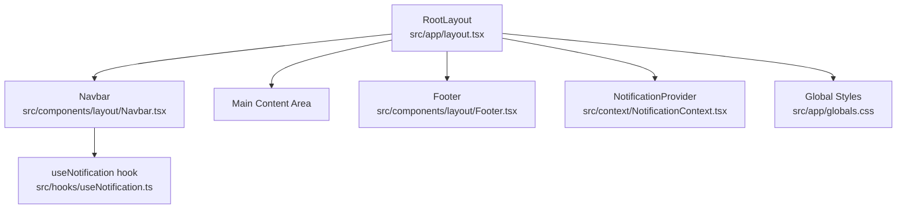
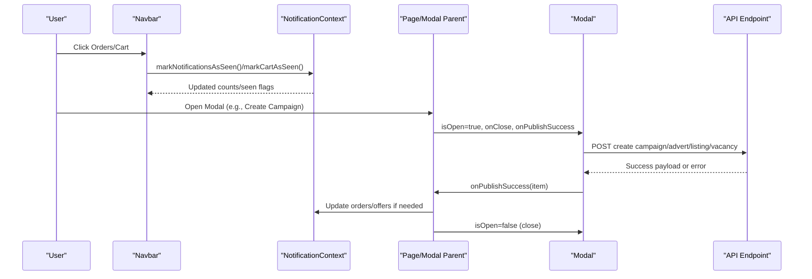
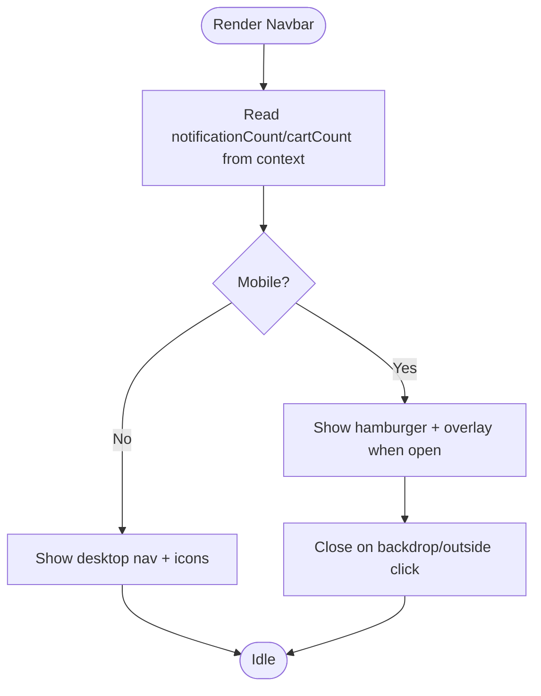
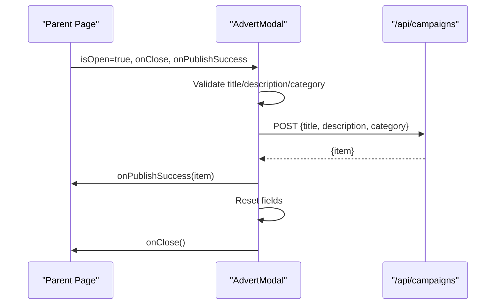
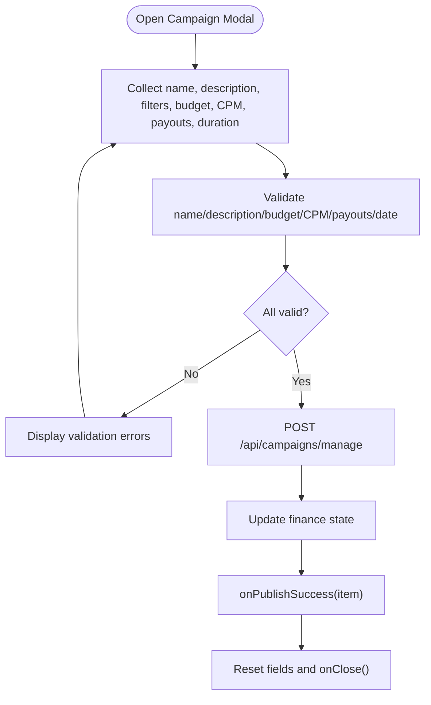
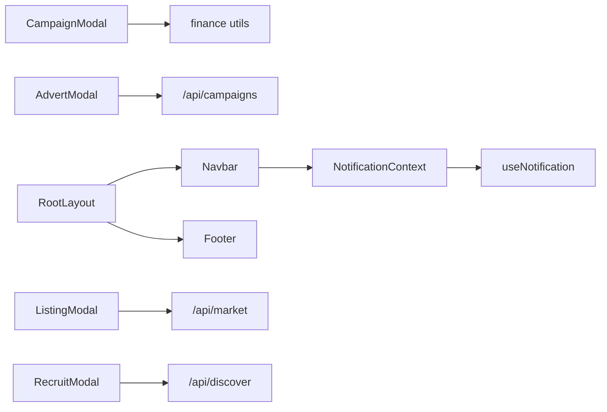

# Layout & Modal Components

<cite>
**Referenced Files in This Document**
- [layout.tsx](file://src/app/layout.tsx)
- [globals.css](file://src/app/globals.css)
- [Navbar.tsx](file://src/components/layout/Navbar.tsx)
- [Footer.tsx](file://src/components/layout/Footer.tsx)
- [grid.tsx](file://src/components/layout/grid.tsx)
- [advert-modal.tsx](file://src/components/layout/advert-modal.tsx)
- [campaign-modal.tsx](file://src/components/layout/campaign-modal.tsx)
- [listing-modal.tsx](file://src/components/layout/listing-modal.tsx)
- [recruit-modal.tsx](file://src/components/layout/recruit-modal.tsx)
- [NotificationContext.tsx](file://src/context/NotificationContext.tsx)
- [useNotification.ts](file://src/hooks/useNotification.ts)
</cite>

## Table of Contents
1. Introduction
2. Project Structure
3. Core Components
4. Architecture Overview
5. Detailed Component Analysis
6. Dependency Analysis
7. Performance Considerations
8. Troubleshooting Guide
9. Conclusion

## Introduction
This document provides comprehensive documentation for PortVille Market’s layout and modal components. It covers the navigation (Navbar, Footer), responsive grid system, and modal dialogs for advertisements, campaigns, listings, and recruitment. For each component, we describe structural responsibilities, prop interfaces, integration with routing and state management, modal lifecycle patterns, backdrop handling, keyboard navigation considerations, accessibility notes, responsive strategies, breakpoint usage, mobile-first design, performance considerations for complex layouts, and modal stacking behaviors.

## Project Structure
The application uses a Next.js app shell that wraps pages with global providers and persistent layout elements:
- Root layout composes Navbar at the top, main content area in the middle, and Footer at the bottom.
- Global styles define theme variables and custom animations.
- Notification context supplies badge counts and seen states used by the Navbar.

**Diagram sources**
- [layout.tsx:15-40](file://src/app/layout.tsx#L15-L40)
- [globals.css:3-20](file://src/app/globals.css#L3-L20)

**Section sources**
- [layout.tsx:15-40](file://src/app/layout.tsx#L15-L40)
- [globals.css:3-20](file://src/app/globals.css#L3-L20)

## Core Components
- Navbar: Persistent header with navigation links, notification and cart badges, and a mobile menu overlay. Integrates with NotificationContext to display live counts and mark items as seen.
- Footer: Responsive multi-column footer with platform links, legal info, contact details, and social links. Uses Tailwind responsive utilities for mobile-first layout.
- Grid: Reusable responsive grid container that adapts columns from 1 to 3 based on breakpoints and enforces uniform row heights.
- Modals: Four focused modals (Advert, Campaign, Listing, Recruit) share a consistent pattern: controlled visibility via props, form validation, API submission, success callbacks, and error handling.

Key responsibilities:
- Routing: Navbar uses Next.js Link for client-side navigation; modals do not navigate but trigger side effects via API calls.
- State management: Navbar consumes NotificationContext for badge counts and seen flags; modals manage local form state and call parent-provided callbacks to update lists or finance state.
- Accessibility: Buttons include aria-labels; mobile menu toggles use aria-expanded; focus management is minimal and can be enhanced.

**Section sources**
- [Navbar.tsx:16-169](file://src/components/layout/Navbar.tsx#L16-L169)
- [Footer.tsx:57-159](file://src/components/layout/Footer.tsx#L57-L159)
- [grid.tsx:8-20](file://src/components/layout/grid.tsx#L8-L20)
- [NotificationContext.tsx:22-136](file://src/context/NotificationContext.tsx#L22-L136)
- [useNotification.ts:5-7](file://src/hooks/useNotification.ts#L5-L7)

## Architecture Overview
The layout architecture centers around a root layout that injects global providers and persistent chrome. Modals are rendered conditionally by their parents and communicate back via callbacks. The Navbar integrates with a shared notification context to reflect real-time updates across the app.

**Diagram sources**
- [Navbar.tsx:35-41](file://src/components/layout/Navbar.tsx#L35-L41)
- [NotificationContext.tsx:87-116](file://src/context/NotificationContext.tsx#L87-L116)
- [campaign-modal.tsx:281-337](file://src/components/layout/campaign-modal.tsx#L281-L337)
- [advert-modal.tsx:28-59](file://src/components/layout/advert-modal.tsx#L28-L59)
- [listing-modal.tsx:90-118](file://src/components/layout/listing-modal.tsx#L90-L118)
- [recruit-modal.tsx:38-87](file://src/components/layout/recruit-modal.tsx#L38-L87)

## Detailed Component Analysis

### Navbar
Responsibilities:
- Provide primary navigation links and quick actions (Orders, Offers).
- Display dynamic badge counts for notifications and offers using NotificationContext.
- Offer a mobile menu with backdrop and close-on-outside-click behavior.

Prop interface: None (self-contained component).

Integration:
- Routing: Uses Next.js Link for internal routes.
- State: Consumes NotificationContext via useNotification hook to read counts and mark items as seen.

Accessibility:
- Buttons have aria-labels for screen readers.
- Mobile menu toggle uses aria-expanded to indicate state.
- Focus-visible outlines are present for keyboard navigation.

Responsive strategy:
- Desktop: Horizontal nav links and icon buttons.
- Mobile: Hamburger menu with dropdown overlay; labels hidden on small screens.

Performance:
- Lightweight state for menu open/close.
- Event listener for outside click is attached/detached in effect.

**Diagram sources**
- [Navbar.tsx:16-169](file://src/components/layout/Navbar.tsx#L16-L169)
- [NotificationContext.tsx:107-116](file://src/context/NotificationContext.tsx#L107-L116)

**Section sources**
- [Navbar.tsx:16-169](file://src/components/layout/Navbar.tsx#L16-L169)
- [useNotification.ts:5-7](file://src/hooks/useNotification.ts#L5-L7)
- [NotificationContext.tsx:22-136](file://src/context/NotificationContext.tsx#L22-L136)

### Footer
Responsibilities:
- Present company branding, platform links, legal links, contact information, and social media links.
- Maintain a responsive multi-column layout that stacks on mobile and expands on larger screens.

Prop interface: None (self-contained component).

Integration:
- Routing: Uses Next.js Link for internal and external URLs.

Accessibility:
- Semantic structure with headings and lists.
- Address element used for physical address.

Responsive strategy:
- Single column on mobile; two/three columns on tablet/desktop using Tailwind grid and flex utilities.

Performance:
- Static data arrays; no runtime state.

**Section sources**
- [Footer.tsx:3-159](file://src/components/layout/Footer.tsx#L3-L159)

### Grid
Responsibilities:
- Provide a reusable responsive grid container with consistent spacing and auto-sized rows.

Prop interface:
- children: React.ReactNode
- className?: string

Integration:
- Used by pages to render card grids responsively.

Responsive strategy:
- 1 column on small screens, 2 columns on sm+, 3 columns on md+ and xl+.
- Uses auto-rows-fr to align cards evenly.

Performance:
- Minimal overhead; pure presentational wrapper.

**Section sources**
- [grid.tsx:3-20](file://src/components/layout/grid.tsx#L3-L20)

### Advert Modal
Responsibilities:
- Collect advert title, description, and category.
- Validate inputs, submit to API, handle success/error, and notify parent via callback.

Prop interface:
- isOpen: boolean
- onClose: () => void
- onPublishSuccess?: (item: any) => void

Lifecycle:
- Controlled by parent via isOpen.
- On submit, posts to /api/campaigns, then calls onPublishSuccess with created item and resets fields.

Backdrop and keyboard:
- Backdrop renders behind modal; clicking backdrop does not close by default.
- Escape key support is not implemented; consider adding focus trap and ESC handling.

Accessibility:
- Close button has an X icon; ensure it has aria-label in production.
- Form fields lack explicit aria-describedby for errors; add for better feedback.

Integration:
- Posts to /api/campaigns and returns an item shape used by parent to update listings.

Performance:
- Local state for form fields; minimal re-renders.

**Diagram sources**
- [advert-modal.tsx:6-12](file://src/components/layout/advert-modal.tsx#L6-L12)
- [advert-modal.tsx:20-66](file://src/components/layout/advert-modal.tsx#L20-L66)

**Section sources**
- [advert-modal.tsx:6-131](file://src/components/layout/advert-modal.tsx#L6-L131)

### Campaign Modal
Responsibilities:
- Complex form to create campaigns with name, description, categories, niches, platforms, budget, CPM, payout ranges, duration, and optional future start date.
- Validates inputs against business rules and available budget, then submits to API and updates finance state.

Prop interface:
- isOpen: boolean
- onClose: () => void
- onPublishSuccess?: (item: any) => void

Lifecycle:
- Controlled by parent via isOpen.
- On submit, posts to /api/campaigns/manage, updates finance state via setFinanceState, then calls onPublishSuccess and resets fields.

Validation and rules:
- Name length and allowed characters.
- Description sanitization and link removal.
- Budget must be positive and within available balance after site charges.
- CPM constrained by budget tiers; min/max payout constrained by budget and CPM scale.
- Future start date must be valid and not earlier than tomorrow.

Backdrop and keyboard:
- Backdrop renders behind modal; clicking backdrop does not close by default.
- No ESC key handling; consider adding focus trap and ESC to close.

Accessibility:
- Error messages displayed inline; ensure associated inputs have aria-describedby.
- Inputs disable arrow keys to prevent native spinners; ensure keyboard usability remains intact.

Integration:
- Posts to /api/campaigns/manage and updates finance state; parent receives item via onPublishSuccess.

Performance:
- Extensive validation runs on input changes; consider memoizing derived values where appropriate.

**Diagram sources**
- [campaign-modal.tsx:68-221](file://src/components/layout/campaign-modal.tsx#L68-L221)
- [campaign-modal.tsx:281-337](file://src/components/layout/campaign-modal.tsx#L281-L337)

**Section sources**
- [campaign-modal.tsx:8-745](file://src/components/layout/campaign-modal.tsx#L8-L745)

### Listing Modal
Responsibilities:
- Publish a social account listing with profile URL, description, price, and niche tags.
- Validates required fields, posts to API, shows verified account metrics, and notifies parent.

Prop interface:
- isOpen: boolean
- onClose: () => void
- onPublishSuccess?: (item: any) => void

Lifecycle:
- Controlled by parent via isOpen.
- On submit, posts to /api/market, sets verified account data, calls onPublishSuccess, resets fields, and closes.

Backdrop and keyboard:
- Backdrop renders behind modal; clicking backdrop does not close by default.
- No ESC key handling; consider adding focus trap and ESC to close.

Accessibility:
- Inline error messages; ensure inputs have aria-describedby for errors.
- Niche tag input supports Enter/comma to add tags; ensure focus management when adding/removing tags.

Integration:
- Posts to /api/market and returns item shape used by parent to update listings.

Performance:
- Local state for form fields and niche tags; minimal re-renders.

**Section sources**
- [listing-modal.tsx:6-244](file://src/components/layout/listing-modal.tsx#L6-L244)

### Recruit Modal
Responsibilities:
- Create a job vacancy with title, employer name, description, skills, vacant slots, salary range, and time-to-hire selection.
- Validates required fields, posts to API, and notifies parent.

Prop interface:
- isOpen: boolean
- onClose: () => void
- onPublishSuccess?: (newJobData: any) => void

Lifecycle:
- Controlled by parent via isOpen.
- On submit, posts to /api/discover, maps response to item shape, calls onPublishSuccess, resets fields, and closes.

Backdrop and keyboard:
- Backdrop renders behind modal; clicking backdrop does not close by default.
- No ESC key handling; consider adding focus trap and ESC to close.

Accessibility:
- Inline alerts for missing fields; replace with accessible inline errors and aria-live regions.
- Skills chip list should maintain focus on add/remove actions.

Integration:
- Posts to /api/discover and returns item shape used by parent to update vacancies.

Performance:
- Local state for skills and numeric inputs; minimal re-renders.

**Section sources**
- [recruit-modal.tsx:6-310](file://src/components/layout/recruit-modal.tsx#L6-L310)

## Dependency Analysis
- Navbar depends on NotificationContext via useNotification hook to compute badge counts and mark items as seen.
- Modals depend on parent-provided callbacks to propagate success and closure events.
- Campaign modal additionally depends on finance utilities to update balances post-publish.
- Root layout composes providers and layout chrome, ensuring consistent experience across pages.

**Diagram sources**
- [Navbar.tsx:16-169](file://src/components/layout/Navbar.tsx#L16-L169)
- [NotificationContext.tsx:22-136](file://src/context/NotificationContext.tsx#L22-L136)
- [campaign-modal.tsx:281-337](file://src/components/layout/campaign-modal.tsx#L281-L337)
- [advert-modal.tsx:28-59](file://src/components/layout/advert-modal.tsx#L28-L59)
- [listing-modal.tsx:90-118](file://src/components/layout/listing-modal.tsx#L90-L118)
- [recruit-modal.tsx:38-87](file://src/components/layout/recruit-modal.tsx#L38-L87)
- [layout.tsx:15-40](file://src/app/layout.tsx#L15-L40)

**Section sources**
- [Navbar.tsx:16-169](file://src/components/layout/Navbar.tsx#L16-L169)
- [NotificationContext.tsx:22-136](file://src/context/NotificationContext.tsx#L22-L136)
- [campaign-modal.tsx:281-337](file://src/components/layout/campaign-modal.tsx#L281-L337)
- [advert-modal.tsx:28-59](file://src/components/layout/advert-modal.tsx#L28-L59)
- [listing-modal.tsx:90-118](file://src/components/layout/listing-modal.tsx#L90-L118)
- [recruit-modal.tsx:38-87](file://src/components/layout/recruit-modal.tsx#L38-L87)
- [layout.tsx:15-40](file://src/app/layout.tsx#L15-L40)

## Performance Considerations
- Modal rendering: All modals conditionally render only when isOpen is true, preventing unnecessary DOM overhead.
- Validation cost: Campaign modal performs extensive validation on each change; consider debouncing or memoizing derived values for large forms.
- API calls: Each modal posts to its respective endpoint; ensure proper loading states and error handling to avoid redundant requests.
- Context updates: NotificationContext persists orders/offers to localStorage; keep payloads minimal to reduce storage size and parse overhead.
- Backdrops: Modals use fixed overlays; avoid stacking multiple modals without z-index management to prevent visual conflicts.
- Keyboard interactions: Adding ESC-to-close and focus trapping will improve UX and accessibility without significant performance impact.

[No sources needed since this section provides general guidance]

## Troubleshooting Guide
Common issues and resolutions:
- Modal does not close on backdrop click: Implement backdrop click handler to call onClose in each modal.
- Missing ESC key support: Add keydown listener to close modal on Escape and move focus back to trigger element.
- Form validation errors not announced: Associate error messages with inputs using aria-describedby and use aria-live for dynamic messages.
- Badge counts not updating: Ensure NotificationContext state updates trigger re-renders and that parent pages update orders/offers accordingly.
- Campaign budget exceeds available balance: Verify finance state updates and publish fee calculations; check error messages for specific violations.

**Section sources**
- [advert-modal.tsx:20-66](file://src/components/layout/advert-modal.tsx#L20-L66)
- [campaign-modal.tsx:223-365](file://src/components/layout/campaign-modal.tsx#L223-L365)
- [listing-modal.tsx:70-121](file://src/components/layout/listing-modal.tsx#L70-L121)
- [recruit-modal.tsx:28-87](file://src/components/layout/recruit-modal.tsx#L28-L87)
- [NotificationContext.tsx:87-116](file://src/context/NotificationContext.tsx#L87-L116)

## Conclusion
PortVille Market’s layout and modal components provide a cohesive, responsive foundation for navigation, content presentation, and user-driven creation flows. The Navbar and Footer establish consistent chrome with mobile-first responsiveness, while the Grid enables scalable card layouts. Modals follow a consistent pattern of controlled visibility, robust validation, API integration, and parent communication via callbacks. To enhance accessibility and UX, consider implementing ESC-to-close, focus trapping, and improved error announcements. With careful attention to performance and stacking behaviors, these components deliver a reliable and user-friendly experience across devices.

[No sources needed since this section summarizes without analyzing specific files]