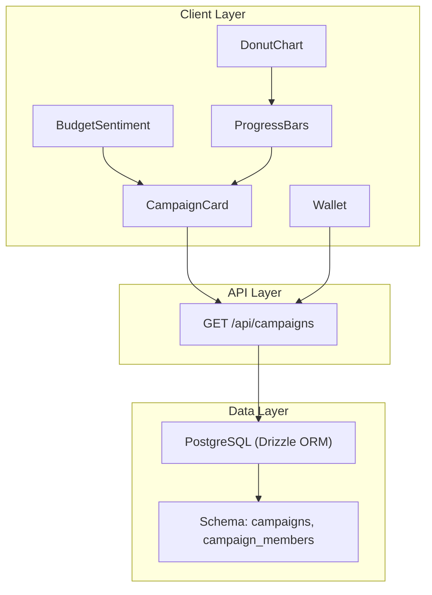
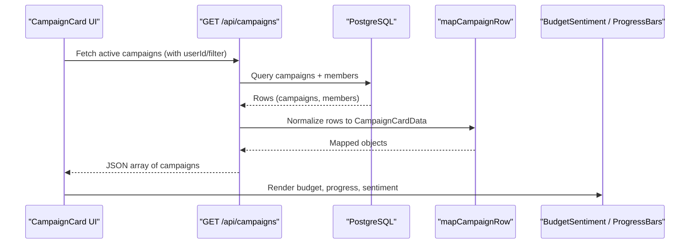
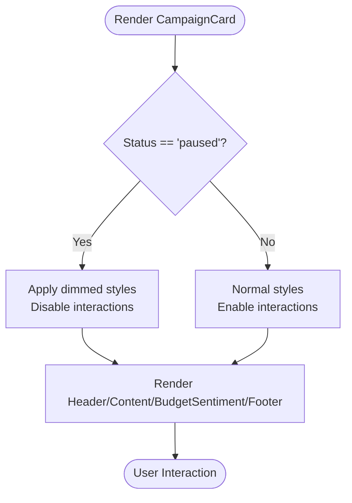
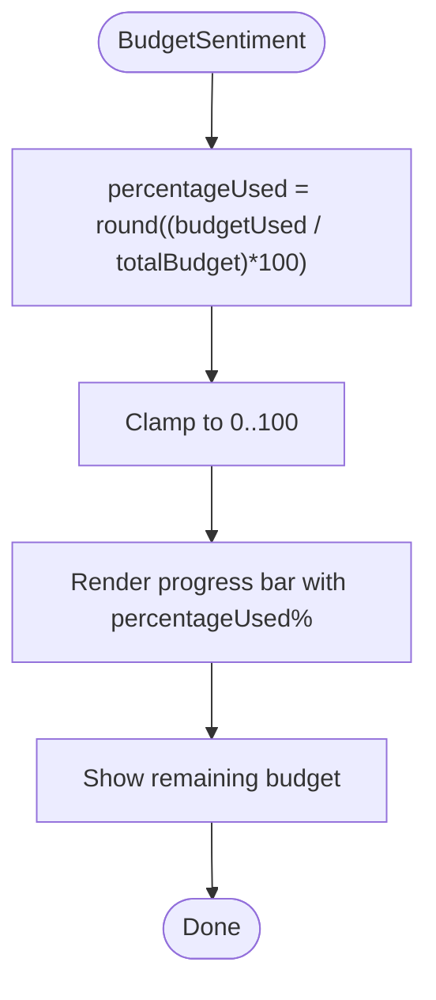
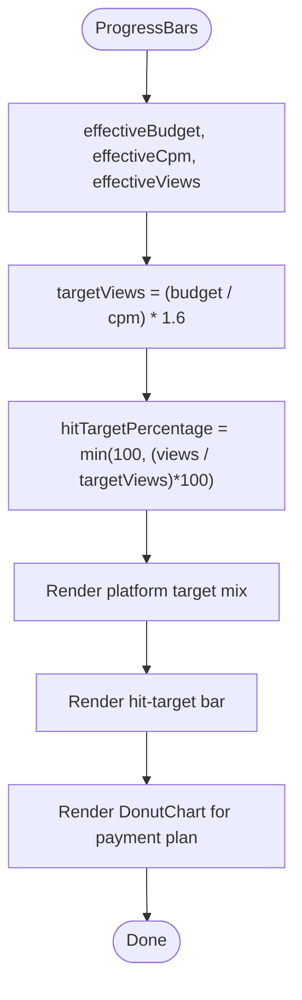
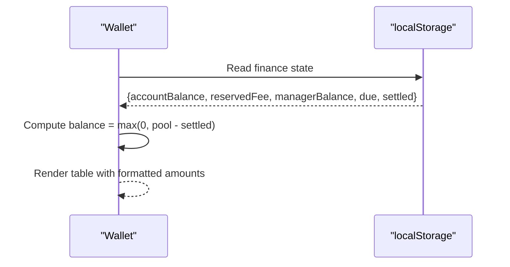
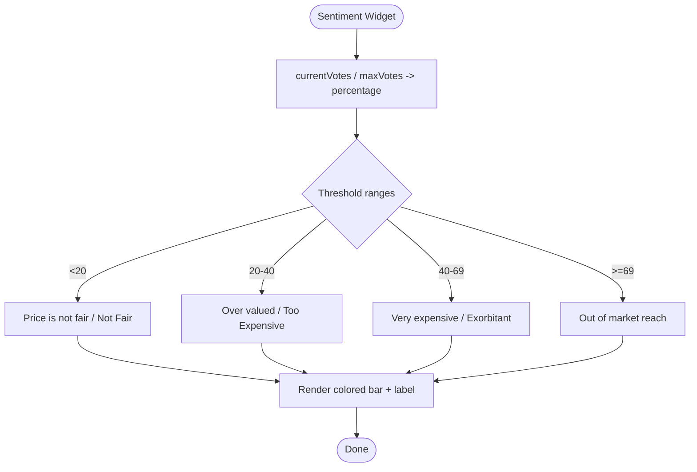
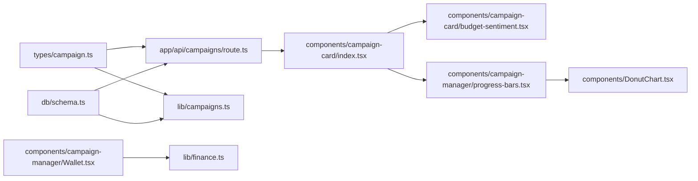

# Campaign Analytics & Metrics

<cite>
**Referenced Files in This Document**
- [campaigns.ts](file://src/lib/campaigns.ts)
- [route.ts](file://src/app/api/campaigns/route.ts)
- [schema.ts](file://src/db/schema.ts)
- [campaign.ts](file://src/types/campaign.ts)
- [index.tsx](file://src/components/campaign-card/index.tsx)
- [budget-sentiment.tsx](file://src/components/campaign-card/budget-sentiment.tsx)
- [progress-bars.tsx](file://src/components/campaign-manager/progress-bars.tsx)
- [Wallet.tsx](file://src/components/campaign-manager/Wallet.tsx)
- [finance.ts](file://src/lib/finance.ts)
- [sentiment.tsx (market)](file://src/components/market-card/sentiment.tsx)
- [sentiment.tsx (offer)](file://src/components/offer-card/sentiment.tsx)
- [sentiment.tsx (order)](file://src/components/order-card/sentiment.tsx)
- [DonutChart.tsx](file://src/components/DonutChart.tsx)
</cite>

## Table of Contents
1. Introduction
2. Project Structure
3. Core Components
4. Architecture Overview
5. Detailed Component Analysis
6. Dependency Analysis
7. Performance Considerations
8. Troubleshooting Guide
9. Conclusion

## Introduction
This document explains how campaign analytics and metrics are implemented across the application. It covers key performance indicators such as community size, views generated, likes generated, budget utilization, and MCP (Minimum Cost Per Click). It also details how campaign cards display real-time metrics and progress indicators, wallet integration for budget tracking and payment processing, sentiment analysis features, metric calculation examples, data visualization components, and strategies for aggregating large-scale analytics with caching.

## Project Structure
The campaign analytics feature spans several layers:
- Data model and persistence: database schema defines campaign metrics and relationships.
- API layer: server routes fetch campaigns, filter by user context, and return normalized metrics.
- Client components: campaign card, budget sentiment, progress bars, wallet, and charts visualize metrics.
- Utilities: finance state management and currency formatting support budget displays.

**Diagram sources**
- [schema.ts:3-35](file://src/db/schema.ts#L3-L35)
- [route.ts:46-98](file://src/app/api/campaigns/route.ts#L46-L98)
- [index.tsx:20-71](file://src/components/campaign-card/index.tsx#L20-L71)
- [budget-sentiment.tsx:8-42](file://src/components/campaign-card/budget-sentiment.tsx#L8-L42)
- [progress-bars.tsx:68-150](file://src/components/campaign-manager/progress-bars.tsx#L68-L150)
- [Wallet.tsx:13-56](file://src/components/campaign-manager/Wallet.tsx#L13-L56)
- [DonutChart.tsx:22-164](file://src/components/DonutChart.tsx#L22-L164)

**Section sources**
- [schema.ts:3-35](file://src/db/schema.ts#L3-L35)
- [route.ts:46-98](file://src/app/api/campaigns/route.ts#L46-L98)
- [index.tsx:20-71](file://src/components/campaign-card/index.tsx#L20-L71)

## Core Components
- CampaignCard: Displays campaign status, header, content, budget sentiment, and footer actions. It reflects paused state and join/exit interactions.
- BudgetSentiment: Shows budget used vs remaining with a percentage bar.
- ProgressBars: Visualizes target mix across platforms, hit-target progress, and payment plan via DonutChart.
- Wallet: Summarizes pool, settled, debt, and balance for campaign finances.
- Sentiment widgets: Provide qualitative insights based on thresholds (e.g., costly votes or sentiment rate).
- DonutChart: Renders segmented financial breakdowns with center values.

Key KPIs surfaced:
- Community size: from campaign data to indicate potential reach.
- Views generated: cumulative engagement metric.
- Likes generated: secondary engagement indicator.
- Budget utilization: budgetUsed / totalBudget percentage.
- MCP (highestMcp): stored per campaign; used to derive cost efficiency signals.

**Section sources**
- [index.tsx:20-71](file://src/components/campaign-card/index.tsx#L20-L71)
- [budget-sentiment.tsx:8-42](file://src/components/campaign-card/budget-sentiment.tsx#L8-L42)
- [progress-bars.tsx:68-150](file://src/components/campaign-manager/progress-bars.tsx#L68-L150)
- [Wallet.tsx:13-56](file://src/components/campaign-manager/Wallet.tsx#L13-L56)
- [sentiment.tsx (market):10-63](file://src/components/market-card/sentiment.tsx#L10-L63)
- [sentiment.tsx (offer):10-66](file://src/components/offer-card/sentiment.tsx#L10-L66)
- [sentiment.tsx (order):10-61](file://src/components/order-card/sentiment.tsx#L10-L61)
- [DonutChart.tsx:22-164](file://src/components/DonutChart.tsx#L22-L164)

## Architecture Overview
End-to-end flow for loading and displaying campaign analytics:

**Diagram sources**
- [route.ts:46-98](file://src/app/api/campaigns/route.ts#L46-L98)
- [campaigns.ts:7-46](file://src/lib/campaigns.ts#L7-L46)
- [index.tsx:20-71](file://src/components/campaign-card/index.tsx#L20-L71)
- [budget-sentiment.tsx:8-42](file://src/components/campaign-card/budget-sentiment.tsx#L8-L42)
- [progress-bars.tsx:68-150](file://src/components/campaign-manager/progress-bars.tsx#L68-L150)

## Detailed Component Analysis

### Campaign Card and Real-Time Metrics
- Status handling: Paused campaigns are visually dimmed and disabled for interaction.
- Join/Exit: Updates local state and triggers callbacks to reflect membership changes.
- Metrics rendering: Header/content pass through core metrics; footer handles actions.

**Diagram sources**
- [index.tsx:41-69](file://src/components/campaign-card/index.tsx#L41-L69)

**Section sources**
- [index.tsx:20-71](file://src/components/campaign-card/index.tsx#L20-L71)

### Budget Utilization and MCP Display
- BudgetSentiment computes percentage used and remaining budget, showing a progress bar.
- MCP is exposed via highestMcp in campaign data; while not directly visualized in this component, it informs cost-efficiency decisions elsewhere.

**Diagram sources**
- [budget-sentiment.tsx:8-42](file://src/components/campaign-card/budget-sentiment.tsx#L8-L42)

**Section sources**
- [budget-sentiment.tsx:8-42](file://src/components/campaign-card/budget-sentiment.tsx#L8-L42)
- [campaign.ts:1-33](file://src/types/campaign.ts#L1-L33)

### Progress Indicators and Target Mix
- ProgressBars calculates target views from budget and CPM/MCP, then shows platform mix and hit-target percentage.
- Uses DonutChart to visualize payment plan segments.

**Diagram sources**
- [progress-bars.tsx:68-150](file://src/components/campaign-manager/progress-bars.tsx#L68-L150)
- [DonutChart.tsx:22-164](file://src/components/DonutChart.tsx#L22-L164)

**Section sources**
- [progress-bars.tsx:68-150](file://src/components/campaign-manager/progress-bars.tsx#L68-L150)
- [DonutChart.tsx:22-164](file://src/components/DonutChart.tsx#L22-L164)

### Wallet Integration for Budget Tracking
- Wallet summarizes pool, settled, debt, and computed balance (pool - settled).
- Finance state persists in localStorage with normalization and event dispatching for reactivity.

**Diagram sources**
- [Wallet.tsx:13-56](file://src/components/campaign-manager/Wallet.tsx#L13-L56)
- [finance.ts:19-49](file://src/lib/finance.ts#L19-L49)

**Section sources**
- [Wallet.tsx:13-56](file://src/components/campaign-manager/Wallet.tsx#L13-L56)
- [finance.ts:1-50](file://src/lib/finance.ts#L1-50)

### Sentiment Analysis Features
- Market/Offer/Order sentiment widgets map numeric rates to qualitative labels using threshold logic and render progress bars with color-coded feedback.
- These provide quick insights into pricing fit and market alignment.

**Diagram sources**
- [sentiment.tsx (market):10-63](file://src/components/market-card/sentiment.tsx#L10-L63)
- [sentiment.tsx (offer):10-66](file://src/components/offer-card/sentiment.tsx#L10-L66)
- [sentiment.tsx (order):10-61](file://src/components/order-card/sentiment.tsx#L10-L61)

**Section sources**
- [sentiment.tsx (market):10-63](file://src/components/market-card/sentiment.tsx#L10-L63)
- [sentiment.tsx (offer):10-66](file://src/components/offer-card/sentiment.tsx#L10-L66)
- [sentiment.tsx (order):10-61](file://src/components/order-card/sentiment.tsx#L10-L61)

### Data Aggregation and Caching Strategies
- Server-side aggregation: The API queries active campaigns and filters by user context, returning normalized records. For joined campaigns, an additional query resolves membership sets.
- Client-side caching: CampaignCard maintains local state for join/exit toggles to avoid unnecessary network calls during quick interactions.
- Recommendations for scale:
  - Add server-side pagination and filtering beyond current limits.
  - Introduce Redis or in-memory cache keyed by userId and filter parameters.
  - Use ETags or Last-Modified headers for conditional requests.
  - Debounce rapid UI updates and batch writes for member joins/exits.

**Section sources**
- [route.ts:46-98](file://src/app/api/campaigns/route.ts#L46-L98)
- [campaigns.ts:34-46](file://src/lib/campaigns.ts#L34-L46)
- [index.tsx:29-39](file://src/components/campaign-card/index.tsx#L29-L39)

## Dependency Analysis
Core dependencies between modules:

**Diagram sources**
- [campaign.ts:1-33](file://src/types/campaign.ts#L1-L33)
- [route.ts:46-98](file://src/app/api/campaigns/route.ts#L46-L98)
- [campaigns.ts:7-46](file://src/lib/campaigns.ts#L7-L46)
- [schema.ts:3-35](file://src/db/schema.ts#L3-L35)
- [index.tsx:20-71](file://src/components/campaign-card/index.tsx#L20-L71)
- [budget-sentiment.tsx:8-42](file://src/components/campaign-card/budget-sentiment.tsx#L8-L42)
- [progress-bars.tsx:68-150](file://src/components/campaign-manager/progress-bars.tsx#L68-L150)
- [DonutChart.tsx:22-164](file://src/components/DonutChart.tsx#L22-L164)
- [Wallet.tsx:13-56](file://src/components/campaign-manager/Wallet.tsx#L13-L56)
- [finance.ts:1-50](file://src/lib/finance.ts#L1-50)

**Section sources**
- [route.ts:46-98](file://src/app/api/campaigns/route.ts#L46-L98)
- [campaigns.ts:7-46](file://src/lib/campaigns.ts#L7-L46)
- [schema.ts:3-35](file://src/db/schema.ts#L3-L35)
- [index.tsx:20-71](file://src/components/campaign-card/index.tsx#L20-L71)

## Performance Considerations
- Database queries: Current limit and ordering are appropriate for small datasets; consider indexing createdAt and status for faster retrieval.
- Client state: Local toggling of join/exit reduces redundant requests; ensure eventual consistency with server state.
- Visualization: DonutChart and progress bars compute percentages client-side; keep segment counts low to avoid heavy SVG recalculations.
- Caching: Implement server-side caching for frequent GET endpoints and leverage browser caching headers.
- Formatting: Use compact currency formatting to reduce layout thrash when rendering large numbers.

[No sources needed since this section provides general guidance]

## Troubleshooting Guide
- Empty campaign list: Verify database schema initialization and ensure at least one active campaign exists.
- Incorrect membership state: Confirm that userId is passed correctly and campaignMembers table contains valid entries.
- Budget bar stuck at 0%: Ensure totalBudget > 0 before computing percentage; guard against division by zero.
- Wallet balance negative: Balance is clamped to non-negative; verify pool and settled inputs.
- Sentiment labels not updating: Check that sentimentRate or costlyVotes are within expected ranges and maxVotes > 0.

**Section sources**
- [route.ts:94-98](file://src/app/api/campaigns/route.ts#L94-L98)
- [budget-sentiment.tsx:8-42](file://src/components/campaign-card/budget-sentiment.tsx#L8-L42)
- [Wallet.tsx:13-56](file://src/components/campaign-manager/Wallet.tsx#L13-L56)
- [sentiment.tsx (market):10-63](file://src/components/market-card/sentiment.tsx#L10-L63)
- [sentiment.tsx (offer):10-66](file://src/components/offer-card/sentiment.tsx#L10-L66)
- [sentiment.tsx (order):10-61](file://src/components/order-card/sentiment.tsx#L10-L61)

## Conclusion
The campaign analytics system integrates database-backed metrics with rich client-side visualizations. Key KPIs like community size, views, likes, budget utilization, and MCP are consistently modeled and displayed. Wallet and finance utilities enable transparent budget tracking, while sentiment widgets offer actionable insights. With targeted caching and query optimizations, the system can scale to larger datasets while maintaining responsive dashboards.

[No sources needed since this section summarizes without analyzing specific files]