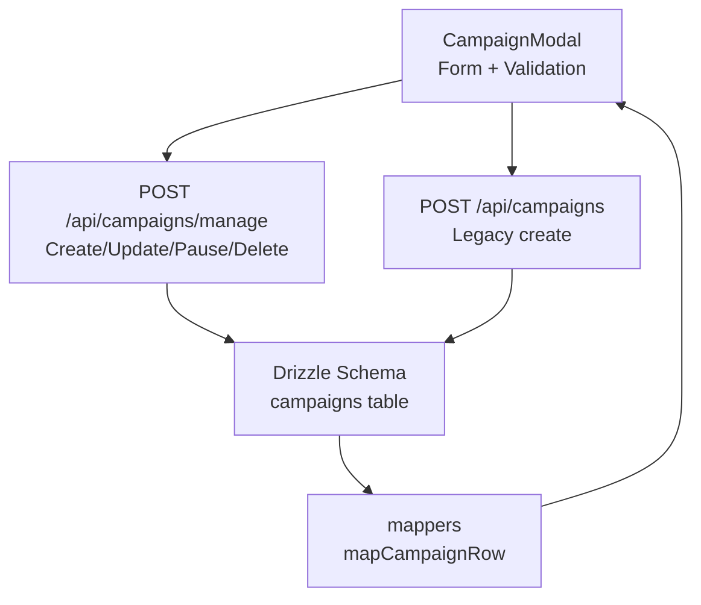
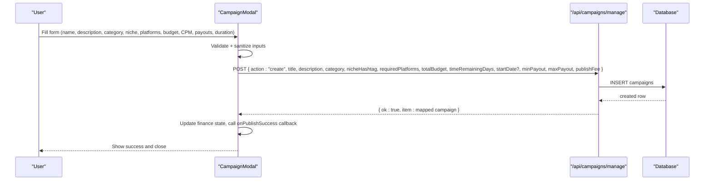
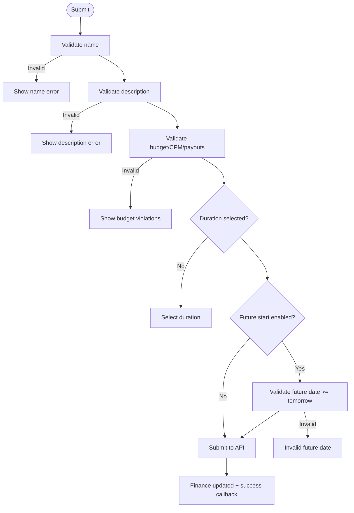
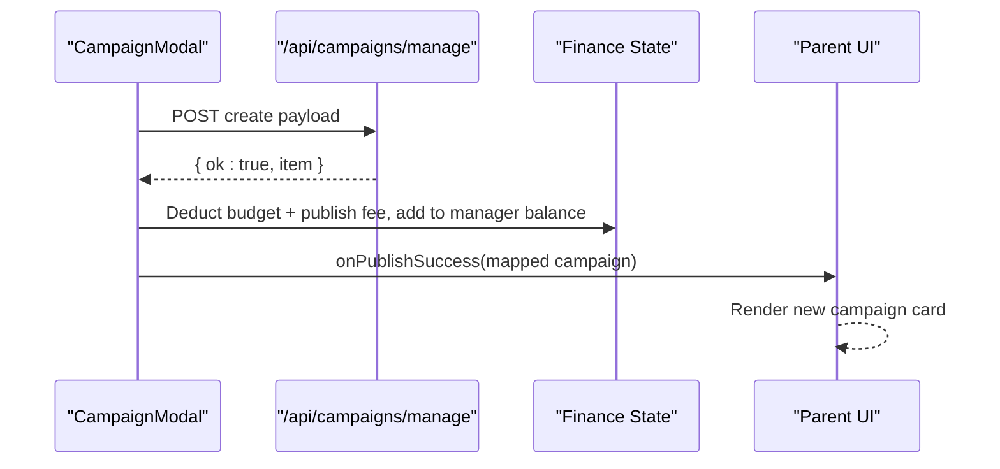
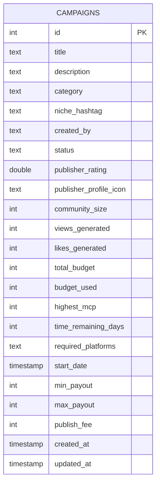
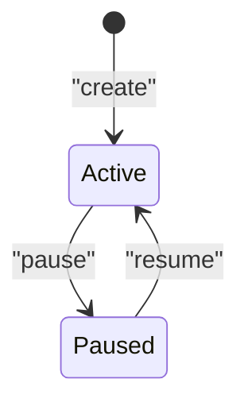
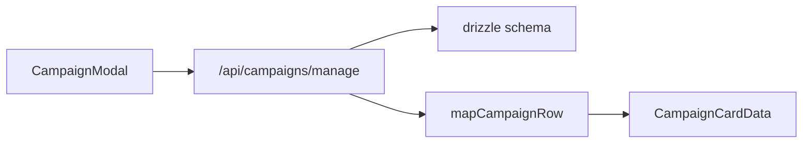

# Campaign Creation & Configuration

<cite>
**Referenced Files in This Document**
- [campaign-modal.tsx](file://src/components/layout/campaign-modal.tsx)
- [route.ts (manage)](file://src/app/api/campaigns/manage/route.ts)
- [route.ts (public)](file://src/app/api/campaigns/route.ts)
- [schema.ts](file://src/db/schema.ts)
- [campaign.ts (types)](file://src/types/campaign.ts)
- [campaigns.ts (lib)](file://src/lib/campaigns.ts)
- [mockCampaigns.ts](file://src/lib/mockCampaigns.ts)
- [page.tsx (campaign page)](file://src/app/campaign/page.tsx)
</cite>

## Table of Contents
1. [Introduction](#introduction)
2. [Project Structure](#project-structure)
3. [Core Components](#core-components)
4. [Architecture Overview](#architecture-overview)
5. [Detailed Component Analysis](#detailed-component-analysis)
6. [Dependency Analysis](#dependency-analysis)
7. [Performance Considerations](#performance-considerations)
8. [Troubleshooting Guide](#troubleshooting-guide)
9. [Conclusion](#conclusion)
10. [Appendices](#appendices)

## Introduction
This document explains the campaign creation and configuration system, focusing on the modal interface, form validation, data submission workflow, data model fields, lifecycle transitions, and API integration points. It also covers error handling patterns, success callbacks, and how social platform requirements are captured during campaign creation.

## Project Structure
The campaign creation flow spans a client-side modal, server-side APIs, and a database schema:
- Client UI: Campaign creation modal with validation and submission
- Server APIs: Public and management endpoints for creating and managing campaigns
- Database: Drizzle ORM schema defining campaign fields and relationships
- Types and mappers: Shared types and mapping functions to normalize data between layers

**Diagram sources**
- [campaign-modal.tsx:281-337](file://src/components/layout/campaign-modal.tsx#L281-L337)
- [route.ts (manage):55-108](file://src/app/api/campaigns/manage/route.ts#L55-L108)
- [route.ts (public):100-141](file://src/app/api/campaigns/route.ts#L100-L141)
- [schema.ts:3-27](file://src/db/schema.ts#L3-L27)

**Section sources**
- [campaign-modal.tsx:1-745](file://src/components/layout/campaign-modal.tsx#L1-L745)
- [route.ts (manage):1-179](file://src/app/api/campaigns/manage/route.ts#L1-L179)
- [route.ts (public):1-142](file://src/app/api/campaigns/route.ts#L1-L142)
- [schema.ts:1-84](file://src/db/schema.ts#L1-L84)

## Core Components
- CampaignModal: Client-side form with real-time validation, budget rules, CPM range enforcement, payout constraints, future start date support, and publishing fee calculation. Submits via POST to the management API and updates local finance state on success.
- Management API (/api/campaigns/manage): Accepts actions like create, update, pause, resume, delete. Validates inputs, persists to the database, and returns normalized campaign objects.
- Public API (/api/campaigns): Legacy endpoint for listing and creating campaigns; used by some flows but not the primary creation path.
- Data Model: CampaignCardData type and Drizzle schema define the canonical fields for campaigns, including projectName/title, description, category, nicheHashtag, totalBudget, timeRemainingDays, publisher info, requiredPlatforms, startDate, min/max payouts, and publishFee.

Key responsibilities:
- Form validation and sanitization in the modal
- Business rule enforcement for budgets, CPM ranges, and payouts
- Secure persistence via management API
- Consistent data mapping across client/server

**Section sources**
- [campaign-modal.tsx:68-221](file://src/components/layout/campaign-modal.tsx#L68-L221)
- [campaign-modal.tsx:281-337](file://src/components/layout/campaign-modal.tsx#L281-L337)
- [route.ts (manage):55-108](file://src/app/api/campaigns/manage/route.ts#L55-L108)
- [campaign.ts:1-33](file://src/types/campaign.ts#L1-L33)
- [schema.ts:3-27](file://src/db/schema.ts#L3-L27)

## Architecture Overview
End-to-end creation flow from UI to database:

**Diagram sources**
- [campaign-modal.tsx:281-337](file://src/components/layout/campaign-modal.tsx#L281-L337)
- [route.ts (manage):55-108](file://src/app/api/campaigns/manage/route.ts#L55-L108)
- [schema.ts:3-27](file://src/db/schema.ts#L3-L27)

## Detailed Component Analysis

### Campaign Modal Interface and Validation
- Fields captured:
  - projectName (title), description, category, nicheHashtag
  - selectedPlatforms (requiredPlatforms), up to 3
  - totalBudget, CPM input, minPayout, maxPayout
  - timeRemainingDays selection (duration), optional future start date
  - publishFee computed based on duration
- Validation highlights:
  - Name: non-empty, length limit, no leading/trailing spaces or periods, no emojis, allowed characters only
  - Description: non-empty, length limit, no links, allowed characters only, no repeated punctuation
  - Budget/CPM/Payouts: positive values, within derived ranges based on budget and CPM scale, cannot exceed available balance after site charges
  - Future start date: must be tomorrow or later when enabled
  - Duration: required to compute publish fee and enable publishing
- Sanitization:
  - Inputs sanitized on paste and change to prevent invalid characters and enforce limits
- Publishing readiness:
  - Enabled only when all validations pass, including budget/payout rules and duration selection

**Diagram sources**
- [campaign-modal.tsx:68-221](file://src/components/layout/campaign-modal.tsx#L68-L221)
- [campaign-modal.tsx:223-337](file://src/components/layout/campaign-modal.tsx#L223-L337)

**Section sources**
- [campaign-modal.tsx:68-221](file://src/components/layout/campaign-modal.tsx#L68-L221)
- [campaign-modal.tsx:223-337](file://src/components/layout/campaign-modal.tsx#L223-L337)

### Data Submission Workflow
- The modal posts to /api/campaigns/manage with action=create and a payload containing:
  - title, description, category, nicheHashtag, requiredPlatforms, totalBudget, timeRemainingDays, startDate (optional), minPayout, maxPayout, publishFee
- On success:
  - Finance state is updated to deduct budget and publish fee from account balance and allocate budget to manager balance
  - A success callback is invoked with a mapped campaign object suitable for UI rendering
- Errors:
  - If API response is not OK, an error message is shown to the user

**Diagram sources**
- [campaign-modal.tsx:281-337](file://src/components/layout/campaign-modal.tsx#L281-L337)
- [route.ts (manage):55-108](file://src/app/api/campaigns/manage/route.ts#L55-L108)

**Section sources**
- [campaign-modal.tsx:281-337](file://src/components/layout/campaign-modal.tsx#L281-L337)
- [route.ts (manage):55-108](file://src/app/api/campaigns/manage/route.ts#L55-L108)

### Campaign Data Model
- Core fields stored in the database and exposed via types:
  - id, title (mapped to projectName), description, category, nicheHashtag
  - createdBy (publisherUsername), status, publisherRating, publisherProfileIcon
  - communitySize, viewsGenerated, likesGenerated, totalBudget, budgetUsed, highestMcp
  - timeRemainingDays, requiredPlatforms (comma-separated list parsed to array), startDate
  - minPayout, maxPayout, publishFee, createdAt, updatedAt
- Mapping functions ensure consistent field names between DB rows and UI models.

**Diagram sources**
- [schema.ts:3-27](file://src/db/schema.ts#L3-L27)

**Section sources**
- [campaign.ts:1-33](file://src/types/campaign.ts#L1-L33)
- [schema.ts:3-27](file://src/db/schema.ts#L3-L27)
- [campaigns.ts:7-32](file://src/lib/campaigns.ts#L7-L32)
- [route.ts (manage):29-53](file://src/app/api/campaigns/manage/route.ts#L29-L53)

### Campaign Lifecycle and Business Rules
- Statuses:
  - active: default on creation
  - paused: toggled via management API or secure endpoint
- Creation:
  - New campaigns are inserted with status=active and default metrics
- Updates:
  - Only the creator can update, pause/resume, or delete a campaign
- Filtering:
  - Public GET lists active campaigns by default; supports filters for created/joined

**Diagram sources**
- [route.ts (manage):119-162](file://src/app/api/campaigns/manage/route.ts#L119-L162)
- [route.ts (public):46-98](file://src/app/api/campaigns/route.ts#L46-L98)

**Section sources**
- [route.ts (manage):119-162](file://src/app/api/campaigns/manage/route.ts#L119-L162)
- [route.ts (public):46-98](file://src/app/api/campaigns/route.ts#L46-L98)

### Social Account Connectivity Requirements
- Platform requirements:
  - The modal allows selecting up to three required platforms (e.g., facebook, tiktok, youtube, instagram, snapchat)
  - These are persisted as requiredPlatforms and later parsed into arrays for display and filtering
- Note:
  - No explicit social account connectivity validation is enforced at creation time beyond platform selection
  - Additional account verification may be handled elsewhere in the system

**Section sources**
- [campaign-modal.tsx:17-27](file://src/components/layout/campaign-modal.tsx#L17-L27)
- [campaign-modal.tsx:400-443](file://src/components/layout/campaign-modal.tsx#L400-L443)
- [route.ts (manage):75-76](file://src/app/api/campaigns/manage/route.ts#L75-L76)
- [schema.ts:20-20](file://src/db/schema.ts#L20-L20)

### Examples: API Calls, Error Handling, and Success Callbacks
- Create campaign (management API):
  - Method: POST
  - Endpoint: /api/campaigns/manage
  - Body includes: action=create, title, description, category, nicheHashtag, requiredPlatforms, totalBudget, timeRemainingDays, startDate (optional), minPayout, maxPayout, publishFee
  - Headers: Content-Type application/json; x-user-id set to current user identifier
  - Success response: { ok: true, item: mapped campaign }
  - Error responses:
    - 400: Missing required fields or unknown action
    - 404: Campaign not found (for update/delete operations)
    - 403: Unauthorized (non-creator attempting update/pause/delete)
    - 500: Server errors
- Success callback:
  - Parent component receives mapped campaign via onPublishSuccess and updates UI accordingly
- Example usage pattern:
  - See campaign page for updating status and deleting campaigns using the same management endpoint

**Section sources**
- [campaign-modal.tsx:281-337](file://src/components/layout/campaign-modal.tsx#L281-L337)
- [route.ts (manage):55-179](file://src/app/api/campaigns/manage/route.ts#L55-L179)
- [page.tsx (campaign page):138-176](file://src/app/campaign/page.tsx#L138-L176)

### Campaign Template Support and Pre-filled Configurations
- Templates:
  - There is no dedicated template mechanism in the codebase
  - Default values are applied where appropriate (e.g., category defaults to Technology, nicheHashtag defaults to growth, publisher rating and profile icon defaults)
- Pre-filled configurations:
  - Mock data generator provides sample campaigns with varied categories, niches, budgets, and statuses for development/testing
  - These samples demonstrate typical field values and structure

**Section sources**
- [route.ts (manage):67-108](file://src/app/api/campaigns/manage/route.ts#L67-L108)
- [mockCampaigns.ts:20-56](file://src/lib/mockCampaigns.ts#L20-L56)

## Dependency Analysis
- Client dependencies:
  - CampaignModal depends on finance utilities for budget checks and currency formatting
  - Uses fetch to call management API and invokes parent-provided success callback
- Server dependencies:
  - Management API depends on Drizzle ORM and schema for persistence
  - Public API provides listing and legacy creation
- Data mapping:
  - mapCampaignRow normalizes DB rows to UI-friendly structures
  - Required platforms are stored as comma-separated strings and parsed to arrays

**Diagram sources**
- [campaign-modal.tsx:281-337](file://src/components/layout/campaign-modal.tsx#L281-L337)
- [route.ts (manage):29-53](file://src/app/api/campaigns/manage/route.ts#L29-L53)
- [campaigns.ts:7-32](file://src/lib/campaigns.ts#L7-L32)

**Section sources**
- [campaign-modal.tsx:281-337](file://src/components/layout/campaign-modal.tsx#L281-L337)
- [route.ts (manage):29-53](file://src/app/api/campaigns/manage/route.ts#L29-L53)
- [campaigns.ts:7-32](file://src/lib/campaigns.ts#L7-L32)

## Performance Considerations
- Input sanitization and validation occur client-side to reduce unnecessary server requests
- Budget and payout rules are computed locally to provide immediate feedback
- Database queries use limits and ordering to optimize listing performance
- Parsing of requiredPlatforms occurs both on write and read paths; consider indexing if querying by platform frequently

[No sources needed since this section provides general guidance]

## Troubleshooting Guide
Common issues and resolutions:
- Validation errors:
  - Name/description contain disallowed characters or exceed length limits; correct input per rules
  - Budget/CPM/payouts outside allowed ranges; adjust values according to displayed ranges
  - Future start date before tomorrow; select a valid future date
- API errors:
  - 400: Ensure required fields are present and action is valid
  - 403: Verify user is the campaign creator for update/pause/delete
  - 404: Confirm campaignId exists for targeted operations
  - 500: Check server logs for unexpected errors
- Success handling:
  - Ensure onPublishSuccess callback is provided and handles mapped campaign data correctly
  - Verify finance state updates reflect budget deductions and publish fees

**Section sources**
- [campaign-modal.tsx:68-221](file://src/components/layout/campaign-modal.tsx#L68-L221)
- [campaign-modal.tsx:281-337](file://src/components/layout/campaign-modal.tsx#L281-L337)
- [route.ts (manage):55-179](file://src/app/api/campaigns/manage/route.ts#L55-L179)

## Conclusion
The campaign creation system combines robust client-side validation with server-side persistence and clear business rules. The modal captures essential campaign details, enforces budget and payout constraints, supports optional future start dates, and integrates with finance state. The management API provides comprehensive CRUD operations with proper authorization checks. While there is no formal template system, default values and mock data facilitate quick setup and testing.

[No sources needed since this section summarizes without analyzing specific files]

## Appendices

### API Reference Summary
- POST /api/campaigns/manage
  - Actions: create, update, pause, resume, delete
  - Key fields: action, campaignId (for update/pause/resume/delete), title, description, category, nicheHashtag, requiredPlatforms, totalBudget, timeRemainingDays, startDate, minPayout, maxPayout, publishFee
  - Responses: JSON with ok/message/item or error messages
- POST /api/campaigns
  - Legacy create endpoint; returns mapped campaign
- GET /api/campaigns
  - Lists campaigns with filters: created, joined, or active

**Section sources**
- [route.ts (manage):55-179](file://src/app/api/campaigns/manage/route.ts#L55-L179)
- [route.ts (public):46-141](file://src/app/api/campaigns/route.ts#L46-L141)