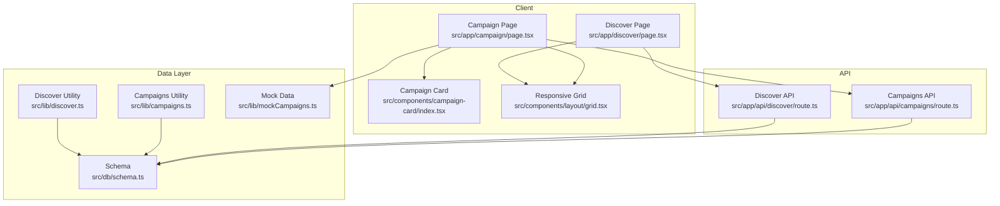
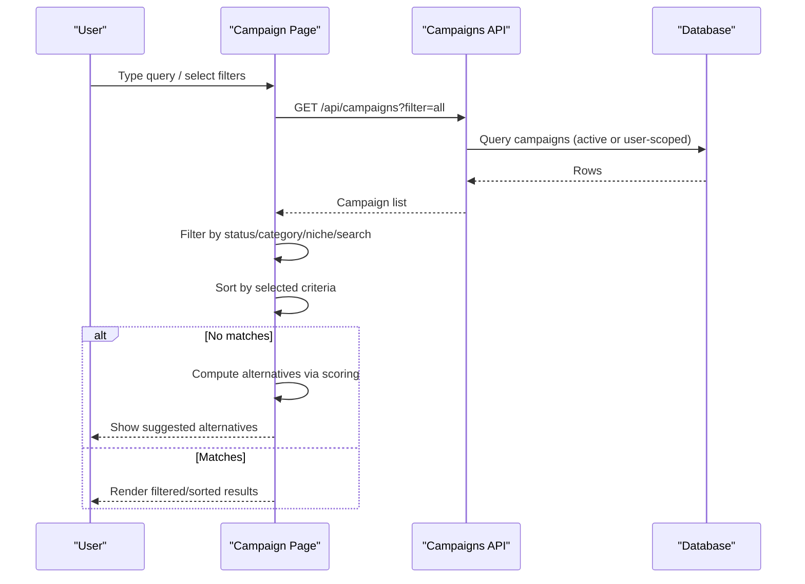
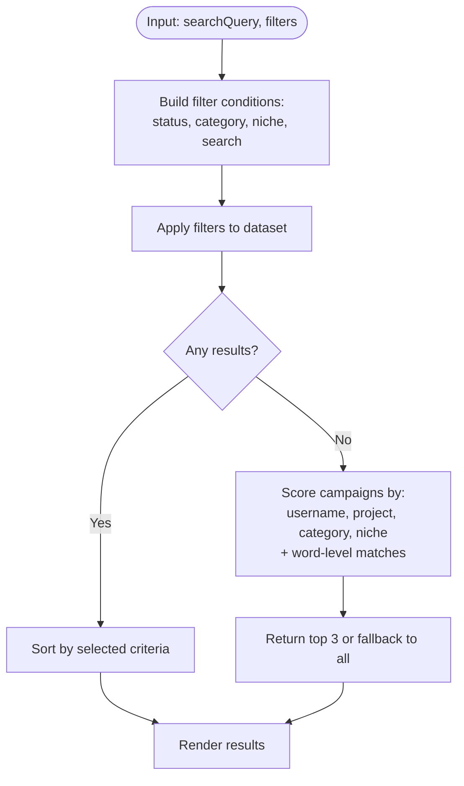
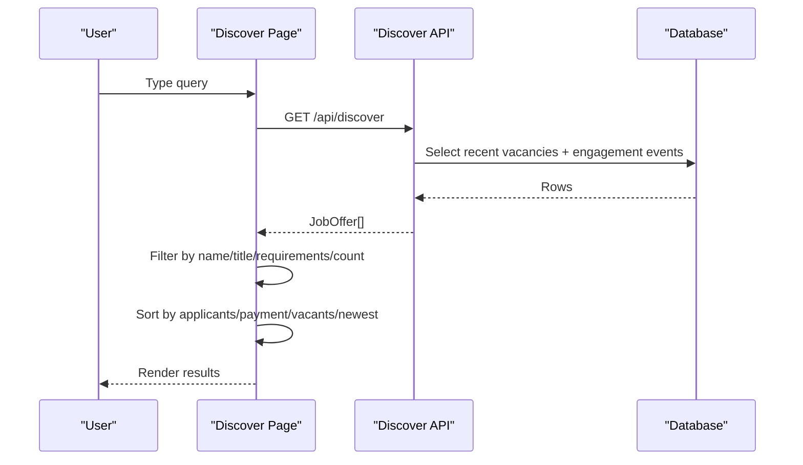
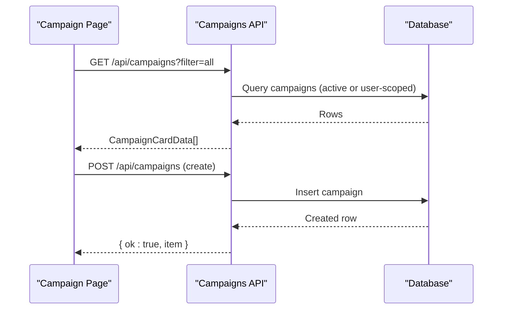
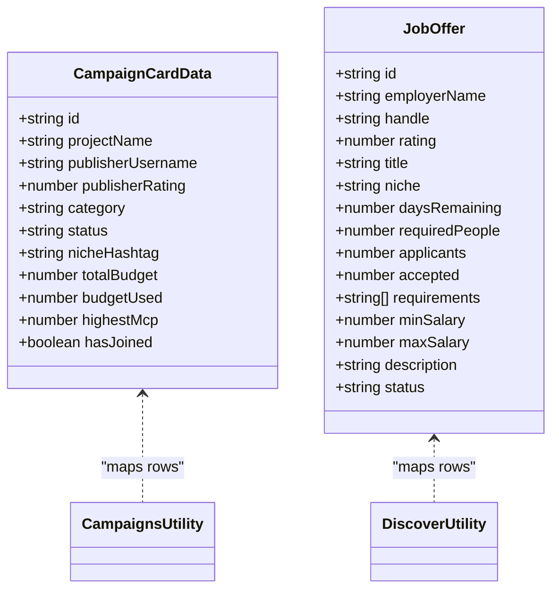
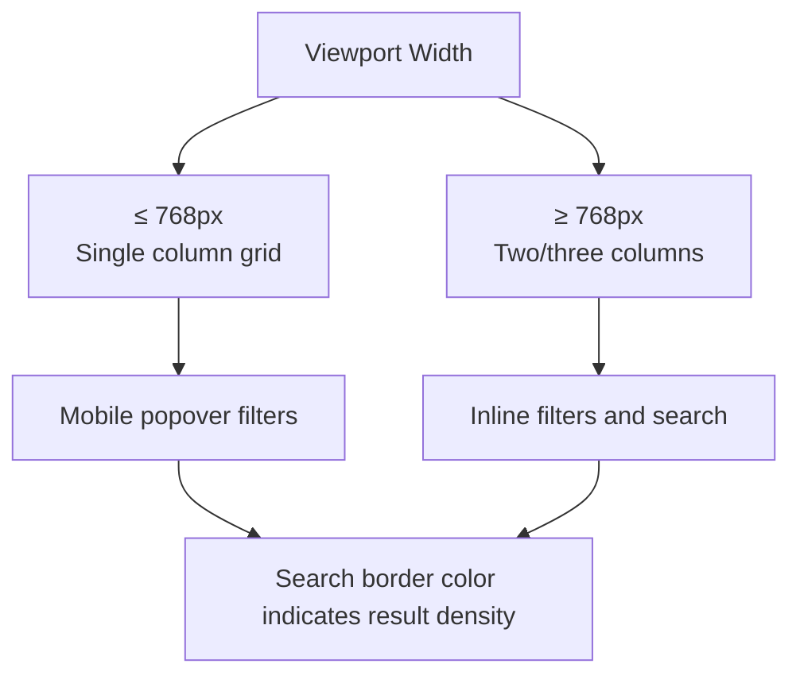
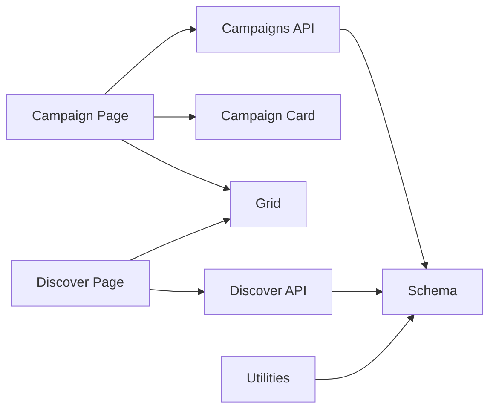

# Campaign Discovery & Search

<cite>
**Referenced Files in This Document**
- [campaign/page.tsx](file://src/app/campaign/page.tsx)
- [campaign/route.ts](file://src/app/api/campaigns/route.ts)
- [discover/page.tsx](file://src/app/discover/page.tsx)
- [discover/route.ts](file://src/app/api/discover/route.ts)
- [discover.ts](file://src/lib/discover.ts)
- [campaigns.ts](file://src/lib/campaigns.ts)
- [schema.ts](file://src/db/schema.ts)
- [mockCampaigns.ts](file://src/lib/mockCampaigns.ts)
- [grid.tsx](file://src/components/layout/grid.tsx)
- [campaign-card/index.tsx](file://src/components/campaign-card/index.tsx)
</cite>

## Table of Contents
1. Introduction
2. Project Structure
3. Core Components
4. Architecture Overview
5. Detailed Component Analysis
6. Dependency Analysis
7. Performance Considerations
8. Troubleshooting Guide
9. Conclusion

## Introduction
This document explains the campaign discovery and search system, focusing on advanced filtering (status, category, niche hashtags), sorting algorithms, real-time fuzzy search across key fields, alternative suggestions when no exact matches are found, performance optimizations for large datasets, and responsive design considerations for mobile filtering interfaces.

## Project Structure
The campaign discovery feature spans client pages, API routes, data access utilities, database schema, and UI components:
- Client page implements live search, filters, sorting, and alternative suggestions.
- API routes provide campaign listings and creation endpoints.
- Data utilities map database rows to typed models and compute derived values.
- Database schema defines campaigns, members, vacancies, and engagement events.
- UI components render cards and responsive grids.

**Diagram sources**
- [campaign/page.tsx:1-632](file://src/app/campaign/page.tsx#L1-L632)
- [campaign/route.ts:1-142](file://src/app/api/campaigns/route.ts#L1-L142)
- [discover/page.tsx:1-335](file://src/app/discover/page.tsx#L1-L335)
- [discover/route.ts:1-77](file://src/app/api/discover/route.ts#L1-L77)
- [schema.ts:1-84](file://src/db/schema.ts#L1-L84)
- [campaigns.ts:1-47](file://src/lib/campaigns.ts#L1-L47)
- [discover.ts:1-70](file://src/lib/discover.ts#L1-L70)
- [mockCampaigns.ts:1-57](file://src/lib/mockCampaigns.ts#L1-L57)
- [grid.tsx:1-21](file://src/components/layout/grid.tsx#L1-L21)
- [campaign-card/index.tsx:1-71](file://src/components/campaign-card/index.tsx#L1-L71)

**Section sources**
- [campaign/page.tsx:1-632](file://src/app/campaign/page.tsx#L1-L632)
- [campaign/route.ts:1-142](file://src/app/api/campaigns/route.ts#L1-L142)
- [discover/page.tsx:1-335](file://src/app/discover/page.tsx#L1-L335)
- [discover/route.ts:1-77](file://src/app/api/discover/route.ts#L1-L77)
- [schema.ts:1-84](file://src/db/schema.ts#L1-L84)
- [campaigns.ts:1-47](file://src/lib/campaigns.ts#L1-L47)
- [discover.ts:1-70](file://src/lib/discover.ts#L1-L70)
- [mockCampaigns.ts:1-57](file://src/lib/mockCampaigns.ts#L1-L57)
- [grid.tsx:1-21](file://src/components/layout/grid.tsx#L1-L21)
- [campaign-card/index.tsx:1-71](file://src/components/campaign-card/index.tsx#L1-L71)

## Core Components
- Campaign discovery page: Implements real-time search, status/category/niche filters, and multiple sort options; shows alternative suggestions when no results match.
- Discover jobs page: Provides a simpler job discovery flow with live search and sorting by applicants, payment, and vacancies.
- Campaigns API: Returns active or user-specific campaigns and supports creating new campaigns.
- Discover API: Returns recent vacancies and maps them to job offers.
- Data utilities: Map DB rows to typed models and compute membership flags.
- Schema: Defines tables for campaigns, campaign members, vacancies, market listings, and engagement events.
- UI components: Campaign card and responsive grid for consistent layout across devices.

**Section sources**
- [campaign/page.tsx:1-632](file://src/app/campaign/page.tsx#L1-L632)
- [discover/page.tsx:1-335](file://src/app/discover/page.tsx#L1-L335)
- [campaign/route.ts:1-142](file://src/app/api/campaigns/route.ts#L1-L142)
- [discover/route.ts:1-77](file://src/app/api/discover/route.ts#L1-L77)
- [campaigns.ts:1-47](file://src/lib/campaigns.ts#L1-L47)
- [discover.ts:1-70](file://src/lib/discover.ts#L1-L70)
- [schema.ts:1-84](file://src/db/schema.ts#L1-L84)
- [grid.tsx:1-21](file://src/components/layout/grid.tsx#L1-L21)
- [campaign-card/index.tsx:1-71](file://src/components/campaign-card/index.tsx#L1-L71)

## Architecture Overview
The system follows a client-driven filtering and sorting model with server-side data retrieval:
- The campaign page fetches campaigns from the API and applies client-side filters and sorting for instant feedback.
- When no results match, an alternative suggestion algorithm scores campaigns based on publisher username, project name, category, and niche hashtag.
- The discover page provides a similar experience for job opportunities with its own filtering and sorting logic.
- APIs enforce schema validation and return normalized responses.

**Diagram sources**
- [campaign/page.tsx:190-256](file://src/app/campaign/page.tsx#L190-L256)
- [campaign/route.ts:46-98](file://src/app/api/campaigns/route.ts#L46-L98)
- [schema.ts:3-27](file://src/db/schema.ts#L3-L27)

**Section sources**
- [campaign/page.tsx:190-256](file://src/app/campaign/page.tsx#L190-L256)
- [campaign/route.ts:46-98](file://src/app/api/campaigns/route.ts#L46-L98)
- [schema.ts:3-27](file://src/db/schema.ts#L3-L27)

## Detailed Component Analysis

### Campaign Discovery Page (Filtering, Sorting, Alternatives)
- Real-time search: Filters by publisher username and project name using case-insensitive substring matching.
- Advanced filters:
  - Status: Active or Future.
  - Category: Lifestyle, Gaming, Entertainment, Sports, Education, Technology, Luxury, Music, Politics, Religion.
  - Niche hashtags: #duet, #sound, #ugc, #logo, #clipping.
- Sorting algorithms:
  - Newest: By ID descending.
  - Highest Budget: By totalBudget descending.
  - Highest Available Budget: By (totalBudget - budgetUsed) descending.
  - Highest MCP: By highestMcp descending.
  - Most Paid Out: By budgetUsed descending.
  - Most Creators: By communitySize descending.
  - Less Influencer: By communitySize ascending.
- Alternative suggestions: Scores campaigns based on exact and word-level matches across publisherUsername, projectName, category, and nicheHashtag; returns top 3 or falls back to all campaigns if none score above zero.

**Diagram sources**
- [campaign/page.tsx:190-256](file://src/app/campaign/page.tsx#L190-L256)

**Section sources**
- [campaign/page.tsx:190-256](file://src/app/campaign/page.tsx#L190-L256)

### Discover Jobs Page (Real-time Search and Sorting)
- Real-time search: Filters by employerName, title, requirements, and requiredPeople count.
- Sorting options:
  - Applicants: Ascending order.
  - Payment: By maxSalary descending.
  - Vacants: By remaining spots (requiredPeople - accepted) descending.
  - Newest: By ID descending.

**Diagram sources**
- [discover/page.tsx:22-104](file://src/app/discover/page.tsx#L22-L104)
- [discover/route.ts:15-23](file://src/app/api/discover/route.ts#L15-L23)
- [discover.ts:47-69](file://src/lib/discover.ts#L47-L69)

**Section sources**
- [discover/page.tsx:22-104](file://src/app/discover/page.tsx#L22-L104)
- [discover/route.ts:15-23](file://src/app/api/discover/route.ts#L15-L23)
- [discover.ts:47-69](file://src/lib/discover.ts#L47-L69)

### Campaigns API (Listing and Creation)
- GET: Supports filters for created/joined/all and returns campaigns with membership flags.
- POST: Creates campaigns with validated fields and defaults.

**Diagram sources**
- [campaign/route.ts:46-98](file://src/app/api/campaigns/route.ts#L46-L98)
- [campaign/route.ts:100-142](file://src/app/api/campaigns/route.ts#L100-L142)
- [schema.ts:3-27](file://src/db/schema.ts#L3-L27)

**Section sources**
- [campaign/route.ts:46-98](file://src/app/api/campaigns/route.ts#L46-L98)
- [campaign/route.ts:100-142](file://src/app/api/campaigns/route.ts#L100-L142)
- [schema.ts:3-27](file://src/db/schema.ts#L3-L27)

### Data Utilities and Types
- Campaigns utility: Maps DB rows to CampaignCardData and computes hasJoined flag based on member records.
- Discover utility: Maps vacancies to JobOffer and computes latest action per vacancy from engagement events.
- Mock data: Generates sample campaigns with categories and niches for development/testing.

**Diagram sources**
- [campaigns.ts:7-46](file://src/lib/campaigns.ts#L7-L46)
- [discover.ts:24-69](file://src/lib/discover.ts#L24-L69)
- [mockCampaigns.ts:20-56](file://src/lib/mockCampaigns.ts#L20-L56)

**Section sources**
- [campaigns.ts:7-46](file://src/lib/campaigns.ts#L7-L46)
- [discover.ts:24-69](file://src/lib/discover.ts#L24-L69)
- [mockCampaigns.ts:20-56](file://src/lib/mockCampaigns.ts#L20-L56)

### Responsive Design Considerations
- Mobile-first grid: Single column on small screens, two columns on medium, three on larger screens.
- Sticky mobile filters: Popover-based menus for status, category, niche, and competition on narrow viewports.
- Clear visual feedback: Search border color changes based on result density to guide users.

**Diagram sources**
- [grid.tsx:8-21](file://src/components/layout/grid.tsx#L8-L21)
- [campaign/page.tsx:313-425](file://src/app/campaign/page.tsx#L313-L425)
- [campaign/page.tsx:427-539](file://src/app/campaign/page.tsx#L427-L539)
- [campaign/page.tsx:271-275](file://src/app/campaign/page.tsx#L271-L275)

**Section sources**
- [grid.tsx:8-21](file://src/components/layout/grid.tsx#L8-L21)
- [campaign/page.tsx:313-425](file://src/app/campaign/page.tsx#L313-L425)
- [campaign/page.tsx:427-539](file://src/app/campaign/page.tsx#L427-L539)
- [campaign/page.tsx:271-275](file://src/app/campaign/page.tsx#L271-L275)

## Dependency Analysis
- Client dependencies:
  - Campaign page depends on Campaigns API for data and uses local state for filtering/sorting.
  - Discover page depends on Discover API and local state for job discovery.
- Server dependencies:
  - APIs depend on Drizzle ORM and schema definitions for queries and inserts.
- Data mapping:
  - Utilities transform DB rows into typed models used by UI components.

**Diagram sources**
- [campaign/page.tsx:1-632](file://src/app/campaign/page.tsx#L1-L632)
- [discover/page.tsx:1-335](file://src/app/discover/page.tsx#L1-L335)
- [campaign/route.ts:1-142](file://src/app/api/campaigns/route.ts#L1-L142)
- [discover/route.ts:1-77](file://src/app/api/discover/route.ts#L1-L77)
- [schema.ts:1-84](file://src/db/schema.ts#L1-L84)

**Section sources**
- [campaign/page.tsx:1-632](file://src/app/campaign/page.tsx#L1-L632)
- [discover/page.tsx:1-335](file://src/app/discover/page.tsx#L1-L335)
- [campaign/route.ts:1-142](file://src/app/api/campaigns/route.ts#L1-L142)
- [discover/route.ts:1-77](file://src/app/api/discover/route.ts#L1-L77)
- [schema.ts:1-84](file://src/db/schema.ts#L1-L84)

## Performance Considerations
- Client-side filtering and sorting: Fast for moderate datasets; consider pagination or virtualization for very large lists.
- Fallback to mock data: Ensures responsiveness when the database is unavailable.
- Efficient queries: APIs limit results and use indexed fields where applicable.
- Lightweight scoring: Alternative suggestions use simple string matching and word splitting to keep computation minimal.
- Responsive UI: Grid adapts to screen size to maintain performance and usability on mobile devices.

[No sources needed since this section provides general guidance]

## Troubleshooting Guide
- No results after search:
  - Check that filters are not overly restrictive; clear filters to verify baseline results.
  - Use alternative suggestions to find related campaigns.
- API errors:
  - Ensure headers include user identification when required.
  - Validate request payloads for create operations.
- Database unavailability:
  - System falls back to mock data; verify network connectivity and database configuration.

**Section sources**
- [campaign/page.tsx:102-106](file://src/app/campaign/page.tsx#L102-L106)
- [campaign/route.ts:94-98](file://src/app/api/campaigns/route.ts#L94-L98)
- [discover/route.ts:19-22](file://src/app/api/discover/route.ts#L19-L22)

## Conclusion
The campaign discovery and search system delivers a responsive, filter-rich experience with robust sorting and intelligent alternative suggestions. It balances client-side interactivity with server-side data integrity, ensuring fast feedback and reliable results across devices. For scaling to larger datasets, consider introducing server-side pagination, indexing strategies, and more sophisticated search algorithms while preserving the current modular architecture.

[No sources needed since this section summarizes without analyzing specific files]