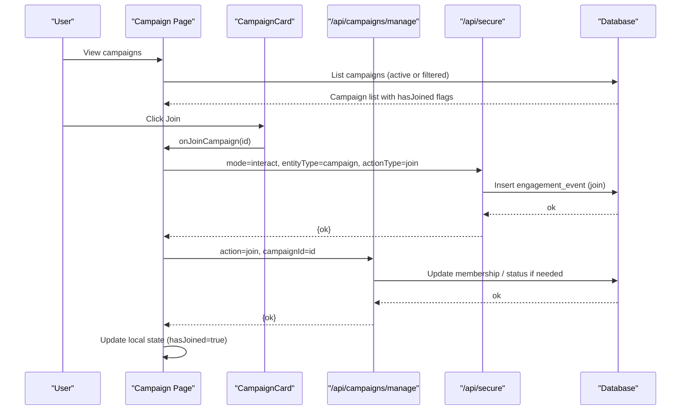
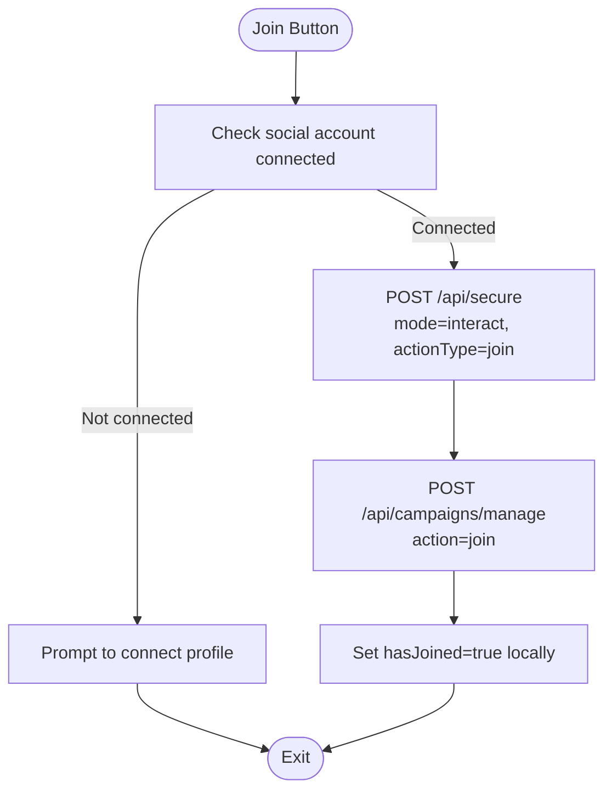
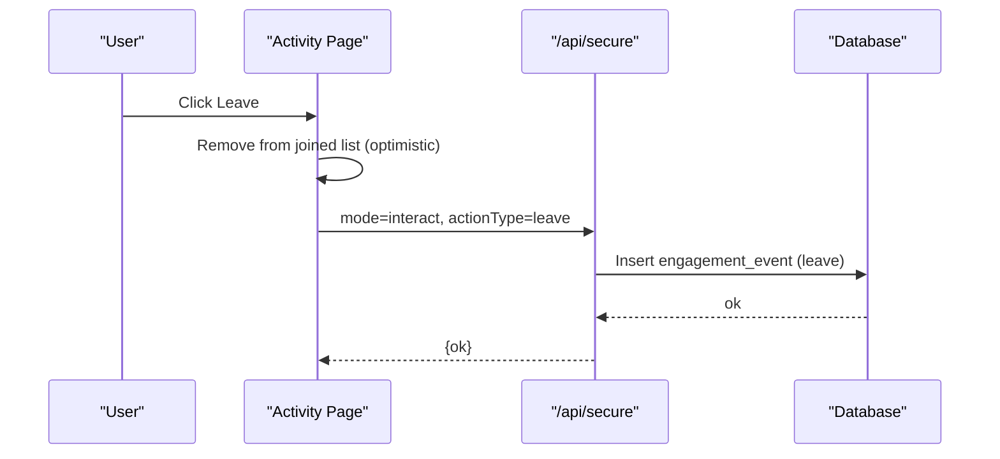
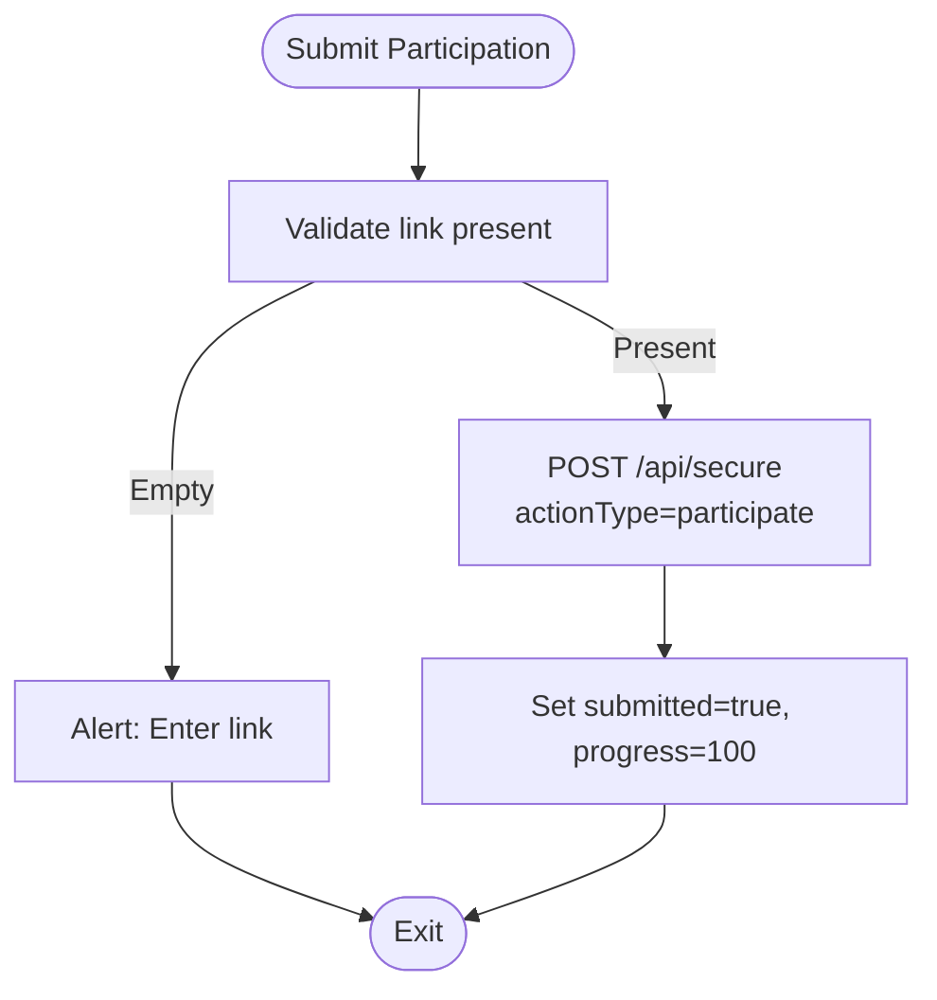
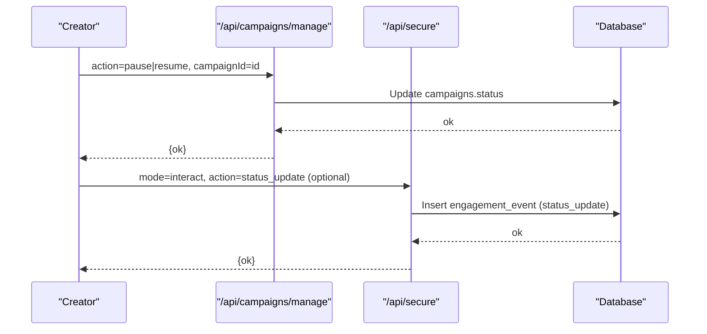
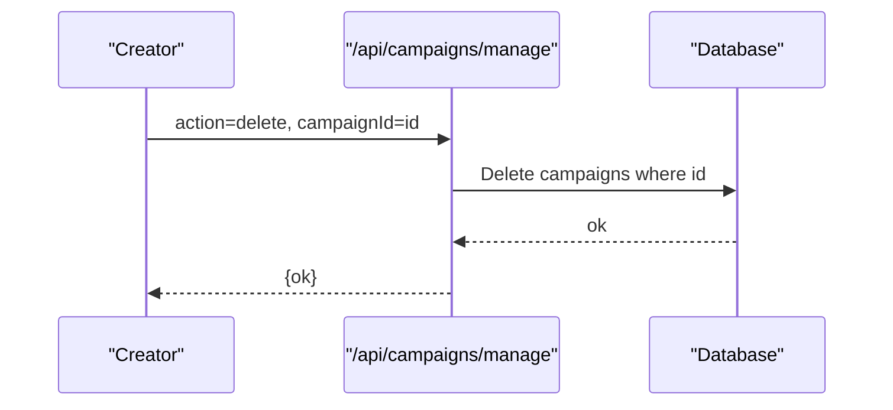
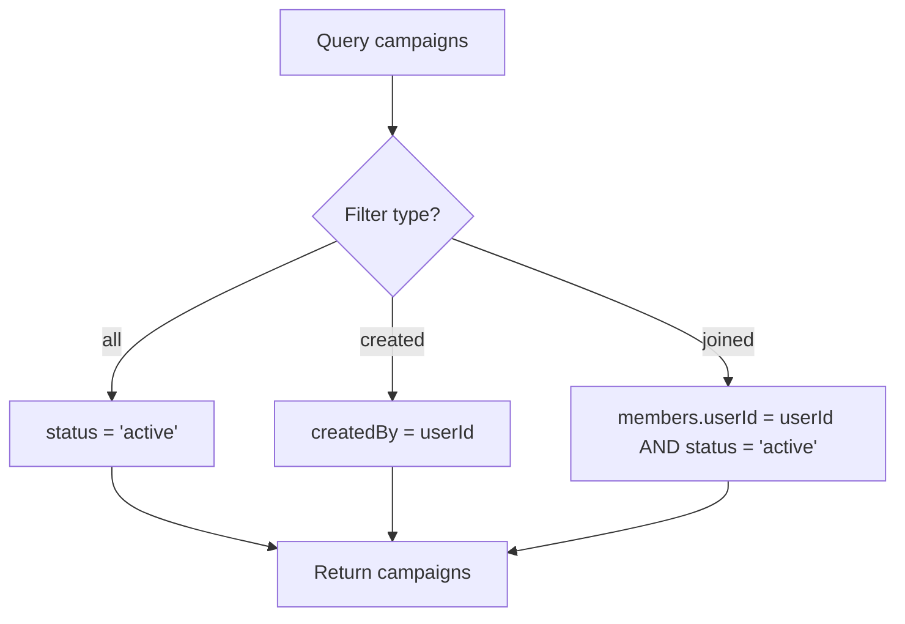
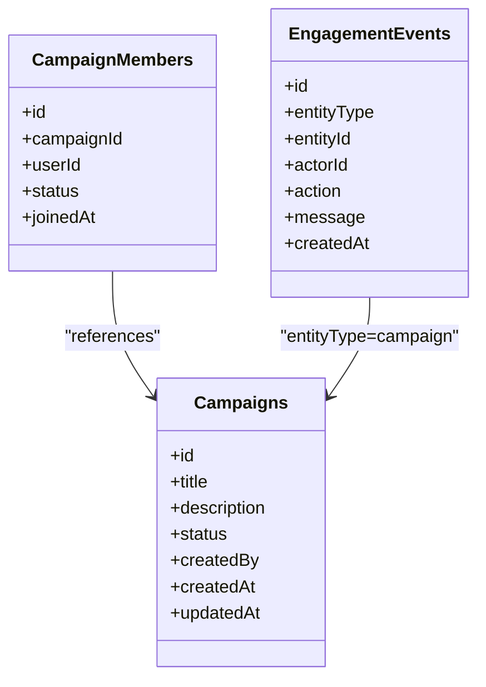
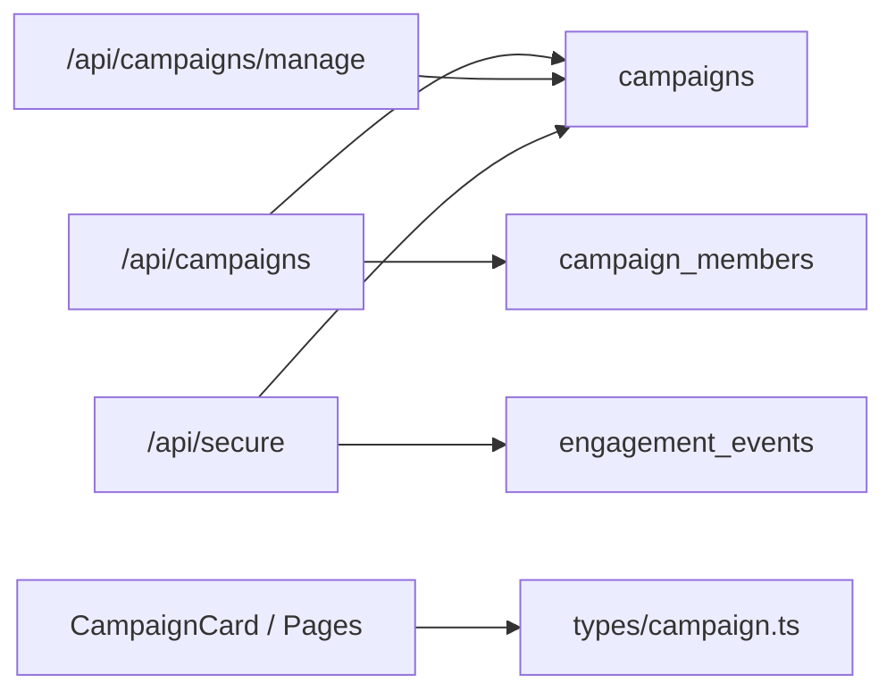

# Campaign Management & Operations

<cite>
**Referenced Files in This Document**
- [route.ts](file://src/app/api/campaigns/route.ts)
- [route.ts](file://src/app/api/campaigns/manage/route.ts)
- [route.ts](file://src/app/api/secure/route.ts)
- [schema.ts](file://src/db/schema.ts)
- [campaigns.ts](file://src/lib/campaigns.ts)
- [page.tsx](file://src/app/campaign/page.tsx)
- [page.tsx](file://src/app/campaign/activity/page.tsx)
- [index.tsx](file://src/components/campaign-card/index.tsx)
- [footer.tsx](file://src/components/campaign-card/footer.tsx)
- [campaign.ts](file://src/types/campaign.ts)
</cite>

## Table of Contents
1. Introduction
2. Project Structure
3. Core Components
4. Architecture Overview
5. Detailed Component Analysis
6. Dependency Analysis
7. Performance Considerations
8. Troubleshooting Guide
9. Conclusion

## Introduction
This document explains campaign management operations with a focus on joining and leaving campaigns, status management (pause/resume), deletion workflows, authentication requirements, social account connectivity checks, state transitions affecting visibility and participation, office event tracking for campaign activities, error handling, API examples, client-side state updates, and concurrency safeguards.

## Project Structure
The campaign system is implemented across Next.js API routes, database schema definitions, and UI components:
- API routes handle listing, creation, management actions, and secure interactions that record events.
- Database schema defines campaigns, campaign members, and engagement events used to track activity.
- Client pages and components manage user flows like joining, leaving, participating, and viewing joined campaigns.

```mermaid
graph TB
subgraph "Client"
CPage["Campaign Page"]
APage["Activity Page"]
Card["CampaignCard"]
end
subgraph "API Routes"
CR["/api/campaigns"]
CM["/api/campaigns/manage"]
CS["/api/secure"]
end
subgraph "Data Layer"
DB["PostgreSQL (Drizzle ORM)"]
SCHEMA["Schema: campaigns, campaign_members, engagement_events"]
end
CPage --> CR
CPage --> CM
CPage --> CS
APage --> CS
Card --> CPage
CR --> DB
CM --> DB
CS --> DB
DB --> SCHEMA
```

**Diagram sources**
- [route.ts:46-98](file://src/app/api/campaigns/route.ts#L46-L98)
- [route.ts:55-179](file://src/app/api/campaigns/manage/route.ts#L55-L179)
- [route.ts:111-152](file://src/app/api/secure/route.ts#L111-L152)
- [route.ts:154-353](file://src/app/api/secure/route.ts#L154-L353)
- [schema.ts:3-35](file://src/db/schema.ts#L3-L35)
- [schema.ts:75-83](file://src/db/schema.ts#L75-L83)
- [page.tsx:94-135](file://src/app/campaign/page.tsx#L94-L135)
- [page.tsx:83-131](file://src/app/campaign/activity/page.tsx#L83-L131)
- [index.tsx:20-41](file://src/components/campaign-card/index.tsx#L20-L41)

**Section sources**
- [route.ts:46-98](file://src/app/api/campaigns/route.ts#L46-L98)
- [route.ts:55-179](file://src/app/api/campaigns/manage/route.ts#L55-L179)
- [route.ts:111-152](file://src/app/api/secure/route.ts#L111-L152)
- [route.ts:154-353](file://src/app/api/secure/route.ts#L154-L353)
- [schema.ts:3-35](file://src/db/schema.ts#L3-L35)
- [schema.ts:75-83](file://src/db/schema.ts#L75-L83)
- [page.tsx:94-135](file://src/app/campaign/page.tsx#L94-L135)
- [page.tsx:83-131](file://src/app/campaign/activity/page.tsx#L83-L131)
- [index.tsx:20-41](file://src/components/campaign-card/index.tsx#L20-L41)

## Core Components
- Campaign listing and filtering: GET /api/campaigns supports filters for all, created, and joined campaigns, marking hasJoined based on membership.
- Campaign management: POST /api/campaigns/manage supports create, update, pause, resume, delete with creator-only authorization.
- Secure interactions: POST /api/secure records engagement events for join/participate/leave/status changes and can update campaign status.
- Data model: campaigns, campaign_members, engagement_events define entities and relationships.
- Client integration: Campaign page handles join flow with social connectivity check; Activity page handles leave and participation submission.

**Section sources**
- [route.ts:46-98](file://src/app/api/campaigns/route.ts#L46-L98)
- [route.ts:55-179](file://src/app/api/campaigns/manage/route.ts#L55-L179)
- [route.ts:154-353](file://src/app/api/secure/route.ts#L154-L353)
- [schema.ts:3-35](file://src/db/schema.ts#L3-L35)
- [schema.ts:75-83](file://src/db/schema.ts#L75-L83)
- [page.tsx:94-135](file://src/app/campaign/page.tsx#L94-L135)
- [page.tsx:83-131](file://src/app/campaign/activity/page.tsx#L83-L131)

## Architecture Overview
The system uses a layered architecture:
- Client components initiate actions (join, leave, participate, manage).
- API routes validate inputs, enforce permissions, perform database operations, and log events.
- Database stores persistent state and activity logs.

**Diagram sources**
- [page.tsx:113-135](file://src/app/campaign/page.tsx#L113-L135)
- [route.ts:55-179](file://src/app/api/campaigns/manage/route.ts#L55-L179)
- [route.ts:154-353](file://src/app/api/secure/route.ts#L154-L353)
- [schema.ts:75-83](file://src/db/schema.ts#L75-L83)

## Detailed Component Analysis

### Join Campaign Workflow
- Social connectivity check: The campaign page verifies the user’s profile handle before allowing join. If not connected, it prompts to connect in profile.
- Event recording: On join attempt, the client calls /api/secure to record an engagement event for join.
- Membership update: The client then calls /api/campaigns/manage with action=join to persist membership.
- Client state update: The campaign card toggles hasJoined to true immediately for responsiveness.

**Diagram sources**
- [page.tsx:113-135](file://src/app/campaign/page.tsx#L113-L135)
- [page.tsx:83-131](file://src/app/campaign/activity/page.tsx#L83-L131)
- [route.ts:154-353](file://src/app/api/secure/route.ts#L154-L353)
- [route.ts:55-179](file://src/app/api/campaigns/manage/route.ts#L55-L179)

**Section sources**
- [page.tsx:113-135](file://src/app/campaign/page.tsx#L113-L135)
- [page.tsx:83-131](file://src/app/campaign/activity/page.tsx#L83-L131)
- [route.ts:154-353](file://src/app/api/secure/route.ts#L154-L353)
- [route.ts:55-179](file://src/app/api/campaigns/manage/route.ts#L55-L179)

### Leave Campaign Workflow
- Immediate UI removal: The activity page removes the campaign from joined list optimistically.
- Event recording: Calls /api/secure to record a leave event.
- No explicit membership deletion is performed in the analyzed code; leave is recorded as an event.

**Diagram sources**
- [page.tsx:83-94](file://src/app/campaign/activity/page.tsx#L83-L94)
- [route.ts:154-353](file://src/app/api/secure/route.ts#L154-L353)

**Section sources**
- [page.tsx:83-94](file://src/app/campaign/activity/page.tsx#L83-L94)
- [route.ts:154-353](file://src/app/api/secure/route.ts#L154-L353)

### Participation Submission
- Requires a link input; validates presence before submission.
- Records participation via /api/secure with actionType=participate and updates local submitted flag and progress.

**Diagram sources**
- [page.tsx:102-131](file://src/app/campaign/activity/page.tsx#L102-L131)

**Section sources**
- [page.tsx:102-131](file://src/app/campaign/activity/page.tsx#L102-L131)

### Status Management (Pause/Resume)
- Creator-only enforcement: Only the campaign creator can pause or resume.
- Updates campaign status to paused or active accordingly.
- Engagement events are recorded for status changes through secure interactions.

**Diagram sources**
- [route.ts:149-162](file://src/app/api/campaigns/manage/route.ts#L149-L162)
- [route.ts:492-508](file://src/app/api/secure/route.ts#L492-L508)

**Section sources**
- [route.ts:149-162](file://src/app/api/campaigns/manage/route.ts#L149-L162)
- [route.ts:492-508](file://src/app/api/secure/route.ts#L492-L508)

### Deletion Workflow
- Creator-only enforcement: Only the campaign creator can delete.
- Deletes the campaign record from the database.

**Diagram sources**
- [route.ts:164-171](file://src/app/api/campaigns/manage/route.ts#L164-L171)

**Section sources**
- [route.ts:164-171](file://src/app/api/campaigns/manage/route.ts#L164-L171)

### Visibility and Participation Effects
- Listing visibility: Default queries filter by status='active' unless filtering by created/joined. Paused campaigns are not shown in default lists.
- Joined campaigns: Determined by membership records or engagement events indicating join/participate.
- Participation: Marked by engagement events with actionType=participate; UI reflects submitted state.

**Diagram sources**
- [route.ts:52-93](file://src/app/api/campaigns/route.ts#L52-L93)
- [campaigns.ts:34-46](file://src/lib/campaigns.ts#L34-L46)

**Section sources**
- [route.ts:52-93](file://src/app/api/campaigns/route.ts#L52-L93)
- [campaigns.ts:34-46](file://src/lib/campaigns.ts#L34-L46)

### Office Event Tracking System
- Engagement events table captures entity type, entity id, actor id, action, message, and timestamp.
- Secure API inserts events for create, interact (join/participate/leave), and status updates.
- Activity page loads and displays recent events.

**Diagram sources**
- [schema.ts:3-35](file://src/db/schema.ts#L3-L35)
- [schema.ts:75-83](file://src/db/schema.ts#L75-L83)
- [route.ts:111-152](file://src/app/api/secure/route.ts#L111-L152)
- [route.ts:154-353](file://src/app/api/secure/route.ts#L154-L353)

**Section sources**
- [schema.ts:3-35](file://src/db/schema.ts#L3-L35)
- [schema.ts:75-83](file://src/db/schema.ts#L75-L83)
- [route.ts:111-152](file://src/app/api/secure/route.ts#L111-L152)
- [route.ts:154-353](file://src/app/api/secure/route.ts#L154-L353)

### Authentication and Authorization
- User identity: Extracted from headers or body fields; defaults to demo-user when absent.
- Role-based access: Minimal role extraction exists; most operations rely on createdBy checks for creator-only actions.
- Permission enforcement: Pause/resume/delete require campaign.createdBy == userId; otherwise returns 403.

**Section sources**
- [route.ts:154-162](file://src/app/api/secure/route.ts#L154-L162)
- [route.ts:119-122](file://src/app/api/campaigns/manage/route.ts#L119-L122)
- [route.ts:149-167](file://src/app/api/campaigns/manage/route.ts#L149-L167)

### Error Handling
- Validation errors: Missing required fields return 400 responses.
- Not found: Unknown campaign returns 404.
- Unauthorized: Missing user identity returns 401; insufficient permission returns 403.
- Server errors: Catch blocks return 500 with generic messages.

**Section sources**
- [route.ts:113-115](file://src/app/api/campaigns/route.ts#L113-L115)
- [route.ts:110-117](file://src/app/api/campaigns/manage/route.ts#L110-L117)
- [route.ts:149-167](file://src/app/api/campaigns/manage/route.ts#L149-L167)
- [route.ts:154-162](file://src/app/api/secure/route.ts#L154-L162)

### API Examples and Response Formats
- List campaigns:
  - Method: GET
  - Endpoint: /api/campaigns?filter=all|created|joined
  - Headers: x-user-id
  - Response: Array of campaign objects with hasJoined flags
- Create campaign:
  - Method: POST
  - Endpoint: /api/campaigns
  - Body: title, description, category, nicheHashtag, totalBudget, timeRemainingDays, communitySize, publisherRating
  - Response: { ok: true, item: campaign }
- Manage campaign:
  - Method: POST
  - Endpoint: /api/campaigns/manage
  - Body: action=create|update|pause|resume|delete, campaignId (for update/pause/resume/delete), plus relevant fields
  - Response: { ok: true, ... } or error object
- Secure interaction:
  - Method: POST
  - Endpoint: /api/secure
  - Body: mode=interact, entityType=campaign, entityId, actionType=join|participate|leave, message
  - Response: { ok: true, ... }

Note: Use the referenced files for exact field names and response structures.

**Section sources**
- [route.ts:46-98](file://src/app/api/campaigns/route.ts#L46-L98)
- [route.ts:100-141](file://src/app/api/campaigns/route.ts#L100-L141)
- [route.ts:55-179](file://src/app/api/campaigns/manage/route.ts#L55-L179)
- [route.ts:154-353](file://src/app/api/secure/route.ts#L154-L353)

### Client-Side State Updates
- Optimistic updates:
  - Join: Set hasJoined=true immediately after successful server response.
  - Leave: Remove from joined list before confirming server event recording.
  - Participate: Set submitted=true and progress=100 after success.
- Fallback behavior:
  - If API fails, client logs error; optimistic states may need rollback depending on implementation.

**Section sources**
- [page.tsx:113-135](file://src/app/campaign/page.tsx#L113-L135)
- [page.tsx:83-131](file://src/app/campaign/activity/page.tsx#L83-L131)
- [index.tsx:20-41](file://src/components/campaign-card/index.tsx#L20-L41)
- [footer.tsx:14-28](file://src/components/campaign-card/footer.tsx#L14-L28)

### Concurrent Users and Race Conditions
- Observed mechanisms:
  - Creator-only checks prevent unauthorized modifications.
  - Engagement events provide an audit trail for actions.
- Potential race conditions:
  - Multiple users joining simultaneously could lead to duplicate memberships if not guarded at the database level.
  - Status toggling without locking could cause inconsistent states under concurrent updates.
- Recommendations:
  - Add unique constraints on campaign_members(userId, campaignId) to prevent duplicates.
  - Use transactions for multi-step operations (e.g., insert member and record event).
  - Implement optimistic concurrency control with versioning or timestamps for updates.
  - Add idempotency keys for join/participate actions to safely retry.

[No sources needed since this section provides general guidance]

## Dependency Analysis
Key dependencies and relationships:
- Campaign listing depends on campaigns and campaign_members tables.
- Management actions depend on campaigns table and creator verification.
- Secure interactions depend on engagement_events for activity logging.
- UI components depend on types and data shapes defined in campaign types.

**Diagram sources**
- [route.ts:46-98](file://src/app/api/campaigns/route.ts#L46-L98)
- [route.ts:55-179](file://src/app/api/campaigns/manage/route.ts#L55-L179)
- [route.ts:154-353](file://src/app/api/secure/route.ts#L154-L353)
- [campaign.ts:1-33](file://src/types/campaign.ts#L1-L33)

**Section sources**
- [route.ts:46-98](file://src/app/api/campaigns/route.ts#L46-L98)
- [route.ts:55-179](file://src/app/api/campaigns/manage/route.ts#L55-L179)
- [route.ts:154-353](file://src/app/api/secure/route.ts#L154-L353)
- [campaign.ts:1-33](file://src/types/campaign.ts#L1-L33)

## Performance Considerations
- Query limits: Campaign listing uses limits to reduce payload size.
- Filtering: Efficient WHERE clauses for status and creator filters.
- Event logging: Engagement events are appended per action; ensure indexing on frequently queried columns (entityType, entityId, actorId, createdAt).
- Client optimizations: Optimistic UI updates improve perceived performance; consider debouncing rapid actions.

[No sources needed since this section provides general guidance]

## Troubleshooting Guide
Common issues and resolutions:
- Missing user identity: Ensure x-user-id header is set; otherwise, requests may default to demo-user and fail authorization checks.
- Validation errors: Provide required fields (title, description) for creation; include campaignId for management actions.
- Permission denied: Verify campaign.createdBy matches userId for pause/resume/delete.
- Network timeouts: Implement retries with exponential backoff on client side; surface user-friendly errors.
- Duplicate joins: Add unique constraints and idempotency to prevent multiple memberships.

**Section sources**
- [route.ts:154-162](file://src/app/api/secure/route.ts#L154-L162)
- [route.ts:113-115](file://src/app/api/campaigns/route.ts#L113-L115)
- [route.ts:119-122](file://src/app/api/campaigns/manage/route.ts#L119-L122)
- [route.ts:149-167](file://src/app/api/campaigns/manage/route.ts#L149-L167)

## Conclusion
The campaign management system provides robust APIs for listing, creating, managing, and interacting with campaigns, backed by clear data models and event tracking. Authentication and authorization are enforced primarily through creator checks, while social connectivity is validated on the client before joining. State transitions affect visibility and participation, and engagement events offer comprehensive activity logs. To enhance reliability under concurrency, introduce unique constraints, transactions, and idempotency controls.