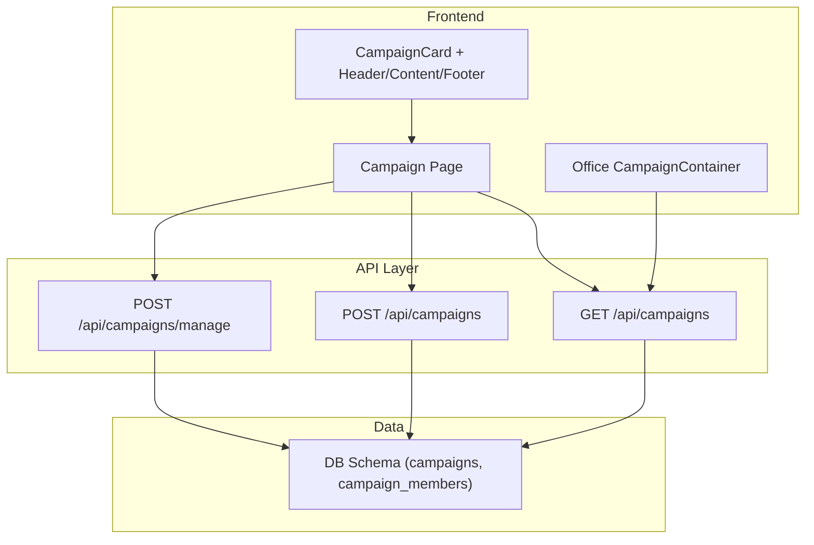
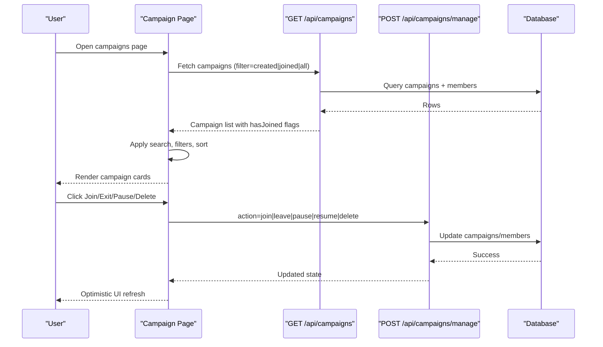
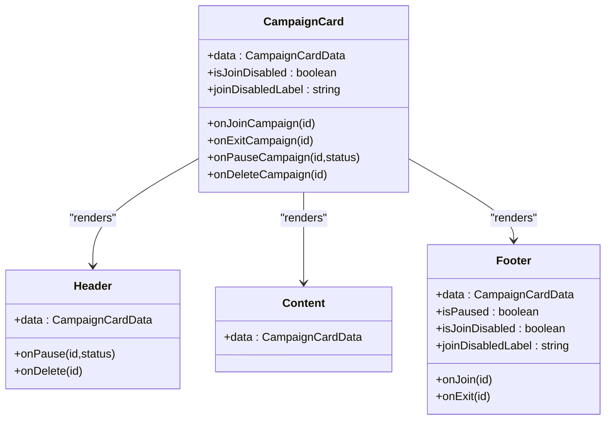
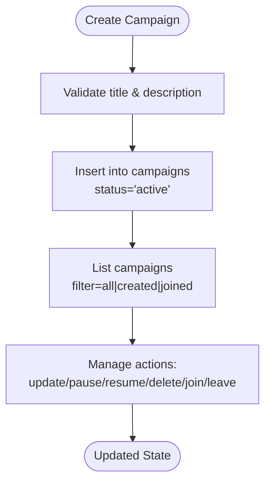
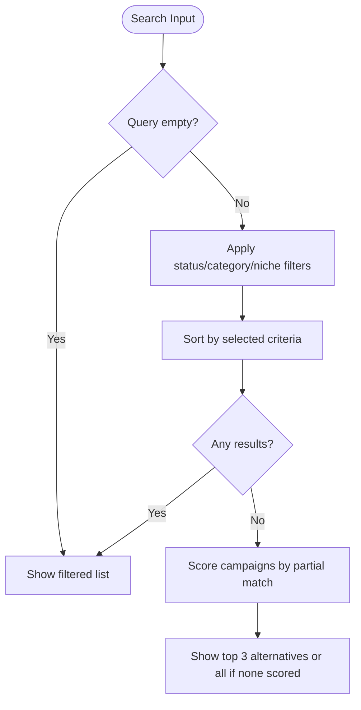
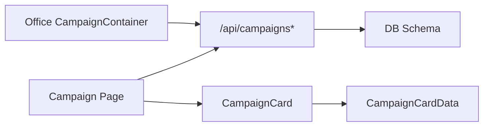

# Campaign Management System

<cite>
**Referenced Files in This Document**
- [campaign.ts](file://src/types/campaign.ts)
- [campaign-card/index.tsx](file://src/components/campaign-card/index.tsx)
- [campaign-card/header.tsx](file://src/components/campaign-card/header.tsx)
- [campaign-card/content.tsx](file://src/components/campaign-card/content.tsx)
- [campaign-card/footer.tsx](file://src/components/campaign-card/footer.tsx)
- [campaign/page.tsx](file://src/app/campaign/page.tsx)
- [api/campaigns/route.ts](file://src/app/api/campaigns/route.ts)
- [api/campaigns/manage/route.ts](file://src/app/api/campaigns/manage/route.ts)
- [db/schema.ts](file://src/db/schema.ts)
- [lib/campaigns.ts](file://src/lib/campaigns.ts)
- [office/CampaignContainer.tsx](file://src/components/office/CampaignContainer.tsx)
- [mockCampaigns.ts](file://src/lib/mockCampaigns.ts)
</cite>

## Table of Contents
1. Introduction
2. Project Structure
3. Core Components
4. Architecture Overview
5. Detailed Component Analysis
6. Dependency Analysis
7. Performance Considerations
8. Troubleshooting Guide
9. Conclusion

## Introduction
This document explains the Campaign Management System with a focus on campaign creation, budget allocation, member coordination, lifecycle management (active/future), filtering and sorting, search, discovery alternatives, social account connectivity for joining campaigns, and integration with the office dashboard for activity tracking. It also documents the campaign card component structure, user interactions (join/exit), API endpoints for CRUD operations, and real-time-like updates via optimistic UI and server-driven state.

## Project Structure
The system is built as a Next.js application with:
- Pages for campaign browsing, management, and office dashboards
- API routes for listing, creating, updating, pausing/resuming, and deleting campaigns
- A shared data model for campaign cards
- Reusable campaign card components (header, content, footer, budget sentiment)
- Database schema definitions using Drizzle ORM
- Office dashboard widgets that visualize campaign progress and totals

**Diagram sources**
- [campaign/page.tsx:82-111](file://src/app/campaign/page.tsx#L82-L111)
- [api/campaigns/route.ts:46-98](file://src/app/api/campaigns/route.ts#L46-L98)
- [api/campaigns/manage/route.ts:55-178](file://src/app/api/campaigns/manage/route.ts#L55-L178)
- [db/schema.ts:3-35](file://src/db/schema.ts#L3-L35)
- [office/CampaignContainer.tsx:23-65](file://src/components/office/CampaignContainer.tsx#L23-L65)

**Section sources**
- [campaign/page.tsx:82-111](file://src/app/campaign/page.tsx#L82-L111)
- [api/campaigns/route.ts:46-98](file://src/app/api/campaigns/route.ts#L46-L98)
- [api/campaigns/manage/route.ts:55-178](file://src/app/api/campaigns/manage/route.ts#L55-L178)
- [db/schema.ts:3-35](file://src/db/schema.ts#L3-L35)
- [office/CampaignContainer.tsx:23-65](file://src/components/office/CampaignContainer.tsx#L23-L65)

## Core Components
- Campaign data model defines the shape of campaign cards including identifiers, publisher info, metrics, budget fields, status, required platforms, payout ranges, and optional participants/feedback.
- Campaign card composes header (publisher info, countdown, manager controls), content (description, platforms, metrics), budget sentiment visualization, and footer (join/exit actions).
- Campaign page provides search, filters (status/category/niche), sorting, join/exit flows, and alternative suggestions when no results match.
- API routes implement list/create and manage (update/pause/resume/delete/join/leave).
- Office dashboard visualizes campaign flow and audience metrics by fetching created campaigns and rendering charts/gauges.

**Section sources**
- [campaign.ts:1-33](file://src/types/campaign.ts#L1-L33)
- [campaign-card/index.tsx:10-71](file://src/components/campaign-card/index.tsx#L10-L71)
- [campaign-card/header.tsx:14-123](file://src/components/campaign-card/header.tsx#L14-L123)
- [campaign-card/content.tsx:9-76](file://src/components/campaign-card/content.tsx#L9-L76)
- [campaign-card/footer.tsx:5-52](file://src/components/campaign-card/footer.tsx#L5-L52)
- [campaign/page.tsx:12-279](file://src/app/campaign/page.tsx#L12-L279)
- [api/campaigns/route.ts:19-142](file://src/app/api/campaigns/route.ts#L19-L142)
- [api/campaigns/manage/route.ts:29-178](file://src/app/api/campaigns/manage/route.ts#L29-L178)
- [office/CampaignContainer.tsx:20-121](file://src/components/office/CampaignContainer.tsx#L20-L121)

## Architecture Overview
The frontend loads campaigns from the API, applies client-side search/filter/sort, and renders campaign cards. User actions (join/exit, pause/resume, delete) call management APIs which update the database and return updated state. The office dashboard fetches created campaigns to render progress curves and gauges.

**Diagram sources**
- [campaign/page.tsx:94-111](file://src/app/campaign/page.tsx#L94-L111)
- [api/campaigns/route.ts:46-98](file://src/app/api/campaigns/route.ts#L46-L98)
- [api/campaigns/manage/route.ts:55-178](file://src/app/api/campaigns/manage/route.ts#L55-L178)
- [db/schema.ts:3-35](file://src/db/schema.ts#L3-L35)

## Detailed Component Analysis

### Campaign Data Model
- Fields include identity, publisher metadata, metrics (community size, views, likes), budgeting (totalBudget, budgetUsed, min/max payout), performance (highestMcp), scheduling (startDate, timeRemainingDays), platform requirements, and optional participant details.
- Used across UI components and API responses to ensure consistent presentation and behavior.

**Section sources**
- [campaign.ts:1-33](file://src/types/campaign.ts#L1-L33)

### Campaign Card Component
- Composed of Header (publisher avatar/name, rating, countdown timer, manager controls), Content (description, required platforms, metrics grid), BudgetSentiment (budget usage visualization), and Footer (Join/Exit button with disabled states).
- Manages local state for hasJoined and status to reflect paused campaigns and disable actions accordingly.

**Diagram sources**
- [campaign-card/index.tsx:10-71](file://src/components/campaign-card/index.tsx#L10-L71)
- [campaign-card/header.tsx:14-123](file://src/components/campaign-card/header.tsx#L14-L123)
- [campaign-card/content.tsx:9-76](file://src/components/campaign-card/content.tsx#L9-L76)
- [campaign-card/footer.tsx:5-52](file://src/components/campaign-card/footer.tsx#L5-L52)

**Section sources**
- [campaign-card/index.tsx:10-71](file://src/components/campaign-card/index.tsx#L10-L71)
- [campaign-card/header.tsx:14-123](file://src/components/campaign-card/header.tsx#L14-L123)
- [campaign-card/content.tsx:9-76](file://src/components/campaign-card/content.tsx#L9-L76)
- [campaign-card/footer.tsx:5-52](file://src/components/campaign-card/footer.tsx#L5-L52)

### Campaign Lifecycle and Status Management
- Creation: POST /api/campaigns creates a new campaign with default active status and initializes budget counters.
- Listing: GET /api/campaigns supports filter=all|created|joined; returns campaigns with hasJoined flags based on membership.
- Updates: POST /api/campaigns/manage supports update, pause, resume, delete with creator-only authorization checks.
- Membership: join/leave actions are handled via manage endpoint to add/remove members.

**Diagram sources**
- [api/campaigns/route.ts:100-142](file://src/app/api/campaigns/route.ts#L100-L142)
- [api/campaigns/route.ts:46-98](file://src/app/api/campaigns/route.ts#L46-L98)
- [api/campaigns/manage/route.ts:55-178](file://src/app/api/campaigns/manage/route.ts#L55-L178)

**Section sources**
- [api/campaigns/route.ts:46-142](file://src/app/api/campaigns/route.ts#L46-L142)
- [api/campaigns/manage/route.ts:55-178](file://src/app/api/campaigns/manage/route.ts#L55-L178)

### Search, Filtering, Sorting, and Discovery Alternatives
- Search: Client-side text search across publisher username and project name.
- Filters: Status (active/future), category, niche hashtag.
- Sorting: By newest, highest budget, highest available budget, highest MCP, most paid out, most creators, less influencer.
- Alternatives: When no matches, a scoring algorithm suggests up to three campaigns based on partial matches in username, project name, category, and niche.

**Diagram sources**
- [campaign/page.tsx:190-256](file://src/app/campaign/page.tsx#L190-L256)

**Section sources**
- [campaign/page.tsx:190-256](file://src/app/campaign/page.tsx#L190-L256)

### Social Account Connectivity Requirements
- Joining campaigns requires a connected social account; if not connected, users are prompted to connect before proceeding.
- The page determines connectivity from profile data and disables join actions with an explanatory label.

**Section sources**
- [campaign/page.tsx:22-27](file://src/app/campaign/page.tsx#L22-L27)
- [campaign/page.tsx:113-117](file://src/app/campaign/page.tsx#L113-L117)
- [campaign/page.tsx:609-621](file://src/app/campaign/page.tsx#L609-L621)

### Member Coordination Features
- Memberships tracked in campaign_members table with userId, campaignId, and status.
- API lists joined campaigns per user and marks hasJoined accordingly.
- Join/leave actions update membership records via manage endpoint.

**Section sources**
- [db/schema.ts:29-35](file://src/db/schema.ts#L29-L35)
- [api/campaigns/route.ts:46-98](file://src/app/api/campaigns/route.ts#L46-L98)
- [api/campaigns/manage/route.ts:55-178](file://src/app/api/campaigns/manage/route.ts#L55-L178)

### Budget Allocation Mechanisms
- Campaigns store totalBudget and budgetUsed; payouts can be constrained by minPayout/maxPayout.
- Manager updates allow adjusting budget fields and other metrics.
- Office dashboard aggregates totals for visualization.

**Section sources**
- [db/schema.ts:3-27](file://src/db/schema.ts#L3-L27)
- [api/campaigns/manage/route.ts:119-147](file://src/app/api/campaigns/manage/route.ts#L119-L147)
- [office/CampaignContainer.tsx:23-65](file://src/components/office/CampaignContainer.tsx#L23-L65)

### Office Dashboard Integration
- CampaignContainer fetches created campaigns and computes series for progress curves and gauges.
- Displays totals derived from campaign metrics to visualize engagement trends.

**Section sources**
- [office/CampaignContainer.tsx:20-121](file://src/components/office/CampaignContainer.tsx#L20-L121)

## Dependency Analysis
- Frontend pages depend on API routes for data and mutations.
- API routes depend on Drizzle schema for queries and writes.
- Campaign card components depend on the shared data model and receive callbacks for user actions.
- Office dashboard depends on API to fetch campaign data for visualization.

**Diagram sources**
- [campaign/page.tsx:82-111](file://src/app/campaign/page.tsx#L82-L111)
- [api/campaigns/route.ts:46-142](file://src/app/api/campaigns/route.ts#L46-L142)
- [api/campaigns/manage/route.ts:55-178](file://src/app/api/campaigns/manage/route.ts#L55-L178)
- [db/schema.ts:3-35](file://src/db/schema.ts#L3-L35)
- [campaign.ts:1-33](file://src/types/campaign.ts#L1-L33)
- [office/CampaignContainer.tsx:23-65](file://src/components/office/CampaignContainer.tsx#L23-L65)

**Section sources**
- [campaign/page.tsx:82-111](file://src/app/campaign/page.tsx#L82-L111)
- [api/campaigns/route.ts:46-142](file://src/app/api/campaigns/route.ts#L46-L142)
- [api/campaigns/manage/route.ts:55-178](file://src/app/api/campaigns/manage/route.ts#L55-L178)
- [db/schema.ts:3-35](file://src/db/schema.ts#L3-L35)
- [campaign.ts:1-33](file://src/types/campaign.ts#L1-L33)
- [office/CampaignContainer.tsx:23-65](file://src/components/office/CampaignContainer.tsx#L23-L65)

## Performance Considerations
- Use server-side filtering and pagination where possible; current list limits to 50 items.
- Avoid excessive client-side recomputation; debounce search input if needed.
- Prefer minimal re-renders by passing stable props and memoizing derived data.
- Cache repeated reads (e.g., profile) to reduce network calls.
- Ensure database indexes on frequently filtered columns (e.g., status, createdBy) for scalability.

[No sources needed since this section provides general guidance]

## Troubleshooting Guide
- Network errors: API routes return empty arrays or error objects on failure; handle gracefully in UI.
- Authorization: Only campaign creators can update/pause/resume/delete; expect 403 if unauthorized.
- Validation: Title and description are required for creation; missing fields result in 400 errors.
- Social connectivity: Join actions require a connected social account; prompt users to connect if missing.
- Mock fallback: If API fails, campaign page falls back to mock data to keep UI functional.

**Section sources**
- [api/campaigns/route.ts:94-98](file://src/app/api/campaigns/route.ts#L94-L98)
- [api/campaigns/route.ts:113-115](file://src/app/api/campaigns/route.ts#L113-L115)
- [api/campaigns/manage/route.ts:120-122](file://src/app/api/campaigns/manage/route.ts#L120-L122)
- [campaign/page.tsx:113-117](file://src/app/campaign/page.tsx#L113-L117)
- [campaign/page.tsx:102-106](file://src/app/campaign/page.tsx#L102-L106)

## Conclusion
The Campaign Management System provides a robust workflow for discovering, creating, managing, and participating in campaigns. It integrates front-end interactivity with server-side persistence, supports flexible filtering and sorting, offers intelligent alternatives when searches fail, enforces social connectivity for participation, and visualizes campaign progress in the office dashboard. Future enhancements could include richer real-time updates via websockets, advanced analytics, and expanded role-based permissions.

[No sources needed since this section summarizes without analyzing specific files]