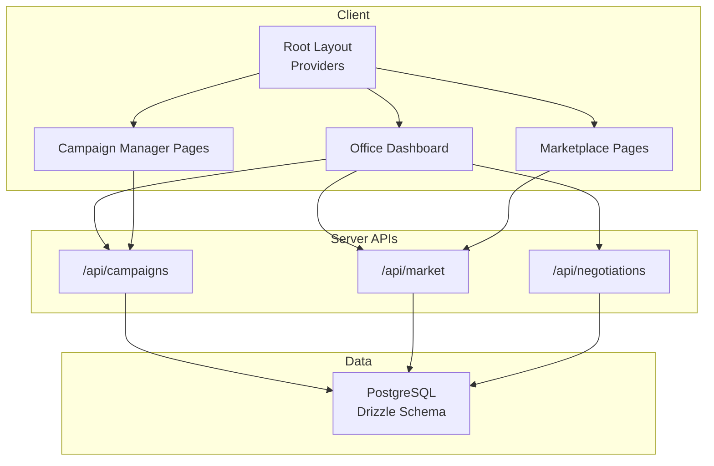
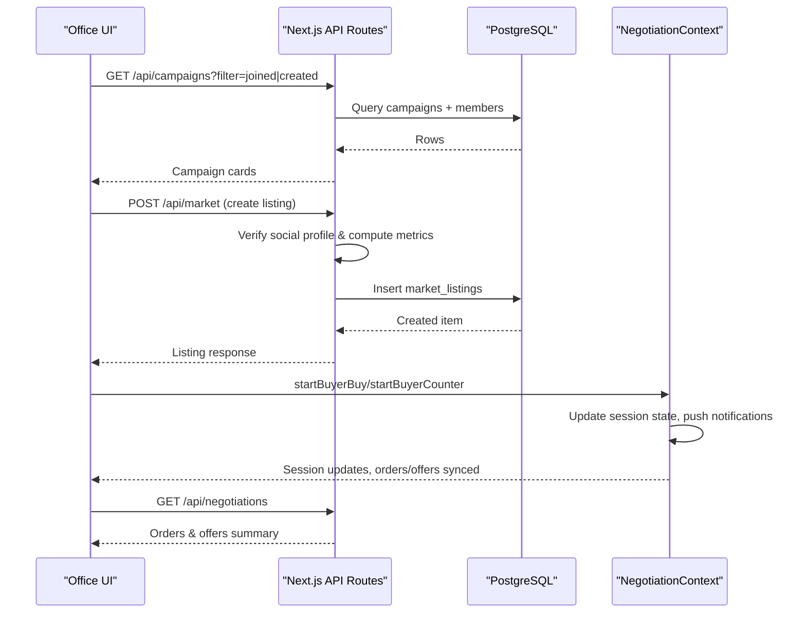
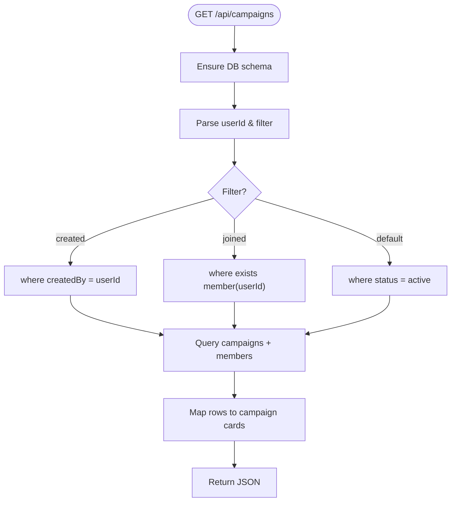
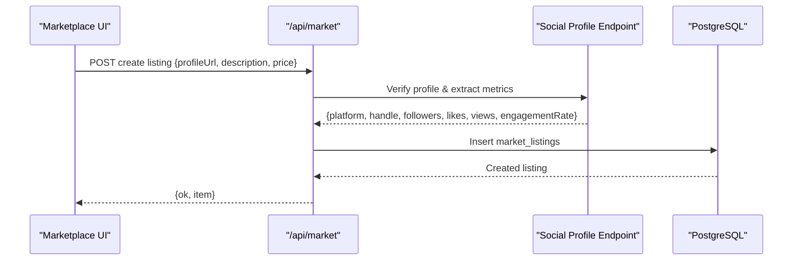
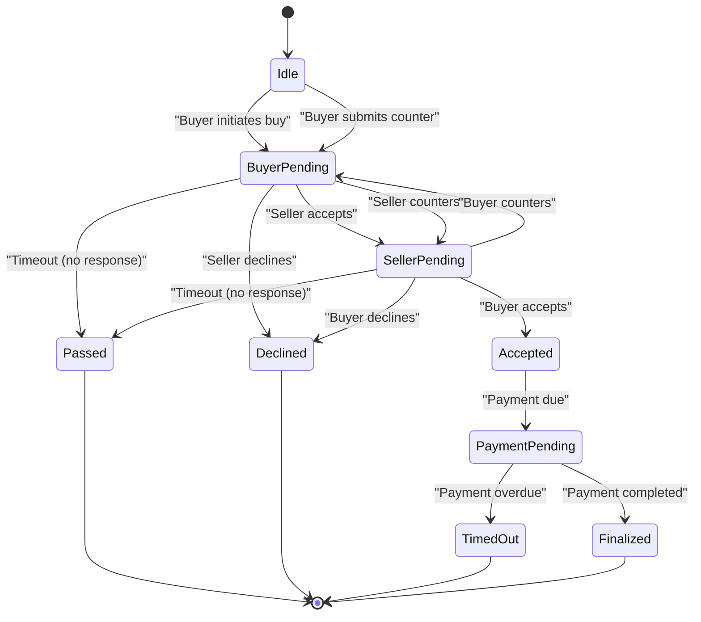
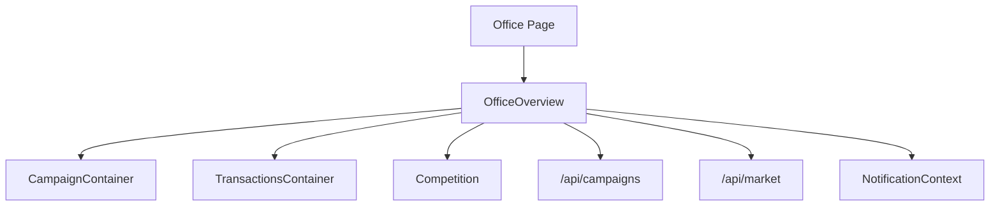
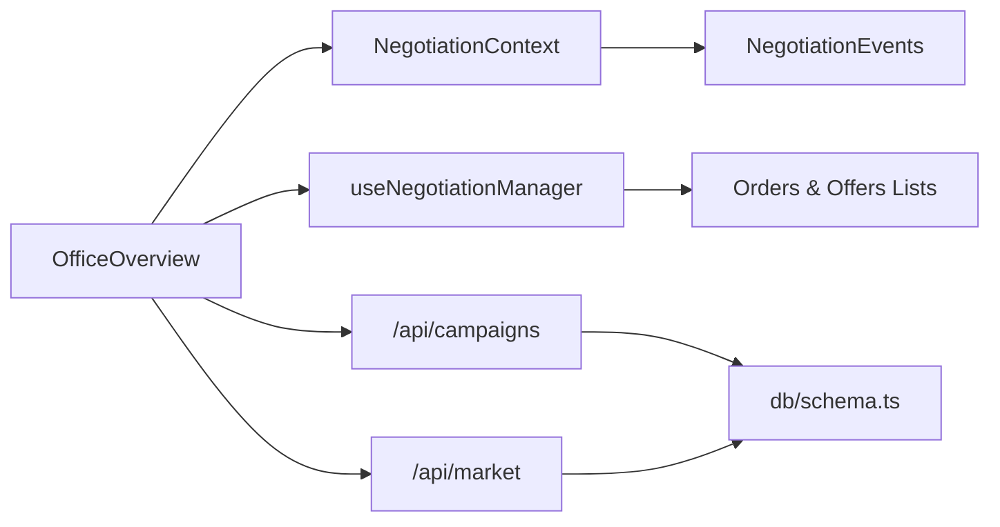

# Core Features

<cite>
**Referenced Files in This Document**
- [README.md](file://README.md)
- [package.json](file://package.json)
- [src/app/layout.tsx](file://src/app/layout.tsx)
- [src/db/schema.ts](file://src/db/schema.ts)
- [src/lib/campaigns.ts](file://src/lib/campaigns.ts)
- [src/lib/market.ts](file://src/lib/market.ts)
- [src/lib/negotiation.ts](file://src/lib/negotiation.ts)
- [src/app/api/campaigns/route.ts](file://src/app/api/campaigns/route.ts)
- [src/app/api/market/route.ts](file://src/app/api/market/route.ts)
- [src/app/api/negotiations/route.ts](file://src/app/api/negotiations/route.ts)
- [src/context/NegotiationContext.tsx](file://src/context/NegotiationContext.tsx)
- [src/hooks/useNegotiationManager.ts](file://src/hooks/useNegotiationManager.ts)
- [src/app/office/page.tsx](file://src/app/office/page.tsx)
- [src/components/office/OfficeOverview.tsx](file://src/components/office/OfficeOverview.tsx)
</cite>

## Table of Contents
1. Introduction
2. Project Structure
3. Core Components
4. Architecture Overview
5. Detailed Component Analysis
6. Dependency Analysis
7. Performance Considerations
8. Troubleshooting Guide
9. Conclusion

## Introduction
PortVille Market is a Next.js application that combines campaign management, a digital asset marketplace, and a real-time negotiation engine with an office dashboard for analytics and business insights. The system enables users to create and track promotional campaigns with budget allocation and member coordination, browse and list digital assets and services, negotiate offers through a stateful workflow, and monitor performance via dashboards.

The project uses Drizzle ORM with PostgreSQL for data persistence, React Context for client-side state (negotiations and notifications), and server routes for API endpoints. It runs on Node.js and can be started locally or deployed on Vercel.

**Section sources**
- [README.md:1-37](file://README.md#L1-L37)
- [package.json:1-45](file://package.json#L1-L45)

## Project Structure
At a high level, the app follows a feature-based layout:
- App routes under src/app define pages and API endpoints
- Shared logic resides in src/lib (campaigns, market, negotiations)
- UI components live under src/components (cards, office dashboard widgets)
- Client state providers are in src/context (negotiation, notifications)
- Data models and migrations are defined in src/db/schema.ts and drizzle/

**Diagram sources**
- [src/app/layout.tsx:1-43](file://src/app/layout.tsx#L1-L43)
- [src/app/api/campaigns/route.ts:1-142](file://src/app/api/campaigns/route.ts#L1-L142)
- [src/app/api/market/route.ts:1-262](file://src/app/api/market/route.ts#L1-L262)
- [src/app/api/negotiations/route.ts:1-13](file://src/app/api/negotiations/route.ts#L1-L13)
- [src/db/schema.ts:1-84](file://src/db/schema.ts#L1-L84)

**Section sources**
- [src/app/layout.tsx:1-43](file://src/app/layout.tsx#L1-L43)
- [src/db/schema.ts:1-84](file://src/db/schema.ts#L1-L84)

## Core Components
- Campaign Management: Create, filter, and join campaigns; track budgets and members; expose endpoints for listing and creation.
- Marketplace: Browse listings, create new listings by verifying social profiles, compute engagement metrics, and persist to database.
- Negotiation Engine: Client-side state machine managing buyer/seller interactions, counter-offers, timeouts, and payment flow; integrates with orders/offers lists and notifications.
- Office Dashboard: Aggregates finance state, campaign rankings, transactions, and account flows; visualizes growth and coverage.

**Section sources**
- [src/app/api/campaigns/route.ts:1-142](file://src/app/api/campaigns/route.ts#L1-L142)
- [src/lib/campaigns.ts:1-47](file://src/lib/campaigns.ts#L1-L47)
- [src/app/api/market/route.ts:1-262](file://src/app/api/market/route.ts#L1-L262)
- [src/lib/market.ts:1-50](file://src/lib/market.ts#L1-L50)
- [src/context/NegotiationContext.tsx:1-706](file://src/context/NegotiationContext.tsx#L1-L706)
- [src/hooks/useNegotiationManager.ts:1-201](file://src/hooks/useNegotiationManager.ts#L1-L201)
- [src/components/office/OfficeOverview.tsx:1-800](file://src/components/office/OfficeOverview.tsx#L1-L800)

## Architecture Overview
The application exposes REST-like endpoints for campaigns and marketplace operations, while negotiation state is managed client-side with periodic ticks for timeout handling. The office dashboard consumes both API data and shared context to present analytics.

**Diagram sources**
- [src/app/api/campaigns/route.ts:46-98](file://src/app/api/campaigns/route.ts#L46-L98)
- [src/app/api/market/route.ts:164-172](file://src/app/api/market/route.ts#L164-L172)
- [src/app/api/market/route.ts:174-262](file://src/app/api/market/route.ts#L174-L262)
- [src/context/NegotiationContext.tsx:267-378](file://src/context/NegotiationContext.tsx#L267-L378)
- [src/app/api/negotiations/route.ts:1-13](file://src/app/api/negotiations/route.ts#L1-L13)

## Detailed Component Analysis

### Campaign Management System
Purpose: Enable creators to launch promotional campaigns, allocate budgets, coordinate members, and track performance metrics such as views and likes generated.

Key behaviors:
- List campaigns with filters (active, created by user, joined by user).
- Create campaigns with validation and defaults.
- Map database rows to UI-friendly card data including platform requirements and payout ranges.
- Track membership via a separate table linking users to campaigns.

**Diagram sources**
- [src/app/api/campaigns/route.ts:46-98](file://src/app/api/campaigns/route.ts#L46-L98)

Practical example:
- Fetch joined campaigns for a demo user and display them in the office dashboard’s campaign leaderboard.
- Create a new campaign with title, description, category, niche hashtag, total budget, and time remaining days.

Business value:
- Centralized campaign lifecycle management with clear budget tracking and member coordination.
- Enables performance measurement via views and likes generated, supporting ROI analysis.

**Section sources**
- [src/app/api/campaigns/route.ts:1-142](file://src/app/api/campaigns/route.ts#L1-L142)
- [src/lib/campaigns.ts:1-47](file://src/lib/campaigns.ts#L1-L47)
- [src/db/schema.ts:3-35](file://src/db/schema.ts#L3-L35)

### Marketplace Platform
Purpose: Allow users to browse digital assets/services and list new items by validating social media profiles and computing engagement metrics.

Key behaviors:
- GET returns recent listings from the database.
- POST validates a social profile URL, extracts metrics (followers, likes, views, engagement rate), and persists a new listing.
- Computes estimated views based on followers, likes, and engagement rate.

**Diagram sources**
- [src/app/api/market/route.ts:174-262](file://src/app/api/market/route.ts#L174-L262)

Practical example:
- Create a listing for an Instagram profile; the system verifies the account, computes engagement rate, and stores it for browsing.
- Browse listings sorted by creation date with computed view estimates.

Business value:
- Streamlined listing creation with automated verification and metric computation reduces manual effort and improves data quality.
- Provides transparent pricing and engagement signals to buyers.

**Section sources**
- [src/app/api/market/route.ts:1-262](file://src/app/api/market/route.ts#L1-L262)
- [src/lib/market.ts:1-50](file://src/lib/market.ts#L1-L50)
- [src/db/schema.ts:58-73](file://src/db/schema.ts#L58-L73)

### Real-Time Negotiation Engine
Purpose: Manage buyer-seller negotiations with a state machine, counter-offer generation, cooldowns, daily limits, and timeout handling. Integrates with orders/offers lists and notifications.

Core states:
- idle, buyer-pending, seller-pending, accepted, declined, timed-out, passed, payment-pending, finalized

Key rules:
- Alternating counters between buyer and seller.
- Maximum discount per side increases with fewer counters; hard caps prevent abuse.
- Daily buy limit per buyer and cooldown periods after actions.
- Timeouts transition to passed/timed-out after inactivity or payment due date expiry.

**Diagram sources**
- [src/context/NegotiationContext.tsx:9-18](file://src/context/NegotiationContext.tsx#L9-L18)
- [src/context/NegotiationContext.tsx:181-252](file://src/context/NegotiationContext.tsx#L181-L252)
- [src/context/NegotiationContext.tsx:267-378](file://src/context/NegotiationContext.tsx#L267-L378)
- [src/context/NegotiationContext.tsx:380-512](file://src/context/NegotiationContext.tsx#L380-L512)
- [src/context/NegotiationContext.tsx:514-624](file://src/context/NegotiationContext.tsx#L514-L624)
- [src/context/NegotiationContext.tsx:626-669](file://src/context/NegotiationContext.tsx#L626-L669)

Practical example:
- Buyer clicks “Buy” on a marketplace listing; a negotiation session starts and an order appears in the shared list.
- Seller responds with accept/counter/decline; if counter, buyer can respond with accept/counter/decline.
- If no action within one day, negotiation passes or times out; payment pending requires completion within a day.

Business value:
- Enforces fair negotiation rules and prevents spamming via cooldowns and daily limits.
- Provides clear audit trails via events and notifications, improving transparency and trust.

**Section sources**
- [src/context/NegotiationContext.tsx:1-706](file://src/context/NegotiationContext.tsx#L1-L706)
- [src/hooks/useNegotiationManager.ts:1-201](file://src/hooks/useNegotiationManager.ts#L1-L201)
- [src/lib/negotiation.ts:1-50](file://src/lib/negotiation.ts#L1-L50)
- [src/app/api/negotiations/route.ts:1-13](file://src/app/api/negotiations/route.ts#L1-L13)

### Office Dashboard
Purpose: Provide analytics, monitoring, and business insights across campaigns, marketplace activity, finances, and transactions.

Key features:
- Campaign leaderboard and target coverage visualization.
- Channel health indicators over selectable timeframes.
- Recent income and offer/order activity summaries.
- Account flow with balance, deposit/withdraw actions, and payment methods.

**Diagram sources**
- [src/app/office/page.tsx:1-18](file://src/app/office/page.tsx#L1-L18)
- [src/components/office/OfficeOverview.tsx:1-800](file://src/components/office/OfficeOverview.tsx#L1-L800)
- [src/app/api/campaigns/route.ts:46-98](file://src/app/api/campaigns/route.ts#L46-L98)
- [src/app/api/market/route.ts:164-172](file://src/app/api/market/route.ts#L164-L172)

Practical example:
- Load joined campaigns to compute championship rankings and display leaderboards.
- Show channel health metrics and campaign reach against targets.
- Summarize orders and offers into activity sections with conversion rates.

Business value:
- Consolidates multi-faceted metrics into actionable insights for operators and managers.
- Supports strategic decisions around campaign targeting, resource allocation, and financial planning.

**Section sources**
- [src/app/office/page.tsx:1-18](file://src/app/office/page.tsx#L1-L18)
- [src/components/office/OfficeOverview.tsx:1-800](file://src/components/office/OfficeOverview.tsx#L1-L800)

## Dependency Analysis
The system exhibits clear separation between UI, API, and data layers with minimal coupling:
- UI components depend on context providers for negotiation and notifications.
- API routes depend on Drizzle schema and database client.
- Office dashboard composes multiple components and fetches data from APIs and context.

**Diagram sources**
- [src/components/office/OfficeOverview.tsx:1-800](file://src/components/office/OfficeOverview.tsx#L1-L800)
- [src/context/NegotiationContext.tsx:1-706](file://src/context/NegotiationContext.tsx#L1-L706)
- [src/hooks/useNegotiationManager.ts:1-201](file://src/hooks/useNegotiationManager.ts#L1-L201)
- [src/app/api/campaigns/route.ts:1-142](file://src/app/api/campaigns/route.ts#L1-L142)
- [src/app/api/market/route.ts:1-262](file://src/app/api/market/route.ts#L1-L262)
- [src/db/schema.ts:1-84](file://src/db/schema.ts#L1-L84)

**Section sources**
- [src/components/office/OfficeOverview.tsx:1-800](file://src/components/office/OfficeOverview.tsx#L1-L800)
- [src/context/NegotiationContext.tsx:1-706](file://src/context/NegotiationContext.tsx#L1-L706)
- [src/hooks/useNegotiationManager.ts:1-201](file://src/hooks/useNegotiationManager.ts#L1-L201)
- [src/app/api/campaigns/route.ts:1-142](file://src/app/api/campaigns/route.ts#L1-L142)
- [src/app/api/market/route.ts:1-262](file://src/app/api/market/route.ts#L1-L262)
- [src/db/schema.ts:1-84](file://src/db/schema.ts#L1-L84)

## Performance Considerations
- Database queries are limited and ordered efficiently (e.g., limit 20 for campaigns, limit 12 for market listings).
- Social profile verification includes fallbacks when the database is unavailable, preventing blocking failures.
- Client-side negotiation uses intervals sparingly (30-second tick) and local storage for persistence to reduce re-renders and network calls.
- Engagement metrics are computed once during listing creation to avoid repeated heavy calculations.

[No sources needed since this section provides general guidance]

## Troubleshooting Guide
Common issues and resolutions:
- Campaign API errors: Check headers for x-user-id and ensure database schema is initialized before querying.
- Market listing creation fails: Validate profile URL format and ensure the social platform is supported; verify network access to external endpoints.
- Negotiation timeouts: Confirm sessions have updatedAt timestamps and paymentDueAt values; review interval cleanup to avoid stale timers.
- Office dashboard missing data: Ensure API routes return valid JSON and that NotificationContext has orders/offers populated.

**Section sources**
- [src/app/api/campaigns/route.ts:94-98](file://src/app/api/campaigns/route.ts#L94-L98)
- [src/app/api/market/route.ts:174-262](file://src/app/api/market/route.ts#L174-L262)
- [src/context/NegotiationContext.tsx:181-252](file://src/context/NegotiationContext.tsx#L181-L252)

## Conclusion
PortVille Market integrates campaign management, marketplace operations, and a robust negotiation engine with an analytics-rich office dashboard. The architecture separates concerns cleanly, enforces business rules at both client and server layers, and provides practical workflows for creators, sellers, and operators. By leveraging verified social metrics, stateful negotiations, and comprehensive dashboards, the platform delivers measurable business value through improved efficiency, transparency, and insight-driven decision-making.

[No sources needed since this section summarizes without analyzing specific files]