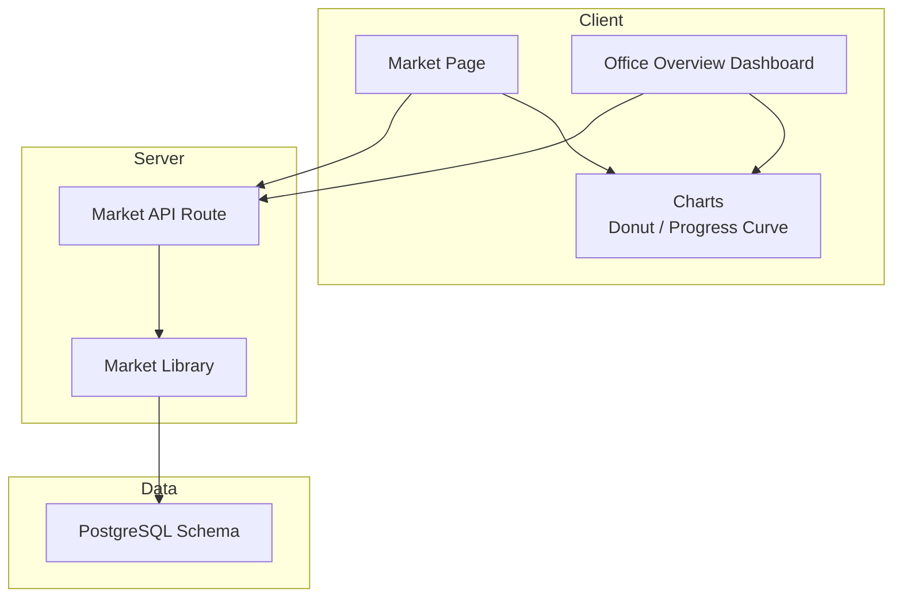
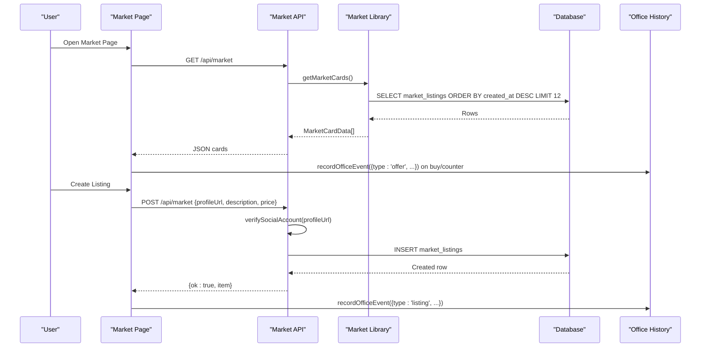
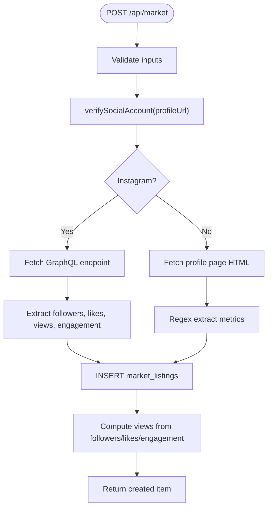
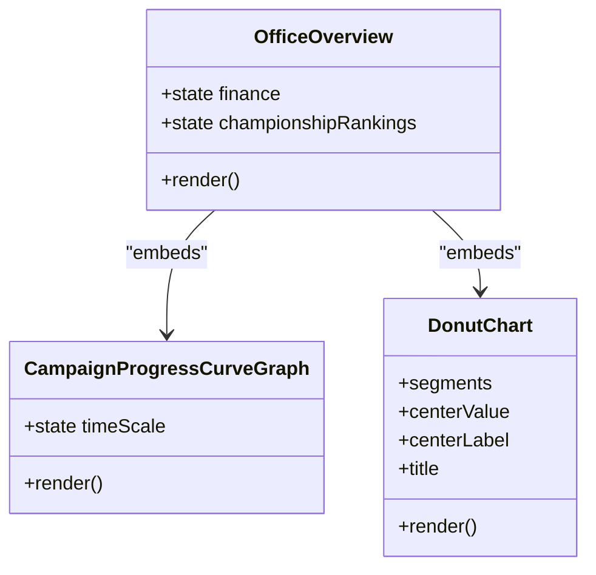
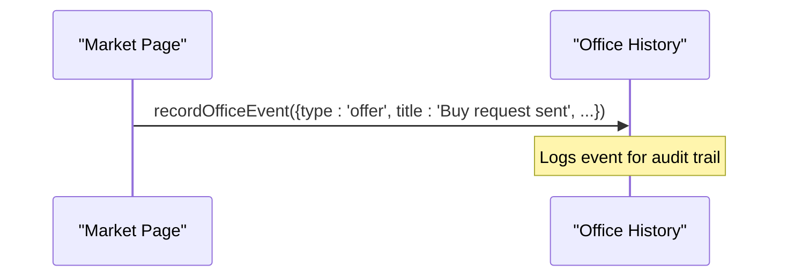
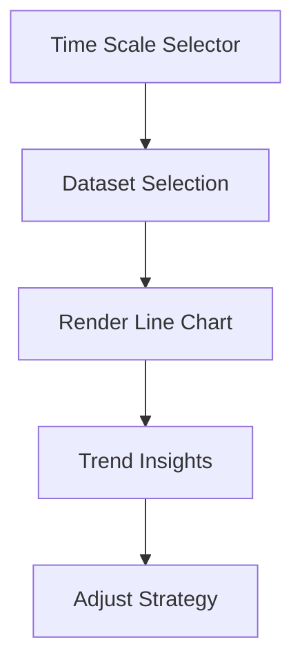
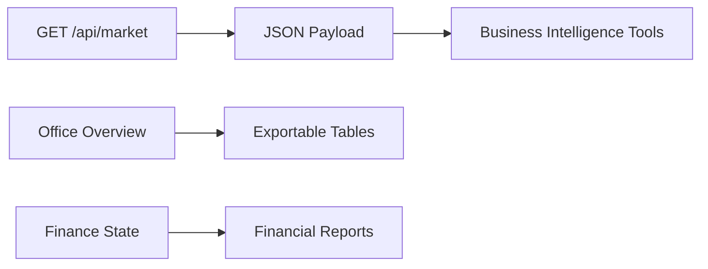
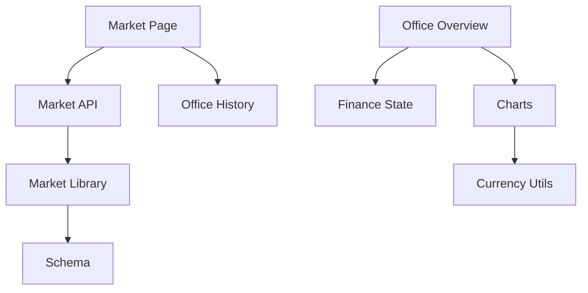

# Market Analytics & Performance

<cite>
**Referenced Files in This Document**
- [market.ts](file://src/lib/market.ts)
- [route.ts](file://src/app/api/market/route.ts)
- [schema.ts](file://src/db/schema.ts)
- [page.tsx](file://src/app/market/page.tsx)
- [DonutChart.tsx](file://src/components/DonutChart.tsx)
- [OfficeOverview.tsx](file://src/components/office/OfficeOverview.tsx)
- [CampaignProgressCurveGraph.tsx](file://src/components/office/CampaignProgressCurveGraph.tsx)
- [currency.ts](file://src/lib/currency.ts)
- [finance.ts](file://src/lib/finance.ts)
- [office-history.ts](file://src/lib/office-history.ts)
- [types.ts](file://src/types.ts)
</cite>

## Table of Contents
1. [Introduction](#introduction)
2. [Project Structure](#project-structure)
3. [Core Components](#core-components)
4. [Architecture Overview](#architecture-overview)
5. [Detailed Component Analysis](#detailed-component-analysis)
6. [Dependency Analysis](#dependency-analysis)
7. [Performance Considerations](#performance-considerations)
8. [Troubleshooting Guide](#troubleshooting-guide)
9. [Conclusion](#conclusion)
10. [Appendices](#appendices)

## Introduction
This document explains how the application collects, aggregates, and visualizes market analytics and performance metrics for marketplace activities such as views, likes, engagement rates, conversion indicators, and seller performance signals. It covers:
- Metrics collection for marketplace listings and social profile verification
- Dashboard components and chart visualizations
- Data aggregation strategies and historical trend analysis
- Event tracking integration with office history for audit trails
- Key performance indicators (KPIs), trends, and export-ready data patterns for business intelligence

## Project Structure
The analytics capability spans server routes, data models, client pages, and reusable visualization components:
- Server API exposes endpoints to read and create market listings and verifies social profiles to enrich metrics
- Database schema defines tables for market listings and engagement events
- Client page fetches and renders marketplace cards and triggers event recording
- Office overview dashboard provides charts and KPIs for campaign and channel health
- Reusable charts render donut segments and progress curves for views and likes over time

**Diagram sources**
- [page.tsx:24-38](file://src/app/market/page.tsx#L24-L38)
- [route.ts:164-172](file://src/app/api/market/route.ts#L164-L172)
- [market.ts:43-49](file://src/lib/market.ts#L43-L49)
- [schema.ts:58-83](file://src/db/schema.ts#L58-L83)
- [OfficeOverview.tsx:147-174](file://src/components/office/OfficeOverview.tsx#L147-L174)
- [CampaignProgressCurveGraph.tsx:9-28](file://src/components/office/CampaignProgressCurveGraph.tsx#L9-L28)
- [DonutChart.tsx:22-29](file://src/components/DonutChart.tsx#L22-L29)

**Section sources**
- [page.tsx:24-38](file://src/app/market/page.tsx#L24-L38)
- [route.ts:164-172](file://src/app/api/market/route.ts#L164-L172)
- [market.ts:43-49](file://src/lib/market.ts#L43-L49)
- [schema.ts:58-83](file://src/db/schema.ts#L58-L83)
- [OfficeOverview.tsx:147-174](file://src/components/office/OfficeOverview.tsx#L147-L174)
- [CampaignProgressCurveGraph.tsx:9-28](file://src/components/office/CampaignProgressCurveGraph.tsx#L9-L28)
- [DonutChart.tsx:22-29](file://src/components/DonutChart.tsx#L22-L29)

## Core Components
- Market API route: GET returns market cards; POST creates a listing after verifying a social profile URL and computing derived metrics like views and engagement rate
- Market library: maps database rows to UI-friendly card data and computes estimated views from followers, likes, and engagement rate
- Office overview dashboard: displays campaign rankings, channel health, recent income, and conversion summaries
- Campaign progress curve graph: renders time-series of views and likes across days/months/years
- Donut chart: visualizes segment proportions with center value and legend
- Currency utilities: format compact values for display
- Finance state: persists account balances and related metrics in local storage
- Office history: records events for audit trails

**Section sources**
- [route.ts:174-261](file://src/app/api/market/route.ts#L174-L261)
- [market.ts:7-49](file://src/lib/market.ts#L7-L49)
- [OfficeOverview.tsx:313-350](file://src/components/office/OfficeOverview.tsx#L313-L350)
- [CampaignProgressCurveGraph.tsx:12-28](file://src/components/office/CampaignProgressCurveGraph.tsx#L12-L28)
- [DonutChart.tsx:22-29](file://src/components/DonutChart.tsx#L22-L29)
- [currency.ts:33-47](file://src/lib/currency.ts#L33-L47)
- [finance.ts:19-49](file://src/lib/finance.ts#L19-L49)
- [office-history.ts:5-7](file://src/lib/office-history.ts#L5-L7)

## Architecture Overview
The analytics pipeline integrates client interactions, server-side verification and persistence, and dashboard visualizations.

**Diagram sources**
- [page.tsx:24-38](file://src/app/market/page.tsx#L24-L38)
- [page.tsx:42-69](file://src/app/market/page.tsx#L42-L69)
- [route.ts:164-172](file://src/app/api/market/route.ts#L164-L172)
- [route.ts:174-261](file://src/app/api/market/route.ts#L174-L261)
- [market.ts:43-49](file://src/lib/market.ts#L43-L49)
- [schema.ts:58-73](file://src/db/schema.ts#L58-L73)
- [office-history.ts:5-7](file://src/lib/office-history.ts#L5-L7)

## Detailed Component Analysis

### Market Listings and Metrics Collection
- Views computation: Derived from followers, likes, and engagement rate using a deterministic formula that ensures a minimum baseline
- Mapping to UI model: Database rows are normalized into a consistent card type including current and previous ratios for engagement and view leverage
- Social profile verification: For Instagram, specialized scraping is used; otherwise, generic HTML parsing extracts follower counts, likes, views, and engagement percentages
- Persistence: New listings are stored with platform metadata, handle, follower/like counts, engagement rate, niche, and creator ID

**Diagram sources**
- [route.ts:72-162](file://src/app/api/market/route.ts#L72-L162)
- [route.ts:193-251](file://src/app/api/market/route.ts#L193-L251)
- [market.ts:7-9](file://src/lib/market.ts#L7-L9)
- [schema.ts:58-73](file://src/db/schema.ts#L58-L73)

**Section sources**
- [route.ts:72-162](file://src/app/api/market/route.ts#L72-L162)
- [route.ts:193-251](file://src/app/api/market/route.ts#L193-L251)
- [market.ts:7-49](file://src/lib/market.ts#L7-L49)
- [schema.ts:58-73](file://src/db/schema.ts#L58-L73)

### Dashboard Components and Visualizations
- Office Overview: Displays campaign leaderboard, channel health bars, recent income totals, and conversion summaries
- Campaign Progress Curve Graph: Time-series line chart for views and likes with selectable time scales
- Donut Chart: Segment-based visualization with center metric and legend

**Diagram sources**
- [OfficeOverview.tsx:147-174](file://src/components/office/OfficeOverview.tsx#L147-L174)
- [CampaignProgressCurveGraph.tsx:9-28](file://src/components/office/CampaignProgressCurveGraph.tsx#L9-L28)
- [DonutChart.tsx:22-29](file://src/components/DonutChart.tsx#L22-L29)

**Section sources**
- [OfficeOverview.tsx:313-350](file://src/components/office/OfficeOverview.tsx#L313-L350)
- [CampaignProgressCurveGraph.tsx:12-28](file://src/components/office/CampaignProgressCurveGraph.tsx#L12-L28)
- [DonutChart.tsx:22-29](file://src/components/DonutChart.tsx#L22-L29)

### Event Tracking and Audit Trails
- On buyer actions (buy or counter offer), the market page records an office event with context such as type, title, description, and status
- The office history module currently logs events to the console; this can be extended to persist structured audit entries

**Diagram sources**
- [page.tsx:42-69](file://src/app/market/page.tsx#L42-L69)
- [office-history.ts:5-7](file://src/lib/office-history.ts#L5-L7)

**Section sources**
- [page.tsx:42-69](file://src/app/market/page.tsx#L42-L69)
- [office-history.ts:5-7](file://src/lib/office-history.ts#L5-L7)

### Historical Data Analysis and Trends
- Campaign progress curve supports multiple time scales (days, months, years) to analyze trends in views and likes
- Channel health tracks provide percentage-based metrics for CV strength and campaign engagement over selectable periods
- Conversion summaries compute average conversion rates based on completed vs total transactions

**Diagram sources**
- [CampaignProgressCurveGraph.tsx:9-28](file://src/components/office/CampaignProgressCurveGraph.tsx#L9-L28)
- [OfficeOverview.tsx:24-59](file://src/components/office/OfficeOverview.tsx#L24-L59)
- [OfficeOverview.tsx:313-350](file://src/components/office/OfficeOverview.tsx#L313-L350)

**Section sources**
- [CampaignProgressCurveGraph.tsx:9-28](file://src/components/office/CampaignProgressCurveGraph.tsx#L9-L28)
- [OfficeOverview.tsx:24-59](file://src/components/office/OfficeOverview.tsx#L24-L59)
- [OfficeOverview.tsx:313-350](file://src/components/office/OfficeOverview.tsx#L313-L350)

### Export Functionality for Business Intelligence
- The API returns structured JSON payloads suitable for export to BI tools
- Client pages assemble normalized card objects with all relevant metrics for downstream processing
- Financial state and formatted values support reporting dashboards

**Diagram sources**
- [route.ts:164-172](file://src/app/api/market/route.ts#L164-L172)
- [market.ts:43-49](file://src/lib/market.ts#L43-L49)
- [currency.ts:33-47](file://src/lib/currency.ts#L33-L47)
- [finance.ts:19-49](file://src/lib/finance.ts#L19-L49)

**Section sources**
- [route.ts:164-172](file://src/app/api/market/route.ts#L164-L172)
- [market.ts:43-49](file://src/lib/market.ts#L43-L49)
- [currency.ts:33-47](file://src/lib/currency.ts#L33-L47)
- [finance.ts:19-49](file://src/lib/finance.ts#L19-L49)

## Dependency Analysis
Key dependencies and relationships:
- Market page depends on the market API and office history for event logging
- Market API depends on market library for data mapping and database schema for persistence
- Office dashboard depends on finance state and reusable charts for visualization
- Currency utilities are shared across formatting needs

**Diagram sources**
- [page.tsx:24-38](file://src/app/market/page.tsx#L24-L38)
- [page.tsx:42-69](file://src/app/market/page.tsx#L42-L69)
- [route.ts:164-172](file://src/app/api/market/route.ts#L164-L172)
- [market.ts:43-49](file://src/lib/market.ts#L43-L49)
- [schema.ts:58-83](file://src/db/schema.ts#L58-L83)
- [OfficeOverview.tsx:147-174](file://src/components/office/OfficeOverview.tsx#L147-L174)
- [DonutChart.tsx:22-29](file://src/components/DonutChart.tsx#L22-L29)
- [currency.ts:33-47](file://src/lib/currency.ts#L33-L47)
- [finance.ts:19-49](file://src/lib/finance.ts#L19-L49)

**Section sources**
- [page.tsx:24-38](file://src/app/market/page.tsx#L24-L38)
- [route.ts:164-172](file://src/app/api/market/route.ts#L164-L172)
- [market.ts:43-49](file://src/lib/market.ts#L43-L49)
- [schema.ts:58-83](file://src/db/schema.ts#L58-L83)
- [OfficeOverview.tsx:147-174](file://src/components/office/OfficeOverview.tsx#L147-L174)
- [DonutChart.tsx:22-29](file://src/components/DonutChart.tsx#L22-L29)
- [currency.ts:33-47](file://src/lib/currency.ts#L33-L47)
- [finance.ts:19-49](file://src/lib/finance.ts#L19-L49)

## Performance Considerations
- Views calculation uses simple arithmetic operations and avoids heavy computations
- Social profile verification includes fallback logic when the database is unavailable, ensuring resilience
- Chart rendering uses lightweight SVG paths and minimal re-renders via state toggles
- Formatting functions use efficient suffix calculations for large numbers
- Local storage usage for finance state reduces server load and improves responsiveness

[No sources needed since this section provides general guidance]

## Troubleshooting Guide
- If market cards fail to load, check network responses and ensure the API route is reachable
- When creating listings, invalid or unsupported social profile URLs will raise validation errors; ensure the URL belongs to supported platforms and contains a valid handle
- If social verification fails, confirm the profile exists and is not private; the system checks for common “not found” signals
- For event logging, verify that office history recording is wired correctly if you extend it beyond console logging

**Section sources**
- [route.ts:174-261](file://src/app/api/market/route.ts#L174-L261)
- [office-history.ts:5-7](file://src/lib/office-history.ts#L5-L7)

## Conclusion
The application provides a cohesive analytics and performance tracking system for marketplace activities:
- Robust metrics collection via social profile verification and database-backed listings
- Rich dashboard visualizations for campaign performance, channel health, and financial summaries
- Event tracking integrated with office history for auditability
- Export-ready data structures enabling business intelligence workflows

[No sources needed since this section summarizes without analyzing specific files]

## Appendices

### Key Performance Indicators (KPIs)
- Engagement Rate: Derived from likes and comments relative to followers
- Estimated Views: Computed from followers, likes, and engagement rate with a minimum threshold
- Conversion Rate: Ratio of completed transactions to total attempts
- Seller Performance Signals: Follower count, likes, engagement rate, and rating indicators

**Section sources**
- [market.ts:7-49](file://src/lib/market.ts#L7-L49)
- [OfficeOverview.tsx:313-350](file://src/components/office/OfficeOverview.tsx#L313-L350)
- [types.ts:75-86](file://src/types.ts#L75-L86)

### Data Models Summary
- Market listings include platform, handle, followers, likes, engagement rate, niche, creator, and timestamps
- Engagement events capture entity types, actors, actions, and messages for audit trails

**Section sources**
- [schema.ts:58-83](file://src/db/schema.ts#L58-L83)