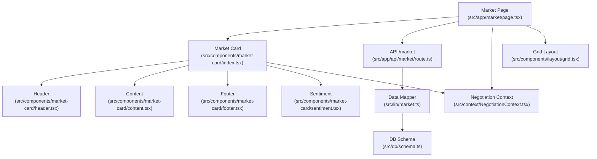
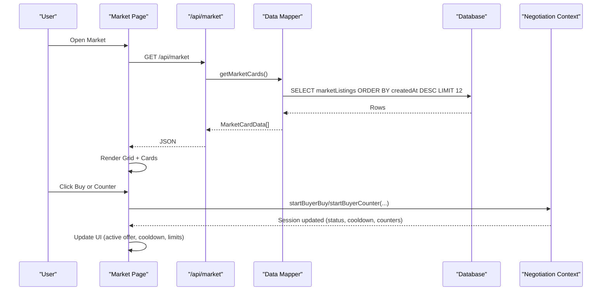
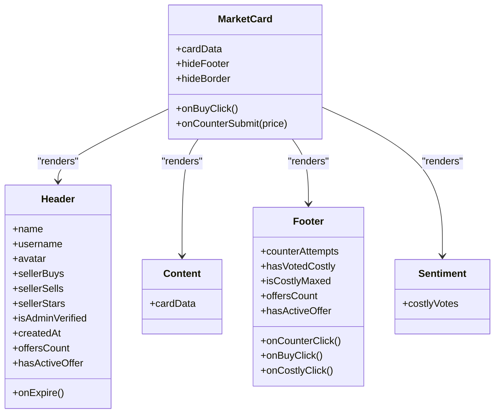
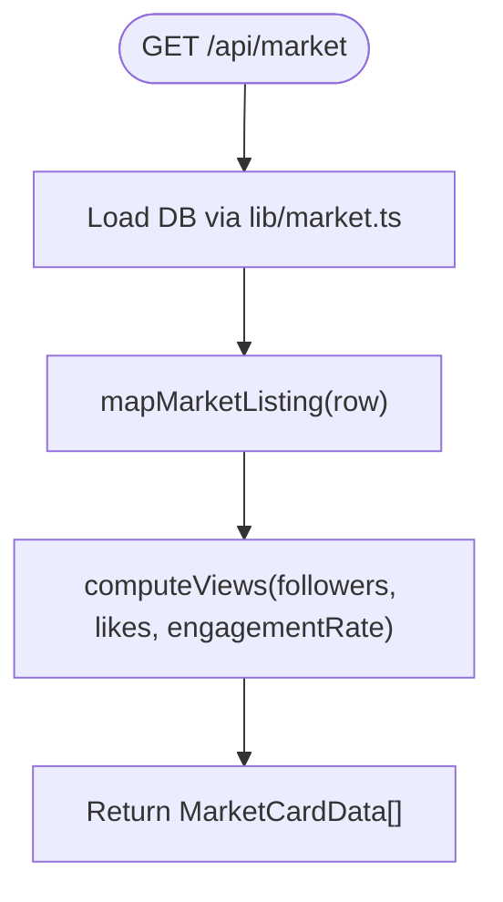
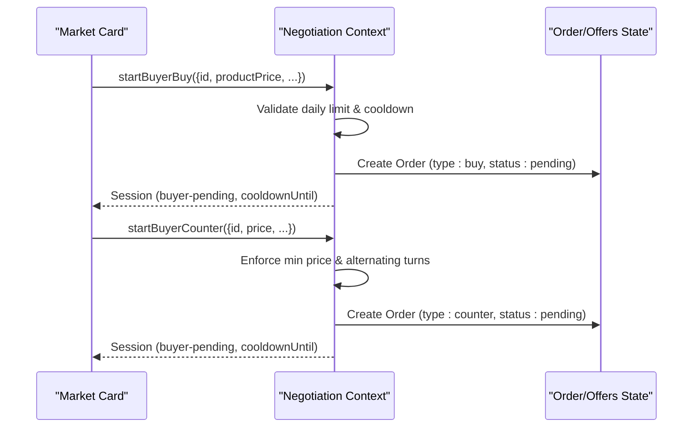
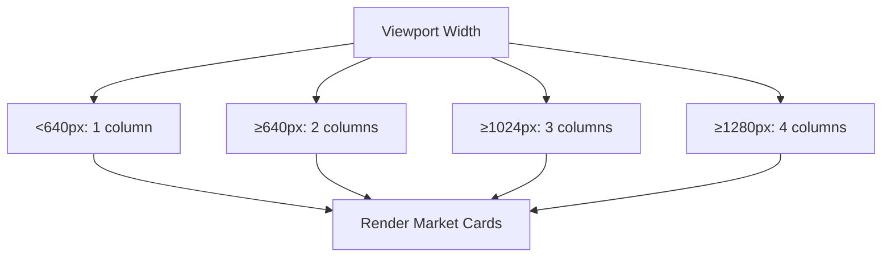
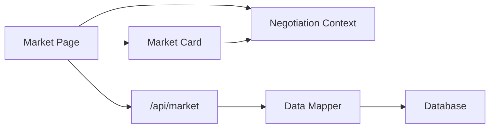

# Market Browsing & Discovery

<cite>
**Referenced Files in This Document**
- [src/app/market/page.tsx](file://src/app/market/page.tsx)
- [src/components/market-card/index.tsx](file://src/components/market-card/index.tsx)
- [src/components/market-card/header.tsx](file://src/components/market-card/header.tsx)
- [src/components/market-card/content.tsx](file://src/components/market-card/content.tsx)
- [src/components/market-card/footer.tsx](file://src/components/market-card/footer.tsx)
- [src/components/market-card/sentiment.tsx](file://src/components/market-card/sentiment.tsx)
- [src/lib/market.ts](file://src/lib/market.ts)
- [src/app/api/market/route.ts](file://src/app/api/market/route.ts)
- [src/context/NegotiationContext.tsx](file://src/context/NegotiationContext.tsx)
- [src/types.ts](file://src/types.ts)
- [src/types/market.ts](file://src/types/market.ts)
- [src/components/layout/grid.tsx](file://src/components/layout/grid.tsx)
</cite>

## Table of Contents
1. [Introduction](#introduction)
2. [Project Structure](#project-structure)
3. [Core Components](#core-components)
4. [Architecture Overview](#architecture-overview)
5. [Detailed Component Analysis](#detailed-component-analysis)
6. [Dependency Analysis](#dependency-analysis)
7. [Performance Considerations](#performance-considerations)
8. [Troubleshooting Guide](#troubleshooting-guide)
9. [Conclusion](#conclusion)

## Introduction
This document describes the Market Browsing and Discovery interface, focusing on:
- The main market page layout and responsive grid rendering
- The market card component hierarchy (header, content, footer, sentiment)
- Filtering, sorting, and pagination strategies
- Integration with the negotiation context for buy actions and counter-offer submissions
- Examples of data display and user interaction patterns
- Performance optimizations for large datasets

The goal is to provide both a high-level understanding and code-level insights so that developers can extend or maintain the feature effectively.

## Project Structure
The market browsing feature spans several layers:
- UI layer: Next.js client components for the market page and market cards
- Data layer: API route and server-side mapping from database rows to UI types
- State layer: Negotiation context managing sessions, cooldowns, and notifications
- Types: Shared interfaces for market cards, orders, and offers

**Diagram sources**
- [src/app/market/page.tsx:1-159](file://src/app/market/page.tsx#L1-L159)
- [src/components/market-card/index.tsx:1-158](file://src/components/market-card/index.tsx#L1-L158)
- [src/components/market-card/header.tsx:1-133](file://src/components/market-card/header.tsx#L1-L133)
- [src/components/market-card/content.tsx:1-110](file://src/components/market-card/content.tsx#L1-L110)
- [src/components/market-card/footer.tsx:1-56](file://src/components/market-card/footer.tsx#L1-L56)
- [src/components/market-card/sentiment.tsx:1-63](file://src/components/market-card/sentiment.tsx#L1-L63)
- [src/app/api/market/route.ts:1-262](file://src/app/api/market/route.ts#L1-L262)
- [src/lib/market.ts:1-50](file://src/lib/market.ts#L1-L50)
- [src/components/layout/grid.tsx:1-21](file://src/components/layout/grid.tsx#L1-L21)

**Section sources**
- [src/app/market/page.tsx:1-159](file://src/app/market/page.tsx#L1-L159)
- [src/components/layout/grid.tsx:1-21](file://src/components/layout/grid.tsx#L1-L21)

## Core Components
- Market Page: Loads listings via API, renders a responsive grid of market cards, handles listing creation modal, and wires up buy/counter actions to the negotiation context.
- Market Card: Composes header, content, sentiment, and footer; manages local state for price input, offer counts, cooldown timers, and active offer indicators.
- Header: Displays seller info, verification badge, star rating, live stock status, countdown timer, and offer count limits.
- Content: Shows description, handle, followers, views, engagement ratio (ER), likes, and view-to-like ratio (V/L).
- Footer: Provides Buy, Counter, and Costly vote buttons with disabled states based on limits and active offers.
- Sentiment: Visualizes community sentiment (“Bad Fit”) with thresholds and progress bar.
- API Route: Serves GET for listings and POST for creating new listings with social profile verification and DB persistence.
- Data Mapper: Converts DB rows into UI-friendly MarketCardData with computed views and ratios.
- Negotiation Context: Manages sessions, cooldowns, daily action limits, and synchronizes orders/offers across contexts.

**Section sources**
- [src/app/market/page.tsx:1-159](file://src/app/market/page.tsx#L1-L159)
- [src/components/market-card/index.tsx:1-158](file://src/components/market-card/index.tsx#L1-L158)
- [src/components/market-card/header.tsx:1-133](file://src/components/market-card/header.tsx#L1-L133)
- [src/components/market-card/content.tsx:1-110](file://src/components/market-card/content.tsx#L1-L110)
- [src/components/market-card/footer.tsx:1-56](file://src/components/market-card/footer.tsx#L1-L56)
- [src/components/market-card/sentiment.tsx:1-63](file://src/components/market-card/sentiment.tsx#L1-L63)
- [src/app/api/market/route.ts:1-262](file://src/app/api/market/route.ts#L1-L262)
- [src/lib/market.ts:1-50](file://src/lib/market.ts#L1-L50)
- [src/context/NegotiationContext.tsx:1-706](file://src/context/NegotiationContext.tsx#L1-L706)

## Architecture Overview
The market browsing flow integrates UI, API, data mapping, and negotiation state:

**Diagram sources**
- [src/app/market/page.tsx:24-38](file://src/app/market/page.tsx#L24-L38)
- [src/app/api/market/route.ts:164-172](file://src/app/api/market/route.ts#L164-L172)
- [src/lib/market.ts:43-49](file://src/lib/market.ts#L43-L49)
- [src/context/NegotiationContext.tsx:267-378](file://src/context/NegotiationContext.tsx#L267-L378)

## Detailed Component Analysis

### Market Page
- Loads market listings from /api/market and filters visible cards by offersCount < 12 to enforce per-card offer caps.
- Renders a responsive grid using Tailwind classes directly in the page.
- Integrates ListingModal for publishing new listings and appends newly created cards locally after success.
- Wires buy and counter actions to the negotiation context and records office events for auditability.

Key behaviors:
- Dynamic import of MarketCard to defer non-critical JS.
- Error handling for API failures with fallback empty state.
- Local state updates for newly published listings.

**Section sources**
- [src/app/market/page.tsx:12-38](file://src/app/market/page.tsx#L12-L38)
- [src/app/market/page.tsx:40-69](file://src/app/market/page.tsx#L40-L69)
- [src/app/market/page.tsx:71-159](file://src/app/market/page.tsx#L71-L159)

### Market Card Component Hierarchy
- index.tsx orchestrates session state, dynamic discount floors, cooldown timers, and local UI state (price input, live offers, costly votes).
- header.tsx shows seller identity, verification, ratings, live stock badge, countdown timer, and offer cap indicator.
- content.tsx displays metrics like followers, views, ER, likes, V/L with color-coded efficiency indicators.
- footer.tsx exposes Buy, Counter, and Costly vote buttons with conditional disabling based on limits and active offers.
- sentiment.tsx visualizes “Bad Fit” sentiment with thresholds and a progress bar.

Important logic:
- Dynamic max discount floor increases with each buyer counter attempt (40%, 30%, 15%).
- Cooldown enforcement prevents rapid re-submissions.
- Active offer banners reflect negotiation status from context.

**Diagram sources**
- [src/components/market-card/index.tsx:1-158](file://src/components/market-card/index.tsx#L1-L158)
- [src/components/market-card/header.tsx:1-133](file://src/components/market-card/header.tsx#L1-L133)
- [src/components/market-card/content.tsx:1-110](file://src/components/market-card/content.tsx#L1-L110)
- [src/components/market-card/footer.tsx:1-56](file://src/components/market-card/footer.tsx#L1-L56)
- [src/components/market-card/sentiment.tsx:1-63](file://src/components/market-card/sentiment.tsx#L1-L63)

**Section sources**
- [src/components/market-card/index.tsx:20-81](file://src/components/market-card/index.tsx#L20-L81)
- [src/components/market-card/header.tsx:20-133](file://src/components/market-card/header.tsx#L20-L133)
- [src/components/market-card/content.tsx:11-110](file://src/components/market-card/content.tsx#L11-L110)
- [src/components/market-card/footer.tsx:17-56](file://src/components/market-card/footer.tsx#L17-L56)
- [src/components/market-card/sentiment.tsx:10-63](file://src/components/market-card/sentiment.tsx#L10-L63)

### API and Data Mapping
- GET /api/market returns market listings mapped to MarketCardData via lib/market.ts.
- POST /api/market validates and verifies social profiles, persists to DB, and returns item metadata.
- Data mapper computes views from followers, likes, and engagement rate and normalizes fields for UI consumption.

**Diagram sources**
- [src/app/api/market/route.ts:164-172](file://src/app/api/market/route.ts#L164-L172)
- [src/lib/market.ts:7-49](file://src/lib/market.ts#L7-L49)

**Section sources**
- [src/app/api/market/route.ts:164-172](file://src/app/api/market/route.ts#L164-L172)
- [src/lib/market.ts:7-49](file://src/lib/market.ts#L7-L49)

### Negotiation Context Integration
- startBuyerBuy creates a buyer-pending session, sets payment due date, applies cooldown, increments daily buy count, and syncs order state.
- startBuyerCounter enforces alternating turns, minimum price thresholds based on counter attempts, and updates session and order state.
- Background tick updates expired negotiations to passed/timed-out and syncs orders/offers accordingly.

**Diagram sources**
- [src/context/NegotiationContext.tsx:267-378](file://src/context/NegotiationContext.tsx#L267-L378)
- [src/context/NegotiationContext.tsx:181-252](file://src/context/NegotiationContext.tsx#L181-L252)

**Section sources**
- [src/context/NegotiationContext.tsx:267-378](file://src/context/NegotiationContext.tsx#L267-L378)
- [src/context/NegotiationContext.tsx:181-252](file://src/context/NegotiationContext.tsx#L181-L252)

### Responsive Design Patterns
- The market page uses inline Tailwind grid classes to render 1–4 columns depending on viewport size.
- A reusable Grid component demonstrates a consistent multi-column engine with auto row heights for alignment.
- Cards are constrained to a maximum width and styled with borders and spacing for readability.

[No sources needed since this diagram shows conceptual workflow, not actual code structure]

**Section sources**
- [src/app/market/page.tsx:104-114](file://src/app/market/page.tsx#L104-L114)
- [src/components/layout/grid.tsx:8-21](file://src/components/layout/grid.tsx#L8-L21)

## Dependency Analysis
- Market Page depends on:
  - API route for fetching listings
  - Market Card components for rendering
  - Negotiation Context for buy/counter actions
  - Listing Modal for publishing new items
- Market Card depends on:
  - Negotiation Context for session state and cooldowns
  - Currency formatter for price display
  - Header/Content/Footer/Sentiment subcomponents
- API route depends on:
  - Data mapper for transforming DB rows
  - Database schema for persistence
  - Social profile verification utilities

**Diagram sources**
- [src/app/market/page.tsx:1-159](file://src/app/market/page.tsx#L1-L159)
- [src/components/market-card/index.tsx:1-158](file://src/components/market-card/index.tsx#L1-L158)
- [src/app/api/market/route.ts:1-262](file://src/app/api/market/route.ts#L1-L262)
- [src/lib/market.ts:1-50](file://src/lib/market.ts#L1-L50)

**Section sources**
- [src/app/market/page.tsx:1-159](file://src/app/market/page.tsx#L1-L159)
- [src/components/market-card/index.tsx:1-158](file://src/components/market-card/index.tsx#L1-L158)
- [src/app/api/market/route.ts:1-262](file://src/app/api/market/route.ts#L1-L262)
- [src/lib/market.ts:1-50](file://src/lib/market.ts#L1-L50)

## Performance Considerations
- Client-side filtering: Visible cards are filtered by offersCount < 12 to prevent overloading interactions.
- Server-side pagination: API queries limit results to 12 rows ordered by creation date to reduce payload size.
- Dynamic imports: MarketCard is dynamically imported with SSR disabled to improve initial load performance.
- Efficient timers: Countdown and cooldown timers use intervals only when necessary and clear on unmount.
- Minimal re-renders: Local state changes are scoped within cards; global negotiation state updates are centralized.
- Avoid heavy computations in render: Metrics like views and ratios are precomputed in the data mapper.

Recommendations:
- Implement virtualized lists if dataset grows beyond current limits.
- Add debounced search/filter inputs to avoid excessive re-renders.
- Cache API responses with SWR/React Query for offline resilience and reduced network calls.
- Use skeleton loaders during async operations for perceived performance improvements.

[No sources needed since this section provides general guidance]

## Troubleshooting Guide
Common issues and resolutions:
- API failure to load market cards:
  - Check network requests and error logs; ensure DB connectivity and schema availability.
  - Fallback behavior returns an empty array; verify error handling paths.
- Negotiation cooldown blocking actions:
  - Verify cooldownUntil timestamps and interval updates; ensure timers clear correctly.
- Daily action limits preventing buy/counter:
  - Confirm dayKey computation and buyerBuyCountToday increment logic.
- Social profile verification errors:
  - Validate URL format and supported platforms; check external API responses and parsing logic.
- Inconsistent offer counts:
  - Ensure offersCount updates on counter submission and align with session state.

**Section sources**
- [src/app/market/page.tsx:24-38](file://src/app/market/page.tsx#L24-L38)
- [src/context/NegotiationContext.tsx:181-252](file://src/context/NegotiationContext.tsx#L181-L252)
- [src/app/api/market/route.ts:72-162](file://src/app/api/market/route.ts#L72-L162)

## Conclusion
The Market Browsing and Discovery interface combines a clean, responsive UI with robust negotiation workflows and efficient data handling. The modular card architecture enables clear separation of concerns, while the negotiation context ensures consistent state management across buy and counter actions. With server-side limits and client-side optimizations, the system scales well for moderate datasets and can be extended with virtualization and caching for larger workloads.

[No sources needed since this section summarizes without analyzing specific files]