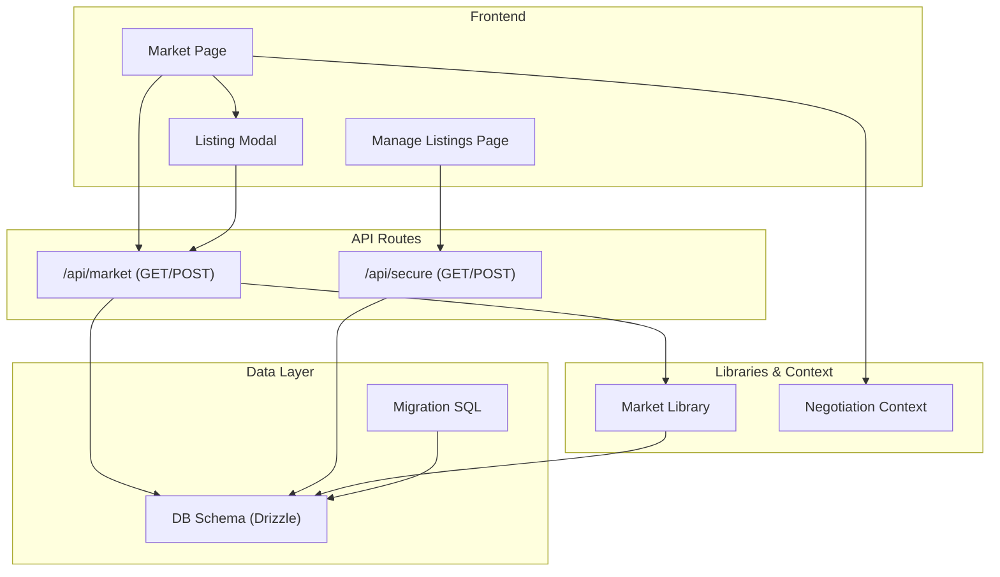
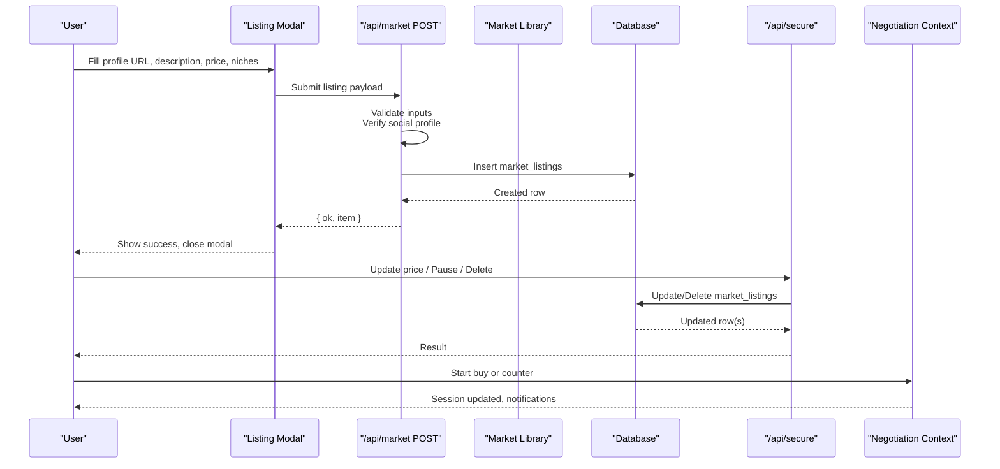
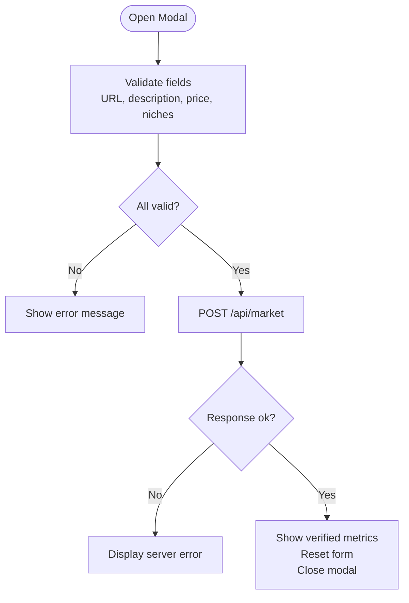
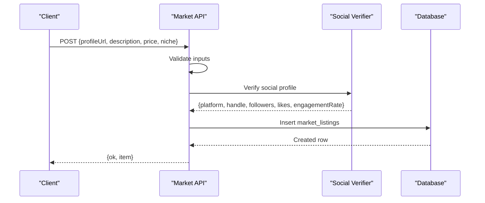
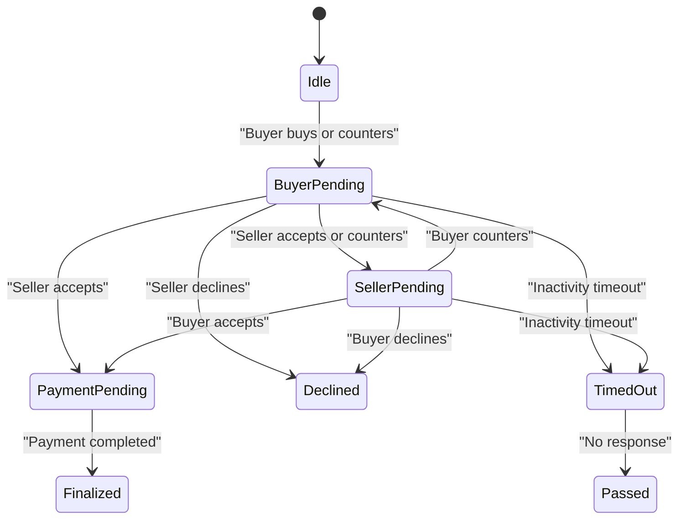
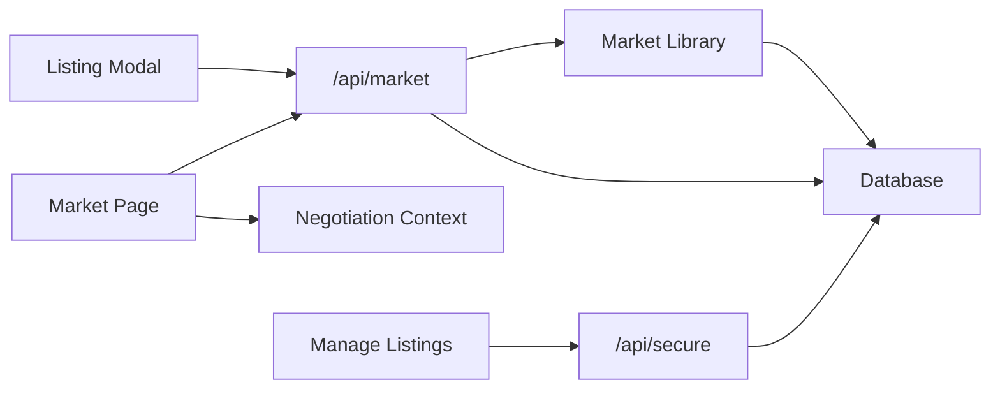

# Market Listings Management

<cite>
**Referenced Files in This Document**
- [route.ts](file://src/app/api/market/route.ts)
- [listing-modal.tsx](file://src/components/layout/listing-modal.tsx)
- [market.ts](file://src/lib/market.ts)
- [schema.ts](file://src/db/schema.ts)
- [page.tsx](file://src/app/manage/listings/page.tsx)
- [route.ts](file://src/app/api/secure/route.ts)
- [NegotiationContext.tsx](file://src/context/NegotiationContext.tsx)
- [negotiation.ts](file://src/lib/negotiation.ts)
- [page.tsx](file://src/app/market/page.tsx)
- [0000_init.sql](file://drizzle/0000_init.sql)
</cite>

## Table of Contents
1. Introduction
2. Project Structure
3. Core Components
4. Architecture Overview
5. Detailed Component Analysis
6. Dependency Analysis
7. Performance Considerations
8. Troubleshooting Guide
9. Conclusion

## Introduction
This document explains the Market Listings Management system end-to-end: how listings are created, validated, persisted, displayed, and managed; how pricing is configured; how social profile verification works; and how listings integrate with the negotiation engine for price setting and buyer-seller interactions. It also covers API endpoints for CRUD operations, authentication assumptions, error handling, categorization via niche tags, metadata management, and search indexing considerations.

## Project Structure
The market listings feature spans UI components, server routes, data models, and a negotiation context that drives buyer-seller workflows.

**Diagram sources**
- [page.tsx:1-159](file://src/app/market/page.tsx#L1-L159)
- [listing-modal.tsx:1-244](file://src/components/layout/listing-modal.tsx#L1-L244)
- [page.tsx:1-130](file://src/app/manage/listings/page.tsx#L1-L130)
- [route.ts:1-262](file://src/app/api/market/route.ts#L1-L262)
- [route.ts:1-535](file://src/app/api/secure/route.ts#L1-L535)
- [market.ts:1-50](file://src/lib/market.ts#L1-L50)
- [schema.ts:1-84](file://src/db/schema.ts#L1-L84)
- [0000_init.sql:1-82](file://drizzle/0000_init.sql#L1-L82)

**Section sources**
- [page.tsx:1-159](file://src/app/market/page.tsx#L1-L159)
- [listing-modal.tsx:1-244](file://src/components/layout/listing-modal.tsx#L1-L244)
- [page.tsx:1-130](file://src/app/manage/listings/page.tsx#L1-L130)
- [route.ts:1-262](file://src/app/api/market/route.ts#L1-L262)
- [route.ts:1-535](file://src/app/api/secure/route.ts#L1-L535)
- [market.ts:1-50](file://src/lib/market.ts#L1-L50)
- [schema.ts:1-84](file://src/db/schema.ts#L1-L84)
- [0000_init.sql:1-82](file://drizzle/0000_init.sql#L1-L82)

## Core Components
- Listing Modal: Client-side form to create a listing with validation, niche tagging, and live preview of verified metrics.
- Market API: Server route to validate social profiles, persist listings, and return normalized card data.
- Market Library: Reads listings from the database and maps rows to display-ready cards with computed views.
- Secure API: Centralized endpoint for authenticated CRUD on listings (update price, pause, delete) and other entities.
- Negotiation Context: Frontend state machine driving buy/counter flows, timeouts, and payment lifecycle.
- Database Schema: Drizzle tables defining listing fields, status, and engagement events.

**Section sources**
- [listing-modal.tsx:1-244](file://src/components/layout/listing-modal.tsx#L1-L244)
- [route.ts:1-262](file://src/app/api/market/route.ts#L1-L262)
- [market.ts:1-50](file://src/lib/market.ts#L1-L50)
- [route.ts:1-535](file://src/app/api/secure/route.ts#L1-L535)
- [NegotiationContext.tsx:1-706](file://src/context/NegotiationContext.tsx#L1-L706)
- [schema.ts:1-84](file://src/db/schema.ts#L1-L84)

## Architecture Overview
The listing lifecycle begins in the modal, proceeds through server-side validation and persistence, and surfaces in the market grid. Buyers initiate negotiations via the context, which orchestrates state transitions and notifications.

**Diagram sources**
- [listing-modal.tsx:70-121](file://src/components/layout/listing-modal.tsx#L70-L121)
- [route.ts:174-261](file://src/app/api/market/route.ts#L174-L261)
- [route.ts:397-437](file://src/app/api/secure/route.ts#L397-L437)
- [NegotiationContext.tsx:267-378](file://src/context/NegotiationContext.tsx#L267-L378)

## Detailed Component Analysis

### Listing Modal Component
- Purpose: Collects listing data, validates input, verifies social profile, and submits to the market API.
- Key behaviors:
  - Validates required fields: profile URL, description, price, and at least one niche tag.
  - Supports adding multiple niche tags up to four.
  - Displays verified account metrics after successful submission response.
  - Submits JSON payload including user identity header for identification.
- Error handling: Shows inline errors for missing fields and network/server errors.

**Diagram sources**
- [listing-modal.tsx:68-121](file://src/components/layout/listing-modal.tsx#L68-L121)

**Section sources**
- [listing-modal.tsx:1-244](file://src/components/layout/listing-modal.tsx#L1-L244)

### Market API (/api/market)
- GET: Returns market cards by querying the database via the market library and mapping rows to display format.
- POST: Creates a new listing:
  - Validates presence of profile URL and description.
  - Verifies social profile URL and extracts platform, handle, followers, likes, and engagement rate.
  - Persists listing with default status “open” and returns normalized item including computed views.
- Social verification:
  - Parses and validates supported platforms.
  - For Instagram, fetches GraphQL-like payload to compute recent video views and engagement rate.
  - For other platforms, scrapes profile page text to extract numeric metrics.
  - Throws descriptive errors if verification fails.

**Diagram sources**
- [route.ts:174-261](file://src/app/api/market/route.ts#L174-L261)

**Section sources**
- [route.ts:1-262](file://src/app/api/market/route.ts#L1-L262)

### Market Library and Data Mapping
- Reads latest listings from the database and maps rows to MarketCardData.
- Computes views using a formula based on followers, likes, and engagement rate.
- Normalizes fields like description and handle to ensure consistent display values.

**Section sources**
- [market.ts:1-50](file://src/lib/market.ts#L1-L50)

### Secure API (/api/secure)
- GET: Aggregates user-specific data including market listings filtered by creator identity.
- POST: Handles multiple modes, including listing updates:
  - update_listing: Validates and updates price; logs engagement event.
  - pause_listing: Toggles status between open and paused.
  - delete_listing: Removes listing and related engagement events.
- Authentication assumption: Uses x-user-id header or body fields to identify the actor; returns 401 when missing.

**Section sources**
- [route.ts:111-152](file://src/app/api/secure/route.ts#L111-L152)
- [route.ts:378-437](file://src/app/api/secure/route.ts#L378-L437)

### Manage Listings Page
- Loads listings via secure API and renders actions: discount/increase price by 10%, delete.
- Calls secure API with mode flags to perform updates and deletions.
- Provides immediate feedback and local state updates on success.

**Section sources**
- [page.tsx:1-130](file://src/app/manage/listings/page.tsx#L1-L130)

### Negotiation Engine Integration
- The market page integrates with the negotiation context to start buy requests or submit counters.
- Context manages session states, cooldowns, daily limits, timeouts, and payment deadlines.
- Updates orders/offers lists and emits notifications for each action.

**Diagram sources**
- [NegotiationContext.tsx:9-18](file://src/context/NegotiationContext.tsx#L9-L18)
- [NegotiationContext.tsx:181-252](file://src/context/NegotiationContext.tsx#L181-L252)
- [NegotiationContext.tsx:267-378](file://src/context/NegotiationContext.tsx#L267-L378)
- [NegotiationContext.tsx:380-512](file://src/context/NegotiationContext.tsx#L380-L512)
- [NegotiationContext.tsx:514-624](file://src/context/NegotiationContext.tsx#L514-L624)
- [NegotiationContext.tsx:626-669](file://src/context/NegotiationContext.tsx#L626-L669)

**Section sources**
- [NegotiationContext.tsx:1-706](file://src/context/NegotiationContext.tsx#L1-L706)
- [negotiation.ts:1-50](file://src/lib/negotiation.ts#L1-L50)

### Database Schema and Migration
- market_listings table stores listing metadata, social profile info, pricing, and status.
- engagement_events tracks actions across entities, including listing creation and updates.
- Migration SQL defines the schema used by Drizzle ORM.

**Section sources**
- [schema.ts:58-73](file://src/db/schema.ts#L58-L73)
- [0000_init.sql:56-71](file://drizzle/0000_init.sql#L56-L71)

## Dependency Analysis
- UI depends on APIs for data and mutations.
- Market API depends on social verification logic and database persistence.
- Secure API centralizes write operations and enforces identity checks.
- Negotiation context coordinates buyer/seller interactions without direct API calls in this flow.

**Diagram sources**
- [listing-modal.tsx:70-121](file://src/components/layout/listing-modal.tsx#L70-L121)
- [page.tsx:24-38](file://src/app/market/page.tsx#L24-L38)
- [page.tsx:17-57](file://src/app/manage/listings/page.tsx#L17-L57)
- [route.ts:174-261](file://src/app/api/market/route.ts#L174-L261)
- [route.ts:397-437](file://src/app/api/secure/route.ts#L397-L437)
- [market.ts:43-49](file://src/lib/market.ts#L43-L49)

**Section sources**
- [listing-modal.tsx:1-244](file://src/components/layout/listing-modal.tsx#L1-L244)
- [page.tsx:1-159](file://src/app/market/page.tsx#L1-L159)
- [page.tsx:1-130](file://src/app/manage/listings/page.tsx#L1-L130)
- [route.ts:1-262](file://src/app/api/market/route.ts#L1-L262)
- [route.ts:1-535](file://src/app/api/secure/route.ts#L1-L535)
- [market.ts:1-50](file://src/lib/market.ts#L1-L50)

## Performance Considerations
- Social verification involves external HTTP requests; consider caching results per profile URL to reduce latency and rate-limit exposure.
- Views computation is lightweight but can be memoized if reused frequently.
- Pagination or filtering could be added to market queries for large datasets.
- Debounce niche tag input and avoid excessive re-renders in the modal.

[No sources needed since this section provides general guidance]

## Troubleshooting Guide
- Missing profile URL or description: The market API returns a 400 error with a descriptive message. Ensure both fields are provided before submission.
- Invalid social profile URL: Verification throws an error indicating unsupported host or missing handle. Use a supported platform and include a valid handle.
- Unable to verify metrics: If the platform page does not expose metrics or is private, verification fails. Provide a public profile with visible metrics.
- Secure API requires identity: When calling /api/secure, include x-user-id header or equivalent body field; otherwise, a 401 is returned.
- Price update validation: New price must be a finite non-negative number; otherwise, a 400 error is returned.

**Section sources**
- [route.ts:185-191](file://src/app/api/market/route.ts#L185-L191)
- [route.ts:37-55](file://src/app/api/market/route.ts#L37-L55)
- [route.ts:157-162](file://src/app/api/secure/route.ts#L157-L162)
- [route.ts:402-405](file://src/app/api/secure/route.ts#L402-L405)

## Conclusion
The Market Listings Management system provides a complete workflow for creating, validating, publishing, and managing marketplace listings. It integrates robust social profile verification, structured data modeling, and a negotiation engine that supports dynamic pricing and buyer-seller interactions. The modular architecture separates concerns across UI, API, data layer, and context, enabling clear maintenance and extensibility.

[No sources needed since this section summarizes without analyzing specific files]