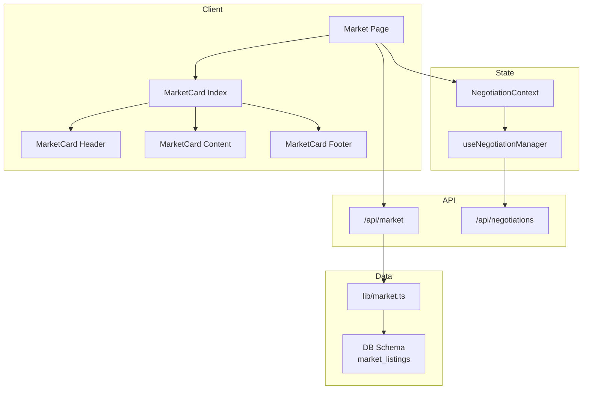
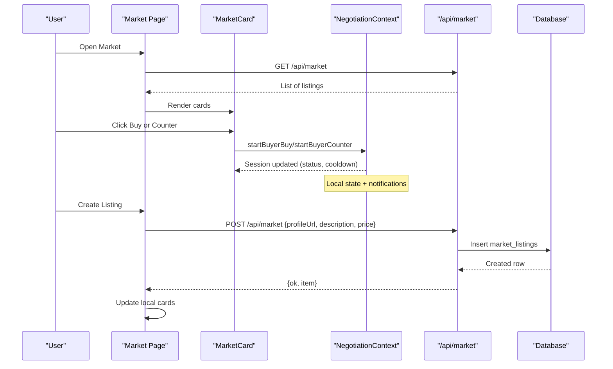
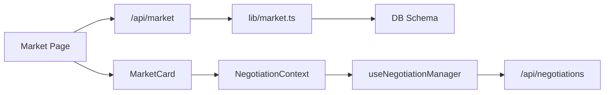

# Marketplace Platform

<cite>
**Referenced Files in This Document**
- [market/page.tsx](file://src/app/market/page.tsx)
- [api/market/route.ts](file://src/app/api/market/route.ts)
- [lib/market.ts](file://src/lib/market.ts)
- [db/schema.ts](file://src/db/schema.ts)
- [types/market.ts](file://src/types/market.ts)
- [components/market-card/index.tsx](file://src/components/market-card/index.tsx)
- [components/market-card/header.tsx](file://src/components/market-card/header.tsx)
- [components/market-card/content.tsx](file://src/components/market-card/content.tsx)
- [components/market-card/footer.tsx](file://src/components/market-card/footer.tsx)
- [context/NegotiationContext.tsx](file://src/context/NegotiationContext.tsx)
- [hooks/useNegotiationManager.ts](file://src/hooks/useNegotiationManager.ts)
- [lib/negotiations.ts](file://src/lib/negotiations.ts)
- [app/api/negotiations/route.ts](file://src/app/api/negotiations/route.ts)
</cite>

## Table of Contents
1. Introduction
2. Project Structure
3. Core Components
4. Architecture Overview
5. Detailed Component Analysis
6. Dependency Analysis
7. Performance Considerations
8. Troubleshooting Guide
9. Conclusion

## Introduction
This document describes the Marketplace Platform end-to-end: listing management, browsing interface, negotiation-driven transactions, and supporting data models. It explains how listings are created, browsed, negotiated, and finalized; how market cards render product information and pricing constraints; and how real-time state updates flow between UI and backend services.

## Project Structure
The marketplace spans client pages, reusable components, API routes, and data access layers:
- Client page for browsing and initiating negotiations
- Market card component family (header, content, footer, index)
- API route to list and create market listings
- Data mapping from database schema to UI types
- Negotiation context and hooks for buyer/seller workflows
- Shared negotiation utilities and endpoints

**Diagram sources**
- [market/page.tsx:19-159](file://src/app/market/page.tsx#L19-L159)
- [components/market-card/index.tsx:20-157](file://src/components/market-card/index.tsx#L20-L157)
- [components/market-card/header.tsx:20-133](file://src/components/market-card/header.tsx#L20-L133)
- [components/market-card/content.tsx:11-110](file://src/components/market-card/content.tsx#L11-L110)
- [components/market-card/footer.tsx:17-56](file://src/components/market-card/footer.tsx#L17-L56)
- [api/market/route.ts:164-262](file://src/app/api/market/route.ts#L164-L262)
- [lib/market.ts:43-49](file://src/lib/market.ts#L43-L49)
- [db/schema.ts:58-73](file://src/db/schema.ts#L58-L73)
- [context/NegotiationContext.tsx:140-706](file://src/context/NegotiationContext.tsx#L140-L706)
- [hooks/useNegotiationManager.ts:6-201](file://src/hooks/useNegotiationManager.ts#L6-L201)
- [app/api/negotiations/route.ts:4-12](file://src/app/api/negotiations/route.ts#L4-L12)

**Section sources**
- [market/page.tsx:19-159](file://src/app/market/page.tsx#L19-L159)
- [api/market/route.ts:164-262](file://src/app/api/market/route.ts#L164-L262)
- [lib/market.ts:43-49](file://src/lib/market.ts#L43-L49)
- [db/schema.ts:58-73](file://src/db/schema.ts#L58-L73)

## Core Components
- Market Page: Loads listings, renders a grid of market cards, opens a listing creation modal, and initiates buy or counter actions via the negotiation context.
- Market Card: Displays seller info, metrics, price input with dynamic discount limits, sentiment voting, and action buttons constrained by session state and cooldowns.
- API /api/market: Lists open listings and creates new ones after verifying social profile links and persisting to the database when available.
- Data Layer: Maps database rows to UI-friendly market card data, computing derived metrics like views and engagement ratios.
- Negotiation Context: Manages sessions, counters, cooldowns, timeouts, and notifications; integrates with order/offer lists for cross-component visibility.

**Section sources**
- [market/page.tsx:19-159](file://src/app/market/page.tsx#L19-L159)
- [components/market-card/index.tsx:20-157](file://src/components/market-card/index.tsx#L20-L157)
- [api/market/route.ts:164-262](file://src/app/api/market/route.ts#L164-L262)
- [lib/market.ts:7-49](file://src/lib/market.ts#L7-L49)
- [context/NegotiationContext.tsx:140-706](file://src/context/NegotiationContext.tsx#L140-L706)

## Architecture Overview
The marketplace follows a client-server architecture with local negotiation state:
- The Market Page fetches listings and renders cards.
- Cards trigger buy or counter actions that update the negotiation context.
- The negotiation context enforces rules (discount caps, cooldowns, alternation), persists state to localStorage, and emits notifications/events.
- The API provides listing CRUD and optional social verification.

**Diagram sources**
- [market/page.tsx:24-38](file://src/app/market/page.tsx#L24-L38)
- [api/market/route.ts:164-172](file://src/app/api/market/route.ts#L164-L172)
- [api/market/route.ts:174-262](file://src/app/api/market/route.ts#L174-L262)
- [context/NegotiationContext.tsx:267-378](file://src/context/NegotiationContext.tsx#L267-L378)
- [db/schema.ts:58-73](file://src/db/schema.ts#L58-L73)

## Detailed Component Analysis

### Market Page
- Loads listings from /api/market on mount.
- Filters visible cards by offers count threshold.
- Opens a listing modal to publish new items and appends them locally.
- Initiates buy or counter flows through the negotiation context and records office events.

Key behaviors:
- Fetches and displays market cards.
- Enforces a cap on visible offers per listing.
- Integrates with negotiation context to start sessions and track activity.

**Section sources**
- [market/page.tsx:24-69](file://src/app/market/page.tsx#L24-L69)
- [market/page.tsx:71-159](file://src/app/market/page.tsx#L71-L159)

### Market Card Component Family
- Index: Computes dynamic discount floors based on counter attempts, manages live offer counts, cooldown timers, active offer detection, and price input validation.
- Header: Shows seller identity, rating, live status, countdown timer, and offer progress toward a maximum.
- Content: Displays description, handle, followers, views, engagement ratio, likes, and view-to-like ratio with color-coded efficiency indicators.
- Footer: Provides Buy, Counter, and Costly vote buttons with disabled states based on session constraints.

Constraints and UX:
- Dynamic max discount decreases with each counter attempt.
- Cooldown prevents rapid repeated actions.
- Active offer banners indicate pending responses or seller counters.
- Max offers limit restricts further interactions.

**Section sources**
- [components/market-card/index.tsx:20-157](file://src/components/market-card/index.tsx#L20-L157)
- [components/market-card/header.tsx:20-133](file://src/components/market-card/header.tsx#L20-L133)
- [components/market-card/content.tsx:11-110](file://src/components/market-card/content.tsx#L11-L110)
- [components/market-card/footer.tsx:17-56](file://src/components/market-card/footer.tsx#L17-L56)

### API: /api/market
- GET: Returns market listings mapped from the database.
- POST: Creates a listing by validating and extracting metrics from a social profile URL, then inserting into the database if available; otherwise returns a fallback payload.

Validation and enrichment:
- Verifies supported social platforms and extracts handles.
- Computes follower counts, likes, views, and engagement rates.
- Derives initial views from platform metrics.

Error handling:
- Returns empty arrays on failure for GET.
- Returns error messages for invalid inputs or verification failures on POST.

**Section sources**
- [api/market/route.ts:164-172](file://src/app/api/market/route.ts#L164-L172)
- [api/market/route.ts:174-262](file://src/app/api/market/route.ts#L174-L262)

### Data Layer: lib/market.ts
- Reads market listings ordered by creation time with a limit.
- Maps rows to MarketCardData, computing derived fields such as views and engagement ratios.
- Normalizes missing or invalid fields to safe defaults.

Complexity:
- O(n) read with limit; mapping is linear in number of rows returned.

**Section sources**
- [lib/market.ts:7-49](file://src/lib/market.ts#L7-L49)

### Database Schema
- market_listings stores listing metadata including title, description, price, profile link, platform, handle, followers, likes, engagement rate, niche, creator, status, and timestamps.

Integrity:
- Primary key id, default values for numeric fields, and timestamp defaults ensure consistent records.

**Section sources**
- [db/schema.ts:58-73](file://src/db/schema.ts#L58-L73)
- [drizzle/0000_init.sql:56-71](file://drizzle/0000_init.sql#L56-L71)

### Negotiation Engine
- Context: Maintains sessions, notifications, and events; enforces alternating turns, discount caps, cooldowns, and timeouts; syncs with orders/offers for cross-component visibility.
- Hooks: Provide higher-level operations to create orders, accept/counter/decline offers, and manage negotiation lifecycles.
- API: Exposes an endpoint to retrieve negotiation data (orders and offers).

Workflow highlights:
- Buyer can initiate a buy or submit up to three counters with decreasing max discounts.
- Seller can accept, counter, or decline; accepted leads to payment-pending with a due window.
- Inactive sessions time out or pass after a day without response; cooldowns prevent spamming.
- Notifications and events record all transitions for auditability.

**Section sources**
- [context/NegotiationContext.tsx:140-706](file://src/context/NegotiationContext.tsx#L140-L706)
- [hooks/useNegotiationManager.ts:6-201](file://src/hooks/useNegotiationManager.ts#L6-L201)
- [lib/negotiations.ts:57-63](file://src/lib/negotiations.ts#L57-L63)
- [app/api/negotiations/route.ts:4-12](file://src/app/api/negotiations/route.ts#L4-L12)

### Data Models
- MarketCardData defines the shape of listing cards displayed in the UI, including pricing, metrics, and seller attributes.

Usage:
- Consumed by market card components and the market page to render consistent visuals and enforce constraints.

**Section sources**
- [types/market.ts:1-25](file://src/types/market.ts#L1-L25)

## Dependency Analysis

**Diagram sources**
- [market/page.tsx:24-69](file://src/app/market/page.tsx#L24-L69)
- [api/market/route.ts:164-262](file://src/app/api/market/route.ts#L164-L262)
- [lib/market.ts:43-49](file://src/lib/market.ts#L43-L49)
- [db/schema.ts:58-73](file://src/db/schema.ts#L58-L73)
- [context/NegotiationContext.tsx:140-706](file://src/context/NegotiationContext.tsx#L140-L706)
- [hooks/useNegotiationManager.ts:6-201](file://src/hooks/useNegotiationManager.ts#L6-L201)
- [app/api/negotiations/route.ts:4-12](file://src/app/api/negotiations/route.ts#L4-L12)

**Section sources**
- [market/page.tsx:24-69](file://src/app/market/page.tsx#L24-L69)
- [api/market/route.ts:164-262](file://src/app/api/market/route.ts#L164-L262)
- [lib/market.ts:43-49](file://src/lib/market.ts#L43-L49)
- [context/NegotiationContext.tsx:140-706](file://src/context/NegotiationContext.tsx#L140-L706)

## Performance Considerations
- Limiting listings to a fixed number reduces payload size and rendering cost.
- Client-side filtering of visible cards avoids unnecessary re-renders.
- Dynamic discount calculations and cooldown timers run locally to minimize server load.
- Social profile verification uses targeted requests and parsing; consider caching verified profiles to reduce external calls.
- Negotiation state persisted in localStorage avoids frequent network round-trips for session data.

[No sources needed since this section provides general guidance]

## Troubleshooting Guide
Common issues and resolutions:
- Listings not loading: Check GET /api/market response; verify database availability and schema initialization.
- Creation errors: Ensure profileUrl is valid and points to a supported platform; confirm description is provided.
- Negotiation blocked: Verify cooldown has expired, daily action limits are not exceeded, and no active offer exists for the listing.
- Timeouts: Sessions marked as timed-out or passed after inactivity; users must wait for cooldown before retrying.

**Section sources**
- [api/market/route.ts:164-172](file://src/app/api/market/route.ts#L164-L172)
- [api/market/route.ts:174-262](file://src/app/api/market/route.ts#L174-L262)
- [context/NegotiationContext.tsx:181-252](file://src/context/NegotiationContext.tsx#L181-L252)

## Conclusion
The Marketplace Platform combines a robust listing API, a rich market card UI, and a flexible negotiation engine to support buyer-seller interactions. Listings are created with social verification and enriched metrics; browsing is optimized with client-side filters and limits; and negotiations enforce fair play through discount caps, cooldowns, and timeouts. The modular architecture allows easy extension for analytics, seller performance tracking, and buyer protection features.

[No sources needed since this section summarizes without analyzing specific files]