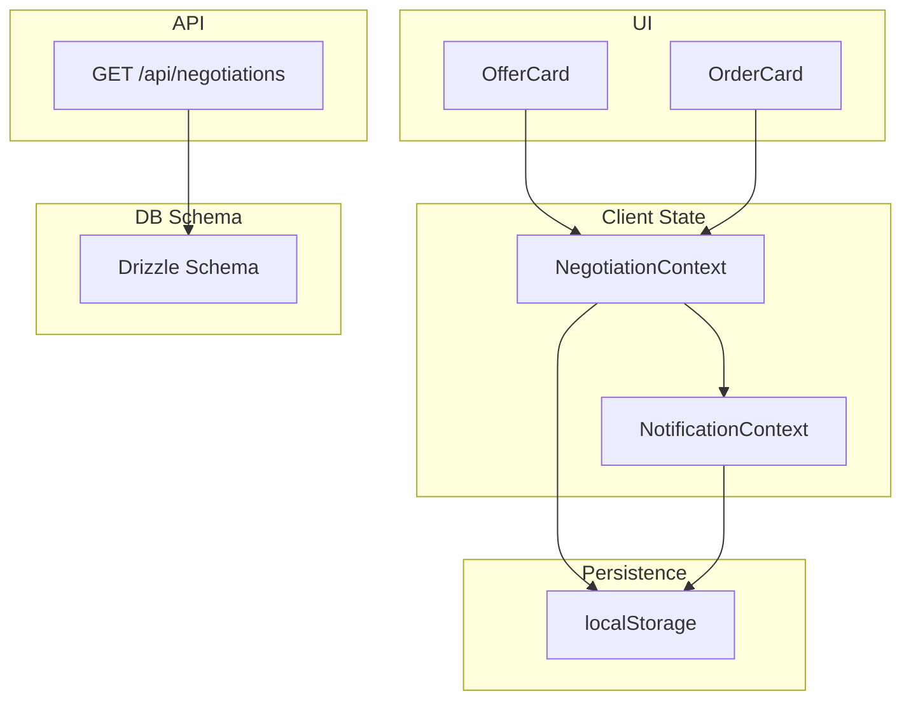
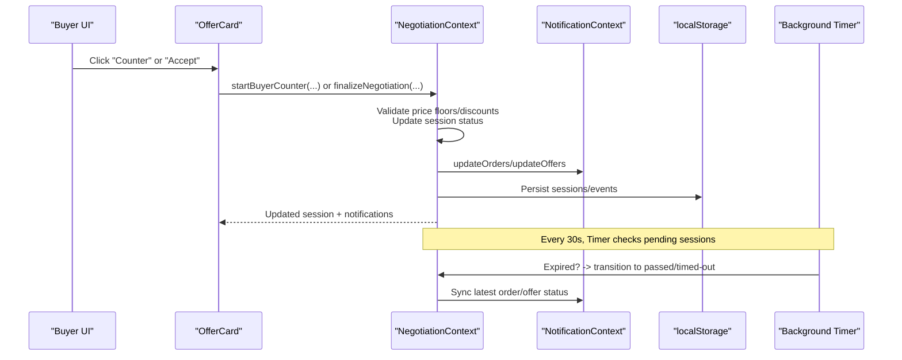
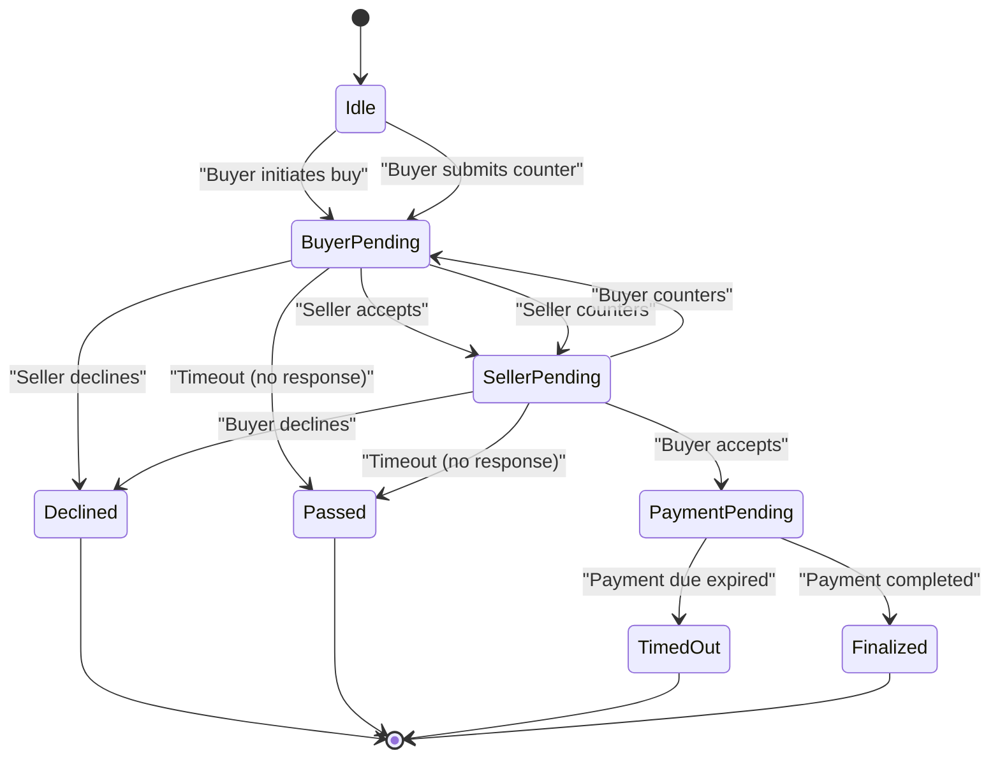
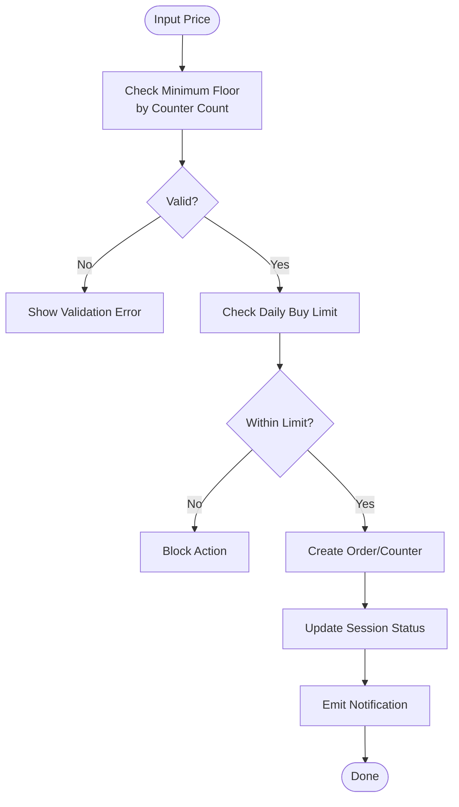
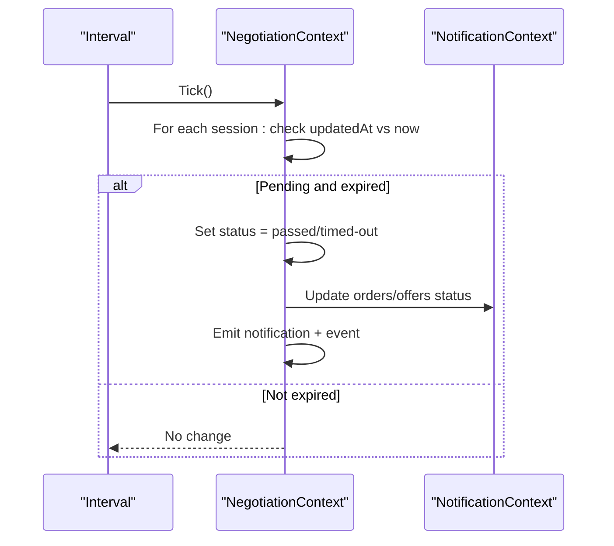
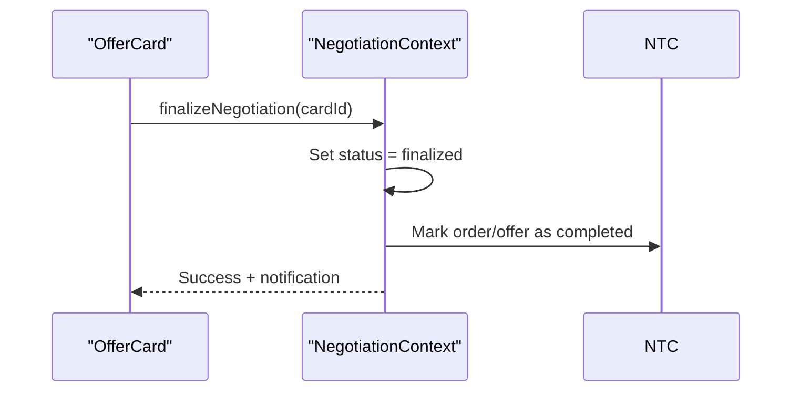
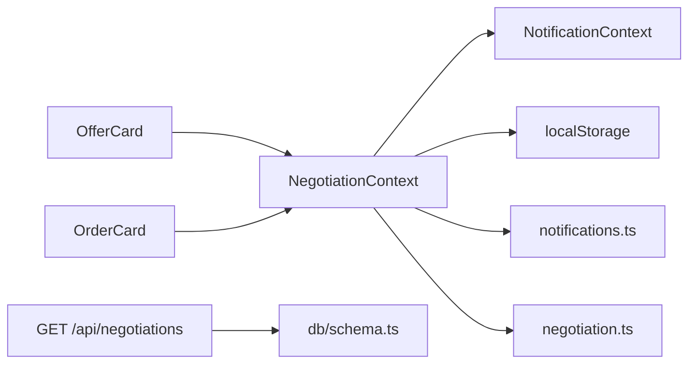
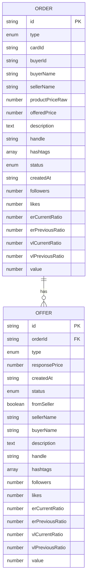

# Transaction Processing & Negotiation

<cite>
**Referenced Files in This Document**
- [NegotiationContext.tsx](file://src/context/NegotiationContext.tsx)
- [useNegotiationManager.ts](file://src/hooks/useNegotiationManager.ts)
- [notifications.ts](file://src/lib/notifications.ts)
- [negotiation.ts](file://src/lib/negotiation.ts)
- [NotificationContext.tsx](file://src/context/NotificationContext.tsx)
- [route.ts](file://src/app/api/negotiations/route.ts)
- [schema.ts](file://src/db/schema.ts)
- [0000_init.sql](file://drizzle/0000_init.sql)
- [types.ts](file://src/types.ts)
- [offer-card/index.tsx](file://src/components/offer-card/index.tsx)
- [order-card/index.tsx](file://src/components/order-card/index.tsx)
</cite>

## Table of Contents
1. Introduction
2. Project Structure
3. Core Components
4. Architecture Overview
5. Detailed Component Analysis
6. Dependency Analysis
7. Performance Considerations
8. Troubleshooting Guide
9. Conclusion
10. Appendices

## Introduction
This document explains the end-to-end transaction processing and negotiation workflows in the marketplace application. It covers how buyer-seller communication flows, offer/counter-offer generation, negotiation state transitions, timeout handling, real-time synchronization across UI components, session management, conflict resolution, validation rules, payment processing integration points, order fulfillment, error handling strategies, and audit logging for compliance.

## Project Structure
The negotiation system is implemented primarily on the client side with React Contexts for state, a small API route for data retrieval, and persistence via localStorage. The database schema defines core entities used elsewhere in the app; negotiation-specific tables are not present in the current schema, so negotiations are managed in-memory with local storage.

**Diagram sources**
- [NegotiationContext.tsx:140-252](file://src/context/NegotiationContext.tsx#L140-L252)
- [NotificationContext.tsx:22-116](file://src/context/NotificationContext.tsx#L22-L116)
- [route.ts:4-12](file://src/app/api/negotiations/route.ts#L4-L12)
- [schema.ts:1-84](file://src/db/schema.ts#L1-L84)

**Section sources**
- [NegotiationContext.tsx:140-252](file://src/context/NegotiationContext.tsx#L140-L252)
- [NotificationContext.tsx:22-116](file://src/context/NotificationContext.tsx#L22-L116)
- [route.ts:4-12](file://src/app/api/negotiations/route.ts#L4-L12)
- [schema.ts:1-84](file://src/db/schema.ts#L1-L84)

## Core Components
- NegotiationContext: Central state machine for negotiation sessions, including status transitions, counters, cooldowns, timeouts, notifications, and event logs.
- NotificationContext: Shared orders/offers store persisted to localStorage, driving UI badges and cross-component updates.
- useNegotiationManager: Lightweight hook to create orders and offers and update their statuses without full context logic.
- OfferCard and OrderCard: UI components that validate inputs, render negotiation states, and trigger actions through contexts.
- API Route: GET endpoint to fetch negotiation data (currently returns empty arrays).
- Types and Utilities: Shared types for orders/offers and helpers for creating events and summaries.

**Section sources**
- [NegotiationContext.tsx:9-68](file://src/context/NegotiationContext.tsx#L9-L68)
- [NotificationContext.tsx:6-18](file://src/context/NotificationContext.tsx#L6-L18)
- [useNegotiationManager.ts:6-200](file://src/hooks/useNegotiationManager.ts#L6-L200)
- [offer-card/index.tsx:1-407](file://src/components/offer-card/index.tsx#L1-L407)
- [order-card/index.tsx:1-133](file://src/components/order-card/index.tsx#L1-L133)
- [route.ts:4-12](file://src/app/api/negotiations/route.ts#L4-L12)
- [types.ts:1-48](file://src/types.ts#L1-L48)
- [negotiation.ts:1-50](file://src/lib/negotiation.ts#L1-L50)

## Architecture Overview
The negotiation engine runs in the browser using React Contexts. Buyer and seller actions flow through UI components into the NegotiationContext, which enforces business rules, updates session state, emits notifications, and synchronizes orders/offers in NotificationContext. A background timer handles timeouts and transitions to passed/timed-out states. Payment completion finalizes the negotiation and marks related records as completed.

**Diagram sources**
- [NegotiationContext.tsx:181-252](file://src/context/NegotiationContext.tsx#L181-L252)
- [NegotiationContext.tsx:267-378](file://src/context/NegotiationContext.tsx#L267-L378)
- [NegotiationContext.tsx:626-669](file://src/context/NegotiationContext.tsx#L626-L669)
- [NotificationContext.tsx:64-76](file://src/context/NotificationContext.tsx#L64-L76)

## Detailed Component Analysis

### Negotiation State Machine
The negotiation lifecycle is governed by a set of statuses and transitions enforced in the context.

Key rules:
- Alternating turns: lastActor prevents consecutive same-side counters.
- Counter limits: up to 3 per side.
- Price floors: dynamic discount caps based on counter count.
- Cooldowns: prevent rapid re-negotiation.
- Daily buy limit: buyer limited to 3 actions per day.
- Timeouts: 1-day inactivity triggers passed/timed-out transitions.

**Diagram sources**
- [NegotiationContext.tsx:9-18](file://src/context/NegotiationContext.tsx#L9-L18)
- [NegotiationContext.tsx:105-115](file://src/context/NegotiationContext.tsx#L105-L115)
- [NegotiationContext.tsx:260-265](file://src/context/NegotiationContext.tsx#L260-L265)
- [NegotiationContext.tsx:319-378](file://src/context/NegotiationContext.tsx#L319-L378)
- [NegotiationContext.tsx:380-512](file://src/context/NegotiationContext.tsx#L380-L512)
- [NegotiationContext.tsx:514-624](file://src/context/NegotiationContext.tsx#L514-L624)
- [NegotiationContext.tsx:626-669](file://src/context/NegotiationContext.tsx#L626-L669)

**Section sources**
- [NegotiationContext.tsx:9-18](file://src/context/NegotiationContext.tsx#L9-L18)
- [NegotiationContext.tsx:105-115](file://src/context/NegotiationContext.tsx#L105-L115)
- [NegotiationContext.tsx:260-265](file://src/context/NegotiationContext.tsx#L260-L265)
- [NegotiationContext.tsx:319-378](file://src/context/NegotiationContext.tsx#L319-L378)
- [NegotiationContext.tsx:380-512](file://src/context/NegotiationContext.tsx#L380-L512)
- [NegotiationContext.tsx:514-624](file://src/context/NegotiationContext.tsx#L514-L624)
- [NegotiationContext.tsx:626-669](file://src/context/NegotiationContext.tsx#L626-L669)

### Offer/Counter Generation and Validation
- Buyer counters: validated against dynamic minimum price based on counter count and daily limits.
- Seller counters: validated similarly with seller-specific discount caps.
- UI feedback: OfferCard shows real-time validation errors and overpayment warnings.
- Orders/offers creation: Each action creates corresponding order/offer entries in NotificationContext for visibility to both parties.

**Diagram sources**
- [offer-card/index.tsx:71-110](file://src/components/offer-card/index.tsx#L71-L110)
- [NegotiationContext.tsx:319-378](file://src/context/NegotiationContext.tsx#L319-L378)
- [NegotiationContext.tsx:380-451](file://src/context/NegotiationContext.tsx#L380-L451)

**Section sources**
- [offer-card/index.tsx:71-110](file://src/components/offer-card/index.tsx#L71-L110)
- [NegotiationContext.tsx:319-378](file://src/context/NegotiationContext.tsx#L319-L378)
- [NegotiationContext.tsx:380-451](file://src/context/NegotiationContext.tsx#L380-L451)

### Timeout Handling and Real-Time Synchronization
- Background tick every 30 seconds checks active sessions.
- If a pending session exceeds 1 day or payment due time passes, it transitions to passed or timed-out.
- Notifications and events are emitted; orders/offers are updated to reflect the new status.

**Diagram sources**
- [NegotiationContext.tsx:181-252](file://src/context/NegotiationContext.tsx#L181-L252)

**Section sources**
- [NegotiationContext.tsx:181-252](file://src/context/NegotiationContext.tsx#L181-L252)

### Session Management and Conflict Resolution
- Sessions keyed by cardId ensure one negotiation per item.
- Alternating lastActor prevents double-counting.
- CooldownUntil blocks immediate re-entry after actions.
- Daily buyerBuyCountToday enforces fair usage.
- LocalStorage persistence ensures resilience across reloads.

Conflict resolution highlights:
- If multiple tabs update simultaneously, localStorage acts as shared state; each context reads/writes atomically on updates.
- Latest-writer wins for orders/offers arrays; careful mapping avoids stale updates.

**Section sources**
- [NegotiationContext.tsx:140-173](file://src/context/NegotiationContext.tsx#L140-L173)
- [NegotiationContext.tsx:260-265](file://src/context/NegotiationContext.tsx#L260-L265)
- [NotificationContext.tsx:64-76](file://src/context/NotificationContext.tsx#L64-L76)

### Payment Processing Integration Points
- Acceptance transitions to payment-pending with a due timestamp.
- UI exposes a “Pay Now” panel; upon submission, verification simulates payment completion.
- finalizeNegotiation sets status to finalized and marks orders/offers completed.

**Diagram sources**
- [offer-card/index.tsx:168-184](file://src/components/offer-card/index.tsx#L168-L184)
- [NegotiationContext.tsx:626-669](file://src/context/NegotiationContext.tsx#L626-L669)

**Section sources**
- [offer-card/index.tsx:168-184](file://src/components/offer-card/index.tsx#L168-L184)
- [NegotiationContext.tsx:626-669](file://src/context/NegotiationContext.tsx#L626-L669)

### Order Fulfillment Workflows
- After payment-finalization, orders/offers are marked completed.
- UI reflects completion and disables further actions.
- Audit trail includes notifications and events for compliance.

**Section sources**
- [NegotiationContext.tsx:626-669](file://src/context/NegotiationContext.tsx#L626-L669)
- [offer-card/index.tsx:235-255](file://src/components/offer-card/index.tsx#L235-L255)

### Examples of Negotiation Scenarios
- Buyer-initiated purchase: Creates order, sets buyer-pending, notifies seller.
- Seller acceptance: Transitions to payment-pending; buyer must pay within 1 day.
- Seller counter: Generates counter offer; buyer can accept, decline, or counter again.
- Buyer counter: Validates floor discounts; alternates turns; may lead to agreement or escalation.
- Timeout: Inactive pending sessions become passed; unpaid payments become timed-out.

**Section sources**
- [NegotiationContext.tsx:267-378](file://src/context/NegotiationContext.tsx#L267-L378)
- [NegotiationContext.tsx:380-512](file://src/context/NegotiationContext.tsx#L380-L512)
- [NegotiationContext.tsx:514-624](file://src/context/NegotiationContext.tsx#L514-L624)
- [NegotiationContext.tsx:181-252](file://src/context/NegotiationContext.tsx#L181-L252)

### Error Handling Strategies
- Input validation: Minimum price floors enforced in UI and context.
- Guard clauses: Return null when actions are invalid (e.g., exceeding counter limits, wrong turn).
- Graceful fallbacks: API route returns empty arrays on error; UI remains functional.
- Persistence safety: Try/catch around localStorage parsing to avoid crashes.

**Section sources**
- [offer-card/index.tsx:71-110](file://src/components/offer-card/index.tsx#L71-L110)
- [NegotiationContext.tsx:319-378](file://src/context/NegotiationContext.tsx#L319-L378)
- [route.ts:4-12](file://src/app/api/negotiations/route.ts#L4-L12)
- [NotificationContext.tsx:30-62](file://src/context/NotificationContext.tsx#L30-L62)

### Audit Logging for Compliance
- Events: Each negotiation action creates an event with direction, amount, note, and timestamp.
- Notifications: All significant actions emit structured notifications with category, actor, and status.
- Summary utilities: Helpers compute latest offer and counts from events.

**Section sources**
- [negotiation.ts:20-50](file://src/lib/negotiation.ts#L20-L50)
- [notifications.ts:1-43](file://src/lib/notifications.ts#L1-L43)
- [NegotiationContext.tsx:175-179](file://src/context/NegotiationContext.tsx#L175-L179)

## Dependency Analysis
The negotiation system depends on shared contexts for state and UI components for interaction. The API route is decoupled and currently returns placeholder data.

**Diagram sources**
- [offer-card/index.tsx:1-407](file://src/components/offer-card/index.tsx#L1-L407)
- [order-card/index.tsx:1-133](file://src/components/order-card/index.tsx#L1-L133)
- [NegotiationContext.tsx:140-252](file://src/context/NegotiationContext.tsx#L140-L252)
- [NotificationContext.tsx:22-116](file://src/context/NotificationContext.tsx#L22-L116)
- [notifications.ts:1-43](file://src/lib/notifications.ts#L1-L43)
- [negotiation.ts:1-50](file://src/lib/negotiation.ts#L1-L50)
- [route.ts:4-12](file://src/app/api/negotiations/route.ts#L4-L12)
- [schema.ts:1-84](file://src/db/schema.ts#L1-L84)

**Section sources**
- [NegotiationContext.tsx:140-252](file://src/context/NegotiationContext.tsx#L140-L252)
- [NotificationContext.tsx:22-116](file://src/context/NotificationContext.tsx#L22-L116)
- [route.ts:4-12](file://src/app/api/negotiations/route.ts#L4-L12)
- [schema.ts:1-84](file://src/db/schema.ts#L1-L84)

## Performance Considerations
- Client-side state minimizes server load; however, large arrays of orders/offers could impact rendering. Consider pagination or virtualization if datasets grow.
- Background interval runs every 30 seconds; ensure computations remain lightweight.
- localStorage operations are synchronous; batch updates where possible to reduce writes.
- Avoid unnecessary re-renders by memoizing derived values in components.

[No sources needed since this section provides general guidance]

## Troubleshooting Guide
Common issues and resolutions:
- Stale sessions after refresh: Ensure localStorage keys match and parse safely; verify context initialization.
- Actions blocked unexpectedly: Check cooldownUntil, daily buy limits, and alternating lastActor constraints.
- Price validation errors: Confirm floor calculations align with counter counts and product prices.
- API returns empty data: Verify backend implementation; frontend gracefully falls back to empty arrays.

**Section sources**
- [NotificationContext.tsx:30-62](file://src/context/NotificationContext.tsx#L30-L62)
- [NegotiationContext.tsx:260-265](file://src/context/NegotiationContext.tsx#L260-L265)
- [offer-card/index.tsx:71-110](file://src/components/offer-card/index.tsx#L71-L110)
- [route.ts:4-12](file://src/app/api/negotiations/route.ts#L4-L12)

## Conclusion
The negotiation engine provides a robust, client-driven workflow for marketplace transactions with clear state transitions, validation, and auditability. While currently lacking persistent negotiation tables, the design allows future extension to server-backed state while preserving the existing UI and context interfaces. Payments integrate via simulated verification, and timeouts ensure fairness and closure of stalled negotiations.

[No sources needed since this section summarizes without analyzing specific files]

## Appendices

### Data Models

**Diagram sources**
- [types.ts:5-48](file://src/types.ts#L5-L48)

**Section sources**
- [types.ts:5-48](file://src/types.ts#L5-L48)