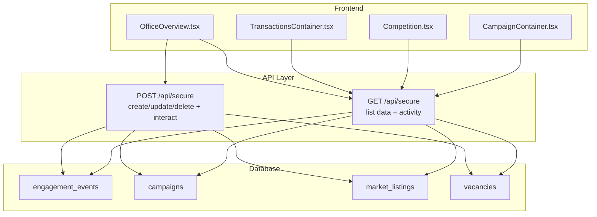
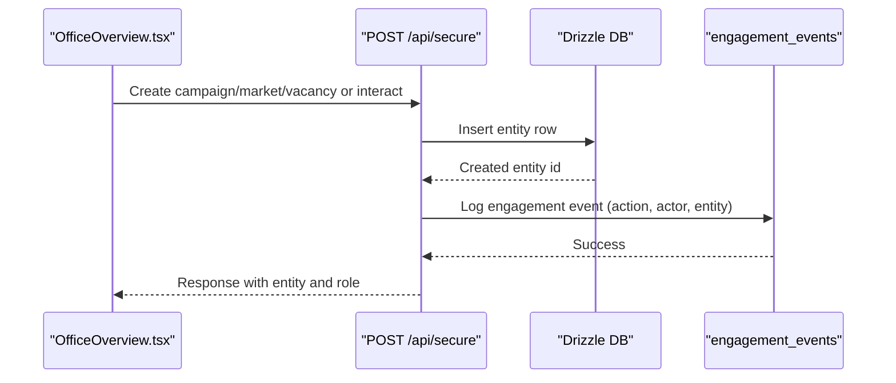
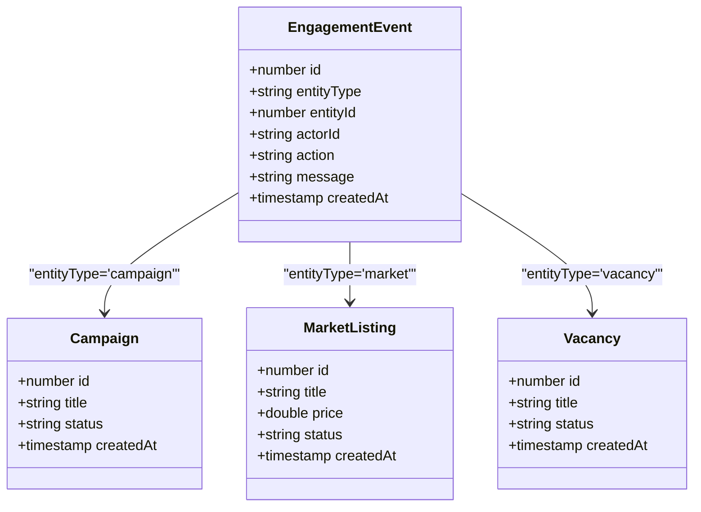
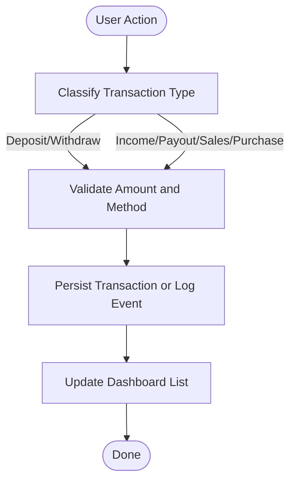
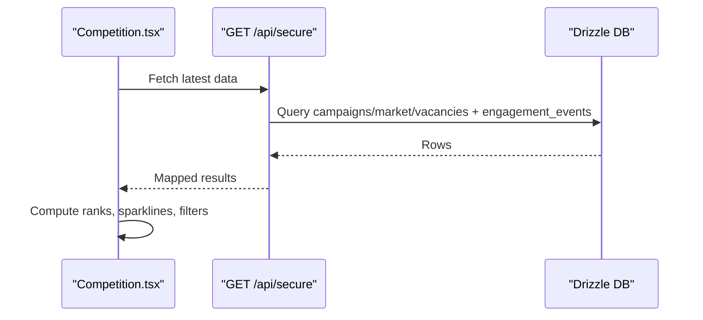
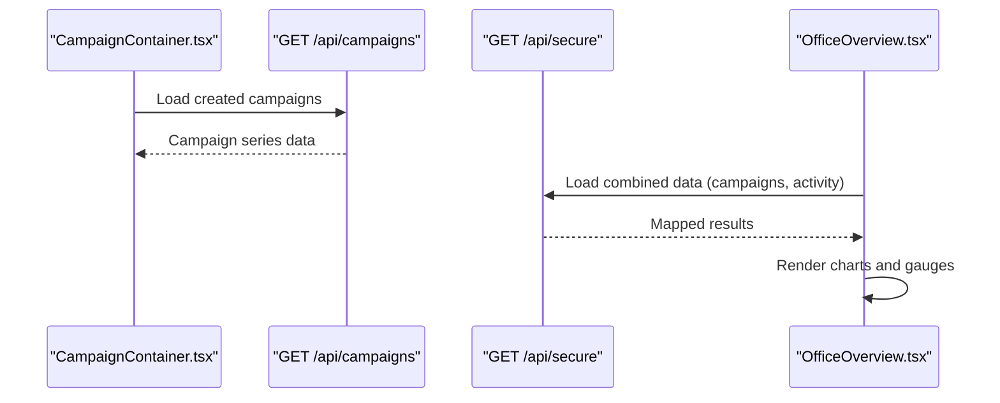
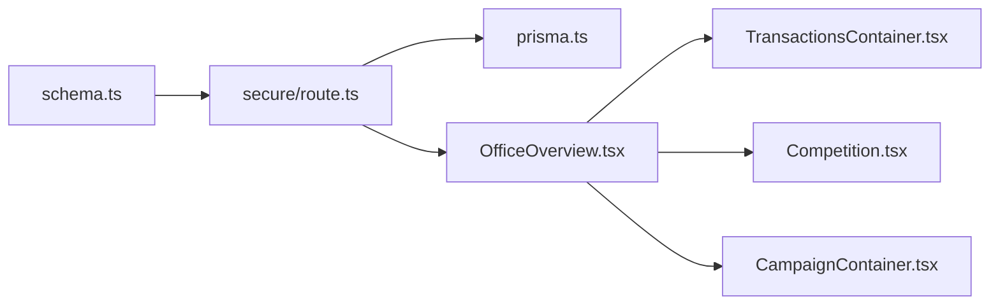

# Activity Tracking & History

<cite>
**Referenced Files in This Document**
- [schema.ts](file://src/db/schema.ts)
- [0000_init.sql](file://drizzle/0000_init.sql)
- [prisma.ts](file://src/lib/prisma.ts)
- [secure/route.ts](file://src/app/api/secure/route.ts)
- [office-history.ts](file://src/lib/office-history.ts)
- [TransactionsContainer.tsx](file://src/components/office/TransactionsContainer.tsx)
- [Competition.tsx](file://src/components/office/Competition.tsx)
- [CampaignContainer.tsx](file://src/components/office/CampaignContainer.tsx)
- [OfficeOverview.tsx](file://src/components/office/OfficeOverview.tsx)
- [finance.ts](file://src/lib/finance.ts)
</cite>

## Table of Contents
1. Introduction
2. Project Structure
3. Core Components
4. Architecture Overview
5. Detailed Component Analysis
6. Dependency Analysis
7. Performance Considerations
8. Troubleshooting Guide
9. Conclusion
10. Appendices

## Introduction
This document explains the activity tracking and history system for campaigns, marketplace listings, vacancies, and office operations. It covers how user activities are recorded as engagement events, how transactions are tracked and displayed, and how competition metrics are monitored. It also provides guidance on querying activity history, filtering by date ranges or activity types, generating reports, and considerations for performance, retention, and privacy compliance.

## Project Structure
The activity tracking system is implemented across database schema definitions, API routes, and UI components:
- Database schema defines core entities and a generic engagement event table used to record all user interactions.
- API routes provide endpoints to create and query activities and related business entities (campaigns, market listings, vacancies).
- UI components visualize recent transactions, campaign progress, and competition rankings.

**Diagram sources**
- [schema.ts:3-83](file://src/db/schema.ts#L3-L83)
- [secure/route.ts:111-152](file://src/app/api/secure/route.ts#L111-L152)
- [secure/route.ts:154-535](file://src/app/api/secure/route.ts#L154-L535)
- [OfficeOverview.tsx:147-174](file://src/components/office/OfficeOverview.tsx#L147-L174)
- [TransactionsContainer.tsx:48-118](file://src/components/office/TransactionsContainer.tsx#L48-L118)
- [Competition.tsx:54-148](file://src/components/office/Competition.tsx#L54-L148)
- [CampaignContainer.tsx:20-120](file://src/components/office/CampaignContainer.tsx#L20-L120)

**Section sources**
- [schema.ts:3-83](file://src/db/schema.ts#L3-L83)
- [0000_init.sql:1-82](file://drizzle/0000_init.sql#L1-L82)
- [secure/route.ts:111-152](file://src/app/api/secure/route.ts#L111-L152)
- [secure/route.ts:154-535](file://src/app/api/secure/route.ts#L154-L535)
- [TransactionsContainer.tsx:48-118](file://src/components/office/TransactionsContainer.tsx#L48-L118)
- [Competition.tsx:54-148](file://src/components/office/Competition.tsx#L54-L148)
- [CampaignContainer.tsx:20-120](file://src/components/office/CampaignContainer.tsx#L20-L120)
- [OfficeOverview.tsx:147-174](file://src/components/office/OfficeOverview.tsx#L147-L174)

## Core Components
- Engagement Events: A generic log table that records any user action against an entity (e.g., campaign join, market listing update). Each event includes actor identity, target entity type and id, action name, optional message, and timestamp.
- Campaigns, Market Listings, Vacancies: Business entities whose lifecycle changes are captured via engagement events.
- Office Transactions UI: Displays recent financial transactions with method and detail categories; currently uses local mock data but can be extended to source from backend logs.
- Competition Monitoring: Displays ranked participants with metrics and sparklines; supports time range selection for reporting views.

Key responsibilities:
- Record activities consistently using the engagement event model.
- Provide APIs to list and filter activities for dashboards and reports.
- Present transactional and competitive insights in the office dashboard.

**Section sources**
- [schema.ts:75-83](file://src/db/schema.ts#L75-L83)
- [secure/route.ts:245-251](file://src/app/api/secure/route.ts#L245-L251)
- [secure/route.ts:295-301](file://src/app/api/secure/route.ts#L295-L301)
- [secure/route.ts:417-423](file://src/app/api/secure/route.ts#L417-L423)
- [secure/route.ts:439-457](file://src/app/api/secure/route.ts#L439-L457)
- [TransactionsContainer.tsx:5-21](file://src/components/office/TransactionsContainer.tsx#L5-L21)
- [Competition.tsx:5-21](file://src/components/office/Competition.tsx#L5-L21)

## Architecture Overview
The system follows a layered architecture:
- Data layer: Drizzle ORM models and SQL migrations define tables including a central engagement_events table.
- API layer: Next.js API routes handle CRUD for business entities and write/read engagement events.
- Presentation layer: React components render dashboards, transaction lists, and competition rankings.

**Diagram sources**
- [secure/route.ts:205-253](file://src/app/api/secure/route.ts#L205-L253)
- [secure/route.ts:256-303](file://src/app/api/secure/route.ts#L256-L303)
- [secure/route.ts:439-457](file://src/app/api/secure/route.ts#L439-L457)
- [schema.ts:3-83](file://src/db/schema.ts#L3-L83)

## Detailed Component Analysis

### Engagement Event Model and Logging
- Data structure: The engagement_events table stores entity_type, entity_id, actor_id, action, message, and created_at.
- Creation points:
  - Creating a campaign logs a “create” event.
  - Creating a market listing logs a “create” event.
  - Updating a market listing price logs an “update_price” event.
  - Deleting a campaign logs a “delete” event.
  - Generic interaction endpoint allows arbitrary actions to be logged.
- Reading activities:
  - GET /api/secure returns recent engagement events along with other resources.
  - Activity rows are mapped to a consistent shape for consumption by clients.

**Diagram sources**
- [schema.ts:3-83](file://src/db/schema.ts#L3-L83)
- [secure/route.ts:245-251](file://src/app/api/secure/route.ts#L245-L251)
- [secure/route.ts:295-301](file://src/app/api/secure/route.ts#L295-L301)
- [secure/route.ts:417-423](file://src/app/api/secure/route.ts#L417-L423)
- [secure/route.ts:367-373](file://src/app/api/secure/route.ts#L367-L373)

**Section sources**
- [schema.ts:75-83](file://src/db/schema.ts#L75-L83)
- [secure/route.ts:245-251](file://src/app/api/secure/route.ts#L245-L251)
- [secure/route.ts:295-301](file://src/app/api/secure/route.ts#L295-L301)
- [secure/route.ts:417-423](file://src/app/api/secure/route.ts#L417-L423)
- [secure/route.ts:367-373](file://src/app/api/secure/route.ts#L367-L373)
- [secure/route.ts:439-457](file://src/app/api/secure/route.ts#L439-L457)
- [secure/route.ts:111-152](file://src/app/api/secure/route.ts#L111-L152)

### Transaction Tracking and Display
- Transaction model: The UI defines a transaction object with particulars, method, details (withdraw/deposit/income/payout/purchase/sales), and amount.
- Current implementation: Uses local mock data and rotates entries to simulate live updates.
- Integration opportunities:
  - Persist transactions to a dedicated table or reuse engagement events with a “transaction” entity type.
  - Expose an API to fetch paginated, filtered transactions for audit and reporting.
  - Enforce method validation and amounts consistency server-side.

**Diagram sources**
- [TransactionsContainer.tsx:5-21](file://src/components/office/TransactionsContainer.tsx#L5-L21)
- [TransactionsContainer.tsx:48-118](file://src/components/office/TransactionsContainer.tsx#L48-L118)
- [secure/route.ts:439-457](file://src/app/api/secure/route.ts#L439-L457)

**Section sources**
- [TransactionsContainer.tsx:5-21](file://src/components/office/TransactionsContainer.tsx#L5-L21)
- [TransactionsContainer.tsx:48-118](file://src/components/office/TransactionsContainer.tsx#L48-L118)
- [officeplan.md:50-61](file://officeplan.md#L50-L61)

### Competition Monitoring
- Data model: Competition items include rank, username, likes, views, rate, owe, and sparkline series.
- Filtering: Supports selecting campaigns and date ranges (e.g., 5d, 10d, 16d, 1m, this year, this month).
- Visualization: Renders a leaderboard with sparklines indicating trend direction.

**Diagram sources**
- [Competition.tsx:54-148](file://src/components/office/Competition.tsx#L54-L148)
- [secure/route.ts:111-152](file://src/app/api/secure/route.ts#L111-L152)

**Section sources**
- [Competition.tsx:5-21](file://src/components/office/Competition.tsx#L5-L21)
- [Competition.tsx:54-148](file://src/components/office/Competition.tsx#L54-L148)
- [OfficeOverview.tsx:147-174](file://src/components/office/OfficeOverview.tsx#L147-L174)

### Campaign Progress and Activity Integration
- CampaignContainer fetches campaign data and derives totals for visualization.
- OfficeOverview integrates finance state and competition widgets, enabling cross-component reporting.

**Diagram sources**
- [CampaignContainer.tsx:20-120](file://src/components/office/CampaignContainer.tsx#L20-L120)
- [OfficeOverview.tsx:147-174](file://src/components/office/OfficeOverview.tsx#L147-L174)
- [secure/route.ts:111-152](file://src/app/api/secure/route.ts#L111-L152)

**Section sources**
- [CampaignContainer.tsx:20-120](file://src/components/office/CampaignContainer.tsx#L20-L120)
- [OfficeOverview.tsx:147-174](file://src/components/office/OfficeOverview.tsx#L147-L174)

## Dependency Analysis
- Schema dependencies:
  - engagement_events references no foreign keys, allowing flexible association to any entity via entityType and entityId.
  - Other tables (campaigns, market_listings, vacancies) are independent but logically linked through events.
- API dependencies:
  - POST /api/secure writes to multiple tables and always logs relevant actions to engagement_events.
  - GET /api/secure aggregates data and maps rows into client-friendly shapes.
- Frontend dependencies:
  - OfficeOverview orchestrates finance state and renders widgets that consume API responses.
  - TransactionsContainer and Competition are presentational and can be wired to persistent data sources.

**Diagram sources**
- [schema.ts:3-83](file://src/db/schema.ts#L3-L83)
- [secure/route.ts:111-152](file://src/app/api/secure/route.ts#L111-L152)
- [prisma.ts:99-113](file://src/lib/prisma.ts#L99-L113)
- [OfficeOverview.tsx:147-174](file://src/components/office/OfficeOverview.tsx#L147-L174)

**Section sources**
- [schema.ts:3-83](file://src/db/schema.ts#L3-L83)
- [secure/route.ts:111-152](file://src/app/api/secure/route.ts#L111-L152)
- [prisma.ts:99-113](file://src/lib/prisma.ts#L99-L113)

## Performance Considerations
- Indexing:
  - Add indexes on engagement_events(entityType, entityId, actorId, createdAt) to optimize filtering and sorting.
  - Add indexes on campaigns(createdBy, status, createdAt), market_listings(createdBy, status, createdAt), vacancies(createdBy, status, createdAt).
- Pagination and Limits:
  - Use take limits in queries (already applied in some places) to avoid large result sets.
  - Implement cursor-based pagination for activity feeds and transaction histories.
- Aggregation:
  - Precompute daily/weekly/monthly aggregates for competition metrics and campaign progress to reduce runtime calculations.
- Caching:
  - Cache read-heavy endpoints (e.g., GET /api/secure) with short TTLs for dashboards.
- Concurrency:
  - Ensure idempotent writes for activity logging to prevent duplicates under retries.

[No sources needed since this section provides general guidance]

## Troubleshooting Guide
Common issues and resolutions:
- Missing activity logs:
  - Verify that POST /api/secure mode handlers insert engagement_events for create/update/delete actions.
  - Check that actorId is provided in requests; missing identities default to demo values.
- Incorrect filters:
  - Ensure client passes correct entityType, actorId, and action parameters when querying activities.
- UI not updating:
  - Confirm that OfficeOverview listens to finance state changes and re-fetches data when needed.
- Large datasets:
  - If activity feed becomes slow, add server-side pagination and indexes as recommended above.

**Section sources**
- [secure/route.ts:154-164](file://src/app/api/secure/route.ts#L154-L164)
- [secure/route.ts:245-251](file://src/app/api/secure/route.ts#L245-L251)
- [secure/route.ts:295-301](file://src/app/api/secure/route.ts#L295-L301)
- [secure/route.ts:417-423](file://src/app/api/secure/route.ts#L417-L423)
- [OfficeOverview.tsx:147-174](file://src/components/office/OfficeOverview.tsx#L147-L174)

## Conclusion
The activity tracking system centers around a flexible engagement_events table that captures user actions across campaigns, market listings, and vacancies. The API layer ensures consistent logging and provides aggregated data for dashboards. The frontend components visualize transactions, campaign progress, and competition metrics. To scale and comply with privacy requirements, implement robust indexing, pagination, retention policies, and anonymization where appropriate.

[No sources needed since this section summarizes without analyzing specific files]

## Appendices

### Data Structures Summary
- EngagementEvent fields: id, entityType, entityId, actorId, action, message, createdAt.
- Campaign fields: id, title, description, category, nicheHashtag, createdBy, status, publisherRating, communitySize, viewsGenerated, likesGenerated, totalBudget, budgetUsed, highestMcp, timeRemainingDays, requiredPlatforms, startDate, minPayout, maxPayout, publishFee, createdAt, updatedAt.
- MarketListing fields: id, title, description, price, profileUrl, platform, handle, followers, likes, engagementRate, niche, createdBy, status, createdAt.
- Vacancy fields: id, title, description, category, createdBy, createdAt, employerName, handle, rating, daysRemaining, requiredPeople, applicants, accepted, requirements, minSalary, maxSalary, status, statusUpdatedAt.

**Section sources**
- [schema.ts:3-83](file://src/db/schema.ts#L3-L83)
- [0000_init.sql:1-82](file://drizzle/0000_init.sql#L1-L82)

### Querying Activity History
- Filter by entity type: Pass entityType in query args to selectActivityRows.
- Filter by actor: Pass actorId to retrieve a user’s activities.
- Filter by entity id: Pass entityId to get all events for a specific item.
- Filter by action set: Pass action.in array to restrict to specific actions.
- Date range filtering: Extend selectActivityRows to accept start/end timestamps and apply WHERE clauses on createdAt.

**Section sources**
- [prisma.ts:99-113](file://src/lib/prisma.ts#L99-L113)

### Generating Reports
- Combine activity logs with business entities:
  - Use GET /api/secure to fetch recent activities alongside campaigns, market listings, and vacancies.
  - Aggregate counts per action and entity type for summary reports.
- Time-based reports:
  - Implement server-side date range filters in selectActivityRows and expose them via API parameters.
- Export formats:
  - Return CSV/JSON payloads from a new report endpoint that streams aggregated results.

**Section sources**
- [secure/route.ts:111-152](file://src/app/api/secure/route.ts#L111-L152)
- [prisma.ts:99-113](file://src/lib/prisma.ts#L99-L113)

### Privacy and Retention Policies
- Anonymize actorId in exported reports unless explicit consent is given.
- Implement configurable retention windows to purge old engagement_events after a defined period.
- Provide user-facing controls to view and delete their own activity logs.
- Audit access to sensitive activity data and enforce least privilege roles.

[No sources needed since this section provides general guidance]