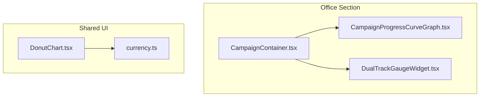
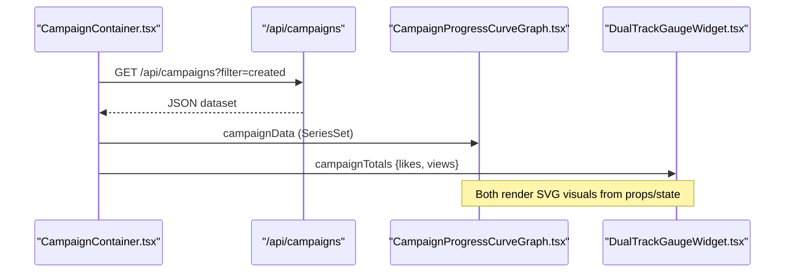
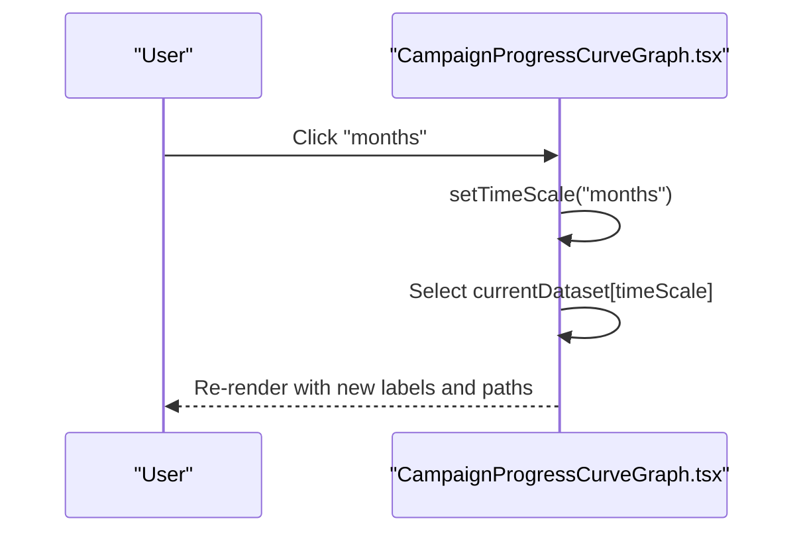
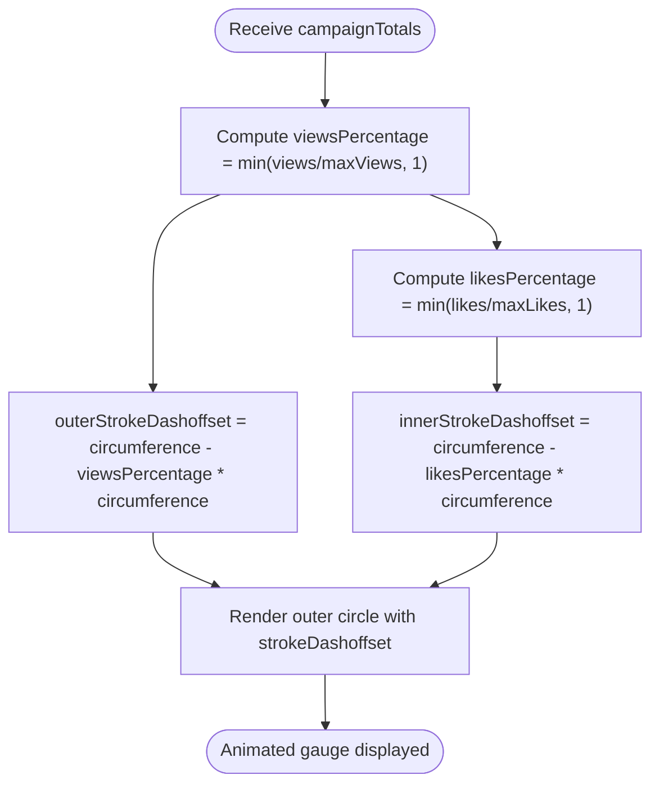
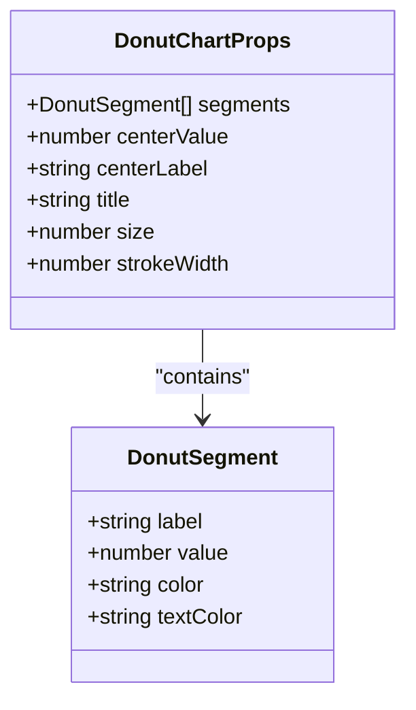
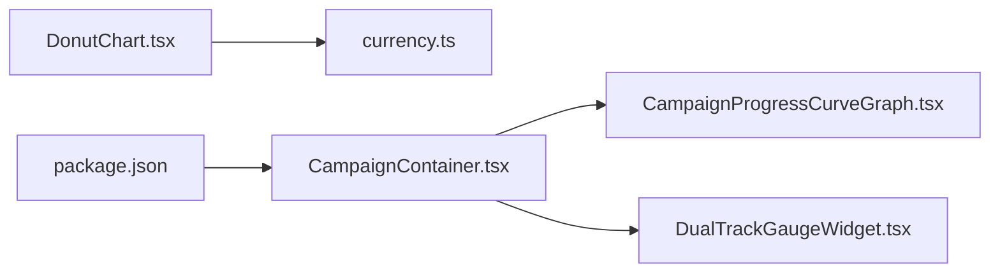

# Analytics & Visualization Components

<cite>
**Referenced Files in This Document**
- [CampaignProgressCurveGraph.tsx](file://src/components/office/CampaignProgressCurveGraph.tsx)
- [DualTrackGaugeWidget.tsx](file://src/components/office/DualTrackGaugeWidget.tsx)
- [DonutChart.tsx](file://src/components/DonutChart.tsx)
- [CampaignContainer.tsx](file://src/components/office/CampaignContainer.tsx)
- [currency.ts](file://src/lib/currency.ts)
- [package.json](file://package.json)
</cite>

## Table of Contents
1. [Introduction](#introduction)
2. [Project Structure](#project-structure)
3. [Core Components](#core-components)
4. [Architecture Overview](#architecture-overview)
5. [Detailed Component Analysis](#detailed-component-analysis)
6. [Dependency Analysis](#dependency-analysis)
7. [Performance Considerations](#performance-considerations)
8. [Troubleshooting Guide](#troubleshooting-guide)
9. [Conclusion](#conclusion)
10. [Appendices](#appendices)

## Introduction
This document provides detailed documentation for the analytics visualization components used across the dashboard:
- Campaign Progress Curve Graph
- Dual Track Gauge Widget
- Donut Chart

It covers configuration options, data binding patterns, customization capabilities, underlying charting approach (pure SVG), animation implementations, responsive scaling behaviors, accessibility considerations, and guidance for choosing appropriate visualizations for different scenarios. It also includes examples for integrating with real-time data streams and optimizing performance for large datasets.

## Project Structure
The visualization components are implemented as React client components using native SVG rendering without external chart libraries. They are composed within the Office section and consumed by container components that fetch live data.

**Diagram sources**
- [CampaignContainer.tsx:1-120](file://src/components/office/CampaignContainer.tsx#L1-L120)
- [CampaignProgressCurveGraph.tsx:1-146](file://src/components/office/CampaignProgressCurveGraph.tsx#L1-L146)
- [DualTrackGaugeWidget.tsx:1-130](file://src/components/office/DualTrackGaugeWidget.tsx#L1-L130)
- [DonutChart.tsx:1-164](file://src/components/DonutChart.tsx#L1-L164)
- [currency.ts:1-56](file://src/lib/currency.ts#L1-L56)

**Section sources**
- [CampaignContainer.tsx:1-120](file://src/components/office/CampaignContainer.tsx#L1-L120)
- [package.json:1-45](file://package.json#L1-L45)

## Core Components
- Campaign Progress Curve Graph: A pure SVG line chart with smooth curves, time-scale toggles (days/months/years), dual series (likes and views), and formatted axis labels.
- Dual Track Gauge Widget: A pair of concentric circular gauges showing campaign views and likes, with platform selection and animated progress arcs.
- Donut Chart: A configurable SVG donut chart with segments, center value/label, size/stroke controls, and a legend.

Key characteristics:
- No external charting library; all charts are built with SVG and React state.
- Responsive via viewBox and Tailwind utility classes.
- Animations via CSS transitions on stroke-dashoffset properties.
- Data binding through props and local state; containers can supply live data.

**Section sources**
- [CampaignProgressCurveGraph.tsx:1-146](file://src/components/office/CampaignProgressCurveGraph.tsx#L1-L146)
- [DualTrackGaugeWidget.tsx:1-130](file://src/components/office/DualTrackGaugeWidget.tsx#L1-L130)
- [DonutChart.tsx:1-164](file://src/components/DonutChart.tsx#L1-L164)

## Architecture Overview
The components follow a simple composition pattern:
- Container components orchestrate data fetching and pass derived metrics to visualization components.
- Visualization components render SVG elements based on props and manage minimal internal state (e.g., active time scale or selected platform).
- Shared utilities provide number formatting.

**Diagram sources**
- [CampaignContainer.tsx:20-116](file://src/components/office/CampaignContainer.tsx#L20-L116)
- [CampaignProgressCurveGraph.tsx:9-30](file://src/components/office/CampaignProgressCurveGraph.tsx#L9-L30)
- [DualTrackGaugeWidget.tsx:5-31](file://src/components/office/DualTrackGaugeWidget.tsx#L5-L31)

## Detailed Component Analysis

### Campaign Progress Curve Graph
Purpose:
- Visualize campaign engagement trends over selectable time scales with two series (views and likes).

Configuration options:
- campaignData: Optional SeriesSet keyed by days/months/years, each containing labels, likes[], and views[]. If omitted, default mock data is used.

Data binding patterns:
- Time scale selection updates currentDataset via local state.
- Y-axis ticks computed from max(views) to ensure consistent scaling.
- Smooth curve generation uses cubic bezier segments between points.

Customization capabilities:
- Colors for series lines are hardcoded but can be extended via props.
- Dimensions are fixed in viewBox; responsive scaling achieved via CSS width/height and max-height constraints.
- Formatting function adapts axis labels to k/m suffixes.

Animation and responsiveness:
- No explicit animations on lines; smooth curves improve readability.
- Responsive behavior relies on viewBox and Tailwind classes.

Accessibility:
- The component currently lacks ARIA attributes and keyboard navigation for time scale buttons. Adding aria-labels and focus management would improve accessibility.

Performance:
- Path computation is O(n) per series; suitable for typical dashboard sizes. For very large datasets, consider downsampling or virtualizing points.

Usage example path:
- See how it receives data and renders in the container.

**Section sources**
- [CampaignProgressCurveGraph.tsx:5-80](file://src/components/office/CampaignProgressCurveGraph.tsx#L5-L80)
- [CampaignProgressCurveGraph.tsx:82-146](file://src/components/office/CampaignProgressCurveGraph.tsx#L82-L146)

#### Sequence Diagram: Time Scale Switching

**Diagram sources**
- [CampaignProgressCurveGraph.tsx:9-30](file://src/components/office/CampaignProgressCurveGraph.tsx#L9-L30)
- [CampaignProgressCurveGraph.tsx:90-102](file://src/components/office/CampaignProgressCurveGraph.tsx#L90-L102)

### Dual Track Gauge Widget
Purpose:
- Display two concentric gauges representing campaign views (outer) and likes (inner), with platform-specific colors and totals.

Configuration options:
- campaignTotals: Optional object with likes and views numbers. Falls back to defaults if not provided.
- Internal state: selectedPlatform determines color theme and icon.

Data binding patterns:
- Percentages computed from values vs. maximums.
- strokeDasharray and strokeDashoffset animate progress arcs.

Customization capabilities:
- Platform palette and icons are defined locally; extendable via props or config object.
- Sizes are fixed; responsive via percentage-based sizing and viewBox.

Animation and responsiveness:
- CSS transition on stroke-dashoffset provides smooth gauge updates.
- Responsive layout uses flexbox and relative sizing.

Accessibility:
- Buttons for platform selection lack aria-labels; adding descriptive labels improves screen reader support.
- Consider adding aria-live regions to announce updated totals.

Performance:
- Minimal DOM updates; efficient for frequent updates.

Usage example path:
- See how totals are derived and passed from the container.

**Section sources**
- [DualTrackGaugeWidget.tsx:5-41](file://src/components/office/DualTrackGaugeWidget.tsx#L5-L41)
- [DualTrackGaugeWidget.tsx:43-130](file://src/components/office/DualTrackGaugeWidget.tsx#L43-L130)
- [CampaignContainer.tsx:101-116](file://src/components/office/CampaignContainer.tsx#L101-L116)

#### Flowchart: Gauge Progress Calculation

**Diagram sources**
- [DualTrackGaugeWidget.tsx:27-41](file://src/components/office/DualTrackGaugeWidget.tsx#L27-L41)
- [DualTrackGaugeWidget.tsx:71-101](file://src/components/office/DualTrackGaugeWidget.tsx#L71-L101)

### Donut Chart
Purpose:
- Present proportional breakdowns with customizable segments, center value/label, and legend.

Configuration options:
- segments: Array of { label, value, color, textColor }
- centerValue: Numeric value shown at center
- centerLabel: Label under center value
- title: Header text above chart
- size: Diameter of the chart
- strokeWidth: Thickness of the ring

Data binding patterns:
- Total computed from sum of segment values.
- Each segment’s arc length calculated from percentage of total.
- Uses strokeDasharray and strokeDashoffset to draw segments.

Customization capabilities:
- Segment colors mapped via CSS variables to Tailwind-like tokens.
- Center content fully customizable via props.
- Legend auto-generated from segments.

Animation and responsiveness:
- No built-in animations; can be added via CSS transitions on strokeDashoffset changes.
- Responsive via fixed size prop; can be wrapped in responsive containers.

Accessibility:
- Lacks ARIA roles and descriptions for segments; adding role="img", aria-label, and summary text would improve accessibility.
- Keyboard navigation not applicable to static SVG; ensure surrounding controls are accessible.

Performance:
- Efficient for moderate segment counts; avoid excessive segments for performance.

Usage example path:
- Uses currency formatter for compact display.

**Section sources**
- [DonutChart.tsx:6-29](file://src/components/DonutChart.tsx#L6-L29)
- [DonutChart.tsx:30-164](file://src/components/DonutChart.tsx#L30-L164)
- [currency.ts:37-43](file://src/lib/currency.ts#L37-L43)

#### Class Diagram: Donut Chart Props and Types

**Diagram sources**
- [DonutChart.tsx:6-20](file://src/components/DonutChart.tsx#L6-L20)

## Dependency Analysis
- External dependencies: None for charting; all visualizations use native SVG and React.
- Shared utilities: Number formatting via currency.ts.
- Integration: CampaignContainer orchestrates data flow to graph and gauge components.

**Diagram sources**
- [package.json:15-32](file://package.json#L15-L32)
- [CampaignContainer.tsx:1-120](file://src/components/office/CampaignContainer.tsx#L1-L120)
- [DonutChart.tsx:1-164](file://src/components/DonutChart.tsx#L1-L164)
- [currency.ts:1-56](file://src/lib/currency.ts#L1-L56)

**Section sources**
- [package.json:15-32](file://package.json#L15-L32)
- [CampaignContainer.tsx:1-120](file://src/components/office/CampaignContainer.tsx#L1-L120)

## Performance Considerations
- Avoid heavy computations on every render: memoize expensive calculations (e.g., path generation) when data changes frequently.
- Downsample large datasets before rendering to maintain interactivity.
- Use requestAnimationFrame or throttled updates for real-time streams to prevent excessive re-renders.
- Prefer CSS transitions for animations to leverage GPU acceleration where possible.
- Keep segment counts reasonable in Donut Chart to avoid layout thrashing.

[No sources needed since this section provides general guidance]

## Troubleshooting Guide
Common issues and resolutions:
- Missing or incorrect data shapes: Ensure campaignData matches expected structure (labels, likes[], views[]) per time scale.
- Zero or negative values: Guard against division by zero when computing percentages; clamp to safe ranges.
- Accessibility gaps: Add aria-labels to interactive controls (time scale buttons, platform selectors) and descriptive text for charts.
- Color contrast: Verify foreground/background contrast ratios meet WCAG guidelines for readability.

**Section sources**
- [CampaignProgressCurveGraph.tsx:90-102](file://src/components/office/CampaignProgressCurveGraph.tsx#L90-L102)
- [DualTrackGaugeWidget.tsx:51-68](file://src/components/office/DualTrackGaugeWidget.tsx#L51-L68)

## Conclusion
These visualization components deliver lightweight, customizable, and responsive analytics displays using pure SVG and React. They integrate seamlessly with container-driven data flows, support smooth animations, and can be extended for accessibility and performance needs. Choose the appropriate chart type based on data nature: line graphs for trends, gauges for progress, and donuts for proportions. Maintain consistency through shared styling and utility functions.

[No sources needed since this section summarizes without analyzing specific files]

## Appendices

### Choosing Visualization Types
- Trends over time: Campaign Progress Curve Graph
- Progress toward targets: Dual Track Gauge Widget
- Proportional breakdowns: Donut Chart

[No sources needed since this section provides general guidance]

### Real-Time Data Integration Examples
- Stream updates to Dual Track Gauge Widget by debouncing incoming events and updating campaignTotals.
- Update Campaign Progress Curve Graph with sliding windows of recent data points, recomputing paths efficiently.

[No sources needed since this section provides general guidance]

### Accessibility Enhancements Checklist
- Add aria-labels to buttons (time scale, platform selection).
- Provide aria-describedby linking to chart summaries.
- Ensure focus states are visible and keyboard navigable.
- Validate color contrast ratios for text and chart elements.

[No sources needed since this section provides general guidance]