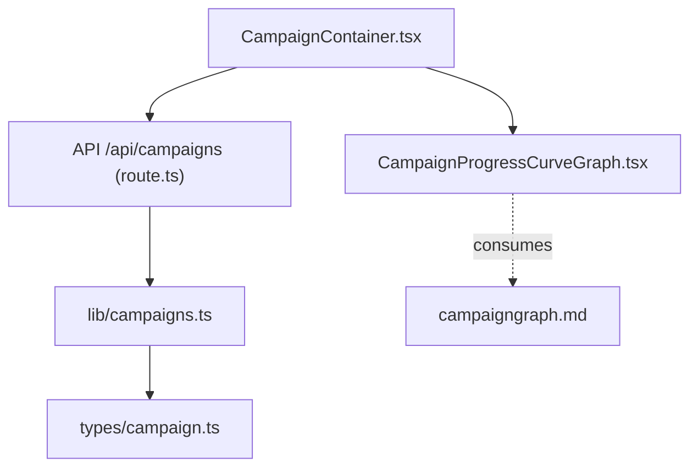
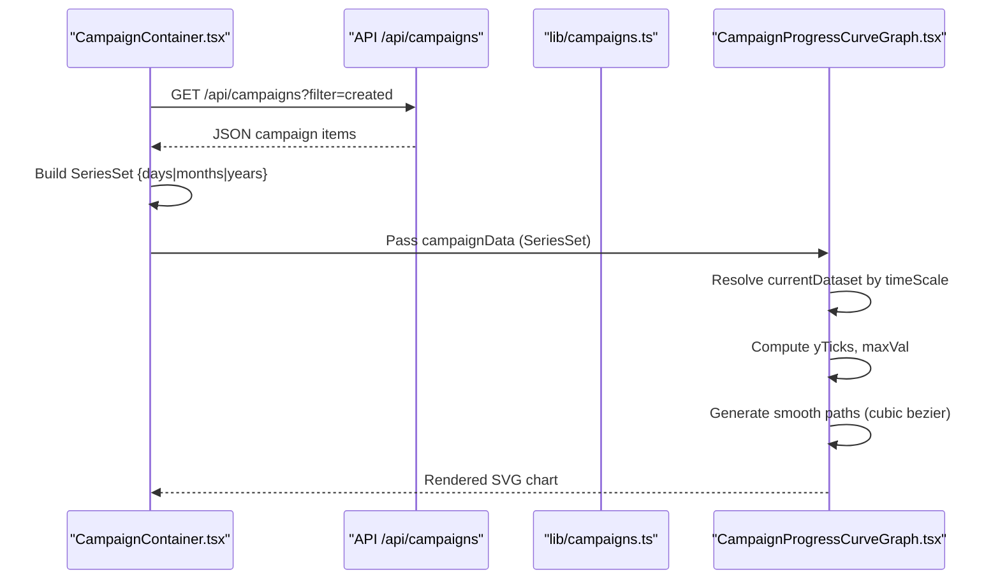
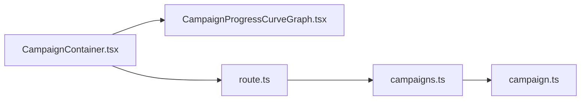
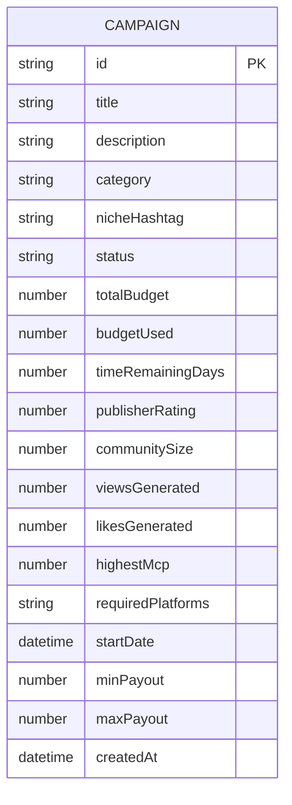

# Campaign Progress Curve Graph

<cite>
**Referenced Files in This Document**
- [CampaignProgressCurveGraph.tsx](file://src/components/office/CampaignProgressCurveGraph.tsx)
- [CampaignContainer.tsx](file://src/components/office/CampaignContainer.tsx)
- [route.ts](file://src/app/api/campaigns/route.ts)
- [campaigns.ts](file://src/lib/campaigns.ts)
- [campaign.ts](file://src/types/campaign.ts)
- [campaigngraph.md](file://campaigngraph.md)
</cite>

## Table of Contents
1. [Introduction](#introduction)
2. [Project Structure](#project-structure)
3. [Core Components](#core-components)
4. [Architecture Overview](#architecture-overview)
5. [Detailed Component Analysis](#detailed-component-analysis)
6. [Dependency Analysis](#dependency-analysis)
7. [Performance Considerations](#performance-considerations)
8. [Troubleshooting Guide](#troubleshooting-guide)
9. [Conclusion](#conclusion)
10. [Appendices](#appendices)

## Introduction
This document explains the Campaign Progress Curve Graph component that visualizes campaign metrics (likes and views) over time with multi-scale support for days, months, and years. It covers the smooth curve rendering algorithm using cubic bezier curves, data binding patterns for campaign metrics, responsive scaling behaviors, accessibility considerations, and guidance for extending the component to additional metrics or custom time periods.

## Project Structure
The graph is implemented as a client-side React component and is embedded within a container that fetches campaign data from an API route. The data flow integrates with server routes and database models to supply campaign totals used to generate series for visualization.

**Diagram sources**
- [CampaignProgressCurveGraph.tsx:1-146](file://src/components/office/CampaignProgressCurveGraph.tsx#L1-L146)
- [CampaignContainer.tsx:1-121](file://src/components/office/CampaignContainer.tsx#L1-L121)
- [route.ts:46-98](file://src/app/api/campaigns/route.ts#L46-L98)
- [campaigns.ts:34-46](file://src/lib/campaigns.ts#L34-L46)
- [campaign.ts:1-33](file://src/types/campaign.ts#L1-L33)
- [campaigngraph.md:17-29](file://campaigngraph.md#L17-L29)

**Section sources**
- [CampaignProgressCurveGraph.tsx:1-146](file://src/components/office/CampaignProgressCurveGraph.tsx#L1-L146)
- [CampaignContainer.tsx:1-121](file://src/components/office/CampaignContainer.tsx#L1-L121)
- [route.ts:46-98](file://src/app/api/campaigns/route.ts#L46-L98)
- [campaigns.ts:34-46](file://src/lib/campaigns.ts#L34-L46)
- [campaign.ts:1-33](file://src/types/campaign.ts#L1-L33)
- [campaigngraph.md:17-29](file://campaigngraph.md#L17-L29)

## Core Components
- CampaignProgressCurveGraph: Renders a responsive SVG line chart with two series (views and likes), supports switching between days, months, and years scales, and computes smooth paths via cubic bezier segments.
- CampaignContainer: Orchestrates data fetching from the campaigns API, builds time-series datasets per scale, and passes them into the graph. Also composes related widgets like the audience gauge.

Key responsibilities:
- Time scale selection and dataset resolution
- Metric formatting for Y-axis labels
- Smooth path generation for both series
- Responsive SVG sizing

**Section sources**
- [CampaignProgressCurveGraph.tsx:9-77](file://src/components/office/CampaignProgressCurveGraph.tsx#L9-L77)
- [CampaignContainer.tsx:20-65](file://src/components/office/CampaignContainer.tsx#L20-L65)

## Architecture Overview
The component follows a unidirectional data flow:
- CampaignContainer fetches campaign totals and constructs SeriesSet objects for each time scale.
- CampaignProgressCurveGraph receives optional campaignData; if not provided, it falls back to built-in sample data.
- Rendering uses SVG with computed coordinates and cubic bezier curves for smooth lines.

**Diagram sources**
- [CampaignContainer.tsx:23-65](file://src/components/office/CampaignContainer.tsx#L23-L65)
- [route.ts:46-98](file://src/app/api/campaigns/route.ts#L46-L98)
- [campaigns.ts:34-46](file://src/lib/campaigns.ts#L34-L46)
- [CampaignProgressCurveGraph.tsx:12-77](file://src/components/office/CampaignProgressCurveGraph.tsx#L12-L77)

## Detailed Component Analysis

### Multi-Scale Time Series Visualization
- Supported scales: days, months, years.
- Data structure: SeriesSet maps each scale to labels and numeric arrays for likes and views.
- Resolution: The graph selects the current dataset based on the active time scale state. If external campaignData is provided, it overrides defaults.

Implementation highlights:
- State-driven time scale selection
- Fallback to internal sample data when no external data is passed
- Labels and metric arrays aligned per scale

**Section sources**
- [CampaignProgressCurveGraph.tsx:5-30](file://src/components/office/CampaignProgressCurveGraph.tsx#L5-L30)
- [CampaignContainer.tsx:37-53](file://src/components/office/CampaignContainer.tsx#L37-L53)

### Smooth Curve Rendering Algorithm (Cubic Bezier)
- Coordinates are computed linearly across X and normalized against the maximum view value for Y.
- For sequences longer than two points, the path uses cubic bezier segments derived from neighboring points to ensure smooth transitions.
- Edge cases: single point returns a move command; two points return a straight line.

Algorithm overview:
- Map each data point to (x, y)
- For each segment, compute control points using adjacent points to achieve smoothness
- Concatenate commands into a single SVG path string

Complexity:
- Time: O(n) to map points and build the path
- Space: O(n) for intermediate points array

**Section sources**
- [CampaignProgressCurveGraph.tsx:49-77](file://src/components/office/CampaignProgressCurveGraph.tsx#L49-L77)

### Data Binding Patterns for Campaign Metrics
- Two series: views (green) and likes (gold).
- Y-axis ticks are derived from the maximum view value to maintain consistent scaling.
- Metric values are formatted to human-readable units (k/m).

Binding behavior:
- External data can be injected via campaignData prop
- Internal fallback ensures the component renders without external dependencies
- Axis labels and legend reflect the two metrics

**Section sources**
- [CampaignProgressCurveGraph.tsx:32-47](file://src/components/office/CampaignProgressCurveGraph.tsx#L32-L47)
- [CampaignProgressCurveGraph.tsx:107-129](file://src/components/office/CampaignProgressCurveGraph.tsx#L107-L129)

### Responsive Scaling Behaviors
- SVG uses viewBox with fixed width and height, scaled via CSS to fill available space.
- The container uses flexible layout utilities to adapt to different screen sizes.
- Maximum height constraints prevent excessive growth on large screens.

Responsiveness:
- Width adapts to parent container
- Height constrained to a reasonable maximum
- Grid layout in the container arranges graph and auxiliary widgets responsively

**Section sources**
- [CampaignProgressCurveGraph.tsx:40-44](file://src/components/office/CampaignProgressCurveGraph.tsx#L40-L44)
- [CampaignProgressCurveGraph.tsx:105-106](file://src/components/office/CampaignProgressCurveGraph.tsx#L105-L106)
- [CampaignContainer.tsx:86-99](file://src/components/office/CampaignContainer.tsx#L86-L99)

### Customizing Time Scales
- Extend the TimeScale type and add corresponding entries in the dataset mapping.
- Update the time scale selector UI to include the new option.
- Ensure labels and arrays align in length and semantics.

Guidance:
- Keep label arrays and metric arrays synchronized
- Adjust Y-axis tick computation if necessary for new ranges
- Validate that smooth path generation handles the new number of points

**Section sources**
- [CampaignProgressCurveGraph.tsx:5-28](file://src/components/office/CampaignProgressCurveGraph.tsx#L5-L28)
- [CampaignProgressCurveGraph.tsx:90-102](file://src/components/office/CampaignProgressCurveGraph.tsx#L90-L102)

### Integrating with Real-Time Campaign Data Streams
- Replace static or mock data with live updates via WebSocket or polling.
- Maintain immutability of series arrays to trigger re-renders efficiently.
- Debounce frequent updates to avoid excessive recalculations.

Integration pattern:
- Subscribe to stream in a useEffect
- Normalize incoming events into SeriesSet format
- Update state with new series for the active time scale

**Section sources**
- [CampaignContainer.tsx:23-65](file://src/components/office/CampaignContainer.tsx#L23-L65)
- [CampaignProgressCurveGraph.tsx:12-30](file://src/components/office/CampaignProgressCurveGraph.tsx#L12-L30)

### Optimizing Performance for Large Datasets
- Downsample points before rendering to reduce path complexity.
- Memoize computed paths and axis ticks where appropriate.
- Use requestAnimationFrame or throttling for frequent updates.

Optimization strategies:
- Limit visible points per scale
- Cache coordinate mapping results
- Avoid unnecessary recomputation by stabilizing inputs

[No sources needed since this section provides general guidance]

### Accessibility Features
Current implementation:
- Buttons for time scale switching are interactive elements.
- No explicit aria attributes or keyboard navigation handlers are present.

Recommended enhancements:
- Add aria-labels to buttons describing the selected scale
- Implement keyboard navigation (arrow keys or Enter/Space) to switch scales
- Provide role="img" and aria-describedby for the SVG chart with a text summary of trends
- Ensure focus management when toggling scales

Accessibility roadmap:
- Introduce accessible names and descriptions
- Support keyboard-only users
- Announce changes to assistive technologies

[No sources needed since this section proposes enhancements beyond current code]

### Extending to Additional Metrics or Custom Time Periods
To add a new metric:
- Extend the SeriesSet type to include the new metric arrays
- Update the smooth path generator to handle the new series
- Add legend entries and styling for the new metric

To add custom time periods:
- Expand the TimeScale union type
- Provide labels and arrays for the new period
- Update the selector UI accordingly

**Section sources**
- [CampaignProgressCurveGraph.tsx:5-8](file://src/components/office/CampaignProgressCurveGraph.tsx#L5-L8)
- [CampaignProgressCurveGraph.tsx:133-142](file://src/components/office/CampaignProgressCurveGraph.tsx#L133-L142)

## Dependency Analysis
The graph depends on:
- CampaignContainer for data provisioning
- API route for campaign retrieval
- Library functions for campaign queries
- Type definitions for campaign data shape

**Diagram sources**
- [CampaignContainer.tsx:1-121](file://src/components/office/CampaignContainer.tsx#L1-L121)
- [route.ts:46-98](file://src/app/api/campaigns/route.ts#L46-L98)
- [campaigns.ts:34-46](file://src/lib/campaigns.ts#L34-L46)
- [campaign.ts:1-33](file://src/types/campaign.ts#L1-L33)
- [CampaignProgressCurveGraph.tsx:1-146](file://src/components/office/CampaignProgressCurveGraph.tsx#L1-L146)

**Section sources**
- [CampaignContainer.tsx:1-121](file://src/components/office/CampaignContainer.tsx#L1-L121)
- [route.ts:46-98](file://src/app/api/campaigns/route.ts#L46-L98)
- [campaigns.ts:34-46](file://src/lib/campaigns.ts#L34-L46)
- [campaign.ts:1-33](file://src/types/campaign.ts#L1-L33)
- [CampaignProgressCurveGraph.tsx:1-146](file://src/components/office/CampaignProgressCurveGraph.tsx#L1-L146)

## Performance Considerations
- Path generation is linear in the number of points; consider downsampling for very large datasets.
- Recomputing axes and paths on every render can be optimized with memoization.
- Frequent real-time updates should be throttled or debounced to minimize reflows.
- Use stable keys and minimal DOM mutations to improve rendering performance.

[No sources needed since this section provides general guidance]

## Troubleshooting Guide
Common issues and resolutions:
- Empty or missing data: The graph falls back to internal sample data; verify external data shape and presence.
- Incorrect scaling: Ensure maxVal calculation accounts for zero or negative values; adjust Y-axis ticks accordingly.
- Misaligned labels: Confirm that labels arrays match the length of metric arrays for each scale.
- API errors: Check network requests and error handling in the container; ensure the API returns expected fields.

Debugging steps:
- Inspect the resolved currentDataset in the graph
- Log API responses in the container
- Validate types and field names from campaign types

**Section sources**
- [CampaignProgressCurveGraph.tsx:12-30](file://src/components/office/CampaignProgressCurveGraph.tsx#L12-L30)
- [CampaignContainer.tsx:23-65](file://src/components/office/CampaignContainer.tsx#L23-L65)
- [route.ts:94-98](file://src/app/api/campaigns/route.ts#L94-L98)

## Conclusion
The Campaign Progress Curve Graph provides a clear, responsive visualization of campaign metrics across multiple time scales with smooth curve rendering. It integrates seamlessly with the container and API layer to display real-time or sampled data. With enhancements for accessibility and performance optimizations, it can serve as a robust foundation for advanced analytics dashboards.

[No sources needed since this section summarizes without analyzing specific files]

## Appendices

### Data Model Reference

**Diagram sources**
- [campaign.ts:1-33](file://src/types/campaign.ts#L1-L33)
- [route.ts:19-44](file://src/app/api/campaigns/route.ts#L19-L44)

### Design Notes
- Visual design requirements specify two curves (likes gold, views green), white axes, and constant chart size while scaling values appropriately.
- Y-axis formatting uses k/m units consistently.

**Section sources**
- [campaigngraph.md:17-29](file://campaigngraph.md#L17-L29)