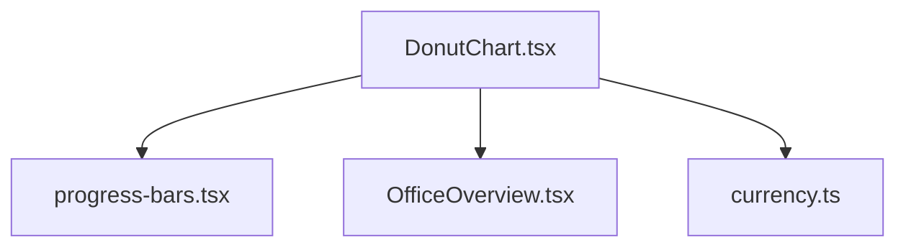
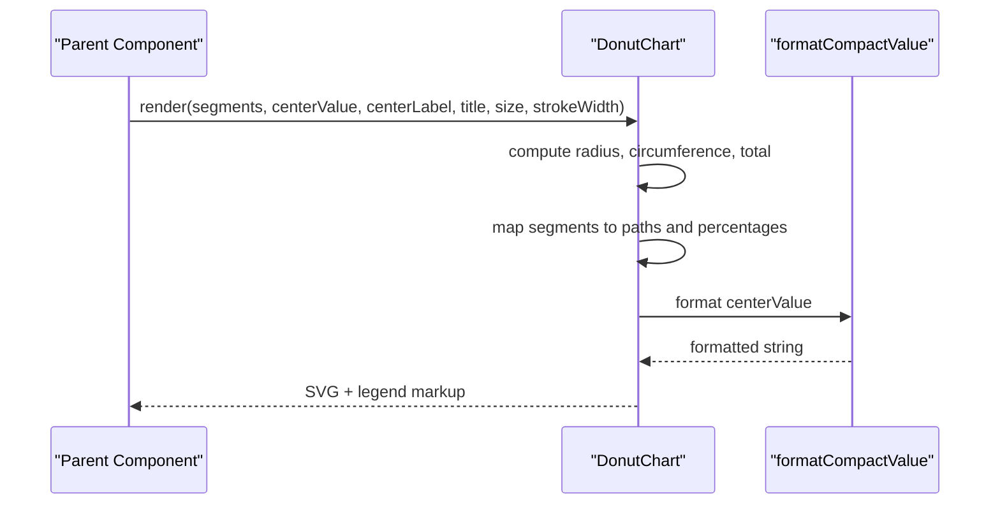
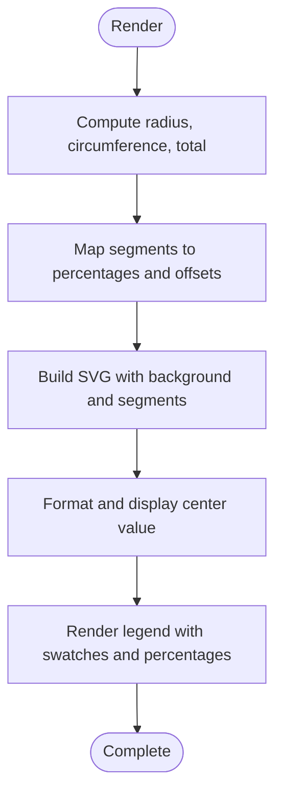
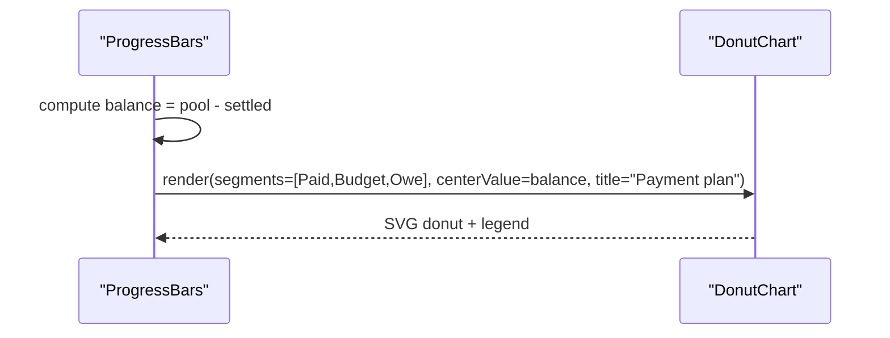
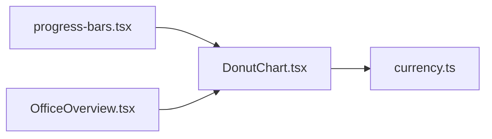

# Donut Chart Component

<cite>
**Referenced Files in This Document**
- [DonutChart.tsx](file://src/components/DonutChart.tsx)
- [progress-bars.tsx](file://src/app/campaign-manager/progress-bars.tsx)
- [currency.ts](file://src/lib/currency.ts)
- [OfficeOverview.tsx](file://src/components/office/OfficeOverview.tsx)
</cite>

## Table of Contents
1. [Introduction](#introduction)
2. [Project Structure](#project-structure)
3. [Core Components](#core-components)
4. [Architecture Overview](#architecture-overview)
5. [Detailed Component Analysis](#detailed-component-analysis)
6. [Dependency Analysis](#dependency-analysis)
7. [Performance Considerations](#performance-considerations)
8. [Troubleshooting Guide](#troubleshooting-guide)
9. [Conclusion](#conclusion)
10. [Appendices](#appendices)

## Introduction
This document provides comprehensive documentation for the Donut Chart component used across the application to visualize circular data distributions. It explains how segments are configured, how colors and labels are themed, and how the SVG-based implementation renders responsive charts. It also covers animation transitions between data states, accessibility considerations, customization options, interactivity patterns, and integration with dynamic data sources. Practical examples include budget allocation, campaign performance breakdowns, and resource distribution scenarios.

## Project Structure
The Donut Chart is implemented as a reusable client-side React component that renders an SVG circle chart with segmented strokes and a centered value label. It is consumed by higher-level UI components such as the campaign manager progress dashboard and office overview widgets.

**Diagram sources**
- [DonutChart.tsx:1-164](file://src/components/DonutChart.tsx#L1-L164)
- [progress-bars.tsx:1-150](file://src/app/campaign-manager/progress-bars.tsx#L1-L150)
- [OfficeOverview.tsx:90-145](file://src/components/office/OfficeOverview.tsx#L90-L145)
- [currency.ts:1-56](file://src/lib/currency.ts#L1-L56)

**Section sources**
- [DonutChart.tsx:1-164](file://src/components/DonutChart.tsx#L1-L164)
- [progress-bars.tsx:1-150](file://src/app/campaign-manager/progress-bars.tsx#L1-L150)
- [OfficeOverview.tsx:90-145](file://src/components/office/OfficeOverview.tsx#L90-L145)
- [currency.ts:1-56](file://src/lib/currency.ts#L1-L56)

## Core Components
- DonutChart: Renders a donut-shaped visualization using SVG circles with stroke-dasharray and stroke-dashoffset to draw proportional segments. It supports configurable segment definitions, center value and label, title, size, and stroke width.
- Usage in Campaign Manager: Demonstrates real-world usage for payment plan breakdowns and target mix visualization.
- Office Overview: Contains alternative circular visualizations (conic gradients) for single-value metrics, complementing the multi-segment DonutChart.

Key responsibilities:
- Compute total and percentages from segment values
- Generate SVG segments via circle strokes
- Render legend with color swatches and percentage labels
- Format center value using currency utilities

**Section sources**
- [DonutChart.tsx:6-20](file://src/components/DonutChart.tsx#L6-L20)
- [DonutChart.tsx:22-65](file://src/components/DonutChart.tsx#L22-L65)
- [progress-bars.tsx:22-33](file://src/app/campaign-manager/progress-bars.tsx#L22-L33)
- [progress-bars.tsx:80-98](file://src/app/campaign-manager/progress-bars.tsx#L80-L98)
- [OfficeOverview.tsx:92-145](file://src/components/office/OfficeOverview.tsx#L92-L145)
- [currency.ts:37-39](file://src/lib/currency.ts#L37-L39)

## Architecture Overview
The DonutChart is a pure presentational component that receives structured data via props and renders SVG elements. It does not manage external state; updates occur when parent components re-render with new props.

**Diagram sources**
- [DonutChart.tsx:22-65](file://src/components/DonutChart.tsx#L22-L65)
- [DonutChart.tsx:67-163](file://src/components/DonutChart.tsx#L67-L163)
- [currency.ts:37-39](file://src/lib/currency.ts#L37-L39)

## Detailed Component Analysis

### DonutChart Component
- Inputs:
  - segments: array of { label, value, color, textColor }
  - centerValue: numeric value displayed in the center
  - centerLabel: text describing the center value
  - title: section title above the chart
  - size: overall width/height of the chart container
  - strokeWidth: thickness of the donut ring
- Rendering logic:
  - Calculates radius based on size and strokeWidth
  - Computes circumference for stroke dash calculations
  - Derives total and per-segment percentages
  - Uses SVG circle elements with stroke-dasharray and stroke-dashoffset to draw arcs
  - Rotates the SVG to start at the top
  - Displays a centered value using a formatting utility
  - Renders a legend with color swatches, labels, and percentages
- Styling:
  - Tailwind classes for layout and typography
  - CSS variables map color tokens to actual colors for stroke rendering
  - Background track circle provides contrast

**Diagram sources**
- [DonutChart.tsx:30-55](file://src/components/DonutChart.tsx#L30-L55)
- [DonutChart.tsx:67-163](file://src/components/DonutChart.tsx#L67-L163)

**Section sources**
- [DonutChart.tsx:6-20](file://src/components/DonutChart.tsx#L6-L20)
- [DonutChart.tsx:22-65](file://src/components/DonutChart.tsx#L22-L65)
- [DonutChart.tsx:67-163](file://src/components/DonutChart.tsx#L67-L163)

### Usage Example: Payment Plan Breakdown
- The campaign manager uses the DonutChart to show a payment plan split into Paid, Budget, and Owe segments.
- Segments are filtered to exclude zero values before rendering.
- The center displays the calculated balance derived from pool and settled amounts.

**Diagram sources**
- [progress-bars.tsx:68-98](file://src/app/campaign-manager/progress-bars.tsx#L68-L98)
- [DonutChart.tsx:22-65](file://src/components/DonutChart.tsx#L22-L65)

**Section sources**
- [progress-bars.tsx:22-33](file://src/app/campaign-manager/progress-bars.tsx#L22-L33)
- [progress-bars.tsx:68-98](file://src/app/campaign-manager/progress-bars.tsx#L68-L98)

### Alternative Circular Visualizations in Office Overview
- Single-value circular indicators use conic gradients to represent coverage or momentum scores.
- These complement the multi-segment DonutChart by providing quick status snapshots.

**Section sources**
- [OfficeOverview.tsx:92-145](file://src/components/office/OfficeOverview.tsx#L92-L145)

## Dependency Analysis
- DonutChart depends on:
  - React for component rendering
  - Currency formatting utility for center value presentation
- Consumed by:
  - Campaign manager progress bars for payment plan visualization
  - Other pages may adopt similar patterns for budget/resource breakdowns

**Diagram sources**
- [DonutChart.tsx:1-5](file://src/components/DonutChart.tsx#L1-L5)
- [progress-bars.tsx:1-5](file://src/app/campaign-manager/progress-bars.tsx#L1-L5)
- [OfficeOverview.tsx:90-145](file://src/components/office/OfficeOverview.tsx#L90-L145)
- [currency.ts:37-39](file://src/lib/currency.ts#L37-L39)

**Section sources**
- [DonutChart.tsx:1-5](file://src/components/DonutChart.tsx#L1-L5)
- [progress-bars.tsx:1-5](file://src/app/campaign-manager/progress-bars.tsx#L1-L5)
- [currency.ts:37-39](file://src/lib/currency.ts#L37-L39)

## Performance Considerations
- Segment computation is linear in the number of segments; suitable for typical dashboard sizes.
- SVG circle segments avoid heavy path recalculations; only stroke properties change on data updates.
- Use minimal re-renders by memoizing segment arrays in parent components if datasets are large.
- Avoid excessive animation complexity; prefer simple CSS transitions where possible.

[No sources needed since this section provides general guidance]

## Troubleshooting Guide
- Zero total values: If all segment values are zero, percentages default to zero; ensure at least one non-zero segment for meaningful visualization.
- Color mapping: Ensure segment color strings match expected tokens; the component maps known tokens to CSS variables for stroke rendering.
- Size and stroke ratio: Very small sizes or very thick strokes can cause clipping; adjust size and strokeWidth proportionally.
- Center value formatting: Negative or extremely large numbers will be formatted compactly; verify expectations for your domain.

**Section sources**
- [DonutChart.tsx:30-55](file://src/components/DonutChart.tsx#L30-L55)
- [DonutChart.tsx:57-65](file://src/components/DonutChart.tsx#L57-L65)
- [DonutChart.tsx:127-134](file://src/components/DonutChart.tsx#L127-L134)
- [currency.ts:1-39](file://src/lib/currency.ts#L1-L39)

## Conclusion
The DonutChart component offers a clean, SVG-based solution for displaying proportional data in a circular format. It integrates seamlessly with existing UI patterns, supports flexible segment configuration, and formats center values consistently. While it currently lacks built-in interactivity and accessibility attributes, it serves as a solid foundation for extending with hover effects, keyboard navigation, and ARIA labels to meet broader user needs.

[No sources needed since this section summarizes without analyzing specific files]

## Appendices

### Configuration Options
- segments: Array of objects with label, value, color, textColor
- centerValue: Numeric value shown in the center
- centerLabel: Text describing the center value
- title: Section title rendered above the chart
- size: Width and height of the chart container
- strokeWidth: Thickness of the donut ring

**Section sources**
- [DonutChart.tsx:6-20](file://src/components/DonutChart.tsx#L6-L20)

### Examples

#### Budget Allocation
- Use segments to represent categories like Paid, Budget, Owe with corresponding values and colors.
- Set centerValue to the remaining balance and centerLabel to “Balance”.
- Title can be “Payment plan” or “Budget allocation”.

**Section sources**
- [progress-bars.tsx:22-33](file://src/app/campaign-manager/progress-bars.tsx#L22-L33)
- [progress-bars.tsx:80-98](file://src/app/campaign-manager/progress-bars.tsx#L80-L98)

#### Campaign Performance Breakdown
- Define segments for platforms or channels (e.g., TikTok, YouTube, Instagram, Facebook) with values representing share or performance metrics.
- Filter out zero-value segments to keep the chart concise.
- Optionally add a separate bar or indicator for hit-target progress alongside the donut.

**Section sources**
- [progress-bars.tsx:28-33](file://src/app/campaign-manager/progress-bars.tsx#L28-L33)
- [progress-bars.tsx:101-118](file://src/app/campaign-manager/progress-bars.tsx#L101-L118)

#### Resource Distribution
- Model resources as segments with values indicating allocation percentages.
- Use descriptive labels and distinct colors for clarity.
- Display a summary metric in the center (e.g., total allocated or utilization).

[No sources needed since this section provides conceptual guidance]

### Accessibility Guidance
- Add ARIA roles and labels to make the chart accessible to screen readers:
  - Assign role="img" and aria-label to the SVG container describing the chart’s purpose and current values.
  - Provide a visually hidden summary table or list with segment names, values, and percentages for assistive technologies.
- Keyboard navigation:
  - Wrap each segment in a focusable element (e.g., button or link) with tabindex="0".
  - Implement key handlers for Enter/Space to trigger actions (e.g., show details or navigate to related content).
  - Ensure visible focus styles for keyboard users.

[No sources needed since this section provides general guidance]

### Interactivity Enhancements
- Hover effects:
  - Apply CSS transitions to scale or highlight segments on hover (e.g., increase stroke-width or brightness).
  - Show tooltips with segment details (label, value, percentage).
- Click interactions:
  - Bind click events to open detail panels or drill-down views for selected segments.
  - Debounce rapid clicks to prevent unnecessary re-renders.

[No sources needed since this section provides general guidance]

### Integration with Data Sources
- Fetch data from API endpoints and transform into segment arrays before passing to the DonutChart.
- Handle loading and error states in parent components; optionally render placeholders or fallback visuals.
- Update chart reactively when data changes; consider debouncing frequent updates for performance.

Example pattern:
- Parent component fetches campaign or finance data
- Maps results to segments with computed values and colors
- Passes segments and center metrics to DonutChart

**Section sources**
- [OfficeOverview.tsx:176-211](file://src/components/office/OfficeOverview.tsx#L176-L211)
- [progress-bars.tsx:68-98](file://src/app/campaign-manager/progress-bars.tsx#L68-L98)

### Responsive Scaling Behaviors
- The chart container uses fixed size props; wrap in responsive containers to adapt to different screen sizes.
- Consider using relative units or media queries to adjust size and stroke width for smaller devices.
- Ensure legends remain readable; stack vertically on narrow screens.

[No sources needed since this section provides general guidance]