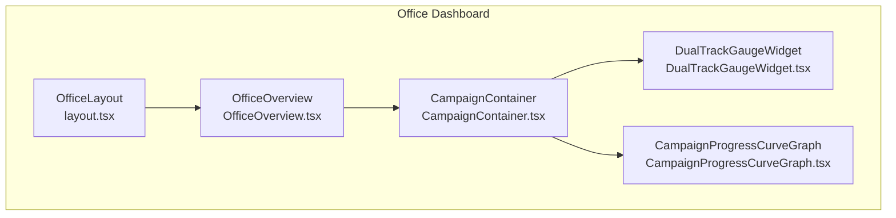
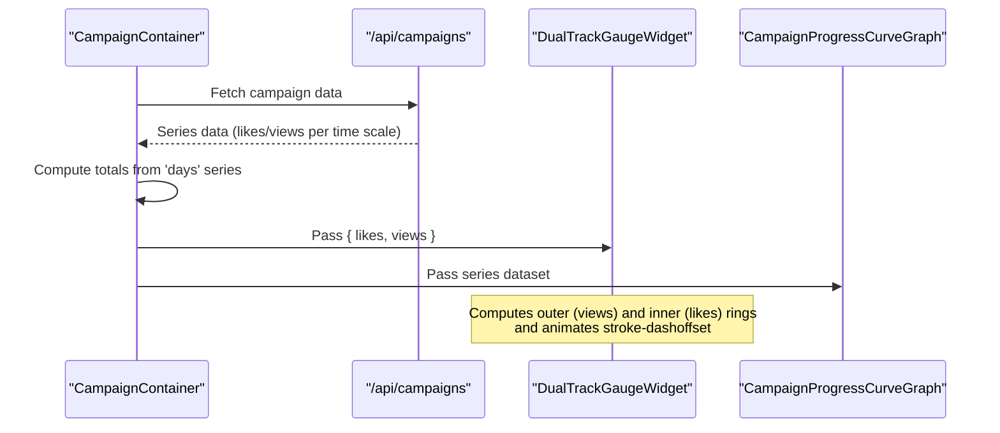
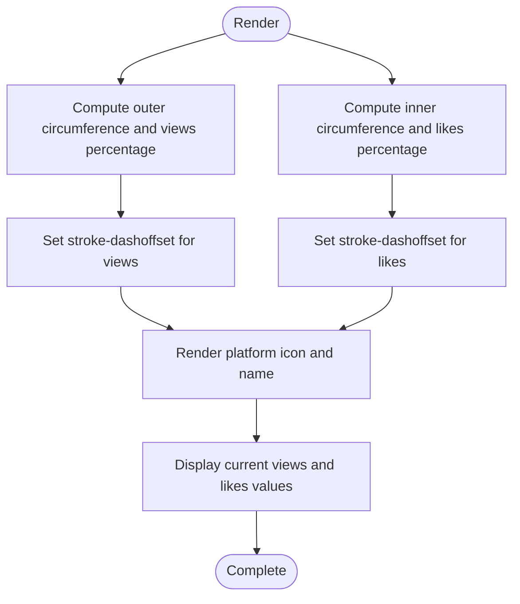
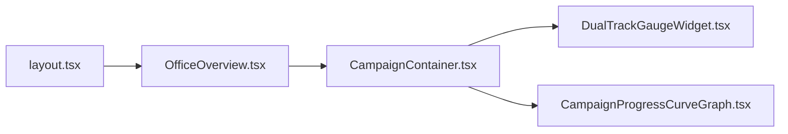

# Dual Track Gauge Widget

<cite>
**Referenced Files in This Document**
- [DualTrackGaugeWidget.tsx](file://src/components/office/DualTrackGaugeWidget.tsx)
- [CampaignContainer.tsx](file://src/components/office/CampaignContainer.tsx)
- [CampaignProgressCurveGraph.tsx](file://src/components/office/CampaignProgressCurveGraph.tsx)
- [OfficeOverview.tsx](file://src/components/office/OfficeOverview.tsx)
- [layout.tsx](file://src/components/office/layout.tsx)
</cite>

## Table of Contents
1. [Introduction](#introduction)
2. [Project Structure](#project-structure)
3. [Core Components](#core-components)
4. [Architecture Overview](#architecture-overview)
5. [Detailed Component Analysis](#detailed-component-analysis)
6. [Dependency Analysis](#dependency-analysis)
7. [Performance Considerations](#performance-considerations)
8. [Troubleshooting Guide](#troubleshooting-guide)
9. [Conclusion](#conclusion)
10. [Appendices](#appendices)

## Introduction
This document provides comprehensive documentation for the Dual Track Gauge Widget, a dual-axis circular gauge that visualizes two metrics simultaneously (views and likes) for campaign analytics. It explains configuration options such as ranges, color schemes, and animation behaviors; details the underlying SVG implementation; describes responsive design patterns; and shows how it integrates into dashboard layouts. It also includes guidance on creating custom gauges for different metric types, handling dynamic value updates, implementing interactive tooltips, optimizing performance for real-time data, ensuring accessibility compliance, and extending the widget for specialized use cases.

## Project Structure
The Dual Track Gauge Widget is part of the Office section of the application and is embedded within the Campaign container alongside a progress curve graph. The layout uses a dark theme with Tailwind CSS utility classes and responsive grid arrangements.

**Diagram sources**
- [layout.tsx:1-18](file://src/components/office/layout.tsx#L1-L18)
- [OfficeOverview.tsx:465-700](file://src/components/office/OfficeOverview.tsx#L465-L700)
- [CampaignContainer.tsx:1-121](file://src/components/office/CampaignContainer.tsx#L1-L121)
- [DualTrackGaugeWidget.tsx:1-130](file://src/components/office/DualTrackGaugeWidget.tsx#L1-L130)
- [CampaignProgressCurveGraph.tsx:1-146](file://src/components/office/CampaignProgressCurveGraph.tsx#L1-L146)

**Section sources**
- [layout.tsx:1-18](file://src/components/office/layout.tsx#L1-L18)
- [OfficeOverview.tsx:465-700](file://src/components/office/OfficeOverview.tsx#L465-L700)
- [CampaignContainer.tsx:1-121](file://src/components/office/CampaignContainer.tsx#L1-L121)

## Core Components
- DualTrackGaugeWidget: Renders a dual-ring SVG gauge showing views (outer ring) and likes (inner ring), with platform selection and animated transitions.
- CampaignContainer: Orchestrates data loading and passes aggregated totals to the gauge and series data to the progress curve graph.
- CampaignProgressCurveGraph: Displays a smooth line chart for likes and views over time scales (days/months/years).
- OfficeOverview: Hosts the CampaignContainer within a responsive dashboard grid.
- OfficeLayout: Provides the overall page shell and main content area.

Key responsibilities:
- Data binding: CampaignContainer computes totals from loaded series and passes them to the gauge.
- Visualization: DualTrackGaugeWidget maps numeric values to SVG stroke-dashoffset for smooth arcs.
- Responsiveness: Grid and sizing utilities ensure proper scaling across breakpoints.

**Section sources**
- [DualTrackGaugeWidget.tsx:1-130](file://src/components/office/DualTrackGaugeWidget.tsx#L1-L130)
- [CampaignContainer.tsx:1-121](file://src/components/office/CampaignContainer.tsx#L1-L121)
- [CampaignProgressCurveGraph.tsx:1-146](file://src/components/office/CampaignProgressCurveGraph.tsx#L1-L146)
- [OfficeOverview.tsx:465-700](file://src/components/office/OfficeOverview.tsx#L465-L700)
- [layout.tsx:1-18](file://src/components/office/layout.tsx#L1-L18)

## Architecture Overview
The widget follows a unidirectional data flow:
- CampaignContainer fetches campaign data and derives totals.
- Totals are passed as props to DualTrackGaugeWidget.
- The gauge computes percentages based on configured max values and renders SVG arcs with animations.
- Platform selection toggles colors and labels without re-fetching data.

**Diagram sources**
- [CampaignContainer.tsx:23-65](file://src/components/office/CampaignContainer.tsx#L23-L65)
- [CampaignContainer.tsx:101-116](file://src/components/office/CampaignContainer.tsx#L101-L116)
- [DualTrackGaugeWidget.tsx:27-41](file://src/components/office/DualTrackGaugeWidget.tsx#L27-L41)
- [CampaignProgressCurveGraph.tsx:9-30](file://src/components/office/CampaignProgressCurveGraph.tsx#L9-L30)

## Detailed Component Analysis

### DualTrackGaugeWidget
- Purpose: Visualize two metrics (views and likes) as concentric circular gauges with platform-specific color themes.
- Inputs: Optional campaignTotals prop containing likes and views numbers.
- State: selectedPlatform controls which platform’s colors and label are shown.
- Rendering:
  - Outer ring: views percentage mapped to stroke-dashoffset using circumference of outer radius.
  - Inner ring: likes percentage mapped similarly using inner radius.
  - Center overlay: platform initials and name.
  - Side panel: current values for views and likes with color indicators.
- Animation: CSS transition on stroke-dashoffset for smooth updates.
- Responsive: Uses fixed-size container with relative units and flexbox centering.

Configuration highlights:
- Ranges: maxLikes and maxViews define the upper bounds for percentage calculation.
- Colors: Per-platform color pairs for likes and views.
- Animation: Transition duration and easing applied via inline style.

Accessibility considerations:
- No explicit aria attributes or roles are present; consider adding descriptive labels and live regions for screen readers when integrating with assistive technologies.

Extensibility:
- Add new platforms by extending PLATFORM_ICONS and platformMeta.
- Support additional metrics by adding more rings or side panels.
- Replace static thresholds with configurable min/max ranges.

**Diagram sources**
- [DualTrackGaugeWidget.tsx:33-41](file://src/components/office/DualTrackGaugeWidget.tsx#L33-L41)
- [DualTrackGaugeWidget.tsx:71-126](file://src/components/office/DualTrackGaugeWidget.tsx#L71-L126)

**Section sources**
- [DualTrackGaugeWidget.tsx:1-130](file://src/components/office/DualTrackGaugeWidget.tsx#L1-L130)

### CampaignContainer
- Purpose: Load campaign data, compute totals, and render both the progress curve graph and the dual-track gauge.
- Data flow:
  - Fetches campaign data from /api/campaigns?filter=created.
  - Derives series datasets for days/months/years.
  - Computes total likes and views from the 'days' series and passes them to the gauge.
- Layout: Uses a responsive grid to place the graph and gauge side-by-side on larger screens.

Integration points:
- Passes campaignData to CampaignProgressCurveGraph.
- Passes campaignTotals to DualTrackGaugeWidget.

**Section sources**
- [CampaignContainer.tsx:1-121](file://src/components/office/CampaignContainer.tsx#L1-L121)

### CampaignProgressCurveGraph
- Purpose: Display smooth curves for likes and views across selectable time scales.
- Features:
  - Time scale selector (days/months/years).
  - Smooth cubic bezier path generation for lines.
  - Axis ticks and labels.
  - Legend for metric colors.

Relationship to gauge:
- Shares the same conceptual metrics (likes/views) but presents them as a time-series visualization rather than cumulative gauges.

**Section sources**
- [CampaignProgressCurveGraph.tsx:1-146](file://src/components/office/CampaignProgressCurveGraph.tsx#L1-L146)

### OfficeOverview and Layout
- OfficeOverview: Hosts the CampaignContainer within a broader dashboard view, including other panels and sections.
- Layout: Provides the page shell with a fixed sidebar and scrollable main content area.

These components provide context and placement for the gauge widget within the overall dashboard experience.

**Section sources**
- [OfficeOverview.tsx:465-700](file://src/components/office/OfficeOverview.tsx#L465-L700)
- [layout.tsx:1-18](file://src/components/office/layout.tsx#L1-L18)

## Dependency Analysis
- DualTrackGaugeWidget depends only on React and Tailwind CSS utilities; no external libraries.
- CampaignContainer depends on:
  - DualTrackGaugeWidget
  - CampaignProgressCurveGraph
  - Network fetch to /api/campaigns
- OfficeOverview embeds CampaignContainer and shares layout structure.

**Diagram sources**
- [CampaignContainer.tsx:1-121](file://src/components/office/CampaignContainer.tsx#L1-L121)
- [OfficeOverview.tsx:465-700](file://src/components/office/OfficeOverview.tsx#L465-L700)
- [layout.tsx:1-18](file://src/components/office/layout.tsx#L1-L18)

**Section sources**
- [CampaignContainer.tsx:1-121](file://src/components/office/CampaignContainer.tsx#L1-L121)
- [OfficeOverview.tsx:465-700](file://src/components/office/OfficeOverview.tsx#L465-L700)
- [layout.tsx:1-18](file://src/components/office/layout.tsx#L1-L18)

## Performance Considerations
- SVG rendering: Using stroke-dashoffset for arcs is efficient; avoid excessive DOM nodes.
- Animations: CSS transitions on stroke-dashoffset are GPU-friendly; keep durations reasonable (e.g., ~0.8s) to balance responsiveness and smoothness.
- Data updates:
  - Batch updates at the parent level (CampaignContainer) to minimize re-renders.
  - Debounce rapid changes if receiving frequent real-time updates.
- Memory: Avoid creating large arrays in tight loops; reuse computed values where possible.
- Accessibility: Ensure keyboard navigation and focus management for interactive elements like platform buttons.

[No sources needed since this section provides general guidance]

## Troubleshooting Guide
Common issues and resolutions:
- Gauge not updating:
  - Verify that campaignTotals are being passed correctly from CampaignContainer.
  - Check that likes and views are non-negative numbers.
- Incorrect percentages:
  - Confirm maxLikes and maxViews thresholds align with expected ranges.
  - Ensure values are clamped to [0, 1] before computing offsets.
- Animation glitches:
  - Ensure consistent viewBox and circle radii to prevent layout shifts.
  - Validate CSS transition properties and avoid conflicting styles.
- Accessibility gaps:
  - Add aria-labels to gauge rings and platform buttons for screen reader support.
  - Provide role="img" and title/desc equivalents for visual-only information.

**Section sources**
- [CampaignContainer.tsx:101-116](file://src/components/office/CampaignContainer.tsx#L101-L116)
- [DualTrackGaugeWidget.tsx:27-41](file://src/components/office/DualTrackGaugeWidget.tsx#L27-L41)
- [DualTrackGaugeWidget.tsx:71-126](file://src/components/office/DualTrackGaugeWidget.tsx#L71-L126)

## Conclusion
The Dual Track Gauge Widget offers a compact, animated visualization for tracking multiple campaign metrics simultaneously. Its SVG-based approach ensures crisp rendering and smooth transitions, while its integration within CampaignContainer enables seamless data binding and responsive layout. With thoughtful configuration of ranges, colors, and animations, it can be extended to support additional metrics and platforms. For production use, consider enhancing accessibility and optimizing update frequencies for real-time scenarios.

[No sources needed since this section summarizes without analyzing specific files]

## Appendices

### Configuration Options
- Ranges:
  - maxLikes: Upper bound for likes percentage.
  - maxViews: Upper bound for views percentage.
- Color Schemes:
  - Per-platform color pairs for likes and views.
- Animation:
  - Transition duration and easing on stroke-dashoffset.

**Section sources**
- [DualTrackGaugeWidget.tsx:16-22](file://src/components/office/DualTrackGaugeWidget.tsx#L16-L22)
- [DualTrackGaugeWidget.tsx:33-41](file://src/components/office/DualTrackGaugeWidget.tsx#L33-L41)
- [DualTrackGaugeWidget.tsx:85-99](file://src/components/office/DualTrackGaugeWidget.tsx#L85-L99)

### Customizing for Different Metric Types
- To visualize other metrics (e.g., clicks, conversions):
  - Add new rings or side panels.
  - Define thresholds and color mappings similar to existing patterns.
  - Update calculations to map values to percentages and offsets.

**Section sources**
- [DualTrackGaugeWidget.tsx:71-126](file://src/components/office/DualTrackGaugeWidget.tsx#L71-L126)

### Handling Dynamic Value Updates
- Parent-driven updates:
  - Recompute totals in CampaignContainer when source data changes.
  - Pass updated campaignTotals to the gauge.
- Debouncing:
  - If receiving high-frequency updates, debounce state changes to reduce re-renders.

**Section sources**
- [CampaignContainer.tsx:23-65](file://src/components/office/CampaignContainer.tsx#L23-L65)
- [CampaignContainer.tsx:101-116](file://src/components/office/CampaignContainer.tsx#L101-L116)

### Implementing Interactive Tooltips
- Add hover states to gauge rings and platform buttons.
- Use accessible tooltip components with aria-describedby linking to descriptive text.
- Ensure tooltips do not obstruct critical information and are visible on small screens.

[No sources needed since this section provides general guidance]

### Styling Customization
- Theme:
  - Adjust Tailwind classes for background, borders, and text colors to match brand guidelines.
- Dimensions:
  - Modify container sizes and SVG viewBox to fit different layouts.
- Typography:
  - Update font sizes and weights for labels and values.

**Section sources**
- [DualTrackGaugeWidget.tsx:43-69](file://src/components/office/DualTrackGaugeWidget.tsx#L43-L69)
- [DualTrackGaugeWidget.tsx:71-126](file://src/components/office/DualTrackGaugeWidget.tsx#L71-L126)

### Extending the Widget
- Multi-metric support:
  - Introduce additional rings or segmented arcs for more metrics.
- Platform expansion:
  - Extend platform metadata and icons.
- Data sources:
  - Connect to WebSocket or polling endpoints for live updates.

**Section sources**
- [DualTrackGaugeWidget.tsx:16-22](file://src/components/office/DualTrackGaugeWidget.tsx#L16-L22)
- [CampaignContainer.tsx:23-65](file://src/components/office/CampaignContainer.tsx#L23-L65)