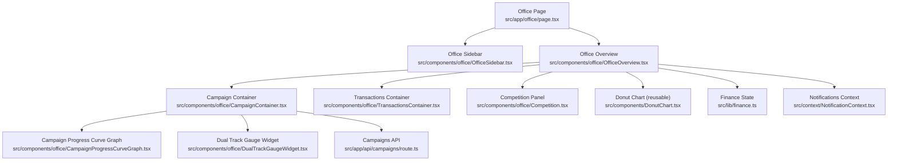
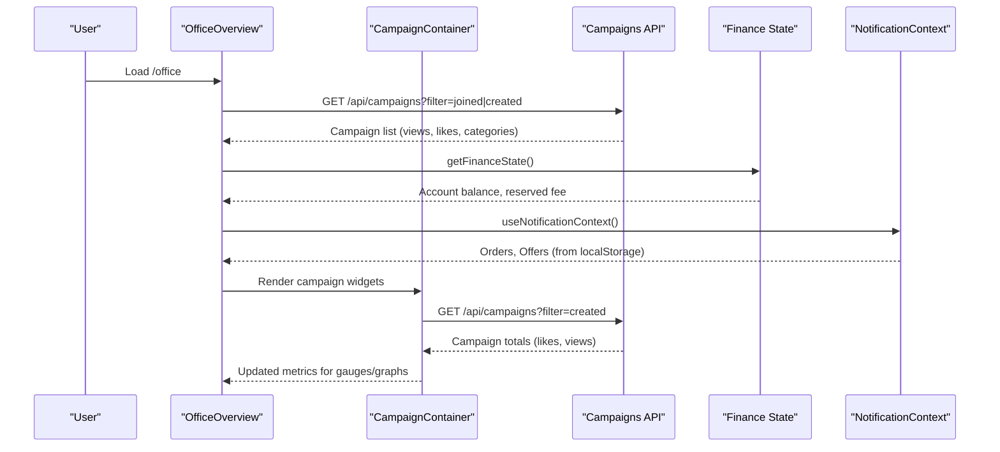
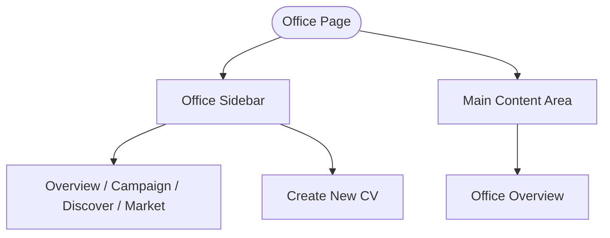
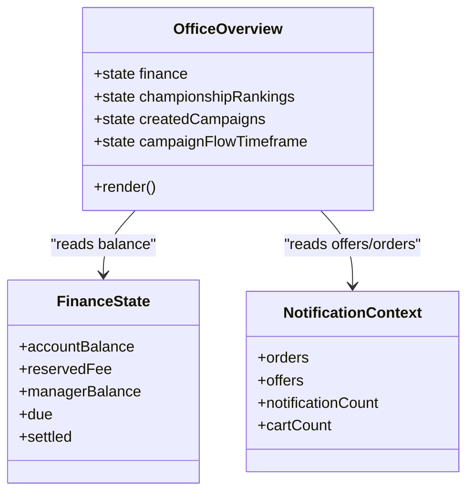
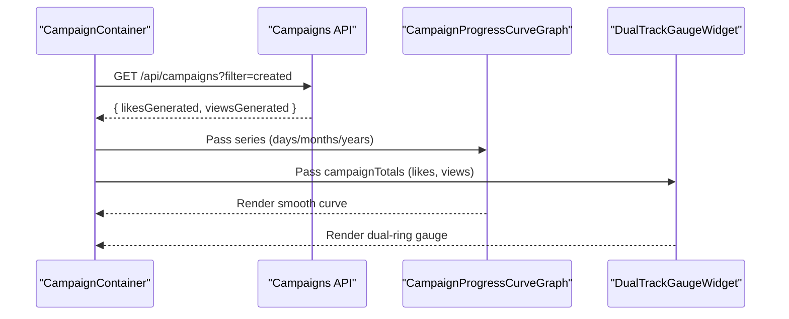
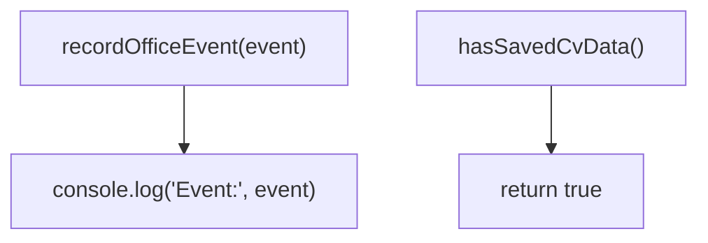
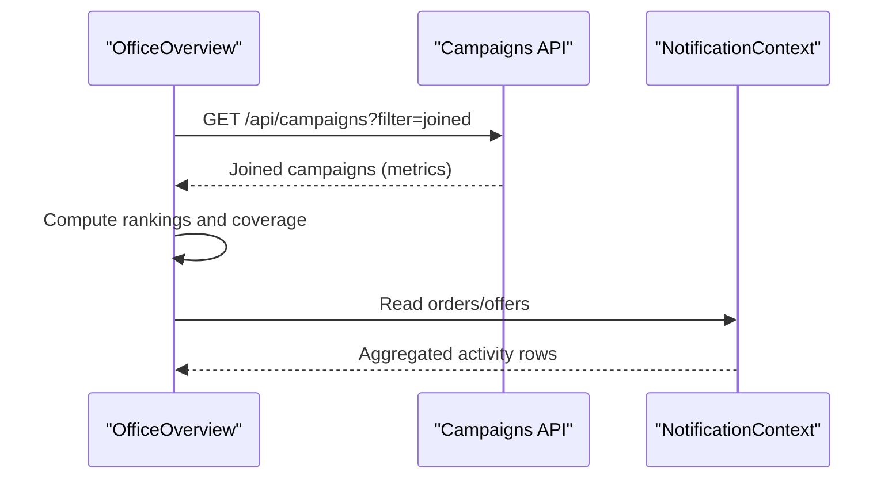
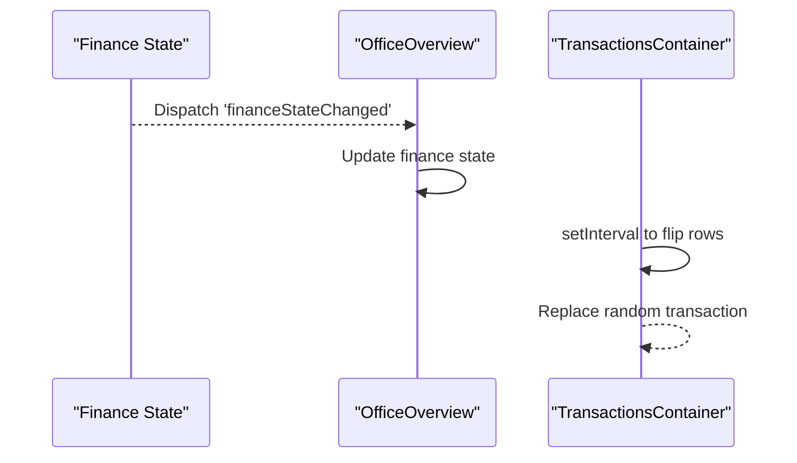
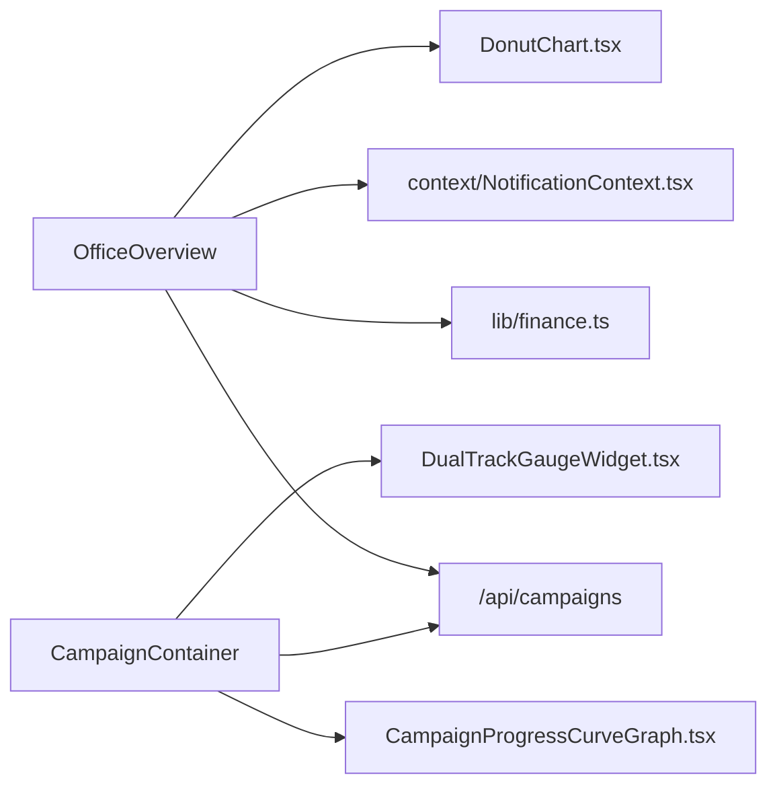

# Office Dashboard & Analytics

<cite>
**Referenced Files in This Document**
- [page.tsx](file://src/app/office/page.tsx)
- [layout.tsx](file://src/components/office/layout.tsx)
- [OfficeSidebar.tsx](file://src/components/office/OfficeSidebar.tsx)
- [OfficeOverview.tsx](file://src/components/office/OfficeOverview.tsx)
- [CampaignContainer.tsx](file://src/components/office/CampaignContainer.tsx)
- [TransactionsContainer.tsx](file://src/components/office/TransactionsContainer.tsx)
- [Competition.tsx](file://src/components/office/Competition.tsx)
- [DualTrackGaugeWidget.tsx](file://src/components/office/DualTrackGaugeWidget.tsx)
- [DonutChart.tsx](file://src/components/DonutChart.tsx)
- [CampaignProgressCurveGraph.tsx](file://src/components/office/CampaignProgressCurveGraph.tsx)
- [route.ts](file://src/app/api/campaigns/route.ts)
- [finance.ts](file://src/lib/finance.ts)
- [NotificationContext.tsx](file://src/context/NotificationContext.tsx)
- [office-history.ts](file://src/lib/office-history.ts)
</cite>

## Table of Contents
1. Introduction
2. Project Structure
3. Core Components
4. Architecture Overview
5. Detailed Component Analysis
6. Dependency Analysis
7. Performance Considerations
8. Troubleshooting Guide
9. Conclusion

## Introduction
This document explains the Office Dashboard and Analytics system, focusing on the dashboard layout, sidebar navigation, overview widgets, analytics visualizations (charts, gauges, progress indicators), office history tracking, and integration with campaign and marketplace data for reporting. It also covers real-time updates, performance considerations for large datasets, responsive design, and accessibility guidance for analytical interfaces.

## Project Structure
The Office Dashboard is a Next.js client application under src/app/office. The page composes a sidebar and an overview area that hosts multiple analytics widgets. A reusable layout exists for consistent structure across pages.

**Diagram sources**
- [page.tsx:1-18](file://src/app/office/page.tsx#L1-L18)
- [OfficeSidebar.tsx:1-64](file://src/components/office/OfficeSidebar.tsx#L1-L64)
- [OfficeOverview.tsx:1-808](file://src/components/office/OfficeOverview.tsx#L1-L808)
- [CampaignContainer.tsx:1-121](file://src/components/office/CampaignContainer.tsx#L1-L121)
- [TransactionsContainer.tsx:1-118](file://src/components/office/TransactionsContainer.tsx#L1-L118)
- [Competition.tsx:1-148](file://src/components/office/Competition.tsx#L1-L148)
- [CampaignProgressCurveGraph.tsx:1-146](file://src/components/office/CampaignProgressCurveGraph.tsx#L1-L146)
- [DualTrackGaugeWidget.tsx:1-130](file://src/components/office/DualTrackGaugeWidget.tsx#L1-L130)
- [DonutChart.tsx:1-164](file://src/components/DonutChart.tsx#L1-L164)
- [route.ts:1-142](file://src/app/api/campaigns/route.ts#L1-L142)
- [finance.ts:1-50](file://src/lib/finance.ts#L1-L50)
- [NotificationContext.tsx:1-146](file://src/context/NotificationContext.tsx#L1-L146)

**Section sources**
- [page.tsx:1-18](file://src/app/office/page.tsx#L1-L18)
- [layout.tsx:1-18](file://src/components/office/layout.tsx#L1-L18)

## Core Components
- Office Page: Renders a full-screen dark-themed shell with a fixed sidebar and scrollable main content.
- Office Sidebar: Provides navigation to Overview, Campaign, Discover, Market; includes a CV creation call-to-action.
- Office Overview: Aggregates key business insights including campaign leaderboard, target coverage, channel health, recent income, account flow, transactions, and payment methods.
- Campaign Container: Displays campaign progress curves and audience gauges, sourcing live totals from the campaigns API when available.
- Transactions Container: Shows recent financial activity with animated row transitions and periodic refreshes.
- Competition Panel: Ranks creators by likes/views with sparkline trends and selectable date ranges.
- Dual Track Gauge Widget: Visualizes views vs. likes per platform using SVG rings.
- Donut Chart: Reusable SVG donut chart for segment breakdowns.
- Campaign Progress Curve Graph: Smooth line chart for likes and views over time with scale toggles.

**Section sources**
- [OfficeSidebar.tsx:1-64](file://src/components/office/OfficeSidebar.tsx#L1-L64)
- [OfficeOverview.tsx:1-808](file://src/components/office/OfficeOverview.tsx#L1-L808)
- [CampaignContainer.tsx:1-121](file://src/components/office/CampaignContainer.tsx#L1-L121)
- [TransactionsContainer.tsx:1-118](file://src/components/office/TransactionsContainer.tsx#L1-L118)
- [Competition.tsx:1-148](file://src/components/office/Competition.tsx#L1-L148)
- [DualTrackGaugeWidget.tsx:1-130](file://src/components/office/DualTrackGaugeWidget.tsx#L1-L130)
- [DonutChart.tsx:1-164](file://src/components/DonutChart.tsx#L1-L164)
- [CampaignProgressCurveGraph.tsx:1-146](file://src/components/office/CampaignProgressCurveGraph.tsx#L1-L146)

## Architecture Overview
The dashboard follows a component-driven architecture with clear separation between UI and data:
- Client components render interactive dashboards.
- Data flows from server routes (Next.js API) into components via fetch calls.
- Shared state utilities manage finance state and notifications.
- Widgets are composable and can be reused across sections.

**Diagram sources**
- [OfficeOverview.tsx:158-262](file://src/components/office/OfficeOverview.tsx#L158-L262)
- [CampaignContainer.tsx:23-65](file://src/components/office/CampaignContainer.tsx#L23-L65)
- [route.ts:46-98](file://src/app/api/campaigns/route.ts#L46-L98)
- [finance.ts:19-43](file://src/lib/finance.ts#L19-L43)
- [NotificationContext.tsx:22-85](file://src/context/NotificationContext.tsx#L22-L85)

## Detailed Component Analysis

### Dashboard Layout and Sidebar Navigation
- The Office Page sets up a responsive flex layout with a hidden-on-mobile sidebar and a scrollable main area.
- The Sidebar uses Next.js routing to highlight the active link and provides quick access to key sections.
- A secondary section promotes creating a new CV with actionable styling.

**Diagram sources**
- [page.tsx:6-16](file://src/app/office/page.tsx#L6-L16)
- [OfficeSidebar.tsx:10-36](file://src/components/office/OfficeSidebar.tsx#L10-L36)

**Section sources**
- [page.tsx:1-18](file://src/app/office/page.tsx#L1-L18)
- [OfficeSidebar.tsx:1-64](file://src/components/office/OfficeSidebar.tsx#L1-L64)

### Overview Components and Business Insights
- Campaign Leaderboard: Fetches joined campaigns and computes rankings based on views and likes.
- Target Coverage: Shows growth score and reach percentage for selected campaigns.
- Channel Health: Timeframe-based progress bars for CV strength and track metrics.
- Recent Income and Offers: Aggregated counts and amounts with cycling status display.
- Account Flow: Balance display, deposit/withdraw actions, transaction list, and payment methods.

**Diagram sources**
- [OfficeOverview.tsx:147-174](file://src/components/office/OfficeOverview.tsx#L147-L174)
- [finance.ts:1-50](file://src/lib/finance.ts#L1-L50)
- [NotificationContext.tsx:1-146](file://src/context/NotificationContext.tsx#L1-L146)

**Section sources**
- [OfficeOverview.tsx:147-808](file://src/components/office/OfficeOverview.tsx#L147-L808)

### Analytics Visualization Components
- Campaign Progress Curve Graph: Smooth line chart for likes and views with time scale toggles. Accepts live series data from CampaignContainer.
- Dual Track Gauge Widget: SVG ring gauges for views and likes per platform with animated transitions.
- Donut Chart: Reusable SVG donut with segments, center value, and legend.

**Diagram sources**
- [CampaignContainer.tsx:23-65](file://src/components/office/CampaignContainer.tsx#L23-L65)
- [CampaignProgressCurveGraph.tsx:9-146](file://src/components/office/CampaignProgressCurveGraph.tsx#L9-L146)
- [DualTrackGaugeWidget.tsx:5-130](file://src/components/office/DualTrackGaugeWidget.tsx#L5-L130)
- [route.ts:46-98](file://src/app/api/campaigns/route.ts#L46-L98)

**Section sources**
- [CampaignProgressCurveGraph.tsx:1-146](file://src/components/office/CampaignProgressCurveGraph.tsx#L1-L146)
- [DualTrackGaugeWidget.tsx:1-130](file://src/components/office/DualTrackGaugeWidget.tsx#L1-L130)
- [DonutChart.tsx:1-164](file://src/components/DonutChart.tsx#L1-L164)

### Office History Tracking System
- A minimal module exposes functions to record events and check saved CV data. Currently logs events to console and returns a boolean flag.
- Integration points can be extended to persist events to a database or analytics service.

**Diagram sources**
- [office-history.ts:1-7](file://src/lib/office-history.ts#L1-L7)

**Section sources**
- [office-history.ts:1-7](file://src/lib/office-history.ts#L1-L7)

### Integration with Campaign and Marketplace Data
- Campaigns API supports filtering by created/joined and returns mapped campaign objects with metrics like viewsGenerated and likesGenerated.
- OfficeOverview consumes this data to compute rankings, coverage, and engagement scores.
- Notifications context integrates marketplace orders and offers, enabling aggregated activity panels.

**Diagram sources**
- [OfficeOverview.tsx:176-262](file://src/components/office/OfficeOverview.tsx#L176-L262)
- [route.ts:46-98](file://src/app/api/campaigns/route.ts#L46-L98)
- [NotificationContext.tsx:22-85](file://src/context/NotificationContext.tsx#L22-L85)

**Section sources**
- [route.ts:1-142](file://src/app/api/campaigns/route.ts#L1-L142)
- [OfficeOverview.tsx:176-350](file://src/components/office/OfficeOverview.tsx#L176-L350)
- [NotificationContext.tsx:1-146](file://src/context/NotificationContext.tsx#L1-L146)

### Real-Time Updates and Data Aggregation
- Finance state updates via storage events and custom events trigger re-renders in OfficeOverview.
- TransactionsContainer cycles through rows with timed animations to simulate live updates.
- Offer/Order statuses cycle periodically to reflect dynamic marketplace activity.

**Diagram sources**
- [finance.ts:45-50](file://src/lib/finance.ts#L45-L50)
- [OfficeOverview.tsx:158-174](file://src/components/office/OfficeOverview.tsx#L158-L174)
- [TransactionsContainer.tsx:52-84](file://src/components/office/TransactionsContainer.tsx#L52-L84)

**Section sources**
- [TransactionsContainer.tsx:1-118](file://src/components/office/TransactionsContainer.tsx#L1-L118)
- [OfficeOverview.tsx:357-387](file://src/components/office/OfficeOverview.tsx#L357-L387)

## Dependency Analysis
Key dependencies and relationships:
- OfficeOverview depends on Campaigns API, Finance State, and Notification Context.
- CampaignContainer depends on Campaigns API and renders child charts/gauges.
- Widgets (DonutChart, CampaignProgressCurveGraph, DualTrackGaugeWidget) are independent and reusable.
- OfficeSidebar depends on Next.js navigation hooks.

**Diagram sources**
- [OfficeOverview.tsx:147-808](file://src/components/office/OfficeOverview.tsx#L147-L808)
- [CampaignContainer.tsx:1-121](file://src/components/office/CampaignContainer.tsx#L1-L121)
- [route.ts:1-142](file://src/app/api/campaigns/route.ts#L1-L142)
- [finance.ts:1-50](file://src/lib/finance.ts#L1-L50)
- [NotificationContext.tsx:1-146](file://src/context/NotificationContext.tsx#L1-L146)
- [DonutChart.tsx:1-164](file://src/components/DonutChart.tsx#L1-L164)
- [CampaignProgressCurveGraph.tsx:1-146](file://src/components/office/CampaignProgressCurveGraph.tsx#L1-L146)
- [DualTrackGaugeWidget.tsx:1-130](file://src/components/office/DualTrackGaugeWidget.tsx#L1-L130)

**Section sources**
- [OfficeOverview.tsx:147-808](file://src/components/office/OfficeOverview.tsx#L147-L808)
- [CampaignContainer.tsx:1-121](file://src/components/office/CampaignContainer.tsx#L1-L121)

## Performance Considerations
- Data fetching: Use pagination and limits in the campaigns API to avoid large payloads. The current route limits results to 50 items.
- Rendering efficiency: Prefer memoization for expensive computations in OfficeOverview (e.g., ranking calculations).
- Animations: Limit heavy CSS transforms and ensure they are GPU-accelerated; consider reducing animation frequency on low-end devices.
- LocalStorage reads: Cache finance state and notifications to minimize repeated parsing.
- Chart performance: For large datasets, downsample series before rendering graphs and use requestAnimationFrame for smooth updates.
- Responsive design: Leverage Tailwind breakpoints to optimize layouts for mobile, tablet, and desktop; ensure text contrast and touch targets meet usability standards.
- Accessibility: Add aria-labels to interactive elements, ensure keyboard navigation works for selects and buttons, and provide sufficient color contrast for charts and badges.

[No sources needed since this section provides general guidance]

## Troubleshooting Guide
- Campaigns API errors: If fetch fails, components fall back to mock data; check network tab and server logs for errors.
- Finance state mismatches: Ensure localStorage contains valid JSON; reset to defaults if corrupted.
- Notification context issues: Verify localStorage keys for orders/offers exist and are arrays; refresh context if needed.
- Animation glitches: Clear intervals and timeouts on component unmount to prevent memory leaks.
- Sidebar active state: Confirm pathname matches href values; update menuItems if routes change.

**Section sources**
- [route.ts:94-98](file://src/app/api/campaigns/route.ts#L94-L98)
- [finance.ts:19-43](file://src/lib/finance.ts#L19-L43)
- [NotificationContext.tsx:29-85](file://src/context/NotificationContext.tsx#L29-L85)
- [TransactionsContainer.tsx:52-84](file://src/components/office/TransactionsContainer.tsx#L52-L84)
- [OfficeSidebar.tsx:21-36](file://src/components/office/OfficeSidebar.tsx#L21-L36)

## Conclusion
The Office Dashboard & Analytics system provides a cohesive, component-driven interface for monitoring campaign performance, marketplace activity, and financial flows. It integrates real-time updates, robust visualization components, and flexible data aggregation. With careful attention to performance, responsiveness, and accessibility, it delivers actionable insights for users managing campaigns and market activities.

[No sources needed since this section summarizes without analyzing specific files]