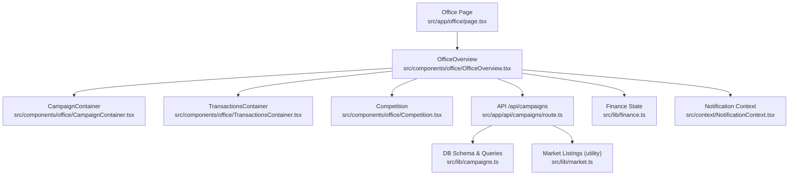
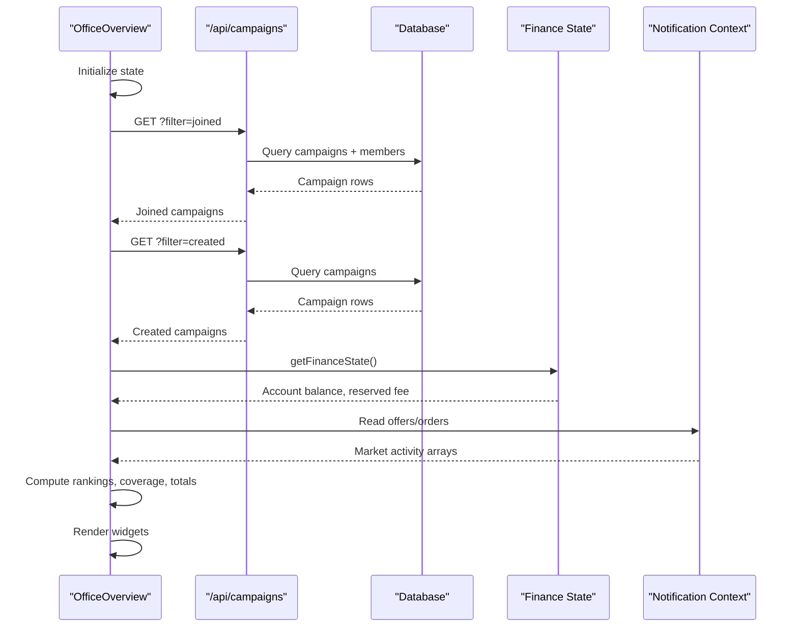
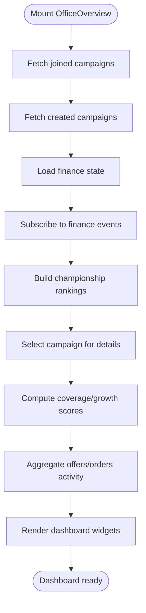
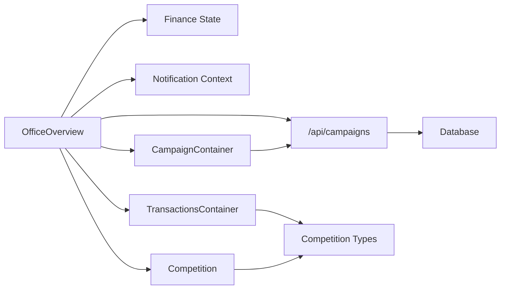

# Office Overview Component

<cite>
**Referenced Files in This Document**
- [page.tsx](file://src/app/office/page.tsx)
- [OfficeOverview.tsx](file://src/components/office/OfficeOverview.tsx)
- [layout.tsx](file://src/components/office/layout.tsx)
- [CampaignContainer.tsx](file://src/components/office/CampaignContainer.tsx)
- [TransactionsContainer.tsx](file://src/components/office/TransactionsContainer.tsx)
- [Competition.tsx](file://src/components/office/Competition.tsx)
- [route.ts](file://src/app/api/campaigns/route.ts)
- [campaigns.ts](file://src/lib/campaigns.ts)
- [market.ts](file://src/lib/market.ts)
- [finance.ts](file://src/lib/finance.ts)
- [NotificationContext.tsx](file://src/context/NotificationContext.tsx)
- [campaign.ts](file://src/types/campaign.ts)
- [market.ts](file://src/types/market.ts)
</cite>

## Table of Contents
1. Introduction
2. Project Structure
3. Core Components
4. Architecture Overview
5. Detailed Component Analysis
6. Dependency Analysis
7. Performance Considerations
8. Troubleshooting Guide
9. Conclusion
10. Appendices

## Introduction
The Office Overview component is the main dashboard interface for the Office section. It aggregates campaign performance, marketplace activities, user interactions, and financial summaries into a cohesive layout. The component integrates with API endpoints to fetch joined and created campaigns, reads finance state from local storage, and consumes notification context data to display offers and orders activity. It also includes widgets for campaign flow visualization, competition rankings, transactions, and payment methods.

## Project Structure
The Office page composes the sidebar and overview content. The overview component orchestrates multiple sub-components and data sources:
- Page shell renders the sidebar and overview container
- OfficeOverview coordinates data fetching, state management, and widget composition
- CampaignContainer visualizes campaign progress and audience metrics
- TransactionsContainer displays recent financial transactions with animated updates
- Competition shows ranked participants and sparkline trends
- API route serves campaign data filtered by user context
- Finance module provides account balances via local storage
- Notification context supplies offers and orders for market activity panels

**Diagram sources**
- [page.tsx:1-18](file://src/app/office/page.tsx#L1-L18)
- [OfficeOverview.tsx:147-800](file://src/components/office/OfficeOverview.tsx#L147-L800)
- [CampaignContainer.tsx:1-121](file://src/components/office/CampaignContainer.tsx#L1-L121)
- [TransactionsContainer.tsx:1-118](file://src/components/office/TransactionsContainer.tsx#L1-L118)
- [Competition.tsx:1-148](file://src/components/office/Competition.tsx#L1-L148)
- [route.ts:46-98](file://src/app/api/campaigns/route.ts#L46-L98)
- [campaigns.ts:34-46](file://src/lib/campaigns.ts#L34-L46)
- [market.ts:43-49](file://src/lib/market.ts#L43-L49)
- [finance.ts:19-49](file://src/lib/finance.ts#L19-L49)
- [NotificationContext.tsx:22-146](file://src/context/NotificationContext.tsx#L22-L146)

**Section sources**
- [page.tsx:1-18](file://src/app/office/page.tsx#L1-L18)
- [OfficeOverview.tsx:147-800](file://src/components/office/OfficeOverview.tsx#L147-L800)

## Core Components
- OfficePage: Renders the responsive shell with sidebar and main content area where OfficeOverview is mounted.
- OfficeOverview: Central dashboard that:
  - Fetches joined and created campaigns via API
  - Computes championship rankings and selected campaign coverage
  - Aggregates market activity (offers/orders) using notification context
  - Displays financial summary from finance state
  - Composes widgets: leaderboard, target tracking, channel health, campaign flow, competition, transactions, payment methods
- CampaignContainer: Loads campaign series data and renders progress curve and dual-track gauge
- TransactionsContainer: Shows recent transactions with periodic row replacement animations
- Competition: Displays ranked users with sparklines and filters for campaign and date range
- API route: Serves campaign data with filtering by created/joined status and maps DB rows to UI types
- Finance module: Provides normalized finance state from local storage and emits events on changes
- Notification context: Persists and exposes orders/offers for market activity panels

**Section sources**
- [OfficeOverview.tsx:147-800](file://src/components/office/OfficeOverview.tsx#L147-L800)
- [CampaignContainer.tsx:1-121](file://src/components/office/CampaignContainer.tsx#L1-L121)
- [TransactionsContainer.tsx:1-118](file://src/components/office/TransactionsContainer.tsx#L1-L118)
- [Competition.tsx:1-148](file://src/components/office/Competition.tsx#L1-L148)
- [route.ts:46-98](file://src/app/api/campaigns/route.ts#L46-L98)
- [finance.ts:19-49](file://src/lib/finance.ts#L19-L49)
- [NotificationContext.tsx:22-146](file://src/context/NotificationContext.tsx#L22-L146)

## Architecture Overview
The dashboard follows a client-side orchestration pattern:
- Data fetching: OfficeOverview calls /api/campaigns with filters to retrieve joined and created campaigns; it also subscribes to finance state changes via custom events and storage listeners
- Data transformation: API route maps database rows to UI types; OfficeOverview computes derived metrics like coverage percentages and ranking positions
- Widget composition: Sub-components render specific views (leaderboard, campaign flow, competition, transactions, payment methods)
- Real-time updates: Intervals cycle through offer/order statuses and animate transaction rows; finance state changes propagate via events

**Diagram sources**
- [OfficeOverview.tsx:158-262](file://src/components/office/OfficeOverview.tsx#L158-L262)
- [route.ts:46-98](file://src/app/api/campaigns/route.ts#L46-L98)
- [finance.ts:19-49](file://src/lib/finance.ts#L19-L49)
- [NotificationContext.tsx:22-146](file://src/context/NotificationContext.tsx#L22-L146)

## Detailed Component Analysis

### OfficeOverview
Responsibilities:
- Layout structure: Header with welcome message and contextual banners; grid sections for leaderboard, target tracking, channel health, campaign flow, competition, transactions, and payment methods
- Data binding patterns:
  - Campaigns: Fetches joined and created campaigns; maps to ChampionshipRanking and CampaignCardData types; selects active campaign for detailed metrics
  - Finance: Reads normalized state from local storage; listens to storage and custom events to update balance
  - Notifications: Consumes offers and orders arrays to compute market activity sections
- Integration points:
  - API endpoint for campaigns
  - Local storage-backed finance state
  - Notification context for marketplace activities
- Derived metrics:
  - Coverage percentage based on current rank and target views
  - Growth score and coverage computed using timeframe coefficients
  - Activity sections aggregate counts and amounts per status group
- Real-time updates:
  - Interval cycles through offer/order status rows to simulate live updates
  - Animations applied to rows for smooth transitions

**Diagram sources**
- [OfficeOverview.tsx:158-262](file://src/components/office/OfficeOverview.tsx#L158-L262)
- [OfficeOverview.tsx:313-387](file://src/components/office/OfficeOverview.tsx#L313-L387)
- [OfficeOverview.tsx:357-364](file://src/components/office/OfficeOverview.tsx#L357-L364)

**Section sources**
- [OfficeOverview.tsx:147-800](file://src/components/office/OfficeOverview.tsx#L147-L800)

### CampaignContainer
Responsibilities:
- Fetches campaign series data from API and constructs time-scaled series (days/months/years)
- Renders a progress curve graph and a dual-track gauge showing likes and views totals
- Provides controls for time range and campaign selection

Performance considerations:
- Uses minimal mock series generation when API data is unavailable
- Passes aggregated totals to child components to reduce recomputation

**Section sources**
- [CampaignContainer.tsx:1-121](file://src/components/office/CampaignContainer.tsx#L1-L121)

### TransactionsContainer
Responsibilities:
- Displays recent transactions with columns for particulars, method, details, and amount
- Implements periodic row replacement with flip animation to simulate live updates
- Colors rows based on transaction type for quick visual scanning

Real-time behavior:
- Staggered timers replace individual rows at intervals
- Total cycle interval refreshes the sequence periodically

**Section sources**
- [TransactionsContainer.tsx:1-118](file://src/components/office/TransactionsContainer.tsx#L1-L118)

### Competition
Responsibilities:
- Shows ranked participants with likes, views, rate, and owed amounts
- Includes sparkline visualization for trend indication
- Provides filters for campaign selection and date range

Design notes:
- Responsive grid layout adapts to screen sizes
- Sparkline path computed dynamically from data points

**Section sources**
- [Competition.tsx:1-148](file://src/components/office/Competition.tsx#L1-L148)

### API Route (/api/campaigns)
Responsibilities:
- Handles GET requests with filter parameters (created/joined) and optional userId header
- Maps database rows to CampaignCardData with joined status detection
- Returns empty array on errors with appropriate logging

Error handling:
- Ensures database schema exists before queries
- Gracefully handles malformed inputs and returns safe defaults

**Section sources**
- [route.ts:46-98](file://src/app/api/campaigns/route.ts#L46-L98)
- [route.ts:100-142](file://src/app/api/campaigns/route.ts#L100-L142)

### Finance Module
Responsibilities:
- Normalizes finance state from local storage with default values
- Emits custom event on state changes to notify subscribers
- Provides getter/setter functions for consistent access

Integration:
- OfficeOverview subscribes to storage and custom events to keep balance in sync

**Section sources**
- [finance.ts:1-50](file://src/lib/finance.ts#L1-L50)

### Notification Context
Responsibilities:
- Persists orders and offers to local storage
- Exposes methods to update lists and refresh data
- Computes badge counts for notifications and cart

Usage:
- OfficeOverview consumes offers and orders to build market activity sections

**Section sources**
- [NotificationContext.tsx:1-146](file://src/context/NotificationContext.tsx#L1-L146)

## Dependency Analysis
Key dependencies and relationships:
- OfficeOverview depends on:
  - API route for campaign data
  - Finance module for account balances
  - Notification context for marketplace activities
  - Sub-components for rendering specific widgets
- API route depends on:
  - Database schema and ORM utilities
  - Mapping functions to transform rows to UI types
- Sub-components depend on:
  - Shared types for consistency across modules
  - Utility functions for formatting and styling

**Diagram sources**
- [OfficeOverview.tsx:147-800](file://src/components/office/OfficeOverview.tsx#L147-L800)
- [route.ts:46-98](file://src/app/api/campaigns/route.ts#L46-L98)
- [finance.ts:19-49](file://src/lib/finance.ts#L19-L49)
- [NotificationContext.tsx:22-146](file://src/context/NotificationContext.tsx#L22-L146)
- [CampaignContainer.tsx:1-121](file://src/components/office/CampaignContainer.tsx#L1-L121)
- [TransactionsContainer.tsx:1-118](file://src/components/office/TransactionsContainer.tsx#L1-L118)
- [Competition.tsx:1-148](file://src/components/office/Competition.tsx#L1-L148)

**Section sources**
- [OfficeOverview.tsx:147-800](file://src/components/office/OfficeOverview.tsx#L147-L800)
- [route.ts:46-98](file://src/app/api/campaigns/route.ts#L46-L98)

## Performance Considerations
- Data fetching:
  - Use query parameters to limit dataset size (e.g., limit 50 campaigns)
  - Cache results in component state to avoid redundant requests
- Rendering:
  - Memoize derived metrics where possible to prevent unnecessary recalculations
  - Use CSS animations sparingly; prefer transforms and opacity for smooth performance
- Real-time updates:
  - Throttle intervals to avoid excessive re-renders
  - Replace only affected rows instead of full list updates
- Large datasets:
  - Implement pagination or virtualization if lists grow beyond visible viewport
  - Debounce user inputs that trigger data reloads
- Network resilience:
  - Handle network errors gracefully with fallback states
  - Provide loading indicators during data fetches

[No sources needed since this section provides general guidance]

## Troubleshooting Guide
Common issues and resolutions:
- Campaign data not loading:
  - Verify API endpoint accessibility and correct filter parameters
  - Check database schema initialization and ensure tables exist
- Finance state mismatch:
  - Ensure local storage key matches expected value
  - Validate JSON parsing and normalization logic
- Notification context errors:
  - Confirm provider is wrapping application tree
  - Check localStorage permissions and availability
- Animation glitches:
  - Inspect CSS transforms and perspective settings
  - Ensure cleanup of timers and intervals on unmount

**Section sources**
- [route.ts:94-98](file://src/app/api/campaigns/route.ts#L94-L98)
- [finance.ts:30-43](file://src/lib/finance.ts#L30-L43)
- [NotificationContext.tsx:36-58](file://src/context/NotificationContext.tsx#L36-L58)
- [TransactionsContainer.tsx:52-84](file://src/components/office/TransactionsContainer.tsx#L52-L84)

## Conclusion
The Office Overview component provides a comprehensive dashboard that integrates campaign analytics, marketplace activities, and financial summaries. Its modular architecture enables easy customization and extension. By leveraging API endpoints, local storage, and context providers, it delivers real-time insights with responsive design and performance optimizations. Future enhancements can include advanced caching strategies, virtualized lists for large datasets, and additional data source integrations.

[No sources needed since this section summarizes without analyzing specific files]

## Appendices

### Customizing the Overview Layout
- Add new widgets:
  - Create a new component following existing patterns
  - Import and compose within OfficeOverview layout
  - Bind data through props or context as needed
- Modify existing sections:
  - Adjust grid layouts using Tailwind classes
  - Update data binding logic in OfficeOverview
  - Extend derived metrics calculations

**Section sources**
- [OfficeOverview.tsx:465-700](file://src/components/office/OfficeOverview.tsx#L465-L700)

### Integrating Additional Data Sources
- New API endpoints:
  - Follow existing route patterns with proper error handling
  - Map data to shared types for consistency
- Context providers:
  - Extend existing contexts or create new ones
  - Persist data in local storage for offline support
- State management:
  - Use React hooks for local component state
  - Leverage global contexts for cross-component data sharing

**Section sources**
- [route.ts:46-98](file://src/app/api/campaigns/route.ts#L46-L98)
- [NotificationContext.tsx:22-146](file://src/context/NotificationContext.tsx#L22-L146)

### Accessibility Considerations
- Semantic HTML:
  - Use appropriate heading hierarchy and landmarks
  - Ensure buttons have descriptive labels
- Keyboard navigation:
  - Make all interactive elements focusable
  - Provide visible focus indicators
- Screen reader support:
  - Add ARIA attributes where necessary
  - Ensure color contrast meets WCAG guidelines
- Color coding:
  - Avoid relying solely on color for information
  - Provide text alternatives for visual indicators

[No sources needed since this section provides general guidance]

### Cross-Browser Compatibility
- CSS features:
  - Test transforms and animations across browsers
  - Use vendor prefixes if necessary for older browsers
- JavaScript APIs:
  - Polyfill missing features for legacy environments
  - Handle localStorage availability checks
- Event handling:
  - Normalize event differences between browsers
  - Ensure proper cleanup of event listeners

[No sources needed since this section provides general guidance]