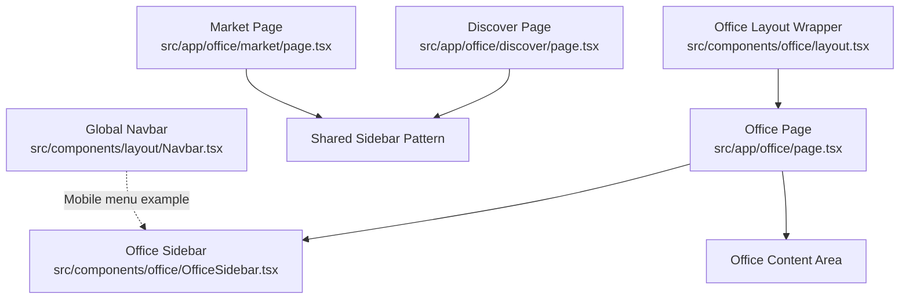
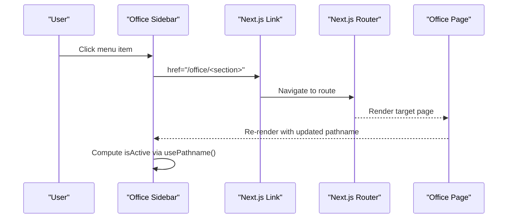
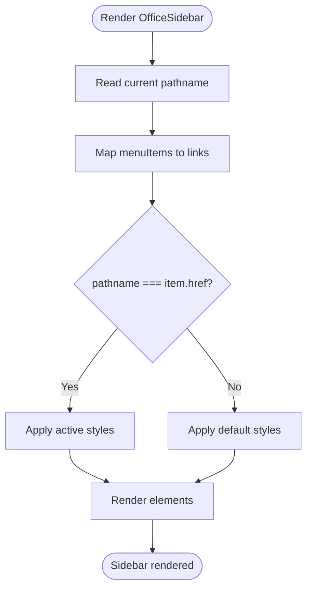
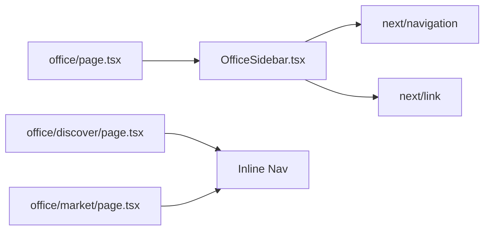

# Office Sidebar Navigation

<cite>
**Referenced Files in This Document**
- [OfficeSidebar.tsx](file://src/components/office/OfficeSidebar.tsx)
- [page.tsx](file://src/app/office/page.tsx)
- [layout.tsx](file://src/components/office/layout.tsx)
- [discover/page.tsx](file://src/app/office/discover/page.tsx)
- [market/page.tsx](file://src/app/office/market/page.tsx)
- [Navbar.tsx](file://src/components/layout/Navbar.tsx)
</cite>

## Table of Contents
1. [Introduction](#introduction)
2. [Project Structure](#project-structure)
3. [Core Components](#core-components)
4. [Architecture Overview](#architecture-overview)
5. [Detailed Component Analysis](#detailed-component-analysis)
6. [Dependency Analysis](#dependency-analysis)
7. [Performance Considerations](#performance-considerations)
8. [Troubleshooting Guide](#troubleshooting-guide)
9. [Conclusion](#conclusion)
10. [Appendices](#appendices)

## Introduction
This document provides detailed documentation for the Office Sidebar navigation component used within the Office workspace area. It explains the menu structure, active state management via Next.js routing, responsive behavior (including mobile considerations), integration with Next.js routing, customization options, and guidance for extending the sidebar with nested menus, authentication-based visibility, performance optimizations, and accessibility best practices.

## Project Structure
The Office Sidebar is a client-side React component that renders a vertical navigation list for the Office workspace. It is embedded into the Office pages and uses Next.js routing primitives to compute the active item based on the current pathname. The layout around the sidebar is defined by the Office page and an optional layout wrapper.

**Diagram sources**
- [page.tsx:6-17](file://src/app/office/page.tsx#L6-L17)
- [OfficeSidebar.tsx:7-63](file://src/components/office/OfficeSidebar.tsx#L7-L63)
- [layout.tsx:1-18](file://src/components/office/layout.tsx#L1-L18)
- [discover/page.tsx:1-120](file://src/app/office/discover/page.tsx#L1-L120)
- [market/page.tsx:1-135](file://src/app/office/market/page.tsx#L1-L135)
- [Navbar.tsx:1-130](file://src/components/layout/Navbar.tsx#L1-L130)

**Section sources**
- [page.tsx:6-17](file://src/app/office/page.tsx#L6-L17)
- [OfficeSidebar.tsx:7-63](file://src/components/office/OfficeSidebar.tsx#L7-L63)
- [layout.tsx:1-18](file://src/components/office/layout.tsx#L1-L18)

## Core Components
- Office Sidebar: Renders the main navigation links for the Office workspace and highlights the active link based on the current route.
- Office Page: Hosts the sidebar alongside the content area and sets up the responsive flex layout.
- Office Layout Wrapper: Provides a consistent shell for Office sections with a fixed aside region and scrollable main content.

Key behaviors:
- Active item detection uses the current pathname from Next.js navigation.
- Links use Next.js Link for client-side navigation.
- Styling uses utility classes for dark theme and responsive breakpoints.

**Section sources**
- [OfficeSidebar.tsx:7-63](file://src/components/office/OfficeSidebar.tsx#L7-L63)
- [page.tsx:6-17](file://src/app/office/page.tsx#L6-L17)
- [layout.tsx:1-18](file://src/components/office/layout.tsx#L1-L18)

## Architecture Overview
The Office Sidebar integrates tightly with Next.js routing:
- Active state is derived from the current pathname.
- Navigation is performed via Next.js Link components, enabling client-side transitions without full page reloads.
- The sidebar is conditionally visible on desktop using responsive classes; mobile-specific toggling is not implemented in the sidebar itself but can be added or reused from other patterns in the app.

**Diagram sources**
- [OfficeSidebar.tsx:7-36](file://src/components/office/OfficeSidebar.tsx#L7-L36)
- [page.tsx:6-17](file://src/app/office/page.tsx#L6-L17)

## Detailed Component Analysis

### Office Sidebar Component
Responsibilities:
- Define menu items and their routes.
- Determine the active item using the current pathname.
- Render accessible links with visual feedback for hover and active states.
- Include a bottom section for additional actions (e.g., CV creation).

Active state logic:
- Compares the current pathname with each menu item’s href to apply active styling.

Responsive behavior:
- Hidden on small screens and shown on medium+ screens using responsive classes.
- Sticky positioning keeps it visible while scrolling.

Styling and theming:
- Dark theme with neutral backgrounds and accent colors for active/hover states.
- Border and background transitions provide clear interaction feedback.

Extensibility:
- Menu items are defined as a simple array; adding new sections requires updating this array.
- Icons can be integrated by mapping icons per item and rendering them inside the link.

Accessibility:
- Uses semantic <nav> and <Link> elements.
- Keyboard navigation works via standard focus order and Link behavior.
- No explicit aria attributes are set; consider adding aria-current="page" for the active link to improve screen reader support.

**Diagram sources**
- [OfficeSidebar.tsx:7-36](file://src/components/office/OfficeSidebar.tsx#L7-L36)

**Section sources**
- [OfficeSidebar.tsx:7-63](file://src/components/office/OfficeSidebar.tsx#L7-L63)

### Office Page Integration
- Embeds the sidebar and a content area in a responsive flex container.
- Ensures the sidebar remains visible on larger screens while the content scrolls independently.

**Section sources**
- [page.tsx:6-17](file://src/app/office/page.tsx#L6-L17)

### Office Layout Wrapper
- Provides a consistent shell with a fixed aside region and scrollable main content area.
- Demonstrates how to structure pages with a persistent sidebar-like region.

**Section sources**
- [layout.tsx:1-18](file://src/components/office/layout.tsx#L1-L18)

### Discover and Market Pages
- Each page includes its own inline side navigation for quick access to related sections.
- These illustrate alternative navigation patterns within the Office workspace.

**Section sources**
- [discover/page.tsx:54-119](file://src/app/office/discover/page.tsx#L54-L119)
- [market/page.tsx:85-131](file://src/app/office/market/page.tsx#L85-L131)

### Mobile Hamburger Menu Reference
- The global Navbar demonstrates a working mobile hamburger menu pattern with state toggling and click-outside handling.
- This pattern can be adapted for the Office Sidebar if a mobile drawer is desired.

**Section sources**
- [Navbar.tsx:16-43](file://src/components/layout/Navbar.tsx#L16-L43)
- [Navbar.tsx:117-130](file://src/components/layout/Navbar.tsx#L117-L130)

## Dependency Analysis
- Office Sidebar depends on Next.js Link and usePathname for routing and active state.
- Office Page composes the sidebar and content area.
- Discover and Market pages include their own inline navs, showing duplication risk if centralized.

**Diagram sources**
- [OfficeSidebar.tsx:3-8](file://src/components/office/OfficeSidebar.tsx#L3-L8)
- [page.tsx:3-12](file://src/app/office/page.tsx#L3-L12)
- [discover/page.tsx:4-68](file://src/app/office/discover/page.tsx#L4-L68)
- [market/page.tsx:4-99](file://src/app/office/market/page.tsx#L4-L99)

**Section sources**
- [OfficeSidebar.tsx:3-8](file://src/components/office/OfficeSidebar.tsx#L3-L8)
- [page.tsx:3-12](file://src/app/office/page.tsx#L3-L12)

## Performance Considerations
- Menu data is static and small; no performance concerns for typical sizes.
- For large navigation trees:
  - Consider virtualization or pagination if the number of items grows significantly.
  - Avoid heavy computations inside render; keep isActive checks lightweight.
  - Use memoization (e.g., useMemo) if deriving complex active states or filtering.
- Keep the sidebar sticky only when necessary to avoid layout thrashing on low-end devices.
- Prefer Next.js Link for navigation to leverage client-side routing and reduce re-renders.

[No sources needed since this section provides general guidance]

## Troubleshooting Guide
Common issues and resolutions:
- Active item not highlighting:
  - Ensure the href values match the exact pathname segments used by Next.js.
  - Verify that the component is rendered within a Next.js context so usePathname returns the correct value.
- Links not navigating client-side:
  - Confirm usage of Next.js Link instead of anchor tags.
- Mobile visibility:
  - The sidebar is hidden on small screens; add a mobile toggle similar to the global Navbar if needed.
- Accessibility:
  - Add aria-current="page" to the active link for better screen reader support.
  - Ensure keyboard focus is visible and logical tab order is maintained.

**Section sources**
- [OfficeSidebar.tsx:7-36](file://src/components/office/OfficeSidebar.tsx#L7-L36)
- [Navbar.tsx:117-130](file://src/components/layout/Navbar.tsx#L117-L130)

## Conclusion
The Office Sidebar provides a clean, responsive navigation experience for the Office workspace, leveraging Next.js routing for active state and client-side navigation. While currently desktop-focused, it can be extended with a mobile drawer pattern inspired by the global Navbar. Centralizing menu configuration and enhancing accessibility will improve maintainability and user experience as the navigation grows.

[No sources needed since this section summarizes without analyzing specific files]

## Appendices

### Customization Options
- Adding new menu items:
  - Extend the menu items array with label and href pairs.
- Adding icons:
  - Map an icon to each menu item and render it inside the link element.
- Theming:
  - Adjust color classes for active and hover states to match your design system.
- Nested menus:
  - Introduce submenus by grouping items under a parent and rendering expandable sections with state toggles.

[No sources needed since this section provides general guidance]

### Authentication-Based Visibility
- To show/hide menu items based on authentication:
  - Derive visibility from user session or role state and filter the menu items before rendering.
- Redirect unauthenticated users:
  - Guard routes at the page level and redirect to login if needed.

[No sources needed since this section provides general guidance]

### Responsive Behavior and Mobile Implementation
- Current behavior:
  - Sidebar is hidden on small screens and shown on medium+ screens.
- Recommended mobile implementation:
  - Add a hamburger button to toggle a slide-out drawer containing the same menu items.
  - Use state to manage open/close and close on outside click or route change.
  - Mirror the pattern used in the global Navbar for consistency.

**Section sources**
- [OfficeSidebar.tsx:17-18](file://src/components/office/OfficeSidebar.tsx#L17-L18)
- [Navbar.tsx:117-130](file://src/components/layout/Navbar.tsx#L117-L130)

### Accessibility Checklist
- Semantic structure:
  - Use <nav> for the menu and <Link> for navigation items.
- Focus management:
  - Ensure focus is visible and moves logically through the menu.
- Screen readers:
  - Add aria-current="page" to the active link.
  - Provide descriptive labels for any interactive controls (e.g., hamburger button).
- Keyboard navigation:
  - Support Tab, Enter, and Escape for toggles and links.

[No sources needed since this section provides general guidance]