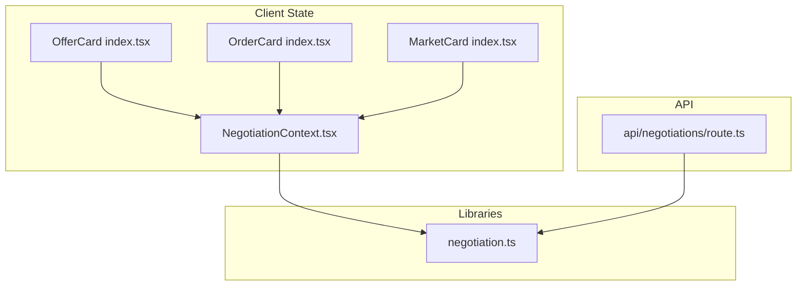
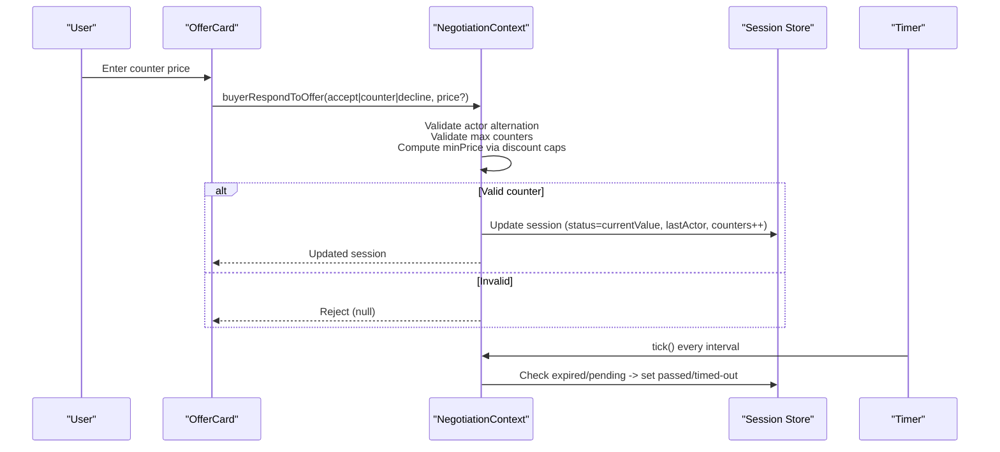
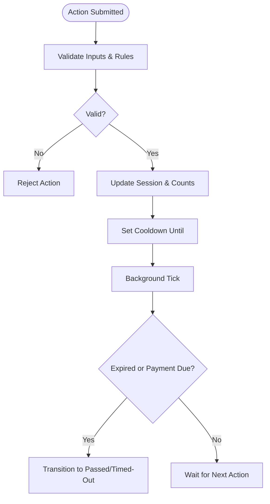
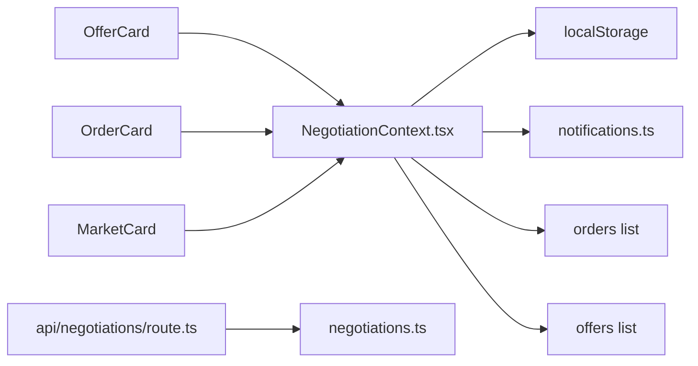

# Counter-Offer Generation Algorithm

<cite>
**Referenced Files in This Document**
- [NegotiationContext.tsx](file://src/context/NegotiationContext.tsx)
- [negotiation.ts](file://src/lib/negotiation.ts)
- [offer-card/index.tsx](file://src/components/offer-card/index.tsx)
- [order-card/index.tsx](file://src/components/order-card/index.tsx)
- [market-card/index.tsx](file://src/components/market-card/index.tsx)
- [route.ts](file://src/app/api/negotiations/route.ts)
- [AI_MEMORY.md](file://AI_MEMORY.md)
</cite>

## Table of Contents
1. [Introduction](#introduction)
2. [Project Structure](#project-structure)
3. [Core Components](#core-components)
4. [Architecture Overview](#architecture-overview)
5. [Detailed Component Analysis](#detailed-component-analysis)
6. [Dependency Analysis](#dependency-analysis)
7. [Performance Considerations](#performance-considerations)
8. [Troubleshooting Guide](#troubleshooting-guide)
9. [Conclusion](#conclusion)

## Introduction
This document explains the Counter-Offer Generation Algorithm used by the negotiation system. It covers how minimum acceptable prices are calculated for buyers and sellers based on counter-offer counts, the discount scaling system that reduces allowable discounts with each subsequent counter, validation rules that prevent same-actor consecutive counters and enforce maximum counter limits, and how price floors and cooldowns are enforced. It also includes mathematical formulas, code references, and edge case handling guidance.

## Project Structure
The negotiation logic is implemented primarily in a React context that manages sessions, validations, timers, and notifications. Supporting UI components compute real-time validation feedback for users. A minimal API route exposes negotiation data retrieval.

**Diagram sources**
- [NegotiationContext.tsx:105-115](file://src/context/NegotiationContext.tsx#L105-L115)
- [offer-card/index.tsx:65-110](file://src/components/offer-card/index.tsx#L65-L110)
- [order-card/index.tsx:37-52](file://src/components/order-card/index.tsx#L37-L52)
- [market-card/index.tsx:40-81](file://src/components/market-card/index.tsx#L40-L81)
- [negotiation.ts:1-50](file://src/lib/negotiation.ts#L1-L50)
- [route.ts:1-13](file://src/app/api/negotiations/route.ts#L1-L13)

**Section sources**
- [NegotiationContext.tsx:1-706](file://src/context/NegotiationContext.tsx#L1-L706)
- [negotiation.ts:1-50](file://src/lib/negotiation.ts#L1-L50)
- [offer-card/index.tsx:65-110](file://src/components/offer-card/index.tsx#L65-L110)
- [order-card/index.tsx:37-52](file://src/components/order-card/index.tsx#L37-L52)
- [market-card/index.tsx:40-81](file://src/components/market-card/index.tsx#L40-L81)
- [route.ts:1-13](file://src/app/api/negotiations/route.ts#L1-L13)

## Core Components
- Negotiation session state machine and business rules live in the negotiation context. It tracks per-session buyer/seller counter counts, current value, product baseline price, cooldowns, and timeouts.
- Discount scaling functions define maximum allowable discounts per counter step for both buyers and sellers.
- UI components validate user input against computed minimums and display helpful messages (e.g., overpayment warnings).
- The API route provides read access to negotiation data via a library function.

Key responsibilities:
- Enforce alternating actor rule (no same-actor consecutive counters).
- Enforce maximum counter limits per side.
- Compute minimum acceptable price using tiered discount caps.
- Apply daily buy limits and cooldown windows.
- Manage timeouts and transitions to passed/timed-out states.

**Section sources**
- [NegotiationContext.tsx:105-115](file://src/context/NegotiationContext.tsx#L105-L115)
- [NegotiationContext.tsx:260-265](file://src/context/NegotiationContext.tsx#L260-L265)
- [NegotiationContext.tsx:319-378](file://src/context/NegotiationContext.tsx#L319-L378)
- [NegotiationContext.tsx:380-512](file://src/context/NegotiationContext.tsx#L380-L512)
- [NegotiationContext.tsx:514-624](file://src/context/NegotiationContext.tsx#L514-L624)
- [offer-card/index.tsx:65-110](file://src/components/offer-card/index.tsx#L65-L110)
- [order-card/index.tsx:37-52](file://src/components/order-card/index.tsx#L37-L52)
- [market-card/index.tsx:40-81](file://src/components/market-card/index.tsx#L40-L81)

## Architecture Overview
The negotiation flow is event-driven within the client. Users initiate actions (buy or counter), which are validated against session state and discount rules. Valid actions update the session status, persist events, and synchronize orders/offers lists. Background timers handle expiration and cooldowns.

**Diagram sources**
- [NegotiationContext.tsx:181-252](file://src/context/NegotiationContext.tsx#L181-L252)
- [NegotiationContext.tsx:514-624](file://src/context/NegotiationContext.tsx#L514-L624)
- [offer-card/index.tsx:65-110](file://src/components/offer-card/index.tsx#L65-L110)

## Detailed Component Analysis

### Pricing Logic and Discount Scaling
- Buyer discount caps depend on the number of prior buyer counters:
  - First buyer counter: up to 40% off the baseline product price.
  - Second buyer counter: up to 30% off the active seller counter price.
  - Third+ buyer counter: up to 15% off the active seller counter price.
- Seller discount caps depend on the number of prior seller counters:
  - First seller counter: up to 35% off the baseline product price.
  - Second seller counter: up to 25% off the baseline product price.
  - Third+ seller counter: up to 10% off the baseline product price.

Minimum acceptable price formula:
- For a counter from actor X at count c:
  - minPrice = basePrice × (1 − cap(c))
  - basePrice is either the original product price or the active counter price depending on the implementation path.
  - cap(c) is the discount cap for actor X at counter count c.

Validation enforces:
- inputPrice ≥ minPrice
- Alternating actors: lastActor cannot be the same as the current actor
- Maximum counters: buyerCounterCount < 3 and sellerCounterCount < 3

Code references:
- Discount cap functions and usage in buyer/seller flows.
- Minimum price checks before updating sessions.

**Section sources**
- [NegotiationContext.tsx:105-115](file://src/context/NegotiationContext.tsx#L105-L115)
- [NegotiationContext.tsx:319-378](file://src/context/NegotiationContext.tsx#L319-L378)
- [NegotiationContext.tsx:380-512](file://src/context/NegotiationContext.tsx#L380-L512)
- [NegotiationContext.tsx:514-624](file://src/context/NegotiationContext.tsx#L514-L624)
- [offer-card/index.tsx:65-110](file://src/components/offer-card/index.tsx#L65-L110)
- [order-card/index.tsx:37-52](file://src/components/order-card/index.tsx#L37-L52)

### Validation Rules: Same-Actor Consecutive Counters and Max Limits
- Alternating actors:
  - If lastActor equals the current actor, the counter is rejected.
- Maximum counters:
  - Buyers may submit up to 3 counters total.
  - Sellers may submit up to 3 counters total.
- Daily buy limit and cooldown:
  - Buyers can perform up to 3 buy/counter actions per day per card.
  - After an action, a cooldown window prevents immediate re-action.

These rules ensure fair play and prevent spamming or self-negotiation loops.

**Section sources**
- [NegotiationContext.tsx:260-265](file://src/context/NegotiationContext.tsx#L260-L265)
- [NegotiationContext.tsx:319-378](file://src/context/NegotiationContext.tsx#L319-L378)
- [NegotiationContext.tsx:380-512](file://src/context/NegotiationContext.tsx#L380-L512)
- [NegotiationContext.tsx:514-624](file://src/context/NegotiationContext.tsx#L514-L624)

### Price Floor Calculations and Increment/Decrement Patterns
- Floors are computed dynamically per counter step using the discount caps above.
- Increment/decrement patterns:
  - Each valid counter increments the respective counter count and updates currentValue to the new offer.
  - The next floor is recalculated based on the updated base (productPrice or active counter price) and the next discount cap.
- UI-level floor enforcement:
  - Real-time validation shows minimum required offers and warns if the entered price exceeds the target (overpayment warning).

Edge cases:
- Zero or negative inputs are rejected.
- Non-numeric inputs are ignored.
- When no active session exists, defaults apply (e.g., baseline product price).

**Section sources**
- [offer-card/index.tsx:65-110](file://src/components/offer-card/index.tsx#L65-L110)
- [order-card/index.tsx:37-52](file://src/components/order-card/index.tsx#L37-L52)
- [NegotiationContext.tsx:319-378](file://src/context/NegotiationContext.tsx#L319-L378)
- [NegotiationContext.tsx:380-512](file://src/context/NegotiationContext.tsx#L380-L512)
- [NegotiationContext.tsx:514-624](file://src/context/NegotiationContext.tsx#L514-L624)

### Market-Based Adjustments
- The core algorithm uses fixed discount caps per counter step; there is no dynamic market adjustment in the pricing logic itself.
- UI components may display additional constraints (e.g., max offers per card, cooldown timers) but do not alter the discount caps.

Note: Any future market-based adjustments would need to integrate into the discount cap functions and minimum price calculations.

**Section sources**
- [NegotiationContext.tsx:105-115](file://src/context/NegotiationContext.tsx#L105-L115)
- [market-card/index.tsx:40-81](file://src/components/market-card/index.tsx#L40-L81)

### Timeouts, Cooldowns, and Session Lifecycle
- Cooldown: After an action, a short cooldown period prevents immediate re-actions.
- Daily limit: Buyers are limited to 3 actions per day per card.
- Timeout: Pending negotiations expire after a day without response, transitioning to passed or timed-out states.
- Payment deadlines: Accepted offers require payment within a defined window; otherwise, they time out.

**Diagram sources**
- [NegotiationContext.tsx:181-252](file://src/context/NegotiationContext.tsx#L181-L252)
- [NegotiationContext.tsx:260-265](file://src/context/NegotiationContext.tsx#L260-L265)

**Section sources**
- [NegotiationContext.tsx:181-252](file://src/context/NegotiationContext.tsx#L181-L252)
- [NegotiationContext.tsx:260-265](file://src/context/NegotiationContext.tsx#L260-L265)

## Dependency Analysis
- NegotiationContext depends on:
  - Local storage for persistence of sessions, notifications, and events.
  - Notification utilities to create and push notifications.
  - Shared order/offer lists to keep UI consistent across views.
- UI components depend on:
  - Context methods to start counters and respond to offers.
  - Real-time validation helpers to compute minimums and show errors.
- API route depends on:
  - Library function to fetch negotiation data (currently returns empty arrays).

**Diagram sources**
- [NegotiationContext.tsx:146-173](file://src/context/NegotiationContext.tsx#L146-L173)
- [route.ts:1-13](file://src/app/api/negotiations/route.ts#L1-L13)
- [negotiation.ts:1-50](file://src/lib/negotiation.ts#L1-L50)

**Section sources**
- [NegotiationContext.tsx:146-173](file://src/context/NegotiationContext.tsx#L146-L173)
- [route.ts:1-13](file://src/app/api/negotiations/route.ts#L1-L13)
- [negotiation.ts:1-50](file://src/lib/negotiation.ts#L1-L50)

## Performance Considerations
- Client-side state updates are frequent; minimize unnecessary re-renders by batching updates where possible.
- Timers run at intervals; ensure cleanup on unmount to avoid memory leaks.
- localStorage reads/writes should be guarded and error-handled to prevent blocking UI.
- Avoid heavy computations in render paths; precompute minimums and store them in component state when appropriate.

[No sources needed since this section provides general guidance]

## Troubleshooting Guide
Common issues and resolutions:
- Counter rejected due to same-actor consecutiveness:
  - Ensure the previous lastActor was the opposite party.
  - Reference validation checks in buyer/seller response handlers.
- Counter rejected due to exceeding max counters:
  - Verify buyerCounterCount and sellerCounterCount are below the limit.
- Counter rejected due to price below minimum:
  - Confirm the entered price meets the computed minPrice based on discount caps.
- Daily limit reached:
  - Reset buyerBuyCountToday at day boundary; check today’s key and count.
- Cooldown preventing action:
  - Wait until cooldownUntil has passed; UI typically shows remaining time.
- Negotiation timed out:
  - Check if pendingFor is set and updatedAt exceeded the day threshold; status transitions to passed/timed-out.

Relevant code references:
- Alternating actor and max counter checks.
- Min price computation and validation.
- Daily limit and cooldown enforcement.
- Timeout handling and state transitions.

**Section sources**
- [NegotiationContext.tsx:260-265](file://src/context/NegotiationContext.tsx#L260-L265)
- [NegotiationContext.tsx:319-378](file://src/context/NegotiationContext.tsx#L319-L378)
- [NegotiationContext.tsx:380-512](file://src/context/NegotiationContext.tsx#L380-L512)
- [NegotiationContext.tsx:514-624](file://src/context/NegotiationContext.tsx#L514-L624)
- [NegotiationContext.tsx:181-252](file://src/context/NegotiationContext.tsx#L181-L252)

## Conclusion
The Counter-Offer Generation Algorithm enforces structured, fair negotiations through tiered discount caps, strict validation rules, and lifecycle management. Buyers and sellers can alternate counters up to three times each, with decreasing allowable discounts per step. Minimum acceptable prices are computed dynamically, and UI components provide real-time feedback. Cooldowns and timeouts protect against abuse and stale negotiations. Future enhancements could introduce market-based adjustments by modifying the discount cap functions and integrating external pricing signals.

[No sources needed since this section summarizes without analyzing specific files]