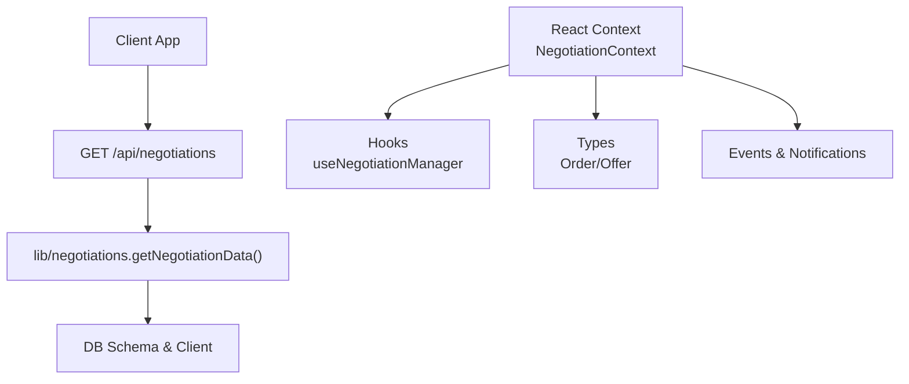
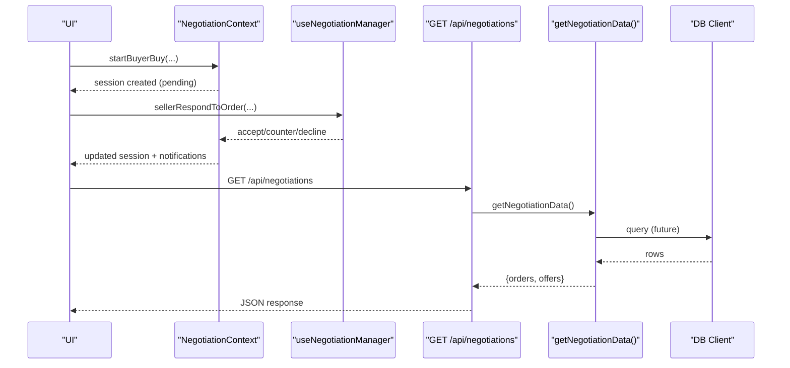
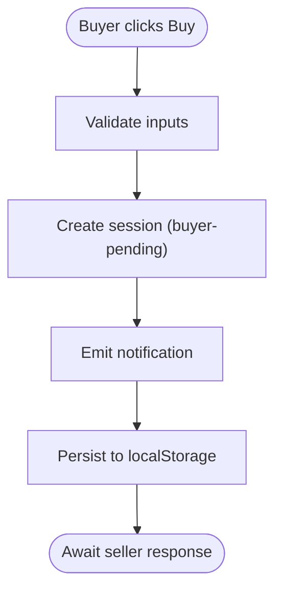
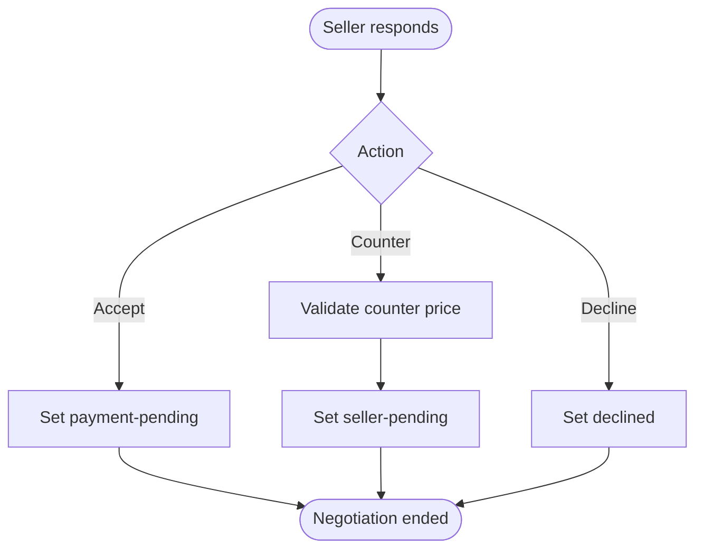
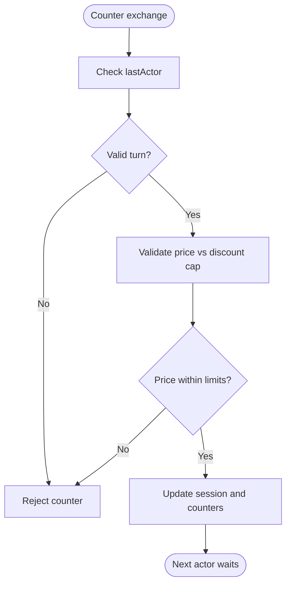
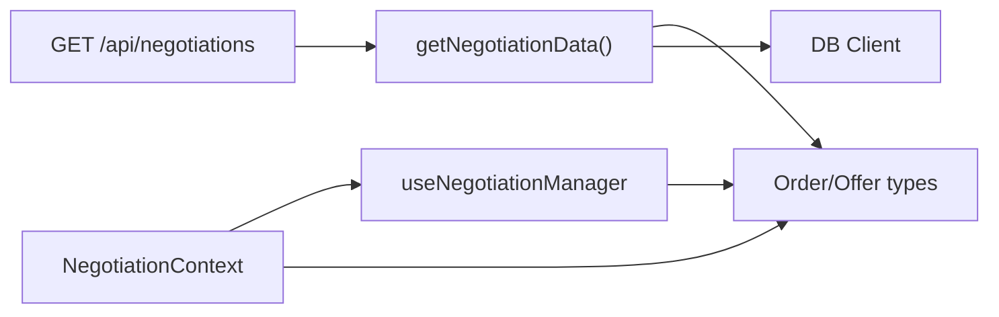

# Negotiation API Endpoints

<cite>
**Referenced Files in This Document**
- [route.ts](file://src/app/api/negotiations/route.ts)
- [negotiations.ts](file://src/lib/negotiations.ts)
- [negotiation.ts](file://src/lib/negotiation.ts)
- [NegotiationContext.tsx](file://src/context/NegotiationContext.tsx)
- [useNegotiationManager.ts](file://src/hooks/useNegotiationManager.ts)
- [types.ts](file://src/types.ts)
- [schema.ts](file://src/db/schema.ts)
- [client.ts](file://src/db/client.ts)
- [secure/route.ts](file://src/app/api/secure/route.ts)
</cite>

## Table of Contents
1. [Introduction](#introduction)
2. [Project Structure](#project-structure)
3. [Core Components](#core-components)
4. [Architecture Overview](#architecture-overview)
5. [Detailed Component Analysis](#detailed-component-analysis)
6. [Dependency Analysis](#dependency-analysis)
7. [Performance Considerations](#performance-considerations)
8. [Troubleshooting Guide](#troubleshooting-guide)
9. [Conclusion](#conclusion)
10. [Appendices](#appendices)

## Introduction
This document specifies the RESTful endpoints for negotiating purchases and counter-offers, focusing on creating, updating, and retrieving negotiation sessions. It defines request/response schemas, authentication expectations, error codes, and typical workflows (buyer-initiated purchase, seller responses, and counter-offer exchanges). It also addresses rate limiting considerations, input validation, security measures, and real-time alternatives such as WebSockets with HTTP fallbacks.

## Project Structure
The negotiation feature spans a Next.js App Router API route, client-side state management, shared types, and database schema definitions:
- API route: GET /api/negotiations returns negotiation data.
- Client-side context manages session lifecycle, timers, and notifications.
- Shared types define orders and offers used across UI and hooks.
- Database schema and client provide persistence primitives for related entities.

**Diagram sources**
- [route.ts:4-12](file://src/app/api/negotiations/route.ts#L4-L12)
- [negotiations.ts:57-62](file://src/lib/negotiations.ts#L57-L62)
- [schema.ts:1-84](file://src/db/schema.ts#L1-L84)
- [client.ts:34-59](file://src/db/client.ts#L34-L59)
- [NegotiationContext.tsx:140-252](file://src/context/NegotiationContext.tsx#L140-L252)
- [useNegotiationManager.ts:6-201](file://src/hooks/useNegotiationManager.ts#L6-L201)
- [types.ts:1-89](file://src/types.ts#L1-L89)

**Section sources**
- [route.ts:4-12](file://src/app/api/negotiations/route.ts#L4-L12)
- [negotiations.ts:57-62](file://src/lib/negotiations.ts#L57-L62)
- [NegotiationContext.tsx:140-252](file://src/context/NegotiationContext.tsx#L140-L252)
- [useNegotiationManager.ts:6-201](file://src/hooks/useNegotiationManager.ts#L6-L201)
- [types.ts:1-89](file://src/types.ts#L1-L89)
- [schema.ts:1-84](file://src/db/schema.ts#L1-L84)
- [client.ts:34-59](file://src/db/client.ts#L34-L59)

## Core Components
- Negotiation API Route: Exposes GET /api/negotiations to return negotiation data. Currently returns empty orders/offers arrays; designed to be extended with persistence.
- Negotiation Data Mapper: Utility functions map database rows to domain models (Order, Offer).
- Client-Side Session Manager: React context maintains sessions, enforces business rules (discount caps, cooldowns), and persists state to localStorage.
- Hooks: Provide higher-level operations like creating orders, accepting/countering offers, and declining.

Key responsibilities:
- API layer: minimal read endpoint; future PUT/POST can be added here.
- Business logic: discount limits, alternating turns, timeouts, payment windows.
- Persistence: local storage for sessions; DB integration via schema and client.

**Section sources**
- [route.ts:4-12](file://src/app/api/negotiations/route.ts#L4-L12)
- [negotiations.ts:12-55](file://src/lib/negotiations.ts#L12-L55)
- [NegotiationContext.tsx:105-115](file://src/context/NegotiationContext.tsx#L105-L115)
- [NegotiationContext.tsx:260-378](file://src/context/NegotiationContext.tsx#L260-L378)
- [useNegotiationManager.ts:9-187](file://src/hooks/useNegotiationManager.ts#L9-L187)
- [types.ts:1-48](file://src/types.ts#L1-L48)

## Architecture Overview
The current implementation is primarily client-side with a placeholder server endpoint. The flow includes:
- Client initiates actions via hooks or context methods.
- Context updates sessions, emits notifications, and persists to localStorage.
- API GET returns negotiation data (currently empty).
- Future endpoints can persist changes to the database using the existing schema and client.

**Diagram sources**
- [NegotiationContext.tsx:267-378](file://src/context/NegotiationContext.tsx#L267-L378)
- [useNegotiationManager.ts:50-187](file://src/hooks/useNegotiationManager.ts#L50-L187)
- [route.ts:4-12](file://src/app/api/negotiations/route.ts#L4-L12)
- [negotiations.ts:57-62](file://src/lib/negotiations.ts#L57-L62)
- [client.ts:34-59](file://src/db/client.ts#L34-L59)

## Detailed Component Analysis

### REST Endpoints

#### GET /api/negotiations
- Purpose: Retrieve negotiation data (orders and offers).
- Request: None required.
- Response: JSON object containing orders and offers arrays.
- Error handling: On failure, returns an empty dataset with status 500.

Notes:
- Currently returns empty arrays; intended to be extended with DB-backed retrieval.
- No authentication or rate limiting implemented in this route.

**Section sources**
- [route.ts:4-12](file://src/app/api/negotiations/route.ts#L4-L12)

#### POST /api/negotiations (Planned)
- Purpose: Start a new negotiation session (e.g., buyer-initiated purchase).
- Expected request body:
  - cardId: string
  - itemType: "market" | "offer" | "order"
  - productPrice: number
  - buyerName?: string
  - sellerName?: string
  - description?: string
- Expected response:
  - id: string
  - status: "buyer-pending"
  - currentValue: number
  - productPrice: number
  - createdAt: string
  - updatedAt: string
  - pendingFor: "seller"
  - lastActor: "buyer"
  - lastActionLabel: string
- Authentication: Not enforced in current codebase; recommend requiring user identity headers similar to secure routes.
- Rate limiting: Not implemented; consider adding per-user limits based on daily counters.
- Validation: Enforce numeric price, non-empty identifiers, and allowed item types.

Implementation guidance:
- Use NegotiationContext’s startBuyerBuy logic to create a session and emit notifications.
- Persist order and offer records via DB if needed.

**Section sources**
- [NegotiationContext.tsx:267-317](file://src/context/NegotiationContext.tsx#L267-L317)
- [secure/route.ts:154-162](file://src/app/api/secure/route.ts#L154-L162)

#### PUT /api/negotiations/:id (Planned)
- Purpose: Update negotiation session state (accept, counter, decline).
- Path parameter: id (string)
- Expected request body:
  - action: "accept" | "counter" | "decline"
  - price?: number (required when action is "counter")
- Expected response:
  - Updated session fields reflecting the new status and timestamps.
- Authentication: Require user identity and role checks.
- Validation: Ensure action is valid; enforce alternating turns and discount caps.

Implementation guidance:
- Map to sellerRespondToOrder or buyerRespondToOffer depending on actor.
- Apply business rules: max discounts, cooldowns, and turn alternation.

**Section sources**
- [NegotiationContext.tsx:380-512](file://src/context/NegotiationContext.tsx#L380-L512)
- [NegotiationContext.tsx:514-624](file://src/context/NegotiationContext.tsx#L514-L624)

#### GET /api/negotiations/:id (Planned)
- Purpose: Retrieve a specific negotiation session by id.
- Path parameter: id (string)
- Expected response:
  - Full session object including status, timestamps, counters, and labels.
- Authentication: Optional depending on privacy requirements.
- Validation: Validate id format and existence.

Implementation guidance:
- Return session from persisted store or in-memory context if applicable.

[No section sources since this endpoint is not yet implemented]

### Request/Response Schemas

- Order (used in negotiations):
  - id: string
  - type: "buy" | "counter"
  - cardId?: string
  - buyerId?: string
  - buyerName: string
  - sellerName?: string
  - productPriceRaw: number
  - offeredPrice?: number
  - description?: string
  - handle?: string
  - hashtags?: string[]
  - status: "pending" | "accepted" | "countered" | "declined" | "completed" | "passed" | "timed-out"
  - createdAt: string
  - followers?: number
  - likes?: number
  - erCurrentRatio?: number
  - erPreviousRatio?: number
  - vlCurrentRatio?: number
  - vlPreviousRatio?: number
  - value?: number

- Offer (used in negotiations):
  - id: string
  - orderId: string
  - type: "accept" | "counter"
  - responsePrice?: number
  - createdAt: string
  - status: "sent" | "received" | "accepted" | "rejected" | "declined" | "completed" | "passed" | "timed-out"
  - fromSeller: boolean
  - sellerName: string
  - buyerName: string
  - description?: string
  - handle?: string
  - hashtags?: string[]
  - followers?: number
  - likes?: number
  - erCurrentRatio?: number
  - erPreviousRatio?: number
  - vlCurrentRatio?: number
  - vlPreviousRatio?: number
  - value?: number

- NegotiationSession (client-side):
  - id: string
  - cardId: string
  - itemType: "market" | "offer" | "order"
  - status: "idle" | "buyer-pending" | "seller-pending" | "accepted" | "payment-pending" | "declined" | "timed-out" | "passed" | "finalized"
  - currentValue: number
  - productPrice: number
  - buyerCounterCount: number
  - sellerCounterCount: number
  - buyerBuyCountToday: number
  - dayKey: string
  - lastActor: "buyer" | "seller" | "system" | null
  - lastActionLabel: string
  - pendingFor: "buyer" | "seller" | null
  - paymentDueAt?: string
  - cooldownUntil?: string
  - createdAt: string
  - updatedAt: string

**Section sources**
- [types.ts:1-48](file://src/types.ts#L1-L48)
- [NegotiationContext.tsx:20-38](file://src/context/NegotiationContext.tsx#L20-L38)

### Authentication Requirements
- Current negotiation route does not enforce authentication.
- Secure routes demonstrate identity extraction via headers or body fields (userId, role).
- Recommendation: For POST/PUT negotiation endpoints, require a user identity header and validate roles before processing.

**Section sources**
- [secure/route.ts:154-162](file://src/app/api/secure/route.ts#L154-L162)

### Error Codes
- 400 Bad Request: Invalid or missing parameters (e.g., mode, title/description in other routes).
- 401 Unauthorized: Missing user identity where required.
- 403 Forbidden: Insufficient permissions (e.g., only creator can update/delete).
- 404 Not Found: Entity not found.
- 500 Internal Server Error: Unexpected failures; negotiation route returns empty dataset on error.

**Section sources**
- [route.ts:8-11](file://src/app/api/negotiations/route.ts#L8-L11)
- [secure/route.ts:154-162](file://src/app/api/secure/route.ts#L154-L162)
- [secure/route.ts:180-220](file://src/app/api/secure/route.ts#L180-L220)

### Typical Workflows

#### Buyer-Initiated Purchase
- Client calls startBuyerBuy with cardId, productPrice, and optional metadata.
- Session transitions to "buyer-pending", sets pendingFor to "seller", and schedules payment due time.
- Notification emitted; order created in shared state.

**Diagram sources**
- [NegotiationContext.tsx:267-317](file://src/context/NegotiationContext.tsx#L267-L317)

**Section sources**
- [NegotiationContext.tsx:267-317](file://src/context/NegotiationContext.tsx#L267-L317)

#### Seller Responses
- Accept: Transition to "payment-pending", set pendingFor to "buyer", schedule payment due time.
- Counter: Validate counter price against discount caps; transition to "seller-pending".
- Decline: Set status to "declined", clear pendingFor.

**Diagram sources**
- [NegotiationContext.tsx:380-512](file://src/context/NegotiationContext.tsx#L380-L512)

**Section sources**
- [NegotiationContext.tsx:380-512](file://src/context/NegotiationContext.tsx#L380-L512)

#### Counter-Offer Exchanges
- Alternating turns enforced: lastActor must differ from current actor.
- Discount caps apply based on counter counts for both buyer and seller.
- Each counter updates currentValue and increments respective counter count.

**Diagram sources**
- [NegotiationContext.tsx:319-378](file://src/context/NegotiationContext.tsx#L319-L378)
- [NegotiationContext.tsx:514-624](file://src/context/NegotiationContext.tsx#L514-L624)

**Section sources**
- [NegotiationContext.tsx:319-378](file://src/context/NegotiationContext.tsx#L319-L378)
- [NegotiationContext.tsx:514-624](file://src/context/NegotiationContext.tsx#L514-L624)

### Rate Limiting, Input Validation, and Security Measures
- Rate limiting:
  - Not implemented at API level.
  - Client enforces daily buy limits and cooldowns per session.
  - Recommendation: Add server-side rate limiting per userId for POST/PUT endpoints.

- Input validation:
  - Client validates prices, counters, and alternating turns.
  - Recommendation: Add server-side validation for all incoming payloads.

- Security:
  - No authentication in negotiation route.
  - Follow secure route pattern to extract and validate userId and role.
  - Recommend HTTPS-only, CSRF protection, and input sanitization.

**Section sources**
- [NegotiationContext.tsx:260-265](file://src/context/NegotiationContext.tsx#L260-L265)
- [secure/route.ts:154-162](file://src/app/api/secure/route.ts#L154-L162)

### WebSocket Alternatives and Fallback Mechanisms
- Real-time updates:
  - Consider implementing a WebSocket server to push session updates to clients.
  - Use events for state changes (e.g., counter received, accepted, declined).

- Fallback mechanisms:
  - Polling: Periodic GET requests to /api/negotiations/:id for updates.
  - Long polling: Repeated HTTP requests until a change occurs.
  - Event-driven HTTP: Use server-sent events (SSE) for one-way updates.

[No sources needed since this section provides conceptual guidance]

## Dependency Analysis
- API route depends on lib/negotiations for data mapping and retrieval.
- Client context depends on types and hooks for session management and notifications.
- Database schema and client provide persistence primitives for campaigns, vacancies, market listings, and engagement events.

**Diagram sources**
- [route.ts:4-12](file://src/app/api/negotiations/route.ts#L4-L12)
- [negotiations.ts:57-62](file://src/lib/negotiations.ts#L57-L62)
- [types.ts:1-48](file://src/types.ts#L1-L48)
- [client.ts:34-59](file://src/db/client.ts#L34-L59)
- [NegotiationContext.tsx:140-252](file://src/context/NegotiationContext.tsx#L140-L252)
- [useNegotiationManager.ts:6-201](file://src/hooks/useNegotiationManager.ts#L6-L201)

**Section sources**
- [route.ts:4-12](file://src/app/api/negotiations/route.ts#L4-L12)
- [negotiations.ts:57-62](file://src/lib/negotiations.ts#L57-L62)
- [types.ts:1-48](file://src/types.ts#L1-L48)
- [client.ts:34-59](file://src/db/client.ts#L34-L59)
- [NegotiationContext.tsx:140-252](file://src/context/NegotiationContext.tsx#L140-L252)
- [useNegotiationManager.ts:6-201](file://src/hooks/useNegotiationManager.ts#L6-L201)

## Performance Considerations
- Client-side state:
  - LocalStorage persistence avoids frequent network calls.
  - Timers check for timeouts every 30 seconds; ensure efficient updates.

- API layer:
  - Keep GET /api/negotiations lightweight; paginate results if datasets grow.
  - Add caching headers for static data.

- Database:
  - Use indexes on frequently queried fields (e.g., cardId, orderId).
  - Batch writes for bulk updates.

[No sources needed since this section provides general guidance]

## Troubleshooting Guide
- Empty negotiation data:
  - Verify that getNegotiationData returns expected datasets; currently returns empty arrays.
  - Check DB connection and schema initialization.

- Session not updating:
  - Ensure localStorage is available and not blocked.
  - Confirm timers are running and intervals are not cleared prematurely.

- Authentication errors:
  - When extending endpoints, ensure userId and role are provided and validated.

**Section sources**
- [route.ts:8-11](file://src/app/api/negotiations/route.ts#L8-L11)
- [NegotiationContext.tsx:146-173](file://src/context/NegotiationContext.tsx#L146-L173)
- [secure/route.ts:154-162](file://src/app/api/secure/route.ts#L154-L162)

## Conclusion
The negotiation feature currently provides a client-side session manager with a placeholder API endpoint. To fully support RESTful negotiation workflows, implement POST and PUT endpoints with authentication, validation, and persistence. Adopt WebSockets for real-time updates with HTTP polling as a fallback. Enforce rate limiting and robust input validation to ensure security and performance.

[No sources needed since this section summarizes without analyzing specific files]

## Appendices

### Database Schema Notes
- Tables exist for campaigns, campaign members, vacancies, market listings, and engagement events.
- Negotiation-specific tables are not defined; consider adding negotiation_sessions and negotiation_events tables for persistence.

**Section sources**
- [schema.ts:1-84](file://src/db/schema.ts#L1-L84)