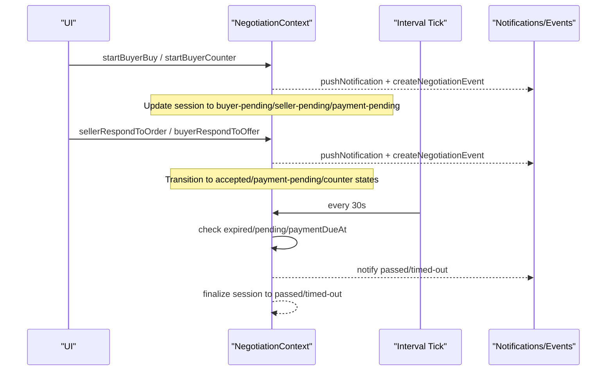
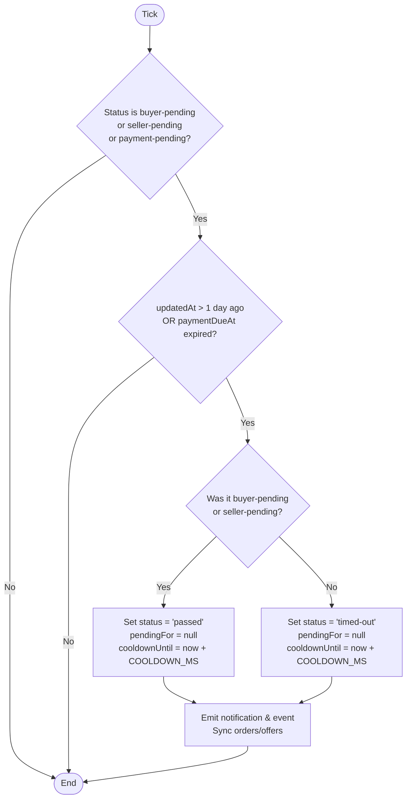
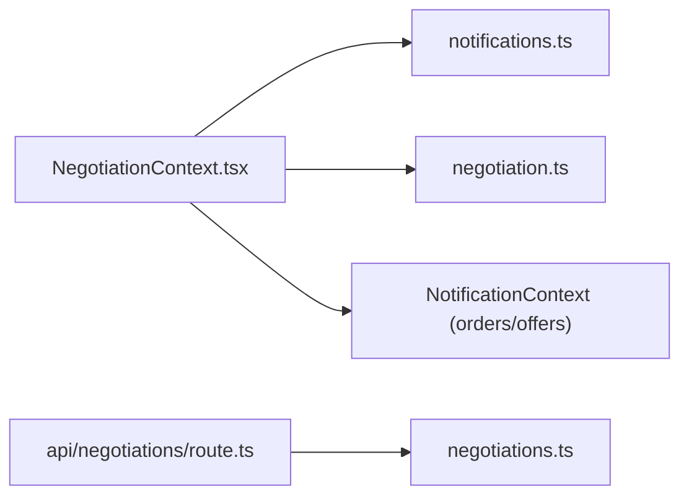

# Negotiation State Machine

<cite>
**Referenced Files in This Document**
- [NegotiationContext.tsx](file://src/context/NegotiationContext.tsx)
- [negotiation.ts](file://src/lib/negotiation.ts)
- [negotiations.ts](file://src/lib/negotiations.ts)
- [route.ts](file://src/app/api/negotiations/route.ts)
- [types.ts](file://src/types.ts)
- [order-card types.ts](file://src/components/order-card/types.ts)
</cite>

## Table of Contents
1. [Introduction](#introduction)
2. [Project Structure](#project-structure)
3. [Core Components](#core-components)
4. [Architecture Overview](#architecture-overview)
5. [Detailed Component Analysis](#detailed-component-analysis)
6. [Dependency Analysis](#dependency-analysis)
7. [Performance Considerations](#performance-considerations)
8. [Troubleshooting Guide](#troubleshooting-guide)
9. [Conclusion](#conclusion)

## Introduction
This document describes the Negotiation State Machine implemented in the application. It covers all negotiation states, transitions, validation rules, business logic, timeout handling, cooldown periods, and automatic progression. The state machine governs buyer-seller negotiations for items (market listings, offers, orders), ensuring consistent behavior across user actions and system-driven events.

## Project Structure
The negotiation state machine is primarily implemented in a React context that manages sessions, notifications, and events. Supporting modules provide type definitions, event modeling, and API scaffolding.

```mermaid
graph TB
subgraph "Client Context"
Ctx["NegotiationContext.tsx"]
end
subgraph "Libraries"
LibNeg["negotiation.ts"]
LibNegData["negotiations.ts"]
end
subgraph "API"
ApiRoute["api/negotiations/route.ts"]
end
subgraph "Types"
Types["types.ts"]
OrderCardTypes["components/order-card/types.ts"]
end
Ctx --> LibNeg
Ctx --> LibNegData
ApiRoute --> LibNegData
Ctx --> Types
Ctx --> OrderCardTypes
```

**Diagram sources**
- [NegotiationContext.tsx:1-706](file://src/context/NegotiationContext.tsx#L1-L706)
- [negotiation.ts:1-50](file://src/lib/negotiation.ts#L1-L50)
- [negotiations.ts:1-63](file://src/lib/negotiations.ts#L1-L63)
- [route.ts:1-13](file://src/app/api/negotiations/route.ts#L1-L13)
- [types.ts:1-89](file://src/types.ts#L1-L89)
- [order-card types.ts:1-40](file://src/components/order-card/types.ts#L1-L40)

**Section sources**
- [NegotiationContext.tsx:1-706](file://src/context/NegotiationContext.tsx#L1-L706)
- [negotiation.ts:1-50](file://src/lib/negotiation.ts#L1-L50)
- [negotiations.ts:1-63](file://src/lib/negotiations.ts#L1-L63)
- [route.ts:1-13](file://src/app/api/negotiations/route.ts#L1-L13)
- [types.ts:1-89](file://src/types.ts#L1-L89)
- [order-card types.ts:1-40](file://src/components/order-card/types.ts#L1-L40)

## Core Components
- Negotiation session model defines the state machine’s status set and metadata such as current value, counters, timers, and actor tracking.
- Context provider implements transition functions for buyer and seller actions, plus automatic timeout and cooldown management.
- Event and notification helpers record state changes and surface them to users.

Key elements:
- Status set includes idle, buyer-pending, seller-pending, accepted, payment-pending, declined, timed-out, passed, finalized.
- Timers:
  - Payment due window: 1 day from acceptance or offer acceptance.
  - Inactivity timeout: 1 day from last update for pending/payment-pending states.
  - Cooldown: 10 minutes after certain terminal actions to prevent rapid re-entry.
- Validation:
  - Counter limits per side (up to 3).
  - Alternating turns enforced by lastActor.
  - Minimum price floors based on counter tier.
  - Daily action limit for buyers.

**Section sources**
- [NegotiationContext.tsx:9-18](file://src/context/NegotiationContext.tsx#L9-L18)
- [NegotiationContext.tsx:75-115](file://src/context/NegotiationContext.tsx#L75-L115)
- [NegotiationContext.tsx:117-138](file://src/context/NegotiationContext.tsx#L117-L138)
- [negotiation.ts:3-18](file://src/lib/negotiation.ts#L3-L18)
- [types.ts:1-3](file://src/types.ts#L1-L3)

## Architecture Overview
The state machine runs client-side within a React context with periodic ticks to enforce timeouts and cooldowns. User actions trigger transitions via dedicated handlers. System ticks automatically progress sessions to terminal states when conditions are met.



**Diagram sources**
- [NegotiationContext.tsx:181-252](file://src/context/NegotiationContext.tsx#L181-L252)
- [NegotiationContext.tsx:267-378](file://src/context/NegotiationContext.tsx#L267-L378)
- [NegotiationContext.tsx:380-512](file://src/context/NegotiationContext.tsx#L380-L512)
- [NegotiationContext.tsx:514-624](file://src/context/NegotiationContext.tsx#L514-L624)

## Detailed Component Analysis

### States and Labels
- idle: Default or inactive state; used when no active session exists or when labeling unknown statuses.
- buyer-pending: Buyer has initiated buy or submitted a counter; awaiting seller response.
- seller-pending: Seller has countered or accepted; awaiting buyer response.
- accepted: Agreement reached; typically followed by payment-pending.
- payment-pending: Payment required within 1 day; auto-progression if unpaid.
- declined: Either party declined; terminal.
- timed-out: Payment window expired without completion; terminal.
- passed: No response within 1 day during buyer-pending or seller-pending; terminal.
- finalized: Payment completed; terminal.

Labels are mapped for display purposes.

**Section sources**
- [NegotiationContext.tsx:9-18](file://src/context/NegotiationContext.tsx#L9-L18)
- [NegotiationContext.tsx:82-103](file://src/context/NegotiationContext.tsx#L82-L103)

### Transitions and Business Rules

#### Buyer Actions
- Start Buy:
  - Validates cooldown and daily count.
  - Creates session in buyer-pending with paymentDueAt set to now + 1 day.
  - Sets pendingFor to seller and lastActor to buyer.
  - Emits order into shared state.
- Counter Offer:
  - Enforces alternating turns (lastActor must not be buyer).
  - Enforces max 3 buyer counters.
  - Enforces minimum price floor based on counter tier.
  - Updates buyerCounterCount and sets buyer-pending.

**Section sources**
- [NegotiationContext.tsx:260-265](file://src/context/NegotiationContext.tsx#L260-L265)
- [NegotiationContext.tsx:267-317](file://src/context/NegotiationContext.tsx#L267-L317)
- [NegotiationContext.tsx:319-378](file://src/context/NegotiationContext.tsx#L319-L378)

#### Seller Actions
- Respond to Order:
  - Decline: Moves to declined, sets cooldown, clears pendingFor.
  - Accept: Moves to payment-pending, sets paymentDueAt, pendingFor to buyer.
  - Counter: Validates alternating turns, max 3 seller counters, min price floor; moves to seller-pending.
- Syncs updated orders/offers and emits notifications/events.

**Section sources**
- [NegotiationContext.tsx:380-512](file://src/context/NegotiationContext.tsx#L380-L512)

#### Buyer Response to Offers
- Decline: Moves to declined, sets cooldown.
- Accept: Moves to payment-pending, sets paymentDueAt.
- Counter: Validates alternating turns, max 3 buyer counters, min price floor; moves to buyer-pending.
- Syncs offers/orders and emits notifications/events.

**Section sources**
- [NegotiationContext.tsx:514-624](file://src/context/NegotiationContext.tsx#L514-L624)

#### Finalization
- Finalize:
  - Moves to finalized, clears pendingFor, records lastActionLabel as payment completed.
  - Emits notification/event and updates related order/offer to completed.

**Section sources**
- [NegotiationContext.tsx:626-669](file://src/context/NegotiationContext.tsx#L626-L669)

### Automatic Progression and Timeouts
- Interval tick runs every 30 seconds.
- For each session:
  - If status is buyer-pending, seller-pending, or payment-pending:
    - Check inactivity: updatedAt older than 1 day.
    - Check payment expiry: paymentDueAt in the past.
  - If either condition true:
    - For buyer-pending or seller-pending: transition to passed with label “Passed due to no response”.
    - For payment-pending: transition to timed-out with label “Timed out due to inactivity”.
  - Clear pendingFor, set cooldownUntil, update timestamps.
  - Emit notifications and events; sync orders/offers.



**Diagram sources**
- [NegotiationContext.tsx:181-252](file://src/context/NegotiationContext.tsx#L181-L252)

**Section sources**
- [NegotiationContext.tsx:181-252](file://src/context/NegotiationContext.tsx#L181-L252)

### Validation Rules Summary
- Cooldown: Prevents immediate repeated actions; duration set to 10 minutes.
- Daily limit: Buyers limited to 3 actions per day.
- Counter caps: Max 3 counters per side.
- Alternation: lastActor enforces turn-taking between buyer and seller.
- Price floors:
  - Buyer discount tiers: first counter up to 40% off base; second up to 25%; third+ up to 10%.
  - Seller discount tiers: first counter up to 35% off base; second up to 25%; third+ up to 10%.
- Payment window: 1 day from acceptance or offer acceptance.

**Section sources**
- [NegotiationContext.tsx:75-76](file://src/context/NegotiationContext.tsx#L75-L76)
- [NegotiationContext.tsx:105-115](file://src/context/NegotiationContext.tsx#L105-L115)
- [NegotiationContext.tsx:260-265](file://src/context/NegotiationContext.tsx#L260-L265)
- [NegotiationContext.tsx:324-330](file://src/context/NegotiationContext.tsx#L324-L330)
- [NegotiationContext.tsx:426-431](file://src/context/NegotiationContext.tsx#L426-L431)
- [NegotiationContext.tsx:561-566](file://src/context/NegotiationContext.tsx#L561-L566)

### Error Handling and Edge Cases
- Missing session: Handlers return null when no existing session found.
- Invalid inputs: Non-number prices or exceeding counter limits cause early returns.
- Alternation violation: Repeated actions by same actor blocked until other side responds.
- Storage errors: LocalStorage load failures are caught and logged.
- API fallback: GET endpoint returns empty data on error.

**Section sources**
- [NegotiationContext.tsx:146-158](file://src/context/NegotiationContext.tsx#L146-L158)
- [NegotiationContext.tsx:380-384](file://src/context/NegotiationContext.tsx#L380-L384)
- [NegotiationContext.tsx:514-519](file://src/context/NegotiationContext.tsx#L514-L519)
- [route.ts:4-12](file://src/app/api/negotiations/route.ts#L4-L12)

### Valid State Sequences
- Buyer initiates buy:
  - idle → buyer-pending → seller-pending (seller counters) → buyer-pending (buyer counters) … → accepted → payment-pending → finalized
- Buyer initiates buy and seller declines:
  - idle → buyer-pending → declined
- Buyer initiates buy and seller accepts:
  - idle → buyer-pending → payment-pending → finalized
- Buyer counters an offer:
  - idle → buyer-pending → seller-pending → accepted → payment-pending → finalized
- No response in pending states:
  - buyer-pending/seller-pending → passed
- Payment not made:
  - payment-pending → timed-out

[No sources needed since this section summarizes sequences derived from analyzed code]

### Invalid Transitions
- Directly jumping from idle to accepted or finalized without intermediate steps.
- Multiple consecutive actions by the same actor without alternation.
- Counters beyond 3 attempts.
- Prices below minimum floor thresholds.
- Actions during cooldown period.

[No sources needed since this section summarizes constraints derived from analyzed code]

## Dependency Analysis
- NegotiationContext depends on:
  - Notification utilities for creating and persisting notifications.
  - Negotiation event factory for audit trail.
  - Shared orders/offers state via NotificationContext to keep UI lists synchronized.
- API route delegates to negotiation data loader which currently returns empty arrays.



**Diagram sources**
- [NegotiationContext.tsx:1-10](file://src/context/NegotiationContext.tsx#L1-L10)
- [negotiation.ts:29-49](file://src/lib/negotiation.ts#L29-L49)
- [route.ts:1-13](file://src/app/api/negotiations/route.ts#L1-L13)
- [negotiations.ts:57-63](file://src/lib/negotiations.ts#L57-L63)

**Section sources**
- [NegotiationContext.tsx:1-10](file://src/context/NegotiationContext.tsx#L1-L10)
- [negotiation.ts:29-49](file://src/lib/negotiation.ts#L29-L49)
- [route.ts:1-13](file://src/app/api/negotiations/route.ts#L1-L13)
- [negotiations.ts:57-63](file://src/lib/negotiations.ts#L57-L63)

## Performance Considerations
- Interval-based timeout checks run every 30 seconds; ensure minimal work inside the tick loop to avoid UI jank.
- LocalStorage persistence occurs on every change to sessions, notifications, and events; consider batching or debouncing writes if performance becomes an issue.
- Counter validations and price floor calculations are O(1); overall complexity per action is constant time.

[No sources needed since this section provides general guidance]

## Troubleshooting Guide
- Sessions not updating:
  - Verify that the session exists before calling handlers; missing sessions return null.
- Unexpected timeouts:
  - Check updatedAt timestamps and paymentDueAt values; ensure they are set correctly on accept/counter actions.
- Cooldown blocking actions:
  - Ensure cooldownUntil is set appropriately after terminal actions; verify current time vs cooldownUntil.
- Notifications not appearing:
  - Confirm pushNotification is invoked and that addNotification/createNotification are functioning.
- API returning empty data:
  - The GET endpoint returns empty arrays on error; inspect server logs and the underlying data loader.

**Section sources**
- [NegotiationContext.tsx:146-158](file://src/context/NegotiationContext.tsx#L146-L158)
- [NegotiationContext.tsx:181-252](file://src/context/NegotiationContext.tsx#L181-L252)
- [route.ts:4-12](file://src/app/api/negotiations/route.ts#L4-L12)

## Conclusion
The Negotiation State Machine provides a robust, rule-enforced workflow for buyer-seller negotiations. It supports multiple negotiation paths, enforces fairness through turn-taking and counter limits, and ensures timely progression via automatic timeouts and payment deadlines. The design integrates seamlessly with notifications and shared state to maintain consistency across the UI.

[No sources needed since this section summarizes without analyzing specific files]