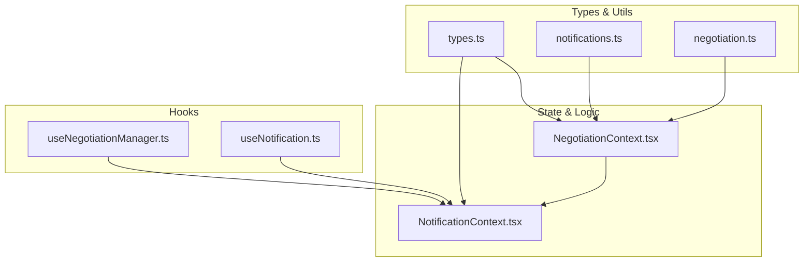
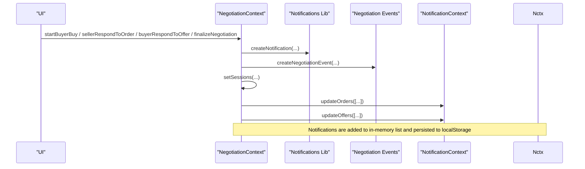
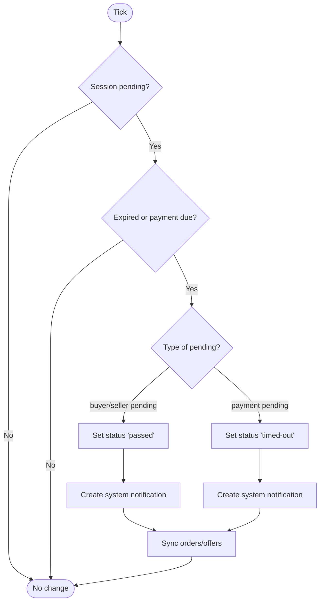
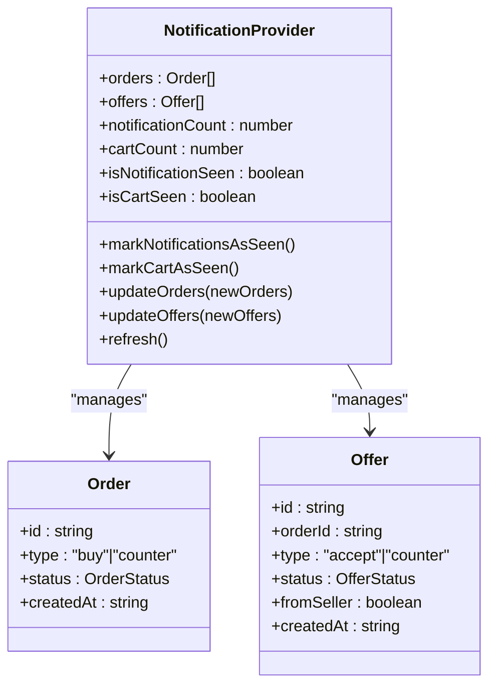
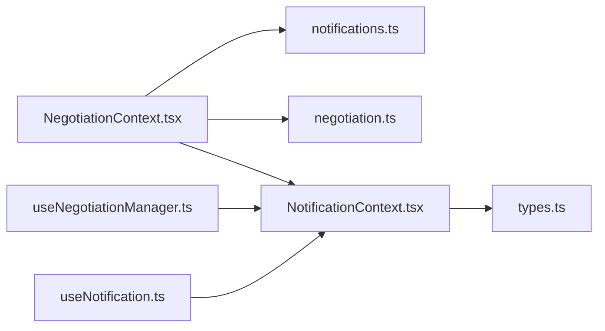

# Notification System Integration

<cite>
**Referenced Files in This Document**
- [NotificationContext.tsx](file://src/context/NotificationContext.tsx)
- [useNotification.ts](file://src/hooks/useNotification.ts)
- [notifications.ts](file://src/lib/notifications.ts)
- [NegotiationContext.tsx](file://src/context/NegotiationContext.tsx)
- [useNegotiationManager.ts](file://src/hooks/useNegotiationManager.ts)
- [negotiation.ts](file://src/lib/negotiation.ts)
- [types.ts](file://src/types.ts)
</cite>

## Table of Contents
1. [Introduction](#introduction)
2. [Project Structure](#project-structure)
3. [Core Components](#core-components)
4. [Architecture Overview](#architecture-overview)
5. [Detailed Component Analysis](#detailed-component-analysis)
6. [Dependency Analysis](#dependency-analysis)
7. [Performance Considerations](#performance-considerations)
8. [Troubleshooting Guide](#troubleshooting-guide)
9. [Conclusion](#conclusion)
10. [Appendices](#appendices)

## Introduction
This document explains how the negotiation engine integrates with the notification system to notify buyers, sellers, and the system about negotiation events. It covers notification categories (order, offer, negotiation), message templates and status indicators, lifecycle from creation to read management, automated notifications for timeouts, accepted offers, declined requests, and payment reminders, persistence via local storage, filtering capabilities, user preference considerations, and guidance for extending the system to support custom negotiation events.

## Project Structure
The notification integration spans several layers:
- Domain types and utilities define notification categories, actors, statuses, and helper functions.
- Contexts manage state for orders/offers and negotiation sessions, including notifications and events.
- Hooks provide convenient access to contexts and higher-level operations.
- Persistence is implemented using browser local storage for both orders/offers and negotiation-related data.

**Diagram sources**
- [types.ts:1-48](file://src/types.ts#L1-L48)
- [notifications.ts:1-42](file://src/lib/notifications.ts#L1-L42)
- [negotiation.ts:1-49](file://src/lib/negotiation.ts#L1-L49)
- [NegotiationContext.tsx:1-706](file://src/context/NegotiationContext.tsx#L1-L706)
- [NotificationContext.tsx:1-146](file://src/context/NotificationContext.tsx#L1-L146)
- [useNegotiationManager.ts:1-201](file://src/hooks/useNegotiationManager.ts#L1-L201)
- [useNotification.ts:1-8](file://src/hooks/useNotification.ts#L1-L8)

**Section sources**
- [types.ts:1-48](file://src/types.ts#L1-L48)
- [notifications.ts:1-42](file://src/lib/notifications.ts#L1-L42)
- [negotiation.ts:1-49](file://src/lib/negotiation.ts#L1-L49)
- [NegotiationContext.tsx:1-706](file://src/context/NegotiationContext.tsx#L1-L706)
- [NotificationContext.tsx:1-146](file://src/context/NotificationContext.tsx#L1-L146)
- [useNegotiationManager.ts:1-201](file://src/hooks/useNegotiationManager.ts#L1-L201)
- [useNotification.ts:1-8](file://src/hooks/useNotification.ts#L1-L8)

## Core Components
- Notification utilities define categories, actors, statuses, and helpers to create, add, mark as read, and count unread notifications.
- Negotiation context orchestrates negotiation sessions, triggers notifications on key actions, enforces timeouts, and persists sessions/events/notifications to local storage.
- Notification context maintains orders and offers lists, badge counts, and seen flags, also persisted to local storage.
- Hooks expose these contexts and higher-level operations for creating orders, responding to offers, and managing negotiation flows.

Key responsibilities:
- Create and persist notifications for order, offer, and negotiation events.
- Maintain read/unread status and badge counts.
- Enforce time-based rules (e.g., timeouts, payment deadlines).
- Synchronize negotiation state with orders/offers for UI consistency.

**Section sources**
- [notifications.ts:1-42](file://src/lib/notifications.ts#L1-L42)
- [NegotiationContext.tsx:140-179](file://src/context/NegotiationContext.tsx#L140-L179)
- [NotificationContext.tsx:22-116](file://src/context/NotificationContext.tsx#L22-L116)
- [useNegotiationManager.ts:6-201](file://src/hooks/useNegotiationManager.ts#L6-L201)

## Architecture Overview
The negotiation engine drives notifications through a central provider that:
- Creates AppNotification entries for each significant event.
- Persists notifications and events to local storage.
- Updates orders/offers in the shared notification context to reflect UI badges and lists.
- Runs periodic checks to enforce timeouts and payment deadlines, generating system notifications when needed.

**Diagram sources**
- [NegotiationContext.tsx:175-179](file://src/context/NegotiationContext.tsx#L175-L179)
- [NegotiationContext.tsx:292-316](file://src/context/NegotiationContext.tsx#L292-L316)
- [NegotiationContext.tsx:380-512](file://src/context/NegotiationContext.tsx#L380-L512)
- [NegotiationContext.tsx:514-624](file://src/context/NegotiationContext.tsx#L514-L624)
- [NegotiationContext.tsx:626-669](file://src/context/NegotiationContext.tsx#L626-L669)
- [notifications.ts:17-28](file://src/lib/notifications.ts#L17-L28)
- [negotiation.ts:29-38](file://src/lib/negotiation.ts#L29-L38)

## Detailed Component Analysis

### Notification Data Model and Utilities
- Categories: order, offer, negotiation.
- Actors: seller, buyer, system.
- Statuses: pending, accepted, countered, declined, rejected, read, timed-out.
- Helpers:
  - createNotification: generates id, timestamp, default read=false.
  - addNotification: prepends new notification and caps history.
  - markNotificationRead/markAllNotificationsRead: updates read flag and status.
  - getUnreadNotificationCount: counts unread items.

These utilities are used by the negotiation context to build consistent notifications across all negotiation flows.

**Section sources**
- [notifications.ts:1-42](file://src/lib/notifications.ts#L1-L42)

### Negotiation Context: Event-to-Notification Flow
- Buyer initiates buy or counter:
  - Creates session, sets pending states, schedules payment deadline.
  - Emits order or negotiation category notifications with appropriate status.
  - Adds corresponding order to shared state for seller visibility.
- Seller responds to order:
  - Accept: transitions to payment-pending, notifies buyer, creates an offer for buyer.
  - Decline: ends negotiation, notifies buyer, marks order declined.
  - Counter: alternates turn, notifies buyer, updates order status.
- Buyer responds to offer:
  - Accept: transitions to payment-pending, notifies seller, updates order.
  - Decline: ends negotiation, notifies seller, marks offer declined.
  - Counter: alternates turn, notifies seller, creates new order for seller.
- Finalize negotiation:
  - Marks completed, notifies both parties, updates order/offer statuses to completed.

Automated timeout handling:
- Periodic tick checks pending sessions older than one day or past payment due date.
- Transitions to passed/timed-out and emits system notifications accordingly.
- Syncs order/offer statuses to reflect timeout outcomes.

**Diagram sources**
- [NegotiationContext.tsx:181-252](file://src/context/NegotiationContext.tsx#L181-L252)

**Section sources**
- [NegotiationContext.tsx:267-317](file://src/context/NegotiationContext.tsx#L267-L317)
- [NegotiationContext.tsx:319-378](file://src/context/NegotiationContext.tsx#L319-L378)
- [NegotiationContext.tsx:380-512](file://src/context/NegotiationContext.tsx#L380-L512)
- [NegotiationContext.tsx:514-624](file://src/context/NegotiationContext.tsx#L514-L624)
- [NegotiationContext.tsx:626-669](file://src/context/NegotiationContext.tsx#L626-L669)
- [NegotiationContext.tsx:181-252](file://src/context/NegotiationContext.tsx#L181-L252)

### Notification Context: Orders, Offers, and Badges
- Maintains arrays of orders and offers, persisted to local storage.
- Computes badge counts:
  - Unviewed orders: pending orders for sellers.
  - Unviewed offers: active offers from sellers for buyers.
- Tracks seen flags to reset badges when new items arrive.
- Provides refresh and update methods for consumers.

**Diagram sources**
- [NotificationContext.tsx:6-18](file://src/context/NotificationContext.tsx#L6-L18)
- [types.ts:5-48](file://src/types.ts#L5-L48)

**Section sources**
- [NotificationContext.tsx:22-116](file://src/context/NotificationContext.tsx#L22-L116)
- [types.ts:1-48](file://src/types.ts#L1-L48)

### Hooks: High-Level Operations
- useNegotiationManager:
  - Creates orders (buy/counter), updates orders/offers based on seller/buyer actions.
  - Bridges UI actions to state changes without directly invoking negotiation context logic.
- useNotification:
  - Exposes NotificationContext for components to read/update orders/offers and badge states.

These hooks encapsulate common workflows and keep UI code clean.

**Section sources**
- [useNegotiationManager.ts:6-201](file://src/hooks/useNegotiationManager.ts#L6-L201)
- [useNotification.ts:1-8](file://src/hooks/useNotification.ts#L1-L8)

## Dependency Analysis
- NegotiationContext depends on:
  - notifications.ts for creating and managing AppNotification objects.
  - negotiation.ts for creating NegotiationEvent records.
  - NotificationContext for synchronizing orders/offers and badge counts.
- NotificationContext depends on:
  - types.ts for Order and Offer structures.
  - Local storage for persistence.
- Hooks depend on their respective contexts to provide simplified APIs.

**Diagram sources**
- [NegotiationContext.tsx:1-706](file://src/context/NegotiationContext.tsx#L1-L706)
- [notifications.ts:1-42](file://src/lib/notifications.ts#L1-L42)
- [negotiation.ts:1-49](file://src/lib/negotiation.ts#L1-L49)
- [NotificationContext.tsx:1-146](file://src/context/NotificationContext.tsx#L1-L146)
- [types.ts:1-89](file://src/types.ts#L1-L89)
- [useNegotiationManager.ts:1-201](file://src/hooks/useNegotiationManager.ts#L1-L201)
- [useNotification.ts:1-8](file://src/hooks/useNotification.ts#L1-L8)

**Section sources**
- [NegotiationContext.tsx:1-706](file://src/context/NegotiationContext.tsx#L1-L706)
- [notifications.ts:1-42](file://src/lib/notifications.ts#L1-L42)
- [negotiation.ts:1-49](file://src/lib/negotiation.ts#L1-L49)
- [NotificationContext.tsx:1-146](file://src/context/NotificationContext.tsx#L1-L146)
- [types.ts:1-89](file://src/types.ts#L1-L89)
- [useNegotiationManager.ts:1-201](file://src/hooks/useNegotiationManager.ts#L1-L201)
- [useNotification.ts:1-8](file://src/hooks/useNotification.ts#L1-L8)

## Performance Considerations
- Notification history is capped to a fixed size to prevent unbounded growth.
- Local storage writes occur on state changes; ensure not to trigger excessive re-renders.
- The periodic tick runs every 30 seconds; consider adjusting frequency based on expected load.
- Badge computations filter small arrays; performance remains acceptable but avoid unnecessary recalculations in heavy UI trees.

[No sources needed since this section provides general guidance]

## Troubleshooting Guide
Common issues and resolutions:
- Notifications not appearing:
  - Ensure pushNotification is invoked during negotiation actions.
  - Verify local storage keys are present and parseable.
- Badge counts incorrect:
  - Confirm orders/offers arrays are updated via updateOrders/updateOffers.
  - Check that seen flags reset when new items are added.
- Timeouts not triggering:
  - Validate that sessions have updatedAt timestamps and paymentDueAt where applicable.
  - Ensure the interval is running and not cleared prematurely.
- Read status not updating:
  - Use markNotificationRead or markAllNotificationsRead appropriately.
  - Confirm UI reads from the correct context (negotiation vs. notification context).

**Section sources**
- [NegotiationContext.tsx:146-173](file://src/context/NegotiationContext.tsx#L146-L173)
- [NegotiationContext.tsx:181-252](file://src/context/NegotiationContext.tsx#L181-L252)
- [notifications.ts:30-42](file://src/lib/notifications.ts#L30-L42)
- [NotificationContext.tsx:87-116](file://src/context/NotificationContext.tsx#L87-L116)

## Conclusion
The notification system integrates tightly with the negotiation engine to provide real-time feedback for buyers, sellers, and system events. It supports three categories (order, offer, negotiation), enforces automation for timeouts and payment deadlines, persists state locally, and exposes clear APIs via contexts and hooks. Extensibility is straightforward by adding new event handlers that call the existing notification utilities and update shared state.

[No sources needed since this section summarizes without analyzing specific files]

## Appendices

### Notification Lifecycle
- Creation:
  - Triggered by negotiation actions or system timers.
  - Uses createNotification to generate structured entries with category, actor, status, and relatedId.
- Persistence:
  - Stored in memory and synced to local storage under dedicated keys.
- Read Management:
  - markNotificationRead updates individual items.
  - markAllNotificationsRead clears unread flags globally.
- Filtering:
  - Consumers can filter notifications by category, actor, status, or relatedId using standard array operations.
- User Preferences:
  - No built-in per-user preference toggles exist in the current implementation; preferences could be added by storing user settings alongside notifications or in separate local storage entries.

**Section sources**
- [notifications.ts:17-42](file://src/lib/notifications.ts#L17-L42)
- [NegotiationContext.tsx:146-173](file://src/context/NegotiationContext.tsx#L146-L173)

### Examples of Automated Notifications
- Timeout:
  - When a pending session exceeds one day or payment due date passes, system emits a notification indicating passed or timed-out status.
- Accepted Offer:
  - When a seller accepts an order or a buyer accepts an offer, notifications are emitted with accepted status and payment deadlines.
- Declined Request:
  - When either party declines, notifications indicate decline and end negotiation flow.
- Payment Reminders:
  - Payment deadlines are set upon acceptance; if unpaid within the deadline, the system transitions to timed-out and notifies accordingly.

**Section sources**
- [NegotiationContext.tsx:181-252](file://src/context/NegotiationContext.tsx#L181-L252)
- [NegotiationContext.tsx:407-424](file://src/context/NegotiationContext.tsx#L407-L424)
- [NegotiationContext.tsx:542-559](file://src/context/NegotiationContext.tsx#L542-L559)

### Extending the Notification System for Custom Events
Steps to add a new negotiation event:
- Define any new categories/statuses if necessary in the notification utilities.
- In the negotiation context, add a handler that:
  - Calls createNotification with appropriate category, actor, status, and relatedId.
  - Uses pushNotification to persist and emit the event.
  - Updates orders/offers in the notification context to reflect UI changes.
  - Optionally creates a NegotiationEvent for auditability.
- Expose the new action via hooks or context methods for UI consumption.

**Section sources**
- [notifications.ts:1-42](file://src/lib/notifications.ts#L1-L42)
- [NegotiationContext.tsx:175-179](file://src/context/NegotiationContext.tsx#L175-L179)
- [negotiation.ts:29-38](file://src/lib/negotiation.ts#L29-L38)