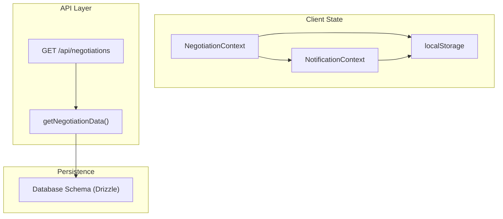
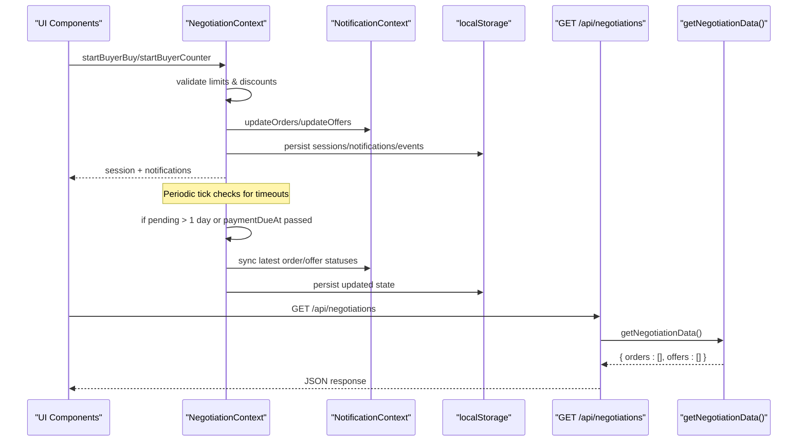
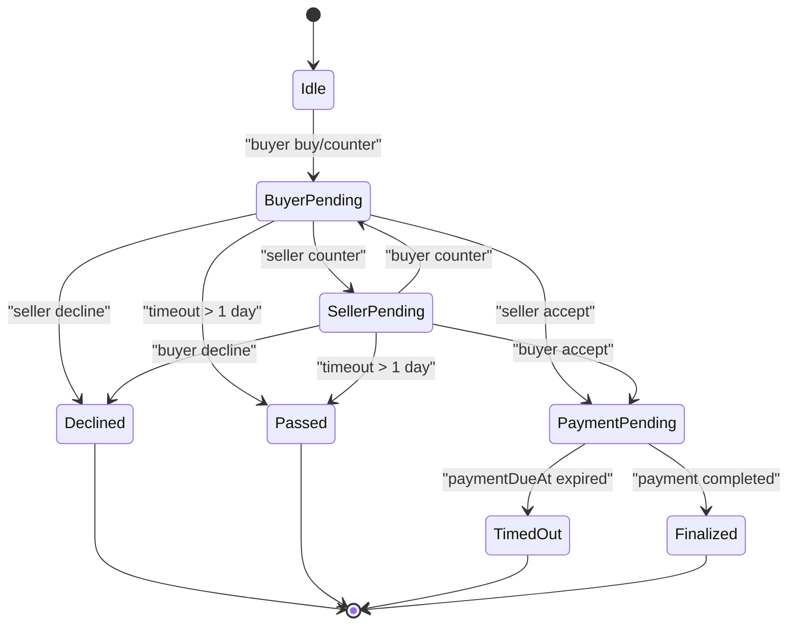
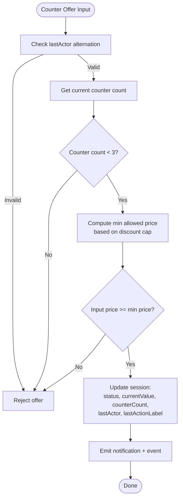
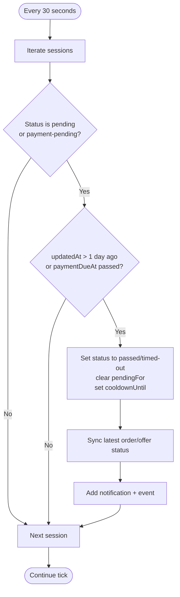
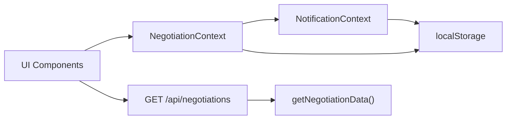
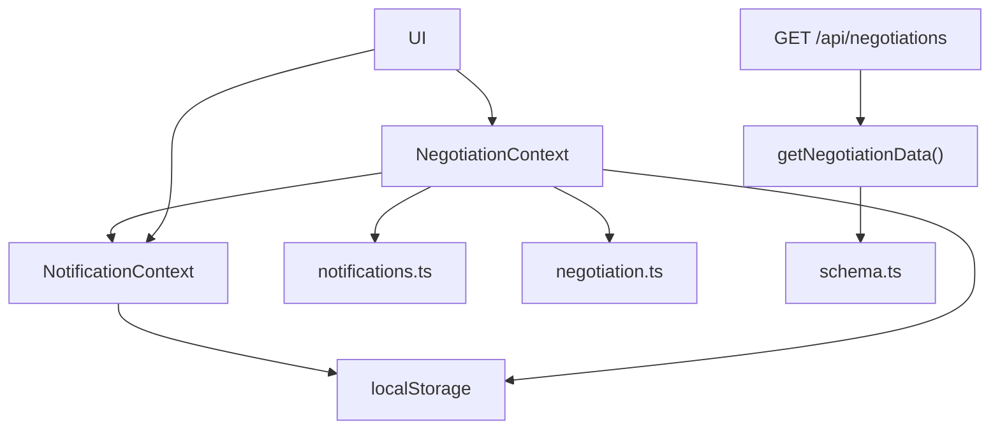

# Real-time Negotiation Engine

<cite>
**Referenced Files in This Document**
- [NegotiationContext.tsx](file://src/context/NegotiationContext.tsx)
- [negotiation.ts](file://src/lib/negotiation.ts)
- [notifications.ts](file://src/lib/notifications.ts)
- [NotificationContext.tsx](file://src/context/NotificationContext.tsx)
- [useNegotiationManager.ts](file://src/hooks/useNegotiationManager.ts)
- [route.ts](file://src/app/api/negotiations/route.ts)
- [negotiations.ts](file://src/lib/negotiations.ts)
- [schema.ts](file://src/db/schema.ts)
</cite>

## Table of Contents
1. [Introduction](#introduction)
2. [Project Structure](#project-structure)
3. [Core Components](#core-components)
4. [Architecture Overview](#architecture-overview)
5. [Detailed Component Analysis](#detailed-component-analysis)
6. [Dependency Analysis](#dependency-analysis)
7. [Performance Considerations](#performance-considerations)
8. [Troubleshooting Guide](#troubleshooting-guide)
9. [Conclusion](#conclusion)
10. [Appendices](#appendices)

## Introduction
This document explains the Real-time Negotiation Engine implemented in the application. It focuses on the state machine that drives negotiation workflows, counter-offer generation rules, timeout handling, and real-time synchronization across users via shared contexts and localStorage persistence. It also documents the notification system integration, data flows, API endpoints for negotiation operations, error handling strategies, security considerations, rate limiting patterns, and scalability approaches for concurrent negotiations.

## Project Structure
The negotiation engine is primarily built with:
- A client-side context provider managing negotiation sessions, notifications, and events
- Shared order/offer state persisted to localStorage and synchronized across components
- An API route to fetch negotiation data (orders/offers)
- Utility modules for creating notifications and negotiation events
- Hooks to orchestrate buyer/seller actions

**Diagram sources**
- [NegotiationContext.tsx:140-173](file://src/context/NegotiationContext.tsx#L140-L173)
- [NotificationContext.tsx:22-85](file://src/context/NotificationContext.tsx#L22-L85)
- [route.ts:4-12](file://src/app/api/negotiations/route.ts#L4-L12)
- [negotiations.ts:57-62](file://src/lib/negotiations.ts#L57-L62)
- [schema.ts:58-83](file://src/db/schema.ts#L58-L83)

**Section sources**
- [NegotiationContext.tsx:140-173](file://src/context/NegotiationContext.tsx#L140-L173)
- [NotificationContext.tsx:22-85](file://src/context/NotificationContext.tsx#L22-L85)
- [route.ts:4-12](file://src/app/api/negotiations/route.ts#L4-L12)
- [negotiations.ts:57-62](file://src/lib/negotiations.ts#L57-L62)
- [schema.ts:58-83](file://src/db/schema.ts#L58-L83)

## Core Components
- NegotiationContext: Central state machine for negotiation sessions, including status transitions, timeouts, cooldowns, and counters. Persists sessions, notifications, and events to localStorage.
- NotificationContext: Global store for orders and offers, persisted to localStorage, used by UI to display pending items and badges.
- useNegotiationManager: Hook providing higher-level actions for buyers and sellers to create orders, accept/decline, and counter offers.
- Notifications utilities: Create and manage AppNotification entries.
- Negotiation utilities: Define types and helpers for negotiation events and summaries.
- API route: GET /api/negotiations returns orders and offers (currently returning empty arrays).

Key responsibilities:
- Enforce alternating turns between buyer and seller
- Limit counter-offers per side and per day
- Apply discount caps based on counter counts
- Handle timeouts and payment deadlines
- Emit notifications and events on every state change
- Persist state to localStorage for cross-session continuity

**Section sources**
- [NegotiationContext.tsx:9-18](file://src/context/NegotiationContext.tsx#L9-L18)
- [NegotiationContext.tsx:117-138](file://src/context/NegotiationContext.tsx#L117-L138)
- [NegotiationContext.tsx:140-173](file://src/context/NegotiationContext.tsx#L140-L173)
- [NotificationContext.tsx:22-85](file://src/context/NotificationContext.tsx#L22-L85)
- [useNegotiationManager.ts:9-48](file://src/hooks/useNegotiationManager.ts#L9-L48)
- [notifications.ts:17-42](file://src/lib/notifications.ts#L17-L42)
- [negotiation.ts:1-50](file://src/lib/negotiation.ts#L1-L50)

## Architecture Overview
The negotiation engine uses a client-side state machine driven by user actions and periodic ticks for timeout handling. The flow spans multiple contexts and persists to localStorage.

**Diagram sources**
- [NegotiationContext.tsx:181-252](file://src/context/NegotiationContext.tsx#L181-L252)
- [NegotiationContext.tsx:267-378](file://src/context/NegotiationContext.tsx#L267-L378)
- [NegotiationContext.tsx:380-512](file://src/context/NegotiationContext.tsx#L380-L512)
- [NegotiationContext.tsx:514-624](file://src/context/NegotiationContext.tsx#L514-L624)
- [route.ts:4-12](file://src/app/api/negotiations/route.ts#L4-L12)
- [negotiations.ts:57-62](file://src/lib/negotiations.ts#L57-L62)

## Detailed Component Analysis

### State Machine Architecture
The negotiation state machine defines states and transitions for both buyer and seller sides:

- States include: idle, buyer-pending, seller-pending, accepted, payment-pending, declined, timed-out, passed, finalized
- Transitions are enforced by:
  - Alternating lastActor to prevent consecutive actions from the same party
  - Counter limits (max 3 per side)
  - Discount caps based on counterCount
  - Daily action limits for buyer
  - Cooldown periods after actions
  - Timeouts for pending states and payment deadlines

**Diagram sources**
- [NegotiationContext.tsx:9-18](file://src/context/NegotiationContext.tsx#L9-L18)
- [NegotiationContext.tsx:181-252](file://src/context/NegotiationContext.tsx#L181-L252)
- [NegotiationContext.tsx:267-378](file://src/context/NegotiationContext.tsx#L267-L378)
- [NegotiationContext.tsx:380-512](file://src/context/NegotiationContext.tsx#L380-L512)
- [NegotiationContext.tsx:514-624](file://src/context/NegotiationContext.tsx#L514-L624)

**Section sources**
- [NegotiationContext.tsx:9-18](file://src/context/NegotiationContext.tsx#L9-L18)
- [NegotiationContext.tsx:181-252](file://src/context/NegotiationContext.tsx#L181-L252)

### Counter-Offer Generation Algorithms
Counter-offer constraints ensure fair and bounded negotiation:
- Buyer max discount depends on buyerCounterCount:
  - 0 counters: up to 40% discount
  - 1 counter: up to 30% discount
  - 2+ counters: up to 15% discount
- Seller max discount depends on sellerCounterCount:
  - 0 counters: up to 35% discount
  - 1 counter: up to 25% discount
  - 2+ counters: up to 10% discount
- Alternating turns enforced via lastActor
- Max 3 counters per side
- Daily limit for buyer actions (up to 3 buys/counters per day)
- Cooldown period after actions

**Diagram sources**
- [NegotiationContext.tsx:105-115](file://src/context/NegotiationContext.tsx#L105-L115)
- [NegotiationContext.tsx:319-378](file://src/context/NegotiationContext.tsx#L319-L378)
- [NegotiationContext.tsx:380-512](file://src/context/NegotiationContext.tsx#L380-L512)
- [NegotiationContext.tsx:514-624](file://src/context/NegotiationContext.tsx#L514-L624)

**Section sources**
- [NegotiationContext.tsx:105-115](file://src/context/NegotiationContext.tsx#L105-L115)
- [NegotiationContext.tsx:319-378](file://src/context/NegotiationContext.tsx#L319-L378)
- [NegotiationContext.tsx:380-512](file://src/context/NegotiationContext.tsx#L380-L512)
- [NegotiationContext.tsx:514-624](file://src/context/NegotiationContext.tsx#L514-L624)

### Timeout Handling Mechanisms
Timeouts are managed by a periodic tick that:
- Checks if a session is pending (buyer-pending, seller-pending, payment-pending)
- If pending for more than 1 day since updatedAt, transitions to passed
- If paymentDueAt has expired while in payment-pending, transitions to timed-out
- Emits notifications and updates corresponding orders/offers
- Applies a cooldown period after timeout

**Diagram sources**
- [NegotiationContext.tsx:181-252](file://src/context/NegotiationContext.tsx#L181-L252)

**Section sources**
- [NegotiationContext.tsx:181-252](file://src/context/NegotiationContext.tsx#L181-L252)

### Real-time Synchronization Across Users
Synchronization strategy:
- Shared state via NotificationContext holds orders and offers
- NegotiationContext updates these lists on each action
- Both contexts persist to localStorage for cross-session continuity
- UI reads from these contexts to reflect changes immediately
- API endpoint provides server-side data (currently returns empty arrays)

**Diagram sources**
- [NegotiationContext.tsx:140-173](file://src/context/NegotiationContext.tsx#L140-L173)
- [NotificationContext.tsx:22-85](file://src/context/NotificationContext.tsx#L22-L85)
- [route.ts:4-12](file://src/app/api/negotiations/route.ts#L4-L12)
- [negotiations.ts:57-62](file://src/lib/negotiations.ts#L57-L62)

**Section sources**
- [NegotiationContext.tsx:140-173](file://src/context/NegotiationContext.tsx#L140-L173)
- [NotificationContext.tsx:22-85](file://src/context/NotificationContext.tsx#L22-L85)
- [route.ts:4-12](file://src/app/api/negotiations/route.ts#L4-L12)

### Negotiation Context Provider for Global State Management
The NegotiationProvider:
- Maintains sessions, notifications, and events in React state
- Persists all three to localStorage keys: negotiation-sessions-v1, negotiation-notifications-v1, negotiation-events-v1
- Loads persisted state on mount
- Provides methods to start actions, respond to offers/orders, finalize payments, and query session details
- Integrates with NotificationContext to keep orders/offers in sync

**Section sources**
- [NegotiationContext.tsx:140-173](file://src/context/NegotiationContext.tsx#L140-L173)
- [NegotiationContext.tsx:671-706](file://src/context/NegotiationContext.tsx#L671-L706)

### localStorage Persistence for Cross-Session Continuity
- Sessions, notifications, and events are saved to localStorage whenever they change
- Orders and offers are stored under 'orders' and 'offers' keys
- On app load, these values are parsed and set into state
- Error handling ensures invalid JSON does not crash the app

**Section sources**
- [NegotiationContext.tsx:146-173](file://src/context/NegotiationContext.tsx#L146-L173)
- [NotificationContext.tsx:29-85](file://src/context/NotificationContext.tsx#L29-L85)

### Notification System Integration
- Every negotiation action creates an AppNotification via addNotification/createNotification
- Notifications are limited to the last 20 entries
- Unread count is computed and exposed via context
- Events are created for audit trails using createNegotiationEvent

**Section sources**
- [notifications.ts:17-42](file://src/lib/notifications.ts#L17-L42)
- [negotiation.ts:29-49](file://src/lib/negotiation.ts#L29-L49)
- [NegotiationContext.tsx:175-179](file://src/context/NegotiationContext.tsx#L175-L179)

### Examples of Negotiation Data Flows
- Buyer initiates buy:
  - Creates order in NotificationContext
  - Starts negotiation session in buyer-pending
  - Emits notification and event
  - Persists to localStorage
- Seller responds:
  - Accepts -> payment-pending with paymentDueAt
  - Declines -> declined
  - Counters -> seller-pending with new price and counter count
- Buyer responds to seller offer:
  - Accepts -> payment-pending
  - Declines -> declined
  - Counters -> buyer-pending with new price

**Section sources**
- [NegotiationContext.tsx:267-378](file://src/context/NegotiationContext.tsx#L267-L378)
- [NegotiationContext.tsx:380-512](file://src/context/NegotiationContext.tsx#L380-L512)
- [NegotiationContext.tsx:514-624](file://src/context/NegotiationContext.tsx#L514-L624)

### API Endpoints for Negotiation Operations
- GET /api/negotiations: Returns orders and offers
  - Currently returns empty arrays
  - Error handling returns 500 with fallback payload

**Section sources**
- [route.ts:4-12](file://src/app/api/negotiations/route.ts#L4-L12)
- [negotiations.ts:57-62](file://src/lib/negotiations.ts#L57-L62)

### Error Handling Strategies
- Loading localStorage: try/catch blocks prevent crashes on malformed data
- API errors: catch block logs error and returns a safe default response
- Validation: counter limits, discount caps, and alternating turns prevent invalid state mutations
- Cooldowns and daily limits reduce abuse and ensure fairness

**Section sources**
- [NegotiationContext.tsx:146-158](file://src/context/NegotiationContext.tsx#L146-L158)
- [route.ts:8-11](file://src/app/api/negotiations/route.ts#L8-L11)
- [NegotiationContext.tsx:260-265](file://src/context/NegotiationContext.tsx#L260-L265)
- [NegotiationContext.tsx:324-331](file://src/context/NegotiationContext.tsx#L324-L331)
- [NegotiationContext.tsx:426-432](file://src/context/NegotiationContext.tsx#L426-L432)
- [NegotiationContext.tsx:561-567](file://src/context/NegotiationContext.tsx#L561-L567)

## Dependency Analysis
Components and their relationships:

**Diagram sources**
- [NegotiationContext.tsx:140-173](file://src/context/NegotiationContext.tsx#L140-L173)
- [NotificationContext.tsx:22-85](file://src/context/NotificationContext.tsx#L22-L85)
- [notifications.ts:17-42](file://src/lib/notifications.ts#L17-L42)
- [negotiation.ts:1-50](file://src/lib/negotiation.ts#L1-L50)
- [route.ts:4-12](file://src/app/api/negotiations/route.ts#L4-L12)
- [negotiations.ts:57-62](file://src/lib/negotiations.ts#L57-L62)
- [schema.ts:58-83](file://src/db/schema.ts#L58-L83)

**Section sources**
- [NegotiationContext.tsx:140-173](file://src/context/NegotiationContext.tsx#L140-L173)
- [NotificationContext.tsx:22-85](file://src/context/NotificationContext.tsx#L22-L85)
- [route.ts:4-12](file://src/app/api/negotiations/route.ts#L4-L12)

## Performance Considerations
- LocalStorage writes occur on every state change; consider batching updates for large datasets
- Periodic tick runs every 30 seconds; ensure it remains efficient by minimizing DOM updates
- Notification list is capped at 20 entries to prevent memory growth
- Counter limits and cooldowns reduce excessive state churn
- For high concurrency, consider moving state to a server with WebSockets for real-time sync

[No sources needed since this section provides general guidance]

## Troubleshooting Guide
Common issues and resolutions:
- Invalid localStorage data: Ensure JSON format is correct; app will log errors and skip loading
- API failures: Check network and server logs; fallback payload is returned
- Stuck negotiations: Verify timeout logic and paymentDueAt timestamps
- Excessive counters: Confirm discount caps and alternating turn enforcement
- Missing notifications: Check addNotification usage and event creation

**Section sources**
- [NegotiationContext.tsx:146-158](file://src/context/NegotiationContext.tsx#L146-L158)
- [route.ts:8-11](file://src/app/api/negotiations/route.ts#L8-L11)
- [notifications.ts:26-42](file://src/lib/notifications.ts#L26-L42)

## Conclusion
The Real-time Negotiation Engine implements a robust client-side state machine with clear rules for counter-offers, timeouts, and synchronization. It leverages React contexts and localStorage for persistence and real-time updates within the browser. While currently lightweight, it can be extended with server-side coordination and WebSockets for multi-user scenarios. Proper validation, error handling, and rate limiting patterns ensure reliability and fairness.

[No sources needed since this section summarizes without analyzing specific files]

## Appendices

### Security Considerations
- Client-side validation only: Implement server-side validation for critical operations
- Sanitize inputs: Prevent injection attacks when displaying user-provided descriptions
- Rate limiting: Enforce daily action limits and cooldowns on the server
- Authentication: Secure endpoints and protect sensitive negotiation data

[No sources needed since this section provides general guidance]

### Scalability Patterns
- Move state to server: Use a database and WebSocket server for real-time sync
- Partition sessions: Shard by cardId or userId to distribute load
- Caching: Cache frequently accessed negotiation summaries
- Background jobs: Process timeouts and payment deadlines asynchronously

[No sources needed since this section provides general guidance]