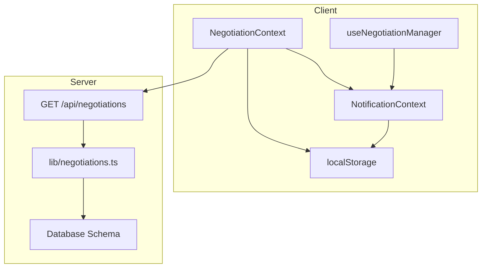
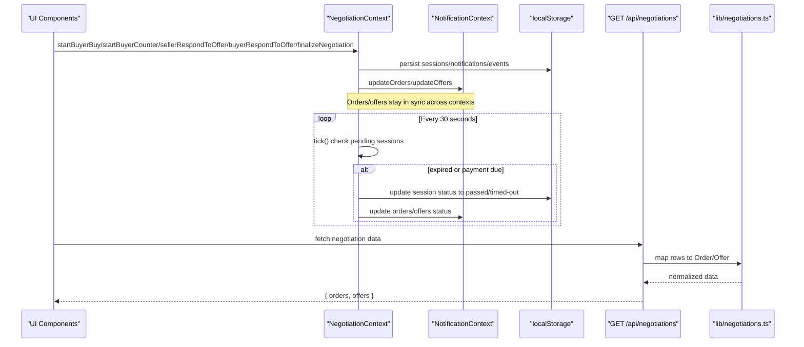
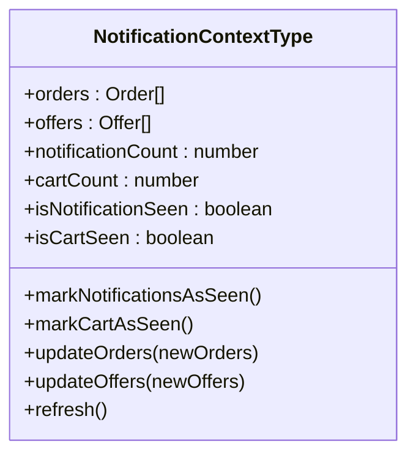
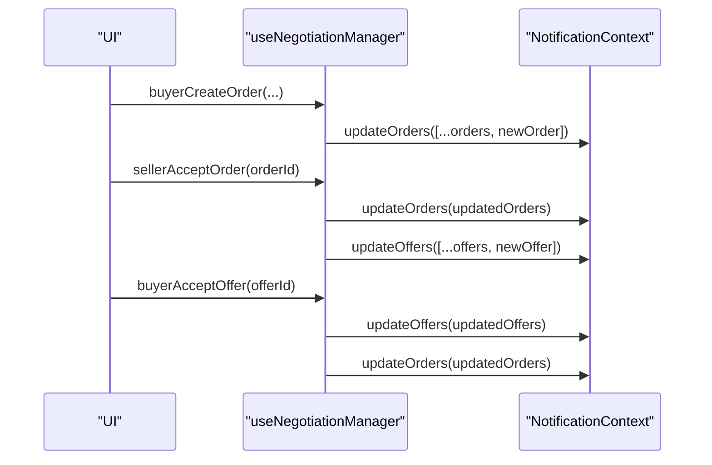
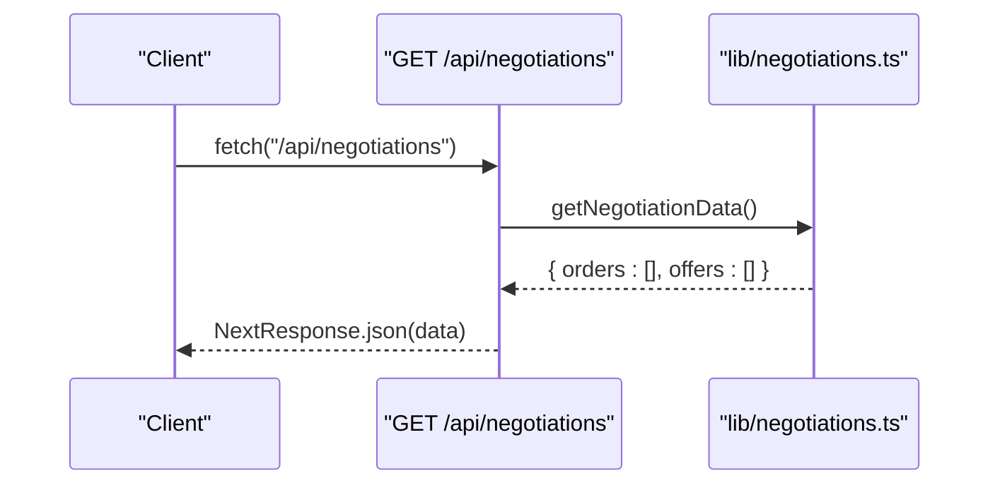
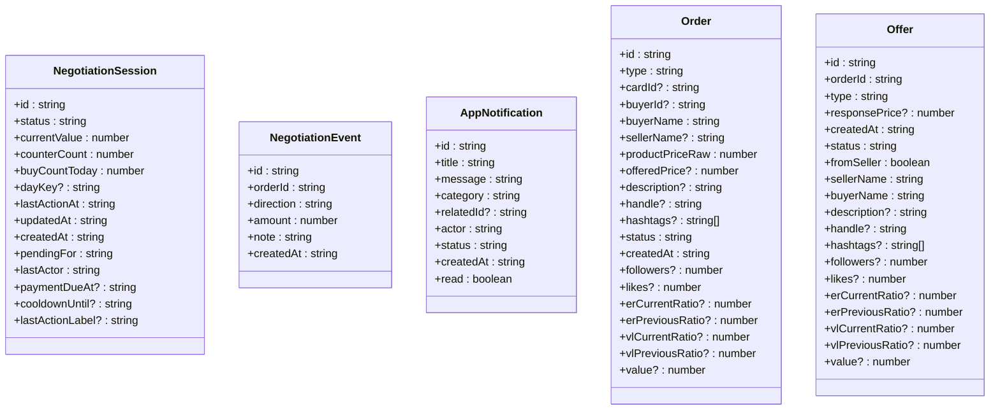
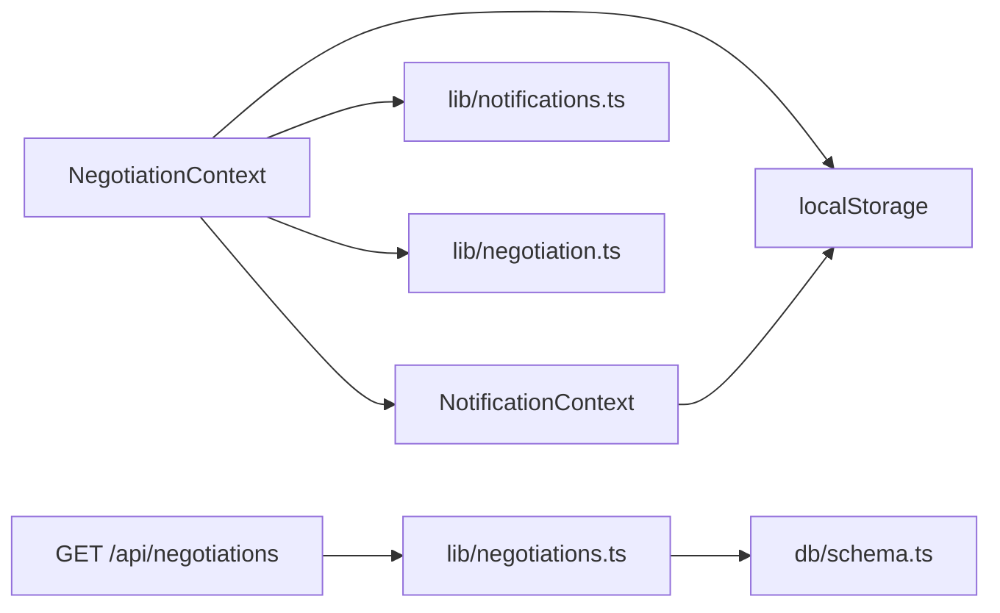

# Real-time Synchronization

<cite>
**Referenced Files in This Document**
- [NegotiationContext.tsx](file://src/context/NegotiationContext.tsx)
- [NotificationContext.tsx](file://src/context/NotificationContext.tsx)
- [useNegotiationManager.ts](file://src/hooks/useNegotiationManager.ts)
- [negotiations.ts](file://src/lib/negotiations.ts)
- [route.ts](file://src/app/api/negotiations/route.ts)
- [negotiation.ts](file://src/lib/negotiation.ts)
- [notifications.ts](file://src/lib/notifications.ts)
- [schema.ts](file://src/db/schema.ts)
- [types.ts](file://src/types.ts)
</cite>

## Table of Contents
1. [Introduction](#introduction)
2. [Project Structure](#project-structure)
3. [Core Components](#core-components)
4. [Architecture Overview](#architecture-overview)
5. [Detailed Component Analysis](#detailed-component-analysis)
6. [Dependency Analysis](#dependency-analysis)
7. [Performance Considerations](#performance-considerations)
8. [Troubleshooting Guide](#troubleshooting-guide)
9. [Conclusion](#conclusion)
10. [Appendices](#appendices)

## Introduction
This document explains the real-time synchronization mechanisms for negotiation sessions across multiple users and devices. It focuses on how client-side state is persisted to localStorage, synchronized with server endpoints, and updated via a polling mechanism. It also covers timeout detection for inactive negotiations, conflict resolution strategies, integration between client state and server persistence, error handling for network failures, offline support patterns, and scalability considerations for concurrent negotiations and data consistency.

## Project Structure
The real-time synchronization spans several layers:
- Client context providers manage session state, notifications, and events, and persist them to localStorage.
- A polling interval checks for timeouts and updates statuses accordingly.
- API routes expose endpoints to fetch negotiation data from the server.
- Data mapping utilities convert server responses into typed client models.
- Database schema defines persistent entities used by the backend (for future or current server integrations).



**Diagram sources**
- [NegotiationContext.tsx:140-252](file://src/context/NegotiationContext.tsx#L140-L252)
- [NotificationContext.tsx:22-85](file://src/context/NotificationContext.tsx#L22-L85)
- [route.ts:4-12](file://src/app/api/negotiations/route.ts#L4-L12)
- [negotiations.ts:12-62](file://src/lib/negotiations.ts#L12-L62)
- [schema.ts:1-84](file://src/db/schema.ts#L1-L84)

**Section sources**
- [NegotiationContext.tsx:140-252](file://src/context/NegotiationContext.tsx#L140-L252)
- [NotificationContext.tsx:22-85](file://src/context/NotificationContext.tsx#L22-L85)
- [route.ts:4-12](file://src/app/api/negotiations/route.ts#L4-L12)
- [negotiations.ts:12-62](file://src/lib/negotiations.ts#L12-L62)
- [schema.ts:1-84](file://src/db/schema.ts#L1-L84)

## Core Components
- NegotiationContext: Owns negotiation sessions, notifications, and events; persists to localStorage; runs a 30-second polling tick to detect timeouts and update statuses; coordinates with NotificationContext to keep orders/offers consistent.
- NotificationContext: Persists orders and offers to localStorage; exposes update functions; computes badge counts; provides refresh capability.
- useNegotiationManager: Provides higher-level actions for creating orders and responding to offers; updates shared order/offer lists.
- lib/negotiations.ts: Maps server rows to Order/Offer types and provides getNegotiationData() for fetching data.
- API route: GET /api/negotiations returns negotiation data via NextResponse.
- Types: Define Order, Offer, and related status enums used throughout the system.

**Section sources**
- [NegotiationContext.tsx:9-68](file://src/context/NegotiationContext.tsx#L9-L68)
- [NotificationContext.tsx:6-18](file://src/context/NotificationContext.tsx#L6-L18)
- [useNegotiationManager.ts:6-200](file://src/hooks/useNegotiationManager.ts#L6-L200)
- [negotiations.ts:12-62](file://src/lib/negotiations.ts#L12-L62)
- [route.ts:4-12](file://src/app/api/negotiations/route.ts#L4-L12)
- [types.ts:1-48](file://src/types.ts#L1-L48)

## Architecture Overview
The synchronization architecture combines local-first persistence with periodic server sync:
- Local-first: All negotiation sessions, notifications, and events are stored in localStorage and kept in React state.
- Polling: A 30-second interval evaluates pending sessions for timeouts based on last activity and payment deadlines.
- Server integration: The client can call GET /api/negotiations to fetch latest orders and offers; mapping utilities normalize server payloads.
- Cross-context sync: Changes in NegotiationContext propagate to NotificationContext to keep orders/offers consistent across UI components.



**Diagram sources**
- [NegotiationContext.tsx:140-252](file://src/context/NegotiationContext.tsx#L140-L252)
- [NotificationContext.tsx:22-85](file://src/context/NotificationContext.tsx#L22-L85)
- [route.ts:4-12](file://src/app/api/negotiations/route.ts#L4-L12)
- [negotiations.ts:12-62](file://src/lib/negotiations.ts#L12-L62)

## Detailed Component Analysis

### NegotiationContext: Session Lifecycle and Timeout Detection
- State management: Maintains sessions, notifications, and events; persists each to separate localStorage keys.
- Polling: Uses setInterval with a 30-second interval to evaluate active sessions. For each pending session:
  - If no update within one day or payment deadline exceeded, transitions to appropriate terminal states.
  - Updates notifications and events to reflect changes.
  - Syncs corresponding orders/offers in NotificationContext to maintain cross-context consistency.
- Actions:
  - Buyer actions: startBuyerBuy and startBuyerCounter enforce cooldowns and daily limits, validate counter discounts, and create orders.
  - Seller actions: sellerRespondToOrder handles accept/counter/decline, creates offers, and updates order statuses.
  - Buyer response: buyerRespondToOffer mirrors seller logic for buyer-side counters/accepts/declines.
  - Finalization: finalizeNegotiation marks payment completed and updates related order/offer statuses.

```mermaid
flowchart TD
Start([tick() every 30s]) --> CheckPending["Check if session is pending<br/>buyer-pending | seller-pending | payment-pending"]
CheckPending --> |No| End([No change])
CheckPending --> |Yes| Expired{"Expired or Payment Due?"}
Expired --> |No| End
Expired --> |Yes| DetermineStatus{"Original Status"}
DetermineStatus --> |buyer-pending| SetPassed["Set status 'passed'<br/>Notify user"]
DetermineStatus --> |seller-pending| SetPassed
DetermineStatus --> |payment-pending| SetTimedOut["Set status 'timed-out'"]
SetPassed --> UpdateSync["Update orders/offers<br/>persist to localStorage"]
SetTimedOut --> UpdateSync
UpdateSync --> End
```

**Diagram sources**
- [NegotiationContext.tsx:181-252](file://src/context/NegotiationContext.tsx#L181-L252)

**Section sources**
- [NegotiationContext.tsx:140-252](file://src/context/NegotiationContext.tsx#L140-L252)
- [NegotiationContext.tsx:267-378](file://src/context/NegotiationContext.tsx#L267-L378)
- [NegotiationContext.tsx:380-512](file://src/context/NegotiationContext.tsx#L380-L512)
- [NegotiationContext.tsx:514-624](file://src/context/NegotiationContext.tsx#L514-L624)
- [NegotiationContext.tsx:626-669](file://src/context/NegotiationContext.tsx#L626-L669)

### NotificationContext: Orders and Offers Persistence
- Loads orders and offers from localStorage on mount; persists updates immediately.
- Exposes updateOrders and updateOffers to be called by other contexts.
- Computes notification and cart badge counts based on unviewed items.
- Provides refresh to rehydrate state from localStorage when needed.



**Diagram sources**
- [NotificationContext.tsx:6-18](file://src/context/NotificationContext.tsx#L6-L18)
- [NotificationContext.tsx:22-85](file://src/context/NotificationContext.tsx#L22-L85)
- [NotificationContext.tsx:118-136](file://src/context/NotificationContext.tsx#L118-L136)

**Section sources**
- [NotificationContext.tsx:22-85](file://src/context/NotificationContext.tsx#L22-L85)
- [NotificationContext.tsx:118-136](file://src/context/NotificationContext.tsx#L118-L136)

### useNegotiationManager: High-Level Negotiation Actions
- Creates orders (buy or counter) and updates shared order list.
- Handles seller responses: accept, counter, decline; creates corresponding offers.
- Handles buyer responses to offers: accept, counter, decline; updates offer and order statuses.



**Diagram sources**
- [useNegotiationManager.ts:9-82](file://src/hooks/useNegotiationManager.ts#L9-L82)
- [useNegotiationManager.ts:84-117](file://src/hooks/useNegotiationManager.ts#L84-L117)
- [useNegotiationManager.ts:126-141](file://src/hooks/useNegotiationManager.ts#L126-L141)

**Section sources**
- [useNegotiationManager.ts:9-200](file://src/hooks/useNegotiationManager.ts#L9-L200)

### API Integration: Fetching Negotiation Data
- Endpoint: GET /api/negotiations returns JSON with orders and offers.
- Mapping: lib/negotiations.ts normalizes server rows into typed Order/Offer structures, providing defaults for missing fields.
- Error handling: The route catches errors and returns a safe fallback payload.



**Diagram sources**
- [route.ts:4-12](file://src/app/api/negotiations/route.ts#L4-L12)
- [negotiations.ts:57-62](file://src/lib/negotiations.ts#L57-L62)

**Section sources**
- [route.ts:4-12](file://src/app/api/negotiations/route.ts#L4-L12)
- [negotiations.ts:12-62](file://src/lib/negotiations.ts#L12-L62)

### Data Models and Events
- NegotiationSession and NegotiationEvent types define session lifecycle and event tracking.
- Notifications library provides creation, addition, read marking, and counting utilities.
- Types define Order and Offer structures with status enums used across contexts.



**Diagram sources**
- [negotiation.ts:3-18](file://src/lib/negotiation.ts#L3-L18)
- [negotiation.ts:20-27](file://src/lib/negotiation.ts#L20-L27)
- [notifications.ts:5-15](file://src/lib/notifications.ts#L5-L15)
- [types.ts:5-48](file://src/types.ts#L5-L48)

**Section sources**
- [negotiation.ts:3-50](file://src/lib/negotiation.ts#L3-L50)
- [notifications.ts:1-43](file://src/lib/notifications.ts#L1-L43)
- [types.ts:1-48](file://src/types.ts#L1-L48)

## Dependency Analysis
- NegotiationContext depends on:
  - NotificationContext for orders/offers synchronization.
  - localStorage for persistence of sessions, notifications, and events.
  - lib/notifications and lib/negotiation for event/notification creation.
- NotificationContext persists orders/offers to localStorage and exposes update methods consumed by NegotiationContext and useNegotiationManager.
- API route depends on lib/negotiations for mapping server data to client types.
- Database schema defines tables that may be used by server-side implementations (campaigns, vacancies, market listings, engagement events).



**Diagram sources**
- [NegotiationContext.tsx:140-252](file://src/context/NegotiationContext.tsx#L140-L252)
- [NotificationContext.tsx:22-85](file://src/context/NotificationContext.tsx#L22-L85)
- [route.ts:4-12](file://src/app/api/negotiations/route.ts#L4-L12)
- [negotiations.ts:12-62](file://src/lib/negotiations.ts#L12-L62)
- [schema.ts:1-84](file://src/db/schema.ts#L1-L84)

**Section sources**
- [NegotiationContext.tsx:140-252](file://src/context/NegotiationContext.tsx#L140-L252)
- [NotificationContext.tsx:22-85](file://src/context/NotificationContext.tsx#L22-L85)
- [route.ts:4-12](file://src/app/api/negotiations/route.ts#L4-L12)
- [negotiations.ts:12-62](file://src/lib/negotiations.ts#L12-L62)
- [schema.ts:1-84](file://src/db/schema.ts#L1-L84)

## Performance Considerations
- Polling interval: 30 seconds balances responsiveness with resource usage; consider adaptive intervals based on activity levels.
- State updates: Batch updates to reduce re-renders; ensure minimal object copies in setSessions and updateOrders/updateOffers.
- localStorage operations: Keep payloads small; avoid excessive writes by coalescing updates where possible.
- Network calls: Cache responses and debounce repeated fetches; handle network errors gracefully with retries and fallbacks.
- Concurrency: Use optimistic updates with conflict resolution; implement versioning or timestamps to resolve conflicts during sync.

[No sources needed since this section provides general guidance]

## Troubleshooting Guide
Common issues and resolutions:
- Stale sessions: Ensure tick() runs and clears intervals on unmount; verify localStorage keys are correctly named and parsed.
- Inconsistent orders/offers: Confirm updateOrders/updateOffers are called after session changes; check NotificationContext listeners.
- API failures: Route returns safe fallback; add retry logic and user feedback; log errors for diagnostics.
- Timeouts not triggering: Verify updatedAt and paymentDueAt fields are set; ensure Date parsing works consistently.
- Offline mode: Rely on localStorage persistence; queue actions locally and sync when online; show offline indicators.

**Section sources**
- [NegotiationContext.tsx:146-173](file://src/context/NegotiationContext.tsx#L146-L173)
- [NegotiationContext.tsx:181-252](file://src/context/NegotiationContext.tsx#L181-L252)
- [NotificationContext.tsx:30-85](file://src/context/NotificationContext.tsx#L30-L85)
- [route.ts:4-12](file://src/app/api/negotiations/route.ts#L4-L12)

## Conclusion
The real-time synchronization system uses a local-first approach with localStorage persistence and a 30-second polling mechanism to detect timeouts and update negotiation statuses. Cross-context synchronization ensures orders and offers remain consistent across UI components. The API endpoint provides server integration points for fetching normalized negotiation data. Robust error handling and offline support patterns enhance reliability. Scalability considerations include adaptive polling, batching updates, optimistic concurrency, and conflict resolution strategies.

[No sources needed since this section summarizes without analyzing specific files]

## Appendices

### Real-time Update Examples
- Buyer initiates buy: startBuyerBuy creates a session, sets buyer-pending, updates orders, and persists to localStorage.
- Seller responds: sellerRespondToOrder accepts/counters/declines, updates orders/offers, and triggers notifications.
- Buyer responds to offer: buyerRespondToOffer mirrors seller logic, updating both offers and orders.
- Finalization: finalizeNegotiation marks payment completed and updates related records.

**Section sources**
- [NegotiationContext.tsx:267-378](file://src/context/NegotiationContext.tsx#L267-L378)
- [NegotiationContext.tsx:380-512](file://src/context/NegotiationContext.tsx#L380-L512)
- [NegotiationContext.tsx:514-624](file://src/context/NegotiationContext.tsx#L514-L624)
- [NegotiationContext.tsx:626-669](file://src/context/NegotiationContext.tsx#L626-L669)

### Conflict Resolution Strategies
- Optimistic updates: Apply changes locally first; reconcile with server on success.
- Versioning: Include timestamps or version numbers in sessions/orders/offers to detect conflicts.
- Last-write-wins vs merge: Choose strategy based on business rules; implement merge logic for counters and prices.
- Retry and backoff: On network errors, retry with exponential backoff; surface errors to users.

[No sources needed since this section provides general guidance]

### Offline Support Patterns
- Persist all critical state to localStorage; load on app start.
- Queue actions while offline; process queue when connectivity resumes.
- Provide UI indicators for offline mode and sync status.

[No sources needed since this section provides general guidance]