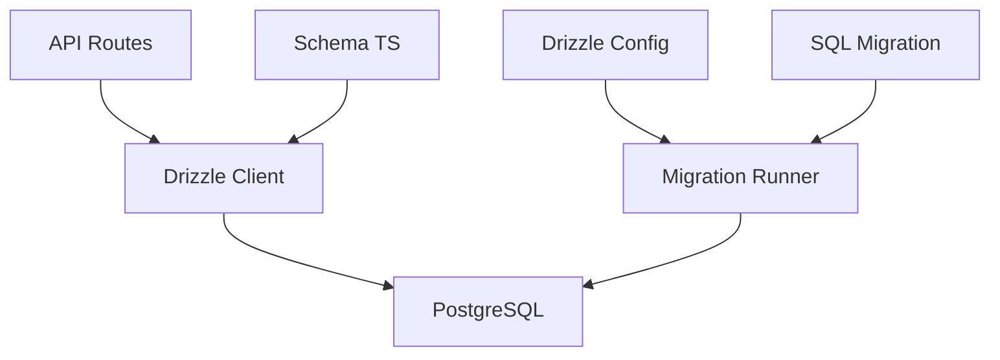
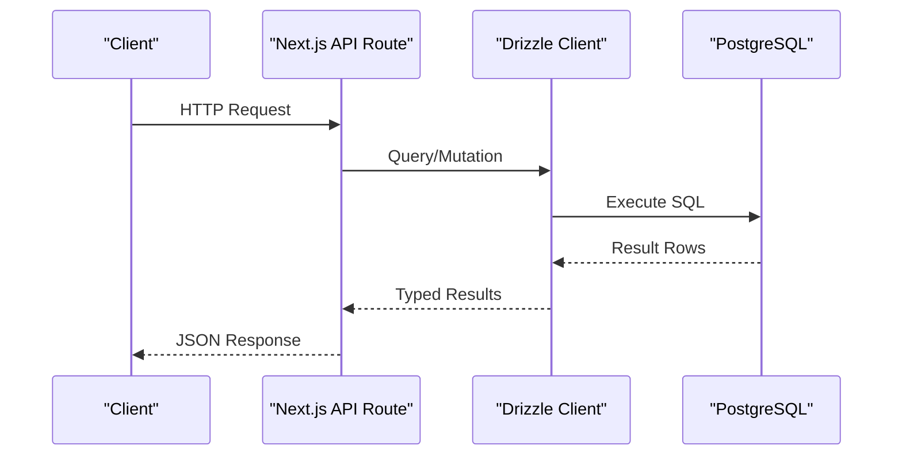
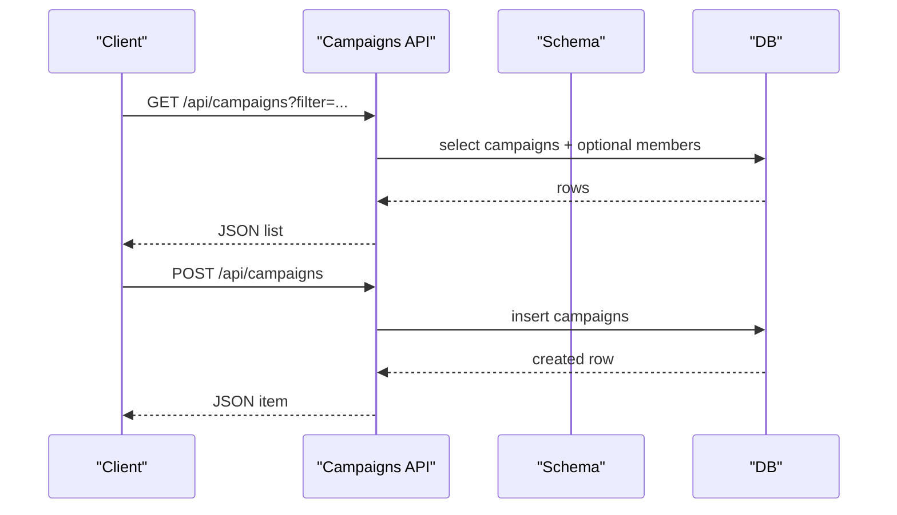
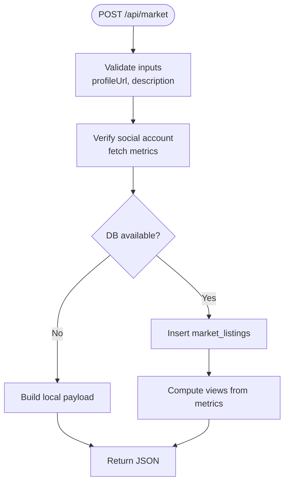
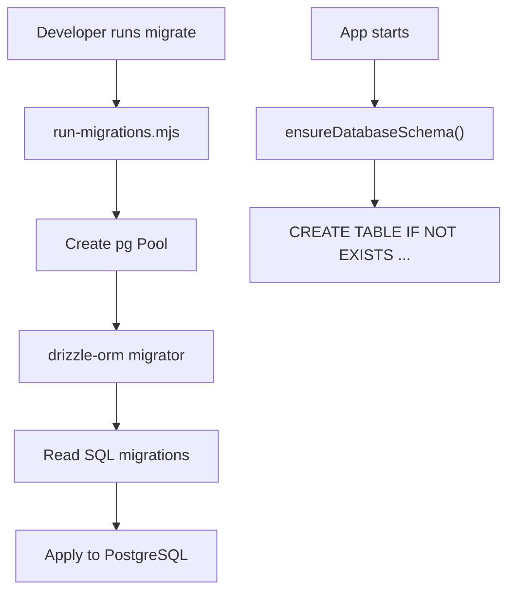
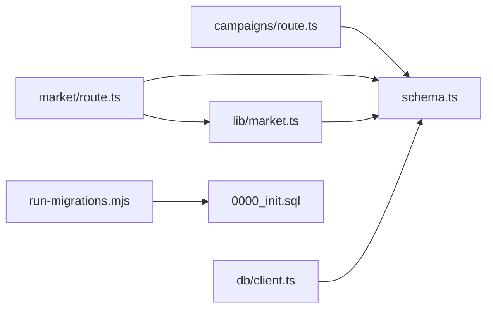

# Database Schema

<cite>
**Referenced Files in This Document**
- [drizzle/0000_init.sql](file://drizzle/0000_init.sql)
- [drizzle/meta/_journal.json](file://drizzle/meta/_journal.json)
- [drizzle.config.ts](file://drizzle.config.ts)
- [src/db/schema.ts](file://src/db/schema.ts)
- [src/db/client.ts](file://src/db/client.ts)
- [src/lib/db.ts](file://src/lib/db.ts)
- [scripts/run-migrations.mjs](file://scripts/run-migrations.mjs)
- [src/app/api/campaigns/route.ts](file://src/app/api/campaigns/route.ts)
- [src/app/api/market/route.ts](file://src/app/api/market/route.ts)
- [src/app/api/negotiations/route.ts](file://src/app/api/negotiations/route.ts)
- [src/app/api/profile/route.ts](file://src/app/api/profile/route.ts)
- [src/lib/market.ts](file://src/lib/market.ts)
- [src/lib/prisma.ts](file://src/lib/prisma.ts)
</cite>

## Table of Contents
1. Introduction
2. Project Structure
3. Core Components
4. Architecture Overview
5. Detailed Component Analysis
6. Dependency Analysis
7. Performance Considerations
8. Troubleshooting Guide
9. Conclusion
10. Appendices

## Introduction
This document provides comprehensive data model documentation for PortVille Market’s PostgreSQL database schema, focusing on campaigns, market listings, negotiations (via engagement events), profiles (as referenced by user IDs), and engagement events. It explains entity relationships, constraints, Drizzle ORM configuration, migration strategy using SQL files, data access patterns, query optimization techniques, performance considerations, lifecycle management, retention policies, backup strategies, security, privacy, and access control mechanisms.

## Project Structure
The database layer is defined with:
- A Drizzle schema definition in TypeScript
- A SQL migration file for initial schema creation
- A runtime client that initializes a connection pool and ensures the schema exists
- API routes that perform reads/writes against the schema
- A migration runner script to apply migrations



**Diagram sources**
- [src/app/api/campaigns/route.ts:1-142](file://src/app/api/campaigns/route.ts#L1-L142)
- [src/app/api/market/route.ts:1-262](file://src/app/api/market/route.ts#L1-L262)
- [src/db/client.ts:1-152](file://src/db/client.ts#L1-L152)
- [scripts/run-migrations.mjs:1-67](file://scripts/run-migrations.mjs#L1-L67)
- [drizzle.config.ts:1-13](file://drizzle.config.ts#L1-L13)
- [drizzle/0000_init.sql:1-82](file://drizzle/0000_init.sql#L1-L82)

**Section sources**
- [drizzle/0000_init.sql:1-82](file://drizzle/0000_init.sql#L1-L82)
- [src/db/schema.ts:1-84](file://src/db/schema.ts#L1-L84)
- [src/db/client.ts:1-152](file://src/db/client.ts#L1-L152)
- [scripts/run-migrations.mjs:1-67](file://scripts/run-migrations.mjs#L1-L67)
- [drizzle.config.ts:1-13](file://drizzle.config.ts#L1-L13)

## Core Components
Entities and their key attributes:
- Campaigns: campaign metadata, budgeting, status, timestamps
- Campaign Members: many-to-many link between users and campaigns
- Vacancies: job-like postings with status and metrics
- Market Listings: social profile offers with pricing and metrics
- Engagement Events: generic audit/event log for actions across entities

Key relationships:
- campaign_members.campaign_id references campaigns.id (ON DELETE CASCADE)
- engagement_events records actor_id and entity_id for cross-entity activity tracking

Constraints and defaults:
- Primary keys are auto-incrementing integers
- Many fields have NOT NULL constraints and sensible defaults
- Timestamps default to current time

Indexes:
- No explicit indexes beyond primary keys are defined in the provided schema or migration files.

Data validation rules:
- Not-null constraints enforced at the database level
- Additional input validation occurs in API routes (e.g., required fields, numeric parsing)

**Section sources**
- [drizzle/0000_init.sql:1-82](file://drizzle/0000_init.sql#L1-L82)
- [src/db/schema.ts:1-84](file://src/db/schema.ts#L1-L84)
- [src/app/api/campaigns/route.ts:1-142](file://src/app/api/campaigns/route.ts#L1-L142)
- [src/app/api/market/route.ts:1-262](file://src/app/api/market/route.ts#L1-L262)

## Architecture Overview
High-level data flow from API to database:
- API routes validate inputs and call Drizzle queries
- Drizzle client uses a pooled PostgreSQL connection
- Migrations ensure schema consistency; runtime fallback ensures tables exist if migrations are not run



**Diagram sources**
- [src/app/api/campaigns/route.ts:46-98](file://src/app/api/campaigns/route.ts#L46-L98)
- [src/app/api/market/route.ts:164-172](file://src/app/api/market/route.ts#L164-L172)
- [src/db/client.ts:45-59](file://src/db/client.ts#L45-L59)

## Detailed Component Analysis

### Entity Relationship Model
```mermaid
erDiagram
CAMPAIGNS {
serial id PK
text title
text description
text category
text niche_hashtag
text created_by
text status
double precision publisher_rating
text publisher_profile_icon
integer community_size
integer views_generated
integer likes_generated
integer total_budget
integer budget_used
integer highest_mcp
integer time_remaining_days
text required_platforms
timestamp start_date
integer min_payout
integer max_payout
integer publish_fee
timestamp created_at
timestamp updated_at
}
CAMPAIGN_MEMBERS {
serial id PK
integer campaign_id FK
text user_id
text status
timestamp joined_at
}
VACANCIES {
serial id PK
text title
text description
text category
text created_by
timestamp created_at
text employer_name
text handle
double precision rating
integer days_remaining
integer required_people
integer applicants
integer accepted
text requirements
integer min_salary
integer max_salary
text status
timestamp status_updated_at
}
MARKET_LISTINGS {
serial id PK
text title
text description
double precision price
text profile_url
text platform
text handle
integer followers
integer likes
double precision engagement_rate
text niche
text created_by
text status
timestamp created_at
}
ENGAGEMENT_EVENTS {
serial id PK
text entity_type
integer entity_id
text actor_id
text action
text message
timestamp created_at
}
CAMPAIGNS ||--o{ CAMPAIGN_MEMBERS : "has members"
```

**Diagram sources**
- [drizzle/0000_init.sql:1-82](file://drizzle/0000_init.sql#L1-L82)
- [src/db/schema.ts:1-84](file://src/db/schema.ts#L1-L84)

### Data Access Patterns

#### Campaigns API
- GET lists active campaigns or filters by creator/joined status; maps rows to response shape
- POST creates a campaign with validated inputs and returns the created item



**Diagram sources**
- [src/app/api/campaigns/route.ts:46-98](file://src/app/api/campaigns/route.ts#L46-L98)
- [src/app/api/campaigns/route.ts:100-142](file://src/app/api/campaigns/route.ts#L100-L142)

**Section sources**
- [src/app/api/campaigns/route.ts:1-142](file://src/app/api/campaigns/route.ts#L1-L142)

#### Market Listings API
- GET returns recent market listings via library function
- POST validates and verifies a social profile URL, then persists listing and computes derived metrics



**Diagram sources**
- [src/app/api/market/route.ts:174-262](file://src/app/api/market/route.ts#L174-L262)
- [src/lib/market.ts:43-49](file://src/lib/market.ts#L43-L49)

**Section sources**
- [src/app/api/market/route.ts:1-262](file://src/app/api/market/route.ts#L1-L262)
- [src/lib/market.ts:1-50](file://src/lib/market.ts#L1-L50)

#### Negotiations and Profiles
- Negotiations endpoint currently returns empty arrays (placeholder)
- Profile endpoint returns a static summary object

**Section sources**
- [src/app/api/negotiations/route.ts:1-13](file://src/app/api/negotiations/route.ts#L1-L13)
- [src/app/api/profile/route.ts:1-13](file://src/app/api/profile/route.ts#L1-L13)

### Drizzle ORM Configuration and Migration Strategy
- Drizzle config points to the TypeScript schema and outputs migrations into drizzle/
- The initial migration SQL defines all tables and constraints
- A migration runner script applies migrations using the configured folder and environment variables
- At runtime, the client ensures the schema exists by running CREATE TABLE IF NOT EXISTS statements if needed



**Diagram sources**
- [drizzle.config.ts:1-13](file://drizzle.config.ts#L1-L13)
- [scripts/run-migrations.mjs:1-67](file://scripts/run-migrations.mjs#L1-L67)
- [drizzle/0000_init.sql:1-82](file://drizzle/0000_init.sql#L1-L82)
- [src/db/client.ts:61-149](file://src/db/client.ts#L61-L149)

**Section sources**
- [drizzle.config.ts:1-13](file://drizzle.config.ts#L1-L13)
- [scripts/run-migrations.mjs:1-67](file://scripts/run-migrations.mjs#L1-L67)
- [drizzle/0000_init.sql:1-82](file://drizzle/0000_init.sql#L1-L82)
- [src/db/client.ts:1-152](file://src/db/client.ts#L1-L152)

## Dependency Analysis
- API routes depend on Drizzle schema definitions and the shared db client
- Market listing creation depends on external social media verification logic and optional persistence
- Engagement events are used indirectly via utility functions for querying activity



**Diagram sources**
- [src/app/api/campaigns/route.ts:1-142](file://src/app/api/campaigns/route.ts#L1-L142)
- [src/app/api/market/route.ts:1-262](file://src/app/api/market/route.ts#L1-L262)
- [src/lib/market.ts:1-50](file://src/lib/market.ts#L1-L50)
- [src/db/client.ts:1-152](file://src/db/client.ts#L1-L152)
- [scripts/run-migrations.mjs:1-67](file://scripts/run-migrations.mjs#L1-L67)
- [drizzle/0000_init.sql:1-82](file://drizzle/0000_init.sql#L1-L82)

**Section sources**
- [src/lib/prisma.ts:76-113](file://src/lib/prisma.ts#L76-L113)

## Performance Considerations
- Connection pooling: The client configures a pool with a maximum size and idle timeout to manage concurrent requests efficiently
- Query limits: Listing endpoints use LIMIT to cap result sets (e.g., top 12 market listings, up to 50 campaigns)
- Indexing: No additional indexes are defined beyond primary keys; consider adding indexes on frequently filtered columns such as campaigns.status, campaigns.created_by, market_listings.status, and engagement_events.entity_type/entity_id/action for read-heavy workloads
- Computed metrics: Views and engagement rates are computed server-side; caching results can reduce repeated calculations
- External calls: Social profile verification performs network requests; implement timeouts and retries to avoid blocking

[No sources needed since this section provides general guidance]

## Troubleshooting Guide
Common issues and mitigations:
- Missing DATABASE_URL: Both the migration runner and runtime client require DATABASE_URL; without it, migrations skip in development or throw an error at runtime
- Network errors during migrations: The migration script detects unreachable databases and exits gracefully in development mode
- Schema drift: If migrations are not applied, the runtime ensureDatabaseSchema function attempts to create tables; however, prefer applying migrations for consistency
- Input validation failures: API routes return 400 errors when required fields are missing or invalid

**Section sources**
- [scripts/run-migrations.mjs:28-38](file://scripts/run-migrations.mjs#L28-L38)
- [scripts/run-migrations.mjs:47-66](file://scripts/run-migrations.mjs#L47-L66)
- [src/db/client.ts:34-39](file://src/db/client.ts#L34-L39)
- [src/app/api/campaigns/route.ts:113-115](file://src/app/api/campaigns/route.ts#L113-L115)
- [src/app/api/market/route.ts:185-191](file://src/app/api/market/route.ts#L185-L191)

## Conclusion
PortVille Market’s database schema centers around campaigns, campaign membership, vacancies, market listings, and engagement events. The system uses Drizzle ORM for type-safe queries and SQL migrations for schema evolution. While no extra indexes are defined beyond primary keys, strategic indexing and caching can significantly improve performance. Security and privacy should be strengthened with authentication, authorization, and encryption where appropriate. Operational robustness relies on proper environment configuration, migration execution, and graceful handling of database unavailability.

## Appendices

### Data Lifecycle Management, Retention Policies, and Backup Strategies
- Lifecycle:
  - Campaigns and listings are created with default statuses and timestamps; statuses evolve over time based on business processes
  - Engagement events append-only logs of actions; consider archiving old events periodically
- Retention:
  - Implement scheduled jobs to archive or purge stale engagement events and inactive listings per policy
  - Maintain soft deletes for critical entities if compliance requires historical preservation
- Backups:
  - Use managed database backups or automated snapshots
  - Test restore procedures regularly
  - Encrypt backups at rest and in transit

[No sources needed since this section provides general guidance]

### Security, Privacy, and Access Control
- Authentication and Authorization:
  - Enforce user identity via headers or tokens; validate x-user-id usage in APIs
  - Implement role-based access control to restrict sensitive operations
- Data Protection:
  - Encrypt sensitive fields at rest and in transit
  - Sanitize and validate all inputs to prevent injection attacks
- Privacy:
  - Minimize collection of personal data
  - Provide mechanisms for users to view, update, or delete their data
- Auditability:
  - Leverage engagement events to record critical actions for auditing

[No sources needed since this section provides general guidance]