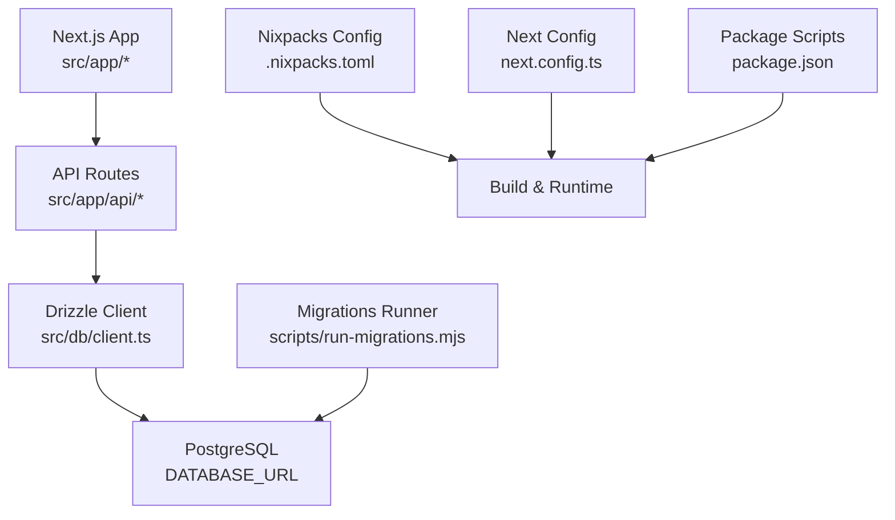
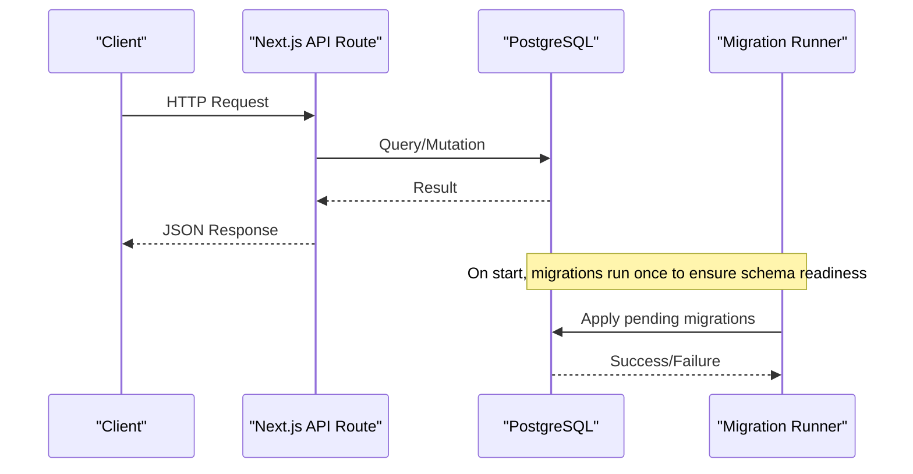
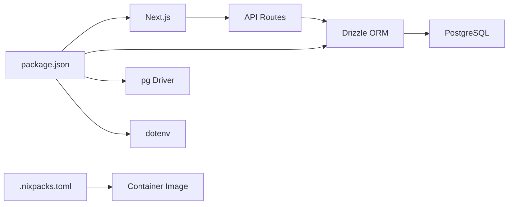

# Deployment & Operations

<cite>
**Referenced Files in This Document**
- [package.json](file://package.json)
- [next.config.ts](file://next.config.ts)
- [.nixpacks.toml](file://.nixpacks.toml)
- [drizzle.config.ts](file://drizzle.config.ts)
- [local.env](file://local.env)
- [scripts/run-migrations.mjs](file://scripts/run-migrations.mjs)
- [src/db/schema.ts](file://src/db/schema.ts)
- [src/db/client.ts](file://src/db/client.ts)
- [drizzle/0000_init.sql](file://drizzle/0000_init.sql)
- [README.md](file://README.md)
- [src/app/api/campaigns/route.ts](file://src/app/api/campaigns/route.ts)
- [src/app/api/secure/route.ts](file://src/app/api/secure/route.ts)
</cite>

## Table of Contents
1. [Introduction](#introduction)
2. [Project Structure](#project-structure)
3. [Core Components](#core-components)
4. [Architecture Overview](#architecture-overview)
5. [Detailed Component Analysis](#detailed-component-analysis)
6. [Dependency Analysis](#dependency-analysis)
7. [Performance Considerations](#performance-considerations)
8. [Troubleshooting Guide](#troubleshooting-guide)
9. [Conclusion](#conclusion)
10. [Appendices](#appendices)

## Introduction
This document provides deployment and operations guidance for PortVille Market, a Next.js application backed by PostgreSQL via Drizzle ORM. It covers build configuration with Nixpacks, production optimizations, environment variable management, deployment strategies (Vercel, Docker, traditional hosting), database migrations, backups and disaster recovery, monitoring and logging, performance metrics, alerting, scaling and load balancing, capacity planning, security hardening, SSL configuration, compliance considerations, and operational runbooks for maintenance and incident response.

## Project Structure
The project is a Next.js App Router application using Node.js runtime serverless functions for API routes. Data persistence uses PostgreSQL through Drizzle ORM. Migrations are managed via Drizzle migrations stored under drizzle/. Build and runtime scripts execute migrations before starting the app. Environment variables are loaded from process.env, with local development support via a local.env file.



**Diagram sources**
- [package.json:9-13](file://package.json#L9-L13)
- [next.config.ts:3-5](file://next.config.ts#L3-L5)
- [.nixpacks.toml:1-2](file://.nixpacks.toml#L1-L2)
- [scripts/run-migrations.mjs:44-49](file://scripts/run-migrations.mjs#L44-L49)
- [src/db/client.ts:45-59](file://src/db/client.ts#L45-L59)

**Section sources**
- [package.json:1-45](file://package.json#L1-L45)
- [next.config.ts:1-7](file://next.config.ts#L1-L7)
- [.nixpacks.toml:1-2](file://.nixpacks.toml#L1-L2)
- [scripts/run-migrations.mjs:1-67](file://scripts/run-migrations.mjs#L1-L67)
- [src/db/client.ts:1-152](file://src/db/client.ts#L1-L152)

## Core Components
- Build and runtime:
  - Nixpacks config specifies Node.js 20 and npm toolchain for consistent builds.
  - Next.js configuration sets allowed dev origins.
  - Package scripts run migrations before dev/build/start to ensure schema readiness.
- Database layer:
  - Drizzle ORM client initializes a connection pool and ensures schema on startup.
  - Drizzle migrations defined in SQL files under drizzle/.
  - Schema definitions in TypeScript drive type safety and migration generation.
- API routes:
  - Server-side API endpoints use Next.js runtime nodejs and dynamic rendering.
  - Endpoints interact with Drizzle client to read/write data.

**Section sources**
- [.nixpacks.toml:1-2](file://.nixpacks.toml#L1-L2)
- [next.config.ts:3-5](file://next.config.ts#L3-L5)
- [package.json:9-13](file://package.json#L9-L13)
- [src/db/schema.ts:1-84](file://src/db/schema.ts#L1-L84)
- [src/db/client.ts:1-152](file://src/db/client.ts#L1-L152)
- [src/app/api/campaigns/route.ts:1-142](file://src/app/api/campaigns/route.ts#L1-L142)
- [src/app/api/secure/route.ts:1-535](file://src/app/api/secure/route.ts#L1-L535)

## Architecture Overview
PortVille Market runs as a Next.js application with Node.js runtime API routes. On start, it executes database migrations and initializes the Drizzle client with a connection pool to PostgreSQL. API routes handle business logic and persist data via Drizzle ORM. The build pipeline uses Nixpacks to produce a container image suitable for deployment across platforms.



**Diagram sources**
- [src/app/api/campaigns/route.ts:46-98](file://src/app/api/campaigns/route.ts#L46-L98)
- [src/app/api/secure/route.ts:111-152](file://src/app/api/secure/route.ts#L111-L152)
- [scripts/run-migrations.mjs:44-49](file://scripts/run-migrations.mjs#L44-L49)

## Detailed Component Analysis

### Build Configuration and Production Optimizations
- Nixpacks:
  - Uses Node.js 20 and npm toolchain for reproducible builds.
  - Suitable for containerized deployments on any platform that supports Nixpacks.
- Next.js:
  - Minimal configuration; allows localhost dev origin.
  - API routes set runtime to nodejs and dynamic rendering for server-side execution.
- Scripts:
  - Dev, build, and start scripts run migrations first to ensure schema consistency.

Recommendations:
- Pin exact versions in package.json engines to enforce environment parity.
- Add Next.js output settings for static assets caching and compression if needed.
- Configure health check endpoints to support container orchestration.

**Section sources**
- [.nixpacks.toml:1-2](file://.nixpacks.toml#L1-L2)
- [next.config.ts:3-5](file://next.config.ts#L3-L5)
- [package.json:9-13](file://package.json#L9-L13)
- [src/app/api/campaigns/route.ts:7-8](file://src/app/api/campaigns/route.ts#L7-L8)
- [src/app/api/secure/route.ts:7-8](file://src/app/api/secure/route.ts#L7-L8)

### Environment Variable Management
- Required variables:
  - DATABASE_URL: PostgreSQL connection string used by Drizzle client and migration runner.
- Local development:
  - local.env is auto-loaded when present and DATABASE_URL is not already set.
- Production:
  - Provide DATABASE_URL via platform secrets or environment configuration.
  - Ensure secrets are injected at runtime and never committed to source control.

Operational notes:
- Validate DATABASE_URL presence at startup; client throws if missing.
- Migration runner exits with error if DATABASE_URL is missing in non-development environments.

**Section sources**
- [local.env:1-2](file://local.env#L1-L2)
- [src/db/client.ts:10-38](file://src/db/client.ts#L10-L38)
- [scripts/run-migrations.mjs:8-38](file://scripts/run-migrations.mjs#L8-L38)

### Database Migration Procedures
- Drizzle migrations:
  - SQL migrations stored under drizzle/, applied via migration runner script.
  - Schema definitions in src/db/schema.ts provide types and structure.
- Execution:
  - Run migrations automatically before dev/build/start via package scripts.
  - Migration runner loads local.env if DATABASE_URL is not set and handles network errors gracefully in development.

Procedure:
- Ensure DATABASE_URL points to target database.
- Run build or start to apply migrations automatically.
- For manual migration runs, execute the migration script directly with proper environment.

Rollback strategy:
- Maintain versioned migrations and test rollbacks in staging.
- Use database snapshots prior to applying migrations in production.

**Section sources**
- [drizzle/0000_init.sql:1-82](file://drizzle/0000_init.sql#L1-L82)
- [src/db/schema.ts:1-84](file://src/db/schema.ts#L1-L84)
- [scripts/run-migrations.mjs:40-66](file://scripts/run-migrations.mjs#L40-L66)
- [package.json:9-13](file://package.json#L9-L13)

### Backup Strategies and Disaster Recovery Planning
- Backups:
  - Schedule regular logical backups of PostgreSQL (e.g., pg_dump) for all tables referenced in schema.
  - Store backups offsite with encryption and retention policies aligned to compliance requirements.
- Recovery:
  - Test restore procedures regularly in isolated environments.
  - Define RTO/RPO targets and validate against backup frequency and storage durability.
- Operational safeguards:
  - Pre-migration snapshots to enable quick rollback.
  - Monitor replication lag and failover processes if using managed databases.

[No sources needed since this section provides general guidance]

### Monitoring and Logging Approaches
- Application logs:
  - API routes log errors to console; integrate with centralized logging (e.g., cloud provider logs).
- Metrics:
  - Collect request latency, error rates, and throughput from platform metrics.
  - Track database query performance and connection pool utilization.
- Alerting:
  - Set alerts for high error rates, slow responses, and database connectivity issues.
  - Monitor migration failures and schema drift.

Implementation tips:
- Add structured logging with correlation IDs for request tracing.
- Instrument API routes with timing and status codes for dashboards.

[No sources needed since this section provides general guidance]

### Scaling Considerations, Load Balancing, and Capacity Planning
- Horizontal scaling:
  - Deploy multiple instances behind a load balancer; stateless API routes scale horizontally.
- Database scaling:
  - Use managed PostgreSQL with read replicas for read-heavy workloads.
  - Tune connection pool size based on instance count and database limits.
- Capacity planning:
  - Estimate peak concurrent users and requests per second.
  - Size compute resources and database tiers accordingly; monitor resource usage trends.

[No sources needed since this section provides general guidance]

### Security Hardening, SSL Configuration, and Compliance
- Secrets management:
  - Store DATABASE_URL and other secrets in platform secret stores; never commit to repository.
- Transport security:
  - Enforce HTTPS via platform TLS termination or reverse proxy.
- Input validation:
  - API routes perform basic validation; add stricter checks and sanitization where appropriate.
- Access control:
  - Implement authentication and authorization beyond demo headers; validate user identity and roles.
- Compliance:
  - Follow data protection regulations; encrypt sensitive data at rest and in transit.
  - Audit access to databases and maintain logs for accountability.

[No sources needed since this section provides general guidance]

### Operational Runbooks

#### Routine Maintenance
- Verify environment variables:
  - Ensure DATABASE_URL is configured and valid.
- Apply migrations:
  - Confirm migrations run successfully on deploy; review logs for errors.
- Health checks:
  - Implement a /health endpoint returning service status and database connectivity.
- Dependency updates:
  - Regularly update dependencies and test compatibility.

**Section sources**
- [scripts/run-migrations.mjs:28-38](file://scripts/run-migrations.mjs#L28-L38)
- [src/db/client.ts:34-38](file://src/db/client.ts#L34-L38)

#### Incident Response
- Database connectivity failure:
  - Check DATABASE_URL and network reachability; verify firewall rules and credentials.
  - Review migration runner logs for connection errors.
- High error rate:
  - Inspect API route logs for stack traces; identify failing endpoints.
  - Roll back recent changes if necessary; restore from known good state.
- Performance degradation:
  - Analyze database query performance; consider indexing or query optimization.
  - Scale out instances and tune connection pool parameters.

**Section sources**
- [scripts/run-migrations.mjs:50-63](file://scripts/run-migrations.mjs#L50-L63)
- [src/app/api/campaigns/route.ts:94-97](file://src/app/api/campaigns/route.ts#L94-L97)
- [src/app/api/secure/route.ts:148-151](file://src/app/api/secure/route.ts#L148-L151)

## Dependency Analysis
Key runtime dependencies:
- Next.js and React for application framework and UI.
- Drizzle ORM and PostgreSQL driver for data access.
- dotenv for environment loading during development.

Build-time dependencies:
- Nixpacks for containerization and build reproducibility.
- ESLint and Tailwind for code quality and styling.



**Diagram sources**
- [package.json:15-33](file://package.json#L15-L33)
- [.nixpacks.toml:1-2](file://.nixpacks.toml#L1-L2)
- [src/app/api/campaigns/route.ts:1-10](file://src/app/api/campaigns/route.ts#L1-L10)
- [src/db/client.ts:1-10](file://src/db/client.ts#L1-L10)

**Section sources**
- [package.json:15-43](file://package.json#L15-L43)
- [.nixpacks.toml:1-2](file://.nixpacks.toml#L1-L2)

## Performance Considerations
- Connection pooling:
  - Drizzle client uses a pooled connection; tune max connections based on workload and database limits.
- Query efficiency:
  - Use selective queries and indexes on frequently filtered columns (e.g., created_by, status).
- Caching:
  - Leverage Next.js caching strategies and CDN for static assets.
- Resource limits:
  - Set memory and CPU limits for containers; monitor usage and adjust accordingly.

[No sources needed since this section provides general guidance]

## Troubleshooting Guide
Common issues:
- Missing DATABASE_URL:
  - Client throws an error; ensure environment variable is set in deployment.
- Network errors during migrations:
  - Migration runner detects unreachable databases and skips in development; in production, fix connectivity and retry.
- API errors:
  - API routes return JSON errors; inspect logs for stack traces and context.

Steps:
- Validate environment variables and secrets injection.
- Check database connectivity and credentials.
- Review migration logs and schema alignment.

**Section sources**
- [src/db/client.ts:34-38](file://src/db/client.ts#L34-L38)
- [scripts/run-migrations.mjs:50-63](file://scripts/run-migrations.mjs#L50-L63)
- [src/app/api/campaigns/route.ts:94-97](file://src/app/api/campaigns/route.ts#L94-L97)
- [src/app/api/secure/route.ts:148-151](file://src/app/api/secure/route.ts#L148-L151)

## Conclusion
PortVille Market is built with Next.js and Drizzle ORM, using Nixpacks for consistent builds and PostgreSQL for persistence. Operations should focus on secure environment management, reliable migrations, robust backups, comprehensive monitoring, and scalable deployment patterns. Following the runbooks and guidelines in this document will help maintain stability, performance, and security across environments.

[No sources needed since this section summarizes without analyzing specific files]

## Appendices

### Deployment Strategies

#### Vercel
- Connect repository and configure DATABASE_URL in environment variables.
- Vercel will build using Next.js; ensure migrations run on deploy via custom scripts or prebuild steps.
- Use platform features for domain, SSL, and edge caching.

[No sources needed since this section provides general guidance]

#### Docker Containers
- Use Nixpacks to generate a container image with Node.js 20.
- Inject DATABASE_URL at runtime via container orchestration secrets.
- Run migrations before starting the app; ensure health checks probe the service.

**Section sources**
- [.nixpacks.toml:1-2](file://.nixpacks.toml#L1-L2)
- [package.json:9-13](file://package.json#L9-L13)

#### Traditional Hosting
- Provision a server with Node.js 20 and PostgreSQL.
- Install dependencies, set DATABASE_URL, and run migrations before starting the app.
- Place a reverse proxy (e.g., Nginx) in front for SSL termination and routing.

[No sources needed since this section provides general guidance]

### Database Schema Overview
```mermaid
erDiagram
CAMPAIGNS {
int id PK
text title
text description
text category
text niche_hashtag
text created_by
text status
double precision publisher_rating
text publisher_profile_icon
int community_size
int views_generated
int likes_generated
int total_budget
int budget_used
int highest_mcp
int time_remaining_days
text required_platforms
timestamp start_date
int min_payout
int max_payout
int publish_fee
timestamp created_at
timestamp updated_at
}
CAMPAIGN_MEMBERS {
int id PK
int campaign_id FK
text user_id
text status
timestamp joined_at
}
VACANCIES {
int id PK
text title
text description
text category
text created_by
timestamp created_at
text employer_name
text handle
double precision rating
int days_remaining
int required_people
int applicants
int accepted
text requirements
int min_salary
int max_salary
text status
timestamp status_updated_at
}
MARKET_LISTINGS {
int id PK
text title
text description
double precision price
text profile_url
text platform
text handle
int followers
int likes
double precision engagement_rate
text niche
text created_by
text status
timestamp created_at
}
ENGAGEMENT_EVENTS {
int id PK
text entity_type
int entity_id
text actor_id
text action
text message
timestamp created_at
}
CAMPAIGNS ||--o{ CAMPAIGN_MEMBERS : "has members"
```

**Diagram sources**
- [src/db/schema.ts:3-84](file://src/db/schema.ts#L3-L84)