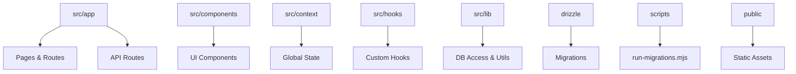
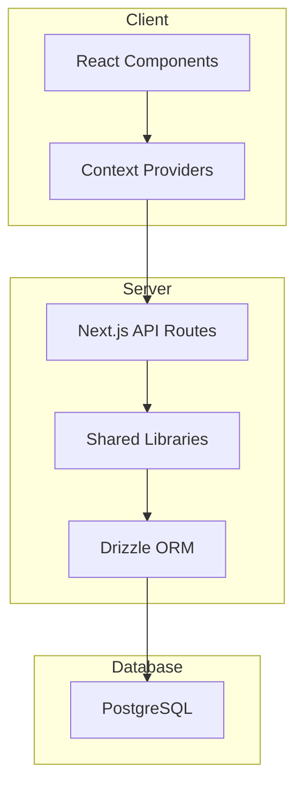
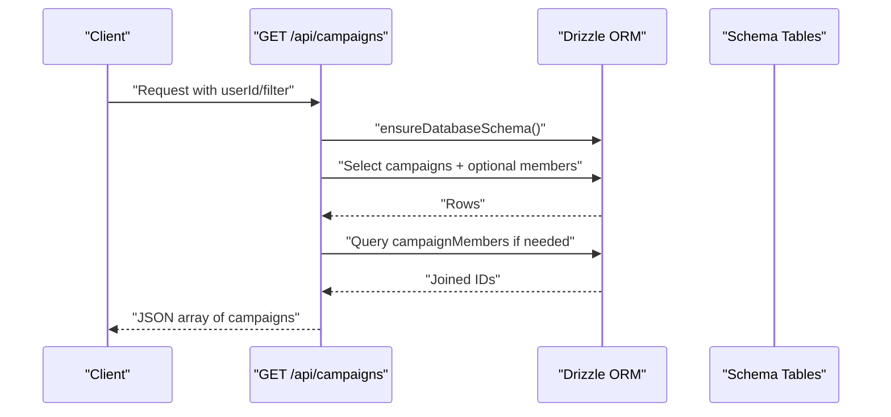
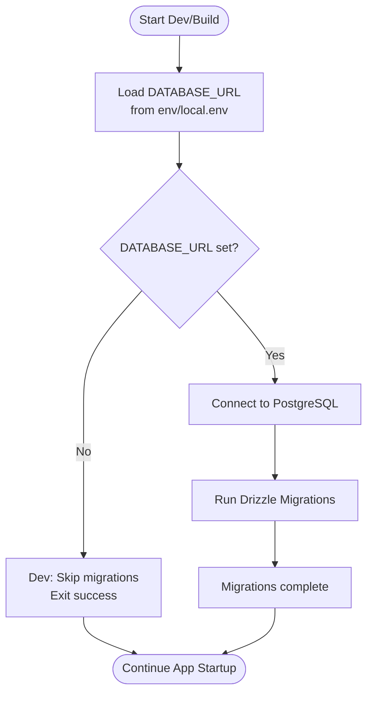
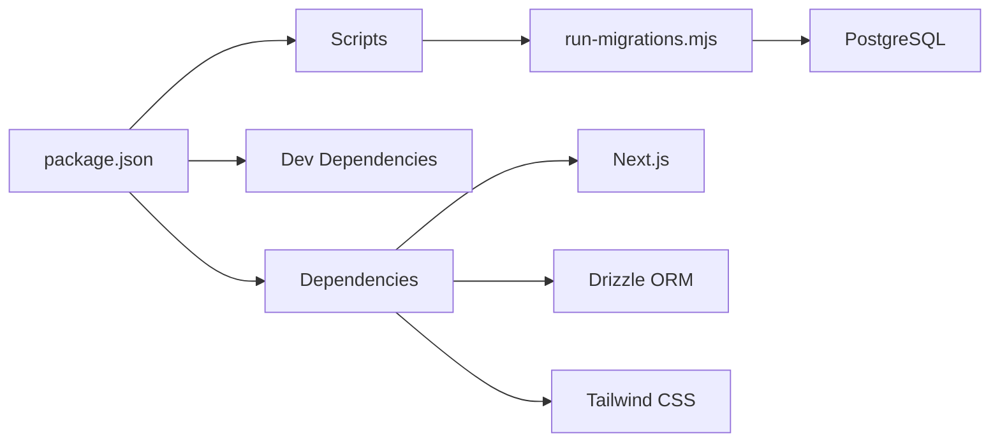

# Development Guide

<cite>
**Referenced Files in This Document**
- [package.json](file://package.json)
- [tsconfig.json](file://tsconfig.json)
- [eslint.config.mjs](file://eslint.config.mjs)
- [postcss.config.mjs](file://postcss.config.mjs)
- [next.config.ts](file://next.config.ts)
- [drizzle.config.ts](file://drizzle.config.ts)
- [src/db/schema.ts](file://src/db/schema.ts)
- [src/lib/db.ts](file://src/lib/db.ts)
- [scripts/run-migrations.mjs](file://scripts/run-migrations.mjs)
- [local.env](file://local.env)
- [src/app/layout.tsx](file://src/app/layout.tsx)
- [src/app/page.tsx](file://src/app/page.tsx)
- [src/components/layout/Navbar.tsx](file://src/components/layout/Navbar.tsx)
- [src/app/api/campaigns/route.ts](file://src/app/api/campaigns/route.ts)
- [README.md](file://README.md)
</cite>

## Table of Contents
1. Introduction
2. Project Structure
3. Core Components
4. Architecture Overview
5. Detailed Component Analysis
6. Dependency Analysis
7. Performance Considerations
8. Troubleshooting Guide
9. Conclusion
10. Appendices

## Introduction
This development guide is for contributors to PortVille Market. It explains the project’s coding standards, ESLint configuration, TypeScript compiler settings, and PostCSS processing pipeline. It also documents conventions for file organization, component structure, adding features, testing, code quality, Git workflow, debugging, performance profiling, and best practices for components, APIs, and database operations.

## Project Structure
PortVille Market is a Next.js application using the App Router. The key directories and files are:
- src/app: Route segments and pages (Next.js App Router). Each folder under src/app maps to a URL path.
- src/components: Reusable UI components grouped by feature or shared utilities.
- src/context: React contexts for global state (e.g., notifications, negotiations).
- src/hooks: Custom React hooks encapsulating logic.
- src/lib: Shared server-side and client-side libraries (database access, utilities).
- src/types: Shared TypeScript types used across the app.
- drizzle: Database migrations generated by Drizzle Kit.
- scripts: Utility scripts executed during dev/build/start (e.g., running migrations).
- public: Static assets served as-is.

**Section sources**
- [src/app/layout.tsx:1-43](file://src/app/layout.tsx#L1-L43)
- [src/app/page.tsx:1-14](file://src/app/page.tsx#L1-L14)
- [src/components/layout/Navbar.tsx:1-170](file://src/components/layout/Navbar.tsx#L1-L170)
- [scripts/run-migrations.mjs:1-67](file://scripts/run-migrations.mjs#L1-L67)

## Core Components
- Root layout and providers: The root layout composes global providers (notifications, negotiation), sets metadata, and includes persistent Navbar and Footer.
- Navigation: The Navbar provides top-level navigation and badges for orders/offers, with responsive mobile menu behavior.
- API routes: Serverless-style route handlers implement CRUD endpoints (example: campaigns). They validate inputs, query/update the database via Drizzle ORM, and return JSON responses.
- Database schema: Centralized Drizzle schema defines tables for campaigns, campaign members, vacancies, market listings, and engagement events.

Key responsibilities:
- Layout: Global styling, providers, and page shell.
- Components: Feature-specific UI building blocks.
- API routes: Request handling, validation, DB operations, error responses.
- Schema: Single source of truth for data models.

**Section sources**
- [src/app/layout.tsx:1-43](file://src/app/layout.tsx#L1-L43)
- [src/components/layout/Navbar.tsx:1-170](file://src/components/layout/Navbar.tsx#L1-L170)
- [src/app/api/campaigns/route.ts:1-142](file://src/app/api/campaigns/route.ts#L1-L142)
- [src/db/schema.ts:1-84](file://src/db/schema.ts#L1-L84)

## Architecture Overview
The application follows a layered architecture:
- Presentation layer: Next.js pages and components render UI.
- Business logic: Library modules and hooks encapsulate domain rules.
- Data layer: Drizzle ORM interacts with PostgreSQL; migrations ensure schema consistency.
- API surface: Route handlers expose REST-like endpoints.

**Diagram sources**
- [src/app/layout.tsx:1-43](file://src/app/layout.tsx#L1-L43)
- [src/app/api/campaigns/route.ts:1-142](file://src/app/api/campaigns/route.ts#L1-L142)
- [src/lib/db.ts:1-5](file://src/lib/db.ts#L1-L5)
- [src/db/schema.ts:1-84](file://src/db/schema.ts#L1-L84)

## Detailed Component Analysis

### API Route: Campaigns
The campaigns API demonstrates request validation, filtering, and database interaction.

- Input handling: Extracts userId and filter from headers/query params with safe defaults.
- Querying: Uses Drizzle to select campaigns ordered by creation date with limits.
- Filtering: Supports created/joined filters; otherwise returns active campaigns.
- Mapping: Converts rows to a stable client-facing shape.
- Error handling: Logs errors and returns empty arrays or error objects with appropriate status codes.

**Diagram sources**
- [src/app/api/campaigns/route.ts:1-142](file://src/app/api/campaigns/route.ts#L1-L142)
- [src/lib/db.ts:1-5](file://src/lib/db.ts#L1-L5)
- [src/db/schema.ts:1-84](file://src/db/schema.ts#L1-L84)

**Section sources**
- [src/app/api/campaigns/route.ts:1-142](file://src/app/api/campaigns/route.ts#L1-L142)

### Database Schema and Migrations
- Schema: Centralized definitions for core entities (campaigns, campaign_members, vacancies, market_listings, engagement_events).
- Migrations: Drizzle Kit generates SQL migrations stored under drizzle/. A script runs migrations at startup, loading environment variables from local.env when present.

**Diagram sources**
- [scripts/run-migrations.mjs:1-67](file://scripts/run-migrations.mjs#L1-L67)
- [local.env:1-2](file://local.env#L1-L2)
- [drizzle.config.ts:1-13](file://drizzle.config.ts#L1-L13)

**Section sources**
- [src/db/schema.ts:1-84](file://src/db/schema.ts#L1-L84)
- [scripts/run-migrations.mjs:1-67](file://scripts/run-migrations.mjs#L1-L67)
- [drizzle.config.ts:1-13](file://drizzle.config.ts#L1-L13)
- [local.env:1-2](file://local.env#L1-L2)

### Root Layout and Providers
- Metadata: Sets title and description for SEO.
- Providers: Wraps children with NotificationProvider and NegotiationProvider to enable global state.
- Layout: Includes Navbar and Footer, applies base styles and theme tokens.

**Section sources**
- [src/app/layout.tsx:1-43](file://src/app/layout.tsx#L1-L43)

### Navigation Component
- Provides links to Discover, Campaign, Market, Office.
- Shows notification and cart badges with visibility logic based on counts and seen state.
- Responsive menu toggles with click-outside-to-close behavior.

**Section sources**
- [src/components/layout/Navbar.tsx:1-170](file://src/components/layout/Navbar.tsx#L1-L170)

## Dependency Analysis
- Runtime dependencies include Next.js, React, Drizzle ORM, PostgreSQL driver, and Tailwind CSS ecosystem packages.
- Dev dependencies include ESLint with Next.js configs, TypeScript, and Tailwind tooling.
- Scripts orchestrate migration execution before dev/build/start.

**Diagram sources**
- [package.json:1-45](file://package.json#L1-L45)
- [scripts/run-migrations.mjs:1-67](file://scripts/run-migrations.mjs#L1-L67)

**Section sources**
- [package.json:1-45](file://package.json#L1-L45)

## Performance Considerations
- Use Next.js built-in optimizations (static generation where possible, dynamic only when necessary).
- Keep API routes minimal and efficient; paginate large datasets and limit results.
- Prefer client-side state for ephemeral UI concerns; persist important state via context or server.
- Profile rendering with React DevTools and Next.js Profiler; identify unnecessary re-renders.
- Optimize images and assets; leverage caching headers for static resources.
- Monitor database queries; add indexes where appropriate and avoid N+1 queries.

[No sources needed since this section provides general guidance]

## Troubleshooting Guide
Common issues and resolutions:
- Missing DATABASE_URL: Ensure environment variable is set or local.env contains it. In development without DB, migrations are skipped gracefully.
- Migration failures: Check network connectivity and credentials; review logs for specific errors.
- ESLint warnings/errors: Run linting locally; fix reported issues before committing.
- Build errors: Verify Node version matches engines requirement; clear .next cache if needed.
- API errors: Validate request payloads; check server logs for stack traces; ensure DB schema is up to date.

**Section sources**
- [scripts/run-migrations.mjs:1-67](file://scripts/run-migrations.mjs#L1-L67)
- [package.json:1-45](file://package.json#L1-L45)
- [eslint.config.mjs:1-19](file://eslint.config.mjs#L1-L19)

## Conclusion
PortVille Market uses a modern Next.js stack with strict TypeScript, robust linting, and a clear separation between UI, business logic, and data layers. By following the conventions and guidelines in this document, contributors can maintain high code quality, scale features effectively, and collaborate efficiently.

[No sources needed since this section summarizes without analyzing specific files]

## Appendices

### Coding Standards
- Enforce strict TypeScript: Enabled globally for type safety.
- Use ESLint with Next.js configs: Ensures consistent style and catches common mistakes.
- Prefer functional components and hooks; keep components small and focused.
- Use descriptive naming for functions, variables, and files; align with feature-based folders.
- Avoid inline styles; use Tailwind classes for styling.

**Section sources**
- [tsconfig.json:1-35](file://tsconfig.json#L1-L35)
- [eslint.config.mjs:1-19](file://eslint.config.mjs#L1-L19)

### ESLint Configuration
- Extends Next.js core web vitals and TypeScript rules.
- Overrides default ignores to include build artifacts and generated types.

**Section sources**
- [eslint.config.mjs:1-19](file://eslint.config.mjs#L1-L19)

### TypeScript Compiler Settings
- Target ES2017 with DOM and modern libs.
- Strict mode enabled; module resolution set to bundler; JSX configured for React.
- Path aliases map @/* to src/* for clean imports.

**Section sources**
- [tsconfig.json:1-35](file://tsconfig.json#L1-L35)

### PostCSS Processing Pipeline
- Uses Tailwind CSS via PostCSS plugin.
- Integrates seamlessly with Next.js for CSS processing.

**Section sources**
- [postcss.config.mjs:1-8](file://postcss.config.mjs#L1-L8)

### Next.js Configuration
- Configures allowed dev origins for local development.

**Section sources**
- [next.config.ts:1-7](file://next.config.ts#L1-L7)

### Database Operations Best Practices
- Centralize schema in src/db/schema.ts; generate migrations with Drizzle Kit.
- Use server-only imports for DB access in API routes.
- Validate and sanitize all inputs before writing to the database.
- Handle errors gracefully and return meaningful status codes.

**Section sources**
- [src/db/schema.ts:1-84](file://src/db/schema.ts#L1-L84)
- [src/lib/db.ts:1-5](file://src/lib/db.ts#L1-L5)
- [src/app/api/campaigns/route.ts:1-142](file://src/app/api/campaigns/route.ts#L1-L142)

### Adding New Features
- Create new route segments under src/app for pages or API endpoints.
- Add components under src/components organized by feature.
- Define types in src/types or feature-specific type files.
- Update schema and run migrations if data model changes.
- Write tests for critical logic and API routes.

[No sources needed since this section provides general guidance]

### Writing Tests
- Use a test runner compatible with Next.js and TypeScript.
- Mock external dependencies (database, network calls).
- Cover happy paths, edge cases, and error scenarios.
- Aim for meaningful assertions on outputs and side effects.

[No sources needed since this section provides general guidance]

### Git Workflow and Contribution Process
- Branching strategy: Use feature branches per task; merge into main after review.
- Commit messages: Clear and descriptive; reference issue numbers when applicable.
- Pull requests: Include description, screenshots (if UI changes), and test coverage notes.
- Code review: Address feedback; ensure CI passes; obtain approvals before merging.

[No sources needed since this section provides general guidance]

### Debugging Techniques
- Use browser DevTools for frontend debugging; inspect network requests and state.
- Enable verbose logging in API routes; capture request/response details.
- Leverage console.warn/error strategically; remove or reduce in production.
- For DB issues, verify connection strings and schema versions.

**Section sources**
- [scripts/run-migrations.mjs:1-67](file://scripts/run-migrations.mjs#L1-L67)
- [src/app/api/campaigns/route.ts:1-142](file://src/app/api/campaigns/route.ts#L1-L142)

### Performance Profiling Tools
- React Profiler: Identify slow components and re-renders.
- Network tab: Analyze API latency and payload sizes.
- Lighthouse: Assess performance, accessibility, and SEO.
- Database query analysis: Use EXPLAIN plans and monitor slow queries.

[No sources needed since this section provides general guidance]

### Common Development Pitfalls
- Not setting DATABASE_URL leads to migration failures or skipped migrations in dev.
- Ignoring ESLint errors causes inconsistent code and potential runtime issues.
- Overusing client-side state for data that should be server-managed.
- Skipping input validation in API routes exposes the app to invalid data.

**Section sources**
- [scripts/run-migrations.mjs:1-67](file://scripts/run-migrations.mjs#L1-L67)
- [eslint.config.mjs:1-19](file://eslint.config.mjs#L1-L19)
- [src/app/api/campaigns/route.ts:1-142](file://src/app/api/campaigns/route.ts#L1-L142)

### Getting Started
- Install dependencies and start the development server as documented in README.
- Ensure DATABASE_URL is configured or local.env is present for migrations.

**Section sources**
- [README.md:1-37](file://README.md#L1-L37)
- [package.json:1-45](file://package.json#L1-L45)
- [local.env:1-2](file://local.env#L1-L2)