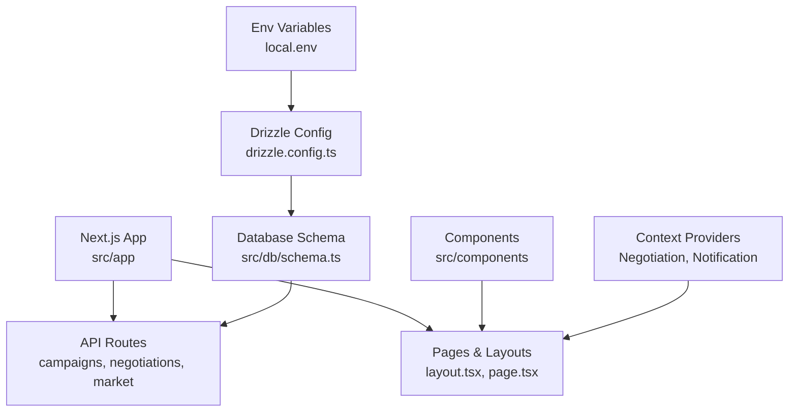
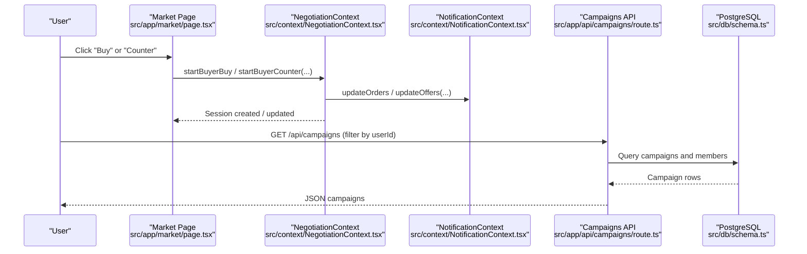
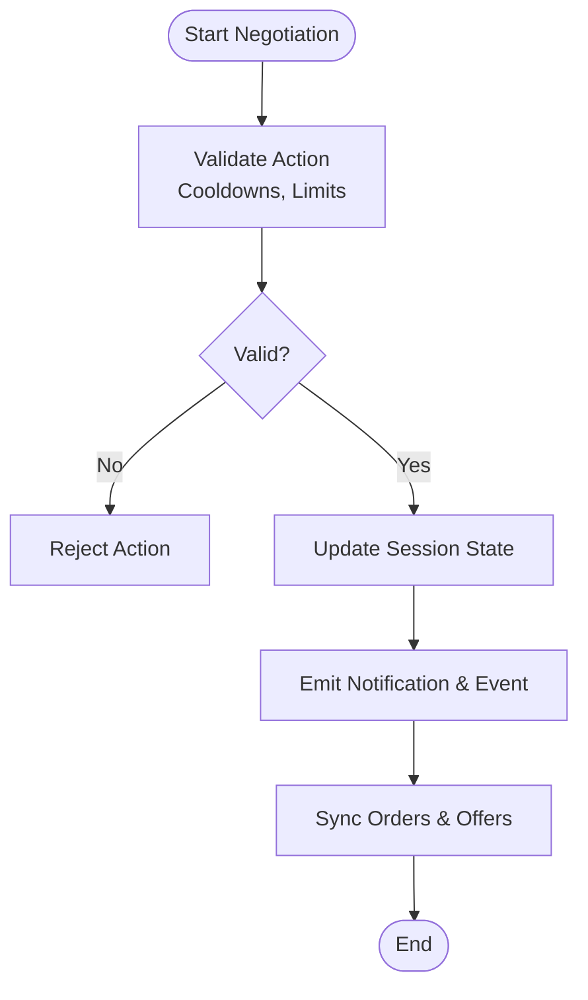
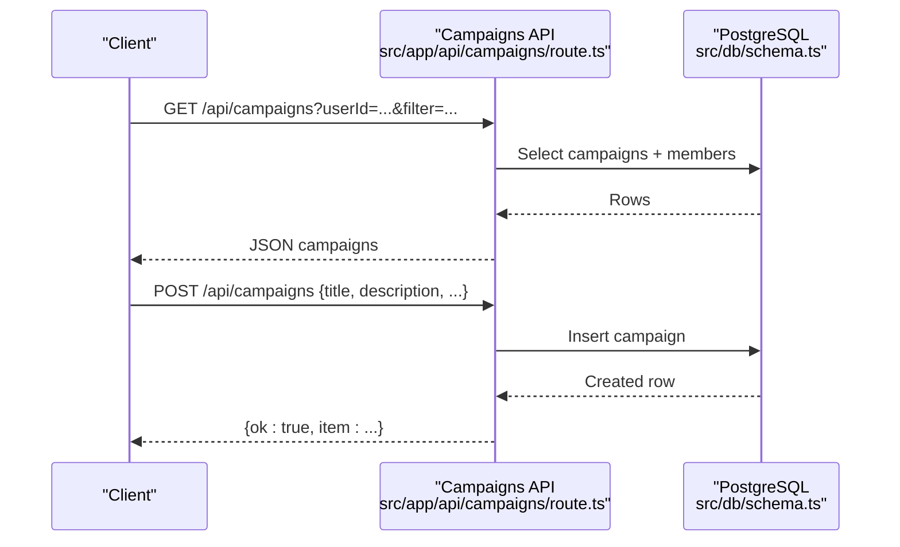
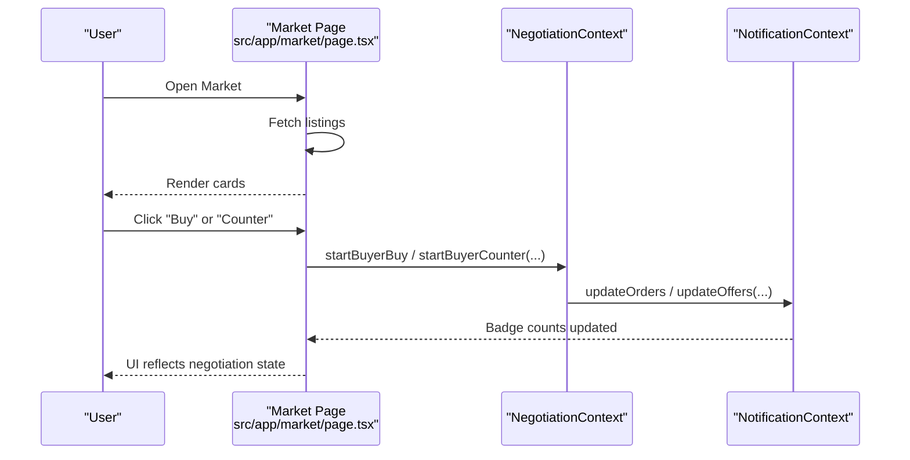
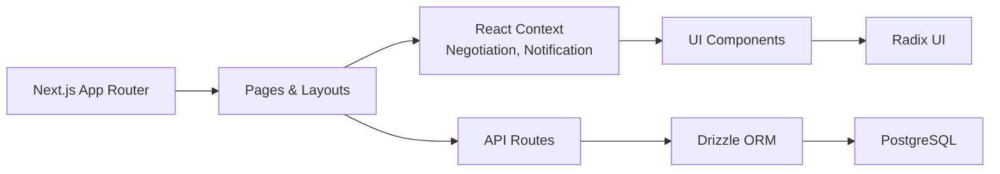

# Project Overview

<cite>
**Referenced Files in This Document**
- [README.md](file://README.md)
- [package.json](file://package.json)
- [next.config.ts](file://next.config.ts)
- [src/app/layout.tsx](file://src/app/layout.tsx)
- [src/app/market/page.tsx](file://src/app/market/page.tsx)
- [src/app/api/campaigns/route.ts](file://src/app/api/campaigns/route.ts)
- [src/app/api/negotiations/route.ts](file://src/app/api/negotiations/route.ts)
- [src/context/NegotiationContext.tsx](file://src/context/NegotiationContext.tsx)
- [src/context/NotificationContext.tsx](file://src/context/NotificationContext.tsx)
- [src/db/schema.ts](file://src/db/schema.ts)
- [drizzle.config.ts](file://drizzle.config.ts)
- [src/lib/db.ts](file://src/lib/db.ts)
- [local.env](file://local.env)
</cite>

## Table of Contents
1. Introduction
2. Project Structure
3. Core Components
4. Architecture Overview
5. Detailed Component Analysis
6. Dependency Analysis
7. Performance Considerations
8. Troubleshooting Guide
9. Conclusion

## Introduction
PortVille Market is a full-stack marketplace application that enables campaign coordination, marketplace transactions, and office analytics. It supports real-time negotiation flows between buyers and sellers, persistent state across sessions, and a modern UI built with Next.js App Router and React. The platform integrates a PostgreSQL database via Drizzle ORM for reliable data persistence and uses Radix UI primitives to deliver accessible, composable components.

Business domain highlights:
- Campaign coordination: Create, join, and manage campaigns with budgets, timelines, and member tracking.
- Marketplace transactions: Browse listings, initiate purchases, submit counter offers, and finalize deals.
- Office analytics: Track events and visualize progress to support decision-making.

The application emphasizes a component-based design, clear separation of concerns, and a client-server model where the server exposes API routes and the client manages interactive state through Context providers.

**Section sources**
- [README.md:1-37](file://README.md#L1-L37)
- [package.json:1-45](file://package.json#L1-L45)

## Project Structure
At a high level, the project follows Next.js App Router conventions:
- Pages and layouts live under src/app.
- Server-side logic is implemented as API routes under src/app/api.
- Shared UI components are organized under src/components.
- Global state and cross-cutting concerns use React Context under src/context.
- Database schema and migrations are managed with Drizzle ORM under src/db and drizzle.
- Configuration files include Next.js config, Drizzle config, and environment variables.

**Diagram sources**
- [src/app/layout.tsx:1-43](file://src/app/layout.tsx#L1-L43)
- [src/app/api/campaigns/route.ts:1-142](file://src/app/api/campaigns/route.ts#L1-L142)
- [src/db/schema.ts:1-84](file://src/db/schema.ts#L1-L84)
- [drizzle.config.ts:1-13](file://drizzle.config.ts#L1-L13)
- [local.env:1-2](file://local.env#L1-L2)

**Section sources**
- [src/app/layout.tsx:1-43](file://src/app/layout.tsx#L1-L43)
- [src/app/api/campaigns/route.ts:1-142](file://src/app/api/campaigns/route.ts#L1-L142)
- [src/db/schema.ts:1-84](file://src/db/schema.ts#L1-L84)
- [drizzle.config.ts:1-13](file://drizzle.config.ts#L1-L13)
- [local.env:1-2](file://local.env#L1-L2)

## Core Components
- Root layout and global providers: The root layout wraps the app with Navbar, Footer, and context providers for notifications and negotiations, ensuring consistent chrome and shared state.
- Negotiation flow: A rich negotiation engine tracks sessions, enforces rules (cooldowns, counters), persists state to localStorage, and synchronizes with orders/offers lists.
- Notifications and cart: Centralized notification context maintains orders and offers, computes badge counts, and persists changes to localStorage.
- Campaign management: API endpoints expose CRUD operations for campaigns, including filtering by user context and membership status.
- Market browsing: The market page loads listings, renders cards, and initiates buy or counter actions that feed into the negotiation context.

Key technology stack:
- Frontend: Next.js App Router, React, TypeScript, Tailwind CSS, Radix UI primitives.
- Backend: Node.js runtime within Next.js API routes.
- Database: PostgreSQL with Drizzle ORM; schema defined in code and migrated via scripts.
- Environment: Configuration via .env and Drizzle config.

Installation and development workflow:
- Install dependencies using your preferred package manager.
- Ensure Node.js version meets the engines requirement.
- Configure DATABASE_URL in local.env.
- Run migrations before starting the dev server using provided scripts.
- Start the development server and open the application in your browser.

Basic usage examples:
- Browse the market and initiate a purchase or counter offer.
- Manage campaigns by creating new entries and joining existing ones.
- Observe negotiation states and notifications in real time.

**Section sources**
- [src/app/layout.tsx:1-43](file://src/app/layout.tsx#L1-L43)
- [src/context/NegotiationContext.tsx:1-706](file://src/context/NegotiationContext.tsx#L1-L706)
- [src/context/NotificationContext.tsx:1-146](file://src/context/NotificationContext.tsx#L1-L146)
- [src/app/api/campaigns/route.ts:1-142](file://src/app/api/campaigns/route.ts#L1-L142)
- [src/app/market/page.tsx:1-159](file://src/app/market/page.tsx#L1-L159)
- [package.json:1-45](file://package.json#L1-L45)
- [drizzle.config.ts:1-13](file://drizzle.config.ts#L1-L13)
- [local.env:1-2](file://local.env#L1-L2)

## Architecture Overview
The system follows a layered architecture:
- Presentation layer: Next.js pages and components render the UI and handle user interactions.
- State layer: React Context provides global state for negotiations and notifications, with localStorage persistence for resilience.
- API layer: Route handlers implement business logic, query/update the database, and return JSON responses.
- Data layer: Drizzle ORM models map to PostgreSQL tables, with schema enforcement and migrations.

**Diagram sources**
- [src/app/market/page.tsx:1-159](file://src/app/market/page.tsx#L1-L159)
- [src/context/NegotiationContext.tsx:1-706](file://src/context/NegotiationContext.tsx#L1-L706)
- [src/context/NotificationContext.tsx:1-146](file://src/context/NotificationContext.tsx#L1-L146)
- [src/app/api/campaigns/route.ts:1-142](file://src/app/api/campaigns/route.ts#L1-L142)
- [src/db/schema.ts:1-84](file://src/db/schema.ts#L1-L84)

## Detailed Component Analysis

### Negotiation Engine
The negotiation engine orchestrates buyer-seller interactions with strict rules:
- Sessions track current value, product price, counters, cooldowns, and payment deadlines.
- Timers periodically check for expired or timed-out sessions and update statuses accordingly.
- Actions include buying, countering, accepting, declining, and finalizing payments.
- Notifications and events are emitted on each state change, and orders/offers lists are synchronized.

**Diagram sources**
- [src/context/NegotiationContext.tsx:1-706](file://src/context/NegotiationContext.tsx#L1-L706)

**Section sources**
- [src/context/NegotiationContext.tsx:1-706](file://src/context/NegotiationContext.tsx#L1-L706)

### Campaign Management API
The campaigns API supports listing and creation:
- GET filters campaigns by user context (created, joined, active) and enriches results with membership flags.
- POST validates input, creates a campaign record, and returns the mapped result.
- Errors are handled gracefully with appropriate status codes.

**Diagram sources**
- [src/app/api/campaigns/route.ts:1-142](file://src/app/api/campaigns/route.ts#L1-L142)
- [src/db/schema.ts:1-84](file://src/db/schema.ts#L1-L84)

**Section sources**
- [src/app/api/campaigns/route.ts:1-142](file://src/app/api/campaigns/route.ts#L1-L142)

### Market Page and Real-Time Interactions
The market page:
- Loads listings from the server and renders them as cards.
- Initiates negotiation sessions via the negotiation context when users buy or counter.
- Records office events for analytics and updates UI based on session outcomes.

**Diagram sources**
- [src/app/market/page.tsx:1-159](file://src/app/market/page.tsx#L1-L159)
- [src/context/NegotiationContext.tsx:1-706](file://src/context/NegotiationContext.tsx#L1-L706)
- [src/context/NotificationContext.tsx:1-146](file://src/context/NotificationContext.tsx#L1-L146)

**Section sources**
- [src/app/market/page.tsx:1-159](file://src/app/market/page.tsx#L1-L159)

### Database Schema and Migrations
The schema defines core entities:
- Campaigns and campaign members for campaign coordination.
- Vacancies for job postings.
- Market listings for marketplace items.
- Engagement events for activity tracking.

Migrations are configured via Drizzle and executed during build/start to ensure schema consistency.

**Section sources**
- [src/db/schema.ts:1-84](file://src/db/schema.ts#L1-L84)
- [drizzle.config.ts:1-13](file://drizzle.config.ts#L1-L13)
- [package.json:1-45](file://package.json#L1-L45)

## Dependency Analysis
High-level dependencies:
- Next.js App Router coordinates routing and server/client boundaries.
- React Context provides global state for negotiations and notifications.
- Drizzle ORM abstracts PostgreSQL interactions with type-safe queries.
- Radix UI components supply accessible primitives used throughout the UI.

**Diagram sources**
- [src/app/layout.tsx:1-43](file://src/app/layout.tsx#L1-L43)
- [src/app/api/campaigns/route.ts:1-142](file://src/app/api/campaigns/route.ts#L1-L142)
- [src/db/schema.ts:1-84](file://src/db/schema.ts#L1-L84)
- [package.json:1-45](file://package.json#L1-L45)

**Section sources**
- [package.json:1-45](file://package.json#L1-L45)
- [src/app/layout.tsx:1-43](file://src/app/layout.tsx#L1-L43)
- [src/app/api/campaigns/route.ts:1-142](file://src/app/api/campaigns/route.ts#L1-L142)
- [src/db/schema.ts:1-84](file://src/db/schema.ts#L1-L84)

## Performance Considerations
- Use dynamic imports for heavy components to reduce initial bundle size.
- Leverage Next.js caching and route-level optimizations where appropriate.
- Keep negotiation timers efficient; avoid excessive re-renders by batching updates.
- Index frequently queried fields in the database schema to improve performance.
- Minimize localStorage payload sizes by storing only necessary state.

[No sources needed since this section provides general guidance]

## Troubleshooting Guide
Common issues and resolutions:
- Database connection errors: Verify DATABASE_URL in local.env and ensure the PostgreSQL instance is reachable.
- Migration failures: Confirm Drizzle configuration points to the correct schema and credentials; run migrations explicitly if needed.
- API route errors: Check console logs for error messages and validate request payloads; ensure headers like x-user-id are set when required.
- Negotiation state inconsistencies: Clear localStorage if corrupted; verify timer intervals and cooldown logic.

**Section sources**
- [src/app/api/campaigns/route.ts:1-142](file://src/app/api/campaigns/route.ts#L1-L142)
- [src/context/NegotiationContext.tsx:1-706](file://src/context/NegotiationContext.tsx#L1-L706)
- [drizzle.config.ts:1-13](file://drizzle.config.ts#L1-L13)
- [local.env:1-2](file://local.env#L1-L2)

## Conclusion
PortVille Market combines a robust backend with an interactive frontend to deliver a comprehensive marketplace experience. With campaign management, real-time negotiations, and office analytics, it provides a cohesive platform for coordinating efforts and executing transactions. The modular architecture, clear separation of concerns, and strong typing make it maintainable and scalable for future enhancements.

[No sources needed since this section summarizes without analyzing specific files]