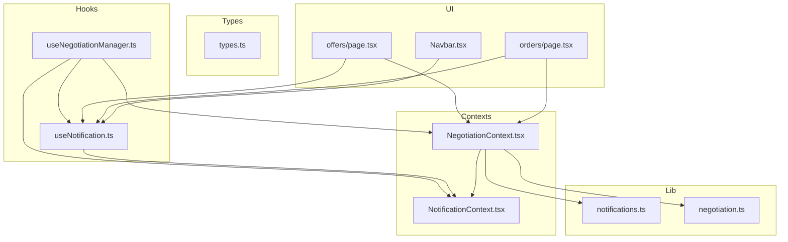
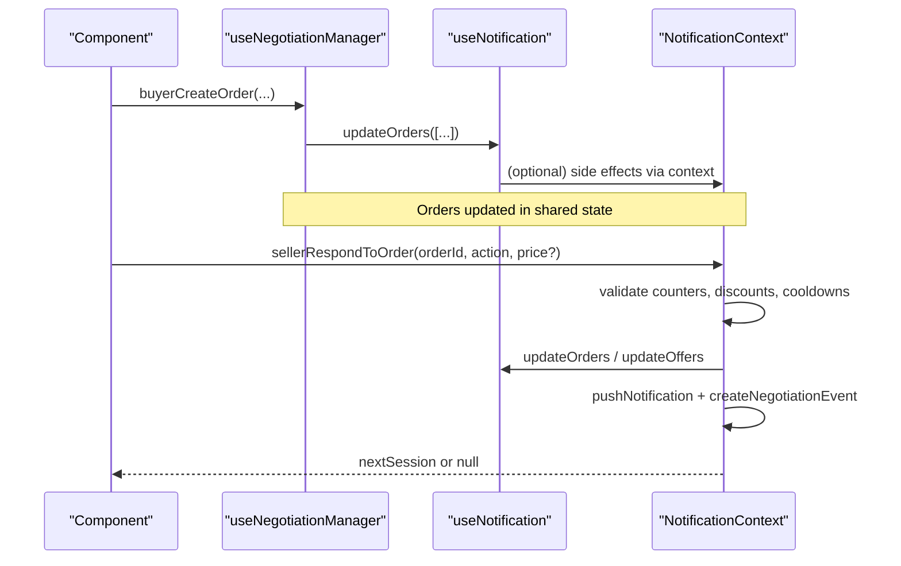
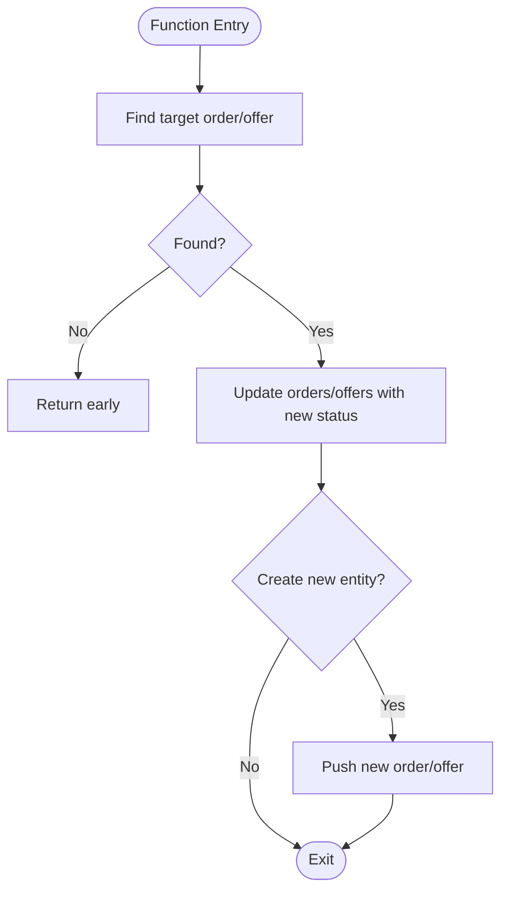
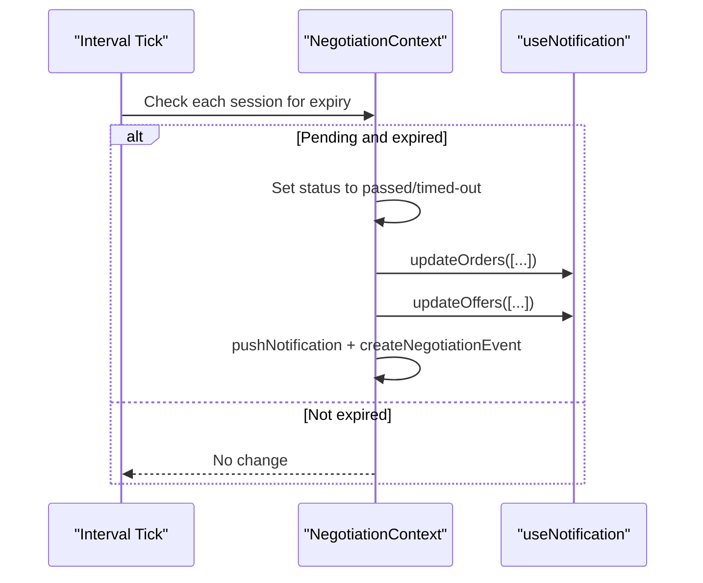
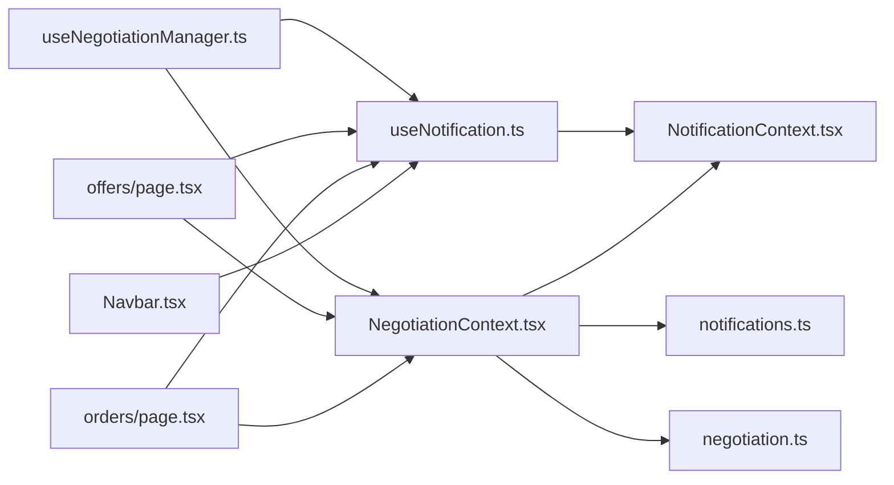

# Custom Hooks

<cite>
**Referenced Files in This Document**
- [useNegotiationManager.ts](file://src/hooks/useNegotiationManager.ts)
- [useNotification.ts](file://src/hooks/useNotification.ts)
- [NotificationContext.tsx](file://src/context/NotificationContext.tsx)
- [NegotiationContext.tsx](file://src/context/NegotiationContext.tsx)
- [notifications.ts](file://src/lib/notifications.ts)
- [negotiation.ts](file://src/lib/negotiation.ts)
- [types.ts](file://src/types.ts)
- [offers/page.tsx](file://src/app/offers/page.tsx)
- [orders/page.tsx](file://src/app/orders/page.tsx)
- [Navbar.tsx](file://src/components/layout/Navbar.tsx)
</cite>

## Table of Contents
1. Introduction
2. Project Structure
3. Core Components
4. Architecture Overview
5. Detailed Component Analysis
6. Dependency Analysis
7. Performance Considerations
8. Troubleshooting Guide
9. Conclusion
10. Appendices

## Introduction
This document explains the custom hooks implementation that powers PortVille Market’s state management for negotiations and notifications. It focuses on:
- The useNegotiationManager hook for managing negotiation session lifecycle (creation, updates, cleanup).
- The useNotification hook for accessing and manipulating notification state (orders, offers, counts, and visibility flags).
- Hook composition patterns used across the app to abstract complex state logic from components.
- Extending existing hooks with new functionality and creating domain-specific hooks.
- Error handling patterns, loading states, and performance considerations when using these hooks in React components.
- Guidelines for testing hooks and mocking their behavior in unit tests.

## Project Structure
The custom hooks live under src/hooks and are backed by contexts under src/context. Shared types and utilities are in src/types and src/lib. Pages and UI components consume these hooks to render negotiation flows and notification badges.

**Diagram sources**
- [useNegotiationManager.ts:1-201](file://src/hooks/useNegotiationManager.ts#L1-L201)
- [useNotification.ts:1-8](file://src/hooks/useNotification.ts#L1-L8)
- [NegotiationContext.tsx:1-706](file://src/context/NegotiationContext.tsx#L1-L706)
- [NotificationContext.tsx:1-146](file://src/context/NotificationContext.tsx#L1-L146)
- [notifications.ts:1-43](file://src/lib/notifications.ts#L1-L43)
- [negotiation.ts:1-50](file://src/lib/negotiation.ts#L1-L50)
- [types.ts:1-89](file://src/types.ts#L1-L89)
- [offers/page.tsx:1-168](file://src/app/offers/page.tsx#L1-L168)
- [orders/page.tsx:1-123](file://src/app/orders/page.tsx#L1-L123)
- [Navbar.tsx:1-170](file://src/components/layout/Navbar.tsx#L1-L170)

**Section sources**
- [useNegotiationManager.ts:1-201](file://src/hooks/useNegotiationManager.ts#L1-L201)
- [useNotification.ts:1-8](file://src/hooks/useNotification.ts#L1-L8)
- [NegotiationContext.tsx:1-706](file://src/context/NegotiationContext.tsx#L1-L706)
- [NotificationContext.tsx:1-146](file://src/context/NotificationContext.tsx#L1-L146)
- [notifications.ts:1-43](file://src/lib/notifications.ts#L1-L43)
- [negotiation.ts:1-50](file://src/lib/negotiation.ts#L1-L50)
- [types.ts:1-89](file://src/types.ts#L1-L89)
- [offers/page.tsx:1-168](file://src/app/offers/page.tsx#L1-L168)
- [orders/page.tsx:1-123](file://src/app/orders/page.tsx#L1-L123)
- [Navbar.tsx:1-170](file://src/components/layout/Navbar.tsx#L1-L170)

## Core Components
- useNotification: A thin wrapper around NotificationContext that exposes orders, offers, badge counts, seen flags, and update functions. It is consumed by pages and UI to display and react to changes.
- useNegotiationManager: Orchestrates negotiation sessions by composing useNotification and coordinating order/offer state transitions, while also interacting with NegotiationContext for session lifecycle and timers.
- NegotiationContext: Provides session state, actions to start/respond/finalize negotiations, and a background tick to handle timeouts and cooldowns. It persists sessions, notifications, and events to localStorage.
- NotificationContext: Centralizes orders and offers arrays, persistence to localStorage, computed badge counts, and “seen” flags for notifications and cart.

Key responsibilities:
- Session lifecycle: create, respond, finalize, timeout, cooldown.
- State synchronization: keep orders/offers in sync with negotiation sessions.
- Notifications: create, add, mark read, and count unread.
- Persistence: localStorage for orders, offers, sessions, notifications, and events.

**Section sources**
- [useNotification.ts:1-8](file://src/hooks/useNotification.ts#L1-L8)
- [useNegotiationManager.ts:1-201](file://src/hooks/useNegotiationManager.ts#L1-L201)
- [NegotiationContext.tsx:1-706](file://src/context/NegotiationContext.tsx#L1-L706)
- [NotificationContext.tsx:1-146](file://src/context/NotificationContext.tsx#L1-L146)

## Architecture Overview
The system composes two primary layers:
- Domain state via NegotiationContext (sessions, notifications, events, timers).
- Shared lists via NotificationContext (orders, offers, badge counts, seen flags).

Components call hooks to trigger actions; hooks update both contexts and persist data. Background timers enforce time-based rules and synchronize list states.

**Diagram sources**
- [useNegotiationManager.ts:9-187](file://src/hooks/useNegotiationManager.ts#L9-L187)
- [NegotiationContext.tsx:267-624](file://src/context/NegotiationContext.tsx#L267-L624)
- [NotificationContext.tsx:64-76](file://src/context/NotificationContext.tsx#L64-L76)

## Detailed Component Analysis

### useNegotiationManager: Negotiation Session Lifecycle
Responsibilities:
- Create orders (buy or counter) and append to shared orders list.
- Seller actions: accept, counter, decline an order; create corresponding offers.
- Buyer actions: accept, counter, decline an offer; create counter orders when needed.
- Synchronize status between orders and offers to reflect negotiation progress.

Data flow highlights:
- Creates Order objects with unique IDs and timestamps, sets initial statuses.
- When seller accepts or counters, creates Offer entries linked to the originating order.
- When buyer counters an offer, creates a new counter Order referencing the original product price.
- Updates related order/offer statuses to reflect acceptance, rejection, or counter progression.

Error handling and guards:
- Early returns if target order/offer not found.
- Status transitions only occur for valid targets.

Performance considerations:
- Uses immutable array updates to avoid unnecessary re-renders.
- Minimizes lookups by finding relevant items before mapping.

**Diagram sources**
- [useNegotiationManager.ts:50-187](file://src/hooks/useNegotiationManager.ts#L50-L187)

**Section sources**
- [useNegotiationManager.ts:1-201](file://src/hooks/useNegotiationManager.ts#L1-L201)

### useNotification: Accessing and Manipulating Notification State
Responsibilities:
- Expose orders and offers arrays from NotificationContext.
- Provide updateOrders and updateOffers to mutate shared state.
- Expose badge counts and seen flags for UI indicators.

Usage examples:
- Navbar displays notification and cart badges based on counts and seen flags.
- Offers and Orders pages filter and render lists based on current state.

Persistence:
- On mount, loads persisted orders and offers from localStorage.
- On updates, writes back to localStorage to maintain state across reloads.

**Section sources**
- [useNotification.ts:1-8](file://src/hooks/useNotification.ts#L1-L8)
- [NotificationContext.tsx:22-146](file://src/context/NotificationContext.tsx#L22-L146)
- [Navbar.tsx:16-170](file://src/components/layout/Navbar.tsx#L16-L170)
- [offers/page.tsx:9-168](file://src/app/offers/page.tsx#L9-L168)
- [orders/page.tsx:11-123](file://src/app/orders/page.tsx#L11-L123)

### NegotiationContext: Session Management, Timers, and Sync
Responsibilities:
- Manage per-card negotiation sessions with rich state (status, counters, cooldowns, payment deadlines).
- Enforce business rules: daily buy limits, cooldown periods, alternating turns, discount caps.
- Persist sessions, notifications, and events to localStorage.
- Run a periodic tick to expire pending sessions and sync list states accordingly.
- Provide helper methods to start buyer actions, respond to orders/offers, and finalize payments.

Timers and cleanup:
- Sets up an interval to check for expired pending sessions and transitions them to passed/timed-out.
- Clears intervals on unmount to prevent leaks.

Notifications and events:
- Creates AppNotification entries and NegotiationEvent entries for each significant action.
- Tracks unread counts and provides marking all as read.

Sync with shared lists:
- After session transitions, updates orders/offers to reflect final statuses (e.g., completed, timed-out).

**Diagram sources**
- [NegotiationContext.tsx:181-252](file://src/context/NegotiationContext.tsx#L181-L252)

**Section sources**
- [NegotiationContext.tsx:1-706](file://src/context/NegotiationContext.tsx#L1-L706)
- [notifications.ts:1-43](file://src/lib/notifications.ts#L1-L43)
- [negotiation.ts:1-50](file://src/lib/negotiation.ts#L1-L50)

### Hook Composition Patterns
- useNotification wraps NotificationContext to provide a stable API surface for components.
- useNegotiationManager composes useNotification to coordinate order/offer state while delegating session lifecycle to NegotiationContext.
- Components consume both hooks to separate concerns: UI state (lists, badges) vs. domain workflow (negotiations).

Benefits:
- Encapsulation: Complex logic hidden behind simple function calls.
- Reusability: Hooks can be reused across multiple components.
- Testability: Each hook can be tested independently with mocked contexts.

**Section sources**
- [useNotification.ts:1-8](file://src/hooks/useNotification.ts#L1-L8)
- [useNegotiationManager.ts:1-201](file://src/hooks/useNegotiationManager.ts#L1-L201)
- [NegotiationContext.tsx:1-706](file://src/context/NegotiationContext.tsx#L1-L706)
- [NotificationContext.tsx:1-146](file://src/context/NotificationContext.tsx#L1-L146)

## Dependency Analysis
High-level dependencies:
- useNegotiationManager depends on useNotification and negotiates through NegotiationContext.
- useNotification depends on NotificationContext.
- NegotiationContext depends on NotificationContext for shared lists and uses lib utilities for notifications and events.
- UI components depend on hooks to drive behavior and rendering.

**Diagram sources**
- [useNotification.ts:1-8](file://src/hooks/useNotification.ts#L1-L8)
- [useNegotiationManager.ts:1-201](file://src/hooks/useNegotiationManager.ts#L1-L201)
- [NegotiationContext.tsx:1-706](file://src/context/NegotiationContext.tsx#L1-L706)
- [NotificationContext.tsx:1-146](file://src/context/NotificationContext.tsx#L1-L146)
- [notifications.ts:1-43](file://src/lib/notifications.ts#L1-L43)
- [negotiation.ts:1-50](file://src/lib/negotiation.ts#L1-L50)
- [offers/page.tsx:1-168](file://src/app/offers/page.tsx#L1-L168)
- [orders/page.tsx:1-123](file://src/app/orders/page.tsx#L1-L123)
- [Navbar.tsx:1-170](file://src/components/layout/Navbar.tsx#L1-L170)

**Section sources**
- [useNegotiationManager.ts:1-201](file://src/hooks/useNegotiationManager.ts#L1-L201)
- [useNotification.ts:1-8](file://src/hooks/useNotification.ts#L1-L8)
- [NegotiationContext.tsx:1-706](file://src/context/NegotiationContext.tsx#L1-L706)
- [NotificationContext.tsx:1-146](file://src/context/NotificationContext.tsx#L1-L146)

## Performance Considerations
- Immutable updates: Both contexts use functional state updates and map/slice to avoid mutating arrays, reducing unnecessary re-renders.
- LocalStorage writes: Only write when state changes; guard against SSR by checking window availability.
- Interval management: NegotiationContext sets and clears intervals to manage timeouts without leaking timers.
- Computed values: Badge counts are derived efficiently using filters and useMemo where appropriate.
- Batched updates: Actions often batch updates to orders and offers together to minimize re-renders.

[No sources needed since this section provides general guidance]

## Troubleshooting Guide
Common issues and resolutions:
- Missing provider error: Using useNegotiationContext or useNotificationContext outside their providers throws an error. Ensure components are wrapped in the respective providers.
- Stale state: If orders/offers do not reflect expected changes, verify that updateOrders/updateOffers are called with new arrays and that components subscribe to the correct context.
- Timeouts not firing: Confirm that the interval is running and that session updatedAt/paymentDueAt fields are set correctly.
- Persistence failures: Check localStorage parsing and catch blocks; malformed data can cause parse errors.

Error handling patterns observed:
- Context accessors throw descriptive errors when used outside providers.
- LocalStorage operations are wrapped in try/catch to handle invalid JSON gracefully.
- Early returns protect against undefined targets in negotiation actions.

**Section sources**
- [NegotiationContext.tsx:700-705](file://src/context/NegotiationContext.tsx#L700-L705)
- [NotificationContext.tsx:139-145](file://src/context/NotificationContext.tsx#L139-L145)
- [NotificationContext.tsx:30-62](file://src/context/NotificationContext.tsx#L30-L62)
- [NegotiationContext.tsx:146-173](file://src/context/NegotiationContext.tsx#L146-L173)

## Conclusion
PortVille Market’s custom hooks provide a clean separation between UI concerns and domain logic:
- useNotification centralizes shared lists and badge state, enabling consistent UI indicators.
- useNegotiationManager orchestrates negotiation workflows, ensuring orders and offers stay synchronized with session states.
- NegotiationContext enforces business rules, manages timers, and persists critical state.
- The composition pattern makes the system modular, testable, and extensible for future features.

[No sources needed since this section summarizes without analyzing specific files]

## Appendices

### Extending Existing Hooks
- Add new fields to Order/Offer types and propagate through update functions.
- Introduce new actions in NegotiationContext and expose them via useNegotiationManager.
- Extend NotificationContext with additional computed metrics or visibility flags.

### Creating Domain-Specific Hooks
- Example: useMarketCard(cardId) could encapsulate fetching card details, local caching, and derived stats.
- Example: useNegotiationFlow(cardId) could wrap session queries, actions, and UI state toggles for a single negotiation.

### Testing Guidelines
- Mock contexts: Provide mock implementations of NotificationContext and NegotiationContext to isolate hook behavior.
- Assert state transitions: Verify that calling actions results in expected updates to orders/offers and sessions.
- Validate timers: Use fake timers to assert timeout behavior and cooldown enforcement.
- Coverage: Test edge cases like missing targets, invalid inputs, and storage parse errors.

[No sources needed since this section provides general guidance]