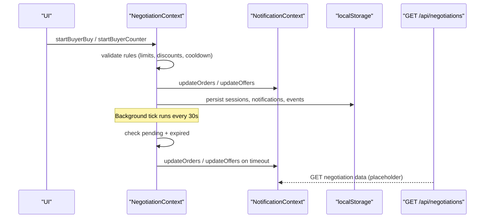
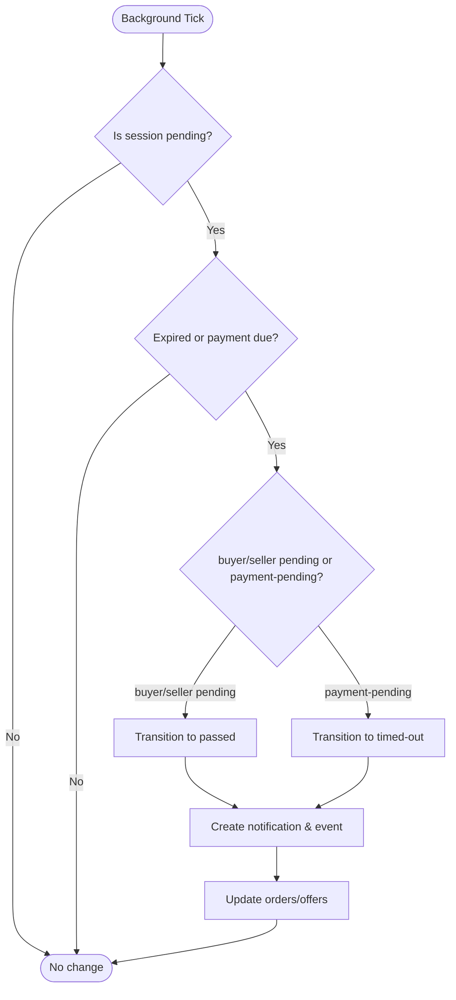
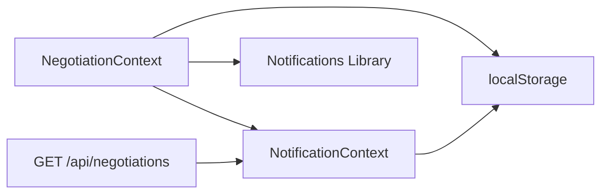

# Negotiation State Machine

<cite>
**Referenced Files in This Document**
- [NegotiationContext.tsx](file://src/context/NegotiationContext.tsx)
- [notifications.ts](file://src/lib/notifications.ts)
- [NotificationContext.tsx](file://src/context/NotificationContext.tsx)
- [useNegotiationManager.ts](file://src/hooks/useNegotiationManager.ts)
- [negotiations.ts](file://src/lib/negotiations.ts)
- [route.ts](file://src/app/api/negotiations/route.ts)
- [types.ts](file://src/types.ts)
</cite>

## Table of Contents
1. [Introduction](#introduction)
2. [Project Structure](#project-structure)
3. [Core Components](#core-components)
4. [Architecture Overview](#architecture-overview)
5. [Detailed Component Analysis](#detailed-component-analysis)
6. [Dependency Analysis](#dependency-analysis)
7. [Performance Considerations](#performance-considerations)
8. [Troubleshooting Guide](#troubleshooting-guide)
9. [Conclusion](#conclusion)

## Introduction
This document explains the negotiation state machine implemented for PortVille Market. It covers the complete lifecycle of a negotiation session, including all states and transitions, validation rules, business constraints (counter limits, cooldowns, daily action limits), timeout handling, and integration with notifications and order/offer synchronization. It also provides debugging guidance and performance considerations for real-time updates.

## Project Structure
The negotiation system is primarily implemented as a client-side context that manages per-card negotiation sessions, enforces business rules, and synchronizes with shared order/offer lists used by UI components. A background timer periodically checks for expired pending states and transitions them to passed or timed-out while updating related orders and offers.

```mermaid
graph TB
subgraph "Client State"
NC["NegotiationContext<br/>sessions, events, notifications"]
NTF["NotificationContext<br/>orders, offers"]
end
subgraph "Persistence"
LS["localStorage<br/>sessions, notifications, events,<br/>orders, offers"]
end
subgraph "API"
API["GET /api/negotiations"]
end
NC --> LS
NC --> NTF
NTF --> LS
API --> NTF
```

**Diagram sources**
- [NegotiationContext.tsx:140-252](file://src/context/NegotiationContext.tsx#L140-L252)
- [NotificationContext.tsx:22-136](file://src/context/NotificationContext.tsx#L22-L136)
- [route.ts:4-12](file://src/app/api/negotiations/route.ts#L4-L12)

**Section sources**
- [NegotiationContext.tsx:140-252](file://src/context/NegotiationContext.tsx#L140-L252)
- [NotificationContext.tsx:22-136](file://src/context/NotificationContext.tsx#L22-L136)
- [route.ts:4-12](file://src/app/api/negotiations/route.ts#L4-L12)

## Core Components
- NegotiationContext: Owns per-card negotiation sessions, applies business rules, handles timeouts, emits notifications, and syncs orders/offers.
- NotificationContext: Central store for orders and offers, persisted to localStorage, consumed by UI and negotiation logic.
- Notifications library: Utilities to create, add, and manage notification entries.
- useNegotiationManager: Helper hook to manipulate orders/offers directly (used by other flows).
- API route: Placeholder endpoint returning negotiation data from negotiations.ts.

Key responsibilities:
- Enforce counter limits (max 3 per side), alternating turns, discount caps, daily buy limits, and cooldown windows.
- Manage state transitions across idle, buyer-pending, seller-pending, accepted, payment-pending, declined, timed-out, passed, finalized.
- Run a periodic tick to transition expired pending states to passed/timed-out and update orders/offers accordingly.

**Section sources**
- [NegotiationContext.tsx:9-38](file://src/context/NegotiationContext.tsx#L9-L38)
- [NegotiationContext.tsx:140-252](file://src/context/NegotiationContext.tsx#L140-L252)
- [notifications.ts:1-43](file://src/lib/notifications.ts#L1-L43)
- [NotificationContext.tsx:22-136](file://src/context/NotificationContext.tsx#L22-L136)
- [useNegotiationManager.ts:6-200](file://src/hooks/useNegotiationManager.ts#L6-L200)
- [route.ts:4-12](file://src/app/api/negotiations/route.ts#L4-L12)

## Architecture Overview
The negotiation state machine runs in the browser via React Context. Each card has an independent session. User actions trigger transitions validated by business rules. A background interval enforces time-based transitions and keeps orders/offers synchronized.



**Diagram sources**
- [NegotiationContext.tsx:181-252](file://src/context/NegotiationContext.tsx#L181-L252)
- [NegotiationContext.tsx:267-378](file://src/context/NegotiationContext.tsx#L267-L378)
- [NotificationContext.tsx:64-76](file://src/context/NotificationContext.tsx#L64-L76)
- [route.ts:4-12](file://src/app/api/negotiations/route.ts#L4-L12)

## Detailed Component Analysis

### States and Lifecycle
- idle: No active negotiation for the card.
- buyer-pending: Buyer initiated a buy or counter; waiting for seller response.
- seller-pending: Seller responded with accept or counter; waiting for buyer response.
- accepted: Used when a seller accepts a buyer’s offer; leads to payment-pending.
- payment-pending: Payment due within 24 hours; if unpaid, transitions to timed-out.
- declined: Either party declined; negotiation ends.
- timed-out: Payment window expired without completion.
- passed: No response within 24 hours on buyer-pending or seller-pending; negotiation passes.
- finalized: Payment completed; negotiation closed.

Transitions are enforced by specific functions:
- Buyer actions: startBuyerBuy, startBuyerCounter
- Seller responses: sellerRespondToOrder
- Buyer responses to offers: buyerRespondToOffer
- Finalization: finalizeNegotiation
- System-driven timeouts: background tick

```mermaid
stateDiagram-v2
[*] --> idle
idle --> buyer-pending : "Buyer buy/counter"
buyer-pending --> seller-pending : "Seller accept/counter"
buyer-pending --> passed : "No response > 24h"
buyer-pending --> declined : "Seller decline"
seller-pending --> buyer-pending : "Buyer counter"
seller-pending --> payment-pending : "Buyer accept"
seller-pending --> passed : "No response > 24h"
seller-pending --> declined : "Buyer decline"
payment-pending --> finalized : "Payment completed"
payment-pending --> timed-out : "Payment due exceeded"
declined --> [*]
passed --> [*]
timed-out --> [*]
finalized --> [*]
```

**Diagram sources**
- [NegotiationContext.tsx:181-252](file://src/context/NegotiationContext.tsx#L181-L252)
- [NegotiationContext.tsx:267-378](file://src/context/NegotiationContext.tsx#L267-L378)
- [NegotiationContext.tsx:380-512](file://src/context/NegotiationContext.tsx#L380-L512)
- [NegotiationContext.tsx:514-624](file://src/context/NegotiationContext.tsx#L514-L624)
- [NegotiationContext.tsx:626-669](file://src/context/NegotiationContext.tsx#L626-L669)

**Section sources**
- [NegotiationContext.tsx:9-38](file://src/context/NegotiationContext.tsx#L9-L38)
- [NegotiationContext.tsx:181-252](file://src/context/NegotiationContext.tsx#L181-L252)
- [NegotiationContext.tsx:267-378](file://src/context/NegotiationContext.tsx#L267-L378)
- [NegotiationContext.tsx:380-512](file://src/context/NegotiationContext.tsx#L380-L512)
- [NegotiationContext.tsx:514-624](file://src/context/NegotiationContext.tsx#L514-L624)
- [NegotiationContext.tsx:626-669](file://src/context/NegotiationContext.tsx#L626-L669)

### Business Rules and Validation
- Counter limits: Each side may submit up to 3 counters. Attempts beyond the limit are rejected.
- Alternating turns: After a buyer counter, only the seller can respond next, and vice versa.
- Discount caps: Maximum allowable discount depends on the current counter count for each side.
- Daily action limits: Buyers are limited to 3 buy-related actions per day (tracked via day key and counter).
- Cooldown: After certain actions, a cooldown period prevents immediate re-actions.
- Timeouts: Pending states expire after 24 hours; buyer/seller pending become passed; payment-pending becomes timed-out.

Validation points:
- Buyer buy/counter: checks daily limit, cooldown, counter cap, and minimum price based on discount caps.
- Seller respond: checks counter cap, alternating turn, and minimum price for counters.
- Buyer respond to offer: same validations as buyer actions.
- Finalize: allowed only from payment-pending.

**Section sources**
- [NegotiationContext.tsx:105-115](file://src/context/NegotiationContext.tsx#L105-L115)
- [NegotiationContext.tsx:260-265](file://src/context/NegotiationContext.tsx#L260-L265)
- [NegotiationContext.tsx:319-378](file://src/context/NegotiationContext.tsx#L319-L378)
- [NegotiationContext.tsx:380-451](file://src/context/NegotiationContext.tsx#L380-L451)
- [NegotiationContext.tsx:514-586](file://src/context/NegotiationContext.tsx#L514-L586)

### Timeout Handling Mechanism
A background interval runs every 30 seconds to evaluate pending sessions:
- If a session is buyer-pending or seller-pending and has been inactive for more than 24 hours, it transitions to passed.
- If a session is payment-pending and the paymentDueAt timestamp has passed, it transitions to timed-out.
- On transition, notifications and events are created, and corresponding orders/offers are updated to reflect the new status.



**Diagram sources**
- [NegotiationContext.tsx:181-252](file://src/context/NegotiationContext.tsx#L181-L252)

**Section sources**
- [NegotiationContext.tsx:181-252](file://src/context/NegotiationContext.tsx#L181-L252)

### Integration with Notifications and Order/Offer Synchronization
- Notifications: Every state change creates a notification entry with category, actor, and status. Unread counts are tracked and persisted.
- Orders: When a buyer initiates a buy or counter, a new order is added to the shared list. Subsequent actions update the order status.
- Offers: When a seller responds (accept/counter), a new offer is created and pushed to the shared list. Buyer responses update offer statuses.
- Persistence: Both orders and offers are stored in localStorage and refreshed on mount.

Synchronization points:
- Buyer actions: create/update orders; push notifications.
- Seller responses: create/update offers; update orders; push notifications.
- Buyer responses to offers: update offers and orders; push notifications.
- Timeout transitions: update latest order and offer statuses to passed or timed-out.

**Section sources**
- [NegotiationContext.tsx:175-179](file://src/context/NegotiationContext.tsx#L175-L179)
- [NegotiationContext.tsx:291-317](file://src/context/NegotiationContext.tsx#L291-L317)
- [NegotiationContext.tsx:351-378](file://src/context/NegotiationContext.tsx#L351-L378)
- [NegotiationContext.tsx:455-512](file://src/context/NegotiationContext.tsx#L455-L512)
- [NegotiationContext.tsx:588-624](file://src/context/NegotiationContext.tsx#L588-L624)
- [NotificationContext.tsx:64-76](file://src/context/NotificationContext.tsx#L64-L76)
- [notifications.ts:17-43](file://src/lib/notifications.ts#L17-L43)

### Example Scenarios

#### Buy Request Flow
- Buyer clicks “Buy” on a market card.
- Session transitions to buyer-pending; order created with status pending; notification sent.
- Seller can accept (moves to payment-pending), counter (moves to seller-pending), or decline (moves to declined).
- If no response within 24 hours, session becomes passed; order and offer statuses updated accordingly.

**Section sources**
- [NegotiationContext.tsx:267-317](file://src/context/NegotiationContext.tsx#L267-L317)
- [NegotiationContext.tsx:380-451](file://src/context/NegotiationContext.tsx#L380-L451)
- [NegotiationContext.tsx:181-252](file://src/context/NegotiationContext.tsx#L181-L252)

#### Counter Offer Flow
- Buyer submits a counter within allowed discount caps and counter limits.
- Session remains buyer-pending; order updated with offered price; notification sent.
- Seller responds with accept/counter/decline following the same rules.
- If no response within 24 hours, session becomes passed; order and offer statuses updated.

**Section sources**
- [NegotiationContext.tsx:319-378](file://src/context/NegotiationContext.tsx#L319-L378)
- [NegotiationContext.tsx:380-451](file://src/context/NegotiationContext.tsx#L380-L451)
- [NegotiationContext.tsx:181-252](file://src/context/NegotiationContext.tsx#L181-L252)

#### Acceptance and Payment Flow
- Seller accepts buyer’s offer: session moves to payment-pending; order status set to accepted; offer created.
- Buyer finalizes payment: session moves to finalized; order and offer statuses set to completed; notification emitted.
- If payment not completed within 24 hours: session moves to timed-out; order and offer statuses updated.

**Section sources**
- [NegotiationContext.tsx:407-424](file://src/context/NegotiationContext.tsx#L407-L424)
- [NegotiationContext.tsx:626-669](file://src/context/NegotiationContext.tsx#L626-L669)
- [NegotiationContext.tsx:181-252](file://src/context/NegotiationContext.tsx#L181-L252)

#### Decline Flow
- Either party declines: session moves to declined; order/offer statuses updated; notifications emitted.

**Section sources**
- [NegotiationContext.tsx:389-406](file://src/context/NegotiationContext.tsx#L389-L406)
- [NegotiationContext.tsx:524-541](file://src/context/NegotiationContext.tsx#L524-L541)

## Dependency Analysis
- NegotiationContext depends on:
  - NotificationContext for orders/offers management and persistence.
  - Notifications library for creating and managing notifications.
  - LocalStorage for persistence of sessions, notifications, and events.
- NotificationContext persists orders/offers and exposes update methods.
- API route delegates to negotiations.ts which currently returns empty arrays (placeholder).



**Diagram sources**
- [NegotiationContext.tsx:140-252](file://src/context/NegotiationContext.tsx#L140-L252)
- [NotificationContext.tsx:22-136](file://src/context/NotificationContext.tsx#L22-L136)
- [notifications.ts:1-43](file://src/lib/notifications.ts#L1-L43)
- [route.ts:4-12](file://src/app/api/negotiations/route.ts#L4-L12)

**Section sources**
- [NegotiationContext.tsx:140-252](file://src/context/NegotiationContext.tsx#L140-L252)
- [NotificationContext.tsx:22-136](file://src/context/NotificationContext.tsx#L22-L136)
- [notifications.ts:1-43](file://src/lib/notifications.ts#L1-L43)
- [route.ts:4-12](file://src/app/api/negotiations/route.ts#L4-L12)

## Performance Considerations
- Background interval: Runs every 30 seconds; ensure minimal work inside the tick to avoid UI jank. The current implementation iterates sessions and updates orders/offers only when changes occur.
- LocalStorage writes: Persisting large arrays frequently can be costly. Batch updates where possible and avoid unnecessary writes.
- Re-renders: Updating orders/offers triggers re-renders in consuming components. Consider memoization and selective updates to reduce render overhead.
- Memory usage: Keep notification and event histories bounded (e.g., slice to last N items) to prevent unbounded growth.

[No sources needed since this section provides general guidance]

## Troubleshooting Guide
Common issues and diagnostics:
- Sessions not starting:
  - Verify daily buy limit and cooldown are not blocking actions.
  - Ensure counter limits have not been reached and alternating turn rules are satisfied.
  - Check that price meets minimum discount thresholds.
- Unexpected passed/timed-out:
  - Inspect updatedAt and paymentDueAt timestamps to confirm expiration logic.
  - Confirm background interval is running and not blocked by environment restrictions.
- Orders/offers out of sync:
  - Validate that updateOrders/updateOffers are called after state changes.
  - Check localStorage contents for stale data and refresh if necessary.
- Notifications missing:
  - Ensure pushNotification is invoked on each relevant transition.
  - Verify notification creation and addition functions are working.

Debugging steps:
- Log session state before and after transitions.
- Inspect localStorage keys for sessions, notifications, events, orders, offers.
- Use browser dev tools to monitor interval execution and network calls.

**Section sources**
- [NegotiationContext.tsx:181-252](file://src/context/NegotiationContext.tsx#L181-L252)
- [NegotiationContext.tsx:260-265](file://src/context/NegotiationContext.tsx#L260-L265)
- [NegotiationContext.tsx:319-378](file://src/context/NegotiationContext.tsx#L319-L378)
- [NegotiationContext.tsx:380-451](file://src/context/NegotiationContext.tsx#L380-L451)
- [NegotiationContext.tsx:514-586](file://src/context/NegotiationContext.tsx#L514-L586)
- [NotificationContext.tsx:64-76](file://src/context/NotificationContext.tsx#L64-L76)
- [notifications.ts:17-43](file://src/lib/notifications.ts#L17-L43)

## Conclusion
PortVille Market’s negotiation state machine provides a robust, client-side mechanism for managing buy/counter interactions between buyers and sellers. It enforces clear business rules, handles timeouts gracefully, and integrates tightly with notifications and order/offer synchronization. The design supports independent per-card sessions, predictable state transitions, and real-time updates through a lightweight background process. For production readiness, consider server-side validation, persistent storage backends, and enhanced monitoring to ensure reliability at scale.

[No sources needed since this section summarizes without analyzing specific files]