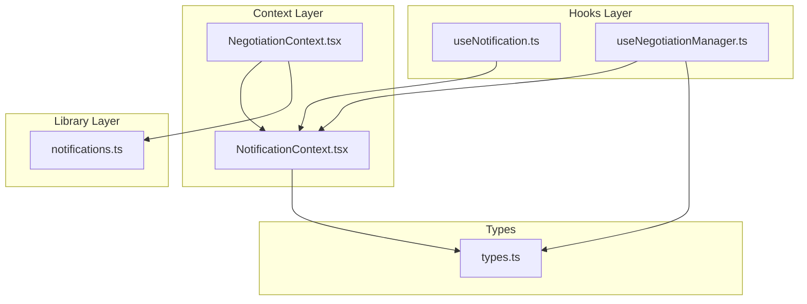
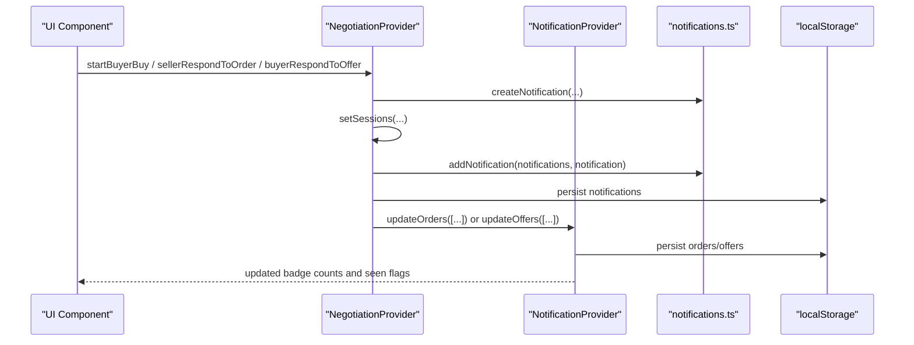
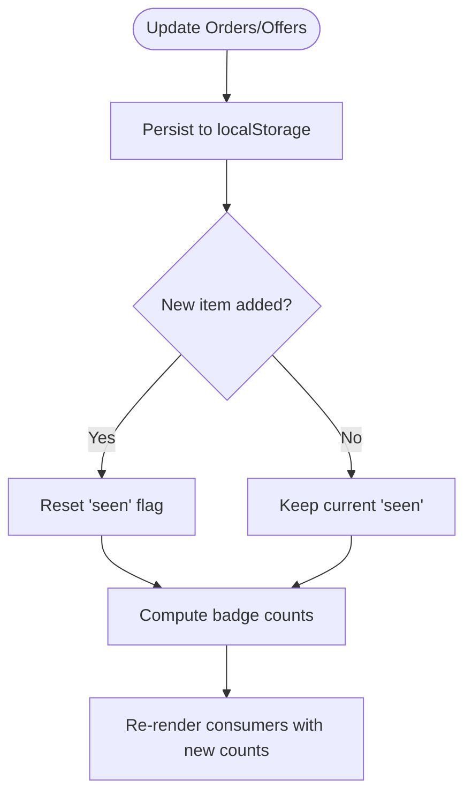
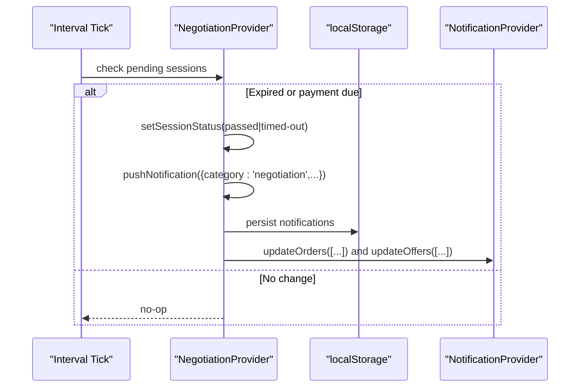
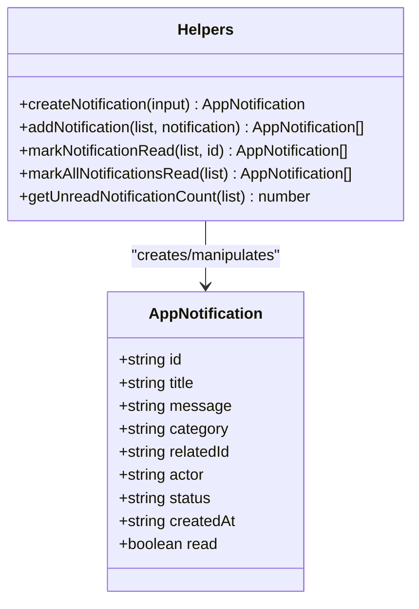
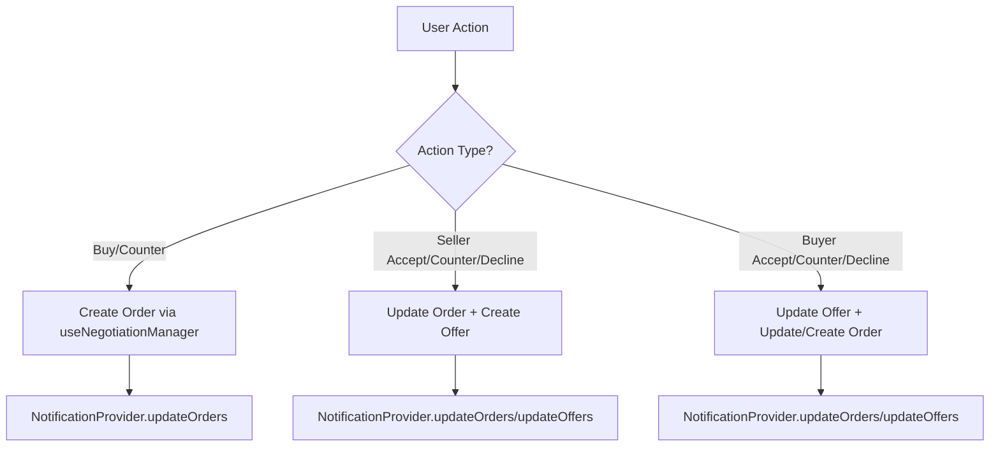
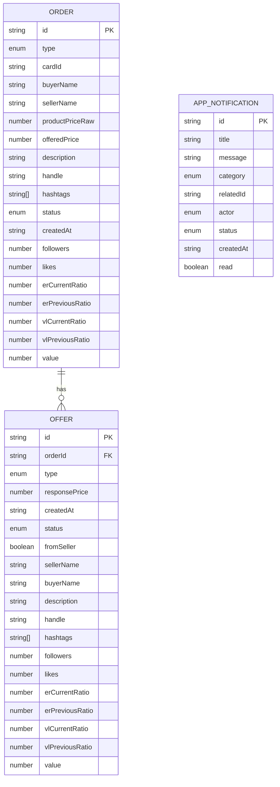
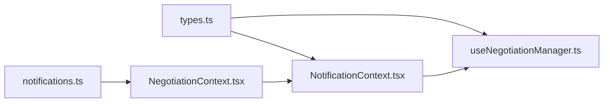

# Notification System

<cite>
**Referenced Files in This Document**
- [NotificationContext.tsx](file://src/context/NotificationContext.tsx)
- [useNotification.ts](file://src/hooks/useNotification.ts)
- [notifications.ts](file://src/lib/notifications.ts)
- [NegotiationContext.tsx](file://src/context/NegotiationContext.tsx)
- [useNegotiationManager.ts](file://src/hooks/useNegotiationManager.ts)
- [types.ts](file://src/types.ts)
</cite>

## Table of Contents
1. Introduction
2. Project Structure
3. Core Components
4. Architecture Overview
5. Detailed Component Analysis
6. Dependency Analysis
7. Performance Considerations
8. Troubleshooting Guide
9. Conclusion
10. Appendices

## Introduction
This document explains the notification system architecture in PortVille Market with a focus on:
- Global notification state management via a context provider pattern
- Creation, categorization, and read/unread tracking of notifications
- Notification types (order, offer, negotiation) and their metadata (actor, related IDs, status)
- localStorage persistence for cross-session continuity
- Integration between the negotiation flow and the notification system to auto-generate notifications during state transitions
- Practical examples: creating custom notifications, filtering by category, marking as read, and implementing counters
- Performance optimization techniques for large lists and UX best practices

## Project Structure
The notification system spans several layers:
- Context layer: global state for orders/offers and negotiation-specific notifications
- Hooks layer: convenient accessors to contexts
- Library layer: shared utilities for notification creation, updates, and counts
- Types: shared interfaces for orders, offers, and statuses

**Diagram sources**
- [NotificationContext.tsx:1-146](file://src/context/NotificationContext.tsx#L1-L146)
- [NegotiationContext.tsx:1-706](file://src/context/NegotiationContext.tsx#L1-L706)
- [useNotification.ts:1-8](file://src/hooks/useNotification.ts#L1-L8)
- [useNegotiationManager.ts:1-201](file://src/hooks/useNegotiationManager.ts#L1-L201)
- [notifications.ts:1-43](file://src/lib/notifications.ts#L1-L43)
- [types.ts:1-89](file://src/types.ts#L1-L89)

**Section sources**
- [NotificationContext.tsx:1-146](file://src/context/NotificationContext.tsx#L1-L146)
- [NegotiationContext.tsx:1-706](file://src/context/NegotiationContext.tsx#L1-L706)
- [useNotification.ts:1-8](file://src/hooks/useNotification.ts#L1-L8)
- [useNegotiationManager.ts:1-201](file://src/hooks/useNegotiationManager.ts#L1-L201)
- [notifications.ts:1-43](file://src/lib/notifications.ts#L1-L43)
- [types.ts:1-89](file://src/types.ts#L1-L89)

## Core Components
- NotificationProvider: Centralizes orders and offers arrays, computed badge counts, seen flags, and localStorage sync. Exposes update and mark-as-seen methods.
- useNotification: Hook that exposes NotificationContext to components.
- NegotiationProvider: Manages negotiation sessions, maintains its own notifications list, persists sessions/events/notifications to localStorage, and integrates with NotificationProvider to keep orders/offers in sync.
- Notifications library: Defines AppNotification schema, categories, actors, statuses, and helpers to create, add, mark read, and count unread notifications.
- useNegotiationManager: High-level actions to create orders and offers and to transition their statuses; used by UI flows.

Key responsibilities:
- Global state: orders/offers and badges in NotificationProvider
- Negotiation lifecycle: session state, timeouts, and event logging in NegotiationProvider
- Notification model and helpers: standardized creation and manipulation in notifications.ts
- Type safety: shared Order/Offer/status types in types.ts

**Section sources**
- [NotificationContext.tsx:22-146](file://src/context/NotificationContext.tsx#L22-L146)
- [useNotification.ts:1-8](file://src/hooks/useNotification.ts#L1-L8)
- [NegotiationContext.tsx:140-706](file://src/context/NegotiationContext.tsx#L140-L706)
- [notifications.ts:1-43](file://src/lib/notifications.ts#L1-L43)
- [useNegotiationManager.ts:1-201](file://src/hooks/useNegotiationManager.ts#L1-L201)
- [types.ts:1-89](file://src/types.ts#L1-L89)

## Architecture Overview
The system uses two cooperating providers:
- NotificationProvider manages marketplace-level notifications via orders/offers and computes badge counts. It persists these arrays to localStorage and resets “seen” flags when new items arrive.
- NegotiationProvider manages per-negotiation state and a separate notifications list. It persists sessions, events, and notifications to localStorage and pushes notifications into both its own list and the shared orders/offers via NotificationProvider.

**Diagram sources**
- [NegotiationContext.tsx:175-252](file://src/context/NegotiationContext.tsx#L175-L252)
- [NotificationContext.tsx:64-116](file://src/context/NotificationContext.tsx#L64-L116)
- [notifications.ts:17-42](file://src/lib/notifications.ts#L17-L42)

## Detailed Component Analysis

### NotificationProvider: Global Orders/Offers and Badge Counts
- State: orders, offers, isNotificationSeen, isCartSeen, isMounted
- Persistence: loads orders/offers from localStorage on mount; writes on updates; supports refresh
- Seen flags: reset when new orders/offers are added; manual mark-as-seen available
- Badge computation:
  - Unviewed orders: pending orders
  - Unviewed offers: offers from sellers with status sent
  - Bell badge = unviewed orders + unviewed offers
  - Cart badge = unviewed offers

**Diagram sources**
- [NotificationContext.tsx:64-116](file://src/context/NotificationContext.tsx#L64-L116)

**Section sources**
- [NotificationContext.tsx:22-146](file://src/context/NotificationContext.tsx#L22-L146)

### NegotiationProvider: Sessions, Timeouts, and Auto Notifications
- State: sessions map, notifications array, events array
- Persistence: persists sessions, notifications, and events to localStorage keys
- Timeouts: periodic tick checks expired pending states; transitions to passed/timed-out and emits notifications
- Integration:
  - On state transitions, creates AppNotification entries via notifications.ts helpers
  - Syncs orders/offers through NotificationProvider to reflect changes in badge counts and lists
- Actions:
  - Buyer buy/counter
  - Seller accept/counter/decline
  - Buyer accept/counter/decline on offers
  - Finalize payment

**Diagram sources**
- [NegotiationContext.tsx:181-252](file://src/context/NegotiationContext.tsx#L181-L252)

**Section sources**
- [NegotiationContext.tsx:140-706](file://src/context/NegotiationContext.tsx#L140-L706)

### Notifications Library: Model and Helpers
- Categories: order, offer, negotiation
- Actors: seller, buyer, system
- Statuses: pending, accepted, countered, declined, rejected, read, timed-out
- AppNotification fields: id, title, message, category, relatedId, actor, status, createdAt, read
- Helpers:
  - createNotification: generates id, timestamp, default read=false
  - addNotification: prepends and caps at 20 items
  - markNotificationRead / markAllNotificationsRead
  - getUnreadNotificationCount

**Diagram sources**
- [notifications.ts:1-43](file://src/lib/notifications.ts#L1-L43)

**Section sources**
- [notifications.ts:1-43](file://src/lib/notifications.ts#L1-L43)

### useNegotiationManager: High-Level Actions
- Creates orders and offers and updates their statuses based on user actions
- Bridges UI interactions with NotificationProvider state changes
- Examples:
  - buyerCreateOrder: adds a new order with type buy or counter
  - sellerAcceptOrder/sellerCounterOrder/sellerDeclineOrder: transitions order and creates corresponding offers
  - buyerAcceptOffer/buyerCounterOffer/buyerDeclineOffer: transitions offers and may create counter orders

**Diagram sources**
- [useNegotiationManager.ts:6-201](file://src/hooks/useNegotiationManager.ts#L6-L201)
- [NotificationContext.tsx:64-116](file://src/context/NotificationContext.tsx#L64-L116)

**Section sources**
- [useNegotiationManager.ts:1-201](file://src/hooks/useNegotiationManager.ts#L1-L201)

### Data Models and Relationships
- Order: identifies a transaction attempt with type (buy/counter), statuses, pricing, and optional card linkage
- Offer: represents responses from sellers with type (accept/counter), statuses, and linkage back to an order
- AppNotification: generic notification with category, actor, relatedId, and read status

**Diagram sources**
- [types.ts:1-89](file://src/types.ts#L1-L89)
- [notifications.ts:5-15](file://src/lib/notifications.ts#L5-L15)

**Section sources**
- [types.ts:1-89](file://src/types.ts#L1-L89)
- [notifications.ts:1-43](file://src/lib/notifications.ts#L1-L43)

## Dependency Analysis
- NotificationProvider depends on types.ts for Order/Offer shapes and provides global state consumed by hooks and other contexts.
- NegotiationProvider depends on:
  - notifications.ts for AppNotification model and helpers
  - NotificationProvider to synchronize orders/offers and trigger badge updates
  - localStorage for persistence of sessions, notifications, and events
- useNegotiationManager depends on NotificationProvider via useNotification hook to mutate orders/offers.

**Diagram sources**
- [NotificationContext.tsx:1-146](file://src/context/NotificationContext.tsx#L1-L146)
- [NegotiationContext.tsx:1-706](file://src/context/NegotiationContext.tsx#L1-L706)
- [useNegotiationManager.ts:1-201](file://src/hooks/useNegotiationManager.ts#L1-L201)
- [notifications.ts:1-43](file://src/lib/notifications.ts#L1-L43)
- [types.ts:1-89](file://src/types.ts#L1-L89)

**Section sources**
- [NotificationContext.tsx:1-146](file://src/context/NotificationContext.tsx#L1-L146)
- [NegotiationContext.tsx:1-706](file://src/context/NegotiationContext.tsx#L1-L706)
- [useNegotiationManager.ts:1-201](file://src/hooks/useNegotiationManager.ts#L1-L201)
- [notifications.ts:1-43](file://src/lib/notifications.ts#L1-L43)
- [types.ts:1-89](file://src/types.ts#L1-L89)

## Performance Considerations
- Cap notification history: addNotification limits to 20 items to prevent unbounded growth.
- Batch updates: updateOrders/updateOffers replace entire arrays rather than mutating in place; consider debouncing rapid updates if needed.
- Avoid heavy computations in render: badge counts are derived from small arrays; for large datasets, consider memoization or virtualized lists.
- LocalStorage I/O: reads occur once on mount; writes occur on state changes. For very frequent updates, consider throttling writes or using a write queue.
- Interval tick: negotiation timeout checks run every 30 seconds; ensure logic remains efficient and avoid unnecessary re-renders.

[No sources needed since this section provides general guidance]

## Troubleshooting Guide
- Missing provider error: Using useNotificationContext or useNegotiationContext outside their respective providers throws an error. Ensure providers wrap the app tree.
- Parsing errors: If localStorage contains malformed JSON, parsing failures are caught and logged; verify stored values or clear storage.
- Stale data: After clearing browser storage, call refresh in NotificationProvider to reload persisted orders/offers.
- Badge not updating: Ensure updateOrders/updateOffers are called with new arrays and that isMounted is true before resetting seen flags.
- Negotiation timeouts: Verify updatedAt and paymentDueAt timestamps; confirm interval is running and not cleared prematurely.

**Section sources**
- [NotificationContext.tsx:29-85](file://src/context/NotificationContext.tsx#L29-L85)
- [NegotiationContext.tsx:146-173](file://src/context/NegotiationContext.tsx#L146-L173)
- [NegotiationContext.tsx:181-252](file://src/context/NegotiationContext.tsx#L181-L252)

## Conclusion
PortVille Market’s notification system combines a global orders/offers context with a negotiation-specific notification store. The design ensures:
- Consistent badge indicators across the app
- Automatic notification generation during negotiation state transitions
- Robust persistence via localStorage for resilience across sessions
- Clear separation of concerns between global state and negotiation logic

Adhering to the patterns and recommendations above will help maintain scalability and a smooth user experience.

[No sources needed since this section summarizes without analyzing specific files]

## Appendices

### Examples and Best Practices

- Creating custom notifications
  - Use createNotification and addNotification from notifications.ts to build structured notifications with category, actor, relatedId, and status.
  - Push them into the negotiation notifications list via NegotiationProvider’s pushNotification helper.

- Filtering by category
  - Filter AppNotification[] by category ('order', 'offer', 'negotiation') to render grouped views.

- Marking notifications as read
  - Use markNotificationRead for single items or markAllNotificationsRead to clear all unread.
  - For global badges tied to orders/offers, call markNotificationsAsSeen/markCartAsSeen from NotificationProvider.

- Implementing notification counters
  - Use getUnreadNotificationCount for negotiation notifications.
  - For global badges, rely on notificationCount and cartCount exposed by NotificationProvider.

- UX best practices
  - Show unread counts prominently but allow one-tap dismissal.
  - Group notifications by category and sort by newest first.
  - Provide quick actions (e.g., “View order”, “View offer”) linked via relatedId.
  - Respect cooldowns and avoid spamming users with repeated notifications.

[No sources needed since this section provides general guidance]